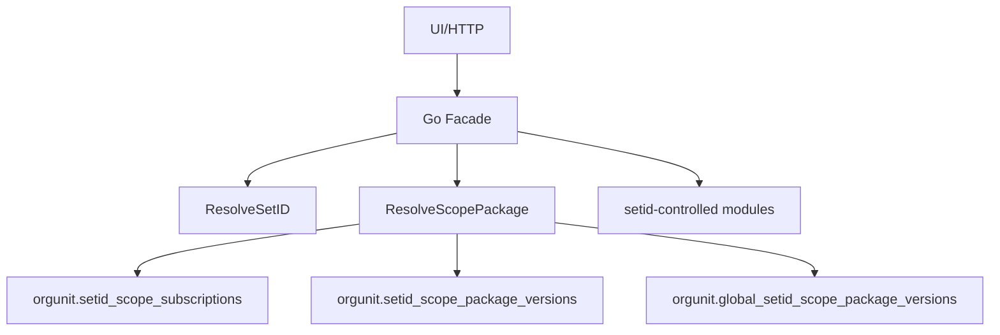

# [Archived] DEV-PLAN-071：SetID Scope Package 订阅详细设计

**状态**: 进行中（2026-01-30 00:13 UTC；2026-02-22 起时间参数口径由 `DEV-PLAN-102B`/`STD-002` 约束）

> 勘误（2026-02-22）：本文中凡出现“`as_of`/`effective_date` 为空默认 `current_date`”的描述，统一废止。现行口径：`as_of` 与 `effective_date` 必填，缺失即 fail-closed（`invalid_as_of` / `invalid_effective_date`）。
>
> 勘误（2026-02-22）：本文中凡出现“运行时读取 global/shared 包”的描述，统一降级为历史阶段口径。现行目标口径以 `DEV-PLAN-070B` 为准：运行时只解析租户本地包，平台共享能力通过发布任务落地到目标租户后再读取。

## 1. 背景与上下文 (Context)
- **需求来源**：`docs/archive/dev-plans/070-setid-orgunit-binding-redesign.md`
- **当前痛点**：070 方案把 SetID 作为配置主数据的显式入口，但同一 SetID 只能指向一套“全域配置组合”，无法表达“同一 SetID 在不同配置域选择不同方案”，导致 SetID 膨胀与配置重复。
- **业务价值**：通过 `scope_code + scope_package` 实现配置方案的复用与组合，降低重复配置并保持可审计与可回放。

### 1.1 现状图（简述）
- 070 已定义 `ResolveSetID`：SetID 与 OrgUnit 绑定，业务模块以 SetID 作为配置主入口。
- 共享配置采用全局表 + RLS 共享读开关（`app.allow_share_read`），普通租户不可见共享数据列表。
- 目前缺少按配置域拆分的订阅层，SetID 承担“整包配置集”的角色，导致膨胀与重复。

### 1.2 约束清单（强约束）
- One Door：写入必须走 `submit_*_event(...)`；禁止第二写入口。
- No Tx, No RLS：访问 tenant 表必须显式事务 + 注入 `app.current_tenant`，缺失即 fail-closed。
- Valid Time：生效语义为 `date`（day 粒度）。
- 共享可见性：`shared-only` 对普通租户不可见，读取必须显式共享读开关。
- 禁止 legacy/回退通道；不引入新 Feature Flag。

### 1.3 风险点与验证（最小清单）
- 包版本投射与 `as_of_date` 解析一致性：单测覆盖切片与回放。
- 共享读上下文污染：SECURITY DEFINER 入口内切换并恢复上下文。
- 默认订阅与回填：新增 stable scope 必须回填并记录证据。
- 排他约束与有效期切片：订阅 overlap 必须稳定失败。

## 2. 目标与非目标 (Goals & Non-Goals)
- **核心目标**：
  - [ ] 保留“租户内全局唯一 SetID”口径与 070 的解析入口。
  - [ ] 引入 `scope_code` 与 `scope_package`，支持 `setid -> scope_code -> package` 订阅关系，并以 `as_of_date` 生效。
  - [ ] 包状态按 Valid Time（date）投射到版本表，`as_of_date` 解析以包版本为准（可审计/可回放）。
  - [ ] 共享包采用物理隔离表，读取必须显式共享读开关，且禁止 OR 读混用。
  - [ ] 新建 SetID 自动写入默认订阅（所有稳定 `scope_code` -> `DEFLT` 包）。
  - [ ] `ResolveScopePackage` 成为唯一权威入口，fail-closed。
  - [ ] 对齐 One Door / No Tx, No RLS / Valid Time（date）不变量。
  - [ ] 通过本计划触发的所有门禁（至少 `make check lint`，其余按 2.1 勾选项执行）。
- **非目标**：
  - 不做跨域运行时合并/覆盖规则。
  - 不引入旧 `setid` 直连配置表的兼容分支。
  - 不改变 070 的“org_unit 解析 SetID”主流程。
  - 不引入新的 Feature Flag（对齐 `AGENTS.md`）。
  - 不提供包历史版本的 UI/公开查询接口（仅用于解析与审计）。
  - 共享白名单配置数据的具体业务表/入口由各模块另案落实，本计划只定义订阅治理与解析机制。

## 2.1 工具链与门禁（SSOT 引用）
- **触发器清单（勾选本计划命中的项）**：
  - [x] Go 代码（`go fmt ./... && go vet ./... && make check lint && make test`）
  - [x] `.templ` / Tailwind（`make generate && make css`，并确保生成物提交）
  - [ ] 多语言 JSON（`make check tr`）
  - [x] Authz（`make authz-pack && make authz-test && make authz-lint`）
  - [x] 路由治理（`make check routing`）
  - [x] DB 迁移 / Schema（按模块 `Makefile` 入口执行）
  - [ ] sqlc（如引入 sqlc 代码生成，则 `make sqlc-generate`）
  - [ ] Outbox（按 `DEV-PLAN-017` 与 runbook 约定执行与验收）
  - [x] 文档（`make check doc`）
- **SSOT 链接**：
  - `AGENTS.md`
  - `Makefile`
  - `.github/workflows/quality-gates.yml`

## 3. 架构与关键决策 (Architecture & Decisions)
### 3.1 架构图 (Mermaid)


### 3.2 关键设计决策 (ADR 摘要)
- **决策 1：引入 scope_package 层**
  - 选项 A：继续用 SetID 直接区分配置集。缺点：SetID 膨胀、无法组合。
  - 选项 B（选定）：新增 `scope_code + package` 订阅层，实现组合与复用。
- **决策 2：共享包物理隔离**
  - 选项 A：共享/租户共表并 OR 读取。缺点：违反 070 的隔离与 RLS 规则。
  - 选项 B（选定）：共享包独立表 + 显式共享读开关。
- **决策 3：默认订阅**
  - 选项 A：运行时缺订阅自动回退 `DEFLT`。缺点：隐式逻辑不可审计。
  - 选项 B（选定）：SetID 创建时显式写入 `DEFLT` 订阅，缺失订阅 fail-closed。
- **决策 4：包的时间语义**
  - 选项 A：包只保留当前 `status`，`as_of_date` 仅作用于订阅。缺点：历史回放不可靠、与“可审计/可回放”目标冲突。
  - 选项 B（选定）：包按 `effective_date` 投射到版本表（`validity`），`as_of_date` 解析命中包版本。优点：语义一致、可回放。

### 3.3 scope_code 划分与清单
- **划分原则（强制）**：
  - 配置域优先：以“可独立选择的一套配置方案”为边界，不以单表/字段为边界。
  - 强耦合同域：存在硬不变量或强引用关系的配置必须归同一 scope。
  - 生命周期独立才拆分：维护责任、变更频率、审计口径可独立时才允许拆分 scope。
  - 单一归属：每个 scope_code 只能归属一个模块。
  - 唯一映射：任一配置数据只能映射到一个 scope_code。
  - 前缀规则：scope_code 前缀仅表达归属模块，不表达共享/开通状态。
  - 格式规则：`scope_code` 使用 `^[a-z0-9_]{1,64}$`，不允许空格与中划线。
- **共享模式定义**：
  - `tenant-only`：只允许订阅租户包，禁止订阅共享包。
  - `shared-only`：只允许订阅共享包，禁止租户包。
  - `shared-allowed`：允许同时存在租户包与共享包（本期不启用，仅为扩展预留）。
- **scope_code 注册表（SSOT）**：
  - 以 DB 函数 `orgunit.scope_code_registry()` 作为唯一权威清单，供写入口校验与默认订阅生成使用。
  - 文档清单仅作为说明快照；如有冲突以 `scope_code_registry()` 为准（可由脚本生成）。
  - `is_stable=true` 表示 SetID 创建时需要自动订阅的稳定 scope。
- **首批 scope_code 清单（快照，以 registry 为准）**：
  | scope_code | 归属模块 | 共享模式 | 范围说明 |
  | --- | --- | --- | --- |
  | `jobcatalog` | `jobcatalog` | `tenant-only` | 职位目录主数据（Job Family Group/Family/Level/Profile） |
  | `orgunit_geo_admin` | `orgunit` | `shared-only` | 国家/省市等行政区划 |
  | `orgunit_location` | `orgunit` | `shared-only` | 地点与地点类型 |
  | `person_school` | `person` | `shared-only` | 学校 |
  | `person_education_type` | `person` | `shared-only` | 学历类型 |
  | `person_credential_type` | `person` | `shared-only` | 资格证书/证照类型 |
- **配置数据登记清单（当前已知）**：
  | scope_code | 归属模块 | 配置表/入口 | 包字段 | 共享模式 |
  | --- | --- | --- | --- | --- |
  | `jobcatalog` | `jobcatalog` | DB: `jobcatalog.job_family_groups/job_families/job_levels/job_profiles`（含 `*_events/*_versions`、`job_profile_version_job_families`）；UI: `/org/job-catalog` | `package_id` | `tenant-only` |
  | `orgunit_geo_admin` | `orgunit` | 未落地（共享白名单，表/入口待定义） | `package_id` | `shared-only` |
  | `orgunit_location` | `orgunit` | 未落地（共享白名单，表/入口待定义） | `package_id` | `shared-only` |
  | `person_school` | `person` | 未落地（共享白名单，表/入口待定义） | `package_id` | `shared-only` |
  | `person_education_type` | `person` | 未落地（共享白名单，表/入口待定义） | `package_id` | `shared-only` |
  | `person_credential_type` | `person` | 未落地（共享白名单，表/入口待定义） | `package_id` | `shared-only` |
- **避免遗漏的流程约束**：
  - 新增配置数据必须在对应 dev-plan 中声明其 `scope_code` 并更新本清单。
  - 新增配置表若引入 `package_id`，必须补齐清单项与解析入口说明。
  - PR 评审必须检查：是否新增/调整配置数据、是否需要包选择、是否已登记 scope_code。

### 3.4 归属与调用链（明确）
- 治理元数据归 `orgunit`：维护 `setid_scope_packages` / `setid_scope_package_versions` / `setid_scope_subscriptions`，提供 **DB 函数** `orgunit.resolve_scope_package(...)`（`SECURITY DEFINER`），`as_of_date` 解析基于版本表；Go 仅调用该函数，不做共享上下文切换。
- 业务模块归属配置数据：写入口先解析 `package_id`，再把 `package_id` 写入业务配置表。
- 跨模块调用：通过 `pkg/**` 封装解析函数，禁止 Go 代码跨模块 import。

## 4. 数据模型与约束 (Data Model & Constraints)
> 具体建表需用户确认（对齐 `AGENTS.md` 新增表确认要求）。

### 4.1 Schema 定义 (SQL)
```sql
CREATE OR REPLACE FUNCTION orgunit.scope_code_registry()
RETURNS TABLE(scope_code text, owner_module text, share_mode text, is_stable boolean) AS $$
  VALUES
    ('jobcatalog', 'jobcatalog', 'tenant-only', true),
    ('orgunit_geo_admin', 'orgunit', 'shared-only', true),
    ('orgunit_location', 'orgunit', 'shared-only', true),
    ('person_school', 'person', 'shared-only', true),
    ('person_education_type', 'person', 'shared-only', true),
    ('person_credential_type', 'person', 'shared-only', true)
$$ LANGUAGE SQL IMMUTABLE;

CREATE OR REPLACE FUNCTION orgunit.scope_code_is_valid(p_scope_code text)
RETURNS boolean AS $$
  SELECT EXISTS (
    SELECT 1 FROM orgunit.scope_code_registry() WHERE scope_code = p_scope_code
  );
$$ LANGUAGE SQL IMMUTABLE;

CREATE OR REPLACE FUNCTION orgunit.scope_code_share_mode(p_scope_code text)
RETURNS text AS $$
  SELECT share_mode FROM orgunit.scope_code_registry() WHERE scope_code = p_scope_code
$$ LANGUAGE SQL IMMUTABLE;

CREATE OR REPLACE FUNCTION orgunit.assert_scope_package_active_as_of(
  p_tenant_id uuid,
  p_scope_code text,
  p_package_id uuid,
  p_package_owner_tenant_uuid uuid,
  p_as_of_date date
)
RETURNS void
LANGUAGE plpgsql
SECURITY DEFINER
AS $$
DECLARE
  v_scope_mode text;
  v_ctx_tenant text;
  v_allow_share text;
BEGIN
  PERFORM orgunit.assert_current_tenant(p_tenant_id);

  IF p_scope_code IS NULL OR NOT orgunit.scope_code_is_valid(p_scope_code) THEN
    RAISE EXCEPTION USING MESSAGE = 'SCOPE_CODE_INVALID';
  END IF;
  IF p_package_id IS NULL THEN
    RAISE EXCEPTION USING MESSAGE = 'PACKAGE_NOT_FOUND';
  END IF;
  IF p_as_of_date IS NULL THEN
    RAISE EXCEPTION USING MESSAGE = 'ORG_INVALID_ARGUMENT', DETAIL = 'as_of_date is required';
  END IF;

  v_scope_mode := orgunit.scope_code_share_mode(p_scope_code);
  v_ctx_tenant := current_setting('app.current_tenant');
  v_allow_share := current_setting('app.allow_share_read', true);

  IF p_package_owner_tenant_uuid = p_tenant_id THEN
    IF v_scope_mode = 'shared-only' THEN
      RAISE EXCEPTION USING MESSAGE = 'PACKAGE_SCOPE_MISMATCH';
    END IF;
    IF NOT EXISTS (
      SELECT 1
      FROM orgunit.setid_scope_packages p
      WHERE p.tenant_id = p_tenant_id
        AND p.scope_code = p_scope_code
        AND p.package_id = p_package_id
    ) THEN
      RAISE EXCEPTION USING MESSAGE = 'PACKAGE_NOT_FOUND';
    END IF;
    IF NOT EXISTS (
      SELECT 1
      FROM orgunit.setid_scope_package_versions v
      WHERE v.tenant_id = p_tenant_id
        AND v.scope_code = p_scope_code
        AND v.package_id = p_package_id
        AND v.validity @> p_as_of_date
        AND v.status = 'active'
    ) THEN
      RAISE EXCEPTION USING MESSAGE = 'PACKAGE_INACTIVE_AS_OF';
    END IF;
  ELSIF p_package_owner_tenant_uuid = orgunit.global_tenant_id() THEN
    IF v_scope_mode = 'tenant-only' THEN
      RAISE EXCEPTION USING MESSAGE = 'PACKAGE_SCOPE_MISMATCH';
    END IF;
    PERFORM set_config('app.current_tenant', orgunit.global_tenant_id()::text, true);
    PERFORM set_config('app.allow_share_read', 'on', true);
    IF NOT EXISTS (
      SELECT 1
      FROM orgunit.global_setid_scope_packages p
      WHERE p.tenant_id = orgunit.global_tenant_id()
        AND p.scope_code = p_scope_code
        AND p.package_id = p_package_id
    ) THEN
      RAISE EXCEPTION USING MESSAGE = 'PACKAGE_NOT_FOUND';
    END IF;
    IF NOT EXISTS (
      SELECT 1
      FROM orgunit.global_setid_scope_package_versions v
      WHERE v.tenant_id = orgunit.global_tenant_id()
        AND v.scope_code = p_scope_code
        AND v.package_id = p_package_id
        AND v.validity @> p_as_of_date
        AND v.status = 'active'
    ) THEN
      RAISE EXCEPTION USING MESSAGE = 'PACKAGE_INACTIVE_AS_OF';
    END IF;
  ELSE
    RAISE EXCEPTION USING MESSAGE = 'PACKAGE_OWNER_INVALID';
  END IF;

  PERFORM set_config('app.current_tenant', v_ctx_tenant, true);
  PERFORM set_config('app.allow_share_read', COALESCE(v_allow_share, 'off'), true);
END;
$$;

CREATE TABLE orgunit.setid_scope_packages (
  tenant_id uuid NOT NULL,
  scope_code text NOT NULL,
  package_id uuid NOT NULL,
  package_code text NOT NULL,
  name text NOT NULL,
  status text NOT NULL DEFAULT 'active',
  created_at timestamptz NOT NULL DEFAULT now(),
  updated_at timestamptz NOT NULL DEFAULT now(),
  CONSTRAINT setid_scope_packages_pk PRIMARY KEY (tenant_id, package_id),
  CONSTRAINT setid_scope_packages_code_unique UNIQUE (tenant_id, scope_code, package_code),
  CONSTRAINT setid_scope_packages_scope_code_check CHECK (orgunit.scope_code_is_valid(scope_code)),
  CONSTRAINT setid_scope_packages_code_check CHECK (package_code ~ '^[A-Z0-9_]{1,16}$'),
  CONSTRAINT setid_scope_packages_status_check CHECK (status IN ('active', 'disabled')),
  CONSTRAINT setid_scope_packages_deflt_active_check CHECK (package_code <> 'DEFLT' OR status = 'active')
);

CREATE TABLE orgunit.global_setid_scope_packages (
  tenant_id uuid NOT NULL DEFAULT orgunit.global_tenant_id(),
  scope_code text NOT NULL,
  package_id uuid NOT NULL,
  package_code text NOT NULL,
  name text NOT NULL,
  status text NOT NULL DEFAULT 'active',
  created_at timestamptz NOT NULL DEFAULT now(),
  updated_at timestamptz NOT NULL DEFAULT now(),
  CONSTRAINT global_scope_packages_pk PRIMARY KEY (tenant_id, package_id),
  CONSTRAINT global_scope_packages_tenant_check CHECK (tenant_id = orgunit.global_tenant_id()),
  CONSTRAINT global_scope_packages_code_unique UNIQUE (tenant_id, scope_code, package_code),
  CONSTRAINT global_scope_packages_scope_code_check CHECK (orgunit.scope_code_is_valid(scope_code)),
  CONSTRAINT global_scope_packages_code_check CHECK (package_code ~ '^[A-Z0-9_]{1,16}$'),
  CONSTRAINT global_scope_packages_status_check CHECK (status IN ('active', 'disabled')),
  CONSTRAINT global_scope_packages_deflt_active_check CHECK (package_code <> 'DEFLT' OR status = 'active')
);

CREATE TABLE orgunit.setid_scope_package_events (
  id bigserial PRIMARY KEY,
  event_id uuid NOT NULL DEFAULT gen_random_uuid(),
  tenant_id uuid NOT NULL,
  scope_code text NOT NULL,
  package_id uuid NOT NULL,
  event_type text NOT NULL,
  effective_date date NOT NULL,
  payload jsonb NOT NULL DEFAULT '{}'::jsonb,
  request_id text NOT NULL,
  initiator_id uuid NOT NULL,
  transaction_time timestamptz NOT NULL DEFAULT now(),
  created_at timestamptz NOT NULL DEFAULT now(),
  CONSTRAINT setid_scope_package_events_event_id_unique UNIQUE (event_id),
  CONSTRAINT setid_scope_package_events_request_id_unique UNIQUE (tenant_id, request_id),
  CONSTRAINT setid_scope_package_events_event_type_check CHECK (event_type IN ('BOOTSTRAP', 'CREATE', 'RENAME', 'DISABLE')),
  CONSTRAINT setid_scope_package_events_scope_code_check CHECK (orgunit.scope_code_is_valid(scope_code)),
  CONSTRAINT setid_scope_package_events_payload_is_object_check CHECK (jsonb_typeof(payload) = 'object')
);

CREATE TABLE orgunit.global_setid_scope_package_events (
  id bigserial PRIMARY KEY,
  event_id uuid NOT NULL DEFAULT gen_random_uuid(),
  tenant_id uuid NOT NULL DEFAULT orgunit.global_tenant_id(),
  scope_code text NOT NULL,
  package_id uuid NOT NULL,
  event_type text NOT NULL,
  effective_date date NOT NULL,
  payload jsonb NOT NULL DEFAULT '{}'::jsonb,
  request_id text NOT NULL,
  initiator_id uuid NOT NULL,
  transaction_time timestamptz NOT NULL DEFAULT now(),
  created_at timestamptz NOT NULL DEFAULT now(),
  CONSTRAINT global_scope_package_events_event_id_unique UNIQUE (event_id),
  CONSTRAINT global_scope_package_events_request_id_unique UNIQUE (tenant_id, request_id),
  CONSTRAINT global_scope_package_events_event_type_check CHECK (event_type IN ('BOOTSTRAP', 'CREATE', 'RENAME', 'DISABLE')),
  CONSTRAINT global_scope_package_events_tenant_check CHECK (tenant_id = orgunit.global_tenant_id()),
  CONSTRAINT global_scope_package_events_scope_code_check CHECK (orgunit.scope_code_is_valid(scope_code)),
  CONSTRAINT global_scope_package_events_payload_is_object_check CHECK (jsonb_typeof(payload) = 'object')
);

CREATE TABLE orgunit.setid_scope_package_versions (
  id bigserial PRIMARY KEY,
  tenant_id uuid NOT NULL,
  scope_code text NOT NULL,
  package_id uuid NOT NULL,
  package_code text NOT NULL,
  name text NOT NULL,
  status text NOT NULL DEFAULT 'active',
  validity daterange NOT NULL,
  last_event_id bigint NOT NULL REFERENCES orgunit.setid_scope_package_events(id),
  CONSTRAINT setid_scope_package_versions_pkg_fk FOREIGN KEY (tenant_id, package_id)
    REFERENCES orgunit.setid_scope_packages (tenant_id, package_id),
  CONSTRAINT setid_scope_package_versions_scope_code_check CHECK (orgunit.scope_code_is_valid(scope_code)),
  CONSTRAINT setid_scope_package_versions_code_check CHECK (package_code ~ '^[A-Z0-9_]{1,16}$'),
  CONSTRAINT setid_scope_package_versions_status_check CHECK (status IN ('active', 'disabled')),
  CONSTRAINT setid_scope_package_versions_deflt_active_check CHECK (package_code <> 'DEFLT' OR status = 'active'),
  CONSTRAINT setid_scope_package_versions_validity_check CHECK (NOT isempty(validity)),
  CONSTRAINT setid_scope_package_versions_validity_bounds_check CHECK (lower_inc(validity) AND NOT upper_inc(validity)),
  CONSTRAINT setid_scope_package_versions_no_overlap EXCLUDE USING gist (
    tenant_id WITH =,
    package_id WITH =,
    validity WITH &&
  )
);

CREATE TABLE orgunit.global_setid_scope_package_versions (
  id bigserial PRIMARY KEY,
  tenant_id uuid NOT NULL DEFAULT orgunit.global_tenant_id(),
  scope_code text NOT NULL,
  package_id uuid NOT NULL,
  package_code text NOT NULL,
  name text NOT NULL,
  status text NOT NULL DEFAULT 'active',
  validity daterange NOT NULL,
  last_event_id bigint NOT NULL REFERENCES orgunit.global_setid_scope_package_events(id),
  CONSTRAINT global_scope_package_versions_pkg_fk FOREIGN KEY (tenant_id, package_id)
    REFERENCES orgunit.global_setid_scope_packages (tenant_id, package_id),
  CONSTRAINT global_scope_package_versions_tenant_check CHECK (tenant_id = orgunit.global_tenant_id()),
  CONSTRAINT global_scope_package_versions_scope_code_check CHECK (orgunit.scope_code_is_valid(scope_code)),
  CONSTRAINT global_scope_package_versions_code_check CHECK (package_code ~ '^[A-Z0-9_]{1,16}$'),
  CONSTRAINT global_scope_package_versions_status_check CHECK (status IN ('active', 'disabled')),
  CONSTRAINT global_scope_package_versions_deflt_active_check CHECK (package_code <> 'DEFLT' OR status = 'active'),
  CONSTRAINT global_scope_package_versions_validity_check CHECK (NOT isempty(validity)),
  CONSTRAINT global_scope_package_versions_validity_bounds_check CHECK (lower_inc(validity) AND NOT upper_inc(validity)),
  CONSTRAINT global_scope_package_versions_no_overlap EXCLUDE USING gist (
    tenant_id WITH =,
    package_id WITH =,
    validity WITH &&
  )
);

CREATE TABLE orgunit.setid_scope_subscription_events (
  id bigserial PRIMARY KEY,
  event_id uuid NOT NULL DEFAULT gen_random_uuid(),
  tenant_id uuid NOT NULL,
  setid text NOT NULL,
  scope_code text NOT NULL,
  package_id uuid NOT NULL,
  package_owner_tenant_uuid uuid NOT NULL,
  event_type text NOT NULL,
  effective_date date NOT NULL,
  payload jsonb NOT NULL DEFAULT '{}'::jsonb,
  request_id text NOT NULL,
  initiator_id uuid NOT NULL,
  transaction_time timestamptz NOT NULL DEFAULT now(),
  created_at timestamptz NOT NULL DEFAULT now(),
  CONSTRAINT setid_scope_subscription_events_event_id_unique UNIQUE (event_id),
  CONSTRAINT setid_scope_subscription_events_request_id_unique UNIQUE (tenant_id, request_id),
  CONSTRAINT setid_scope_subscription_events_event_type_check CHECK (event_type IN ('BOOTSTRAP', 'SUBSCRIBE')),
  CONSTRAINT setid_scope_subscription_events_scope_code_check CHECK (orgunit.scope_code_is_valid(scope_code)),
  CONSTRAINT setid_scope_subscription_events_setid_format_check CHECK (setid ~ '^[A-Z0-9]{5}$'),
  CONSTRAINT setid_scope_subscription_events_owner_check CHECK (
    package_owner_tenant_uuid = tenant_id OR package_owner_tenant_uuid = orgunit.global_tenant_id()
  ),
  CONSTRAINT setid_scope_subscription_events_payload_is_object_check CHECK (jsonb_typeof(payload) = 'object')
);

CREATE TABLE orgunit.setid_scope_subscriptions (
  id bigserial PRIMARY KEY,
  tenant_id uuid NOT NULL,
  setid text NOT NULL,
  scope_code text NOT NULL,
  package_id uuid NOT NULL,
  package_owner_tenant_uuid uuid NOT NULL,
  validity daterange NOT NULL,
  last_event_id bigint NOT NULL REFERENCES orgunit.setid_scope_subscription_events(id),
  created_at timestamptz NOT NULL DEFAULT now(),
  updated_at timestamptz NOT NULL DEFAULT now(),
  CONSTRAINT setid_scope_subscriptions_setid_format_check CHECK (setid ~ '^[A-Z0-9]{5}$'),
  CONSTRAINT setid_scope_subscriptions_scope_code_check CHECK (orgunit.scope_code_is_valid(scope_code)),
  CONSTRAINT setid_scope_subscriptions_setid_fk FOREIGN KEY (tenant_id, setid) REFERENCES orgunit.setids (tenant_id, setid),
  CONSTRAINT setid_scope_subscriptions_validity_check CHECK (lower_inc(validity) AND NOT upper_inc(validity)),
  CONSTRAINT setid_scope_subscriptions_owner_check CHECK (
    package_owner_tenant_uuid = tenant_id OR package_owner_tenant_uuid = orgunit.global_tenant_id()
  ),
  CONSTRAINT setid_scope_subscriptions_no_overlap EXCLUDE USING gist (
    tenant_id WITH =,
    setid WITH =,
    scope_code WITH =,
    validity WITH &&
  )
);
```

**约束说明**：
- `setid_scope_subscriptions` 不设 `package_id` 外键（跨 owner 无法表达），通过 `orgunit.assert_scope_package_active_as_of(...)` 在写入口强制校验。

**索引建议**：
- `setid_scope_subscriptions(tenant_id, setid, scope_code, validity)` 用于解析命中。
- `setid_scope_subscriptions(tenant_id, setid, scope_code, lower(validity))` 用于按时间点快速定位。
- `setid_scope_packages(tenant_id, scope_code, package_code)` 与 `global_setid_scope_packages(tenant_id, scope_code, package_code)` 用于包查找。
- `setid_scope_package_versions` / `global_setid_scope_package_versions`：
  - `(tenant_id, package_id, lower(validity))` 用于按 `as_of_date` 定位版本。
  - GIST `(tenant_id, package_id, validity)` 用于范围命中（可选加 `WHERE status = 'active'`）。
- `setid_scope_package_events(tenant_id, transaction_time DESC, id DESC)` 与 `global_setid_scope_package_events(tenant_id, transaction_time DESC, id DESC)` 用于审计查询。
- `setid_scope_subscription_events(tenant_id, setid, scope_code, effective_date, id)` 用于订阅历史查询。

### 4.2 迁移策略
- **Up**：
  - 启用 `btree_gist` 扩展（用于排他约束）。
  - 创建 `scope_code_registry()` 与校验函数。
  - 创建包/订阅/事件/版本表与约束。
  - 启用 RLS 策略（租户隔离 + 共享读开关）。
  - 新增 `orgunit.resolve_scope_package` / `orgunit.assert_scope_package_active_as_of` 解析与校验函数（DB），并设定最小权限 owner 与 `search_path`。
  - 新增包版本投射：`submit_*_event` 同步更新版本表，或提供 `replay_*_versions` 回放函数。
  - 修改 setid-controlled 模块读写口径：使用 `package_id`。
  - 引导数据：
    - 为每个 `scope_code` 创建 `DEFLT` 包（shared-only 用 global 包，tenant-only 用租户包），请求号建议 `bootstrap:deflt:<scope_code>`。
    - 为存量 SetID 写入默认订阅事件（`event_type=BOOTSTRAP`，`effective_date=<bootstrap_anchor_date>`），`bootstrap_anchor_date` 必须显式提供且通过 root BU 有效性校验。
    - 通过包事件回放生成版本切片（或在 bootstrap 创建时同步投射）。
  - **新增 stable scope 的常规回填**：
    - 创建 `DEFLT` 包并生成有效版本切片（`effective_date=<bootstrap_anchor_date>`，显式参数）。
    - 对所有存量 SetID 写入订阅事件（`BOOTSTRAP`，`effective_date=<bootstrap_anchor_date>`，显式参数）。
    - 校验订阅数量与存量 SetID 数量一致，并记录证据到 `dev-records`。
- **Down**：
  - 生产不做破坏性 Down；回滚走停写 + 修复后重试。
- **前置确认**：
  - 本计划涉及新增表，落地前需用户手工确认（对齐 `AGENTS.md`）。

### 4.3 RLS 策略（SQL）
```sql
ALTER TABLE orgunit.setid_scope_packages ENABLE ROW LEVEL SECURITY;
ALTER TABLE orgunit.setid_scope_packages FORCE ROW LEVEL SECURITY;
DROP POLICY IF EXISTS tenant_isolation ON orgunit.setid_scope_packages;
CREATE POLICY tenant_isolation ON orgunit.setid_scope_packages
USING (tenant_id = current_setting('app.current_tenant')::uuid)
WITH CHECK (tenant_id = current_setting('app.current_tenant')::uuid);

ALTER TABLE orgunit.setid_scope_package_events ENABLE ROW LEVEL SECURITY;
ALTER TABLE orgunit.setid_scope_package_events FORCE ROW LEVEL SECURITY;
DROP POLICY IF EXISTS tenant_isolation ON orgunit.setid_scope_package_events;
CREATE POLICY tenant_isolation ON orgunit.setid_scope_package_events
USING (tenant_id = current_setting('app.current_tenant')::uuid)
WITH CHECK (tenant_id = current_setting('app.current_tenant')::uuid);

ALTER TABLE orgunit.setid_scope_package_versions ENABLE ROW LEVEL SECURITY;
ALTER TABLE orgunit.setid_scope_package_versions FORCE ROW LEVEL SECURITY;
DROP POLICY IF EXISTS tenant_isolation ON orgunit.setid_scope_package_versions;
CREATE POLICY tenant_isolation ON orgunit.setid_scope_package_versions
USING (tenant_id = current_setting('app.current_tenant')::uuid)
WITH CHECK (tenant_id = current_setting('app.current_tenant')::uuid);

ALTER TABLE orgunit.setid_scope_subscriptions ENABLE ROW LEVEL SECURITY;
ALTER TABLE orgunit.setid_scope_subscriptions FORCE ROW LEVEL SECURITY;
DROP POLICY IF EXISTS tenant_isolation ON orgunit.setid_scope_subscriptions;
CREATE POLICY tenant_isolation ON orgunit.setid_scope_subscriptions
USING (tenant_id = current_setting('app.current_tenant')::uuid)
WITH CHECK (tenant_id = current_setting('app.current_tenant')::uuid);

ALTER TABLE orgunit.setid_scope_subscription_events ENABLE ROW LEVEL SECURITY;
ALTER TABLE orgunit.setid_scope_subscription_events FORCE ROW LEVEL SECURITY;
DROP POLICY IF EXISTS tenant_isolation ON orgunit.setid_scope_subscription_events;
CREATE POLICY tenant_isolation ON orgunit.setid_scope_subscription_events
USING (tenant_id = current_setting('app.current_tenant')::uuid)
WITH CHECK (tenant_id = current_setting('app.current_tenant')::uuid);

ALTER TABLE orgunit.global_setid_scope_packages ENABLE ROW LEVEL SECURITY;
ALTER TABLE orgunit.global_setid_scope_packages FORCE ROW LEVEL SECURITY;
DROP POLICY IF EXISTS share_scope ON orgunit.global_setid_scope_packages;
CREATE POLICY share_scope ON orgunit.global_setid_scope_packages
USING (
  tenant_id = orgunit.global_tenant_id()
  AND current_setting('app.current_tenant')::uuid = orgunit.global_tenant_id()
  AND current_setting('app.allow_share_read', true) = 'on'
)
WITH CHECK (
  tenant_id = orgunit.global_tenant_id()
  AND current_setting('app.current_tenant')::uuid = orgunit.global_tenant_id()
  AND current_setting('app.current_actor_scope', true) = 'saas'
);

ALTER TABLE orgunit.global_setid_scope_package_events ENABLE ROW LEVEL SECURITY;
ALTER TABLE orgunit.global_setid_scope_package_events FORCE ROW LEVEL SECURITY;
DROP POLICY IF EXISTS share_scope ON orgunit.global_setid_scope_package_events;
CREATE POLICY share_scope ON orgunit.global_setid_scope_package_events
USING (
  tenant_id = orgunit.global_tenant_id()
  AND current_setting('app.current_tenant')::uuid = orgunit.global_tenant_id()
  AND current_setting('app.allow_share_read', true) = 'on'
)
WITH CHECK (
  tenant_id = orgunit.global_tenant_id()
  AND current_setting('app.current_tenant')::uuid = orgunit.global_tenant_id()
  AND current_setting('app.current_actor_scope', true) = 'saas'
);

ALTER TABLE orgunit.global_setid_scope_package_versions ENABLE ROW LEVEL SECURITY;
ALTER TABLE orgunit.global_setid_scope_package_versions FORCE ROW LEVEL SECURITY;
DROP POLICY IF EXISTS share_scope ON orgunit.global_setid_scope_package_versions;
CREATE POLICY share_scope ON orgunit.global_setid_scope_package_versions
USING (
  tenant_id = orgunit.global_tenant_id()
  AND current_setting('app.current_tenant')::uuid = orgunit.global_tenant_id()
  AND current_setting('app.allow_share_read', true) = 'on'
)
WITH CHECK (
  tenant_id = orgunit.global_tenant_id()
  AND current_setting('app.current_tenant')::uuid = orgunit.global_tenant_id()
  AND current_setting('app.current_actor_scope', true) = 'saas'
);
```

## 5. 接口契约 (API Contracts)
### 5.1 JSON API：租户包管理
- `POST /orgunit/api/scope-packages`
  - Request（JSON）：
    - `scope_code`：string，必填，需在 `scope_code_registry()` 中存在。
    - `package_code`：string，可选；空则服务端生成 `PKG_<8位A-Z0-9>`；`DEFLT` 为保留值，禁止通过该 API 创建。
    - `name`：string，必填，长度 1-64。
    - `effective_date`：date，必填（`YYYY-MM-DD`）。
    - `request_id`：string，必填，非空。
  - Example：
    ```json
    {
      "scope_code": "jobcatalog",
      "package_code": "STD_01",
      "name": "标准方案",
      "effective_date": "2025-01-29",
      "request_id": "req:2025-01-29:001"
    }
    ```
  - Response（201 Created）：
    ```json
    {
      "package_id": "uuid",
      "scope_code": "jobcatalog",
      "package_code": "STD_01",
      "status": "active"
    }
    ```
  - 幂等：同一 `tenant_id + request_id` 重复请求返回既有结果，不重复写事件。
  - Error Codes（HTTP）：
    - 422 `SCOPE_CODE_INVALID`
    - 422 `PACKAGE_CODE_INVALID`
    - 409 `PACKAGE_CODE_DUPLICATE`
    - 422 `PACKAGE_CODE_RESERVED`
    - 422 `REQUEST_ID_REQUIRED`
- `POST /orgunit/api/scope-packages/{package_id}/disable`
  - Request（JSON）：`effective_date`（必填，`YYYY-MM-DD`）、`request_id`（必填）
  - Response（200 OK）：`{ "package_id": "uuid", "status": "disabled" }`
  - Error Codes（HTTP）：
    - 404 `PACKAGE_NOT_FOUND`
    - 409 `PACKAGE_DEFLT_FORBIDDEN`
    - 403 `RLS_TENANT_CONTEXT_MISSING`
- `GET /orgunit/api/scope-packages?scope_code=...`
  - Response（200 OK）：`[{ "package_id": "...", "scope_code": "...", "package_code": "...", "status": "active" }]`
  - 仅返回当前包状态，不暴露历史版本。

### 5.2 JSON API：订阅管理
- `POST /orgunit/api/scope-subscriptions`
  - Request（JSON）：
    - `setid`：string，必填，`^[A-Z0-9]{5}$` 且不得为 `SHARE`。
    - `scope_code`：string，必填，需在注册表中存在。
    - `package_id`：uuid，必填。
    - `package_owner`：string，必填，`tenant` / `global`。
    - `effective_date`：date，必填，`YYYY-MM-DD`。
    - `request_id`：string，必填。
  - Example：
    ```json
    {
      "setid": "ABCDE",
      "scope_code": "jobcatalog",
      "package_id": "uuid",
      "package_owner": "tenant",
      "effective_date": "2025-02-01",
      "request_id": "req:2025-01-29:010"
    }
    ```
  - Response（201 Created）：
    ```json
    {
      "setid": "ABCDE",
      "scope_code": "jobcatalog",
      "package_id": "uuid",
      "package_owner": "tenant",
      "effective_date": "2025-02-01"
    }
    ```
  - 幂等：同一 `tenant_id + request_id` 重复请求返回既有结果，不重复写事件。
  - 解析规则：`package_owner=tenant` 解析为 `package_owner_tenant_uuid = current_tenant`；`global` 解析为 `orgunit.global_tenant_id()`。
  - `shared-only` scope：仅 SaaS 允许创建/变更订阅；普通租户仅可读取当前订阅结果；写入事务 `app.current_tenant` 保持目标租户，包校验由 SECURITY DEFINER 函数内部切换共享读上下文完成。
  - Error Codes（HTTP）：
    - 404 `SETID_NOT_FOUND`
    - 422 `SCOPE_CODE_INVALID`
    - 404 `PACKAGE_NOT_FOUND`
    - 409 `PACKAGE_INACTIVE_AS_OF`
    - 422 `PACKAGE_OWNER_INVALID`
    - 422 `PACKAGE_SCOPE_MISMATCH`
    - 409 `SUBSCRIPTION_OVERLAP`
    - 409 `SUBSCRIPTION_DEFLT_MISSING`
- `GET /orgunit/api/scope-subscriptions?setid=...&scope_code=...&as_of=...`
  - `as_of` 必填；缺失即 `invalid_as_of`。
  - Response（200 OK）：
    ```json
    {
      "setid": "ABCDE",
      "scope_code": "jobcatalog",
      "package_id": "uuid",
      "package_owner": "tenant",
      "effective_date": "2025-02-01",
      "end_date": null
    }
    ```

### 5.3 JSON API：共享包管理（SaaS only）
- `POST /orgunit/api/global-scope-packages`
  - Request（JSON）：`scope_code`、`package_code`、`name`、`effective_date`（必填，`YYYY-MM-DD`）、`request_id`
  - 幂等：同一 `tenant_id + request_id` 重复请求返回既有结果，不重复写事件。
  - Error Codes（HTTP）：
    - 403 `ACTOR_SCOPE_FORBIDDEN`
    - 422 `SCOPE_CODE_INVALID`
    - 409 `PACKAGE_CODE_DUPLICATE`
- `GET /orgunit/api/global-scope-packages?scope_code=...`
  - Response（200 OK）：`[{ "package_id": "...", "scope_code": "...", "package_code": "...", "status": "active" }]`
  - 普通租户不可见；仅 SaaS 可调用。
  - 仅返回当前包状态，不暴露历史版本。

### 5.4 UI / API 交互
- SetID 管理页增加“Scope 订阅表”：
  - `GET /orgunit/setids/{setid}/scope-subscriptions` 返回表格局部 HTML。
  - `POST /orgunit/setids/{setid}/scope-subscriptions`
    - Form Fields：`setid`（hidden）、`scope_code`、`package_id`、`effective_date`、`request_id`
    - Response（200 OK）：返回新增/更新行的 HTML 片段。
    - Headers：`HX-Trigger: {"scopeSubscriptionChanged": {"setid":"ABCDE","scope_code":"jobcatalog"}}`
    - Error（422）：返回带错误信息的表单片段（`HX-Retarget` 指向表单容器）。
  - `shared-only` scope：普通租户仅显示当前订阅（只读），不展示共享包列表与订阅变更入口；共享包由 SaaS 管理。

## 6. 核心逻辑与算法 (Business Logic & Algorithms)
### 6.1 `ResolveScopePackage`（fail-closed）
**实现**：DB 函数 `orgunit.resolve_scope_package(p_tenant_id uuid, p_setid text, p_scope_code text, p_as_of_date date)`（`SECURITY DEFINER`）。
返回：`(package_id uuid, package_owner_tenant_uuid uuid)`（供调用方决定租户/共享读上下文）。
说明：`p_as_of_date` 必填；为空即报错并 fail-closed。
1. 开启事务并注入 `app.current_tenant`（租户上下文），函数内校验与 `p_tenant_id` 一致。
2. 查询 `setid_scope_subscriptions`：`tenant_id + setid + scope_code + as_of_date` 命中有效 `validity`；无则返回 `SCOPE_SUBSCRIPTION_MISSING`。
3. 若 `package_owner_tenant_uuid = tenant_id`：
   - 在 `setid_scope_package_versions` 查询 `package_id` 的版本，要求 `validity @> as_of_date` 且 `status=active`。
4. 若 `package_owner_tenant_uuid = orgunit.global_tenant_id()`：
   - 校验该 scope 为 `shared-only` 或 `shared-allowed`。
   - 在函数内临时 `SET LOCAL app.current_tenant = orgunit.global_tenant_id()` + `SET LOCAL app.allow_share_read=on` 后读取 `global_setid_scope_package_versions`（`validity @> as_of_date` 且 `status=active`），并在返回前恢复原租户上下文。
5. 若未命中有效版本则 fail-closed（包在该日期不可用）。
6. 返回 `package_id` 与 `package_owner_tenant_uuid`；调用方无需手动切换/恢复上下文。

### 6.2 订阅变更（validity split）
1. 开启事务，注入 `app.current_tenant`（shared-only 订阅仍保持为目标租户上下文）。
2. 校验 `setid` 存在且 active。
3. 通过 `orgunit.assert_scope_package_active_as_of(...)` 校验 `scope_code` 合法、包归属与 `effective_date` 时点可用性（函数内部处理 shared-only 的共享读上下文切换）。
4. 锁定现有订阅切片（`FOR UPDATE`），按 `[start, effective_date)` 与 `[effective_date, end)` 拆分（`validity` 使用半开区间 `[start, end_exclusive)` 表达日粒度有效期）。
5. 插入新订阅切片并写入事件（One Door），确保 exclusion 约束不重叠。

### 6.3 SetID 创建默认订阅
1. 创建 SetID 成功后，默认订阅的 `effective_date` 取创建请求显式传入的 `effective_date`（缺失即 fail-closed）。
2. 遍历 `scope_code_registry()` 中 `is_stable = true` 的列表。
3. 对每个 scope，选择其 `DEFLT` 包（shared-only 用 global 包，其余用租户包）。
4. 若 `DEFLT` 包不存在或在该 `effective_date` 无有效版本，返回 `SUBSCRIPTION_DEFLT_MISSING` 并终止 SetID 创建。
5. 写入订阅事件，生成 `[effective_date, infinity)` 订阅切片（或 `end_date + 1` 的半开区间表示）。

### 6.4 包创建/停用（One Door）
- 租户包与共享包分别通过 `submit_scope_package_event` / `submit_global_scope_package_event` 写入事件表，并同步投射到包表与版本表。
- 版本投射规则：同一 `package_id` 的事件按 `(effective_date, id)` 排序，版本有效期为 `[effective_date, next_date)`；`RENAME` 只更新 `name`，`DISABLE` 生成 `status=disabled` 版本。
- `DEFLT` 包禁止停用（DB 约束 + 写入口阻断）。

## 7. 安全与鉴权 (Security & Authz)
- **RLS**：所有租户表依赖 `app.current_tenant`；共享表仅允许 `app.current_tenant = global_tenant_id()` 读取。
- **共享读取**：必须显式 `app.allow_share_read=on`，缺省拒绝。
- **共享写入**：仅 SaaS（`app.current_actor_scope=saas`）可写。
- **shared-only 订阅写入**：事务内 `app.current_tenant` 保持目标租户；共享包存在性校验在 SECURITY DEFINER 函数内完成上下文切换与恢复。
- **共享策略**：写入口通过 `scope_code_registry()` 校验 `shared-only/tenant-only` 约束。
- **可见性**：普通租户角色不授予 `global_setid_scope_packages` 直接读取权限，仅通过 `orgunit.resolve_scope_package`（DB 函数）受控读取；共享包列表与订阅变更仅 SaaS 可用。
- **Casbin**：
  - Object：`org.scope_package` / `org.scope_subscription` / `org.share_read`
  - Action：`read` / `admin`

### 7.1 DB 权限与函数执行（GRANT/REVOKE）
- 普通租户只通过 `orgunit.resolve_scope_package` 受控读取共享包，禁止直接读取 `orgunit.global_setid_scope_packages` / `orgunit.global_setid_scope_package_versions` / `orgunit.global_setid_scope_package_events`。
- SaaS 角色（`superadmin_runtime`）可读取共享包、版本表与事件表；共享包写入仍通过 Kernel 事件入口（One Door）。
- 权限调整需在通用 GRANT 之后执行，避免被默认授权覆盖。
- SECURITY DEFINER 函数建议由最小权限 owner（如 `orgunit_kernel`）持有，仅授予读取订阅/包/版本表的权限，并在迁移中显式设定 owner 与 `search_path`。

```sql
REVOKE ALL ON TABLE orgunit.global_setid_scope_packages FROM PUBLIC;
REVOKE ALL ON TABLE orgunit.global_setid_scope_package_versions FROM PUBLIC;
REVOKE ALL ON TABLE orgunit.global_setid_scope_package_events FROM PUBLIC;
REVOKE ALL ON TABLE orgunit.global_setid_scope_packages FROM app_runtime;
REVOKE ALL ON TABLE orgunit.global_setid_scope_package_versions FROM app_runtime;
REVOKE ALL ON TABLE orgunit.global_setid_scope_package_events FROM app_runtime;

GRANT SELECT ON TABLE orgunit.global_setid_scope_packages TO superadmin_runtime;
GRANT SELECT ON TABLE orgunit.global_setid_scope_package_versions TO superadmin_runtime;
GRANT SELECT ON TABLE orgunit.global_setid_scope_package_events TO superadmin_runtime;

REVOKE EXECUTE ON FUNCTION orgunit.resolve_scope_package(uuid, text, text, date) FROM PUBLIC;
GRANT EXECUTE ON FUNCTION orgunit.resolve_scope_package(uuid, text, text, date) TO app_runtime;
GRANT EXECUTE ON FUNCTION orgunit.resolve_scope_package(uuid, text, text, date) TO superadmin_runtime;

ALTER FUNCTION orgunit.resolve_scope_package(uuid, text, text, date)
  SET search_path = pg_catalog, orgunit;

REVOKE EXECUTE ON FUNCTION orgunit.assert_scope_package_active_as_of(uuid, text, uuid, uuid, date) FROM PUBLIC;
GRANT EXECUTE ON FUNCTION orgunit.assert_scope_package_active_as_of(uuid, text, uuid, uuid, date) TO app_runtime;
GRANT EXECUTE ON FUNCTION orgunit.assert_scope_package_active_as_of(uuid, text, uuid, uuid, date) TO superadmin_runtime;

ALTER FUNCTION orgunit.assert_scope_package_active_as_of(uuid, text, uuid, uuid, date)
  SET search_path = pg_catalog, orgunit;
```

## 8. 依赖与里程碑 (Dependencies & Milestones)
- **依赖**：
  - `docs/archive/dev-plans/070-setid-orgunit-binding-redesign.md`
  - `docs/dev-plans/021-pg-rls-for-org-position-job-catalog.md`
  - `docs/dev-plans/019-tenant-and-authn.md`
  - `docs/dev-plans/022-authz-casbin-toolchain.md`
- **里程碑**：
  1. [x] **M1：Schema 与权限基座**：新增包/版本/订阅/事件表与索引、RLS 策略、`resolve_scope_package`/`assert_scope_package_active_as_of`，并设定最小权限 owner/search_path（先确认新增表）。
  2. [x] **M2：Kernel 写入口 + 版本投射**：`submit_*_event` 同步投射版本表（或回放函数），解析改读版本表，订阅写入口强校验包存在/归属/有效期。
  3. [x] **M3：模块切换到 package_id**：按模块分步替换读写口径（优先 jobcatalog，其次 orgunit/person），保持跨模块通过 `pkg/**` 调用。
  4. [x] **M4：UI/管理入口 + Authz/路由**：补齐包/订阅 API 与前端交互，shared-only 只读 UI，补 Casbin 权限与 routing 门禁。
  5. [x] **M5：回填与验证闭环**：stable scope 回填、证据记录、单测/集成测与门禁结果落档。

- **完成记录**：
- 2026-01-29：完成 M1（schema/权限/解析函数基座）
- 2026-01-29：完成 M2（写入口 + 版本投射）
- 2026-01-29：完成 M3（jobcatalog 切换至 package_id + dbtool smoke 通过；补齐 SetID 创建/DEFLT bootstrap 默认订阅（tenant-only 稳定 scope））
- 2026-01-29：完成 M4（scope package/subscription API + UI 入口；shared-only 只读 UI；补齐路由与 Casbin 门禁；E2E 增加 SetID 订阅脚本）
- 2026-01-30：修复 Staffing Positions 快照读取，按 `resolve_scope_package` 解析 jobcatalog package_id 以恢复 `job_profile_code` 展示
- 2026-01-30：补齐 scope package/subscription 路由与 API/UI 覆盖率至 100%，`make test` 通过
- 2026-01-29：完成 M5（stable scope 回填 + shared-only 默认包与订阅回填；证据记录见 `docs/dev-records/dev-plan-071-execution-log.md`）
- 2026-01-30：补齐 `ensure_setid_bootstrap` 对既有 DEFLT 包的有效期版本（修复 CI `PACKAGE_INACTIVE_AS_OF`）

### 8.1 里程碑触发器与门禁（对齐 2.1/AGENTS.md）
- **M1**：必跑 `make <module> plan && make <module> lint && make <module> migrate up`；如涉及 sqlc 生成则 `make sqlc-generate`；如变更文档则 `make check doc`。
- **M2**：必跑 Go 代码门禁 `go fmt ./... && go vet ./... && make check lint && make test`；若包含迁移则补跑 M1 的 DB 门禁；若涉及 Authz/路由则追加对应门禁。
- **M3**：必跑 Go 代码门禁；若涉及 sqlc/路由/templ/Tailwind/文档，按触发器矩阵追加对应门禁。
- **M4**：必跑 `make check routing` + `make authz-pack && make authz-test && make authz-lint`；如涉及 `.templ`/Tailwind 则 `make generate && make css`；如改动 Go 代码则跑 Go 门禁。
- **M5**：必跑 `make check doc`（记录执行证据）；其余测试/门禁按本次变更实际命中触发器执行并落档。

## 9. 测试与验收标准 (Acceptance Criteria)
- **单元测试**：
  - [ ] `ResolveScopePackage` 的缺失订阅、包禁用、共享读开关等失败路径。
  - [ ] 包版本切片：`DISABLE` 后历史 `as_of_date` 仍可回放、未来日期 fail-closed。
  - [ ] `assert_scope_package_active_as_of`：跨 owner、scope 不匹配与无效版本的拒绝路径。
  - [ ] 订阅有效期切片与排他约束。
  - [ ] `DEFLT` 包不可停用与默认订阅自动写入。
  - [ ] `request_id` 幂等（重复请求不产生多条事件）。
- **集成测试**：
  - [ ] 共享包读取需显式开关且无 OR 混用。
  - [ ] `shared-only` scope 禁止租户包订阅。
- **Readiness**：
  - [ ] 命令与结果记录在 `docs/dev-records/dev-plan-071-execution-log.md`。
- **验收标准**：
  - [ ] 任一 SetID 可在不同 `scope_code` 订阅不同 `scope_package` 并生效。
  - [ ] 缺失订阅时配置读取/写入 fail-closed。
  - [ ] 订阅与包均可审计回放（事件 + validity）。
  - [ ] `as_of_date` 解析基于包版本：后续停用不影响历史日期解析结果。
  - [ ] `package_code` 在同一 `tenant_id + scope_code` 内唯一。
  - [ ] 每个 `scope_code` 存在 `DEFLT` 默认包且新建 SetID 自动订阅。
  - [x] 新增 `is_stable=true` scope 时，已完成回填并在 `dev-records` 记录数量核对证据。
  - [ ] 共享包订阅仅限共享模式 scope，且读取必须显式共享读开关。
  - [ ] 迁移后无旧 `setid` 直连路径残留。

## 10. 运维与监控 (Ops & Monitoring)
- Feature Flag：不引入开关（对齐 `AGENTS.md`）。
- 关键日志：记录 `request_id`、`tenant_id`、`setid`、`scope_code`、`package_id`、`package_owner_tenant_uuid`。
- 关键指标：
  - `resolve_scope_package_latency_ms`（P95/P99）
  - `scope_subscription_write_latency_ms`
  - `share_read_denied_total`
- 回滚：
  - 生产不做破坏性 Down；如发布故障，先进入只读/停写模式，修复后重试。
  - 如必须回滚代码，需同时禁用新增写入口/路由，避免旧逻辑产生隐式回退分支。

## 11. 关联文档
- `docs/archive/dev-plans/070-setid-orgunit-binding-redesign.md`
- `docs/archive/dev-plans/028-setid-management.md`
- `docs/dev-plans/012-ci-quality-gates.md`
- `AGENTS.md`
