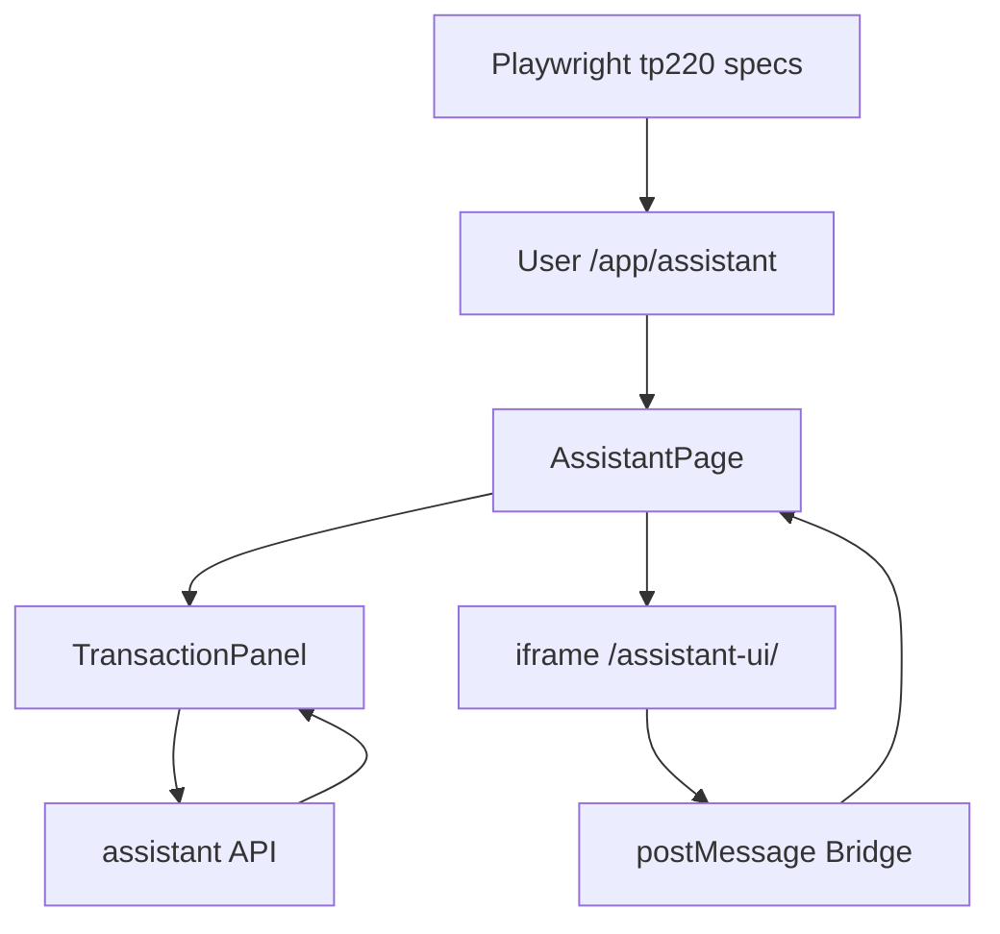

# DEV-PLAN-222：Assistant 前端交互与 E2E 证据闭环详细设计

**状态**: 已归档（2026-03-08 CST，旧桥接安全与 E2E 历史证据）

> 归档说明：
> - 本计划覆盖的 `iframe/postMessage` 三重校验属于旧桥接阶段安全收口，不再作为新主链路实现约束。
> - 后续 UI 承载面与消息通道以 `DEV-PLAN-280/282/283/284/285` 为准。
> - 归档已于 2026-03-08 执行，保留仅用于历史追溯。

## 1. 背景与上下文 (Context)
- **需求来源**:
  - `docs/dev-plans/220-chat-assistant-upgrade-implementation-plan.md`
  - `docs/dev-plans/220a-chat-assistant-gap-assessment-and-closure-plan.md`
  - `docs/dev-plans/221-assistant-p1-blocker-closure-plan.md`
- **当前痛点**:
  1. `/app/assistant` 可用但 FE 门控与后端状态机仍存在细节偏差。
  2. 事务面板 `plan/diff/explain/risk_tier` 展示与可断言锚点不完整。
  3. 220 全量 FE/E2E 测试矩阵（FE-001~007、E2E-001~008、E2E-101~104）尚未形成统一证据闭环。
  4. `postMessage` 仍缺完整三重校验（origin + schema + nonce/channel）。
  5. LibreChat 运行基线（版本冻结/升级回归）未在实施计划中明确。
- **业务价值**:
  - 将 Assistant 前台从“可用”升级为“可验证、可回归、可审计发布”。

## 2. 目标与非目标 (Goals & Non-Goals)
### 2.1 核心目标
1. [X] 完成按钮门控矩阵（`risk_tier + conversation_state + candidate_status`）。
2. [X] 完成事务面板展示收口（`plan/diff/explain/risk_tier` + 追踪字段）。
3. [X] 落地 220 全量 FE/E2E 证据闭环：`TC-220-FE-001~007`、`TC-220-E2E-001~008`、`TC-220-E2E-101~104`。
4. [X] 落地 `postMessage` 三重校验（origin allowlist + schema + nonce/channel）。
5. [X] 明确 LibreChat 版本冻结、升级回归与边界安全基线（含越权阻断验证）。

### 2.2 非目标 (Out of Scope)
1. [X] 不引入会话持久化 schema/迁移（由 `DEV-PLAN-223` 承接）。
2. [X] 不引入多模型治理与 LLM provider 配置（由 `DEV-PLAN-224` 承接）。
3. [X] 不引入任务编排 API / Temporal（由 `DEV-PLAN-225` 承接）。

## 2.1 工具链与门禁（SSOT 引用）
- **触发器清单（本计划命中）**：
  - [X] Go 代码（必要时）
  - [ ] `.templ` / Tailwind
  - [ ] 多语言 JSON
  - [X] 路由治理
  - [X] Authz
  - [ ] DB 迁移 / Schema
  - [ ] sqlc
  - [X] E2E
  - [X] 文档门禁
- **SSOT 引用**：
  - `AGENTS.md`
  - `Makefile`
  - `.github/workflows/quality-gates.yml`
  - `docs/dev-plans/009A-r200-tooling-playbook.md`

## 3. 架构与关键决策 (Architecture & Decisions)
### 3.1 架构图 (Mermaid)


### 3.2 关键设计决策 (ADR 摘要)
- **决策 1：按钮可用性只由后端状态与风险字段驱动（选定）**
  - 选项 A：前端推断提交条件。缺点：易漂移。
  - 选项 B（选定）：仅消费后端状态字段，前端不发明新状态。
- **决策 2：E2E 采用稳定选择器与语义断言（选定）**
  - 选项 A：基于文案断言。缺点：脆弱。
  - 选项 B（选定）：`data-testid` + 状态码/字段断言。
- **决策 3：postMessage 默认拒绝（选定）**
  - 选项 A：先接收后容错。缺点：污染风险。
  - 选项 B（选定）：校验失败立即丢弃，不触发状态变更。
- **决策 4：LibreChat 版本冻结（选定）**
  - 选项 A：跟随上游浮动升级。缺点：回归不可控。
  - 选项 B（选定）：固定版本窗口，升级必须跑完整回归包。

### 3.3 关键风险与前置决策结论（2026-03-02）
1. [X] **postMessage origin 口径冻结**：在当前 `/assistant-ui/*` 反向代理同源架构下，前端默认仅信任 `window.location.origin`；可通过 `VITE_ASSISTANT_ALLOWED_ORIGINS` 增补白名单来源（逗号分隔，禁止 `*`）。
2. [X] **nonce/channel 绑定策略冻结**：每次页面会话初始化生成 `channel + nonce`，并写入 iframe query；消息必须同时匹配这两个值，任一不匹配立即丢弃。
3. [X] **222 范围边界再确认**：222 仅负责 FE 门控、消息桥校验、FE/E2E 证据；`TC-220-BE-010` 最终后端越权阻断归属 `DEV-PLAN-224`，222 负责前端侧不可旁路验证与证据留存。
4. [X] **E2E 取证策略冻结**：tp220 套件采用“稳定 selector + 语义断言 + 必要 mock（仅用于前端状态分支）+ 边界真实链路断言”组合，避免脆弱文案断言。

## 4. 数据模型与约束 (Data Model & Constraints)
> 本计划不新增数据库 schema；仅定义前端状态模型与消息约束。

### 4.1 前端状态矩阵（逻辑模型）
- 输入字段：`conversation_state`、`risk_tier`、`resolved_candidate_count`、`error.code`。
- 派生字段：`canRegenerate`、`canConfirm`、`canCommit`、`showRiskBlocker`。
- 约束：
  1. `state in {canceled, expired, committed}` -> `canCommit=false`。
  2. `risk_tier=high && state!=confirmed` -> `canCommit=false`。
  3. `resolved_candidate_count>1 && state!=confirmed` -> `canCommit=false`。
  4. `conversation_state_invalid` 仅可触发“提示 + 刷新状态”，禁止本地状态修补。

### 4.2 消息约束（postMessage）
1. [X] origin 必须命中 allowlist。
2. [X] payload 必须通过 schema 校验。
3. [X] `nonce/channel` 必须与当前会话绑定一致，不一致直接丢弃。

## 5. 接口契约 (API Contracts)
### 5.1 JSON API（前端消费）
1. [X] `POST /internal/assistant/conversations`
2. [X] `GET /internal/assistant/conversations/{conversation_id}`
3. [X] `POST /internal/assistant/conversations/{conversation_id}/turns`
4. [X] `POST /internal/assistant/conversations/{conversation_id}/turns/:confirm`
5. [X] `POST /internal/assistant/conversations/{conversation_id}/turns/:commit`

- **契约要求**：
  - 必须展示 `conversation_id/turn_id/request_id/trace_id`。
  - 错误码 `conversation_state_invalid`、`ai_actor_role_drift_detected`、`ai_plan_boundary_violation` 必须有明确提示。

### 5.2 iframe postMessage 契约
- **允许来源**：`LIBRECHAT_UPSTREAM` 对应 origin 白名单（不可 `*`）。
- **消息 schema（最小）**：
  - `type`: string（必填）
  - `channel`: string（必填）
  - `nonce`: string（必填）
  - `request_id`: string（可选）
  - `payload`: object（按 type 校验）
- **拒绝策略**：
  - origin 非白名单 -> 丢弃。
  - schema 非法 -> 丢弃。
  - nonce/channel 不匹配 -> 丢弃。

## 6. 核心逻辑与算法 (Business Logic & Algorithms)
### 6.1 按钮门控算法（伪代码）
```text
input: state, riskTier, candidateCount
canConfirm = (state == "validated")
canCommit  = (state == "confirmed")

if state in ["canceled", "expired", "committed"]:
  canConfirm = false
  canCommit = false

if riskTier == "high" and state != "confirmed":
  canCommit = false

if candidateCount > 1 and state != "confirmed":
  canCommit = false
```

### 6.2 postMessage 校验算法（伪代码）
```text
onMessage(event):
  if event.origin not in whitelist: drop
  if !validateSchema(event.data): drop
  if event.data.channel != expectedChannel: drop
  if event.data.nonce != expectedNonce: drop
  dispatch(event.data.type, event.data.payload)
```

## 7. 安全与鉴权 (Security & Authz)
1. [X] origin/schema/nonce-channel 三重校验全部通过后才处理消息。
2. [X] assistant 路由 capability 映射不漂移。
3. [X] 前端刷新后以服务端状态为准，不缓存跨会话敏感上下文。
4. [X] 验证 LibreChat 边界：聊天壳不可触发业务写旁路（对齐 `TC-220-E2E-007` 与 `TC-220-BE-010` 证据链）。

## 8. 依赖与里程碑 (Dependencies & Milestones)
- **依赖**：
  - `DEV-PLAN-221` 状态机与错误码契约先冻结。
- **里程碑**：
  0. [X] M0：关键风险与前置决策冻结（origin / nonce-channel / 责任边界）。
  1. [X] M1：状态矩阵 + 事务面板字段展示收口。
  2. [X] M2：postMessage 三重校验落地 + 单测。
  3. [X] M3：`tp220-assistant-*.spec.js` 全量 E2E 套件落地（执行依赖环境）。
  4. [X] M4：LibreChat 版本冻结与升级回归清单落地（见执行日志中的验证口径）。
  5. [X] M5：门禁全绿 + `docs/dev-records/` 证据归档。

## 9. 测试与验收标准 (Acceptance Criteria)
- **前端测试**：
  1. [X] 覆盖 `TC-220-FE-001~007` 全部场景（组件/状态/消息桥单测）。
- **E2E 测试**：
  1. [X] 覆盖 `TC-220-E2E-001~008`（`make e2e` 已通过）。
  2. [X] 覆盖 `TC-220-E2E-101~104`（`make e2e` 已通过）。
- **边界与安全验证**：
  1. [X] `postMessage` 三重校验全部有自动化断言。
  2. [X] LibreChat 越权阻断有端到端测试脚本与断言（`make e2e` 已通过）。
- **门禁验收**：
  1. [X] `make check routing`
  2. [X] `make check capability-route-map`
  3. [X] `make authz-pack && make authz-test && make authz-lint`
  4. [X] `make check error-message`
  5. [X] `make e2e`
  6. [X] `make preflight`

## 10. 运维与监控 (Ops & Monitoring)
- 遵循早期阶段原则：不引入复杂开关体系。
- LibreChat 运行基线：
  1. [X] 固定版本窗口（记录版本号与镜像摘要）。
  2. [X] 升级前必须执行 FE/E2E 全量回归包。
  3. [X] 回滚采用环境级回滚，不走业务双链路。
- 最小可观测要求：
  1. [X] 前端日志保留 `request_id/trace_id/conversation_id`。
  2. [X] postMessage 丢弃事件记录低噪音日志。

## 11. 交付物
1. [X] Assistant 页面交互收敛代码与测试。
2. [X] `tp220` 系列全量 E2E 套件与证据脚本。
3. [X] LibreChat 版本冻结与升级回归清单。
4. [X] `DEV-PLAN-222` 执行记录文档（新增到 `docs/dev-records/`）。

## 12. 关联文档
- `docs/dev-plans/001-technical-design-template.md`
- `docs/dev-plans/003-simple-not-easy-review-guide.md`
- `docs/dev-plans/220-chat-assistant-upgrade-implementation-plan.md`
- `docs/dev-plans/220a-chat-assistant-gap-assessment-and-closure-plan.md`
- `docs/dev-plans/221-assistant-p1-blocker-closure-plan.md`
- `docs/dev-plans/223-assistant-conversation-persistence-and-audit-closure-plan.md`
- `docs/dev-plans/224-assistant-multi-model-and-llm-intent-governance-plan.md`
- `AGENTS.md`
