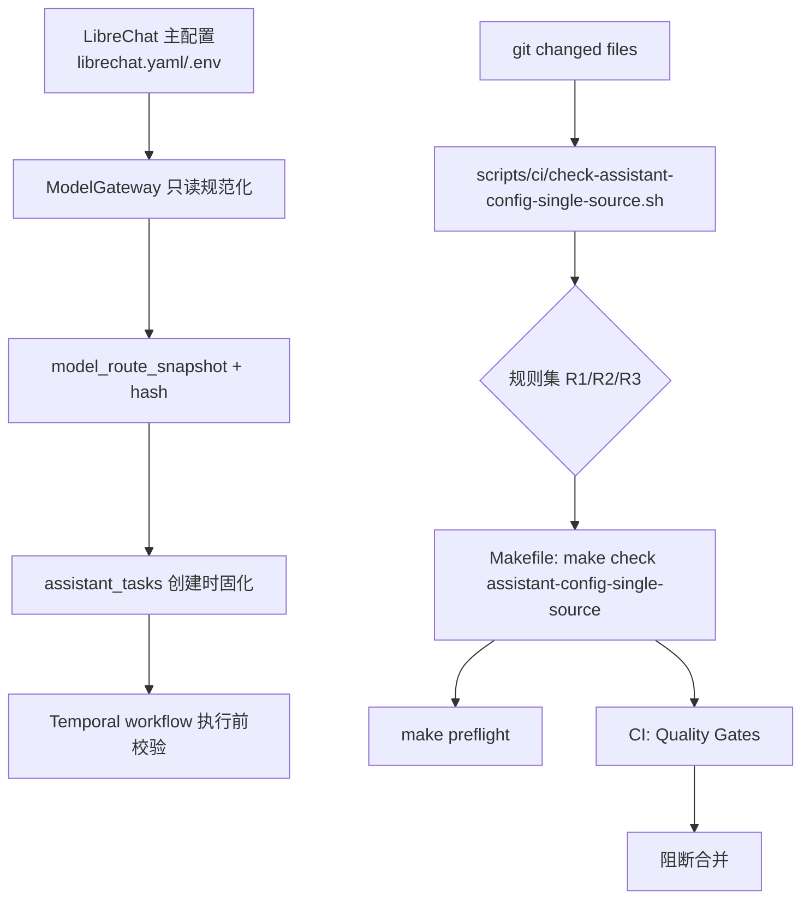
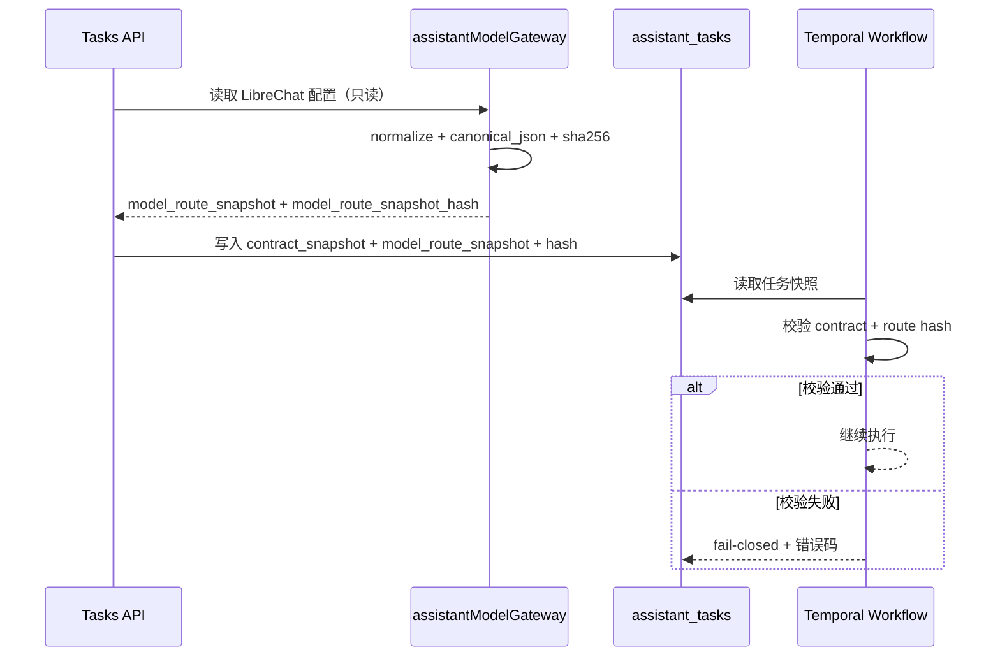

# DEV-PLAN-231：LibreChat 集成前置契约与门禁补齐详细设计

> 归档说明（2026-04-12）：本文件已自 `docs/dev-plans/` 迁入 `docs/archive/dev-plans/`，仅保留为历史参考，不再作为现行 SSOT。

**状态**: 已完成（2026-03-03 12:25 UTC，实施与验证见 `docs/archive/dev-records/dev-plan-231-execution-log.md`，PR #466 已合并）

## 1. 背景与上下文 (Context)
- **需求来源**:
  - `docs/archive/dev-plans/230-librechat-project-level-integration-plan.md`
  - `docs/archive/dev-plans/224-assistant-multi-model-and-llm-intent-governance-plan.md`
  - `docs/archive/dev-plans/225-assistant-tasks-temporal-p2-implementation-plan.md`
- **当前痛点**:
  1. 模型配置主源切到 LibreChat 后，`model_route_snapshot -> contract_snapshot -> workflow 校验` 还未冻结为可执行契约。
  2. 仓库缺少“单主源”阻断门禁，`model-providers:apply` 等历史入口回流风险只能靠人工 review。
  3. `Makefile`、`quality-gates`、`DEV-PLAN-012` 尚未把“assistant-config-single-source”收敛成同一事实源。
  4. 子计划 232~237 的前置“停止线”未先落地，后续切片存在返工风险。
- **业务价值**:
  - 在真正切换主源前，先把“写入口唯一性 + 契约可重放 + CI fail-closed”补齐，保证后续集成按单链路推进。

## 2. 目标与非目标 (Goals & Non-Goals)
### 2.1 核心目标
1. [ ] 冻结 `model_route_snapshot` 契约（结构、canonical 规则、hash 规则、执行前校验语义）。
2. [ ] 新增并启用 `make check assistant-config-single-source`，阻断第二写入口与契约回写。
3. [ ] 将新 gate 接入 `Makefile`、`make preflight`、`.github/workflows/quality-gates.yml`。
4. [ ] 与 `DEV-PLAN-012`、`DEV-PLAN-230`、`AGENTS.md` 对齐，消除“本地/CI/文档三套口径”。
5. [ ] 给 `DEV-PLAN-233/236` 提供可复用的 stopline（迁移窗口、410 阶段、删除阶段）。

### 2.2 非目标 (Out of Scope)
1. [ ] 不落地 LibreChat 运行编排与依赖栈（由 `DEV-PLAN-232` 承接）。
2. [ ] 不执行模型配置主源切换（由 `DEV-PLAN-233` 承接）。
3. [ ] 不改 `/assistant-ui/*` 身份边界实现（由 `DEV-PLAN-235` 承接）。
4. [ ] 不执行旧接口最终删除（由 `DEV-PLAN-236` 承接）。

## 2.3 工具链与门禁（SSOT 引用）
- **触发器清单（本计划命中）**：
  - [X] Go 代码（校验器/测试样例）
  - [ ] `.templ` / Tailwind
  - [ ] 多语言 JSON
  - [ ] Authz
  - [ ] 路由治理
  - [ ] DB 迁移 / Schema（本计划只冻结契约，不执行 DDL）
  - [ ] sqlc
  - [X] 文档门禁
- **本地必跑（命中项）**：
  1. [ ] `go fmt ./... && go vet ./... && make check lint && make test`
  2. [ ] `make check assistant-config-single-source`（新增）
  3. [ ] `make preflight`（新增 gate 接入后）
  4. [ ] `make check doc`
- **SSOT 链接**：
  - `AGENTS.md`
  - `Makefile`
  - `.github/workflows/quality-gates.yml`
  - `docs/dev-plans/012-ci-quality-gates.md`

## 3. 架构与关键决策 (Architecture & Decisions)
### 3.1 架构图（门禁与契约关系）


### 3.2 时序图（任务创建与执行）


### 3.3 ADR 摘要
- **ADR-231-01：快照冻结点在“任务创建时”**（选定）
  - 选项 A：执行时读取当前配置；缺点：重试不可复现。
  - 选项 B（选定）：创建任务时固化 route snapshot + hash，执行前只读校验。
- **ADR-231-02：单主源门禁采用“脚本 + Makefile + CI”三层一致**（选定）
  - 选项 A：仅 CI；缺点：本地无法提前失败。
  - 选项 B（选定）：本地 `make check` 与 CI 同命令入口，统一输出前缀。
- **ADR-231-03：临时豁免必须带过期时间**（选定）
  - 选项 A：永久 allowlist；缺点：技术债固化。
  - 选项 B（选定）：`owner + reason + expires_at` 必填，过期即阻断。

## 4. 数据模型与约束 (Data Model & Constraints)
> 本计划冻结契约；实际表结构迁移由 `DEV-PLAN-225A`（或 225 等效修订）实施。

### 4.1 任务快照契约（冻结）
`assistant_tasks` 在现有 `contract_snapshot` 基础上新增下列不可变字段：
```sql
model_route_snapshot jsonb not null,
model_route_snapshot_hash text not null,
model_route_schema_version text not null default 'v1'
```

### 4.2 `model_route_snapshot` JSON 结构（v1）
```json
{
  "provider_routing": {
    "strategy": "priority_failover",
    "fallback_enabled": false
  },
  "providers": [
    {
      "name": "openai",
      "enabled": true,
      "model": "gpt-5-codex",
      "endpoint": "https://api.openai.com/v1",
      "timeout_ms": 8000,
      "retries": 1,
      "priority": 10,
      "key_ref": "OPENAI_API_KEY"
    }
  ]
}
```
约束：
1. [ ] 仅保留路由决策必需字段；禁止把密钥值写入快照。
2. [ ] canonical JSON：对象键排序、数组保持原语义顺序、数字/布尔类型不做字符串化。
3. [ ] `model_route_snapshot_hash` 固定为 `sha256:<64hex>`。
4. [ ] 写入后不可更新；仅允许通过新任务生成新快照。

### 4.3 门禁规则模型（R1/R2/R3）
- **R1：第二写入口阻断**
  - [ ] 禁止新增/恢复对模型配置的非 LibreChat 写入口（路由、handler、service、脚本）。
- **R2：确定性产物回写阻断**
  - [ ] 禁止在配置层写入 `intent_hash/plan_hash/context_hash/contract_snapshot`。
- **R3：SSOT 漂移阻断**
  - [ ] 若新增 gate 入口但未同步 `Makefile + CI + DEV-PLAN-012/230`，直接失败。

### 4.4 临时豁免文件约束（如需）
建议路径：`config/assistant/single-source-gate-allowlist.yaml`
```yaml
- rule: R1
  path: internal/server/assistant_model_providers_apply.go
  reason: "阶段性迁移窗口"
  owner: "@assistant-platform"
  expires_at: "2026-04-10"
```
约束：
1. [ ] `expires_at` 必填且不得晚于 `DEV-PLAN-230` 冻结 stopline（2026-04-24）。
2. [ ] 过期条目在 gate 中视为违规。
3. [ ] 允许列表只允许精确路径，不允许通配符。

## 5. 接口契约 (API / CLI Contracts)
### 5.1 CLI 契约：`make check assistant-config-single-source`
- **命令入口**：
  - `Makefile`：`assistant-config-single-source` 目标
  - 脚本：`scripts/ci/check-assistant-config-single-source.sh`
- **输出规范**：
  - 成功：`[assistant-config-single-source] OK`
  - 失败：`[assistant-config-single-source] FAIL <RULE_ID> <file>: <reason>`
- **退出码**：
  - `0`：通过
  - `1`：规则违反
  - `2`：执行错误（脚本依赖缺失/输入异常）

### 5.2 CI 契约
1. [ ] `quality-gates` 的 `Code Quality & Formatting` job 新增 step：`Assistant Config Single-Source Gate (always)`。
2. [ ] 该 step 执行 `make check assistant-config-single-source`，不允许被 path 过滤跳过。
3. [ ] `make preflight` 追加同名 gate，顺序位于 `no-legacy` 之后、`doc` 之前。

### 5.3 错误码/失败原因字典（脚本级）
- `assistant_config_secondary_write_path_detected`（R1）
- `assistant_config_deterministic_artifact_backwrite_detected`（R2）
- `assistant_config_ssot_drift_detected`（R3）
- `assistant_config_allowlist_expired`（allowlist）

## 6. 核心逻辑与算法 (Business Logic & Algorithms)
### 6.1 Snapshot 规范化与哈希
```text
raw = read_librechat_config(librechat.yaml + env overlays)
route_view = project_route_fields(raw)  // 仅保留路由决策字段
normalized = normalize(route_view)      // 去临时字段、类型收敛
snapshot = canonical_json(normalized)
hash = "sha256:" + hex(sha256(snapshot))
return snapshot, hash, schema_version="v1"
```

### 6.2 门禁检测主算法
```text
changed_files = scripts/ci/changed-files.sh
violations = []

for file in changed_files:
  if match_secondary_write_path(file, diff):
    violations += R1
  if match_artifact_backwrite(file, diff):
    violations += R2

if gate_wiring_changed(diff_of_makefile_ci_docs) and not all_synced:
  violations += R3

allowlist = read_allowlist_if_exists()
violations = subtract_not_expired_allowlist(violations, allowlist)

if violations not empty:
  print FAIL lines with stable error codes
  exit 1
print OK
exit 0
```

### 6.3 R3（SSOT 漂移）判定规则
1. [ ] `Makefile` 出现 `assistant-config-single-source` 目标时，CI 必须存在同名 gate step。
2. [ ] CI 出现同名 gate step 时，`make preflight` 必须调用该 gate。
3. [ ] 230/231/012 至少两份文档需可检索到 gate 名称与职责。

### 6.4 失败策略
- fail-closed：任一违规直接退出 1，不提供 warning-only 合并路径。

## 7. 安全与鉴权 (Security & Authz)
1. [ ] 脚本输出不得回显 `.env` 值或 token，只允许打印变量名/路径。
2. [ ] gate 只读扫描代码与文档，不允许修改仓库文件。
3. [ ] 不引入 feature flag、legacy 分支或“临时绕过开关”。

## 8. 依赖与里程碑 (Dependencies & Milestones)
- **依赖**:
  - `DEV-PLAN-230`（总方案与 stopline）
  - `DEV-PLAN-224/225`（契约快照基线）
- **里程碑**:
  1. [ ] M1：冻结快照字段与 hash 语义（231 文档完成并评审）。
  2. [ ] M2：脚本与测试样例落地（R1/R2/R3 + allowlist 过期场景）。
  3. [ ] M3：`Makefile` + CI + preflight 接线完成。
  4. [ ] M4：`DEV-PLAN-012/230/231` 文档收口并补齐 `dev-records` 证据。

## 9. 测试与验收标准 (Acceptance Criteria)
### 9.1 测试场景
1. [ ] **正向样例**：仅改 LibreChat 只读适配，不触发 R1/R2/R3。
2. [ ] **反向样例-R1**：新增 `model-providers:apply` 写路径，gate 阻断。
3. [ ] **反向样例-R2**：配置层写入 `intent_hash/plan_hash`，gate 阻断。
4. [ ] **反向样例-R3**：只改 `Makefile` 不改 CI，gate 阻断。
5. [ ] **allowlist 过期样例**：豁免过期后自动阻断。

### 9.2 验收命令
1. [ ] `go fmt ./... && go vet ./... && make check lint && make test`
2. [ ] `make check assistant-config-single-source`
3. [ ] `make preflight`
4. [ ] `make check doc`

### 9.3 交付完成定义（DoD）
1. [ ] 本地与 CI 均执行同一个 gate 入口且结果一致。
2. [ ] 对“第二写入口/契约回写/SSOT 漂移”三类违规均能稳定阻断。
3. [ ] 231 输出被 233/236 直接引用，无需二次定义规则。

## 10. 运维与监控 (Ops & Monitoring)
1. [ ] gate 失败日志最少包含：`rule_id`、`file`、`reason`、`error_code`。
2. [ ] 失败后修复顺序固定：修代码/文档 -> 本地重跑 -> CI 通过 -> 合并。
3. [ ] 禁止通过“临时注释 gate step”绕过；如需临时豁免，只能走 allowlist 且有到期时间。

## 11. Readiness 记录要求
1. [ ] 在 `docs/dev-records/` 新建执行记录，至少包含：时间、命令、结果、失败样例截图/日志。
2. [ ] 记录中需显式证明：R1/R2/R3 均被触发过一次并被阻断。
3. [ ] 当 231 全部勾选后，再将状态更新为 `准备就绪` 或 `已完成`。

## 12. SSOT 引用
- `AGENTS.md`
- `Makefile`
- `.github/workflows/quality-gates.yml`
- `docs/dev-plans/012-ci-quality-gates.md`
- `docs/archive/dev-plans/224-assistant-multi-model-and-llm-intent-governance-plan.md`
- `docs/archive/dev-plans/225-assistant-tasks-temporal-p2-implementation-plan.md`
- `docs/archive/dev-plans/230-librechat-project-level-integration-plan.md`
