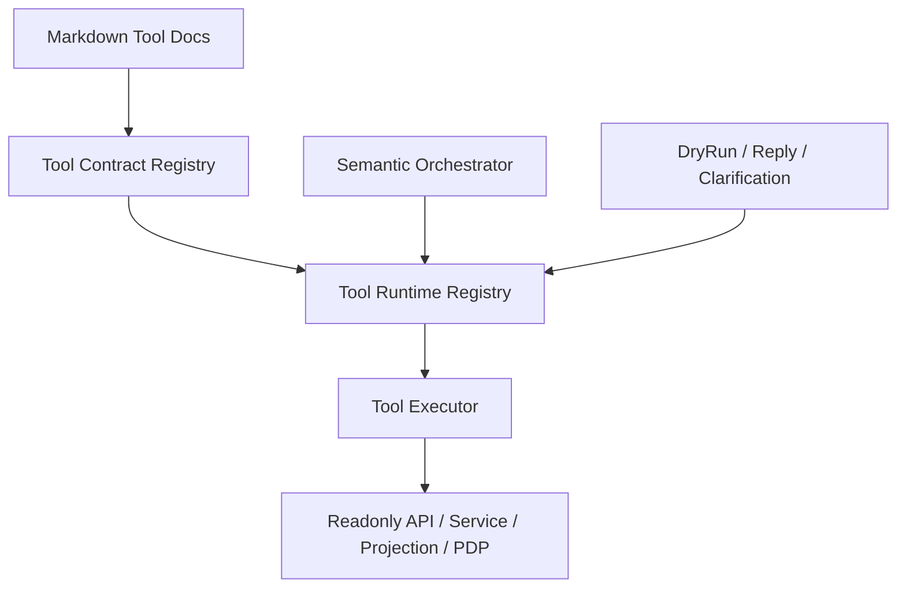

# DEV-PLAN-371：Assistant 真正 Tool Runtime 架构与迁移方案

**状态**: 规划中（2026-04-13 12:13 CST）

## 1. 背景与问题定义

`DEV-PLAN-370/370A/370B` 已把 Assistant 的知识侧收敛到 Markdown 单主源，并建立 direct runtime load；`DEV-PLAN-350` 已把 `business_action` 的 contract、Tool registry、`PolicyContext`、`PrecheckProjection`、authoritative gate 边界冻结为正式主链；`DEV-PLAN-375` 已把 `350-370` 的现行实施顺序编排为主线。

当前主线已经解决了“多知识源”“JSON 中间层”“动作知识散点”的大部分问题，但仍保留一个结构性中间态：

1. [ ] `tool_refs`、`ReadonlyTools`、`tool_name` 在命名上表现为“工具运行时”，但执行上仍主要表现为“知识声明 + 编排层硬编码分支”。
2. [ ] `orgunit_candidate_lookup` 已接近独立工具执行器，但 `orgunit_candidate_snapshot`、`orgunit_action_precheck`、`orgunit_field_explain` 仍主要以流程内组合能力存在，不具备统一、对称、可注册的运行时入口。
3. [ ] Runtime 对“什么时候调用哪种能力、输入输出长什么样、如何落审计/trace、如何复用缓存/错误语义”的表达分散在语义编排、dry-run enrichment、projection 快照整理与既有只读 API 之间。
4. [ ] 因此，当前实现虽然可运行，但在以下三个维度仍有明显改进空间：
   - 概念整洁度：名词与行为尚未完全对齐。
   - 可扩展性：新增工具往往需要跨多处补丁式接线。
   - 可新人上手性：新人容易误以为仓库已有 `tool_name -> executor` 的统一 dispatcher。

本方案的目标不是推翻 `350/370/375`，而是在其现有主链之上，把 Assistant 从“伪工具运行时”收敛为“真正的 Tool Runtime”。

## 2. 目标、非目标与边界

### 2.1 目标

1. [ ] 建立统一的 Assistant Tool Runtime：所有正式只读工具都必须通过单一注册表、统一接口与统一执行包暴露。
2. [ ] 让 `tool_refs` 从“知识声明名词”变成“运行时可执行依赖”，实现 `tool_name -> executor` 的一一映射。
3. [ ] 收敛 `candidate_lookup / candidate_snapshot / action_precheck / field_explain` 为对称工具，不再依赖编排层隐式分支表达其语义。
4. [ ] 统一工具输入输出 schema、route kind 校验、trace/request_id 注入、错误码与 fail-closed 行为。
5. [ ] 降低新增工具的接入成本，使“注册一个新工具”不再默认意味着改编排、改 dry-run、改 projection、改 reply 的多点同步。
6. [ ] 为后续 `business_query / knowledge_qa / business_action` 三条主链提供统一的工具消费模型，提升概念整洁度、可扩展性、可新人上手性。

### 2.2 非目标

1. [ ] 不改变 `DEV-PLAN-350` 对正式动作 contract、Tool registry 名字、`PolicyContext`、`PrecheckProjection`、authoritative gate 的裁决权。
2. [ ] 不让 Markdown 或 `tool_refs` 反向定义新的 Tool contract；所有正式 `tool_name/schema` 仍需先由 `350` 或其继承 SSOT 冻结。
3. [ ] 不把 Tool Runtime 升级成“模型自由决定并发起任意内部调用”的开放式 agent framework。
4. [ ] 不重建第二套业务事实源；工具依然只能消费 API、service、projection、PDP 或受控 store reader。
5. [ ] 不引入向量库、外部 agent orchestration 平台、通用插件市场作为该方案的完成前提。

### 2.3 与既有计划的边界

1. [ ] `DEV-PLAN-350` 继续负责“什么是正式 Tool、名字叫什么、schema 长什么样、哪些动作允许使用哪些工具、何为 authoritative gate”的裁决。
2. [ ] `DEV-PLAN-370` 继续负责“知识主源是什么、Markdown runtime 如何加载、tool docs 如何校验引用”的裁决。
3. [ ] `DEV-PLAN-375` 继续作为当前 `350-370` 主线的编排母法；`371` 是下一阶段运行时重构方案，不回溯改写当前主线已完成部分的历史事实。
4. [ ] 若 `371` 启动实施，必须以“先不改外部 API 与业务 contract，只替换内部工具执行面”为默认原则，避免与 `350/370` 同时大范围漂移。

## 3. 现状诊断

### 3.1 当前结构

当前链路大致为：

1. [ ] 动作注册表通过 `ReadonlyTools` 声明某动作可用哪些工具。
2. [ ] Markdown runtime 校验 `tool_name` 是否已注册，并将 `tool_refs` 建索引。
3. [ ] 语义编排 / authoritative accept / dry-run enrichment 决定何时触发某些只读能力。
4. [ ] 底层再调用 `OrgUnitStore`、只读 API、Precheck adapter、projection snapshot 等获取事实。

这意味着“工具”的概念横跨了声明层、校验层、编排层、执行层，但没有统一执行模型。

### 3.2 现状缺陷

1. [ ] 概念整洁度问题：
   - `tool_name` 看起来像执行器键，但不少能力仍是编排层内嵌逻辑。
   - `field_explain` 与 `action_precheck` 的边界依赖阅读实现细节才能理解。
2. [ ] 可扩展性问题：
   - 新增工具通常至少涉及 action registry、knowledge docs、runtime consumption、dry-run/projection wiring 的多点接线。
   - 缺少统一 executor 也使缓存、审计、性能治理难以在一层收口。
3. [ ] 可新人上手性问题：
   - “哪里定义工具”“哪里执行工具”“哪类工具只是概念标签”这些问题需要靠口头解释。
   - 从 `tool_refs` 跳到最终 Go 代码需要跨多个文件与层次。

## 4. 目标架构

### 4.1 核心原则

1. [ ] 一个正式工具必须同时具备 4 个组成部分：
   - Contract：名字、schema、允许 route kind、错误语义
   - Knowledge：Markdown `tools/*.md` 文档与被引用方式
   - Runtime Registration：统一注册表中的 executor
   - Execution：真正的 `Execute(...)` 实现
2. [ ] 任何正式 `tool_name` 都必须能回答 3 个问题：
   - 谁注册了它
   - 它的输入输出是什么
   - 它的执行入口在哪里
3. [ ] Tool Runtime 只负责“标准化工具调用”，不接管动作准入与业务提交裁决。

### 4.2 目标分层

### 4.3 统一抽象

建议引入如下最小抽象：

1. [ ] `AssistantToolSpec`
   - `Name`
   - `AllowedRouteKinds`
   - `InputSchemaVersion`
   - `OutputSchemaVersion`
   - `Owner`
   - `Stability`
2. [ ] `AssistantToolExecutor`
   - `Spec() AssistantToolSpec`
   - `Execute(ctx, req) (resp, error)`
3. [ ] `AssistantToolRegistry`
   - `Register(executor)`
   - `Lookup(toolName)`
   - `ListByRouteKind(routeKind)`
4. [ ] `AssistantToolRequestEnvelope`
   - `TenantID`
   - `Principal`
   - `ConversationID`
   - `TurnID`
   - `Intent`
   - `TraceID`
   - `RequestID`
   - `Payload`
5. [ ] `AssistantToolResultEnvelope`
   - `ToolName`
   - `SchemaVersion`
   - `Payload`
   - `Trace`
   - `ErrorCode`

## 5. 运行时设计

### 5.1 注册表

1. [ ] 新增统一 `tool runtime registry` 包，作为唯一正式工具执行入口。
2. [ ] 所有正式工具必须在进程启动时完成注册；缺失注册、重复注册、schema 版本冲突、route kind 不合法时必须 fail-closed。
3. [ ] Markdown runtime 在校验 `tool_name` 时，不只验证“是否出现在动作注册表”，还要验证“是否存在 runtime executor”。

### 5.2 执行器模型

1. [ ] `candidate_lookup` 迁入独立 executor：
   - 输入：`ref_text`、`as_of`、`slot`、`limit`
   - 输出：候选列表、候选计数、自动命中信息
2. [ ] `candidate_snapshot` 迁入独立 executor：
   - 输入：`candidate_id` 或 `org_code`、`as_of`
   - 输出：组织详情快照、路径、状态、版本关键信息
3. [ ] `action_precheck` 迁入独立 executor：
   - 输入：动作类型、意图槽位、候选决议、上下文摘要
   - 输出：受控 precheck projection 视图
4. [ ] `field_explain` 迁入独立 executor：
   - 输入：动作、字段列表、上下文、`as_of`
   - 输出：字段必填性、可维护性、允许值、解释文本
5. [ ] 编排层只能通过 registry 调工具，不得继续直接调用这些工具对应的私有帮助函数。

### 5.3 工具调用生命周期

1. [ ] 进入工具前统一做：
   - route kind 校验
   - request envelope 构造
   - trace / request_id 注入
   - schema decode
2. [ ] 工具执行中统一做：
   - 结构化日志
   - 轻量统计
   - fail-closed 错误归一化
3. [ ] 工具执行后统一做：
   - schema encode
   - 审计摘要
   - 供 turn/dry-run/reply 复用的标准结果缓存

### 5.4 缓存与复用

1. [ ] 采用 request-scope / turn-scope 缓存，而不是让编排层自行缓存半结构化结果。
2. [ ] 相同 turn 内相同工具、相同 payload 的调用必须可复用，避免重复查候选、重复取详情、重复 precheck。
3. [ ] 缓存键必须显式包含：
   - `tool_name`
   - `schema_version`
   - `tenant_id`
   - `intent.action`
   - `payload digest`

## 6. 与现有主链的整合方式

### 6.1 对 `business_action`

1. [ ] 现有 `assistantBuildAuthoritativeDryRun(...)` 仍保留为动作 dry-run 总入口。
2. [ ] 但其内部对候选查找、候选快照、precheck、字段解释的调用，逐步替换为 tool runtime 调用。
3. [ ] `assistantActionSpec.ReadonlyTools` 继续保留，但运行时消费方式从“声明 + 编排硬编码”升级为“声明 + registry dispatch”。

### 6.2 对 `knowledge_qa`

1. [ ] `knowledge_qa` 可统一通过 runtime 查询 `field_explain`、未来的 `wiki_lookup`、`policy_explain` 等只读工具。
2. [ ] 这样知识问答与动作编排可以共享工具实现，而不再各自绕一层逻辑。

### 6.3 对 reply / clarification / phase snapshot

1. [ ] clarification 所需的“候选列表”“字段缺失解释”“候选确认说明”统一消费 tool result，而不直接消费分散的内部 helper 结果。
2. [ ] reply NLG 只组合结果，不拥有“如何查这些结果”的额外私有链路。

## 7. 迁移步骤

### Phase 0：冻结契约与现状映射

1. [ ] 列出所有现有正式 `tool_name` 与其真实执行入口。
2. [ ] 建立 `tool_name -> internal function -> downstream dependency` 映射清单。
3. [ ] 冻结哪些属于正式工具、哪些只是编排内部能力，避免边迁移边扩张。

### Phase 1：引入最小 Tool Runtime 基座

1. [ ] 新增 `AssistantToolExecutor`、`AssistantToolRegistry`、request/result envelope。
2. [ ] 不改业务行为，只把现有工具执行面包装到统一接口后面。
3. [ ] 在启动期增加“文档 tool_name 与 runtime executor 双向一致性校验”。

### Phase 2：迁移 `candidate_lookup`

1. [ ] 将现有候选查找逻辑迁入独立 executor。
2. [ ] 编排层改为只通过 registry 调用该工具。
3. [ ] 保持当前行为、错误码、候选选择语义不变。

### Phase 3：迁移 `candidate_snapshot`

1. [ ] 把候选详情快照抽离成独立 executor。
2. [ ] 替换 `lookupCandidateDetails(...)` 周围的直接依赖，使 version tuple、确认摘要等统一复用同一工具结果。

### Phase 4：迁移 `action_precheck`

1. [ ] 为 create / add_version / insert_version / correct / rename / move 等动作定义统一 precheck tool facade。
2. [ ] 让 dry-run enrichment 改成“调用 precheck tool”而不是“直接调 adapter helper”。

### Phase 5：迁移 `field_explain`

1. [ ] 收敛字段解释逻辑为单独工具。
2. [ ] 让 `knowledge_qa`、clarification、reply guidance 共享这一结果。

### Phase 6：删除旧接线

1. [ ] 删除编排层中对上述能力的私有硬编码路径。
2. [ ] 删除只为旧执行模型服务的重复 helper。
3. [ ] 更新文档，使 `tool_refs` 与运行时真正一一对应。

## 8. 风险与缓解

1. [ ] 风险：重构面过大，影响当前主线稳定。
   缓解：分阶段迁移，先引入兼容 registry，再逐个工具切换。
2. [ ] 风险：`action_precheck` 抽象过度，反而掩盖动作差异。
   缓解：保留 per-action payload 与 projection subtype，不强行抹平业务 contract。
3. [ ] 风险：reply/clarification 对旧数据形状强耦合。
   缓解：先引入 result envelope adapter，保留旧 DTO 兼容层，完成迁移后再删。
4. [ ] 风险：新人同时面对 `350`、`370`、`371` 三层概念。
   缓解：在 `371` 完成时新增单页运行时架构图和“如何新增工具”开发手册。

## 9. 验收标准

1. [ ] 任一正式 `tool_name` 都能在一个位置查到 executor 与 schema 版本。
2. [ ] `tool_refs` 引用的所有工具都能通过 runtime registry 被解析并执行。
3. [ ] `candidate_lookup / candidate_snapshot / action_precheck / field_explain` 四类能力均具备统一 executor。
4. [ ] 编排层不再直接调用这四类能力的私有实现入口。
5. [ ] 新增一个只读工具时，最小改动面收敛为：
   - `350` 注册 contract
   - `tools/*.md` 补知识文档
   - runtime registry 注册 executor
   - 必要的调用点声明依赖
6. [ ] 文档门禁与 Go 测试门禁通过，且新增一致性测试覆盖：
   - 文档工具引用一致性
   - runtime registry 完整性
   - route kind 校验
   - schema decode/encode
   - request-scope 缓存复用

## 10. 推荐决策

1. [ ] 若近期目标仍是完成 `375` 当前主线封板，应把 `371` 作为下一阶段重构准备方案，不插入当前关键路径。
2. [ ] 若团队决定把 Assistant 长期演进为统一能力平台，建议在 `375` 封板后优先启动 `371 Phase 0/1`，先完成 registry 基座与契约映射。
3. [ ] `371` 启动实施前，建议先补一份“现有工具真相矩阵”，作为正式迁移前置证据。

## 11. 关联事实源

1. `AGENTS.md`
2. `docs/dev-plans/350-assistant-tooling-alignment-with-unified-policy-model-plan.md`
3. `docs/dev-plans/370-assistant-api-first-and-markdown-knowledge-runtime-plan.md`
4. `docs/dev-plans/370a-assistant-markdown-knowledge-runtime-phase1-query-and-compiler-plan.md`
5. `docs/dev-plans/370b-assistant-business-action-knowledge-runtime-consumption-plan.md`
6. `docs/dev-plans/375-assistant-mainline-implementation-roadmap-350-370.md`
