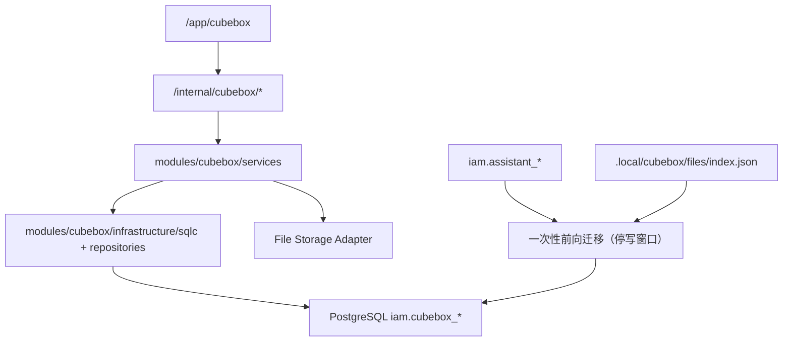

# DEV-PLAN-380A：CubeBox PostgreSQL 数据面与迁移契约

**状态**: 已批准（2026-04-15；`cubebox_*` PostgreSQL 数据面 contract 已获批准，可作为 `380B/380D` 依赖；迁移执行证据、Readiness 与 stopline 校验仍待后续关闭）

> 本文从 `DEV-PLAN-380` 拆分而来，作为 `CubeBox` PostgreSQL 数据面、前向迁移、sqlc 接线与切换算法的实施 SSOT。  
> `DEV-PLAN-380` 继续持有总范围、批次顺序与封板裁决权；本文只负责“正式数据面如何落地”。
>
> 批准说明：本次批准冻结的是 `cubebox_*` 数据面 contract、前向迁移方向与 sqlc/仓储落点；不等同于 `380A` 的实施与 readiness 已完成。`380B/380D` 可以依赖本文 contract 编码，但正式切换仍以本文第 8/9 章的里程碑、验收与 dev-record 证据为准。

## 1. 背景与上下文 (Context)

- **需求来源**:
  - `docs/dev-plans/380-cubebox-first-party-ownership-and-librechat-retirement-plan.md`
  - `docs/dev-plans/380b-cubebox-backend-formal-implementation-cutover-plan.md`
  - `docs/dev-plans/380d-cubebox-file-plane-formalization-plan.md`
- **当前痛点**:
  - `/app/cubebox` 与 `/internal/cubebox/*` 已是正式入口，但会话/turn/task 仍复用 `iam.assistant_*` 持久化链。
  - 文件最小闭环仍依赖 `.local/cubebox/files/index.json + objects/`，不是 PostgreSQL 正式 SoT。
  - `380B` 需要正式 repository/sqlc/DDD 落点，`380D` 需要文件元数据与 link 表；若 `380A` 仍停留在“列出几张表名”，后续子计划无法直接编码。
- **路线图分析（380 主线依赖）**:
  - `380A` 是最早的基础子计划，直接阻塞 `380B` 与 `380D`。
  - `380B + 380D` 完成后，`380C` 才能收口 `/internal/cubebox/*` 并退役 `/internal/assistant/*`。
  - `380C -> 380E -> 380F -> 380G` 为后续链路，因此 `380A` 实际上是整个 `380` 系列的根依赖之一。
- **业务价值**:
  - 让 `CubeBox` 从“新命名空间 + 旧持久化复用”切换到“新命名空间 + 新数据面”的正式产品状态。
  - 为后续 API 收口、文件面正式化、旧 Assistant API 退役提供可验证、可迁移、可回归的底座。

## 2. 目标与非目标 (Goals & Non-Goals)

### 2.1 核心目标

1. [ ] 在现有 `iam` PostgreSQL schema 内冻结 `cubebox_*` 正式表结构，而不是继续复用 `assistant_*`。
2. [ ] 覆盖完整持久化链，而不只覆盖“会话/任务”主表：
   - `cubebox_conversations`
   - `cubebox_turns`
   - `cubebox_state_transitions`
   - `cubebox_idempotency`
   - `cubebox_tasks`
   - `cubebox_task_events`
   - `cubebox_task_dispatch_outbox`
   - `cubebox_files`
   - `cubebox_file_links`
3. [ ] 明确从 `iam.assistant_*` 与本地文件索引向 `iam.cubebox_*` 的前向迁移算法、停写切换点与验证标准，不保留长期 dual-write。
4. [ ] 为 `modules/cubebox` 提供独立 sqlc 包与 repository 落点，避免后续 `cubebox` 代码继续 import `modules/iam/infrastructure/sqlc/gen`。
5. [ ] 明确本计划命中的工具链/门禁与实际落地文件位置，使 `380B/380D` 能按本文直接编码。

### 2.2 非目标 (Out of Scope)

1. 不在本文实现 `modules/cubebox/services` 的业务编排与 HTTP handler 迁移，那属于 `380B`。
2. 不在本文定义前端 IA、页面视觉与交互细节，那属于 `380E`。
3. 不在本文引入 Prompt/Template/Memory/Web Search/MCP 等超出 `CubeBox v1` 范围的产品数据模型。
4. 不在本文把大文件二进制正文写入 PostgreSQL；PostgreSQL 只承接元数据与引用关系。
5. 不在本文处理 Mongo/LibreChat 历史数据回灌；只允许迁移本仓当前正式运行链路中的 `assistant_*` 与本地文件索引。

### 2.3 工具链与门禁（SSOT 引用）

- **触发器清单（本计划命中）**:
  - [x] Go 代码（迁移工具、repository、测试）
  - [x] DB 迁移 / Schema（`iam` 模块）
  - [x] sqlc
  - [ ] `.templ` / `make css`
  - [ ] 多语言 JSON
  - [ ] Authz
  - [ ] 路由治理（路由本身不由本文裁决，但后续 `380C` 会命中）
- **执行入口（SSOT）**:
  - 触发器矩阵与仓库红线：`AGENTS.md`
  - 文档格式：`docs/dev-plans/000-docs-format.md`
  - 详细设计模板：`docs/dev-plans/001-technical-design-template.md`
  - Atlas + Goose：`docs/dev-plans/024-atlas-goose-closed-loop-guide.md`
  - sqlc：`docs/dev-plans/025-sqlc-guidelines.md`
  - 命令入口：`Makefile`
- **本计划实现期本地必跑（按 SSOT）**:
  - `make iam plan && make iam lint && make iam migrate up`
  - `make sqlc-generate`
  - 命中 DB 触发器时补跑 `make sqlc-verify-schema`
  - 涉及 Go 代码时补跑 `go fmt ./... && go vet ./... && make check lint && make test`

## 3. 架构与关键决策 (Architecture & Decisions)

### 3.1 架构图 (Mermaid)



### 3.2 关键设计决策 (ADR 摘要)

- **决策 1：表放在既有 `iam` schema，不新建 `cubebox` PostgreSQL schema**
  - **选项 A**: 新建 `cubebox` schema。缺点：需扩 `Makefile`/Atlas env/迁移目录/权限模型，超出 `380A` 的最小闭环。
  - **选项 B (选定)**: 继续使用既有 `iam` schema，新增 `iam.cubebox_*` 表。优点：与现有 `assistant_*` 数据面同域，迁移、RLS、`make iam plan/lint/migrate up` 都能复用。

- **决策 2：`cubebox_*` 采用“近似同构于 `assistant_*`”的数据链，而不是重新发明一套更薄的数据模型**
  - **选项 A**: 只建 `conversations/turns/tasks/files` 五张表。缺点：缺 `state_transitions/idempotency/task_events/outbox`，后续 `380B` 会被迫在实现期补洞。
  - **选项 B (选定)**: 保留完整链路，但将正式命名切换为 `cubebox_*`。优点：与当前运行逻辑对齐，能直接承接现有语义与测试资产。

- **决策 3：不做长期 dual-write；迁移采用“schema 先行 + 停写窗口 + 一次性前向拷贝 + 验证后切换”**
  - **选项 A**: `assistant_*` 与 `cubebox_*` 双写一段时间。缺点：违反仓库 No Legacy / 单链路原则。
  - **选项 B (选定)**: 切换窗口内前向迁移，验证通过后只写 `cubebox_*`。优点：符合 `DEV-PLAN-004M1`。

- **决策 4：sqlc 查询归属 `modules/cubebox`，不是 `modules/iam`**
  - **选项 A**: 继续向 `modules/iam/infrastructure/sqlc/gen` 加查询。缺点：`380B` 会继续依赖 `iam` 生成包，破坏模块边界。
  - **选项 B (选定)**: 扩 `sqlc.yaml`，新增 `modules/cubebox/infrastructure/sqlc/queries/*.sql -> modules/cubebox/infrastructure/sqlc/gen`。优点：表在 `iam` schema，但实现归属 `cubebox` 模块。

- **决策 5：文件元数据与引用关系分表**
  - **选项 A**: 在 `cubebox_files` 里直接放 `conversation_id`。缺点：后续 turn 附件、复用文件、删除保护会退化。
  - **选项 B (选定)**: `cubebox_files` 只放文件元数据，`cubebox_file_links` 承接 conversation/turn 关联。优点：与 `380D` 的正式文件面一致。

## 4. 数据模型与约束 (Data Model & Constraints)

> 标准：以下定义精确到字段类型、空值、唯一约束、索引、RLS 与迁移位置。  
> 说明：本文定义的是“最终 contract”，不是要求一次提交把所有代码写完；但任何实现不得偏离本节。

### 4.1 Schema 定义：会话 / Turn / 状态 / 幂等

建议新增 schema SSOT 文件：

- `modules/iam/infrastructure/persistence/schema/00011_iam_cubebox_conversations.sql`

```sql
CREATE TABLE IF NOT EXISTS iam.cubebox_conversations (
  tenant_uuid uuid NOT NULL REFERENCES iam.tenants(id) ON DELETE CASCADE,
  conversation_id text NOT NULL,
  actor_id text NOT NULL,
  actor_role text NOT NULL,
  state text NOT NULL,
  current_phase text NOT NULL DEFAULT 'idle',
  created_at timestamptz NOT NULL DEFAULT now(),
  updated_at timestamptz NOT NULL DEFAULT now(),
  PRIMARY KEY (tenant_uuid, conversation_id),
  CONSTRAINT cubebox_conversations_id_format_check CHECK (
    conversation_id ~ '^conv_[0-9a-f]{32}$'
  ),
  CONSTRAINT cubebox_conversations_state_check CHECK (
    state IN ('validated', 'confirmed', 'committed', 'canceled', 'expired')
  ),
  CONSTRAINT cubebox_conversations_phase_check CHECK (
    current_phase IN (
      'idle',
      'await_clarification',
      'await_missing_fields',
      'await_candidate_pick',
      'await_candidate_confirm',
      'await_commit_confirm',
      'committing',
      'committed',
      'failed',
      'canceled',
      'expired'
    )
  )
);

CREATE INDEX IF NOT EXISTS cubebox_conversations_actor_idx
  ON iam.cubebox_conversations (tenant_uuid, actor_id, updated_at DESC, conversation_id DESC);

CREATE TABLE IF NOT EXISTS iam.cubebox_turns (
  tenant_uuid uuid NOT NULL,
  conversation_id text NOT NULL,
  turn_id text NOT NULL,
  user_input text NOT NULL,
  state text NOT NULL,
  phase text NOT NULL,
  risk_tier text NOT NULL,
  request_id text NOT NULL,
  trace_id text NOT NULL,
  policy_version text NOT NULL,
  composition_version text NOT NULL,
  mapping_version text NOT NULL,
  intent_json jsonb NOT NULL,
  plan_json jsonb NOT NULL,
  candidates_json jsonb NOT NULL,
  candidate_options jsonb NOT NULL DEFAULT '[]'::jsonb,
  resolved_candidate_id text NULL,
  selected_candidate_id text NULL,
  ambiguity_count integer NOT NULL,
  confidence double precision NOT NULL,
  resolution_source text NULL,
  route_decision_json jsonb NULL,
  clarification_json jsonb NOT NULL DEFAULT '{}'::jsonb,
  dry_run_json jsonb NOT NULL,
  pending_draft_summary text NULL,
  missing_fields jsonb NOT NULL DEFAULT '[]'::jsonb,
  commit_result_json jsonb NULL,
  commit_reply jsonb NULL,
  error_code text NULL,
  created_at timestamptz NOT NULL DEFAULT now(),
  updated_at timestamptz NOT NULL DEFAULT now(),
  PRIMARY KEY (tenant_uuid, conversation_id, turn_id),
  CONSTRAINT cubebox_turns_conversation_fk FOREIGN KEY (tenant_uuid, conversation_id)
    REFERENCES iam.cubebox_conversations(tenant_uuid, conversation_id) ON DELETE CASCADE,
  CONSTRAINT cubebox_turns_turn_id_format_check CHECK (
    turn_id ~ '^turn_[0-9a-f]{32}$'
  ),
  CONSTRAINT cubebox_turns_state_check CHECK (
    state IN ('validated', 'confirmed', 'committed', 'canceled', 'expired')
  ),
  CONSTRAINT cubebox_turns_phase_check CHECK (
    phase IN (
      'idle',
      'await_clarification',
      'await_missing_fields',
      'await_candidate_pick',
      'await_candidate_confirm',
      'await_commit_confirm',
      'committing',
      'committed',
      'failed',
      'canceled',
      'expired'
    )
  ),
  CONSTRAINT cubebox_turns_ambiguity_non_negative CHECK (ambiguity_count >= 0),
  CONSTRAINT cubebox_turns_confidence_range_check CHECK (confidence >= 0 AND confidence <= 1),
  CONSTRAINT cubebox_turns_intent_object_check CHECK (jsonb_typeof(intent_json) = 'object'),
  CONSTRAINT cubebox_turns_plan_object_check CHECK (jsonb_typeof(plan_json) = 'object'),
  CONSTRAINT cubebox_turns_candidates_array_check CHECK (jsonb_typeof(candidates_json) = 'array'),
  CONSTRAINT cubebox_turns_candidate_options_array_check CHECK (jsonb_typeof(candidate_options) = 'array'),
  CONSTRAINT cubebox_turns_dry_run_object_check CHECK (jsonb_typeof(dry_run_json) = 'object'),
  CONSTRAINT cubebox_turns_route_decision_object_or_null_check CHECK (
    route_decision_json IS NULL OR jsonb_typeof(route_decision_json) = 'object'
  ),
  CONSTRAINT cubebox_turns_clarification_object_check CHECK (
    jsonb_typeof(clarification_json) = 'object'
  ),
  CONSTRAINT cubebox_turns_missing_fields_array_check CHECK (
    jsonb_typeof(missing_fields) = 'array'
  ),
  CONSTRAINT cubebox_turns_commit_result_object_or_null_check CHECK (
    commit_result_json IS NULL OR jsonb_typeof(commit_result_json) = 'object'
  ),
  CONSTRAINT cubebox_turns_commit_reply_object_or_null_check CHECK (
    commit_reply IS NULL OR jsonb_typeof(commit_reply) = 'object'
  )
);

CREATE INDEX IF NOT EXISTS cubebox_turns_lookup_idx
  ON iam.cubebox_turns (tenant_uuid, conversation_id, created_at, turn_id);

CREATE TABLE IF NOT EXISTS iam.cubebox_state_transitions (
  id bigserial PRIMARY KEY,
  tenant_uuid uuid NOT NULL,
  conversation_id text NOT NULL,
  turn_id text NULL,
  turn_action text NULL,
  request_id text NOT NULL,
  trace_id text NOT NULL,
  from_state text NOT NULL,
  to_state text NOT NULL,
  from_phase text NOT NULL,
  to_phase text NOT NULL,
  reason_code text NULL,
  actor_id text NOT NULL,
  changed_at timestamptz NOT NULL DEFAULT now(),
  CONSTRAINT cubebox_state_transitions_conversation_fk FOREIGN KEY (tenant_uuid, conversation_id)
    REFERENCES iam.cubebox_conversations(tenant_uuid, conversation_id) ON DELETE CASCADE,
  CONSTRAINT cubebox_state_transitions_from_state_check CHECK (
    from_state IN ('init', 'validated', 'confirmed', 'committed', 'canceled', 'expired')
  ),
  CONSTRAINT cubebox_state_transitions_to_state_check CHECK (
    to_state IN ('validated', 'confirmed', 'committed', 'canceled', 'expired')
  ),
  CONSTRAINT cubebox_state_transitions_from_phase_check CHECK (
    from_phase IN (
      'init',
      'idle',
      'await_clarification',
      'await_missing_fields',
      'await_candidate_pick',
      'await_candidate_confirm',
      'await_commit_confirm',
      'committing',
      'committed',
      'failed',
      'canceled',
      'expired'
    )
  ),
  CONSTRAINT cubebox_state_transitions_to_phase_check CHECK (
    to_phase IN (
      'idle',
      'await_clarification',
      'await_missing_fields',
      'await_candidate_pick',
      'await_candidate_confirm',
      'await_commit_confirm',
      'committing',
      'committed',
      'failed',
      'canceled',
      'expired'
    )
  ),
  CONSTRAINT cubebox_state_transitions_turn_action_check CHECK (
    turn_action IS NULL OR turn_action IN ('confirm', 'commit')
  )
);

CREATE INDEX IF NOT EXISTS cubebox_state_transitions_lookup_idx
  ON iam.cubebox_state_transitions (tenant_uuid, conversation_id, changed_at, id);

CREATE TABLE IF NOT EXISTS iam.cubebox_idempotency (
  tenant_uuid uuid NOT NULL,
  conversation_id text NOT NULL,
  turn_id text NOT NULL,
  turn_action text NOT NULL,
  request_id text NOT NULL,
  request_hash text NOT NULL,
  status text NOT NULL DEFAULT 'pending',
  http_status integer NULL,
  error_code text NULL,
  response_body jsonb NULL,
  response_hash text NULL,
  created_at timestamptz NOT NULL DEFAULT now(),
  finalized_at timestamptz NULL,
  expires_at timestamptz NOT NULL,
  PRIMARY KEY (tenant_uuid, conversation_id, turn_id, turn_action, request_id),
  CONSTRAINT cubebox_idempotency_turn_fk FOREIGN KEY (tenant_uuid, conversation_id, turn_id)
    REFERENCES iam.cubebox_turns(tenant_uuid, conversation_id, turn_id) ON DELETE CASCADE,
  CONSTRAINT cubebox_idempotency_turn_action_check CHECK (
    turn_action IN ('confirm', 'commit')
  ),
  CONSTRAINT cubebox_idempotency_status_check CHECK (
    status IN ('pending', 'done')
  ),
  CONSTRAINT cubebox_idempotency_response_size_check CHECK (
    response_body IS NULL OR octet_length(response_body::text) <= 65536
  )
);

CREATE INDEX IF NOT EXISTS cubebox_idempotency_expire_idx
  ON iam.cubebox_idempotency (tenant_uuid, expires_at);
```

### 4.2 Schema 定义：任务 / 事件 / Dispatch Outbox

建议新增 schema SSOT 文件：

- `modules/iam/infrastructure/persistence/schema/00012_iam_cubebox_tasks.sql`

```sql
CREATE TABLE IF NOT EXISTS iam.cubebox_tasks (
  tenant_uuid uuid NOT NULL,
  task_id uuid NOT NULL,
  conversation_id text NOT NULL,
  turn_id text NOT NULL,
  task_type text NOT NULL,
  request_id text NOT NULL,
  request_hash text NOT NULL,
  workflow_id text NOT NULL,
  status text NOT NULL,
  dispatch_status text NOT NULL DEFAULT 'pending',
  dispatch_attempt integer NOT NULL DEFAULT 0,
  dispatch_deadline_at timestamptz NOT NULL,
  attempt integer NOT NULL DEFAULT 0,
  max_attempts integer NOT NULL,
  last_error_code text NULL,
  trace_id text NULL,
  intent_schema_version text NOT NULL,
  compiler_contract_version text NOT NULL,
  capability_map_version text NOT NULL,
  skill_manifest_digest text NOT NULL,
  context_hash text NOT NULL,
  intent_hash text NOT NULL,
  plan_hash text NOT NULL,
  knowledge_snapshot_digest text NULL,
  route_catalog_version text NULL,
  resolver_contract_version text NULL,
  context_template_version text NULL,
  reply_guidance_version text NULL,
  policy_context_digest text NULL,
  effective_policy_version text NULL,
  resolved_setid text NULL,
  setid_source text NULL,
  precheck_projection_digest text NULL,
  mutation_policy_version text NULL,
  submitted_at timestamptz NOT NULL,
  cancel_requested_at timestamptz NULL,
  completed_at timestamptz NULL,
  created_at timestamptz NOT NULL DEFAULT now(),
  updated_at timestamptz NOT NULL DEFAULT now(),
  PRIMARY KEY (tenant_uuid, task_id),
  CONSTRAINT cubebox_tasks_turn_fk FOREIGN KEY (tenant_uuid, conversation_id, turn_id)
    REFERENCES iam.cubebox_turns(tenant_uuid, conversation_id, turn_id) ON DELETE CASCADE,
  CONSTRAINT cubebox_tasks_workflow_unique UNIQUE (tenant_uuid, workflow_id),
  CONSTRAINT cubebox_tasks_submit_idempotency_unique UNIQUE (
    tenant_uuid, conversation_id, turn_id, request_id
  ),
  CONSTRAINT cubebox_tasks_task_type_check CHECK (
    task_type IN ('assistant_async_plan')
  ),
  CONSTRAINT cubebox_tasks_status_check CHECK (
    status IN ('queued', 'running', 'succeeded', 'failed', 'manual_takeover_required', 'canceled')
  ),
  CONSTRAINT cubebox_tasks_dispatch_status_check CHECK (
    dispatch_status IN ('pending', 'started', 'failed', 'canceled')
  ),
  CONSTRAINT cubebox_tasks_attempt_non_negative CHECK (attempt >= 0),
  CONSTRAINT cubebox_tasks_dispatch_attempt_non_negative CHECK (dispatch_attempt >= 0),
  CONSTRAINT cubebox_tasks_max_attempts_positive CHECK (max_attempts > 0)
);

CREATE INDEX IF NOT EXISTS cubebox_tasks_status_idx
  ON iam.cubebox_tasks (tenant_uuid, status, updated_at);

CREATE INDEX IF NOT EXISTS cubebox_tasks_dispatch_idx
  ON iam.cubebox_tasks (tenant_uuid, dispatch_status, dispatch_deadline_at);

CREATE TABLE IF NOT EXISTS iam.cubebox_task_events (
  id bigserial PRIMARY KEY,
  tenant_uuid uuid NOT NULL,
  task_id uuid NOT NULL,
  from_status text NULL,
  to_status text NOT NULL,
  event_type text NOT NULL,
  error_code text NULL,
  payload jsonb NULL,
  occurred_at timestamptz NOT NULL DEFAULT now(),
  CONSTRAINT cubebox_task_events_task_fk FOREIGN KEY (tenant_uuid, task_id)
    REFERENCES iam.cubebox_tasks(tenant_uuid, task_id) ON DELETE CASCADE,
  CONSTRAINT cubebox_task_events_to_status_check CHECK (
    to_status IN ('queued', 'running', 'succeeded', 'failed', 'manual_takeover_required', 'canceled')
  ),
  CONSTRAINT cubebox_task_events_from_status_check CHECK (
    from_status IS NULL OR from_status IN (
      'queued', 'running', 'succeeded', 'failed', 'manual_takeover_required', 'canceled'
    )
  ),
  CONSTRAINT cubebox_task_events_type_check CHECK (
    event_type IN (
      'queued',
      'running',
      'succeeded',
      'failed',
      'manual_takeover_required',
      'cancel_requested',
      'canceled',
      'dead_lettered'
    )
  ),
  CONSTRAINT cubebox_task_events_payload_object_or_null_check CHECK (
    payload IS NULL OR jsonb_typeof(payload) = 'object'
  )
);

CREATE INDEX IF NOT EXISTS cubebox_task_events_lookup_idx
  ON iam.cubebox_task_events (tenant_uuid, task_id, occurred_at);

CREATE TABLE IF NOT EXISTS iam.cubebox_task_dispatch_outbox (
  id bigserial PRIMARY KEY,
  tenant_uuid uuid NOT NULL,
  task_id uuid NOT NULL,
  workflow_id text NOT NULL,
  status text NOT NULL DEFAULT 'pending',
  attempt integer NOT NULL DEFAULT 0,
  next_retry_at timestamptz NOT NULL,
  created_at timestamptz NOT NULL DEFAULT now(),
  updated_at timestamptz NOT NULL DEFAULT now(),
  CONSTRAINT cubebox_task_dispatch_outbox_task_fk FOREIGN KEY (tenant_uuid, task_id)
    REFERENCES iam.cubebox_tasks(tenant_uuid, task_id) ON DELETE CASCADE,
  CONSTRAINT cubebox_task_dispatch_outbox_task_unique UNIQUE (tenant_uuid, task_id),
  CONSTRAINT cubebox_task_dispatch_outbox_status_check CHECK (
    status IN ('pending', 'started', 'failed', 'canceled')
  ),
  CONSTRAINT cubebox_task_dispatch_outbox_attempt_non_negative CHECK (attempt >= 0)
);

CREATE INDEX IF NOT EXISTS cubebox_task_dispatch_outbox_schedule_idx
  ON iam.cubebox_task_dispatch_outbox (status, next_retry_at);
```

### 4.3 Schema 定义：文件元数据 / 文件引用

建议新增 schema SSOT 文件：

- `modules/iam/infrastructure/persistence/schema/00013_iam_cubebox_files.sql`

```sql
CREATE TABLE IF NOT EXISTS iam.cubebox_files (
  tenant_uuid uuid NOT NULL REFERENCES iam.tenants(id) ON DELETE CASCADE,
  file_id text NOT NULL,
  storage_provider text NOT NULL,
  storage_key text NOT NULL,
  file_name text NOT NULL,
  media_type text NOT NULL,
  size_bytes bigint NOT NULL,
  sha256 text NOT NULL,
  scan_status text NOT NULL DEFAULT 'ready',
  scan_error_code text NULL,
  uploaded_by text NOT NULL,
  uploaded_at timestamptz NOT NULL DEFAULT now(),
  updated_at timestamptz NOT NULL DEFAULT now(),
  PRIMARY KEY (tenant_uuid, file_id),
  CONSTRAINT cubebox_files_id_format_check CHECK (
    file_id ~ '^file_[0-9a-f-]{36}$'
  ),
  CONSTRAINT cubebox_files_storage_provider_check CHECK (
    storage_provider IN ('localfs', 's3_compat')
  ),
  CONSTRAINT cubebox_files_size_positive_check CHECK (
    size_bytes > 0 AND size_bytes <= 20971520
  ),
  CONSTRAINT cubebox_files_sha256_hex_check CHECK (
    sha256 ~ '^[0-9a-f]{64}$'
  ),
  CONSTRAINT cubebox_files_scan_status_check CHECK (
    scan_status IN ('pending', 'ready', 'failed')
  ),
  CONSTRAINT cubebox_files_storage_key_unique UNIQUE (tenant_uuid, storage_key)
);

CREATE INDEX IF NOT EXISTS cubebox_files_uploaded_idx
  ON iam.cubebox_files (tenant_uuid, uploaded_at DESC, file_id DESC);

CREATE TABLE IF NOT EXISTS iam.cubebox_file_links (
  id bigserial PRIMARY KEY,
  tenant_uuid uuid NOT NULL,
  file_id text NOT NULL,
  conversation_id text NOT NULL,
  turn_id text NULL,
  link_role text NOT NULL,
  created_by text NOT NULL,
  created_at timestamptz NOT NULL DEFAULT now(),
  CONSTRAINT cubebox_file_links_file_fk FOREIGN KEY (tenant_uuid, file_id)
    REFERENCES iam.cubebox_files(tenant_uuid, file_id) ON DELETE CASCADE,
  CONSTRAINT cubebox_file_links_conversation_fk FOREIGN KEY (tenant_uuid, conversation_id)
    REFERENCES iam.cubebox_conversations(tenant_uuid, conversation_id) ON DELETE CASCADE,
  CONSTRAINT cubebox_file_links_turn_fk FOREIGN KEY (tenant_uuid, conversation_id, turn_id)
    REFERENCES iam.cubebox_turns(tenant_uuid, conversation_id, turn_id) ON DELETE CASCADE,
  CONSTRAINT cubebox_file_links_role_check CHECK (
    link_role IN ('conversation_attachment', 'turn_input', 'turn_output')
  ),
  CONSTRAINT cubebox_file_links_shape_check CHECK (
    (
      turn_id IS NULL
      AND link_role = 'conversation_attachment'
    ) OR (
      turn_id IS NOT NULL
      AND link_role IN ('turn_input', 'turn_output')
    )
  )
);

CREATE INDEX IF NOT EXISTS cubebox_file_links_conversation_idx
  ON iam.cubebox_file_links (tenant_uuid, conversation_id, created_at, id);

CREATE INDEX IF NOT EXISTS cubebox_file_links_turn_idx
  ON iam.cubebox_file_links (tenant_uuid, conversation_id, turn_id, created_at, id);

CREATE INDEX IF NOT EXISTS cubebox_file_links_file_idx
  ON iam.cubebox_file_links (tenant_uuid, file_id, created_at, id);

CREATE UNIQUE INDEX IF NOT EXISTS cubebox_file_links_conversation_unique
  ON iam.cubebox_file_links (tenant_uuid, file_id, conversation_id, link_role)
  WHERE turn_id IS NULL;

CREATE UNIQUE INDEX IF NOT EXISTS cubebox_file_links_turn_unique
  ON iam.cubebox_file_links (tenant_uuid, file_id, conversation_id, turn_id, link_role)
  WHERE turn_id IS NOT NULL;
```

### 4.2A Schema 定义：file cleanup durable persistence（供 `380D` 消费）

> 目的：承接“对象写入成功但 metadata 失败”与“metadata 删除成功但对象回收失败”的文件面恢复主链。  
> 归属说明：是否需要该持久化载体由 `380D` 提出，但正式 schema / migration / sqlc / owner contract 由 `380A` 持有，避免实现期临时决定。

- 建议新增 schema SSOT 文件：
  - `modules/iam/infrastructure/persistence/schema/00014_iam_cubebox_file_cleanup_jobs.sql`

```sql
CREATE TABLE IF NOT EXISTS iam.cubebox_file_cleanup_jobs (
  id bigserial PRIMARY KEY,
  tenant_uuid uuid NOT NULL REFERENCES iam.tenants(id) ON DELETE CASCADE,
  file_id text NOT NULL,
  storage_provider text NOT NULL,
  storage_key text NOT NULL,
  cleanup_reason text NOT NULL,
  status text NOT NULL DEFAULT 'pending',
  attempt_count integer NOT NULL DEFAULT 0,
  next_retry_at timestamptz NOT NULL DEFAULT now(),
  last_error text NULL,
  created_at timestamptz NOT NULL DEFAULT now(),
  updated_at timestamptz NOT NULL DEFAULT now(),
  CONSTRAINT cubebox_file_cleanup_jobs_file_id_format_check CHECK (
    file_id ~ '^file_[0-9a-f-]{36}$'
  ),
  CONSTRAINT cubebox_file_cleanup_jobs_storage_provider_check CHECK (
    storage_provider IN ('localfs', 's3_compat')
  ),
  CONSTRAINT cubebox_file_cleanup_jobs_reason_check CHECK (
    cleanup_reason IN ('metadata_write_failed', 'object_delete_failed')
  ),
  CONSTRAINT cubebox_file_cleanup_jobs_status_check CHECK (
    status IN ('pending', 'running', 'succeeded', 'failed', 'manual_takeover_required')
  ),
  CONSTRAINT cubebox_file_cleanup_jobs_attempt_non_negative CHECK (attempt_count >= 0)
);

CREATE INDEX IF NOT EXISTS cubebox_file_cleanup_jobs_schedule_idx
  ON iam.cubebox_file_cleanup_jobs (status, next_retry_at);

CREATE INDEX IF NOT EXISTS cubebox_file_cleanup_jobs_file_idx
  ON iam.cubebox_file_cleanup_jobs (tenant_uuid, file_id, created_at DESC, id DESC);
```

- `380D`/实现期必须遵守：
  - 文件面 cleanup/reconciliation 的 durable persistence 以该表为正式 contract，而不是临时复用 `cubebox_task_dispatch_outbox`
  - `380D` 可以定义何时写入、如何重试、何时进入 `manual_takeover_required`
  - 若后续确需改成更通用的 durable queue，必须先更新 `380A` 与 `380D`，不能在实现期绕过 schema contract

### 4.4 RLS、事务与统一约束

以下规则适用于本节全部九张表：

```sql
ALTER TABLE iam.<table_name> ENABLE ROW LEVEL SECURITY;
ALTER TABLE iam.<table_name> FORCE ROW LEVEL SECURITY;
DROP POLICY IF EXISTS tenant_isolation ON iam.<table_name>;
CREATE POLICY tenant_isolation ON iam.<table_name>
USING (tenant_uuid = current_setting('app.current_tenant')::uuid)
WITH CHECK (tenant_uuid = current_setting('app.current_tenant')::uuid);
```

约束补充：

1. `No Tx, No RLS`：所有 repository 查询必须在显式事务中执行，并先注入 `app.current_tenant`。
2. `cubebox_*` 不引入跨 schema 业务 FK；只允许引用 `iam.tenants` 与本组 `cubebox_*` 表。
3. `draft/proposed` 仍是运行时瞬态，不进入持久化表；表级状态约束保持与当前 `assistant_*` 运行面一致。

### 4.5 迁移文件与生成物落点

- **Schema SSOT**:
  - `modules/iam/infrastructure/persistence/schema/00011_iam_cubebox_conversations.sql`
  - `modules/iam/infrastructure/persistence/schema/00012_iam_cubebox_tasks.sql`
  - `modules/iam/infrastructure/persistence/schema/00013_iam_cubebox_files.sql`
- **Goose 迁移**:
  - `migrations/iam/<timestamp>_iam_cubebox_conversations.sql`
  - `migrations/iam/<timestamp>_iam_cubebox_tasks.sql`
  - `migrations/iam/<timestamp>_iam_cubebox_files.sql`
- **sqlc 查询**:
  - `modules/cubebox/infrastructure/sqlc/queries/conversations.sql`
  - `modules/cubebox/infrastructure/sqlc/queries/tasks.sql`
  - `modules/cubebox/infrastructure/sqlc/queries/files.sql`
- **sqlc 生成物**:
  - `modules/cubebox/infrastructure/sqlc/gen`
- **`sqlc.yaml` 变更**:
  - 新增第二个 `sql` stanza，继续使用 `internal/sqlc/schema.sql`，但输出到 `modules/cubebox/infrastructure/sqlc/gen`。

### 4.6 迁移策略

### 4.6.1 Schema 迁移

- **Up**:
  1. 新增 `00011~00013` schema SSOT。
  2. 生成 `migrations/iam/*_iam_cubebox_*.sql`。
  3. 更新 `internal/sqlc/schema.sql` 与 `sqlc.yaml`。
- **Down**:
  - 仅允许开发环境/本地回滚。
  - 生产与共享环境不提供“回退到 `assistant_*` 作为正式事实源”的逻辑；失败处置只能是停写、修复、重跑前向迁移。

### 4.6.2 数据迁移

本计划将数据迁移拆成两类，避免把“有文件系统依赖的导入逻辑”塞进 Goose migration：

1. **SQL 内可完成的 `assistant_* -> cubebox_*` 拷贝**
	   - 迁移对象：
	     - `assistant_conversations -> cubebox_conversations`
	     - `assistant_turns -> cubebox_turns`
	     - `assistant_state_transitions -> cubebox_state_transitions`
	     - `assistant_idempotency -> cubebox_idempotency`
	     - `assistant_tasks -> cubebox_tasks`
	     - `assistant_task_events -> cubebox_task_events`
	     - `assistant_task_dispatch_outbox -> cubebox_task_dispatch_outbox`
	   - 保留项：
	     - 保留原 `conversation_id / turn_id / task_id / request_id / trace_id / timestamps`
	     - 保留原 `task_type='assistant_async_plan'` 与既有 `workflow_id` 原值；`380A` 不提前冻结对外 literal 重命名，也不做 workflow prefix rewrite。
	     - 不重写历史业务结果和错误码；若后续要把 `assistant_*` literal 或 workflow 前缀收口为 `cubebox_*`，应由 `380C` 配合 API/DTO 收口或单独 post-cutover migration 承接。
	   - 基础实体链迁移语义：
	     - `conversations / turns / tasks / idempotency` 采用主键级 `INSERT ... ON CONFLICT DO UPDATE`
	     - source-of-migration 永远是当前 `assistant_*` 正式运行值；重跑时以源值覆盖目标值，禁止 `DO NOTHING`
	     - “可纠偏重跑”的语义只适用于上述基础实体链
	   - append-only 链迁移语义：
	     - `state_transitions / task_events / task_dispatch_outbox` 不采用逐行 `UPSERT`
	     - 原因：目标表没有足以稳定承载历史语义的自然唯一键；若直接 `UPSERT`，实现期会被迫发明隐式判重规则
	     - 同一 tenant 的重跑策略固定为“显式清理目标 append-only 子树后全量重放”，不是追加补写
	   - tenant 级执行顺序（冻结）：
	     1. 开启 tenant 显式事务并注入 `app.current_tenant`
	     2. 先回填/纠偏 `conversations / turns / tasks / idempotency`
	     3. 删除该 tenant 在目标 `cubebox_state_transitions / cubebox_task_events / cubebox_task_dispatch_outbox` 中、属于本次 source-of-migration 的历史子树
	     4. 按源表稳定顺序全量重放 append-only 链
	     5. 立即执行 tenant 级校验；失败则整 tenant 回滚并保持全局停写

#### 4.6.2.1 任务快照列迁移规则

`cubebox_tasks` 相比当前 `assistant_tasks` 新增的快照列，必须在 `380A` 直接冻结回填口径，避免实现期自行推导历史值：

| 目标列 | 历史回填规则 | 说明 |
| --- | --- | --- |
| `intent_schema_version` | 直接拷贝 | 来源于现有 `assistant_tasks` |
| `compiler_contract_version` | 直接拷贝 | 来源于现有 `assistant_tasks` |
| `capability_map_version` | 直接拷贝 | 来源于现有 `assistant_tasks` |
| `skill_manifest_digest` | 直接拷贝 | 来源于现有 `assistant_tasks` |
| `context_hash` | 直接拷贝 | 来源于现有 `assistant_tasks` |
| `intent_hash` | 直接拷贝 | 来源于现有 `assistant_tasks` |
| `plan_hash` | 直接拷贝 | 来源于现有 `assistant_tasks` |
| `knowledge_snapshot_digest` | 写 `NULL` | 现有源表无可信历史来源 |
| `route_catalog_version` | 写 `NULL` | 现有源表无可信历史来源 |
| `resolver_contract_version` | 写 `NULL` | 现有源表无可信历史来源 |
| `context_template_version` | 写 `NULL` | 现有源表无可信历史来源 |
| `reply_guidance_version` | 写 `NULL` | 现有源表无可信历史来源 |
| `policy_context_digest` | 写 `NULL` | 现有源表无可信历史来源 |
| `effective_policy_version` | 写 `NULL` | 现有源表无可信历史来源 |
| `resolved_setid` | 写 `NULL` | 现有源表无可信历史来源 |
| `setid_source` | 写 `NULL` | 现有源表无可信历史来源 |
| `precheck_projection_digest` | 写 `NULL` | 现有源表无可信历史来源 |
| `mutation_policy_version` | 写 `NULL` | 现有源表无可信历史来源 |

补充规则：

1. 以上 `NULL` 列在 `380A` 阶段保持 nullable，禁止在 backfill 中伪造默认 literal。
2. “历史行可为空，新写行由正式实现写齐”是 `380A` 冻结的双态契约；若未来要把这些列升级为非空，必须在正式写流量已切到 `cubebox_*` 且历史数据已完成补齐后，由后续子计划单独推进。
3. 实现期不得把运行时对象、日志、文件索引或任意派生值当作历史事实源回填上述列。

2. **依赖文件系统的本地索引导入**
	   - 来源：`.local/cubebox/files/index.json + objects/`
	   - 导入目标：
	     - `cubebox_files`
	     - `cubebox_file_links`
	   - 输入字段契约（冻结）：

| 字段 | 必填 | 导入规则 |
| --- | --- | --- |
| `file_id` | 是 | 必须格式合法并唯一映射到目标 `cubebox_files.file_id` |
| `tenant_id` | 是 | 必须能唯一映射到 `iam.tenants.id`；找不到租户即 stopline |
| `file_name` | 是 | 空值即 stopline |
| `media_type` | 是 | 空值即 stopline |
| `size_bytes` | 是 | 必须为正数，且与实体文件一致 |
| `sha256` | 是 | 必须为 64 位 hex，且与实体文件一致 |
| `storage_key` | 是 | 必须非空、tenant 内唯一，且 `objects/<storage_key>` 实体文件存在 |
| `uploaded_by` | 是 | 空值即 stopline |
| `uploaded_at` | 是 | 必须可解析为合法 RFC3339 时间；非法即 stopline |
| `conversation_id` | 否 | 若存在，则必须在目标 `cubebox_conversations` 中找到同 tenant 会话；找不到即 stopline |

	   - 规则：
	     - `index.json` 中的 `conversation_id` 不再写入 `cubebox_files` 主表，而是生成一条 `cubebox_file_links`（`link_role='conversation_attachment'`）。
	     - `cubebox_files` 只承接文件元数据；`cubebox_file_links` 承接 conversation 关联，禁止把旧索引里的 `conversation_id` 继续塞回主表。
	     - 必须校验 `objects/<storage_key>` 实体文件存在、大小一致、`sha256` 一致。
	     - 空 `uploaded_by`、空 `media_type`、非法 `uploaded_at`、重复 `storage_key`、缺实体文件、摘要不一致、租户映射缺失、conversation 映射缺失，全部视为 stopline。

3. **执行载体**
	   - Goose migration 只承接 schema。
	   - 一次性数据迁移工具落在 `cmd/dbtool`，不落在 migration SQL 中。
	   - 推荐新增以下验证入口：
	     - `cmd/dbtool cubebox-backfill-assistant --dry-run`
	     - `cmd/dbtool cubebox-backfill-assistant --tenant <tenant-id>`
	     - `cmd/dbtool cubebox-verify-backfill --tenant <tenant-id>`
	     - `cmd/dbtool cubebox-import-local-files --dry-run`
	     - `cmd/dbtool cubebox-import-local-files --tenant <tenant-id>`
	     - `cmd/dbtool cubebox-verify-file-import --tenant <tenant-id>`

## 5. 接口契约 (API Contracts)

> 本节不重写 `380C` 的完整 DTO 文档，只定义“哪些正式 API 命中哪些正式表，以及数据面需要保证什么”。  
> `runtime-status` 与 `models` 不以 PostgreSQL 为 SoT，不属于本文核心数据面。

### 5.1 `POST /internal/cubebox/conversations`

- **Request**:
  ```json
  {}
  ```
  `title` 目前未持久化，不在本计划新增字段。
- **DB Effect**:
  - `INSERT iam.cubebox_conversations`
  - `INSERT iam.cubebox_state_transitions`（`reason_code='conversation_created'`）
- **Response**:
  - 返回 `conversation_id`、`state`、`current_phase`、`created_at`、`updated_at`
- **Errors**:
  - `500 cubebox_conversation_create_failed`

### 5.2 `GET /internal/cubebox/conversations`

- **Query**:
  - `page_size`
  - `cursor`
- **DB Read**:
  - 主表：`iam.cubebox_conversations`
  - LATERAL 取最后一条 turn：`iam.cubebox_turns`
- **Guarantee**:
  - 排序固定：`updated_at DESC, conversation_id DESC`
  - cursor 编解码语义与当前 assistant list contract 保持一致

### 5.3 `GET /internal/cubebox/conversations/{conversation_id}`

- **DB Read**:
  - `iam.cubebox_conversations`
  - `iam.cubebox_turns`
  - `iam.cubebox_state_transitions`
- **Guarantee**:
  - 仅允许租户内、actor 自己的 conversation

### 5.4 `DELETE /internal/cubebox/conversations/{conversation_id}`

- **正式语义（本文冻结）**:
  - 仅当该 conversation 关联的 task 全部为 terminal 状态时，才允许删除。
  - terminal 状态定义：`succeeded / failed / canceled`
  - 若存在 `queued / running / manual_takeover_required` 的 task，服务层必须 fail-closed 拒绝删除；HTTP 错误码文案由 `380C` 冻结。
  - 采用 **硬删除 conversation 根记录**。
  - 依赖 FK `ON DELETE CASCADE` 自动删除：
    - `cubebox_turns`
    - `cubebox_state_transitions`
    - `cubebox_idempotency`
    - `cubebox_tasks`
    - `cubebox_task_events`
    - `cubebox_task_dispatch_outbox`
    - `cubebox_file_links`
  - `cubebox_files` 不直接级联删除；由 `380D` 定义“无 link 时是否同步删除文件元数据/物理对象”。
- **Errors**:
  - `404 conversation_not_found`
  - `403 forbidden`

### 5.5 `POST /internal/cubebox/conversations/{conversation_id}/turns`

- **Request**:
  ```json
  {
    "user_input": "..."
  }
  ```
- **DB Effect**:
  - `INSERT/UPSERT iam.cubebox_turns`
  - `UPDATE iam.cubebox_conversations.state/current_phase/updated_at`
  - `INSERT iam.cubebox_state_transitions`
- **Guarantee**:
  - `turn_id` 由应用层生成，格式 `turn_<32hex>`
  - JSON 字段必须满足对象/数组约束

### 5.6 `POST /internal/cubebox/conversations/{conversation_id}/turns/{turn_id}:{turn_action}`

- **`confirm`**:
  - 命中 `cubebox_idempotency`
  - 更新 `cubebox_turns`、`cubebox_conversations`
  - 追加 `cubebox_state_transitions`
- **`commit`**:
  - 不直接完成业务提交；创建 `cubebox_tasks` + `cubebox_task_events` + `cubebox_task_dispatch_outbox`
- **`reply`**:
  - 只读 turn 数据，不新增独立 reply 表

### 5.7 `POST /internal/cubebox/tasks`

- **Request**:
  ```json
  {
    "conversation_id": "conv_xxx",
    "turn_id": "turn_xxx",
    "task_type": "assistant_async_plan",
    "request_id": "assistant_xxx",
    "trace_id": "xxx",
    "contract_snapshot": {
      "intent_schema_version": "v1",
      "compiler_contract_version": "v1",
      "capability_map_version": "v1",
      "skill_manifest_digest": "sha256:...",
      "context_hash": "sha256:...",
      "intent_hash": "sha256:...",
      "plan_hash": "sha256:..."
    }
  }
  ```
- **说明**:
  - `380A` 数据面只接受当前正式运行值 `assistant_async_plan`。
  - `380A` 不提前裁决 `CubeBox` 对外 task literal，也不提前引入 `cubebox_async_plan`。
  - 若未来正式 API 要收口为其他 literal，应由 `380C` 配套 DTO/错误码/迁移方案统一裁决。
- **DB Effect**:
  - `INSERT iam.cubebox_tasks`
  - `INSERT iam.cubebox_task_events` (`queued`)
  - `INSERT iam.cubebox_task_dispatch_outbox`
- **Response**:
  - `202 Accepted`
  - `poll_uri=/internal/cubebox/tasks/{task_id}`

### 5.8 `GET /internal/cubebox/tasks/{task_id}` / `POST /internal/cubebox/tasks/{task_id}:cancel`

- **DB Read / Write**:
  - `cubebox_tasks`
  - `cubebox_task_events`
  - `cubebox_task_dispatch_outbox`
- **Guarantee**:
  - 取消只允许 `queued/running/manual_takeover_required`

### 5.9 `GET|POST|DELETE /internal/cubebox/files`

- **Upload Request**:
  - multipart `file`
  - 可选 `conversation_id`
- **DB Effect**:
  - `INSERT iam.cubebox_files`
  - 如带 `conversation_id`，`INSERT iam.cubebox_file_links`
- **Read Contract（本文冻结到 repository 粒度）**:
  - `GET /internal/cubebox/files?conversation_id=...` 必须通过 `cubebox_file_links` 过滤“关联到该 conversation 的文件”。
  - `GET /internal/cubebox/files` 的 tenant 级列表以 `cubebox_files` 为主，不要求在数据面层为每一行推导单一 `conversation_id`。
  - 最终文件响应是继续暴露单值 `conversation_id`、还是收口为 `links[]` / 页面专用 DTO，由 `380C + 380D` 统一裁决；`380A` 只冻结底层 link 读写规则，避免数据面与 DTO 提前绑死。
- **Delete Effect**:
  - 先校验 file 是否仍被 link 引用
  - 具体“拒删/级联 detach/同步删对象”以 `380D` 为准，但本表结构必须支持该策略

## 6. 核心逻辑与算法 (Business Logic & Algorithms)

### 6.1 前向切换算法（主切换）

1. 部署 schema-only 版本：
   - 新表、索引、RLS、sqlc 包先到位，但正式运行代码仍读写旧链。
2. 进入停写窗口：
   - `/internal/cubebox/*` 写接口进入环境级只读/停写。
   - 不允许开启 dual-write。
3. 执行 `assistant_* -> cubebox_*` SQL 拷贝：
   - 先执行基础实体链：Conversations → Turns → Tasks → Idempotency
   - 再执行 append-only 链：StateTransitions → TaskEvents → Outbox
4. 执行本地文件索引导入：
   - 校验对象文件存在
   - 导入 `cubebox_files`
   - 生成 `cubebox_file_links`
5. 执行验证：
   - 逐表计数一致
   - 关键主键集合一致
   - `request_id / workflow_id` 唯一性与任务状态保真
   - 历史任务新增快照列为空、旧快照列保真
   - append-only 链重建后无重复、无残留旧错误值
   - 文件记录与物理对象一致
6. 只有验证通过，才允许 `380B` 把正式 repository 切到 `cubebox_*`。
7. 切换后保留 `assistant_*` 仅作历史保底观察，不再接受正式写流量。

### 6.2 Assistant 表拷贝算法

1. 开启显式事务并注入 `app.current_tenant`。
2. 以 tenant 为单位顺序迁移，避免一次性全库锁住过大范围。
3. 基础实体链采用“可纠偏的 reconcile 语义”而不是 `ON CONFLICT DO NOTHING`：
   - 首次导入：`INSERT`
   - 重跑导入：对命中主键的行执行 `UPDATE`，把目标行覆盖为当前 source-of-migration 的值
   - 这样当第一次导入因脚本 bug / 半途中断写入了错误字段时，修复后重跑可以真正纠偏
4. `cubebox_tasks` 的新增历史快照列按 4.6.2.1 规则回填：
   - 现有 `assistant_tasks` 已有的 7 个快照字段直接拷贝
   - 现有源表不存在的扩展快照列统一写 `NULL`
   - 禁止实现期基于日志、文件索引或运行时对象自行推导历史值
5. append-only 链采用 tenant 级显式重建：
   - 先删除该 tenant 在目标 `cubebox_state_transitions / cubebox_task_events / cubebox_task_dispatch_outbox` 中属于本次 source-of-migration 的历史子树
   - 再按源表稳定顺序全量重放
   - 重跑的语义是“同 tenant 的目标 append-only 子树重建”，不是追加补写
6. `380A` 阶段保留 `assistant_tasks` 中的 `task_type='assistant_async_plan'` 与 `workflow_id` 原值，不做对外命名重写。
7. 若后续 `380C` 决定把外部 task literal 或 workflow 前缀收口为 `cubebox_*`，必须通过独立 migration 或 post-cutover backfill 明确执行，而不是在 `380A` 的基础回填里隐式完成。
8. 对每个 tenant 完成后立即跑校验 SQL；失败则回滚该 tenant 事务并保持全局停写。

### 6.3 本地文件索引导入算法

1. 读取 `.local/cubebox/files/index.json`。
2. 对每条记录做以下校验：
   - `file_id` 非空且格式合法
   - `tenant_id` 能唯一映射到 `iam.tenants.id`
   - `file_name / media_type / uploaded_by / uploaded_at` 均满足输入字段契约
   - `storage_key` 非空
   - `objects/<storage_key>` 文件存在
   - 实际 `sha256/size_bytes` 与索引一致
   - 若存在 `conversation_id`，则必须在目标 `cubebox_conversations` 中找到同 tenant 会话
3. 通过校验后：
   - `INSERT iam.cubebox_files`
   - 若有 `conversation_id`，则 `INSERT iam.cubebox_file_links(link_role='conversation_attachment')`
4. 如任一校验失败：
   - 记录 mismatch
   - 终止导入
   - 不允许推进到正式切换

### 6.4 会话删除算法

1. 开启事务并校验 tenant + actor 所有权。
2. 先查询是否存在 `status NOT IN ('succeeded', 'failed', 'canceled')` 的关联 task；若存在则拒绝删除。
3. `DELETE FROM iam.cubebox_conversations WHERE tenant_uuid=$1 AND conversation_id=$2`
4. 依赖 FK 级联删除 turn/task/link 链。
5. 事务提交后，由 `380D` 的文件服务决定是否回收失去引用的对象文件。

## 7. 安全与鉴权 (Security & Authz)

1. **RLS**:
   - 九张表全部启用 `ENABLE/FORCE ROW LEVEL SECURITY`
   - 统一使用 `app.current_tenant`
2. **租户隔离**:
   - 所有复合 FK 都带 `tenant_uuid`，禁止跨租户引用 conversation/file/turn/task
3. **鉴权边界**:
   - PostgreSQL 只承接租户隔离与引用一致性
   - actor 是否有权读写某 conversation/task/file 仍由服务层与 capability/authz 链裁决
4. **No Legacy**:
   - 切换后禁止正式写流量继续进入 `assistant_*`
   - 故障处置只能是停写、修复、重跑前向迁移，不能“把正式入口切回 assistant persistence”

## 8. 依赖与里程碑 (Dependencies & Milestones)

### 8.1 依赖关系（380 主线分析）

1. [ ] `380A -> 380B`：没有 `cubebox_*` 表/sqlc，`modules/cubebox` 无法建立正式 repository。
2. [ ] `380A -> 380D`：没有 `cubebox_files/cubebox_file_links`，文件元数据无法正式化。
3. [ ] `380B + 380D -> 380C`：后端与文件面切完，API 才能正式退役 `/internal/assistant/*`。
4. [ ] `380C -> 380E -> 380F -> 380G`：前端收口、旧资产退役、封板回归按主计划继续推进。

### 8.2 里程碑

1. [X] M0：`380A` 设计冻结并获得用户对“新增表”的明确批准（contract accepted）。
2. [ ] M1：`iam` schema SSOT + Goose 迁移完成，`make iam plan/lint/migrate up` 通过。
3. [ ] M2：`sqlc.yaml` 扩展完成，`modules/cubebox/infrastructure/sqlc/gen` 生成通过。
4. [ ] M3：`cmd/dbtool` 的 assistant backfill / file import 工具完成。
5. [ ] M4：逐表校验与 stopline 脚本完成，可支撑 `380B/380D` 正式切换。

## 9. 测试与验收标准 (Acceptance Criteria)

### 9.1 单元测试

1. [ ] 覆盖 ID 格式校验、历史任务新增 nullable 快照列默认值策略、`assistant_async_plan` 保真、文件索引校验函数。
2. [ ] 覆盖文件 link 形状规则：
   - conversation-only
   - turn_input / turn_output
   - 非法组合拒绝
3. [ ] 覆盖 assistant backfill 的字段转换、基础实体 reconcile 与 append-only 子树重建语义。

### 9.2 集成测试

1. [ ] 真实 PostgreSQL 下执行 `make iam migrate up` 后，九张表全部可读写并受 RLS 保护。
2. [ ] 缺少 `app.current_tenant` 的访问必须 fail-closed。
3. [ ] `assistant_* -> cubebox_*` 迁移后：
   - 行数一致
   - 关键主键一致
   - 任务状态/时间戳/请求标识保真
   - 历史 `assistant_tasks` 回填后，新增快照列为空但旧快照列保真
4. [ ] 同一 tenant 重跑 backfill 后：
   - `cubebox_state_transitions / cubebox_task_events / cubebox_task_dispatch_outbox` 无重复
   - append-only 链无残留旧错误值
   - 关键字段集合与源表一致
4. [ ] 本地文件导入后：
   - `cubebox_files` 行数 = `index.json` 有效记录数
   - `cubebox_file_links` 行数 = 有 `conversation_id` 的有效记录数
   - 租户映射缺失、conversation 缺失、对象缺失时 fail-closed
5. [ ] conversation 删除后：
   - turns/tasks/links 被级联删除
   - files 是否保留符合 `380D` 约束

### 9.3 工具链与门禁

1. [ ] `make iam plan`
2. [ ] `make iam lint`
3. [ ] `make iam migrate up`
4. [ ] `make sqlc-generate`
5. [ ] `make sqlc-verify-schema`
6. [ ] `git status --short` 不得出现遗漏生成物
7. [ ] 如命中 Go 代码：`go fmt ./... && go vet ./... && make check lint && make test`

### 9.4 Readiness 证据

> 说明：`380A` 已批准的是 contract 依赖前提，不等于以下 readiness 项已关闭；迁移执行证据、stopline 校验与 dev-record 仍需单独完成。

1. [ ] 新建并回写 `docs/dev-records/DEV-PLAN-380A-READINESS.md`
2. [ ] 记录至少以下内容：
   - 命令
   - 时间戳
   - 环境
   - 结果
   - mismatch/stopline 是否为空
   - 历史新增快照列空值统计
   - append-only 重跑前后计数/关键字段集合对比结果

## 10. 运维与监控 (Ops & Monitoring)

### 10.1 运行保护（Greenfield）

1. 不引入 feature flag dual-write。
2. 切换窗口只允许环境级只读/停写。
3. 切换失败时保持 `CubeBox` 写接口停用，修复后重跑迁移，不回退正式事实源。

### 10.2 关键日志

结构化日志至少包含：

- `tenant_id`
- `conversation_id`
- `turn_id`
- `task_id`
- `file_id`
- `migration_stage`
- `mismatch_count`
- `request_id`

### 10.3 Stopline

出现以下任一情况，禁止推进到 `380B` 正式切换：

1. 任一 `cubebox_*` 表计数与源数据不一致。
2. 文件对象缺失、`sha256` 不一致或 `size_bytes` 不一致。
3. 迁移后出现 task/request/workflow 唯一性冲突，或 reconcile 重跑后目标值仍无法收敛。
4. `make sqlc-verify-schema` 失败。
5. 任一表未启用 RLS 或存在跨租户可见性漏洞。
6. append-only 链重跑后，条数、顺序键或关键字段集合与源表不一致。
7. 文件索引导入出现租户映射缺失、conversation 映射缺失、空 `uploaded_by`、空 `media_type`、非法 `uploaded_at` 或重复 `storage_key`。
