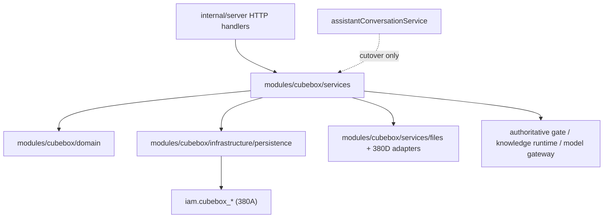

# DEV-PLAN-380B：CubeBox 后端正式实现面切换

**状态**: 已完成（2026-04-15 更新；`380A` contract 已批准可依赖，stopline 1/2/3/5/6 已清零，stopline 4 已收敛为仅剩 bounded legacy commit executor/adapter，满足 `380B` 收尾条件并可作为 `380C` 前置）

> 本文从 `DEV-PLAN-380` 拆分而来，作为 `modules/cubebox` 后端正式实现面切换的实施 SSOT。  
> `DEV-PLAN-380A` 负责 PostgreSQL 数据面 contract、前向迁移与 sqlc 基座；本文只负责 `CubeBox` 后端在 Go 仓内的正式实现、DDD 落点、切换批次与 stopline。  
> `DEV-PLAN-380C/380D/380E` 分别继续持有 API/DTO 收口、文件面正式化、前端收口；本文不会重复裁决这些子计划的范围。

## 1. 背景与上下文 (Context)

- **需求来源**:
  - `docs/dev-plans/380-cubebox-first-party-ownership-and-librechat-retirement-plan.md`
  - `docs/dev-plans/380a-cubebox-postgresql-data-plane-and-migration-contract.md`
  - `docs/dev-plans/380c-cubebox-api-dto-convergence-and-assistant-retirement-plan.md`
  - `docs/dev-plans/380d-cubebox-file-plane-formalization-plan.md`
- **当前痛点**:
  - `/internal/cubebox/*` 已成为正式入口之一，但切换仍处于“正式读面 + 部分正式写面 + direct task lifecycle 已 formal + 有界 legacy authoritative bridge”阶段，尚未完成整个 `380B` 收口。
  - 当前已完成的切换：
    - `internal/server/cubebox_api.go` 不再直接代理 `handleAssistant*API`
    - conversations list/get、turns detail、task detail、models、runtime-status 已经由 `modules/cubebox` facade 暴露
    - task `poll_uri` 已由正式 service/DTO 直接生成 `/internal/cubebox/tasks/{task_id}`
    - conversation delete 已具备正式删除语义，不再返回 `501`
    - direct `/internal/cubebox/tasks` 的 submit/cancel 已落到 `iam.cubebox_*` 正式表
  - 当前收尾后的 bounded bridge：
    - create conversation / append turn / confirm turn 仍由 bounded legacy authoritative helper 产出业务 authoritative snapshot，但结果会同步写回 `cubebox_*` formal read/write 面
    - direct `/internal/cubebox/tasks` 的 submit/detail/cancel/dispatch 已迁到 `modules/cubebox`，workflow execute/apply result 也会在执行后把 authoritative terminal snapshot 同步回 `cubebox_*`
    - 唯一保留的 legacy bridge 是 `internal/server/cubebox_links.go` 对 `executeCommitCoreTx(...)` / commit adapter 的 bounded 调用
  - 这意味着当前形态已从“新命名空间 + 直接 handler 代理”收敛到“formal read/write 主链已切换，legacy 仅剩 bounded executor/adapter bridge”的阶段，满足 `380B` 作为后端正式实现面切换批次的完成定义。
- **评审确认的未完成项（当前工作区）**:
  - `runtime-status` 与 files 组合根/API 主链已完成 facade 收口；files 不再构成 stopline。
  - direct task lifecycle 的 dispatch / retry / deadline / dead-letter / terminal state transition 已迁入 `modules/cubebox/services/facade`，workflow execute/apply result 也已补齐 formal terminal snapshot 回写。
  - create/append/confirm/commit 仍保留切换期 bounded bridge，但 formal snapshot write surface 与 formal task submit / dispatch state machine 已建立。
  - `commit turn -> formal task submit` 已通过 `cubebox_turns` formal snapshot 驱动；formal conversation 缺失时保留 bounded fallback。
  - focused tests 与 readiness 证据已补齐，见 `docs/dev-records/DEV-PLAN-380B-READINESS.md`。
- **路线图分析（380 主线依赖）**:
  - `380A` 先冻结 `iam.cubebox_*` 表、sqlc 与迁移算法，提供后端正式落点的最小数据面。
  - `380B` 需要在此基础上把 Go 侧实现从 `assistant` 复用链路迁出，否则 `380C` 无法真正退役 `/internal/assistant/*`。
  - `380D` 与本文并行推进：文件元数据/引用关系由 `380D` 冻结，但文件服务装配、仓内模块边界与 handler 迁出属于本文。
- **业务价值**:
  - 让 `CubeBox` 从“品牌/页面已切换，但内核仍复用旧 assistant”进入“品牌、API、数据面、模块实现一致”的正式产品形态。
  - 将 `internal/server` 收敛为 delivery/adapter，而不是继续承载业务编排与仓储逻辑，满足仓库 DDD 分层与 `ddd-layering-p0/p2` 门禁方向。

## 2. 目标与非目标 (Goals & Non-Goals)

### 2.1 核心目标

1. [ ] 在 `modules/cubebox` 内建立可直接承接正式后端主链的 `domain / services / infrastructure / presentation` 实现，不再依赖 `assistantConversationService` 作为长期业务核心。
2. [ ] 将以下能力的正式实现迁出 `internal/server` 代理链，收敛到 `modules/cubebox`：
   - conversations（create/list/get/delete）
   - turns（append / confirm / commit）
   - tasks（submit / detail / cancel / dispatch）
   - runtime-status
   - models（只读展示）
   - files（服务装配与仓内边界；文件元数据 contract 由 `380D` 持有）
3. [ ] 收口 `internal/server` 只保留 HTTP 接线、tenant/session/authz/routing/error mapping/streaming 适配与模块装配职责。
4. [ ] 明确每一批次的目标职责边界、允许保留的临时桥接，以及切换完成后的 stopline，防止 “proxy 一直留着以后再说”。
5. [ ] 为 `380C` 提供前提：当本文完成后，`/internal/cubebox/*` 背后将具备独立后端实现，`/internal/assistant/*` 才可以进入正式退役批次。

### 2.2 非目标 (Out of Scope)

1. 不在本文重新定义 `iam.cubebox_*` PostgreSQL schema、约束、迁移算法与 sqlc contract；这些由 `380A` 持有。
2. 不在本文裁决 `/internal/assistant/*` 的最终 `410 Gone` / 迁移窗口 / DTO 兼容策略；这些由 `380C` 持有。
3. 不在本文定义前端 IA、页面布局与视觉收口；这些由 `380E` 持有。
4. 不在本文扩大 `CubeBox v1` 产品范围，不新增 Prompt/Template/Memory/Web Search/MCP 等超出 `380` 已冻结范围的能力。
5. 不在本文把知识 runtime、policy runtime、authoritative gate 重写成第二套解释器；`CubeBox` 继续复用仓内既有 authoritative runtime 主线。

### 2.3 工具链与门禁（SSOT 引用）

- **执行入口（SSOT）**:
  - 触发器矩阵与仓库红线：`AGENTS.md`
  - 文档格式：`docs/dev-plans/000-docs-format.md`
  - DDD 分层：`docs/dev-plans/015-ddd-layering-framework.md`
  - 模块骨架：`docs/dev-plans/016-greenfield-hr-modules-skeleton.md`
  - 路由治理：`docs/dev-plans/017-routing-strategy.md`
  - Atlas + Goose / sqlc：`docs/dev-plans/024-atlas-goose-closed-loop-guide.md`、`docs/dev-plans/025-sqlc-guidelines.md`
  - 命令入口：`Makefile` 与 CI workflow
- **本计划命中的门禁边界**:
  - `ddd-layering-p0/p2`：保护 `internal/server` 不继续承载 `CubeBox` 业务主链，且 `module.go/links.go` 必须承担组合根职责。
  - `no-legacy`：保护 `/internal/cubebox/*` 不得长期保留 `assistant` 代理壳或双正式主链。
  - `routing` / `capability-route-map`：保护 successor 路由入口与 capability 映射不漂移。
  - `error-message`：保护正式错误语义、错误码与用户可见提示收敛。
  - `Atlas/Goose/sqlc`：在命中 `380A` 数据面/仓储接线时，保护 PostgreSQL contract 与生成物不漂移。
- **记录口径**:
  - 本文只说明“命中哪些 SSOT 入口，以及这些入口保护什么边界”。
  - 实际执行命令、时间戳、环境与结果统一回写 readiness/dev-record，不在本文重复复制执行手册。

## 3. 架构与关键决策 (Architecture & Decisions)

### 3.1 目标架构图 (Mermaid)

### 3.2 关键设计决策 (ADR 摘要)

- **决策 1：`internal/server` 不再承载 `CubeBox` 业务 SoT**
  - **现状**: `cubebox_api.go` 直接调用 `handleAssistant*API`。
  - **选项 A**: 继续保留代理，等 `380C` 一次性清理。缺点：`380B` 失去独立意义，`/internal/cubebox/*` 仍是“换壳 assistant”。
  - **选项 B (选定)**: `internal/server` 只做 delivery/adapter，业务编排迁入 `modules/cubebox`。优点：符合 `DEV-PLAN-015` 与 `380` 主目标。

- **决策 2：先迁“服务编排 + 仓储边界”，再做 API 退役**
  - **选项 A**: 直接先删 `/internal/assistant/*`。缺点：`CubeBox` 后端仍未独立，风险会被转移到运行时。
  - **选项 B (选定)**: 先完成 `380B`，再由 `380C` 承接命名空间收口与旧 API 退役。优点：切换链路清晰，便于回归验证。

- **决策 3：`modules/cubebox` 采用“Go Facade + PostgreSQL persistence + runtime adapters”形态**
  - **说明**:
    - 数据权威与持久化 contract 在 `380A`
    - 业务编排与错误映射在 `modules/cubebox/services`
    - runtime/knowledge/model gateway 继续复用现有 authoritative 能力，但通过 `cubebox` 端口收敛，而不是在 `internal/server` 到处直接读写 `assistant*` 结构

- **决策 4：禁止长期保留 `assistant` 结构体作为 `cubebox` 的核心领域模型**
  - **现状**: `assistantConversation`、`assistantTurn`、`assistantTaskRecord` 等结构体承载当前业务语义。
  - **选项 A**: 在 `cubebox` 中继续直接复用这些结构体。缺点：命名与边界持续回流，`380C` 很难收口。
  - **选项 B (选定)**: 在 `modules/cubebox/domain` 建立 `cubebox` 自身的稳定类型/端口/错误语义，必要时在切换期做 mapper。优点：边界稳定，可逐步替换而不是永久 alias。

- **决策 5：切换期间允许“有限桥接”，但桥接必须可删除且有 stopline**
  - **允许**:
    - 以 adapter 方式调用既有 authoritative gate / runtime / model gateway
    - 个别 `assistant` helper 在切换中被 `cubebox` facade 包裹后短期复用
  - **禁止**:
    - `cubebox` handler 永久代理 `assistant` handler
    - `modules/cubebox` 继续直接把 `assistantConversationService` 当作仓内主服务
    - `poll_uri` 靠响应字符串改写作为长期实现

## 4. 当前实现盘点与目标落点 (Current State vs Target Landing)

### 4.1 当前实现盘点

1. **已存在的 `cubebox` 资产**:
   - `modules/cubebox/module.go`
   - `modules/cubebox/services/files.go`
   - `modules/cubebox/infrastructure/local_file_store.go`
   - `modules/cubebox/infrastructure/persistence/store.go`
   - `modules/cubebox/infrastructure/sqlc/queries/*.sql`
   - `modules/cubebox/infrastructure/sqlc/gen/*`
2. **当前缺口**:
   - `modules/cubebox/domain/` 与 `services/facade` 已补齐最小稳定类型/错误语义，但尚未覆盖 dispatch/workflow 这一整段正式任务状态机。
   - `modules/cubebox/presentation/` 仍为空，目前 request/response mapper 与 HTTP error adapter 仍主要留在 `internal/server`。
   - `internal/server/cubebox_files_api.go` / 文件装配仍未通过 `modules/cubebox` 组合根收口。
   - create/append/confirm/commit 仍未迁出 legacy authoritative 主链。
3. **assistant 复用热点**:
   - conversation 写生命周期与 turn append/confirm/commit 仍在 `internal/server/assistant_*.go`
   - task dispatch / workflow / terminal transition 仍在 `internal/server/assistant_task_store.go`
   - 文件服务装配仍在 `internal/server`

### 4.2 当前完成度结论（Groundwork vs Cutover）

1. **已完成的 groundwork**:
   - `380A` 对应的 `cubebox_*` schema/sqlc/PGStore 基座已具备后续接线条件。
   - `modules/cubebox` 已建立 domain / services facade / module / links 与本地文件最小闭环。
   - `/internal/cubebox/*` 已建立 successor 路由入口，前端与路由/能力映射可继续围绕该命名空间推进。
2. **尚未完成的正式切换**:
   - `CubeBox` 后端主链仍未完全脱离 `assistant` bridge，尤其是 create/append/confirm/commit 与 workflow executor。
   - `modules/cubebox` 已形成 conversations/task/models/runtime-status/files 与 direct task dispatch 的正式实现面，但 turn 写链与 workflow executor 尚未收口。
   - 当前工作区仍命中 stopline 4，因此本文状态只能是“实施中/未完成”，不能视为 `380B` 已实现。

### 4.2.1 2026-04-15 进度快照

1. **本批次已落地**:
   - `modules/cubebox/domain` 已补 conversations/tasks/models/runtime 类型与稳定错误语义。
   - `/internal/cubebox/*` 已不再直接转调 `handleAssistant*API`。
   - `poll_uri` 已由正式 service/DTO 直接生成 `/internal/cubebox/tasks/{task_id}`。
   - `DELETE /internal/cubebox/conversations/{conversation_id}` 已落正式删除语义。
   - `models`、`runtime-status`、conversation/task 只读链已经经由 `cubebox` facade 暴露。
   - review 驱动修复已完成：reply action 恢复、formal/legacy DTO rich fields 对齐、task detail actor 校验补齐、conversation seek 分页补齐。
   - direct `/internal/cubebox/tasks` 的 submit/cancel 已迁到 `cubebox_*` 正式数据面。
   - direct `/internal/cubebox/tasks` 的 dispatch state machine 已迁到 `modules/cubebox/services/facade`：
     - pending outbox 读取
     - running/succeeded/manual_takeover_required 状态推进
     - retry/backoff/deadline/dead-letter
     - task events / outbox 更新
   - direct task submit 后会做 best-effort formal dispatch；task detail 读取前也会先触发 formal pending dispatch flush。
   - `/internal/cubebox/files` 已改为通过 `cubebox` facade 提供；默认本地文件根目录与 local file service 装配已迁入 `modules/cubebox/module.go`。
   - create conversation / append turn / confirm turn 现已具备“legacy authoritative 结果 -> `cubebox_*` 正式快照落库”的受控主链：
     - `modules/cubebox/services/facade.go` 在 legacy 返回会话 authoritative snapshot 后，会同步写入 `iam.cubebox_conversations` / `iam.cubebox_turns` / `iam.cubebox_state_transitions`
     - `/internal/cubebox/*` 的后续 detail/list 读取因此可优先命中 `cubebox` 正式读面，而不是持续完全依赖 legacy 只读回退
     - 这一步的目标是先建立 `cubebox` formal snapshot write surface，尚未宣称业务 authoritative 已完全脱离 legacy
	   - `commit turn -> formal task submit` 已迁到 `modules/cubebox/services/facade.go`：
	     - `CommitTurn(...)` 现会优先读取 `cubebox_conversations/cubebox_turns` 正式快照
	     - 在 formal turn 处于 `confirmed` 且 contract snapshot 可由 `cubebox_turns` 还原时，直接生成 formal `TaskSubmitRequest` 并写入 `iam.cubebox_tasks`
	     - formal conversation 不存在时，仍保留 bounded fallback 到 legacy `CommitTurn(...)`
	   - workflow execute/apply result 已补齐 formal terminal snapshot 回写：
	     - `modules/cubebox/services/facade.go` 会在 bounded executor 返回后，把 committed / manual_takeover terminal conversation/turn snapshot 同步回 `iam.cubebox_conversations` / `iam.cubebox_turns`
	     - snapshot sync failure 不会触发重复执行，而是收敛为 task `manual_takeover_required`
		2. **当前仍保留的切换期桥接**:
		   - create conversation / append turn / confirm turn 的业务 authoritative 仍由 bounded legacy helper 产出，`cubebox` 当前负责正式快照持久化与正式读面承接
		   - commit turn 的前置业务 authoritative 校验仍建立在 formal snapshot 已由 legacy authoritative 刷新落库这一前提上
		   - workflow executor 已改为由 `modules/cubebox/services/facade.go` 读取 `cubebox_*` formal conversation/turn snapshot 并下传给 `internal/server/cubebox_links.go` 的 bounded legacy adapter；adapter 不再自行回读 legacy `assistant_conversations/assistant_turns`
		   - bounded legacy adapter 仍调用 `executeCommitCoreTx(...)` 执行 commit adapter 与 legacy persistence；这部分是 `380B` 收尾后仍保留的唯一 bounded legacy executor/adapter
		3. **当前最大的剩余实现面**:
		   - 在 `380C/后续批次` 中继续把 bounded legacy executor 从 `executeCommitCoreTx(...)` 收缩到真正可删除
		   - 清理 `CommitTurn(...)` 中“formal conversation 缺失 -> fallback”条件，形成完全 formal authoritative 写链
		   - 持续补充回归与 successor API/DTO 收口

### 4.3 完成定义、不变量与失败语义

1. **完成定义（必须同时满足）**:
   - `/internal/cubebox/*` 不再直接转调 `handleAssistant*API`。
   - `poll_uri` 由正式 `cubebox` service/DTO 直接生成，而不是依赖响应后改写。
   - `DELETE /internal/cubebox/conversations/{conversation_id}` 具备正式删除语义，不再返回 `501`。
   - `runtime-status` 与 `files` 通过 `modules/cubebox` facade 暴露，不再依赖 `assistantSvc` 内部字段或 `internal/server` 直接装配本地服务。
   - `modules/cubebox` 形成 conversations/turns/tasks/models/runtime-status/files 的正式实现面，而不只是 PGStore 与文件骨架。
2. **核心不变量**:
   - `internal/server` 只保留 delivery/adapter，不再承载 `CubeBox` 业务主链。
   - `modules/cubebox/module.go` / `links.go` 必须承担组合根与路由装配职责，不能继续空壳。
   - `cubebox` 不能长期以 `assistant` handler、`assistant` 领域类型或响应字符串改写作为正式实现。
   - 命中 `380A` 数据面时，仍必须遵守 PostgreSQL contract、tenant tx/RLS 与 fail-closed 边界。
3. **失败语义**:
   - 任一 stopline 未清零，则 `380B` 状态保持“未完成”。
   - 若仍存在 bridge，必须登记为临时桥接点并说明删除批次；不得把 bridge 当完成态。
   - `380C` 可在 stopline 1/2/3/5/6 清零且 stopline 4 已收敛为“仅剩 bounded legacy executor/adapter”后启动，但不得把剩余 bounded bridge 误记为已退役。

### 4.4 目标职责边界与承载点

完成态至少满足以下职责承载；文件名只作为示例，不构成强制文件树要求：

1. `modules/cubebox/domain`
   - 承接 `Conversation`、`Turn`、`Task`、`RuntimeStatus`、`File` 等稳定领域类型、端口与错误语义。
   - 可由 `conversation.go`、`ports.go`、`errors.go` 等文件承载，但本文冻结的是职责，不是精确文件名。
2. `modules/cubebox/services`
   - 承接 conversations/turns/tasks/models/runtime-status/files facade。
   - 不得再把 `assistantConversationService` 当作仓内主服务。
3. `modules/cubebox/infrastructure`
   - 承接 PostgreSQL persistence、runtime/model/file adapters。
   - 可按规模拆分具体文件，但不得把持久化/adapter 主链继续留在 `internal/server`。
4. `modules/cubebox/presentation`
   - 仅在需要时承接 request/response mapper 与 delivery 辅助。
   - 不得在该层重建业务状态机或主编排逻辑。
5. `modules/cubebox/module.go` / `links.go`
   - 必须成为组合根与对 `internal/server` 暴露的接线点。
   - 负责 services、adapters 与路由挂接装配，不承载业务用例细节。
6. `internal/server`
   - 仅保留 adapter/delivery。
   - 任何 conversation/turn/task/runtime/file 主编排继续留在这里，都视为 `380B` 未完成。

### 4.5 `internal/server` 的目标残留职责

`internal/server` 在 `380B` 完成后仅保留：

1. HTTP 路由注册与 path 参数解析
2. tenant / principal / session 注入
3. capability / authz / routing class 适配
4. request DTO 解码与 response DTO 编码
5. streaming / SSE / chunked response 等纯 delivery 逻辑
6. 错误码到 HTTP status / 文案的最终映射

以下职责必须迁出 `internal/server`：

1. conversation/turn/task 业务编排
2. 对 `iam.cubebox_*` 的持久化读写细节
3. task dispatch / retry / deadline / snapshot compatibility 主逻辑
4. runtime-status 聚合判断逻辑
5. file service 的正式装配入口

## 5. 后端 contract 与模块边界 (Module Contracts)

### 5.1 Domain 层 contract

1. [ ] 定义 `Conversation`、`Turn`、`Task`、`TaskEvent`、`File`、`FileLink`、`RuntimeStatus` 的稳定领域类型。
2. [ ] 定义稳定枚举，而不是在 `internal/server` 各文件散落字符串常量：
   - state / phase
   - task status / dispatch status
   - file scan status / link role
3. [ ] 定义 repository / runtime / model gateway / file store 的端口接口。
4. [ ] 定义 `CubeBox` 领域错误语义，至少覆盖：
   - conversation not found
   - turn not found
   - task not found
   - invalid task state transition
   - task snapshot incompatible
   - file unavailable / upload invalid
   - delete blocked by running task

### 5.2 Services 层 contract

1. [ ] `ConversationService`
   - create/list/get/delete
   - delete 必须落正式语义，不再返回 `501`
2. [ ] `TurnService`
   - append turn
   - confirm
   - commit
   - 允许在实现期包裹现有 authoritative runtime，但禁止继续由 `assistant` handler 直接对外
3. [ ] `TaskService`
   - submit async task
   - query detail
   - cancel
   - dispatch batch / execute workflow
4. [ ] `ModelService`
   - 只读列出可用模型与 provider 状态
5. [ ] `RuntimeStatusService`
   - 聚合 frontend/backend/knowledge/model/file 等子组件健康度
   - 不再直接读取 `assistantSvc` 内部字段
6. [ ] `FileService`
   - 与 `380D` 对齐元数据/引用 contract
   - 切换期间可继续承接本地文件适配器，但对外由 `cubebox` facade 暴露

### 5.3 Infrastructure 层 contract

1. [ ] `persistence` 承接 `380A` 的 sqlc 包，不再让 `internal/server` 直接实现 `assistant_*` PG 读写。
2. [ ] `runtime` adapter 承接既有 authoritative 依赖：
   - knowledge runtime
   - model gateway
   - policy / authoritative gate
3. [ ] 文件存储 adapter 与元数据 adapter 分离：
   - 对象存储（localfs / future s3_compat）
   - PostgreSQL 元数据 / link repository
4. [ ] adapter 只能实现端口，不得把业务编排塞回 infrastructure。

### 5.4 Presentation 层 contract

1. [ ] 若 `modules/cubebox/presentation` 参与收口，则只承接 API DTO mapper / HTTP error adapter。
2. [ ] 不允许在 `presentation` 重建业务状态机。
3. [ ] `internal/server` 与 `modules/cubebox/presentation` 的分工以“可维护性最小原则”为准：
   - 若仅少量 mapper，可留在 server
   - 若 DTO 与错误映射开始复杂化，则收口到 `modules/cubebox/presentation`

## 6. 核心切换算法与实施批次 (Migration & Cutover Plan)

### 6.1 Phase B0：契约冻结与现状止血

1. [ ] 冻结本文档，明确“禁止长期保留 proxy handler” 的 stopline。
2. [ ] 标记当前 bridge 点：
   - `internal/server/cubebox_api.go`
   - `internal/server/cubebox_files_api.go`
   - `internal/server/assistant_task_store.go`
   - `internal/server/assistant_api.go`
3. [X] 新增或补齐 `modules/cubebox/domain` 与 `services` 骨架，先把后续要迁的能力落层。

**当前状态**:
- [X] `380A` 前置 contract 已批准，`cubebox_*` 数据面 contract 可作为本计划依赖；迁移执行证据与 stopline 校验继续由 `380A` readiness 关闭。
- [X] 当前 bridge 点已被评审明确识别。
- [X] `modules/cubebox/domain` 与 conversations/tasks/models/runtime-status services 骨架已补齐，可作为后续写链继续迁出的稳定落点。

### 6.2 Phase B1：只读能力先迁出

优先迁不会引发写路径切换风险的读链：

1. [X] conversations list/get
2. [X] conversation turns list
3. [X] task detail
4. [ ] task events / dispatch outbox list
5. [ ] files list / get
6. [X] models list
7. [X] runtime-status

交付要求：

1. [X] `internal/server/cubebox_api.go` 不再直接调 `handleAssistantConversationDetailAPI` / `handleAssistantTasksAPI` 处理只读分支。
2. [X] `runtime-status` 改由 `cubebox` facade 聚合，server 只做 JSON 输出。
3. [ ] 只读查询全部改走 `modules/cubebox/infrastructure/persistence`。

**当前状态**:
- [X] conversations list/get、turns detail、task detail、models 的读面已经不再直接依赖 `assistant` handler。
- [X] `runtime-status` 已经由 `cubebox` facade 聚合。
- [ ] task events / dispatch outbox list 仍未经由 `cubebox` 正式读面暴露。
- [ ] files 的查询链虽然已有基础设施能力，但 API/组合根仍未切到正式活链路。

### 6.3 Phase B2：写路径 facade 迁出

在 `380A` 数据面可写后，迁出正式写路径：

1. [ ] create conversation
2. [ ] append turn
3. [ ] confirm turn
4. [ ] commit turn
5. [X] submit task
6. [X] cancel task
7. [X] delete conversation

交付要求：

1. [X] 不再由 `cubebox` handler 直接代理 `assistant` handler。
2. [X] `poll_uri` 在 service/DTO 层生成正确的 `/internal/cubebox/tasks/{task_id}`，而不是响应后字符串改写。
3. [X] delete conversation 落正式删除算法，需对齐 `380A 6.4 会话删除算法`。

**当前状态**:
- [ ] create/append/confirm/commit 仍通过 bounded facade bridge 回落到 legacy authoritative。
- [X] direct `/internal/cubebox/tasks` submit/cancel 已由 `modules/cubebox` 正式 task writer 承接。
- [X] `poll_uri` 已由正式 service/DTO 直接生成。
- [X] delete conversation 已具备正式删除语义与 blocking task 校验。
- [ ] `commit turn -> formal task submit` 当前被 `cubebox_turns` 正式写链缺失阻塞，尚不能安全切换到 `cubebox_tasks`。

### 6.4 Phase B3：task dispatch / workflow 执行迁出

这是 `380B` 的核心批次，目标是把 `assistant_task_store.go` 中的正式业务主链搬到 `modules/cubebox`：

1. [X] submit / dedupe / workflow id 生成
2. [X] snapshot compatibility check
3. [X] dispatch retry / deadline / dead-letter
4. [ ] execute workflow / apply result / terminal state transition
5. [X] task event / outbox 更新

交付要求：

1. [ ] `assistantTask*` 结构体不再作为 `CubeBox` 正式任务链的主模型。
2. [ ] `assistant_async_plan` 若继续作为底层 task_type 常量，必须由 `cubebox` domain 封装解释，不可在 `internal/server` 到处散落。
3. [ ] 任务状态机迁出后，`internal/server/assistant_task_store.go` 不再被 `/internal/cubebox/*` 主链引用。

**当前状态**:
- [X] direct `/internal/cubebox/tasks` 的 submit / dedupe / workflow id 生成与 snapshot compatibility 已经迁到 `modules/cubebox`。
- [X] direct task 的 dispatch / retry / deadline / dead-letter / task event / outbox 更新已迁到 `modules/cubebox/services/facade`，并复用 `cubebox_*` 正式表。
- [X] commit turn -> submit task 已迁到 `modules/cubebox/services/facade.go`，优先由 formal conversation/turn snapshot 生成 formal `TaskSubmitRequest` 并写入 `iam.cubebox_tasks`。
- [X] workflow dispatch 入口已改为 formal snapshot driven：`modules/cubebox` 负责读取 `cubebox_conversations/cubebox_turns/cubebox_state_transitions` 后，把 conversation/turn snapshot 下传给 bounded legacy executor；legacy adapter 不再自行回读 legacy conversation/turn。
- [ ] execute workflow / apply result 仍通过 `internal/server/cubebox_links.go` 的 bounded legacy adapter 调用既有 authoritative `executeCommitCoreTx(...)`，执行结果 apply 与 terminal conversation/turn persistence 尚未正式迁出。
- [ ] `assistantTask*` 已不再是 `/internal/cubebox/tasks` formal task lifecycle 主模型，但仍存在于 bounded legacy executor/commit adapter 段。

### 6.5 Phase B4：组合根与 server 收口

1. [ ] `modules/cubebox/module.go` 负责构造正式 services / repositories / runtime adapters。
2. [ ] `modules/cubebox/links.go` 承接与 `internal/server` 的最小接线契约。
3. [ ] `internal/server` 改为依赖 `cubebox` 暴露的最小接口，不再直接拼装本地文件服务或读取 runtime 内部字段。

**当前状态**:
- [X] `module.go` 已暴露 `NewFacade` / `NewPGStore` / `NewLocalFileService` / `NewDefaultLocalFileService` / `DefaultLocalFileRoot` 等组合根入口。
- [X] `links.go` 已承接最小接线职责（Facade / Principal 出口）。
- [X] `/internal/cubebox/files` 已通过 `cubebox` facade 暴露，`internal/server` 不再直接 new 本地文件服务。
- [ ] `internal/server` 仍保留部分本地装配逻辑，尚未收敛到仅 delivery adapter。

### 6.6 Phase B5：桥接删除与进入 `380C`

1. [ ] 删除所有仅为 `/internal/cubebox/*` 服务的 `assistant` handler proxy。
2. [ ] 删除 `poll_uri` rewrite bridge。
3. [ ] 确认 `cubebox` 主链已不再要求 `assistantConversationService` 作为正式入口依赖。
4. [ ] 以本文完成状态作为 `380C` 启动条件之一。

**当前状态**:
- [ ] 上述 bridge 尚未删除。
- [ ] `380C` 继续保持草拟中/待启动，不具备正式退役旧 API 的前提。

## 7. 与相邻子计划的边界 (Plan Boundaries)

### 7.1 与 `380A` 的边界

`380A` 持有：

1. `iam.cubebox_*` 表结构与约束
2. Atlas / Goose / sqlc 迁移与生成
3. `assistant_* -> cubebox_*` 前向迁移算法
4. delete conversation 的数据级 contract

`380B` 只消费这些 contract，并在 Go 侧实现 facade / repository / adapters。

### 7.2 与 `380C` 的边界

`380B` 完成前：

1. `/internal/cubebox/*` 与 `/internal/assistant/*` 可能仍并存
2. 但 `CubeBox` 主链背后必须已是独立后端实现

`380C` 才负责：

1. DTO 最终命名收口
2. 旧命名空间退役策略
3. 兼容窗口与 `410 Gone` 断言

### 7.3 与 `380D` 的边界

`380D` 持有：

1. 文件元数据 / link 正式 contract
2. 对象文件与元数据一致性
3. 删除/引用回收规则

`380B` 持有：

1. 文件服务在仓内的正式落层与装配
2. file API 不再直接 new local store 的模块化收口

## 8. 依赖与里程碑 (Dependencies & Milestones)

### 8.1 依赖关系（380 主线分析）

1. [X] `380A -> 380B`：正式 `cubebox_*` 数据面已可作为后端正式持久化链依赖。
2. [ ] `380B -> 380C`：后端实现面不独立，API/DTO 无法真正退役旧命名空间。
3. [ ] `380D <-> 380B`：文件 metadata contract 与后端文件装配需并行对齐。
4. [ ] `380B + 380C -> 380E`：前端才能依赖稳定 API，而不是临时桥接响应。

### 8.2 里程碑

1. [ ] M0：本文颗粒冻结，与 `380A` 对齐完成。
2. [X] M1：`modules/cubebox/domain` 与 services facade 骨架齐备。
3. [ ] M2：只读链全部改走 `cubebox` services/repository。
4. [ ] M3：写路径与 delete conversation 正式落地。
5. [ ] M4：task dispatch / workflow 主链迁出 `assistant_task_store.go`。
6. [ ] M5：`internal/server` 仅保留 adapter，bridge 删除完成，可进入 `380C`。

## 9. 测试与验收标准 (Acceptance Criteria)

### 9.0 当前已完成 groundwork / 未完成切换项矩阵

| 项目 | 当前状态 | 说明 |
| --- | --- | --- |
| `cubebox_*` schema/sqlc/PGStore 基座 | 已完成 groundwork | 可支撑后续正式接线，但不代表业务主链已全部切换 |
| `/internal/cubebox/*` 路由入口 | 已完成正式切换 | 已不再直接代理 `assistant` handler；formal read/write 主链已切到 `modules/cubebox`，仅剩 bounded executor/adapter bridge |
| `modules/cubebox` 文件最小闭环 | 已完成 | files facade、默认本地文件服务装配与 API 主链均已通过模块组合根收口 |
| conversations/turns/tasks/models/runtime-status 正式 facade | 已完成 | conversations/task/models/runtime-status/files 与 direct task dispatch 已落地；workflow execute/apply result 也会回写 formal terminal snapshot |
| delete conversation 正式语义 | 已完成 | 已具备正式删除与 blocking task 校验 |
| `poll_uri` 正式生成 | 已完成 | 已由正式 service/DTO 直接生成 |
| runtime-status 模块化 | 已完成 | 已由 `cubebox` facade 聚合 |
| files 组合根与 API 主链 | 已完成 | `/internal/cubebox/files` 已经由 `cubebox` facade 暴露，默认本地文件服务装配已进入模块组合根 |
| readiness/test matrix | 已完成 | focused tests、门禁与 readiness 证据已回写 |

### 9.1 单元测试

1. [ ] `modules/cubebox/domain`:
   - 状态枚举/phase 合法性
   - task 状态机可迁移性
   - delete blocked 规则
2. [ ] `modules/cubebox/services`:
   - conversation create/list/get/delete
   - turn append/confirm/commit
   - task submit/detail/cancel/dispatch
   - runtime-status 聚合
3. [ ] `modules/cubebox/infrastructure`:
   - repository 参数校验与 tenant tx fail-closed
   - runtime adapter 错误映射
   - file adapter 装配

### 9.2 集成测试

1. [ ] `/internal/cubebox/conversations`
   - create/list/get/delete 全链路通过
2. [ ] `/internal/cubebox/conversations/{conversation_id}/turns`
   - append/confirm/commit 正常
3. [ ] `/internal/cubebox/tasks`
   - submit/detail/cancel/dispatch 正常
   - `poll_uri` 直接产出 `/internal/cubebox/tasks/{task_id}`
4. [ ] `/internal/cubebox/runtime-status`
   - backend / knowledge / model / file 状态正确聚合
5. [ ] `/internal/cubebox/files`
   - list/upload/delete 通过 `cubebox` facade 而非 server 直连本地存储

### 9.3 命中门禁与验收口径

> 具体命令入口以 `AGENTS.md`、`Makefile` 与 CI workflow 为 SSOT；本文只记录必须通过哪些门禁，以及它们分别保护什么边界。

1. [ ] `ddd-layering-p0/p2`：证明 `internal/server` 不再承载 `CubeBox` 业务主链，且 `module.go/links.go` 已承担组合根职责。
2. [ ] `no-legacy`：证明 `/internal/cubebox/*` 不再长期代理 `assistant` handler 或保留双正式主链。
3. [ ] `routing` / `capability-route-map`：证明 successor 路由与 capability 映射稳定，不再依赖临时桥接。
4. [ ] `error-message`：证明正式错误语义、错误码与用户可见提示已收敛。
5. [ ] 命中 `380A` 数据面/仓储接线时，对应的 `Atlas/Goose/sqlc` SSOT 验收也已同步通过。
6. [ ] 实际执行过的命令、时间戳、环境与结果已回写 readiness 记录，而不是只停留在本文叙述。

### 9.4 Readiness 证据

1. [X] 新建并回写 `docs/dev-records/DEV-PLAN-380B-READINESS.md`
2. [X] 至少记录以下证据：
   - 各批次完成时间戳与实际命中的 SSOT 入口
   - 关键命令、环境与结果
   - tenant tx / RLS 注入与 fail-closed 证明
   - conversations/turns/tasks/models/runtime-status/files 通过 `modules/cubebox` facade 正式接线的证据
   - delete conversation 正式语义验证
   - `poll_uri` 由 service/DTO 直接生成的验证
   - files 经 `modules/cubebox` 组合根装配，而非 `internal/server` 直连本地服务的证据
   - bridge 删除清单或剩余临时桥接点位（若有）
   - stopline 是否清零

> 说明：当前工作区的 focused 验证、门禁与 bridge 清单已回写 `docs/dev-records/DEV-PLAN-380B-READINESS.md`，可作为 `380B` 收尾证据。

## 10. 运维与监控 (Ops & Monitoring)

### 10.1 运行保护（Greenfield）

1. 不引入 `cubebox -> assistant` 的长期 feature flag fallback。
2. 允许短期桥接，但桥接只用于切换中的 bounded adapter，不得成为正式事实源。
3. 若 `cubebox` 正式后端链路未完成，宁可保持功能未切换，也不能把 `/internal/cubebox/*` 长期伪装成代理壳。

### 10.2 关键日志

结构化日志至少包含：

- `tenant_id`
- `conversation_id`
- `turn_id`
- `task_id`
- `request_id`
- `cutover_stage`
- `bridge_used`
- `error_code`

### 10.3 Stopline

出现以下任一情况，禁止宣布 `380B` 完成，且不得进入 `380C` 的正式退役批次：

1. `/internal/cubebox/*` 仍主要通过 `handleAssistant*API` 代理实现。
2. `poll_uri` 仍依赖响应字符串改写，而不是由正式 service/DTO 生成。
3. `delete /internal/cubebox/conversations/{conversation_id}` 仍返回 `501`。
4. `internal/server` 仍承载 `CubeBox` 的任务状态机、dispatch 重试、snapshot compatibility、formal snapshot 回写或广义持久化主逻辑，而不是只剩 bounded commit executor/adapter bridge。
5. `modules/cubebox` 仍没有稳定 domain 类型/ports/errors，继续直接以 `assistantConversation`、`assistantTaskRecord` 作为正式模型。
6. `cubebox` 文件主链仍由 `internal/server` 直接 new local store，而不是通过模块组合根/服务暴露。
7. 为了切换方便而新增 `assistant_*` 与 `cubebox_*` 的长期双实现、静默 fallback 或第二业务编排入口。

> 当前工作区评审结论（2026-04-15 更新）：stopline 1/2/3/5/6 已清零；create/append/confirm 已具备 formal snapshot write，commit turn 已迁到 formal task submit，direct task lifecycle 已把 dispatch 状态机与 execute/apply result 后的 terminal snapshot 回写迁入 `modules/cubebox/services/facade`。stopline 4 已收敛为仅剩 `internal/server/cubebox_links.go -> executeCommitCoreTx(...)` 的 bounded legacy executor/adapter bridge，因此 `380B` 可收尾完成，并可作为 `380C` 启动前置。

## 11. 下一步推进事项 (Next Steps)

1. [ ] 在 `380C` 中继续迁出 bounded legacy executor：将 `internal/server/cubebox_links.go` 中对 `executeCommitCoreTx(...)` 的 bridge 缩小到真正可删除的 commit adapter 调用。
2. [ ] 梳理并删除 `CommitTurn(...)` 中仅为 formal conversation 缺失而保留的 bounded fallback 条件，形成完全 formal authoritative 写链。
3. [ ] 以 `380B` readiness 为基线，推进 `/internal/cubebox/*` 与 `/internal/assistant/*` 的 DTO/API 收口与旧命名空间退役。
