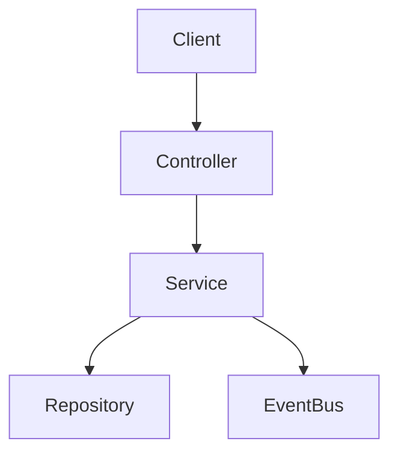

# DEV-PLAN-001：技术详细设计文档模板 (TDD Template)

**状态**: 已完成（2025-12-14 01:30 UTC）

## 模板说明
本模板旨在建立“代码级详细设计”标准（Level 4-5），确保文档交付后，开发人员无需再进行猜测或设计决策即可直接编码。适用于核心模块、复杂特性或涉及跨团队协作的变更。请复制以下内容作为新 DEV-PLAN 的起点。

---

# DEV-PLAN-XXX：[特性名称] 详细设计

**状态**: 规划中（YYYY-MM-DD HH:MM UTC）

## 1. 背景与上下文 (Context)
- **需求来源**: [链接到 PRD/Issue/User Story]
- **当前痛点**: 简述现状及为何需要此变更（例如：当前实现无法满足并发写入需求）。
- **业务价值**: 解决什么用户问题，预期的业务成果。

## 2. 目标与非目标 (Goals & Non-Goals)
- **核心目标**:
  - [ ] 实现 X 功能，响应时间 < 200ms (P99)。
  - [ ] 确保数据一致性，特别是 [特定场景]。
  - [ ] 通过 `make check lint` 与所有 CI 门禁。
  - [ ] 明确本计划命中的工具链/门禁触发器，并按 SSOT 执行与引用（见“工具链与门禁（SSOT 引用）”）。
  - [ ] 明确失败语义、stopline 与运行保护；默认采用 fail-closed、环境级保护与前向修复，不预设 Feature Flag、兼容窗口或双主链。
- **非目标 (Out of Scope)**:
  - 不包含 UI 动画效果。
  - 不处理跨租户的数据迁移（留待后续计划）。

## 2.1 工具链与门禁（SSOT 引用）
> **目的**：避免在 dev-plan 里复制工具链细节导致 drift；本文只声明“本计划命中哪些触发器/工具链”，并给出可复现的入口链接。

- **触发器清单（勾选本计划命中的项）**：
  - [ ] Go 代码（`go fmt ./... && go vet ./... && make check lint && make test`）
  - [ ] `.templ` / Tailwind（`make generate && make css`，并确保生成物提交）
  - [ ] 多语言 JSON（`make check tr`）
  - [ ] Authz（`make authz-test && make authz-lint`；策略聚合用 `make authz-pack`）
  - [ ] 路由治理（`make check routing`；必要时更新 `config/routing/allowlist.yaml`）
  - [ ] DB 迁移 / Schema（按模块/域对应的 dev-plan + `Makefile` 入口执行，如 `make db plan/lint/migrate ...`）
  - [ ] sqlc（按对应 dev-plan + `Makefile` 入口执行，如 `make sqlc-generate`）
  - [ ] Outbox（按 `DEV-PLAN-017` 与 runbook 约定执行与验收）

- **SSOT 链接（按需保留/补充）**：
  - 触发器矩阵与本地必跑：`AGENTS.md`
  - 命令入口与脚本实现：`Makefile`
  - CI 门禁定义：`.github/workflows/quality-gates.yml`
  - 工具链复用索引：`docs/dev-plans/009A-r200-tooling-playbook.md`

## 2.2 测试设计与分层（对齐 DEV-PLAN-301）
> 若本计划涉及 Go 代码、测试整改、服务逻辑或路由/适配层行为变更，本节必填。不要只写“补单测/补集测”，必须先回答“每类断言属于哪一层”。

- **边界分类表（必填）**：

| 层级 | 计划承接内容 | 代表测试对象/文件 | 说明 |
| --- | --- | --- | --- |
| `pkg/**` | [填写：归一化/解析/validator/错误 helper 等纯函数边界] | `[包路径/测试文件]` | 默认 `package xxx_test` 黑盒 + 表驱动子测试 |
| `modules/*/services` | [填写：业务规则/默认值/状态推进/端口隔离服务逻辑] | `[包路径/测试文件]` | 不再把该类规则优先留在 `internal/server` |
| `internal/server` | [填写：路由/协议解析/错误映射/authn/authz/RLS/跨模块编排] | `[包路径/测试文件]` | 只验证适配层与组合层职责 |
| `E2E` | [填写：端到端验收路径] | `[spec 路径]` | 仅做验收层，不兜底 Go 单测缺口 |

- **黑盒 / 白盒策略**：
  - 导出 API、纯函数、解析器、canonicalize、validator、错误映射器默认采用 `package xxx_test`。
  - 若保留白盒测试，必须写明未导出不变量/内部状态推进/seam 尚未完成的原因，以及退出条件。
- **子测试 / 并行策略**：
  - 默认使用表驱动 + `t.Run` 组织场景。
  - 仅纯函数、只读依赖、无共享可变状态时启用 `t.Parallel()`。
  - 使用 `t.Setenv` / `os.Setenv`、包级变量、全局 map、时间源、共享 DB/文件系统的测试不得与 parallel 混用。
- **fuzz / benchmark 适用性**：
  - 解析、归一化、分类、validator 等开放输入空间路径，应评估最小 fuzz；若不补，需写明“不适用”理由。
  - 高频纯函数与热点路径应评估 benchmark；若不补，需写明“不适用”理由。
- **禁止事项 / 例外登记**：
  - 禁止继续新增 `*_coverage_test.go`、`*_gap_test.go`、`*_more_test.go`、`*_extra_test.go` 一类补洞式文件。
  - 若测试暂留 `internal/server` 或无法下沉至 `services`，必须写明“为何暂不迁移、后续承接层级、退出条件”。
  - 不得通过降低覆盖率阈值、扩大排除项或缩小统计范围替代“删死分支/补测试/按职责重组”。

## 3. 架构与关键决策 (Architecture & Decisions)
### 3.1 架构图 (Mermaid)


### 3.2 关键设计决策 (ADR 摘要)
- **决策 1**: [例如：使用 ltree 存储层级关系]
  - **选项 A**: 邻接表。缺点：递归查询性能差。
  - **选项 B**: 闭包表。缺点：写放大严重。
  - **选项 C (选定)**: `ltree`。优点：Postgres 原生支持，读写平衡，符合项目技术栈。

### 3.3 条件必填：统一策略 / PDP 设计（对齐 DEV-PLAN-330）
> 若本计划涉及字段动态策略、配置治理、策略注册表、动作策略、版本激活、explain、PDP 或类似“运行时裁决”能力，本节必填。

- **四层事实源表（必填）**：

| 层 | 唯一主写事实 | 主写入口 | 运行时消费方 | 冻结不变量 |
| --- | --- | --- | --- | --- |
| `Static Metadata SoT` | [字段定义/静态元数据] | [入口] | [消费方] | 不得主写动态裁决语义 |
| `Dynamic Policy SoT` | [required/visible/default/allowed_value_codes/mode 等动态策略] | [入口] | [唯一 PDP] | 不得出现第二主写入口 |
| `Mutation Policy` | [允许哪些写动作/字段变化] | [入口] | [mutation guard / 写前校验] | 不负责字段值裁决 |
| `Policy Activation` | [当前激活版本/`policy_version`/`effective_policy_version`] | [入口] | [版本选择/一致性校验] | 不承载字段裁决语义 |

- **统一运行时主链（必填）**：
  - 外部输入：`[tenant / capability_key / field_key / as_of / business_unit_org_code / ...]`
  - `Context Resolver`：`[原始上下文 -> 规范化 PolicyContext]`
  - capability 链 / lookup bucket：`[intent -> baseline / exact -> wildcard / ...]`
  - 静态读取 + 动态候选读取：`[来源]`
  - 唯一 PDP：`[唯一裁决实现位置]`
  - 输出：`[最终字段决策 + explain + version]`
- **PolicyContext 与记录 / 查询契约（必填）**：
  - 明确外部输入字段与 `PolicyContext` 正式输入字段，禁止混用 legacy 术语。
  - 明确策略记录的作用域轴、允许的记录形状、wildcard 的物理表示与含义。
  - 明确最小查询键、冲突检测键与 fail-closed 语义；禁止“命中后再补 explain 轴”。
- **单主链与边界约束**：
  - 必须明确“唯一 PDP 在哪里”，并列出哪些页面/API/store 只消费决策，不得形成第二 PDP。
  - 若存在旧表/旧 helper/旧 public route/兼容读路径，必须写明退役路径与防回流门禁。
  - 若涉及治理台路由，必须明确 route capability、authz object、owner module / 页面归属三者一致。
- **失败语义与版本语义入口**：
  - 本节必须引用第 `5.3` 节的错误码/stopline/explain/version 矩阵，不得散落在多个章节各写一套。

## 4. 数据模型与约束 (Data Model & Constraints)
> **标准**: 必须精确到字段类型、空值约束、索引策略及数据库级约束（Check/Exclude）。

### 4.1 Schema 定义 (Atlas HCL / SQL)
```hcl
table "org_nodes" {
  column "id" { type = uuid, default = sql("gen_random_uuid()") }
  column "tenant_id" { type = uuid }
  column "code" { type = varchar(64) }

  // Valid Time（业务有效期）统一使用 date（日粒度）；时间戳仅用于 Audit/Tx Time（SSOT：DEV-PLAN-032）。
  column "effective_date" { type = date }
  column "end_date" { type = date, default = "9999-12-31" }

  primary_key { columns = [column.id] }

  // 强约束示例：同一租户下 Code 唯一
  index "idx_org_nodes_code" {
    columns = [column.tenant_id, column.code]
    unique  = true
  }

  // 高级约束示例：防时间重叠 (Postgres EXCLUDE)
  // 注：day 闭区间 [effective_date,end_date] 在 DB 用 daterange 的半开表示实现：
  // exclude using gist (tenant_id with =, code with =, daterange(effective_date, end_date + 1, '[)') with &&)
}
```

### 4.2 迁移策略
- **Up**: 创建表，添加索引，启用扩展（如 `ltree`）。
- **Down**: 删除表（注意：生产环境通常禁止破坏性 Down，需说明数据备份策略）。

## 5. 接口契约 (API Contracts)
> **标准**: 定义 URL、Method、Payload 字段（必填/选填/类型）、错误码。对于 UI 交互，需定义前端请求/响应行为（MUI 页面 + JSON API）。

### 5.1 JSON API: `POST /api/v1/resource`
- **Request**:
  ```json
  {
    "code": "HR-001", // Required, unique
    "parent_id": "uuid", // Optional
    "effective_date": "2024-01-01" // Valid Time: YYYY-MM-DD（日粒度）
  }
  ```
- **Response (201 Created)**:
  ```json
  { "id": "uuid", ... }
  ```
- **Error Codes**:
  - `409 Conflict`: Code 已存在 (`ERR_CODE_DUPLICATE`).
  - `422 Unprocessable Entity`: 父节点不存在或形成环路.

### 5.2 UI 交互（MUI 页面 / JSON API）
- **Action**: 用户点击“保存”按钮。
- **Request**: `POST /resource/form` (Form Data)
- **Response (200 OK)**:
  - Body: 返回 HTML 片段 `<div id="target">...</div>` (例如更新后的列表行)。
  - Headers: `HX-Trigger: {"entityCreated": "uuid"}` (触发前端事件)。
- **Error Response**:
  - 422 Unprocessable Entity: 返回带错误信息的表单片段。

### 5.3 条件必填：失败语义矩阵 / explain / version（对齐 DEV-PLAN-330）
> 若本计划涉及策略裁决、上下文解析、版本一致性、错误码契约或 fail-closed 行为，本节必填。

| 失败场景 | 正式错误码 | 是否允许 fallback | explain 最低输出 | 是否 stopline |
| --- | --- | --- | --- | --- |
| [例如：上下文无法解析] | `xxx_snake_case` | 否 | [最低 explain 字段] | [是/否] |
| [例如：策略缺失 / 冲突 / mode 非法 / 版本 stale] | `xxx_snake_case` | 否 | [最低 explain 字段] | [是/否] |

- **版本字段**：
  - 请求必须携带：`[policy_version / effective_policy_version / ...]`
  - 响应 / explain 必须回显：`[matched_bucket / resolution_trace / effective_policy_version / ...]`
- **约束**：
  - canonical 错误码只保留一套，不保留正式双输出窗口。
  - 不允许回退到 legacy 表、旧命名、前端二次裁决或隐式 wildcard 放行。
  - 若某失败场景出现在 happy path / 门禁样例 / 基线验收中，必须明确其 stopline 含义。

## 6. 核心逻辑与算法 (Business Logic & Algorithms)
> **标准**: 伪代码或状态机，消除歧义，特别是复杂写操作。

### 6.1 节点插入算法 (Insert Node)
1. **开启事务**。
2. **校验父节点**: 查询 `parent_id` 是否存在且 `status=active`；若不存在 -> Return Error `PARENT_NOT_FOUND`。
3. **计算 Path**: `new_path = parent.path + "." + new_id`；校验深度是否超限。
4. **时间片处理 (Effective Dating)**:
   - 锁定目标时间线 (`SELECT FOR UPDATE`)。
   - 若存在重叠片段 -> 截断旧片段 `end_date = new_effective_date - 1 day`。
   - 插入新片段 `[new_effective_date, 9999-12-31]`。
5. **发布事件**: 写入 Outbox `OrgNodeCreated`。
6. **提交事务**。

## 7. 安全与鉴权 (Security & Authz)
- **Casbin Policy**:
  - Subject: `tenant:{id}:user:{id}`
  - Object: `module.resource` (e.g., `org.nodes`)
  - Action: `create` / `read`
- **数据隔离**: 所有 SQL 查询必须包含 `WHERE tenant_id = $1`。
- **Route/Authz 对齐（条件必填）**：
  - 若涉及 route capability、owner module、authz object、allowlist 或治理台页面归属，必须明确 canonical 值、映射来源与验证方式，避免页面归属/route capability/authz object 分裂。

## 8. 依赖与里程碑 (Dependencies & Milestones)
- **依赖**:
  - 需先完成 DEV-PLAN-XXX (Schema)。
- **里程碑**:
  1. [ ] Schema 迁移脚本与 Atlas 校验。
  2. [ ] Repository 层 CRUD 与单元测试。
  3. [ ] Service 层复杂校验逻辑与算法实现。
  4. [ ] API 控制器与 E2E 测试。
  5. [ ] Readiness 验证记录。

## 9. 测试与验收标准 (Acceptance Criteria)
- **单元测试**:
  - [ ] 覆盖边界：时间重叠、环路检测、空值/默认值、并发、幂等、错误映射等。
  - [ ] 覆盖率门禁（如适用）：目标阈值、口径（Line/Branch）、统计范围与排除项（生成代码/第三方等），以及审计方式与证据链接。
  - [ ] 若命中第 `2.2` 节，必须补齐边界分类表、黑盒/白盒策略、并行限制、fuzz/benchmark 适用性与例外理由。
- **集成测试**: 真实 DB 环境下，并发写入不产生脏数据。
- **策略/裁决验收（如适用）**:
  - [ ] 若命中第 `3.3` / `5.3` 节，必须明确唯一 PDP 位置、`Context Resolver`、`PolicyContext`、记录/查询契约、explain/version 输出与失败语义矩阵。
  - [ ] 若存在旧事实源/旧 helper/旧 public route，必须有退役路径、stopline 与防回流门禁。
- **Lint**: `make check lint` 通过，无 go-cleanarch 违规。
- **Readiness**:
  - [ ] 执行 `docs/dev-records/DEV-PLAN-XXX-READINESS.md` 记录命令、结果、时间戳与证据链接。
  - [ ] 对白盒保留、不并行、不补 fuzz、不补 benchmark、测试暂留 `internal/server`、引入新 seam 等例外，必须给出一句话理由。
  - [ ] 若删除死分支或冗余测试，必须说明不可达原因与对外契约不变性。

## 10. 运维与监控 (Ops & Monitoring)
- **运行保护（Greenfield）**:
  - 不引入功能开关/双链路/legacy 入口。
  - 故障处置仅允许环境级保护与“只读/停写”。
- **关键日志**: 结构化日志需包含 `request_id`, `tenant_id`, `change_type`。
- **指标**: 关键路径的 Latency 与 Error Rate。
- **故障处置与恢复（No-Legacy）**:
  - 触发条件: 何时进入保护模式（需给出可观测信号/阈值）。
  - 执行顺序: 环境级保护 → 只读/停写 → 修复（配置/数据/迁移）→ 重试/重放 → 恢复。
  - 数据处置: 以前向修复（补偿/更正/重放）为主，禁止回退到旧事实源/旧实现。
  - 恢复判定: 明确检查项与责任人（通过后才恢复写入）。
