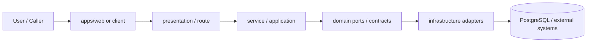

# DEV-PLAN-001：技术详细设计文档模板（Implementation Repo / Contract-First）

**状态**: 已完成（2026-04-16 07:24 CST；按 DEV-PLAN-003 与仓库现行 SSOT 重写）

## 模板定位
本模板用于 `Bugs-And-Blossoms` 这个 implementation repo 的 dev-plan/spec，目标不是产出“泛用型技术方案作文”，而是为本仓实现冻结：

- 边界与职责归属
- 不变量与失败语义
- 路由 / API / UI / 数据契约
- 测试分层与验收口径
- 命中的门禁入口与 readiness 证据要求

适用口径：

- `T0`：拼写、格式、极小重构，可简化使用
- `T1`：常规功能改动，至少冻结目标、边界、不变量、失败路径与验收
- `T2`：API / DB / 迁移 / AuthN / RLS / Authz / Routing / One Door / 生成链路等高风险改动，必须按本模板完整冻结

使用规则：

- 先做 `Research -> Plan -> Implement`，不要把关键设计决策推迟到实现阶段试错
- dev-plan 只写“本次计划命中了哪些触发器、采用哪些契约、如何验收”，不要复制 `AGENTS.md` / `Makefile` / CI 中的整段命令矩阵
- 实际执行命令、结果、时间戳与证据链接写入 `docs/dev-records/DEV-PLAN-XXX-READINESS.md`
- 若实现偏离计划，先更新 dev-plan，再改代码

---

# DEV-PLAN-XXX：[特性名称]

**状态**: 规划中（YYYY-MM-DD HH:MM TZ）

## 0. 适用范围与评审分级

- **评审分级**：`T0 / T1 / T2`
- **范围一句话**：[这次计划实际改什么，不改什么]
- **关联模块/目录**：[如 `modules/orgunit`、`internal/server`、`apps/web`、`pkg/**`]
- **关联计划/标准**：[列出命中的 SSOT，不要堆所有文档]
- **用户入口/触点**：[页面、按钮、路由、API、后台任务、CLI 等]

### 0.1 Simple > Easy 三问（必填）

1. **边界**：这次变更引入或修改了哪些边界？每个边界的 owner 是谁？
2. **不变量**：必须始终成立的业务/技术规则是什么？由谁强制保证？
3. **可解释**：作者能否在 5 分钟内讲清主流程、失败路径、状态机与恢复语义？

### 0.2 现状研究摘要（T2 必填，T1 按需）

- **现状实现**：[当前代码路径、路由、数据流、依赖方向]
- **现状约束**：[历史行为、租户/权限、时间语义、生成物、性能、外部依赖]
- **最容易出错的位置**：[并发、迁移、错误映射、前端状态、回放、跨模块耦合等]
- **本次不沿用的“容易做法”**：[例如 legacy alias、第二写入口、双主链、页面内直接拼 capability/action]

## 1. 背景与上下文（Context）

- **需求来源**：[Issue / PRD / 用户故事 / 缺陷 / 评审结论]
- **当前痛点**：[明确“为什么现在要做”]
- **业务价值**：[解决谁的问题，交付后用户能完成什么]
- **仓库级约束**：[只写本次确实命中的硬约束，例如 One Door / No Tx, No RLS / 单前端链路 / en-zh only]

## 2. 目标与非目标（Goals & Non-Goals）

### 2.1 核心目标

- [ ] [目标 1：用户或业务结果]
- [ ] [目标 2：边界/契约/不变量]
- [ ] [目标 3：门禁/测试/生成物对齐]
- [ ] [目标 4：失败语义 / stopline / 恢复方式明确]

### 2.2 非目标（Out of Scope）

- [明确这次不做什么，避免实现期“顺手加进去”]
- [明确不兼容什么 legacy/旧链路/旧别名]
- [明确不引入什么额外抽象、依赖或运维开销]

### 2.3 用户可见性交付（必填）

- **用户可见入口**：[页面、导航、按钮、表单、列表、详情、CLI、任务面板等]
- **最小可操作闭环**：[用户至少能完成哪一条端到端操作]
- **若短期为后端先行**：
  - 必须写清未来入口规划
  - 必须写清当前如何验收该能力不是“僵尸功能”

## 2.4 工具链与门禁（SSOT 引用）

> 只声明本次命中哪些触发器与事实源；不要复制命令矩阵。实际执行结果写入 readiness/dev-record。

- **命中触发器（勾选）**：
  - [ ] Go 代码
  - [ ] `apps/web/**` / presentation assets / 生成物
  - [ ] i18n（仅 `en/zh`）
  - [ ] DB Schema / Migration / Backfill / Correction
  - [ ] sqlc
  - [ ] Routing / allowlist / responder / 相关路由注册/映射
  - [ ] AuthN / Tenancy / RLS
  - [ ] Authz（Casbin）
  - [ ] E2E
  - [ ] 文档 / readiness / 证据记录
  - [ ] 其他专项门禁：[填写，如 `error-message` / `request-code` / `granularity` / assistant 相关]

- **本次引用的 SSOT（按需保留）**：
  - `AGENTS.md`
  - `docs/dev-plans/000-docs-format.md`
  - `docs/dev-plans/003-simple-not-easy-review-guide.md`
  - `docs/dev-plans/005-project-standards-and-spec-adoption.md`
  - `docs/dev-plans/011-tech-stack-and-toolchain-versions.md`
  - `docs/dev-plans/012-ci-quality-gates.md`
  - `docs/dev-plans/015-ddd-layering-framework.md`
  - `docs/archive/dev-plans/016-greenfield-hr-modules-skeleton.md`
  - `docs/dev-plans/017-routing-strategy.md`
  - `docs/dev-plans/019-tenant-and-authn.md`
  - `docs/dev-plans/020-i18n-en-zh-only.md`
  - `docs/archive/dev-plans/021-pg-rls-for-org-position-job-catalog.md`
  - `docs/dev-plans/022-authz-casbin-toolchain.md`
  - `docs/dev-plans/032-effective-date-day-granularity.md`
  - `docs/archive/dev-plans/301-go-test-layering-and-best-practices-remediation-plan.md`
  - `Makefile`
  - `.github/workflows/quality-gates.yml`

## 2.5 测试设计与分层（命中代码时必填）

> 不要只写“补单测/补集测”。必须先回答“每类断言属于哪一层、为什么在那里测”。

| 层级 | 本计划承接内容 | 代表对象/文件 | 说明 |
| --- | --- | --- | --- |
| `pkg/**` | [解析/归一化/validator/错误 helper 等纯函数边界] | `[包路径/测试文件]` | 默认黑盒 + 表驱动子测试 |
| `modules/*/services` | [业务规则/默认值/状态推进/端口隔离服务逻辑] | `[包路径/测试文件]` | 不把规则继续堆在 `internal/server` |
| `internal/server` | [路由/协议解析/错误映射/authn/authz/RLS/跨模块编排] | `[包路径/测试文件]` | 只验证适配层与组合层职责 |
| `apps/web/src/**` | [页面状态、API client、纯转换器、关键交互行为] | `[文件/测试文件]` | 先测小函数/状态机，再测页面 |
| `E2E` | [端到端验收路径] | `[spec 路径]` | 只做验收，不兜底单测缺口 |

- **黑盒 / 白盒策略**：
  - 导出 API、纯函数、解析器、canonicalize、validator、错误映射器默认采用黑盒测试
  - 白盒测试必须说明“为何当前不能改为黑盒”与退出条件

- **并行 / 全局状态策略**：
  - 仅纯函数、只读依赖、无共享可变状态时启用并行
  - 使用 `t.Setenv` / 包级变量 / 时间源 / 共享 DB / 共享文件系统的测试不得与并行混用

- **fuzz / benchmark 适用性**：
  - 解析、归一化、分类、validator 等开放输入空间路径应评估 fuzz；若不补，写明理由
  - 高频纯函数/热点路径应评估 benchmark；若不补，写明理由

- **前端测试原则**：
  - 优先测试小函数、小状态机、小转换器
  - 页面级交互测试只覆盖纯函数无法承载的关键用户行为
  - 不得以补洞为目标继续新增 `*_coverage_test.go` / `*_gap_test.go` / `*_more_test.go` / `*_extra_test.go`

## 3. 架构与关键决策（Architecture & Decisions）

### 3.1 5 分钟主流程（必填）



- **主流程叙事**：[从入口到结果，按实际链路重写]
- **失败路径叙事**：[哪一步会拒绝、返回什么、是否 stopline]
- **恢复叙事**：[失败后如何保护、修复、重试或重放]

### 3.2 模块归属与职责边界（必填）

- **owner module**：[哪个模块拥有该能力的写边界/读边界]
- **交付面**：[`apps/web`、`internal/server`、后台任务、CLI、外部 API 等]
- **跨模块交互方式**：[优先 `pkg/**` 或 HTTP/JSON API 组合；避免 Go 跨模块 import]
- **组合根落点**：[如命中 `module.go` / `links.go`，说明组装职责，不把业务逻辑塞进去]

### 3.3 落地形态决策（命中写路径时必填）

- **形态选择**：
  - [ ] `A. Go DDD`
  - [ ] `B. DB Kernel + Go Facade`
- **选择理由**：[为什么是这条链路，而不是另一条]

- **若选择 `A. Go DDD`**：
  - `domain/` 承担哪些不变量
  - `services/` 如何编排事务、端口与错误映射
  - `infrastructure/` 如何承载 repo / adapter

- **若选择 `B. DB Kernel + Go Facade`**：
  - **唯一写入口**：[填写 `submit_*_event(...)` 或等价 kernel entry]
  - **Kernel 负责**：[事件 SoT / 同事务投射 / replay / 不变量裁决]
  - **Go 负责**：[鉴权、显式事务、tenant 注入、调用 kernel、错误映射]
  - **禁止**：Go 中再写第二套投射/裁决/直写表逻辑

### 3.4 ADR 摘要（必填）

- **决策 1**：[选定方案]
  - **备选 A**：[为什么不用]
  - **备选 B**：[为什么不用]
  - **选定理由**：[为何更简单，而不是只是更容易]

- **决策 2**：[选定方案]
  - **备选 A / B**：[按需补充]

### 3.5 条件必填：统一策略 / PDP / 裁决运行时（对齐策略类计划）

> 若涉及字段动态策略、配置治理、版本激活、explain、PDP、权限裁决、capability 裁决或类似“运行时统一决策”，本节必填。

| 层 | 唯一主写事实 | 主写入口 | 运行时消费方 | 冻结不变量 |
| --- | --- | --- | --- | --- |
| `Static Metadata SoT` | [字段定义/静态元数据] | [入口] | [消费方] | 不得主写动态裁决语义 |
| `Dynamic Policy SoT` | [required/visible/default/allowed_value_codes/mode 等动态策略] | [入口] | [唯一 PDP] | 不得出现第二主写入口 |
| `Mutation Policy` | [允许哪些写动作/字段变化] | [入口] | [写前校验] | 不负责字段值裁决 |
| `Policy Activation` | [当前激活版本/生效版本] | [入口] | [版本选择/一致性校验] | 不承载字段裁决语义 |

- **统一运行时主链**：[外部输入 -> Context Resolver -> 唯一 PDP -> 输出]
- **正式输入字段**：[禁止 legacy 术语混用]
- **记录 / 查询契约**：[最小查询键、冲突键、wildcard 表示、fail-closed 语义]
- **单主链边界**：[哪些页面/API/store 只消费决策，不得形成第二 PDP]

### 3.6 Simple > Easy 自评（必填）

- **这次保持简单的关键点**：[例如唯一写入口、单前端链路、统一错误映射、单主源策略]
- **明确拒绝的“容易做法”**：
  - [ ] legacy alias / 双链路 / fallback
  - [ ] 第二写入口 / controller 直写表
  - [ ] 页面内自造第二套 object/action/capability 拼装
  - [ ] 为过测临时加死分支或兼容层
  - [ ] 复制一份旧页面/旧 DTO/旧 store 继续改

## 4. 数据模型、状态模型与约束（Data / State Model & Constraints）

### 4.1 数据结构定义（按需填写）

- **实体 / 表 / 视图 / DTO 列表**：[写清 owner 与用途]
- **精确字段约束**：[类型、空值、唯一性、索引、check / exclusion / FK]
- **Schema 片段**：[HCL / SQL / JSON Schema / TS interface 等，按实际需要给最小权威示例]

### 4.2 时间语义与标识语义（命中时必填）

- **Valid Time**：业务生效时间统一使用 `date`（`YYYY-MM-DD`，日粒度）
- **Audit / Tx Time**：`created_at / updated_at / transaction_time` 使用 `timestamptz`
- **`as_of` vs `effective_date`**：[读切片时点 vs 写入生效日，禁止混用]
- **ID / Code 命名**：[对齐 `STD-001/002/003`，例如 `request_id` / `trace_id` / `*_uuid` / `*_code`]
- **有效期不变量**：[no-overlap / 同日唯一 / 相邻边界 / gapless / last infinite 等]

### 4.3 RLS / 显式事务契约（tenant-scoped 数据必填）

- **tenant-scoped 表**：[列出范围]
- **事务要求**：
  - 所有访问这些表的路径必须显式事务
  - 必须在事务内注入 tenant 上下文
  - 缺失 tenant 上下文时 fail-closed
- **RLS 与应用职责边界**：
  - RLS 负责圈地
  - 应用负责 tenant 解析、事务边界与错误映射
  - 不以“手写 `WHERE tenant_id = ...`”替代 RLS 契约
- **例外表**：[如 `sessions` / 系统表 / 队列表；必须写明为什么例外]

### 4.4 迁移 / backfill / correction 策略（命中 DB 时必填）

- **Up**：[新增/修改哪些 schema、函数、索引、约束]
- **Backfill / correction**：[如何补数据、如何验证、是否需要只读/停写窗口]
- **Down / rollback**：[仅写真实可执行策略；不要默认依赖破坏性 down]
- **停止线**：
  - 不通过 legacy 双写 / 双读 / 兼容别名窗口兜底
  - 不通过回退到旧事实源替代前向修复
  - 若本次实现会新增 `CREATE TABLE`，代码实施前必须获得用户明确确认

## 5. 路由、UI 与 API 契约（Route / UI / API Contracts）

### 5.1 交付面与路由对齐表（必填）

| 交付面 | Canonical Path / Route | `route_class` | owner module | Authz object/action | 路由映射来源 | 备注 |
| --- | --- | --- | --- | --- | --- | --- |
| UI 页面 | `[如 /org/units]` | `[ui/authn/... ]` | `[module]` | `[module.resource / read|admin|debug]` | `[router / handler / config 或 N/A]` | [入口/导航/页面归属] |
| internal API | `[如 /org/api/org-units]` | `internal_api` | `[module]` | `[module.resource / action]` | `[handler / registry / config]` | [JSON-only] |
| public API / webhook / job / CLI | `[按需填写]` | `[class]` | `[module]` | `[object/action]` | `[映射来源]` | [边界说明] |

- **要求**：
  - 路由归属、authz object、owner module、页面归属必须一致
  - 新增/调整路由时必须明确 allowlist / responder / 路由注册的承接位置
  - 不新增第二前端链路、第二 API 命名空间或 legacy 别名窗口

### 5.2 `apps/web` 交互契约（命中 UI 时必填）

- **页面/组件入口**：[页面路由、导航入口、触发按钮]
- **数据来源**：[对应 JSON API / query key / loader / page state]
- **状态要求**：[loading / empty / error / success / disabled / read-only]
- **i18n**：[仅 `en/zh`；写清新增文案入口与同步要求]
- **视觉与交互约束**：[对齐 `DEV-PLAN-002`；使用 Theme / Token，不在页面内散落魔法值]
- **禁止**：
  - 把 HTML fragment / `HX-Trigger` / server-rendered 表单片段作为默认 UI 合同
  - 在页面中硬编码第二套错误码、第二套 capability 拼装或第二套业务裁决

### 5.3 JSON API 契约（命中 API 时必填）

#### 5.3.1 `METHOD /path`

- **用途**：[一句话]
- **owner module**：[模块]
- **route_class**：[如 `internal_api` / `public_api`]
- **Request**：

```json
{
  "request_id": "uuid-or-stable-idempotency-key",
  "effective_date": "2026-04-16",
  "payload_field": "value"
}
```

- **Response (2xx)**：

```json
{
  "data": {
    "id": "uuid",
    "status": "active"
  },
  "meta": {
    "request_id": "uuid",
    "effective_date": "2026-04-16"
  }
}
```

- **错误返回（最小契约）**：
  - `code`：[稳定错误码，建议 snake_case]
  - `message`：[明确、面向用户或调用方的正式提示]
  - `request_id`
  - `meta`：[按需，例如 `path`、`method`、`field`]

- **禁止**：
  - 对 `internal_api/public_api/webhook` 返回 HTML
  - 用临时自然语言字符串代替稳定错误码
  - 同时保留新旧字段双轨输出窗口

### 5.4 失败语义 / stopline / explain / version（命中策略、上下文解析、版本一致性时必填）

| 失败场景 | 正式错误码 | 是否允许 fallback | explain 最低输出 | 是否 stopline |
| --- | --- | --- | --- | --- |
| [上下文无法解析] | `snake_case_code` | 否 | [最低 explain 字段] | [是/否] |
| [策略缺失 / 冲突 / stale version] | `snake_case_code` | 否 | [最低 explain 字段] | [是/否] |
| [tenant / authz / RLS fail-closed] | `snake_case_code` | 否 | [最低 explain 字段] | [是/否] |

- **版本字段**：[请求必须携带什么；响应必须回显什么]
- **错误码约束**：
  - canonical 错误码只保留一套
  - 不允许 fallback 到 legacy 表 / 旧命名 / 前端二次裁决

## 6. 核心流程与算法（Business Flow & Algorithms）

### 6.1 写路径主算法（命中写操作时必填）

1. **解析输入与上下文**：[tenant / principal / route / request_id / effective_date / as_of]
2. **协议层校验**：presentation / handler 只做输入绑定、协议校验与错误映射前置
3. **显式事务**：进入 service / facade，开启显式事务
4. **tenant 注入 / RLS**：若访问 tenant-scoped 表，先注入 tenant 上下文
5. **Authz**：按 `role:{slug}` + `domain` + `object` + `action` 做授权判定
6. **写入执行**：
   - 若 `Go DDD`：调用 domain/service/port 完成写入
   - 若 `DB Kernel + Go Facade`：只调用唯一 kernel 写入口
7. **错误映射**：将 DB / domain / authz / routing 错误映射为稳定对外错误码
8. **提交事务**
9. **响应与副作用**：[同步返回、异步任务、审计记录、后续重放/dispatch]

### 6.2 读路径主算法（命中读链路时必填）

1. **明确时间语义**：current / `as_of` / explain / preview 不得混写
2. **确定 route_class 与返回契约**
3. **显式事务 + tenant 注入**：若读取 RLS 表，读路径同样显式事务
4. **查询与组装**：[快照 / versions / API DTO / view model]
5. **错误与空状态**：[未命中、无权限、无数据、stale context 的区别]
6. **缓存策略（如适用）**：[key、TTL、一致性与失效语义]

### 6.3 幂等、回放与恢复（命中时必填）

- **幂等键**：[使用 `request_id` 或其他稳定字段；不得自造别名]
- **回放 / replay**：[由谁触发、如何保证与主链一致]
- **恢复策略**：[前向修复、补偿、更正、重放；禁止回退到旧事实源]

## 7. 安全、租户、授权与运行保护（Security / Tenancy / Authz / Recovery）

### 7.1 AuthN / Tenancy（命中时必填）

- **tenant 解析事实源**：[Host / session / request context / job context]
- **未登录或串租户行为**：[UI 与 API 各自的正式返回语义]
- **会话 / principal**：[哪一层提供可信 principal_id / role_slug / tenant_id]

### 7.2 Authz（命中时必填）

- **subject**：`role:{slug}`
- **domain**：[tenant UUID lowercase / `global`]
- **object**：[`module.resource`]
- **action**：[如 `read/admin/debug`，或本计划批准的新动作]
- **缺口诊断**：[deny / missing policy 时记录哪些字段]

### 7.3 运行保护（Greenfield 默认）

- 不引入功能开关、双链路、legacy 写入口或兼容窗口作为默认方案
- 故障处置优先：环境级保护 -> 只读/停写 -> 前向修复 -> 重试/重放 -> 恢复
- 不要求在早期阶段默认补复杂运维/监控体系；只写本次真正需要的最小日志、指标与恢复信号

## 8. 依赖、切片与里程碑（Dependencies & Milestones）

### 8.1 前置依赖

- [依赖的 dev-plan / schema / policy / UI 壳 / 路由 / i18n / 外部服务]

### 8.2 建议实施切片

1. [ ] **Contract / Schema Slice**：[冻结契约、schema、错误码、route-map]
2. [ ] **Service / Kernel Slice**：[业务规则、事务、One Door、错误映射]
3. [ ] **Delivery Slice**：[`internal/server` / `apps/web` / i18n / 页面交互]
4. [ ] **Test & Gates Slice**：[分层测试、E2E、生成物一致性、专项门禁]
5. [ ] **Readiness Slice**：[证据整理、文档回写、stopline 复核]

### 8.3 每个切片的完成定义

- **输入**：[这一片开始前必须已具备什么]
- **输出**：[这一片交付什么可见结果]
- **阻断条件**：[什么情况下必须暂停并更新计划]

## 9. 测试、验收与 Readiness（Acceptance & Evidence）

### 9.1 验收标准（必填）

- **边界验收**：
  - [ ] 边界清晰，owner 单一，无第二套权威表达
  - [ ] 实现路径可被 5 分钟复述

- **用户可见性验收**：
  - [ ] 用户可以从明确入口发现该能力
  - [ ] 用户至少能完成一条端到端操作
  - [ ] 若后端先行，入口规划与验收方式已写清

- **数据 / 时间 / 租户验收**：
  - [ ] `effective_date` / `as_of` / audit time 语义不混用
  - [ ] tenant / session / RLS / Authz 行为为 fail-closed
  - [ ] 若命中写路径，唯一写入口已被证明没有旁路

- **UI / API 验收**：
  - [ ] `apps/web` 仅走正式单链路
  - [ ] JSON API / route_class / responder 契约一致
  - [ ] 新增文案已对齐 `en/zh`

- **测试与门禁验收**：
  - [ ] 已按第 `2.5` 节补齐分层测试
  - [ ] 命中的生成物、门禁与专项检查已声明并通过
  - [ ] 没有用降低阈值、扩大排除项、伪 fallback 替代真实收口

### 9.2 Readiness 记录（必填）

- [ ] 新建或更新 `docs/dev-records/DEV-PLAN-XXX-READINESS.md`
- [ ] 在 readiness 中记录：
  - 时间戳
  - 实际执行入口
  - 结果
  - 证据链接 / artifact / 截图 / 日志
- [ ] 本文档不复制执行输出；只链接 readiness 证据

### 9.3 例外登记（命中时必填）

- **白盒保留理由**：[一句话]
- **暂不并行理由**：[一句话]
- **不补 fuzz / benchmark 理由**：[一句话]
- **暂留 `internal/server` / 页面级测试 理由**：[一句话]
- **暂不能下沉到 `services` / `pkg/**` / `apps/web` 小函数层的理由**：[一句话]
- **若删除死分支/旧链路**：[说明不可达原因与对外契约不变性]

## 10. 附：作者自检清单（可复制到评审评论）

- [ ] 我已经写清边界、owner、不变量、失败路径与验收，不是只写“要做什么”
- [ ] 我已经写清为什么这是“更简单”，而不是“只是更容易先塞进去”
- [ ] 我没有把关键契约藏到实现里，也没有预设 legacy/fallback/第二写入口
- [ ] 我已经说明本次命中的门禁入口与证据落点，但没有复制命令矩阵
- [ ] 我已经说明用户如何发现并使用这项能力，或为何当前只能后端先行
- [ ] 我已经为 reviewer 提供 5 分钟可复述的主流程与失败路径
