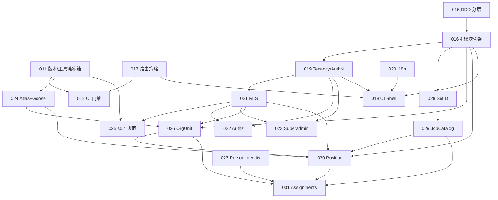

# DEV-PLAN-009：Greenfield 全新实施路线图（009-031）

**状态**: 已完成（2026-01-08）

> 目标：在“从 0 开始的新代码仓库（Greenfield）”里，按 `DEV-PLAN-010`～`DEV-PLAN-031` 的契约，全新实施一套可运行、可验证、可演进的 HRMS（Greenfield）。  
> 本文只做 **路线图编排（先后顺序 + 串行/并行）**，不复制各计划内部的细节；具体合同以对应 dev-plan 为准。  
> 注：路线图覆盖 `DEV-PLAN-010`～`DEV-PLAN-031`；编号已按本路线图的先后顺序重排。

## 0. 进度速记
1. [X] 新增 `DEV-PLAN-009` 并登记到 `AGENTS.md` Doc Map。
2. [X] 将本文拆成可执行里程碑（009M1-009M5），并把每个里程碑映射到可交付的 PR 序列（新仓库执行）。证据：PR #68 https://github.com/jacksonlee411/Bugs-And-Blossoms/pull/68 、`docs/dev-plans/009m1-phase4-setid-jobcatalog-vertical-slice-execution-plan.md`、`docs/dev-plans/009m2-phase4-person-identity-staffing-vertical-slice-execution-plan.md`、`docs/dev-plans/009m3-phase5-quality-hardening-e2e-execution-plan.md`、`docs/dev-plans/009m4-phase2-superadmin-tenant-console-execution-plan.md`、`docs/dev-plans/009m5-phase2-authn-kratos-sessions-execution-plan.md`
3. [X] P0 前置条件（仓库 bootstrap/门禁/壳/最小登录/迁移闭环）以 `DEV-PLAN-010` 为合同执行，避免实现期漂移。
   - 证据：`docs/dev-records/DEV-PLAN-010-READINESS.md`、#11 https://github.com/jacksonlee411/Bugs-And-Blossoms/pull/11
4. [X] 将本文状态从“实施中”更新为“已完成”（与出口条件全绿一致）。证据：PR #70 https://github.com/jacksonlee411/Bugs-And-Blossoms/pull/70

## 1. 背景（从 0 开始实施的约束）
选定 Greenfield 全新实施：不背负存量兼容/迁移包袱，但必须尽早冻结“可验证的工程契约”，否则实现期会出现：
- 工具链/版本漂移导致不可复现；
- 各模块各写一套路由/授权/迁移/生成工作流导致长期 drift；
- DB Kernel（事件 SoT + 同步投射）的 One Door / RLS 注入在实现期被“补丁式绕过”。

## 2. 目标与非目标（路线图层）
### 2.1 核心目标（Done 的定义）
- [X] **工程可复现**：版本基线、门禁入口、生成物一致性可被 CI 阻断（011/024/025/012）。证据：`docs/dev-records/DEV-PLAN-010-READINESS.md` §2/§6/§7
- [X] **平台先行**：Tenancy/AuthN → RLS 圈地 → Casbin 管事，且 superadmin 与 tenant app 边界清晰可审计（019/021/022/023）。证据：`docs/dev-records/DEV-PLAN-010-READINESS.md` §14/§15/§16
- [X] **业务闭环**：OrgUnit / JobCatalog / Staffing / Person 四模块具备最小可用闭环（026/029/030/031/027/016）。证据：`docs/dev-records/DEV-PLAN-010-READINESS.md` §10/§11/§12/§14
- [X] **UI 可用**：AHA Shell + en/zh i18n + as-of 交互一致，且任职记录仅展示 `effective_date` 合同不漂移（018/020/017/031）。证据：#5 https://github.com/jacksonlee411/Bugs-And-Blossoms/pull/5 、#80 https://github.com/jacksonlee411/Bugs-And-Blossoms/pull/80 、`docs/dev-records/DEV-PLAN-010-READINESS.md` §3/§11/§14/§17（说明：/app 已收口为 Astro build + go:embed Phase 0（009M6））
- [X] **主数据治理可扩展**：SetID 机制从最小集合起步，并在 JobCatalog 上形成首个样板（028/029）。证据：`docs/dev-records/DEV-PLAN-010-READINESS.md` §10

### 2.2 非目标（本文不解决）
- 不解决任何存量系统迁移/兼容/灰度（026/030/029/031 明确不承接）。
- 不扩展 en/zh 之外的语言、不做业务数据多语言（020 已冻结）。
- 不引入额外迁移系统/额外路由框架/额外 Authz 引擎（024/017/022 的 stopline）。

## 3. 执行原则（把“简单”落到交付节奏）
1. **先门禁、后扩展**：能被 CI 阻断的契约（版本/生成物/迁移闭环/路由分类/授权口径）必须前置（011/024/017/012）。
2. **平台先行、业务复用**：RLS/Authz/Tenancy 的契约先落地，业务模块只“复用”，不各自实现第二套（019/021/022）。
3. **One Door / No Tx, No RLS**：涉及 Greenfield 表的任何读写，从第一天起就按 026/021/025 的合同实现；不要先跑通再回填。
4. **以最小端到端闭环做节奏锚点**：每个阶段都要产出“能演示、能测、能回滚”的最小闭环，而不是堆积半成品。
5. **用户可见性（避免僵尸功能）**：每个能力交付必须在页面上可见/可操作（至少一条端到端链路）；若短期后端先行，也必须同步提供明确的 UI 入口规划与验收方式。

## 4. DEV-PLAN-010～031 依赖速览（谁阻塞谁）
> 说明：这里仅列“路线图层”的关键依赖；具体实现细节与验收以对应计划为准。

- **工程/治理基线（强前置）**
  - `DEV-PLAN-011`：版本与工具链 SSOT（阻塞 024/025/012 与所有实现落地）。
  - `DEV-PLAN-013`：文档治理（可并行，但应在第一批文档/实现 PR 前到位）。
  - `DEV-PLAN-014`：多 worktree 并行开发指引（可并行，提升执行效率）。
  - `DEV-PLAN-012`：CI 质量门禁（依赖 011；并吸收 020/024/025/022/017 的门禁入口）。

- **架构与边界（实现载体）**
  - `DEV-PLAN-015`：DDD 分层框架（阻塞 016 与后续代码结构）。
  - `DEV-PLAN-016`：4 模块骨架与跨模块契约（阻塞 026/030/029/031/027/018/028）。
  - `DEV-PLAN-017`：全局路由策略与 routing gates（阻塞 019/018/022/012 的路由/门禁一致性）。

- **平台与安全（业务的运行时前提）**
  - `DEV-PLAN-019`：Tenancy/AuthN/session（阻塞 021/022/028，以及业务模块的 tenant 上下文与 bootstrap）。
  - `DEV-PLAN-021`：Greenfield 表默认启用 RLS（依赖 019 的 tenant 注入契约；阻塞 025/022/023 等实现“从第一天就强隔离”）。
  - `DEV-PLAN-022`：Casbin Authz 契约与工具链（依赖 019/021；阻塞 UI/API 的统一 403 与策略治理）。
  - `DEV-PLAN-023`：SuperAdmin 控制面认证与旁路（显式依赖 019/021；用于跨租户操作与可审计旁路）。
  - `DEV-PLAN-020`：仅 en/zh 的 i18n 合同（可与 018 并行，但应在 UI 规模化前完成）。

- **DB/生成工具链（把确定性变成门禁）**
  - `DEV-PLAN-024`：Atlas+Goose 模块级闭环（依赖 011；建议在任何 schema 开始落盘前完成）。
  - `DEV-PLAN-025`：sqlc 规范（显式依赖 011/015/016/021；建议在第一批 sqlc 生成物进入主干前完成）。

- **主数据治理（影响 JobCatalog/Staffing 的建模）**
  - `DEV-PLAN-028`：SetID（依赖 016/019/021；应在 029/030 进入“落盘与 API 合同冻结”前完成，以避免返工）。

- **业务模块（交付主体）**
  - `DEV-PLAN-026`：OrgUnit（依赖 016/024/021；为 Staffing/SetID/UI 提供组织基础）。
  - `DEV-PLAN-029`：Job Catalog（依赖 016/024/021/028；为 Staffing/Assignments 提供主数据）。
  - `DEV-PLAN-030`：Position（Staffing，依赖 026/029/016/024/021；Position↔Assignment 强不变量收敛在同模块）。
  - `DEV-PLAN-027`：Person 最小身份锚点（依赖 016；为 031 的 `person_uuid` 写侧合同做前置）。
  - `DEV-PLAN-031`：Assignments（依赖 030/027，并与 026/029 组合；UI 合同“仅展示 effective_date”对齐 018/020）。
  - `DEV-PLAN-018`：AHA UI Shell（壳/导航/Topbar/i18n/as-of 应前置；模块页面与权限集成随 022 与各业务垂直切片推进）。

## 5. 实施路线图（串行 + 并行泳道）
> 记号：`=>` 表示强串行依赖；`||` 表示可并行推进（但仍需按“出口条件”收口）。

### Phase 0：启动与治理基线（先确保“可复现、可合并”）
- 串行关键路径：`011 => 012(框架落地)`
- 可并行：
  - `013 || 014 || 015 || 017`
- 出口条件（进入 Phase 1 前必须满足）：
  1. [X] 版本基线与 SSOT 明确（011）。证据：#1 https://github.com/jacksonlee411/Bugs-And-Blossoms/pull/1
  2. [X] DDD 分层框架与模块边界可用于 code review（015/016）。证据：#4 https://github.com/jacksonlee411/Bugs-And-Blossoms/pull/4
  3. [X] 路由命名空间与 routing gates SSOT 明确（017）。证据：#3 https://github.com/jacksonlee411/Bugs-And-Blossoms/pull/3
  4. [X] CI 至少具备“required checks 外壳 + Makefile 单一入口”能力（012 的骨架）。证据：#2 https://github.com/jacksonlee411/Bugs-And-Blossoms/pull/2

### Phase 1：用户可见骨架（先有壳，再长肉）
> 依据“用户可见性原则”，UI 不作为最后阶段集中交付：先把壳、导航、语言、as-of 与登录最小链路跑通，让后续所有能力都能“挂到页面上”。

- 串行关键路径：`017 => 018(壳/导航最小集)`
- 可并行：
  - `019`（Tenancy/AuthN/session，先做最小可登录闭环）
  - `020`（i18n：en/zh + 语言切换写入口）
- 出口条件：
  1. [X] UI Shell 可运行：导航/Topbar/Flash/as-of 透传具备最小可用形态（018）。证据：#5 https://github.com/jacksonlee411/Bugs-And-Blossoms/pull/5、#80 https://github.com/jacksonlee411/Bugs-And-Blossoms/pull/80（说明：/app 已收口为 Astro build + go:embed Phase 0（009M6）；证据见 `DEV-PLAN-010` §17）
  2. [X] tenant app 至少可完成“确定租户 → 登录 → 进入壳”的最小链路（019）。证据：#6 https://github.com/jacksonlee411/Bugs-And-Blossoms/pull/6 、#23 https://github.com/jacksonlee411/Bugs-And-Blossoms/pull/23 、#24 https://github.com/jacksonlee411/Bugs-And-Blossoms/pull/24
  3. [X] 语言切换可用且只允许 `en/zh`，切换后整页一致刷新（020）。证据：#5 https://github.com/jacksonlee411/Bugs-And-Blossoms/pull/5
  4. [X] 4 个业务模块入口在导航中可见：未实现模块以占位页呈现“未交付/计划中的能力”，作为后续实现的唯一挂载点（避免隐形功能长期漂移）。证据：#13 https://github.com/jacksonlee411/Bugs-And-Blossoms/pull/13

### Phase 2：平台与安全硬化（能圈地、能拒绝、能旁路且可审计）
- 串行关键路径：`019 => 021 => 022`（`023` 跟随）
- 可并行：
  - `024`（模块级迁移闭环）可与本阶段并行推进，但必须在业务模块落 schema 前收口。
- 出口条件：
  1. [X] Greenfield 表的 RLS 注入契约可用（No Tx, No RLS），并有最小 fail-closed 测试（021）。证据：PR #66 https://github.com/jacksonlee411/Bugs-And-Blossoms/pull/66 、`cmd/dbtool rls-smoke/orgunit-smoke/jobcatalog-smoke/person-smoke/staffing-smoke`（由 `make <module> migrate up` 触发）、`docs/dev-records/DEV-PLAN-010-READINESS.md` §15
  2. [X] Authz 最小闭环：统一 403 契约 + policy SSOT + 可 shadow/enforce（022）。证据：PR #67 https://github.com/jacksonlee411/Bugs-And-Blossoms/pull/67 、`make authz-pack && make authz-test && make authz-lint`、`docs/dev-records/DEV-PLAN-010-READINESS.md` §16
  3. [X] 控制面边界可用（至少 Phase 0/1）：独立 cookie + 显式 bypass pool/role + 审计（023）。证据：PR #63 https://github.com/jacksonlee411/Bugs-And-Blossoms/pull/63 、`docs/dev-records/DEV-PLAN-010-READINESS.md` §14

### Phase 3：工具链闭环固化（让“schema/生成/门禁”不可漂移）
- 串行关键路径：`024 => 025 => 012(生成物与门禁收口)`
- 并行说明：
  - 本阶段可以与 Phase 4 的业务实现并行，但必须在“第一批 migrations/sqlc/authz 生成物合入主干”前完成收口。
- 出口条件：
  1. [X] Atlas+Goose：按模块能 plan/lint/migrate smoke（024）。证据：#7 https://github.com/jacksonlee411/Bugs-And-Blossoms/pull/7 、#14 https://github.com/jacksonlee411/Bugs-And-Blossoms/pull/14
  2. [X] sqlc：schema 输入/导出策略冻结，且生成物一致性可被 CI 阻断（025/012）。证据：#8 https://github.com/jacksonlee411/Bugs-And-Blossoms/pull/8

### Phase 4：业务垂直切片（业务 + UI 同步交付）
> 本阶段不允许“先堆后端、最后补 UI”：每条子链路的 done 需要同时满足“内核闭环 + 页面可见/可操作”。

- 并行说明：
  - 本阶段可在 Phase 1 完成后立刻启动，并与 Phase 2/3 并行推进；但任何落盘 schema/生成物/路由/授权变更必须遵守 021/024/025/022/017/012 的门禁与 stopline（禁止为“先跑起来”埋技术债）。
- 建议并行拓扑（以减少阻塞）：
  - `026(orgunit) || 027(person identity) || 028(setid)`
  - `028 => 029(jobcatalog)`
  - `026 + 029 => 030(position)`
  - `030 + 027 => 031(assignments)`
- 出口条件（最小端到端闭环，且必须用户可见）：
  1. [X] OrgUnit：至少一条“写入→读树/详情”的 UI 操作链路可演示（026 + 018）。证据：#21 https://github.com/jacksonlee411/Bugs-And-Blossoms/pull/21 、#22 https://github.com/jacksonlee411/Bugs-And-Blossoms/pull/22 、#26 https://github.com/jacksonlee411/Bugs-And-Blossoms/pull/26 、#28 https://github.com/jacksonlee411/Bugs-And-Blossoms/pull/28 、#29 https://github.com/jacksonlee411/Bugs-And-Blossoms/pull/29 、#30 https://github.com/jacksonlee411/Bugs-And-Blossoms/pull/30
  2. [X] Person Identity：`pernr -> person_uuid` 精确解析可被页面/表单实际复用（027 + 018），避免 staffing 自己解析形成隐形耦合。证据：#43 https://github.com/jacksonlee411/Bugs-And-Blossoms/pull/43
  3. [X] SetID + JobCatalog：SetID 映射可配置，并在 JobCatalog 至少一个实体形成“解析→写入→列表读取”的 UI 样板（028 + 029 + 018）。证据：#42 https://github.com/jacksonlee411/Bugs-And-Blossoms/pull/42
  4. [X] Staffing：Position 与 Assignments 的写入口与读模型闭环可用，且至少一条“创建/更新→列表可见”的 UI 链路存在（030/031 + 018）。证据：#43 https://github.com/jacksonlee411/Bugs-And-Blossoms/pull/43
  5. [X] Assignments UI：严格执行“仅展示 `effective_date`”（031/018）。证据：#43 https://github.com/jacksonlee411/Bugs-And-Blossoms/pull/43

### Phase 5：质量收口（把“能跑”变成“可长期演进”）
- 串行关键路径：`012(四大 required checks 全量启用) => 交付`
- 出口条件：
  1. [X] 四大 required checks 稳定产出结论（不出现 `skipped`），且本地有一键入口（012）。证据：PR #49 https://github.com/jacksonlee411/Bugs-And-Blossoms/pull/49 、`DEV-PLAN-010` §12
  2. [X] 生成物漂移、路由漂移、迁移闭环失败可被 CI 明确阻断并易排障（024/025/017/012）。证据：PR #49 https://github.com/jacksonlee411/Bugs-And-Blossoms/pull/49

## 6. 关键路径（建议优先保证不阻塞）
> 任何延迟都会放大后续返工面：优先保证这些“阻塞链路”最短闭环。

1. `011 => 012(骨架)`
2. `015 => 016`
3. `017 => 018(壳/导航) => 后续各模块 UI 挂载`
4. `019 => 021 => 025`
5. `019 => 021 => 022 => 023`
6. `016 + 024 + 021 => 026`
7. `028 => 029 => 030 => 031`

## 7. 依赖草图（Mermaid）

## 8. 对应计划文档索引（本仓库路径）
- `docs/dev-plans/009-implementation-roadmap.md`
- `docs/dev-plans/010-p0-prerequisites-contract.md`
- `docs/dev-plans/011-tech-stack-and-toolchain-versions.md`
- `docs/dev-plans/012-ci-quality-gates.md`
- `docs/dev-plans/013-docs-creation-and-governance-guide.md`
- `docs/dev-plans/014-parallel-worktrees-local-dev-guide.md`
- `docs/dev-plans/015-ddd-layering-framework.md`
- `docs/dev-plans/016-greenfield-hr-modules-skeleton.md`
- `docs/dev-plans/017-routing-strategy.md`
- `docs/dev-plans/018-astro-aha-ui-shell-for-hrms.md`
- `docs/dev-plans/019-tenant-and-authn.md`
- `docs/dev-plans/020-i18n-en-zh-only.md`
- `docs/dev-plans/021-pg-rls-for-org-position-job-catalog.md`
- `docs/dev-plans/022-authz-casbin-toolchain.md`
- `docs/dev-plans/023-superadmin-authn.md`
- `docs/dev-plans/024-atlas-goose-closed-loop-guide.md`
- `docs/dev-plans/025-sqlc-guidelines.md`
- `docs/dev-plans/026-org-transactional-event-sourcing-synchronous-projection.md`
- `docs/dev-plans/027-person-minimal-identity-for-staffing.md`
- `docs/dev-plans/028-setid-management.md`
- `docs/dev-plans/029-job-catalog-transactional-event-sourcing-synchronous-projection.md`
- `docs/dev-plans/030-position-transactional-event-sourcing-synchronous-projection.md`
- `docs/dev-plans/031-greenfield-assignment-job-data.md`
