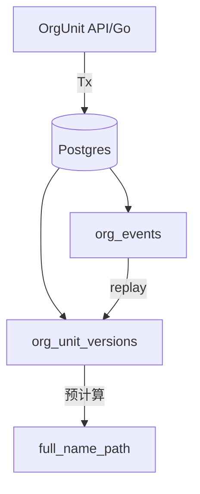

# DEV-PLAN-026A：OrgUnit 8位编号与 UUID/Code 命名规范

**状态**: 已完成（2026-02-02 06:57 UTC — 对齐 026B 租户隔离 org_id 分配）

## 1. 背景与上下文 (Context)
- **需求来源**：DEV-PLAN-026（OrgUnit 事件溯源 + 同步投射）。
- **当前痛点**：标识命名混用（id/uuid/code），路径与索引体积偏大；长名称查询在大数据量下读放大明显。
- **业务价值**：统一命名与类型，缩小索引与路径占用；在不改变写入模型的前提下提升读性能与可维护性。

## 2. 目标与非目标 (Goals & Non-Goals)
### 2.1 核心目标
- [ ] 统一 OrgUnit 领域标识命名规则，消除 `id/uuid/code` 混用歧义。
- [ ] OrgUnit 结构性标识改为 8 位 `int4`（`org_id`/`parent_id`/`root_org_id`/`path_ids`）。
- [ ] 保留跨租户/跨模块/幂等场景的 UUID 标识（`tenant_uuid`/`event_uuid` 等）。
- [ ] 预计算 `full_name_path`，读侧不再做祖先链 JOIN。
- [ ] `event_uuid` 使用 UUID v7（同字段不混用 v4/v7）。
- [ ] 本方案仅优化标识与索引体积，不改变“全量重放”的写入成本结构。

### 2.2 非目标
- 不引入增量投射/分段重放；写入仍采用全量重放（见 DEV-PLAN-026）。
- 不在本方案内引入新的运维工具链或维护作业。
- 不覆盖非 OrgUnit 模块的字段重命名与契约变更（仅列出影响清单）。

### 2.3 工具链与门禁（SSOT 引用）
- **触发器清单（本计划命中）**：
  - [ ] Go 代码
  - [ ] DB 迁移 / Schema
  - [ ] sqlc（如涉及 schema/queries/config）
  - [ ] 文档更新
- **未命中（仅声明）**：`.templ`/Tailwind、多语言 JSON、Authz 门禁、Routing 门禁、E2E。
- **SSOT 链接**：`AGENTS.md`、`Makefile`、`.github/workflows/quality-gates.yml`

## 3. 架构与关键决策 (Architecture & Decisions)
### 3.1 架构图 (Mermaid)


### 3.2 关键设计决策 (ADR 摘要)
- **决策 1**：`org_id` 使用 8 位 `int4`（缩短 ltree path 与索引体积）。
- **决策 2**：`event_uuid` 使用 UUID v7（提升唯一索引写入局部性）。
- **决策 3**：保留 `org_events.id` + `org_unit_versions.last_event_id` 作为内部关联键（避免 UUID JOIN 读性能回退）。
- **决策 4**：`full_name_path` 在重放阶段预计算并落地（读侧不再祖先链 JOIN）。

## 4. 数据模型与约束 (Data Model & Constraints)
### 4.1 命名与类型规则
- UUID 标识字段：后缀必须为 `_uuid`。
- 8 位整数标识字段：后缀必须为 `_id`。
- 其他编码/追踪字段：后缀必须为 `_code`。
- 仅技术主键可保留 `id`（如 `bigserial`），不参与业务标识规则。
- UUID 版本策略：`event_uuid` 必须使用 UUID v7；同一字段不得混用 v4/v7。

### 4.2 字段改造清单
- 8 位整数（_id，仅限组织结构标识，int4）：`org_id` / `parent_id` / `root_org_id` / `path_ids`（`int[]`）
- UUID（_uuid）：`tenant_uuid` / `event_uuid`（仅 v7）/ `initiator_uuid` / `manager_uuid`
- 其他编码（_code）：`request_code`
- 整数标识（_id，非 8 位约束）：`last_event_id`（`bigint`）
- 预计算字段：`full_name_path`（`text`）

约束：所有 8 位标识字段使用 `CHECK (x BETWEEN 10000000 AND 99999999)`。
> 生成策略：`org_id` 按租户隔离分配（见 4.4.1，细节对齐 `DEV-PLAN-026B`），确保 8 位范围。

### 4.3 旧字段 → 新字段对照表
| 位置 | 旧字段 | 新字段 | 类型 | 说明 |
| --- | --- | --- | --- | --- |
| org_trees | tenant_id | tenant_uuid | uuid | RLS 租户隔离 |
| org_trees | root_org_id | root_org_id | int | 8 位编号 |
| org_events | event_id | event_uuid | uuid | 幂等键 |
| org_events | tenant_id | tenant_uuid | uuid | RLS 租户隔离 |
| org_events | org_id | org_id | int | 8 位编号 |
| org_events | request_id | request_code | text | 请求追踪 |
| org_events | initiator_id | initiator_uuid | uuid | 操作者 |
| org_unit_versions | tenant_id | tenant_uuid | uuid | RLS 租户隔离 |
| org_unit_versions | org_id | org_id | int | 8 位编号 |
| org_unit_versions | parent_id | parent_id | int | 8 位编号 |
| org_unit_versions | path_ids | path_ids | int[] | 由 node_path 生成 |
| org_unit_versions | manager_id | manager_uuid | uuid | 负责人 |
| org_unit_versions | last_event_id | last_event_id | bigint | 关联 `org_events.id`（保留） |

### 4.4 DDL / 索引改写清单
#### 4.4.1 org_id 分配器（租户隔离）
```sql
CREATE TABLE orgunit.org_id_allocators (
  tenant_uuid uuid NOT NULL,
  next_org_id int NOT NULL CHECK (next_org_id BETWEEN 10000000 AND 100000000),
  updated_at  timestamptz NOT NULL DEFAULT now(),
  PRIMARY KEY (tenant_uuid)
);

CREATE OR REPLACE FUNCTION orgunit.allocate_org_id(p_tenant_uuid uuid)
RETURNS int
LANGUAGE plpgsql
AS $$
DECLARE
  v_next int;
BEGIN
  PERFORM orgunit.assert_current_tenant(p_tenant_uuid);

  UPDATE orgunit.org_id_allocators
  SET next_org_id = next_org_id + 1,
      updated_at = now()
  WHERE tenant_uuid = p_tenant_uuid
  RETURNING next_org_id - 1 INTO v_next;

  IF v_next IS NULL THEN
    INSERT INTO orgunit.org_id_allocators (tenant_uuid, next_org_id)
    VALUES (p_tenant_uuid, 10000001)
    RETURNING 10000000 INTO v_next;
  END IF;

  IF v_next > 99999999 THEN
    RAISE EXCEPTION USING
      MESSAGE = 'ORG_ID_EXHAUSTED',
      DETAIL = format('tenant=%s', p_tenant_uuid);
  END IF;

  RETURN v_next;
END;
$$;
```
> 说明：`next_org_id` 为“下一个可分配值”；达到上限时报错并阻断写入。  
> 补充：本计划已移除 `hierarchy_type`，单租户单树模型；表结构与函数签名均按 `tenant_uuid` 维度收敛。
> 补充：`submit_org_event` 在 `CREATE` 且 `p_org_id IS NULL` 时调用 `allocate_org_id` 分配；非 `CREATE` 事件必须提供 `p_org_id`，否则返回 `ORG_INVALID_ARGUMENT`。

#### org_trees
```sql
CREATE TABLE orgunit.org_trees (
  tenant_uuid  uuid NOT NULL,
  root_org_id  int NOT NULL CHECK (root_org_id BETWEEN 10000000 AND 99999999),
  created_at   timestamptz NOT NULL DEFAULT now(),
  updated_at   timestamptz NOT NULL DEFAULT now(),
  PRIMARY KEY (tenant_uuid)
);
```

#### org_events
```sql
CREATE TABLE orgunit.org_events (
  id               bigserial PRIMARY KEY,
  event_uuid       uuid NOT NULL,
  tenant_uuid      uuid NOT NULL,
  org_id           int NOT NULL CHECK (org_id BETWEEN 10000000 AND 99999999),
  event_type       text NOT NULL,
  effective_date   date NOT NULL,
  payload          jsonb NOT NULL DEFAULT '{}'::jsonb,
  request_code     text NOT NULL,
  initiator_uuid   uuid NOT NULL,
  transaction_time timestamptz NOT NULL DEFAULT now(),
  created_at       timestamptz NOT NULL DEFAULT now(),
  CONSTRAINT org_events_event_type_check CHECK (event_type IN ('CREATE','MOVE','RENAME','DISABLE','SET_BUSINESS_UNIT')),
  CONSTRAINT org_events_one_per_day_unique UNIQUE (tenant_uuid, org_id, effective_date)
);

CREATE UNIQUE INDEX org_events_event_uuid_unique ON orgunit.org_events (event_uuid);
CREATE INDEX org_events_tenant_org_effective_idx ON orgunit.org_events (tenant_uuid, org_id, effective_date, id);
CREATE INDEX org_events_tenant_effective_idx ON orgunit.org_events (tenant_uuid, effective_date, id);
```
> 说明：`event_uuid` 必须由应用层生成 UUID v7 并传入，不提供 v4 默认值。

#### org_unit_versions
```sql
CREATE TABLE orgunit.org_unit_versions (
  id             bigserial PRIMARY KEY,
  tenant_uuid    uuid NOT NULL,
  org_id         int NOT NULL CHECK (org_id BETWEEN 10000000 AND 99999999),
  parent_id      int NULL CHECK (parent_id BETWEEN 10000000 AND 99999999),
  node_path      ltree NOT NULL,
  validity       daterange NOT NULL,
  path_ids       int[] GENERATED ALWAYS AS (orgunit.org_path_ids(node_path)) STORED,
  name           varchar(255) NOT NULL,
  full_name_path text NOT NULL,
  status         text NOT NULL DEFAULT 'active',
  is_business_unit boolean NOT NULL DEFAULT false,
  manager_uuid   uuid NULL,
  last_event_id  bigint NOT NULL REFERENCES orgunit.org_events(id),
  CONSTRAINT org_unit_versions_status_check CHECK (status IN ('active','disabled')),
  CONSTRAINT org_unit_versions_validity_check CHECK (NOT isempty(validity)),
  CONSTRAINT org_unit_versions_validity_bounds_check CHECK (lower_inc(validity) AND NOT upper_inc(validity)),
  CONSTRAINT org_unit_versions_no_overlap
    EXCLUDE USING gist (
      tenant_uuid gist_uuid_ops WITH =,
      org_id gist_int4_ops WITH =,
      validity WITH &&
    )
);

CREATE INDEX org_unit_versions_search_gist
  ON orgunit.org_unit_versions
  USING gist (tenant_uuid gist_uuid_ops, node_path, validity);

CREATE INDEX org_unit_versions_active_day_gist
  ON orgunit.org_unit_versions
  USING gist (tenant_uuid gist_uuid_ops, validity)
  WHERE status = 'active';

CREATE INDEX org_unit_versions_lookup_btree
  ON orgunit.org_unit_versions (tenant_uuid, org_id, lower(validity));

CREATE INDEX org_unit_versions_path_ids_gin
  ON orgunit.org_unit_versions
  USING gin (path_ids);
```
> 说明：`full_name_path` 在重放阶段生成并落地；读侧避免祖先链 JOIN。

#### RLS 策略（命名更新）
```sql
CREATE POLICY tenant_isolation ON orgunit.org_events
USING (tenant_uuid = current_setting('app.current_tenant')::uuid)
WITH CHECK (tenant_uuid = current_setting('app.current_tenant')::uuid);
```
> 说明：`org_trees` 与 `org_unit_versions` 需同步更新 RLS 列名为 `tenant_uuid`，规则保持一致。

### 4.5 迁移策略（新项目默认方案）
- **Up（schema 更新）**：
  - 在 `orgunit` schema 内新增 `org_id_allocators` 表与 `allocate_org_id(...)`。
  - 列重命名：`tenant_id`→`tenant_uuid`，`request_id`→`request_code`，`event_id`→`event_uuid`。
  - 列类型：`org_id`/`parent_id`/`root_org_id`→`int4`（8 位约束），`path_ids`→`int[]`。
  - 新增/调整索引与约束：`event_uuid` 唯一索引、`path_ids` GIN、`full_name_path` NOT NULL。
- **Down（仅开发环境）**：
  - 回退列名与类型，删除分配器表/函数与新增索引。
  - 生产环境不执行破坏性 Down；如需回退，以“重建库 + 重放”方式处理。

## 5. 接口契约 (API Contracts)
### 5.1 对外 API / 表单约束（若存在）
- 本方案不新增对外 API；若现有 API/表单暴露 `org_id`/`parent_id`/`root_org_id`，统一以**8 位数字字符串**传输。
- `request_id` 统一更名为 `request_code`；`event_uuid` 由服务端生成并作为内部幂等键保存。
- 服务端校验：`^\d{8}$`，不合法返回 422；同日重复事件返回 409（对应唯一性约束）。

#### 5.1.1 UI/HTMX（RouteClassUI）
**`GET /org/nodes?tree_as_of=YYYY-MM-DD`**
- Query: `tree_as_of`（必填；缺失/非法时 302 重定向到当日 UTC 日期）。
- Response: HTML 页面（包含创建/操作表单与节点列表）。

**`POST /org/nodes?tree_as_of=YYYY-MM-DD`**
- Form:
  - 通用：`action`（可选，默认 `create`），`effective_date`（可选，默认 `tree_as_of`），`tree_as_of`（隐藏字段，用于回跳上下文）。
  - `create`：`name`（必填），`parent_id`（可选，8 位数字），`is_business_unit`（可选，bool）。
  - `rename`：`org_id`（必填，8 位数字），`new_name`（必填）。
  - `move`：`org_id`（必填，8 位数字），`new_parent_id`（可选，8 位数字）。
  - `disable`：`org_id`（必填，8 位数字）。
  - `set_business_unit`：`org_id`（必填，8 位数字），`is_business_unit`（可选，bool）。
- Response: 303 重定向到 `/org/nodes?tree_as_of=<tree_as_of>`；校验失败返回 HTML 错误提示。

**`GET /org/snapshot?as_of=YYYY-MM-DD[&created_id=...]`**
- Query: `as_of`（必填；缺失时 302 重定向到当日 UTC 日期），`created_id`（可选）。
- Response: HTML 页面（快照表格）。

**`POST /org/snapshot?as_of=YYYY-MM-DD`**
- Form: `effective_date`（可选，默认 `as_of`），`name`（必填），`parent_id`（可选，8 位数字）。
- Response: 303 重定向到 `/org/snapshot?as_of=<effective_date>&created_id=<org_id>`；校验失败返回 HTML 错误提示。

**`GET /org/setid?as_of=YYYY-MM-DD[&setid=...]`**
- Query: `as_of`（必填；缺失时 302 重定向到当日 UTC 日期），`setid`（可选）。
- Response: HTML 页面（SetID 治理 UI）。

**`POST /org/setid?as_of=YYYY-MM-DD`**
- Form:
  - 通用：`action`（必填，`create_setid|bind_setid|create_scope_package|disable_scope_package`）。
  - `create_setid`：`setid`（必填），`name`（必填）。
  - `bind_setid`：`org_unit_id`（必填，8 位数字），`setid`（必填），`effective_date`（可选，默认 `as_of`）。
  - `create_scope_package`：`scope_code`（必填），`owner_setid`（必填），`name`（必填），`package_code`（可选），`effective_date`（可选，默认 `as_of`），`request_code`（隐藏字段）。
  - `disable_scope_package`：`package_id`（必填），`request_code`（隐藏字段）。
- Response: 303 重定向到 `/org/setid?as_of=<effective_date|as_of>`；校验失败返回 HTML 错误提示。

**`GET /orgunit/setids/{setid}/scope-subscriptions?as_of=YYYY-MM-DD`**
- Query: `as_of`（可选，缺省当日 UTC）。
- Response: HTML 片段（HTMX partial）。

**`POST /orgunit/setids/{setid}/scope-subscriptions?as_of=YYYY-MM-DD`**
- Form: `scope_code`（必填），`package_id`（必填），`effective_date`（可选，默认 `as_of`），`request_code`（必填）。
- Response: HTML 片段 + `HX-Trigger: scopeSubscriptionChanged`。

#### 5.1.2 Internal API（RouteClassInternalAPI）
**`POST /orgunit/api/org-units/set-business-unit`**
- Request JSON:
  - `org_unit_id`（必填，8 位数字）
  - `effective_date`（必填，YYYY-MM-DD）
  - `is_business_unit`（必填，bool）
  - `request_code`（必填，字符串）
- Response 201:
  - `org_unit_id`、`is_business_unit`

**`POST /orgunit/api/setid-bindings`**
- Request JSON:
  - `org_unit_id`（必填，8 位数字）
  - `setid`（必填）
  - `effective_date`（必填，YYYY-MM-DD）
  - `request_code`（必填）
- Response 201:
  - `org_unit_id`、`setid`、`effective_date`

**`POST /orgunit/api/setids`**
- Request JSON:
  - `setid`（必填）
  - `name`（必填）
  - `effective_date`（可选，缺省为当日 UTC 日期）
  - `request_code`（必填）
- Response 201: `setid`、`status`

**`GET /orgunit/api/scope-packages?scope_code=...`**
- Query: `scope_code`（必填）
- Response 200: `[]ScopePackage`

**`POST /orgunit/api/scope-packages`**
- Request JSON:
  - `scope_code`（必填）
  - `package_code`（可选，缺省自动生成）
  - `owner_setid`（必填）
  - `name`（必填）
  - `effective_date`（可选，缺省为当日 UTC 日期）
  - `request_code`（必填）
- Response 201: `package_id`、`scope_code`、`package_code`、`owner_setid`、`status`

**`GET /orgunit/api/owned-scope-packages?scope_code=...&as_of=YYYY-MM-DD`**
- Query: `scope_code`（必填），`as_of`（可选，缺省当日 UTC）
- Response 200: `[]OwnedScopePackage`

**`POST /orgunit/api/scope-packages/{package_id}/disable`**
- Request JSON: `request_code`（必填）
- Response 200: `package_id`、`status`

**`GET /orgunit/api/scope-subscriptions?setid=...&scope_code=...&as_of=YYYY-MM-DD`**
- Query: `setid`（必填），`scope_code`（必填），`as_of`（可选，缺省当日 UTC）
- Response 200: `setid`、`scope_code`、`package_id`、`package_owner`、`effective_date`、`end_date`

**`POST /orgunit/api/scope-subscriptions`**
- Request JSON:
  - `setid`（必填）
  - `scope_code`（必填）
  - `package_id`（必填）
  - `package_owner`（必填，`tenant|global`）
  - `effective_date`（必填）
  - `request_code`（必填）
- Response 201: `setid`、`scope_code`、`package_id`、`package_owner`、`effective_date`

**`GET /orgunit/api/global-setids`**
- Response 200: `[]SetID`

**`POST /orgunit/api/global-setids`**
- Header: `X-Actor-Scope: saas`
- Request JSON: `name`（必填），`request_code`（必填）
- Response 201: `setid`、`status`

**`GET /orgunit/api/global-scope-packages?scope_code=...`**
- Header: `X-Actor-Scope: saas`
- Query: `scope_code`（必填）
- Response 200: `[]ScopePackage`

**`POST /orgunit/api/global-scope-packages`**
- Header: `X-Actor-Scope: saas`
- Request JSON:
  - `scope_code`（必填）
  - `package_code`（可选，缺省自动生成）
  - `name`（必填）
  - `effective_date`（可选，缺省当日 UTC 日期）
  - `request_code`（必填）
- Response 201: `package_id`、`scope_code`、`package_code`、`status`

### 5.2 DB Function Contract
- `submit_org_event(p_event_uuid uuid, p_tenant_uuid uuid, p_org_id int, p_event_type text, p_effective_date date, p_payload jsonb, p_request_code text, p_initiator_uuid uuid) RETURNS bigint`
- `get_org_snapshot(p_tenant_uuid uuid, p_query_date date) RETURNS TABLE (..., full_name_path text, ...)`

### 5.3 参数命名与类型（影响面）
- OrgUnit API/SQL 参数命名与类型统一：`*_uuid` / `*_id` / `*_code`。
- `org_id`/`parent_id`/`root_org_id` 改为 8 位 `int4`。
- `event_uuid` 由应用层生成 UUID v7 并传入。
- HTTP/表单层 `org_id` 建议保持字符串传输，但只允许 8 位数字；服务端统一校验与转换为 int。

### 5.4 依赖函数签名变化对照（旧 → 新）
#### OrgUnit SetID 相关函数
| 函数 | 旧签名 | 新签名 | 备注 |
| --- | --- | --- | --- |
| `orgunit.resolve_setid` | `(p_tenant_id uuid, p_org_id uuid, p_as_of_date date)` | `(p_tenant_uuid uuid, p_org_id int, p_as_of_date date)` | `org_id` 类型改为 int4 |
| `orgunit.submit_setid_binding_event` | `(p_event_id uuid, p_tenant_id uuid, p_org_id uuid, p_effective_date date, p_setid text, p_request_id text, p_initiator_id uuid)` | `(p_event_uuid uuid, p_tenant_uuid uuid, p_org_id int, p_effective_date date, p_setid text, p_request_code text, p_initiator_uuid uuid)` | 参数命名与 `org_id` 类型同步更新 |
| `orgunit.resolve_scope_package` | `(p_tenant_id uuid, p_setid text, p_scope_code text, p_as_of_date date)` | `(p_tenant_uuid uuid, p_setid text, p_scope_code text, p_as_of_date date)` | 仅参数命名调整（类型不变） |

#### Staffing 相关函数与返回结构
| 函数 | 旧签名 | 新签名 | 备注 |
| --- | --- | --- | --- |
| `staffing.get_position_snapshot` | `RETURNS TABLE (org_unit_id uuid, ...)` | `RETURNS TABLE (org_unit_id int, ...)` | `org_unit_id` 类型改为 int4 |

#### 事件 Payload/列类型约束
- `staffing.position_events.payload.org_unit_id`：`uuid` → `int`（解析与校验逻辑同步更新）。
- `staffing.position_versions.org_unit_id`：列类型 `uuid` → `int4`（8 位约束）。

## 6. 核心逻辑与算法 (Business Logic & Algorithms)
### 6.0 关键函数形态
- `org_ltree_label(p_org_id int)`：以 8 位 `int4` 生成 ltree label（`p_org_id::text`）。
- `org_path_ids(p_path ltree)`：返回 `int[]`（与 `org_id` 类型一致）。

### 6.1 关键失败模式
- 租户上下文缺失或不匹配时：RLS 必须 fail-closed（对齐 `DEV-PLAN-021`）。
- 同一 `org_id` 同日重复事件：触发唯一性约束拒绝。
- `full_name_path` 回填不一致：视为投射缺陷，需通过重放修复。
- `org_id` 超出 8 位范围：应在生成与写入阶段拒绝。

### 6.2 写入事件（CREATE 示例）
```sql
SELECT orgunit.submit_org_event(
  $1::uuid,  -- event_uuid (v7)
  $2::uuid,  -- tenant_uuid
  $3::int,   -- org_id (8位)
  'CREATE',
  $4::date,
  $5::jsonb, -- payload
  $6::text,  -- request_code
  $7::uuid   -- initiator_uuid
);
```

### 6.3 读快照（含最近变更时间）
```sql
WITH snapshot AS (
  SELECT org_id, name, is_business_unit, full_name_path
  FROM orgunit.get_org_snapshot($1::uuid, $2::date)
)
SELECT
  s.org_id,
  s.name,
  s.is_business_unit,
  s.full_name_path,
  e.transaction_time
FROM snapshot s
JOIN orgunit.org_unit_versions v
  ON v.tenant_uuid = $1::uuid
 AND v.org_id = s.org_id
 AND v.status = 'active'
 AND v.validity @> $2::date
JOIN orgunit.org_events e
  ON e.id = v.last_event_id
ORDER BY e.transaction_time DESC;
```

### 6.4 重放阶段生成 `full_name_path`（示例）
```sql
UPDATE orgunit.org_unit_versions v
SET full_name_path = (
  SELECT string_agg(a.name, ' / ' ORDER BY t.idx)
  FROM unnest(v.path_ids) WITH ORDINALITY AS t(uid, idx)
  JOIN orgunit.org_unit_versions a
    ON a.tenant_uuid = v.tenant_uuid
   AND a.org_id = t.uid
   AND a.validity @> lower(v.validity)
)
WHERE v.tenant_uuid = $1::uuid
;
```

### 6.5 `get_org_snapshot`（新版：直接读取 `full_name_path`）
```sql
CREATE OR REPLACE FUNCTION orgunit.get_org_snapshot(p_tenant_uuid uuid, p_query_date date)
RETURNS TABLE (
  org_id int,
  parent_id int,
  name varchar(255),
  is_business_unit boolean,
  full_name_path text,
  depth int,
  manager_uuid uuid,
  node_path ltree
)
LANGUAGE sql
STABLE
AS $$
  SELECT
    v.org_id,
    v.parent_id,
    v.name,
    v.is_business_unit,
    v.full_name_path,
    nlevel(v.node_path) - 1 AS depth,
    v.manager_uuid,
    v.node_path
  FROM orgunit.org_unit_versions v
  WHERE v.tenant_uuid = p_tenant_uuid
    AND v.status = 'active'
    AND v.validity @> p_query_date
  ORDER BY v.node_path;
$$;
```

### 6.6 `event_uuid` 生成位置（Go 层）
```go
// 位置建议：pkg/uuidv7 或 internal/composables
eventUUID, err := uuidv7.NewString()
if err != nil {
  return err
}
```

### 6.7 `org_id` 生成位置（DB 侧）
```sql
-- CREATE 事件由 DB 内部分配（租户隔离）
SELECT orgunit.allocate_org_id(p_tenant_uuid)::int;
```

## 7. 安全与鉴权 (Security & Authz)
- RLS 使用 `tenant_uuid`，缺失或不匹配时 fail-closed（对齐 `DEV-PLAN-021`）。
- 应用侧在每个事务首条 SQL 前注入 `app.current_tenant`。

## 8. 依赖与里程碑 (Dependencies & Milestones)
### 8.1 依赖
- DEV-PLAN-026（OrgUnit 事件溯源与全量重放）
- DEV-PLAN-021（RLS 强租户隔离）

### 8.2 里程碑
1. [x] 更新 `orgunit` schema：字段类型与命名规则落地（含约束与索引），保留 `org_events.id`/`org_unit_versions.last_event_id` 作为内部关联键。
2. [x] 更新 DB 函数：`org_ltree_label` / `org_path_ids` / `submit_org_event` / `replay_org_unit_versions` / `get_org_snapshot`。
3. [x] 更新 Go 层调用与 SQL：参数名、字段名、类型转换；`event_uuid` 由应用层生成 UUID v7 并传入。
4. [x] 更新依赖模块（若有）对 OrgUnit 标识的引用与解析。
5. [x] 补充/更新相关测试与基线验证记录（命令入口以 `AGENTS.md` 为准）。

### 8.3 影响面清单
- OrgUnit API/SQL 参数命名与类型（`*_uuid`、`*_id`、`*_code`）。
- `modules/orgunit/infrastructure/persistence/schema/00002_orgunit_org_schema.sql`：字段改名/类型改为 `tenant_uuid` + `org_id int4`，新增 `full_name_path` 与 `org_id_allocators`。
- `modules/orgunit/infrastructure/persistence/schema/00003_orgunit_engine.sql`：函数参数与表字段改名（`tenant_uuid`/`org_id int4`），`org_ltree_label`/`org_path_ids`/`apply_*` 全量更新。
- `modules/orgunit/infrastructure/persistence/schema/00004_orgunit_read.sql`：`get_org_snapshot` 直接返回 `full_name_path`，并使用 `tenant_uuid`。
- `modules/orgunit/infrastructure/persistence/schema/00006_orgunit_setid_engine.sql`：`resolve_setid(p_org_id int)` 签名调整，内部引用 `org_unit_versions.tenant_uuid`/`org_id int4`。
- `modules/orgunit/infrastructure/persistence/schema/00010_orgunit_setid_scope_kernel_privileges.sql`：若函数签名参数名变化，需同步权限定义。
- `internal/server/orgunit_nodes.go`：CREATE 不再直接 `nextval`；由 DB 内部分配 `org_id`，`event_uuid` 改为 v7 生成，SQL casts/字段名更新。
- `pkg/setid/setid.go`：`resolve_setid` 调用改为 `$2::int`，入参与校验改为 8 位数字。
- `internal/server/setid.go`：调用 orgunit setid 相关函数的参数类型与字段名同步更新（`tenant_uuid`）。
- `modules/staffing/infrastructure/persistence/schema/00002_staffing_tables.sql`：`org_unit_id` 列类型改为 `int4`（8 位约束）。
- `modules/staffing/infrastructure/persistence/schema/00003_staffing_engine.sql`：`v_org_unit_id` 改为 `int`，payload 解析与校验更新，`orgunit.org_unit_versions` 查询改为 `tenant_uuid`/`org_id int4`，`resolve_setid` 调用签名更新。
- `modules/staffing/infrastructure/persistence/schema/00015_staffing_read.sql`：`org_unit_id` 返回类型改为 `int`。
- 其他引用 `orgunit.org_unit_versions` 的 SQL/查询需将 `tenant_id`→`tenant_uuid`、`org_id`→`int4`。
- `migrations/staffing/20260123022202_staffing-rebaseline-069.sql`：`org_unit_id` 改为 `int4`，校验与解析更新。
- `migrations/staffing/20260130001000_staffing_jobcatalog_package_id_validation.sql`：`org_unit_id` 解析为 `int`，OrgUnit 校验按 `tenant_uuid`。
- `migrations/staffing/20260130002000_staffing_position_snapshot_job_profile_code.sql`：`org_unit_id` 返回类型改为 `int`。
- `modules/orgunit/infrastructure/persistence/schema/00005_orgunit_setid_schema.sql` / `00008_orgunit_setid_scope_schema.sql`：移除 `event_uuid` v4 默认值，要求应用层 v7。
- `cmd/dbtool/main.go`：OrgUnit smoke 改为使用 DB 内部分配 `org_id`（不再直连旧序列）。
- `pkg/uuidv7/uuidv7.go`：新增 v7 生成器供 OrgUnit/SetID 事件使用。

## 9. 测试与验收标准 (Acceptance Criteria)
### 9.1 单元测试
- `org_id` 8 位校验：边界值 `10000000/99999999` 与非法值拒绝。
- `event_uuid` 版本校验：仅允许 v7（同字段不混用 v4/v7）。
- `full_name_path`：Rename/Move 后子树路径仍与祖先链一致。

### 9.2 集成/DB 验证
- `org_unit_versions` 仍保持 no-overlap 与 gapless 约束不被破坏。
- `submit_org_event` 在同日重复 `org_id` 时触发唯一性约束。
- RLS 缺失/不匹配时稳定拒绝（fail-closed）。

### 9.3 门禁与记录
- 触发器命中的命令入口以 `AGENTS.md` 为准；完成后在 `docs/dev-records/` 补充验证记录。

## 10. 运维与监控 (Ops & Monitoring)
### 10.1 运维策略
- 本方案不引入新的运维工具链或维护作业。
- 若未来规模需要分批回填 `full_name_path`，需另行计划与运维窗口（不纳入本方案实施）。

### 10.2 日志与回滚
- 建议日志字段：`event_uuid`、`request_code`、`tenant_uuid`、`org_id`。
- 回滚策略：
  - 代码回滚：回退本计划相关提交。
  - 数据回滚：新项目默认“重建库 + 重放”；生产环境不执行破坏性 Down。

## 参考
- `docs/dev-plans/026-org-transactional-event-sourcing-synchronous-projection.md`
- `docs/dev-plans/003-simple-not-easy-review-guide.md`
- `AGENTS.md`
