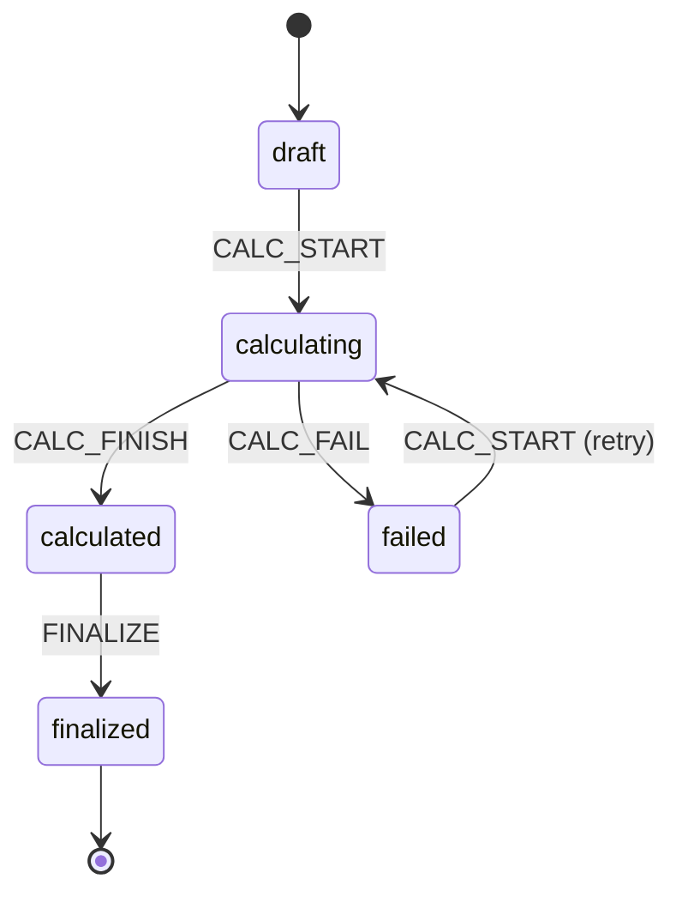

# DEV-PLAN-041：Payroll P0-1——薪资周期与算薪批次（Pay Period & Payroll Run）

**状态**: 已完成（2026-01-08）

已完成事项（合并记录）：
- 实现 PR：#82 / #84 / #85 / #86 / #89
- 证据登记 PR：#83 / #87 / #90（readiness：`docs/dev-records/DEV-PLAN-010-READINESS.md` §18）

> 上游路线图：`DEV-PLAN-039`  
> 蓝图合同（范围/不变量/验收基线）：`DEV-PLAN-040`  
> 细化模板：`DEV-PLAN-001`（本文按其结构补齐到“可直接编码”级别）

## 0. 可执行方案（本计划合同）

> 本节为实施合同；若与后文细节冲突，以本节为准（对齐 `DEV-PLAN-040` 的合同口径）。

### 0.1 背景与上下文

- 薪酬社保工程落点：作为 `modules/staffing` 子域实现（不新增第 5 个业务模块；对齐 `DEV-PLAN-040` §0.1）。
- 本切片只交付“主流程壳”：pay period + payroll run 的**数据载体**、**状态机**、**唯一写入口（DB Kernel）**与**UI 可见入口**；真实算薪（gross/社保/个税）由后续切片承接（`DEV-PLAN-042+`）。
- 写入模式必须复用既有 Kernel/RLS/Valid Time 合同与实现范式（参照 `staffing.submit_position_event`、`staffing.submit_assignment_event`）。

### 0.2 目标与非目标（P0-1 Slice）

**目标**
- [x] 冻结最小数据模型与状态字段（列化）：`staffing.pay_periods`、`staffing.payroll_runs`、`staffing.payslips`（payslip 可先为空壳）。
- [x] 落地 DB Kernel 写入口（One Door）：创建 pay period、创建 payroll run、触发计算（占位）、定稿（同事务更新投射表）。
- [x] RLS fail-closed：所有 payroll 相关表启用 RLS；运行态访问必须在事务内注入 `app.current_tenant`，缺失即失败（对齐 `AGENTS.md` / `DEV-PLAN-019/021`）。
- [x] UI 可发现/可操作：新增“薪酬”入口；提供 pay period 列表/创建、payroll run 列表/详情，并提供“计算/定稿”动作入口（对齐 `DEV-PLAN-040` §0.5）。

**非目标（Out of Scope）**
- 不实现真实算薪逻辑与明细（gross/社保/个税/税后发放），只需保证“计算动作可触发并产生可见结果”（至少 run 状态与时间戳变化可见）。
- 不实现回溯重算闭环（`DEV-PLAN-045` 承接）；本切片只需预留载体字段（例如 `needs_recalc`）与“定稿只读”的状态机语义。
- P0 不引入 `business_unit_id/setid/record_group`；`pay_group` 仅用于算薪分组，不承载 BU/SetID 语义（对齐 `DEV-PLAN-040` §0.2 与 `DEV-PLAN-028`）。

### 0.3 工具链与门禁（SSOT 引用）

> 本计划仅声明命中项与 SSOT 链接，不复制命令清单（避免漂移；见 `DEV-PLAN-000`）。

- **触发器（实施阶段将命中）**
  - [x] Go 代码（`AGENTS.md`）
  - [x] DB 迁移 / Schema（`DEV-PLAN-024`）
  - [x] 路由治理（`DEV-PLAN-017`；需更新 `config/routing/allowlist.yaml`）
  - [x] 文档（`make check doc`）
- **SSOT 链接**
  - 触发器矩阵与本地必跑：`AGENTS.md`
  - 命令入口与 CI：`Makefile`、`.github/workflows/quality-gates.yml`
  - DB 迁移闭环：`docs/dev-plans/024-atlas-goose-closed-loop-guide.md`
  - sqlc 规范（若触及）：`docs/dev-plans/025-sqlc-guidelines.md`
  - 路由策略：`docs/dev-plans/017-routing-strategy.md`
  - UI Shell：`docs/dev-plans/018-astro-aha-ui-shell-for-hrms.md`
  - 时间语义（Valid Time）：`docs/dev-plans/032-effective-date-day-granularity.md`

### 0.4 关键不变量与失败路径（停止线）

- **No Legacy**：不得引入任何回退通道/双链路（对齐 `AGENTS.md` 与 `DEV-PLAN-004M1`）。
- **One Door**：任何写入（创建周期/创建批次/计算/定稿）必须走 DB Kernel `staffing.submit_payroll_*_event(...)`；应用层禁止直写 `staffing.pay_periods/payroll_runs/payslips`。
- **No Tx, No RLS**：缺少 tenant context 直接失败（fail-closed）；不得用 superuser/bypass RLS 跑业务链路。
- **Valid Time = date**：pay period 的业务边界统一 `daterange` 且闭开区间 `[start,end)`；运行窗口（若需要）只用于运维/SLA，使用 `tstzrange`（对齐 `DEV-PLAN-040` §0.4.2）。
- **幂等**：所有 submit 函数必须支持 `event_id` 幂等复用；复用冲突抛稳定错误码（模式对齐现有 `STAFFING_IDEMPOTENCY_REUSED`）。
- **状态机冻结**：payroll run 的状态必须列化、可审计；禁止用 JSONB 备注字段表达流程状态（对齐 `DEV-PLAN-040` §0.4.1）。
- **新增表需确认（红线）**：实现阶段一旦要落地新的 `CREATE TABLE` 迁移，需你在 PR 前明确确认（SSOT：`AGENTS.md`）。

### 0.5 验收标准（Done 口径）

- [x] UI 可创建一个 pay period，并在列表可见（含 pay_group 与 period）。
- [x] UI 可创建一个 payroll run，并在详情页触发“计算”动作；run 状态与 `started_at/finished_at` 可见且可查询。
- [x] UI 可对一个 run 执行“定稿”；定稿后 run 进入只读（再次计算/再次定稿必须失败且返回稳定错误码）。
- [x] 缺少 tenant context 时，相关读写 fail-closed（No Tx, No RLS）。

## 1. 背景与上下文（Context）

薪酬社保的 P0 交付采用切片式推进（`DEV-PLAN-039`）：`DEV-PLAN-041` 的职责是提供后续切片的稳定“承载物”。其边界必须与 `DEV-PLAN-040` 保持一致：

- payroll 归属 `modules/staffing`；不新增模块；不引入 SetID/BU 维度。
- pay period 的时间语义为 **bounded `daterange`**（业务日粒度），禁止用 `timestamptz` 表达业务有效期。
- 关键状态与可筛选字段必须列化，JSONB 仅可用于解释/trace/低频扩展。

## 2. 目标与非目标（Goals & Non-Goals）

> 以 `DEV-PLAN-040` 的 P0 合同为上位约束；本节补齐到“实现时无需再做关键设计决策”的粒度。

### 2.1 本切片交付物清单（必须可落地）

- DB：新增 payroll 核心表（period/run/payslip）+ RLS + Kernel submit 函数（幂等 + 状态机裁决）。
- Server/UI：新增路由与页面（列表/创建/详情/动作），并纳入 routing allowlist + authz 映射。
- Tests：至少覆盖状态机跃迁、幂等复用、RLS fail-closed 的可复现最小测试。

### 2.2 明确不做（避免范围漂移）

- 不引入任务队列/异步 worker（计算在本切片允许为“同步占位”）；若未来需要异步，必须另立 dev-plan 承接并定义一致的幂等/重试语义。
- 不在本切片引入工资条明细（pay items）与金额口径；金额列在 payslip 表仅作为占位（默认 0），权威口径由 `DEV-PLAN-042+` 定义。

## 3. 架构与关键决策（Architecture & Decisions）

### 3.1 组件边界（选定）

- **DB Kernel（权威）**：`submit_payroll_*_event(...)` 负责不变量裁决、幂等、状态机跃迁与同步投射。
- **Go/HTTP（编排）**：负责鉴权、事务边界（显式 `BEGIN`）、注入 `app.current_tenant`、调用 Kernel、错误映射与返回 UI。

### 3.2 组件图（Mermaid）

```mermaid
flowchart TD
  UI[HTMX UI<br/>/org/payroll-*] --> H[internal/server handlers]
  H --> S[PayrollStore (PG)]
  S -->|tx + set_config(app.current_tenant)| K[DB Kernel<br/>staffing.submit_payroll_*_event]
  K --> E[(payroll_*_events)]
  K --> R[(pay_periods/payroll_runs/payslips)]
```

### 3.3 状态机（冻结）

**payroll run 状态枚举（列化）**
- `draft`
- `calculating`
- `calculated`
- `failed`
- `finalized`（终态，只读）

**允许的跃迁（且必须产生事件）**



约束：
- `FINALIZE` 必须要求当前状态为 `calculated`。
- `CALC_START` 仅允许从 `draft/failed` 进入 `calculating`。
- `finalized` 后任何进一步动作必须失败（稳定错误码）。

## 4. 数据模型与约束（Data Model & Constraints）

> 下述为本切片冻结的最小表合同；实现期以 `modules/staffing/infrastructure/persistence/schema/*.sql` 为 Schema SSOT，并按 `DEV-PLAN-024` 生成迁移闭环。

### 4.1 表清单（新增）

> 注意：实现落地 `CREATE TABLE` 前需你明确确认（见 §0.4 “新增表需确认”）。

- `staffing.pay_periods`（读模型/主表）
- `staffing.pay_period_events`（write side / SoT）
- `staffing.payroll_runs`（读模型/主表）
- `staffing.payroll_run_events`（write side / SoT）
- `staffing.payslips`（结果载体，P0-1 允许为空壳）

### 4.2 Schema（SQL 合同草案，按现有 staffing 风格对齐）

#### 4.2.1 `staffing.pay_period_events`

```sql
CREATE TABLE IF NOT EXISTS staffing.pay_period_events (
  id bigserial PRIMARY KEY,
  event_id uuid NOT NULL DEFAULT gen_random_uuid(),
  tenant_id uuid NOT NULL,
  pay_period_id uuid NOT NULL,
  event_type text NOT NULL,
  pay_group text NOT NULL,
  period daterange NOT NULL,
  request_id text NOT NULL,
  initiator_id uuid NOT NULL,
  transaction_time timestamptz NOT NULL DEFAULT now(),
  created_at timestamptz NOT NULL DEFAULT now(),
  CONSTRAINT pay_period_events_event_type_check CHECK (event_type IN ('CREATE')),
  CONSTRAINT pay_period_events_pay_group_nonempty_check CHECK (btrim(pay_group) <> ''),
  CONSTRAINT pay_period_events_pay_group_trim_check CHECK (pay_group = btrim(pay_group)),
  CONSTRAINT pay_period_events_pay_group_lower_check CHECK (pay_group = lower(pay_group)),
  CONSTRAINT pay_period_events_period_check CHECK (NOT isempty(period)),
  CONSTRAINT pay_period_events_period_bounds_check CHECK (lower_inc(period) AND NOT upper_inc(period)),
  CONSTRAINT pay_period_events_period_bounded_check CHECK (NOT lower_inf(period) AND NOT upper_inf(period)),
  CONSTRAINT pay_period_events_event_id_unique UNIQUE (event_id),
  CONSTRAINT pay_period_events_request_id_unique UNIQUE (tenant_id, request_id)
);

CREATE INDEX IF NOT EXISTS pay_period_events_tenant_period_idx
  ON staffing.pay_period_events (tenant_id, pay_group, lower(period), id);
```

#### 4.2.2 `staffing.pay_periods`

```sql
CREATE TABLE IF NOT EXISTS staffing.pay_periods (
  tenant_id uuid NOT NULL,
  id uuid NOT NULL DEFAULT gen_random_uuid(),
  pay_group text NOT NULL,
  period daterange NOT NULL,
  status text NOT NULL DEFAULT 'open',
  closed_at timestamptz NULL,
  last_event_id bigint NOT NULL REFERENCES staffing.pay_period_events(id),
  created_at timestamptz NOT NULL DEFAULT now(),
  updated_at timestamptz NOT NULL DEFAULT now(),
  PRIMARY KEY (tenant_id, id),
  CONSTRAINT pay_periods_pay_group_nonempty_check CHECK (btrim(pay_group) <> ''),
  CONSTRAINT pay_periods_pay_group_trim_check CHECK (pay_group = btrim(pay_group)),
  CONSTRAINT pay_periods_pay_group_lower_check CHECK (pay_group = lower(pay_group)),
  CONSTRAINT pay_periods_period_check CHECK (NOT isempty(period)),
  CONSTRAINT pay_periods_period_bounds_check CHECK (lower_inc(period) AND NOT upper_inc(period)),
  CONSTRAINT pay_periods_period_bounded_check CHECK (NOT lower_inf(period) AND NOT upper_inf(period)),
  CONSTRAINT pay_periods_status_check CHECK (status IN ('open','closed')),
  CONSTRAINT pay_periods_no_overlap
    EXCLUDE USING gist (
      tenant_id gist_uuid_ops WITH =,
      pay_group gist_text_ops WITH =,
      period WITH &&
    )
);

CREATE INDEX IF NOT EXISTS pay_periods_lookup_btree
  ON staffing.pay_periods (tenant_id, pay_group, lower(period) DESC);
```

#### 4.2.3 `staffing.payroll_run_events`

```sql
CREATE TABLE IF NOT EXISTS staffing.payroll_run_events (
  id bigserial PRIMARY KEY,
  event_id uuid NOT NULL DEFAULT gen_random_uuid(),
  tenant_id uuid NOT NULL,
  run_id uuid NOT NULL,
  pay_period_id uuid NOT NULL,
  event_type text NOT NULL,
  run_state text NOT NULL,
  payload jsonb NOT NULL DEFAULT '{}'::jsonb,
  request_id text NOT NULL,
  initiator_id uuid NOT NULL,
  transaction_time timestamptz NOT NULL DEFAULT now(),
  created_at timestamptz NOT NULL DEFAULT now(),
  CONSTRAINT payroll_run_events_event_type_check CHECK (event_type IN ('CREATE','CALC_START','CALC_FINISH','CALC_FAIL','FINALIZE')),
  CONSTRAINT payroll_run_events_run_state_check CHECK (run_state IN ('draft','calculating','calculated','failed','finalized')),
  CONSTRAINT payroll_run_events_payload_is_object_check CHECK (jsonb_typeof(payload) = 'object'),
  CONSTRAINT payroll_run_events_event_id_unique UNIQUE (event_id),
  CONSTRAINT payroll_run_events_request_id_unique UNIQUE (tenant_id, request_id)
);

CREATE INDEX IF NOT EXISTS payroll_run_events_tenant_run_idx
  ON staffing.payroll_run_events (tenant_id, run_id, id);
```

#### 4.2.4 `staffing.payroll_runs`

```sql
CREATE TABLE IF NOT EXISTS staffing.payroll_runs (
  tenant_id uuid NOT NULL,
  id uuid NOT NULL DEFAULT gen_random_uuid(),
  pay_period_id uuid NOT NULL,
  run_state text NOT NULL DEFAULT 'draft',
  needs_recalc boolean NOT NULL DEFAULT false,
  calc_started_at timestamptz NULL,
  calc_finished_at timestamptz NULL,
  finalized_at timestamptz NULL,
  last_event_id bigint NOT NULL REFERENCES staffing.payroll_run_events(id),
  created_at timestamptz NOT NULL DEFAULT now(),
  updated_at timestamptz NOT NULL DEFAULT now(),
  PRIMARY KEY (tenant_id, id),
  CONSTRAINT payroll_runs_run_state_check CHECK (run_state IN ('draft','calculating','calculated','failed','finalized')),
  CONSTRAINT payroll_runs_pay_period_fk FOREIGN KEY (tenant_id, pay_period_id) REFERENCES staffing.pay_periods(tenant_id, id) ON DELETE RESTRICT
);

CREATE INDEX IF NOT EXISTS payroll_runs_by_period_btree
  ON staffing.payroll_runs (tenant_id, pay_period_id, created_at DESC, id);

-- 每个 pay period 最多允许 1 个 finalized run（避免“多个权威结果”）
CREATE UNIQUE INDEX IF NOT EXISTS payroll_runs_one_finalized_per_period_unique
  ON staffing.payroll_runs (tenant_id, pay_period_id)
  WHERE run_state = 'finalized';
```

#### 4.2.5 `staffing.payslips`（空壳载体）

```sql
CREATE TABLE IF NOT EXISTS staffing.payslips (
  tenant_id uuid NOT NULL,
  id uuid NOT NULL DEFAULT gen_random_uuid(),
  run_id uuid NOT NULL,
  pay_period_id uuid NOT NULL,
  person_uuid uuid NOT NULL,
  assignment_id uuid NOT NULL,
  currency char(3) NOT NULL DEFAULT 'CNY',
  gross_pay numeric(15,2) NOT NULL DEFAULT 0,
  net_pay numeric(15,2) NOT NULL DEFAULT 0,
  employer_total numeric(15,2) NOT NULL DEFAULT 0,
  last_run_event_id bigint NOT NULL REFERENCES staffing.payroll_run_events(id),
  created_at timestamptz NOT NULL DEFAULT now(),
  updated_at timestamptz NOT NULL DEFAULT now(),
  PRIMARY KEY (tenant_id, id),
  CONSTRAINT payslips_currency_check CHECK (currency = btrim(currency) AND currency = upper(currency)),
  CONSTRAINT payslips_run_fk FOREIGN KEY (tenant_id, run_id) REFERENCES staffing.payroll_runs(tenant_id, id) ON DELETE RESTRICT,
  CONSTRAINT payslips_period_fk FOREIGN KEY (tenant_id, pay_period_id) REFERENCES staffing.pay_periods(tenant_id, id) ON DELETE RESTRICT,
  CONSTRAINT payslips_run_person_assignment_unique UNIQUE (tenant_id, run_id, person_uuid, assignment_id)
);

CREATE INDEX IF NOT EXISTS payslips_by_run_btree
  ON staffing.payslips (tenant_id, run_id, person_uuid, assignment_id);
```

说明：
- `payslips` 在本切片允许为空；`last_run_event_id` 作为“由哪次 run event 产生/刷新”的最小审计锚点，后续切片（`DEV-PLAN-042+`）可扩展为更细的可解释快照与明细表。

### 4.3 RLS（必须）

对上述 5 张表全部启用 RLS 并 `FORCE ROW LEVEL SECURITY`，策略对齐 `staffing.positions`：

```sql
ALTER TABLE staffing.pay_period_events ENABLE ROW LEVEL SECURITY;
ALTER TABLE staffing.pay_period_events FORCE ROW LEVEL SECURITY;
DROP POLICY IF EXISTS tenant_isolation ON staffing.pay_period_events;
CREATE POLICY tenant_isolation ON staffing.pay_period_events
USING (tenant_id = current_setting('app.current_tenant')::uuid)
WITH CHECK (tenant_id = current_setting('app.current_tenant')::uuid);

-- 其余表 pay_periods/payroll_run_events/payroll_runs/payslips 同构添加。
```

### 4.4 迁移策略（按 `DEV-PLAN-024`）

- **Schema SSOT**：建议新增
  - `modules/staffing/infrastructure/persistence/schema/00004_staffing_payroll_tables.sql`
  - `modules/staffing/infrastructure/persistence/schema/00005_staffing_payroll_engine.sql`
- **生成迁移**：在 `migrations/staffing/` 生成对应 goose 迁移文件，并更新 `migrations/staffing/atlas.sum`；必须保证 `make staffing plan` 最终输出 No Changes。

## 5. 接口契约（API Contracts）

> 口径对齐现有 `internal/server` 结构：UI 为 HTML + HTMX；同时提供最小 internal API 便于测试与排障（同 `/org/api/positions` 模式）。

### 5.1 UI：Pay Period

#### `GET /org/payroll-periods`
- **用途**：展示 pay period 列表 + 创建表单。
- **Query（可选）**：`pay_group`（默认展示全部；实现可先不做过滤）。
- **返回**：HTML 页面（包含列表与表单）。

#### `POST /org/payroll-periods`
- **Form Fields**
  - `pay_group`（必填，小写；trim 后非空）
  - `start_date`（必填，`YYYY-MM-DD`）
  - `end_date_exclusive`（必填，`YYYY-MM-DD`，且 `end > start`）
- **成功**：303 跳转回 `GET /org/payroll-periods`（或回显列表）。
- **失败（422）**：回显表单错误。

### 5.2 UI：Payroll Run

#### `GET /org/payroll-runs`
- **用途**：展示 payroll run 列表 + 创建表单（至少能选择 pay period）。
- **Query（可选）**：`pay_period_id`（若提供则过滤）。

#### `POST /org/payroll-runs`
- **Form Fields**
  - `pay_period_id`（必填，uuid）
- **成功**：303 跳转到 `GET /org/payroll-runs?pay_period_id=...` 或 `GET /org/payroll-runs/{run_id}`。

#### `GET /org/payroll-runs/{run_id}`
- **用途**：展示 run 详情（状态、时间戳、动作按钮）。

#### `POST /org/payroll-runs/{run_id}/calculate`
- **语义**：触发占位计算（状态机跃迁 + 更新时间戳）。
- **成功**：303 跳转回 run 详情页。

#### `POST /org/payroll-runs/{run_id}/finalize`
- **语义**：定稿（仅允许从 `calculated` 进入 `finalized`）。
- **成功**：303 跳转回 run 详情页；页面中明确展示“已定稿，只读”。

### 5.3 Internal API（最小）

> 目的：便于 tests 与后续 e2e 复现；不作为对外稳定 API（route_class=`internal_api`）。

- `GET /org/api/payroll-periods` → `[{id,pay_group,start_date,end_date_exclusive,status}]`
- `POST /org/api/payroll-periods`（JSON body）→ `201 {id,...}`
- `GET /org/api/payroll-runs?pay_period_id=...` → `[{id,pay_period_id,run_state,calc_started_at,calc_finished_at,finalized_at}]`
- `POST /org/api/payroll-runs`（JSON body）→ `201 {id,...}`
- `POST /org/api/payroll-runs/{run_id}:calculate` → `200 {id,run_state,...}`
- `POST /org/api/payroll-runs/{run_id}:finalize` → `200 {id,run_state,...}`

## 6. 核心逻辑与算法（Business Logic & Algorithms）

### 6.1 Kernel：`submit_payroll_pay_period_event`（CREATE）

**签名（建议）**

```sql
SELECT staffing.submit_payroll_pay_period_event(
  p_event_id      => $1::uuid,
  p_tenant_id     => $2::uuid,
  p_pay_period_id => $3::uuid,
  p_pay_group     => $4::text,
  p_period        => daterange($5::date, $6::date, '[)'),
  p_request_id    => $7::text,
  p_initiator_id  => $8::uuid
);
```

**算法（必须）**
1. `assert_current_tenant(p_tenant_id)`；校验参数（非空/trim/lower）。
2. `pg_advisory_xact_lock(hashtextextended(format('staffing:payroll:pay_period:%s:%s', tenant_id, pay_group),0))`（按 pay_group 串行化创建，避免并发制造“难读的排他约束错误”）。
3. 写入 `staffing.pay_period_events`（`ON CONFLICT(event_id) DO NOTHING`）；若 `event_id` 已存在则做幂等对比，不一致抛 `STAFFING_IDEMPOTENCY_REUSED`。
4. 投射到 `staffing.pay_periods`：插入（或若已存在则拒绝，返回稳定错误码 `STAFFING_PAYROLL_PAY_PERIOD_EXISTS`）。
5. 由 `pay_periods_no_overlap` 排他约束阻断重叠；需捕获 `exclusion_violation` 并重抛稳定错误码 `STAFFING_PAYROLL_PAY_PERIOD_OVERLAP`。

### 6.2 Kernel：`submit_payroll_run_event`

**事件类型与语义（冻结）**
- `CREATE`：创建 run，初始 `run_state='draft'`。
- `CALC_START`：状态跃迁到 `calculating`，写入 `calc_started_at=now()`。
- `CALC_FINISH`：状态跃迁到 `calculated`，写入 `calc_finished_at=now()`；本切片允许不生成 payslips。
- `CALC_FAIL`：状态跃迁到 `failed`（可记录失败原因到 payload）。
- `FINALIZE`：状态跃迁到 `finalized`，写入 `finalized_at=now()`；同时将 pay period `status='closed'`（并写 `closed_at=now()`）。

**通用算法（必须）**
1. `assert_current_tenant(p_tenant_id)`。
2. 对 `run_id` 加 `pg_advisory_xact_lock(hashtextextended(format('staffing:payroll:run:%s:%s', tenant_id, run_id),0))`，保证状态机裁决串行化。
3. 插入 `staffing.payroll_run_events`（幂等规则同 position/assignment）。
4. 按 `event_type` 裁决 `next_state`（严格按 §3.3）。
5. 同事务更新 `staffing.payroll_runs`：
   - `CREATE`：插入行；若已存在则错误 `STAFFING_PAYROLL_RUN_EXISTS`。
   - 其他事件：`SELECT ... FOR UPDATE` 读取当前 state，校验跃迁合法后更新。
6. `FINALIZE` 附加裁决：
   - 若本 pay period 已存在 finalized run（见唯一索引），必须抛 `STAFFING_PAYROLL_RUN_ALREADY_FINALIZED`。
   - 更新 `staffing.pay_periods` 置 `closed`（对齐“单周期单权威结果”）。

### 6.3 应用层事务与租户注入（必须）

- 所有上述 Kernel 调用必须在显式事务内完成：`BEGIN` → `SELECT set_config('app.current_tenant', $tenant, true)` → 调用 Kernel → `COMMIT`。
- 任何未注入租户上下文的调用必须在 DB 层失败（`RLS_TENANT_CONTEXT_MISSING`）。

## 7. 安全与鉴权（Security & Authz）

### 7.1 Authz 对象与动作（冻结口径）

按现有实现（`pkg/authz/registry.go` + `internal/server/authz_middleware.go`）：
- 新增对象常量：
  - `staffing.payroll-periods`（read/admin）
  - `staffing.payroll-runs`（read/admin）
- UI：GET 为 `read`；POST（创建/计算/定稿）为 `admin`。
- internal API：同 UI。

### 7.2 数据隔离

- RLS 是强隔离底线；应用层不得以“绕过 RLS”作为排障手段进入业务链路。

## 8. 依赖与里程碑（Dependencies & Milestones）

### 8.1 依赖

- 工具链/门禁：`DEV-PLAN-012/017/024`。
- Tenancy/RLS：`DEV-PLAN-019/021`（运行态必须 enforce）。
- UI Shell：`DEV-PLAN-018`。
- 上游合同与路线图：`DEV-PLAN-039/040`。

### 8.2 里程碑（实现顺序建议）

1. [x] Schema SSOT：新增 payroll tables + RLS（`modules/staffing/.../schema`）。
2. [x] Schema→迁移闭环：按 `DEV-PLAN-024` 生成 `migrations/staffing/*` + `atlas.sum`。
3. [x] Kernel：实现 `submit_payroll_pay_period_event` 与 `submit_payroll_run_event`（幂等 + 状态机）。
4. [x] Server：实现 PayrollStore（PG）与 handlers/routes（UI + internal API）。
5. [x] Routing/Authz：更新 `config/routing/allowlist.yaml`、`pkg/authz/registry.go`、`internal/server/authz_middleware.go`。
6. [x] Tests：覆盖状态机、幂等、RLS fail-closed；最少应包含“finalized 后再 calc/finalize 必失败”。

## 9. 测试与验收（Acceptance Criteria）

### 9.1 最小测试矩阵（必须）

- [x] pay period：创建成功；同 pay_group 重叠创建失败（稳定错误码）；参数校验失败（422/稳定错误码）。
- [x] run：创建成功；重复 `event_id` 幂等成功；同一 pay period 多次 finalize 被阻断。
- [x] 状态机：非法跃迁（例如 draft→finalized）失败；finalized 后任何动作失败。
- [x] RLS：不设置 `app.current_tenant` 时，对 payroll 表的读写全部失败（fail-closed）。

### 9.2 验收脚本（建议以 UI 可操作复现）

1. 创建 pay period（pay_group=`monthly`，period=`[2026-01-01,2026-02-01)`）。
2. 创建 run → 计算 → 定稿。
3. 再次点击“计算”或“定稿”均失败并可读错误提示（只读语义成立）。

## 10. 运维与监控（Ops & Monitoring）

- P0-1 不引入复杂监控/开关；仅要求关键日志可定位（建议包含 `tenant_id`, `pay_period_id`, `run_id`, `event_id`, `request_id`）。
- 若后续引入异步计算或外部接口，必须另立 dev-plan 定义重试/幂等/告警与回滚策略（避免在 P0-1 隐式扩张）。

## 11. 备注（与后续切片的边界）

- `DEV-PLAN-042`：把 payslip 从“空壳”升级为“可对账 gross pay + pay items 明细”，并把 `CALC_FINISH` 的占位逻辑替换为真实生成逻辑（仍必须在 Kernel 内，同事务投射）。
- `DEV-PLAN-043/044/046`：逐步补齐社保、个税与税后发放；`DEV-PLAN-045`：承接回溯重算闭环。本切片只提供稳定载体与工作流，不提前引入这些复杂度。
