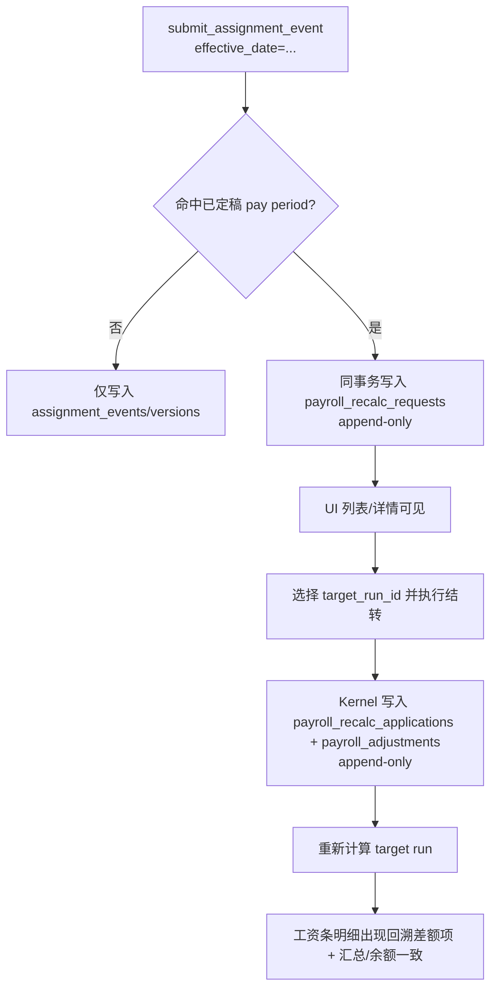

# DEV-PLAN-045：Payroll P0-5——回溯计算（Retroactive Accounting）

**状态**: 实施中（2026-01-09）

已完成事项（合并记录）：
- 阶段 1-2（§8.2-1/2）：recalc tables + RLS + 迁移闭环（PR：#139）
- 阶段 3（§8.2-3）：Kernel（recalc request + apply event）（PR：#141）

> 上游路线图：`DEV-PLAN-039`  
> 蓝图合同（口径/不变量/验收基线）：`DEV-PLAN-040` §5.3（Retroactive Accounting）  
> 细化模板：`DEV-PLAN-001`（本文按其“可直接编码”粒度补齐）  
> 依赖：`DEV-PLAN-041/042/043/044`（主流程载体 + payslip 明细可对账 + 社保 + IIT 累计预扣与 balances）

## 0. 可执行方案（本计划合同）

> 本节为实施合同；若与后文细节冲突，以本节为准（对齐 `DEV-PLAN-040` 的合同口径）。

### 0.1 背景与上下文

- 回溯计算是 HRMS 的核心能力之一：当 HR 在后续日期提交“更早生效”的任职/定薪变更，且该变更命中**已定稿** pay period 时，系统必须能自动识别影响范围、生成重算请求、并在后续周期把差额闭环，避免人工手算差额或直接改读模型。
- P0 的交付边界对齐 `DEV-PLAN-040`：以 **Forwarding（结转法）** 为主完成闭环（差额作为独立 pay item 进入后续周期），并保持全链路可审计与幂等；不在 P0 交付银行文件/财务凭证/外部申报等 Post-Process。
- 本切片仍必须遵守全仓不变量：One Door / No Tx, No RLS / Valid Time=date（日粒度）/ No Legacy（SSOT：`AGENTS.md`）。

### 0.1.1 术语（冻结）

- **触发事件（trigger event）**：导致回溯的写入事件（P0：`staffing.submit_assignment_event`；后续可扩展到社保政策/税表等）。
- **Origin pay period / payslip**：被影响的已定稿 pay period（及该 period 内对应人员/任职的已定稿 payslip）。
- **Target pay period / run**：承载差额结转的后续 pay period（及其 payroll run；P0 只允许写入未定稿 run）。
- **回溯请求（recalc request）**：append-only 的可审计记录，关联触发事件与最早命中 Origin 周期。
- **结转差额（forwarding adjustments）**：写入 Target 周期的“差额 pay items”（本切片设计为**计算输入侧**的 adjustments，最终展示在工资条明细里）。

### 0.2 目标与非目标（P0-5 Slice）

**目标**
- [ ] 回溯触发可捕获：当通过 Kernel `submit_*_event` 提交的 payroll 输入类事件（P0：`staffing.submit_assignment_event`）命中已定稿 pay period 时，必须生成 `staffing.payroll_recalc_requests`（append-only）并可追溯关联触发事件。
- [ ] 影响范围可解释：重算请求必须包含“命中哪一个已定稿 pay period / payslip”的可定位信息（至少包含最早命中周期与定位键）。
- [ ] 差额闭环可执行：对处于开放状态的后续 pay period（或指定目标 run），系统可基于请求生成补发/扣回差额 pay items（forwarding adjustments），并保持 `origin_*` 关联，确保审计可追溯。
- [ ] 累计口径一致：差额进入后续周期后，`DEV-PLAN-044` 的 IIT 累计预扣与 `payroll_balances` 口径必须与“差额 pay items”一致（不得出现“工资条已补差但 balances 未更新”的双权威）。
- [ ] 多次回溯可自洽：同一 Origin period 若已存在历史结转差额，新的回溯必须以“已结转（已承诺支付）”为基线计算净差额，避免重复补差或少补差。
- [ ] UI 可发现/可操作：回溯请求在 UI 上可见（列表/详情/是否已结转），可触发“执行结转”动作，并可在工资条详情查看差额来源。

**非目标**
- 不在 P0 重写已定稿工资条（禁止对 finalized payslip 做 in-place 更新）；历史期的“更正后工资条”如需表达，应以“差额结转 + 可追溯来源”实现。
- 不在 P0 交付批量回溯全员/全年度的自动重算调度；P0 先以“按人员/按请求”可执行为准。
- 不在 P0 支持跨税年（tax_year）回溯结转（例如 2025-12 的差额结转到 2026-01）：若触发命中跨年，必须失败并返回稳定错误码（后续另立 dev-plan 承接）。
- 不在 P0 支持“已计算但未定稿 run”上的就地注入并自动修补 IIT：P0 要求 Target run 处于 `draft/failed`，由用户显式重新计算（对齐 `DEV-PLAN-041` 状态机与“定稿只读”语义）。
- 不在 P0 支持“按 Origin period 的社保政策/基数”重算并结转社保差额；社保扣缴仍按 Target period 的正常计算链路处理（等价将回溯差额视为 Target period 的收入/扣减参与扣缴口径）。

### 0.3 工具链与门禁（SSOT 引用）

> 本计划仅声明命中项与 SSOT 链接，不复制命令清单（避免漂移；见 `DEV-PLAN-000`）。

- **触发器（实施阶段将命中）**
  - [ ] Go 代码（`AGENTS.md`）
  - [ ] DB 迁移 / Schema（`DEV-PLAN-024`）
  - [ ] sqlc（`DEV-PLAN-025`；若引入 queries/config）
  - [ ] 路由治理（`DEV-PLAN-017`；需更新 `config/routing/allowlist.yaml`）
  - [ ] Authz（`DEV-PLAN-022`；若新增对象/动作）
  - [ ] 文档（`make check doc`）
- **SSOT 链接**
  - 触发器矩阵与本地必跑：`AGENTS.md`
  - 命令入口与 CI：`Makefile`、`.github/workflows/quality-gates.yml`
  - DB 迁移闭环：`docs/dev-plans/024-atlas-goose-closed-loop-guide.md`
  - sqlc 规范：`docs/dev-plans/025-sqlc-guidelines.md`
  - 路由策略：`docs/dev-plans/017-routing-strategy.md`
  - Tenancy/RLS：`docs/dev-plans/019-tenant-and-authn.md`、`docs/dev-plans/021-pg-rls-for-org-position-job-catalog.md`
  - 时间语义（Valid Time）：`docs/dev-plans/032-effective-date-day-granularity.md`

### 0.4 关键不变量与失败路径（停止线）

- **No Legacy**：不得引入任何回退通道/双链路（对齐 `AGENTS.md` 与 `DEV-PLAN-004M1`）。
- **One Door**：生成回溯请求/结转差额 pay items 必须走 Kernel 写入口；禁止手工 `INSERT/UPDATE` 读模型表闭环（对齐 `DEV-PLAN-040` “No CDC”）。
- **append-only**：`staffing.payroll_recalc_requests`、`staffing.payroll_recalc_applications`、`staffing.payroll_adjustments` 必须 append-only；已定稿工资条不得被覆盖式更新。
- **幂等**：回溯请求创建与“执行结转”动作必须幂等（同一触发事件不得产生多个请求；同一请求不得被重复结转）。
- **No Tx, No RLS**：缺少 tenant context 直接失败（fail-closed）；回溯链路不得绕过 RLS。
- **失败可见**：任何无法定位命中周期/无法生成结转差额/无目标 run/跨税年等情况必须失败并返回稳定错误码（不得静默吞掉回溯请求）。
- **税额避免双计**：P0 禁止把 `item_code='DEDUCTION_IIT_WITHHOLDING'` 的差额作为 adjustment 结转；应仅结转“非 IIT 的差额 pay items”，并由 `DEV-PLAN-044` 的累计预扣引擎在 Target period 自动计算并追缴/抵扣税额（避免双计）。

### 0.5 验收标准（Done 口径）

- [ ] 已定稿 pay period 后补提交更早生效的定薪/任职变更：同一事务内生成 `staffing.payroll_recalc_requests`，且 UI 可见（列表/详情）。
- [ ] 在存在 Target run（`draft/failed`）的情况下执行“结转”：系统写入 `staffing.payroll_recalc_applications` 与 `staffing.payroll_adjustments`；随后重新计算 Target run，Target period 的工资条出现补发/扣回差额 pay items，并可追溯关联原事件/Origin period/Origin payslip。
- [ ] 多次回溯同一 Origin period：第二次结转仅生成“净差额”（能对冲第一次已结转的金额），不出现重复补差。
- [ ] 差额进入 Target period 后，`payroll_balances` 与 IIT 计算口径一致（不出现“差额已入工资条但累计表未更新”的不一致）。

## 1. 背景与上下文（Context）

### 1.1 为什么必须做成“请求 → 可审计差额 → 后续周期结转”

对齐 `DEV-PLAN-040` §5.3：
- 已定稿结果不可被就地覆盖；否则会破坏审计与对账（“历史工资条被改写”不可接受）。
- 回溯差额必须可追溯来源（触发事件/Origin payslip/Origin period），否则无法解释“为什么本期多发/少发”。
- 回溯必须走 Kernel（One Door）；禁止 CDC/trigger 把事件复制到另一条写链路。

### 1.2 约束（与 041-044 的接口）

- pay period 业务区间：`staffing.pay_periods.period` 为 `daterange` 且闭开 `[start,end)`（见 `DEV-PLAN-041`）。
- finalized 的定义：`staffing.payroll_runs.run_state='finalized'` 且对应 pay period `status='closed'`（见 `DEV-PLAN-041`）。
- payslip 粒度：`staffing.payslips` 以 `(tenant_id, run_id, person_uuid, assignment_id)` 唯一（见 `DEV-PLAN-041`）。
- 回溯结转必须在 Target run 重新计算后体现在工资条：因此 `DEV-PLAN-042+` 的“计算引擎”必须能把 `staffing.payroll_adjustments` 注入到 payslip 明细与汇总（本计划在 §6.3 冻结该要求）。
- pay group：P0 要求 Target pay period 的 `pay_group` 必须与 Origin（hit pay period）的 `pay_group` 一致；否则拒绝结转（避免跨组混算与错误结转）。

### 1.3 前置契约（实现前必须冻结，避免实现期“猜”）

> 本切片依赖 `DEV-PLAN-042/044` 先冻结以下数据契约；否则会把关键决策推迟到 Implement 阶段（违反 `DEV-PLAN-003` 的 Plan 标准）。

- `staffing.payslip_items`（由 `DEV-PLAN-042` 承接落地）：必须以“明细子表”表达工资项，至少包含：
  - 键：`tenant_id`、`payslip_id`
  - 维度：`item_kind`（`earning|deduction|employer_cost`）、`item_code`（trim 后非空且大写）
  - 金额：`amount numeric(15,2)`（P0 币种冻结为 `CNY`；币种在 `staffing.payslips.currency`）
  - 约束：`meta jsonb` 必须为 object；不得用 JSONB array 承载权威明细（对齐 `DEV-PLAN-040`）。
- IIT 明细 pay item code（由 `DEV-PLAN-044` 承接冻结）：P0 固定为 `item_kind='deduction'` + `item_code='DEDUCTION_IIT_WITHHOLDING'`；`DEV-PLAN-045` 在结转时以此识别并跳过 IIT 差额（避免双计）。

## 2. 目标与非目标（Goals & Non-Goals）

> 本节补齐实现粒度的细节；总体目标见 §0.2。

### 2.1 P0 支持的最小回溯场景（冻结）

- 已定稿 `2026-01` pay period 后，提交 `effective_date` 为 `2026-01-15` 的定薪变更。
- 系统生成回溯请求；HR 在 `2026-02` 的 payroll run（draft）上点击“执行结转”。
- 重新计算 `2026-02` run 后，`2026-02` 的 payslip 出现：
  - 一条或多条“回溯差额”pay items（可为正/负）。
  - IIT 由累计预扣引擎自动追缴/抵扣（不需要独立的“历史税差额”pay item）。

### 2.2 P0 明确拒绝的场景（冻结）

- 跨税年：Origin period 的税年 ≠ Target period 税年（基于 `lower(pay_period.period)` 的年份判定；见 §6.2.5）。
- Target run 已进入 `calculating/calculated/finalized`：必须先回到 `draft/failed` 并重新计算（P0 不做就地注入修补）。

## 3. 架构与关键决策（Architecture & Decisions）

### 3.1 高层流程图（Mermaid）



### 3.2 关键设计决策（ADR 摘要）

- **决策 1：回溯请求与结转结果全部 append-only**
  - 目的：避免“改写历史”与状态漂移；与 `DEV-PLAN-040` 的“可审计”一致。
- **决策 2：差额以 Target run 的“计算输入侧 adjustments”表达**
  - 目的：让 IIT/社保等依赖链在 Target run 的一次计算中统一收敛，避免“先算出差额再手工补一个税差额”导致双计或漏计。
- **决策 3：P0 禁止显式结转 IIT 差额 pay item**
  - 目的：累计预扣法天然具备追缴/抵扣能力；显式转发 IIT 差额极易与 `DEV-PLAN-044` 的引擎双计。

## 4. 数据模型与约束（Data Model & Constraints）

> 下述为本切片冻结的数据合同；实现期以 `modules/staffing/infrastructure/persistence/schema/*.sql` 为 Schema SSOT，并按 `DEV-PLAN-024` 生成迁移闭环。

### 4.1 表清单（新增）

> 注意：实现落地 `CREATE TABLE` 前需你明确确认（红线，SSOT：`AGENTS.md`）。

- `staffing.payroll_recalc_requests`（append-only，回溯请求 SoT）
- `staffing.payroll_recalc_applications`（append-only，结转动作记录）
- `staffing.payroll_adjustments`（append-only，Target run 的计算输入侧差额明细）

### 4.2 Schema（SQL 合同草案，按现有 staffing 风格对齐）

#### 4.2.1 `staffing.payroll_recalc_requests`

```sql
CREATE TABLE IF NOT EXISTS staffing.payroll_recalc_requests (
  id bigserial PRIMARY KEY,
  tenant_id uuid NOT NULL,
  recalc_request_id uuid NOT NULL DEFAULT gen_random_uuid(),
  trigger_event_id uuid NOT NULL,
  trigger_source text NOT NULL DEFAULT 'assignment',
  person_uuid uuid NOT NULL,
  assignment_id uuid NOT NULL,
  effective_date date NOT NULL,
  hit_pay_period_id uuid NOT NULL,
  hit_run_id uuid NOT NULL,
  hit_payslip_id uuid NULL,
  request_id text NOT NULL,
  initiator_id uuid NOT NULL,
  transaction_time timestamptz NOT NULL DEFAULT now(),
  created_at timestamptz NOT NULL DEFAULT now(),
  CONSTRAINT payroll_recalc_requests_trigger_source_check CHECK (trigger_source IN ('assignment')),
  CONSTRAINT payroll_recalc_requests_request_id_nonempty_check CHECK (btrim(request_id) <> ''),
  CONSTRAINT payroll_recalc_requests_tenant_recalc_request_id_unique UNIQUE (tenant_id, recalc_request_id),
  CONSTRAINT payroll_recalc_requests_trigger_event_unique UNIQUE (tenant_id, trigger_event_id),
  CONSTRAINT payroll_recalc_requests_assignment_fk FOREIGN KEY (tenant_id, assignment_id) REFERENCES staffing.assignments(tenant_id, id) ON DELETE RESTRICT,
  CONSTRAINT payroll_recalc_requests_hit_period_fk FOREIGN KEY (tenant_id, hit_pay_period_id) REFERENCES staffing.pay_periods(tenant_id, id) ON DELETE RESTRICT,
  CONSTRAINT payroll_recalc_requests_hit_run_fk FOREIGN KEY (tenant_id, hit_run_id) REFERENCES staffing.payroll_runs(tenant_id, id) ON DELETE RESTRICT,
  CONSTRAINT payroll_recalc_requests_hit_payslip_fk FOREIGN KEY (tenant_id, hit_payslip_id) REFERENCES staffing.payslips(tenant_id, id) ON DELETE RESTRICT
);

CREATE INDEX IF NOT EXISTS payroll_recalc_requests_tenant_created_idx
  ON staffing.payroll_recalc_requests (tenant_id, created_at DESC, id DESC);

CREATE INDEX IF NOT EXISTS payroll_recalc_requests_tenant_person_effective_idx
  ON staffing.payroll_recalc_requests (tenant_id, person_uuid, effective_date, id);
```

#### 4.2.2 `staffing.payroll_recalc_applications`

```sql
CREATE TABLE IF NOT EXISTS staffing.payroll_recalc_applications (
  id bigserial PRIMARY KEY,
  event_id uuid NOT NULL DEFAULT gen_random_uuid(),
  tenant_id uuid NOT NULL,
  recalc_request_id uuid NOT NULL,
  target_run_id uuid NOT NULL,
  target_pay_period_id uuid NOT NULL,
  request_id text NOT NULL,
  initiator_id uuid NOT NULL,
  transaction_time timestamptz NOT NULL DEFAULT now(),
  created_at timestamptz NOT NULL DEFAULT now(),
  CONSTRAINT payroll_recalc_applications_request_id_nonempty_check CHECK (btrim(request_id) <> ''),
  CONSTRAINT payroll_recalc_applications_event_id_unique UNIQUE (event_id),
  CONSTRAINT payroll_recalc_applications_one_per_request_unique UNIQUE (tenant_id, recalc_request_id),
  CONSTRAINT payroll_recalc_applications_request_fk FOREIGN KEY (tenant_id, recalc_request_id) REFERENCES staffing.payroll_recalc_requests(tenant_id, recalc_request_id) ON DELETE RESTRICT,
  CONSTRAINT payroll_recalc_applications_target_run_fk FOREIGN KEY (tenant_id, target_run_id) REFERENCES staffing.payroll_runs(tenant_id, id) ON DELETE RESTRICT,
  CONSTRAINT payroll_recalc_applications_target_period_fk FOREIGN KEY (tenant_id, target_pay_period_id) REFERENCES staffing.pay_periods(tenant_id, id) ON DELETE RESTRICT
);

CREATE INDEX IF NOT EXISTS payroll_recalc_applications_tenant_created_idx
  ON staffing.payroll_recalc_applications (tenant_id, created_at DESC, id DESC);
```

#### 4.2.3 `staffing.payroll_adjustments`

```sql
CREATE TABLE IF NOT EXISTS staffing.payroll_adjustments (
  id bigserial PRIMARY KEY,
  tenant_id uuid NOT NULL,
  application_id bigint NOT NULL REFERENCES staffing.payroll_recalc_applications(id) ON DELETE RESTRICT,
  recalc_request_id uuid NOT NULL,
  target_run_id uuid NOT NULL,
  target_pay_period_id uuid NOT NULL,
  person_uuid uuid NOT NULL,
  assignment_id uuid NOT NULL,
  origin_pay_period_id uuid NOT NULL,
  origin_run_id uuid NOT NULL,
  origin_payslip_id uuid NULL,
  item_kind text NOT NULL,
  item_code text NOT NULL,
  amount numeric(15,2) NOT NULL,
  meta jsonb NOT NULL DEFAULT '{}'::jsonb,
  created_at timestamptz NOT NULL DEFAULT now(),
  CONSTRAINT payroll_adjustments_item_kind_check CHECK (item_kind IN ('earning','deduction','employer_cost')),
  CONSTRAINT payroll_adjustments_item_code_nonempty_check CHECK (btrim(item_code) <> ''),
  CONSTRAINT payroll_adjustments_item_code_trim_check CHECK (item_code = btrim(item_code)),
  CONSTRAINT payroll_adjustments_item_code_upper_check CHECK (item_code = upper(item_code)),
  CONSTRAINT payroll_adjustments_meta_is_object_check CHECK (jsonb_typeof(meta) = 'object'),
  CONSTRAINT payroll_adjustments_request_fk FOREIGN KEY (tenant_id, recalc_request_id) REFERENCES staffing.payroll_recalc_requests(tenant_id, recalc_request_id) ON DELETE RESTRICT,
  CONSTRAINT payroll_adjustments_target_run_fk FOREIGN KEY (tenant_id, target_run_id) REFERENCES staffing.payroll_runs(tenant_id, id) ON DELETE RESTRICT,
  CONSTRAINT payroll_adjustments_target_period_fk FOREIGN KEY (tenant_id, target_pay_period_id) REFERENCES staffing.pay_periods(tenant_id, id) ON DELETE RESTRICT,
  CONSTRAINT payroll_adjustments_assignment_fk FOREIGN KEY (tenant_id, assignment_id) REFERENCES staffing.assignments(tenant_id, id) ON DELETE RESTRICT,
  CONSTRAINT payroll_adjustments_origin_period_fk FOREIGN KEY (tenant_id, origin_pay_period_id) REFERENCES staffing.pay_periods(tenant_id, id) ON DELETE RESTRICT,
  CONSTRAINT payroll_adjustments_origin_run_fk FOREIGN KEY (tenant_id, origin_run_id) REFERENCES staffing.payroll_runs(tenant_id, id) ON DELETE RESTRICT,
  CONSTRAINT payroll_adjustments_origin_payslip_fk FOREIGN KEY (tenant_id, origin_payslip_id) REFERENCES staffing.payslips(tenant_id, id) ON DELETE RESTRICT,
  CONSTRAINT payroll_adjustments_no_duplicate_per_apply_unique UNIQUE (
    tenant_id,
    application_id,
    person_uuid,
    assignment_id,
    origin_pay_period_id,
    item_kind,
    item_code
  )
);

CREATE INDEX IF NOT EXISTS payroll_adjustments_target_lookup_idx
  ON staffing.payroll_adjustments (tenant_id, target_run_id, person_uuid, assignment_id, id);

CREATE INDEX IF NOT EXISTS payroll_adjustments_origin_lookup_idx
  ON staffing.payroll_adjustments (tenant_id, origin_pay_period_id, person_uuid, assignment_id, id);
```

### 4.3 RLS（必须）

对上述 3 张表全部启用 RLS 并 `FORCE ROW LEVEL SECURITY`，策略对齐 `staffing.positions`（见 `modules/staffing/infrastructure/persistence/schema/00002_staffing_tables.sql`）。

### 4.4 迁移策略（按 `DEV-PLAN-024`）

- **Schema SSOT**：建议新增（文件名可调整，避免与现有序列冲突）
  - `modules/staffing/infrastructure/persistence/schema/00011_staffing_payroll_recalc_tables.sql`
  - `modules/staffing/infrastructure/persistence/schema/00012_staffing_payroll_recalc_engine.sql`
- **生成迁移**：在 `migrations/staffing/` 生成对应 goose 迁移文件，并更新 `migrations/staffing/atlas.sum`；必须保证 `make staffing plan` 最终输出 No Changes。

## 5. 接口契约（API Contracts）

> 口径对齐 `DEV-PLAN-041`：UI 为 HTML + HTMX；同时提供最小 internal API 便于测试与排障（route_class=`internal_api`）。

### 5.1 UI：Recalc Requests

#### `GET /org/payroll-recalc-requests`
- **用途**：展示回溯请求列表（默认按创建时间倒序）。
- **Query（可选）**：
  - `person_uuid`：按人过滤
  - `state`：`pending|applied`（P0 仅需这两个；状态由是否存在 application 推导）

#### `GET /org/payroll-recalc-requests/{recalc_request_id}`
- **用途**：展示请求详情（触发事件、effective_date、命中 Origin period/payslip、是否已结转、结转目标）。
- **页面必须展示**：
  - 触发事件：`trigger_event_id`、`request_id`、`initiator_id`、`transaction_time`
  - 命中信息：`hit_pay_period_id`、`hit_run_id`、`hit_payslip_id`
  - 若已结转：`target_run_id`、`target_pay_period_id`、结转时间（=application.`created_at`）
  - 若未结转：提供“执行结转”表单

#### `POST /org/payroll-recalc-requests/{recalc_request_id}/apply`
- **Form Fields**
  - `target_run_id`（必填，uuid）
- **成功**：303 跳转回详情页（显示已结转信息）。
- **失败（422/409）**：回显稳定错误码与可读提示（不得静默）。

### 5.2 Internal API（最小）

- `GET /org/api/payroll-recalc-requests` → `[{recalc_request_id,person_uuid,assignment_id,effective_date,hit_pay_period_id,created_at,applied}]`
- `GET /org/api/payroll-recalc-requests/{recalc_request_id}` → `{...,+application,+adjustments_summary}`
- `POST /org/api/payroll-recalc-requests/{recalc_request_id}:apply`（JSON body `{ "target_run_id": "uuid" }`）→ `200 {recalc_request_id,target_run_id,target_pay_period_id}`

## 6. 核心逻辑与算法（Business Logic & Algorithms）

### 6.1 “命中已定稿 pay period”的判定口径（冻结）

给定 `(tenant_id, person_uuid, assignment_id, effective_date)`：

- 命中条件（最小）：存在已定稿 pay period（`status='closed'` 且存在 `run_state='finalized'` 的 run），并且该 pay period 的 `period` 满足 `upper(period) > effective_date`。
- 最早命中（hit）：在所有命中的已定稿 pay periods 中，取 `lower(pay_period.period)` 最小的那一个作为 `hit_pay_period_id`。
- `hit_payslip_id`：
  - 若该 hit pay period 内已存在该 `person_uuid+assignment_id` 的已定稿 payslip，则写入其 `payslip_id`；
  - 若不存在（例如补录了一个“过去已存在但当时系统未知”的 assignment），允许为 `NULL`（此时视为该 origin 期 original=0，差额将以结转形式补齐）。

原因：
- Valid Time 以日粒度表达，assignment 的有效版本从 `effective_date` 起持续到下一个事件（或 infinity），因此任何 `upper(period) > effective_date` 的 period 都可能受影响（包括 effective_date 落在 gap 之前的情况）。

### 6.2 Kernel：创建回溯请求（append-only）

#### 6.2.1 触发点（P0）

在 `staffing.submit_assignment_event(...)` 成功写入并完成 `replay_assignment_versions(...)` 后，调用内部函数：

`staffing.maybe_create_payroll_recalc_request_from_assignment_event(...)`

> 要求：若判定命中已定稿 period，则“写入回溯请求”必须与 assignment event 同事务提交；否则视为违反 `DEV-PLAN-040` 的口径冻结点（不得静默忽略回溯）。

**触发范围（冻结，避免噪声）**

仅当该 assignment event 属于“影响算薪输入”的变更时才进入命中判定：
- `event_type='CREATE'`：始终视为 payroll-impactful（补录历史任职会影响已定稿 pay period）。
- `event_type='UPDATE'`：当且仅当 payload 至少包含以下 key 之一时视为 payroll-impactful：
  - `status`（active/inactive）
  - `allocated_fte`（P0 若尚未落地该字段，可先不实现该 key；但一旦 `DEV-PLAN-042` 使用它，必须补齐）
  - `base_salary` / `currency`（对齐 `DEV-PLAN-042` 的 gross pay 输入）

> 明确排除：`position_id` 单独变更在 P0 不触发回溯（因为 P0 计算不读取该字段）；若后续切片引入“按岗位决定工资项/规则”，必须先更新本冻结点。

#### 6.2.2 幂等键（冻结）

- 幂等锚点：`(tenant_id, trigger_event_id)`，其中 `trigger_event_id = p_event_id`（assignment event_id）。
- 约束：`payroll_recalc_requests_trigger_event_unique`。

#### 6.2.3 伪代码（DB Kernel 视角）

1. `assert_current_tenant(p_tenant_id)`。
2. 查询 `hit_*`（§6.1）；若未命中，直接返回（不写请求）。
3. `INSERT INTO staffing.payroll_recalc_requests (...) ON CONFLICT (tenant_id, trigger_event_id) DO NOTHING`：
   - 若插入成功：返回 `recalc_request_id`。
   - 若冲突：读取既有行并返回（assignment submit 已保证 event_id 幂等一致）。

#### 6.2.4 稳定错误码（至少）

- `STAFFING_PAYROLL_RECALC_HIT_FINALIZED_BUT_MISSING_RUN`：命中 closed pay period 但无法定位 finalized run（视为数据一致性破坏，必须失败）。

### 6.3 Kernel：执行结转（写入 applications + adjustments）

#### 6.3.1 入口（建议）

```sql
SELECT staffing.submit_payroll_recalc_apply_event(
  p_event_id          => $1::uuid,
  p_tenant_id         => $2::uuid,
  p_recalc_request_id => $3::uuid,
  p_target_run_id     => $4::uuid,
  p_request_id        => $5::text,
  p_initiator_id      => $6::uuid
);
```

> 说明：此函数的职责是“生成 Target period 的差额输入”；不负责触发计算（计算仍由 `DEV-PLAN-041` 的 `CALC_START/CALC_FINISH` 驱动）。

#### 6.3.2 前置校验（必须）

1. `assert_current_tenant(p_tenant_id)`。
2. 请求存在性：`payroll_recalc_requests(recalc_request_id)` 必须存在。
3. 只允许一次结转：若存在 `payroll_recalc_applications`，返回 `STAFFING_PAYROLL_RECALC_ALREADY_APPLIED`。
4. target run 校验：
   - `run_state IN ('draft','failed')`，否则失败 `STAFFING_PAYROLL_RECALC_TARGET_RUN_NOT_EDITABLE`。
   - 读取 `target_pay_period_id`（FK/查询）；target pay period 必须为 `status='open'`（或至少不为 closed），否则失败。
   - pay group 必须一致：`target_pay_group == origin_hit_pay_group`，否则失败 `STAFFING_PAYROLL_RECALC_PAY_GROUP_MISMATCH`。
5. 跨税年拒绝：
   - 以 `lower(pay_period.period)` 的年份作为 `tax_year`。
   - Origin 与 Target 的 `tax_year` 必须一致，否则失败 `STAFFING_PAYROLL_RECALC_CROSS_TAX_YEAR_UNSUPPORTED`。

#### 6.3.3 计算“需要回溯的 Origin 集合”（冻结）

在同一 `person_uuid+assignment_id` 下，取所有“已定稿 pay periods（及其 finalized run）”作为 Origin 集合；对每个 Origin period 尝试定位 payslip（若不存在则视为 original=0）：

- 满足 `upper(origin_period) > effective_date`
- 且 `lower(origin_period) < lower(target_period)`（必须结转到后续周期）
- 按 `lower(origin_period)` 升序排序

若集合为空：失败 `STAFFING_PAYROLL_RECALC_NOTHING_TO_APPLY`。

#### 6.3.4 计算差额（Forwarding adjustments）（核心算法）

对每个 Origin period：

1. **读取原始结果（original）**：
   - 若 `origin_payslip_id` 存在：从 `payslip_items` 聚合为 map（key=`item_kind + item_code`，value=`amount`）。
   - 若 `origin_payslip_id` 不存在：视为 empty map（original=0，补录历史任职场景）。
2. **读取已结转差额（already_forwarded）**：从 `payroll_adjustments` 聚合：
   - 过滤条件：同 `tenant/person_uuid/assignment_id/origin_pay_period_id`
   - 说明：对同一 origin 的 **所有** 历史 application 的 adjustments 求和（作为“已承诺支付”的基线）
3. **计算基线（as_settled）**：`original + already_forwarded`（逐 key 相加）。
4. **计算“重算应得（recalculated）”**：
   - P0 仅重算 payslip “工资项明细”（对齐 `DEV-PLAN-042` 的口径），并明确不依赖 `payroll_balances as-of`。
   - 不计算 IIT；IIT 仅在 Target period 由 `DEV-PLAN-044` 的累计预扣引擎统一计算（避免双计与 as-of 复杂度）。
   - 输出同结构 map（`earning|deduction|employer_cost`），其中 IIT 项必须不存在。
5. **计算净差额（delta_to_forward）**：`recalculated - as_settled`。
6. **过滤与落盘**：
   - 对于 `item_kind='deduction' AND item_code='DEDUCTION_IIT_WITHHOLDING'`：**跳过**（P0 禁止结转 IIT 差额，避免双计）。
   - `amount == 0.00` 的项不落盘（避免噪声）。
   - 其余项插入 `staffing.payroll_adjustments`，并写入 `origin_*` 关联与 `meta`（至少包含 `trigger_event_id`）。

#### 6.3.5 与 balances 的一致性（冻结要求）

- `DEV-PLAN-044` 的累计预扣引擎必须把 `payroll_adjustments` 作为 payslip 的明细输入之一：
  - adjustments 中 `item_kind/item_code` 属于“计税收入/专项扣除/公司成本”的，必须按口径进入税基与汇总。
  - `payslips.gross_pay` 必须包含 `item_kind='earning'` 的 adjustments（否则 `DEV-PLAN-044` 的 `ytd_income`（以 `gross_pay` 计入）将漏计回溯差额）。
  - 最终 `payroll_balances` 的更新仍以 Target run 定稿为事务边界（对齐 `DEV-PLAN-044` §0.4“事务一致性”）。
  
> P0 说明：由于本切片不显式结转 IIT 差额，且累计预扣法以“税年累计值”校正税额，因此不要求 `payroll_balances` 支持 origin as-of 重算；只要求 Target period 计算时把 adjustments 纳入税基，并在定稿时一致性更新 balances。

#### 6.3.6 稳定错误码（至少）

- `STAFFING_PAYROLL_RECALC_REQUEST_NOT_FOUND`
- `STAFFING_PAYROLL_RECALC_ALREADY_APPLIED`
- `STAFFING_PAYROLL_RECALC_TARGET_RUN_NOT_EDITABLE`
- `STAFFING_PAYROLL_RECALC_TARGET_PERIOD_CLOSED`
- `STAFFING_PAYROLL_RECALC_PAY_GROUP_MISMATCH`
- `STAFFING_PAYROLL_RECALC_CROSS_TAX_YEAR_UNSUPPORTED`
- `STAFFING_PAYROLL_RECALC_NOTHING_TO_APPLY`

## 7. 安全与鉴权（Security & Authz）

### 7.1 Authz 对象与动作（冻结口径）

按 `DEV-PLAN-041` 的风格：
- 新增对象常量：
  - `staffing.payroll-recalc-requests`（read/admin）
- UI：
  - GET（列表/详情）为 `read`
  - POST（apply）为 `admin`
- internal API：同 UI

### 7.2 数据隔离

- RLS 是强隔离底线；应用层不得以“绕过 RLS”作为排障手段进入业务链路。

## 8. 依赖与里程碑（Dependencies & Milestones）

### 8.1 依赖

- 路线图/上位合同：`DEV-PLAN-039/040`。
- 主流程与状态机：`DEV-PLAN-041`。
- payslip 明细与汇总可重算：`DEV-PLAN-042/043`。
- IIT 与 balances：`DEV-PLAN-044`（并确保回溯输入纳入税基口径）。
- Tenancy/RLS：`DEV-PLAN-019/021`。

### 8.2 里程碑（实现顺序建议）

1. [x] Schema SSOT：新增 recalc tables + RLS（`modules/staffing/.../schema`）。
2. [x] Schema→迁移闭环：按 `DEV-PLAN-024` 生成 `migrations/staffing/*` + `atlas.sum`。
3. [x] Kernel：实现 “maybe_create_recalc_request” 与 “submit_recalc_apply_event”（幂等 + 稳定错误码）。
4. [ ] Payroll 计算引擎：在 Target run 的计算路径中注入 `payroll_adjustments`（并确保 totals/balances 一致）。
5. [ ] Server：实现 handlers/routes（UI + internal API）与页面展示（含差额来源）。
6. [ ] Routing/Authz：更新 `config/routing/allowlist.yaml` 与 authz registry/middleware。
7. [ ] Tests：覆盖命中判定、幂等、跨税年拒绝、重复回溯净差额、RLS fail-closed。

## 9. 测试与验收（Acceptance Criteria）

### 9.1 最小测试矩阵（必须）

- [ ] 触发：已定稿后提交更早 effective_date 的 assignment 事件 → 同事务生成 recalc request（且幂等）。
- [ ] 未命中：effective_date 在最后已定稿 period 之后 → 不生成请求。
- [ ] apply：无 target run/target run 不可编辑/跨税年 → 稳定错误码。
- [ ] apply 幂等：同一 recalc_request_id 重复 apply → 不产生重复 adjustments。
- [ ] 多次回溯：对同一 origin period 连续两次变更并 apply → 第二次只生成净差额（可对冲第一次）。
- [ ] RLS：不设置 `app.current_tenant` 时，对 recalc/adjustments 表的读写全部失败（fail-closed）。

### 9.2 端到端验收脚本（建议以 UI 可操作复现）

1. 创建并定稿 `2026-01` payroll run（确保生成 payslip 与明细）。
2. 提交一条 `effective_date=2026-01-15` 的定薪变更（命中已定稿）→ UI 出现回溯请求。
3. 创建 `2026-02` payroll run（draft）→ 在回溯请求详情选择该 run 执行结转。
4. 对 `2026-02` run 点击“计算”→ 工资条出现回溯差额项，且可追溯到 `2026-01` 的 origin payslip。

## 10. 运维与监控（Ops & Monitoring）

- P0 不引入复杂监控/开关；仅要求关键日志可定位（建议包含 `tenant_id`, `recalc_request_id`, `target_run_id`, `trigger_event_id`, `request_id`）。

## 11. 备注（与后续切片的边界）

- 若未来需要跨税年回溯、批量全员重算调度、与外部申报/凭证/支付集成，必须另立 dev-plan 承接（避免在 P0 期间隐式扩张）。
