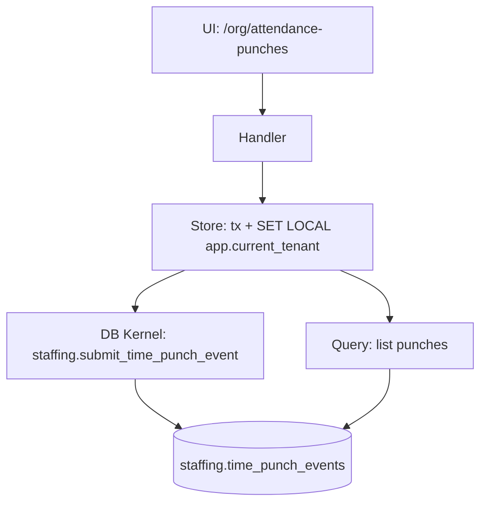

# DEV-PLAN-051：考勤 Slice 4A——打卡流水闭环（手工补卡 + 最小导入）

**状态**: 草拟中（2026-01-09 03:26 UTC）

> 目标：按 `DEV-PLAN-001` 模板补齐到“无需再做设计决策即可开工”的细化程度（Level 4-5）。

## 1. 背景与上下文 (Context)

- **需求来源**：`docs/dev-plans/050-hrms-attendance-blueprint.md`（Slice 4A）。
- **范围定位**：对齐 `docs/dev-plans/009-implementation-roadmap.md` Phase 4 的“业务垂直切片：业务 + UI 同步交付”。
- **模块落点（选定）**：先落在“tenant app”一侧的 `/org/*` UI 路由与 `staffing` DB schema 内（对齐现有 `positions/assignments/payroll-*` 的落点），避免过早新增模块（参考 `docs/dev-plans/015-ddd-layering-framework.md`、`docs/dev-plans/016-greenfield-hr-modules-skeleton.md`）。
- **本切片的业务价值**：提供后续 Slice（4B 日结果、4C 规则/日历、4D 额度、4E 更正、4F 外部对接）的**可重放输入底座**与 UI 验收入口。

## 2. 目标与非目标 (Goals & Non-Goals)

### 2.1 核心目标（Done 的定义）

- [ ] **One Door**：唯一写入口为 DB Kernel `staffing.submit_time_punch_event(...)`；禁止绕过 kernel 直接写表。
- [ ] **append-only 事件 SoT**：`staffing.time_punch_events` 只允许 INSERT；不引入 `is_processed` 等“回写事件表”的处理标记（对齐 `docs/dev-plans/050-hrms-attendance-blueprint.md` §5.1.1A）。
- [ ] **No Tx, No RLS**：相关表启用 `ENABLE + FORCE`；所有读写均“显式事务 + 事务内注入 `app.current_tenant`”，缺失注入 fail-closed（对齐 `docs/dev-plans/021-pg-rls-for-org-position-job-catalog.md`）。
- [ ] **UI 可见可操作**：提供 `/org/attendance-punches` 页面：按人员 + 日期范围查询流水；支持手工补打卡（IN/OUT）；支持最小导入（CSV 粘贴）。
- [ ] **Authz 可拒绝**：`AUTHZ_MODE=enforce` 下，未授权的 read/admin 必须被统一 403 拒绝（对齐 `docs/dev-plans/022-authz-casbin-toolchain.md`）。
- [ ] **可测**：至少覆盖 RLS fail-closed、跨租户隔离、幂等键重用冲突、Authz 路由映射正确性。

### 2.2 非目标（Out of Scope）

- 不做日结果计算（出勤/缺勤/异常）与重算（见 `docs/dev-plans/052-attendance-slice-4b-daily-results-standard-shift.md`、`docs/dev-plans/055-attendance-slice-4e-corrections-audit-recalc.md`）。
- 不引入 TimeProfile/Shift/HolidayCalendar（见 `docs/dev-plans/053-attendance-slice-4c-time-profile-holiday-calendar.md`）。
- 不接入钉钉/企微（见 `docs/dev-plans/056-attendance-slice-4f-dingtalk-wecom-integration.md`）。
- 不引入异步队列/Sidecar/物化视图刷新链路（对齐 `AGENTS.md` §3.6）。

## 2.3 工具链与门禁（SSOT 引用）

- **触发器清单（本计划命中）**：
  - [X] Go 代码（`go fmt ./... && go vet ./... && make check lint && make test`）
  - [X] DB 迁移 / Schema（Atlas+Goose，`make staffing plan && make staffing lint && make staffing migrate up`）
  - [X] sqlc（`make sqlc-generate`，然后 `git status --short` 必须为空）
  - [X] 路由治理（`make check routing`；必要时更新 `config/routing/allowlist.yaml`）
  - [X] Authz（`make authz-pack && make authz-test && make authz-lint`）

- **SSOT 链接**：
  - 触发器矩阵与本地必跑：`AGENTS.md`
  - CI 门禁定义：`docs/dev-plans/012-ci-quality-gates.md`
  - RLS 契约：`docs/dev-plans/021-pg-rls-for-org-position-job-catalog.md`
  - 路由策略：`docs/dev-plans/017-routing-strategy.md`
  - Authz 工具链与 object/action 口径：`docs/dev-plans/022-authz-casbin-toolchain.md`
  - Atlas+Goose 闭环：`docs/dev-plans/024-atlas-goose-closed-loop-guide.md`

## 3. 架构与关键决策 (Architecture & Decisions)

### 3.1 架构图 (Mermaid)



### 3.2 关键设计决策（ADR 摘要）

- **表命名与落点（选定）**：蓝图中概念名 `t_time_event` 在本仓库落地为 `staffing.time_punch_events`，与既有 `staffing.*_events` 命名一致。
- **事件 SoT append-only（选定）**：仅 INSERT；“处理进度/消费状态”若需持久化，必须进独立 `*_consumer_offsets` 或 outbox 表（不回写事件表；对齐蓝图 §5.1.1A）。
- **最小幂等（选定）**：以 `event_id`（uuid）作为强幂等键；`request_id`（text）本切片固定为 `event_id::text`，保证与既有 kernel 写入口风格一致、易审计。
- **source_provider（选定，4A）**：仅允许 `MANUAL|IMPORT`；外部 providers（钉钉/企微/IOT）与外部幂等键（`source_event_id`）在 `docs/dev-plans/056-attendance-slice-4f-dingtalk-wecom-integration.md` 引入并单独评审其幂等/分区策略。
- **分区策略（选定，MVP）**：本切片先不对 `staffing.time_punch_events` 做 RANGE 分区，以降低首个闭环复杂度；当 Slice 4F 引入外部高频摄入时再评估按 `punch_time` 分区，并同步处理“分区表 unique 约束必须包含分区键”的幂等约束改造（可能需要独立 idempotency/去重表）。
- **时区语义（选定，MVP）**：
  - DB 存储：`punch_time` 为 `timestamptz`（绝对时间）。
  - UI 输入/查询：按 `Asia/Shanghai`（北京时间）解释 `from_date/to_date` 与 `datetime-local`，在服务层转换为 UTC 后写入/查询；后续在 Slice 4C 引入 TimeProfile 后再改为“按 tenant 配置时区”。
- **弱耦合（选定）**：不对 `person_uuid` 建外键（与现有 `staffing.assignments.person_uuid` 一致）；人员选择 UI 复用 `GET /person/api/persons:options`。

## 4. 数据模型与约束 (Data Model & Constraints)

> 红线：新增数据库表/迁移落地前必须获得你手工确认（`AGENTS.md` §3.2）。

### 4.1 Schema 定义（SQL；落地以 migrations 为准）

#### 4.1.1 `staffing.time_punch_events`（打卡事件 SoT，append-only）

```sql
CREATE TABLE IF NOT EXISTS staffing.time_punch_events (
  id bigserial PRIMARY KEY,
  event_id uuid NOT NULL,
  tenant_id uuid NOT NULL,
  person_uuid uuid NOT NULL,
  punch_time timestamptz NOT NULL,
  punch_type text NOT NULL, -- IN/OUT
  source_provider text NOT NULL, -- MANUAL/IMPORT

  -- 业务/审计扩展字段：均为 object（禁止 array/scalar）
  payload jsonb NOT NULL DEFAULT '{}'::jsonb, -- 例如：{"note":"补卡原因","source":"ui"}
  source_raw_payload jsonb NOT NULL DEFAULT '{}'::jsonb, -- 外部原始报文（审计/排障）
  device_info jsonb NOT NULL DEFAULT '{}'::jsonb, -- GPS/Wifi/DeviceId 等（审计/风控）

  request_id text NOT NULL,
  initiator_id uuid NOT NULL, -- principal_id（审计）
  transaction_time timestamptz NOT NULL DEFAULT now(),
  created_at timestamptz NOT NULL DEFAULT now(),

  CONSTRAINT time_punch_events_punch_type_check CHECK (punch_type IN ('IN','OUT')),
  CONSTRAINT time_punch_events_source_provider_check CHECK (source_provider IN ('MANUAL','IMPORT')),
  CONSTRAINT time_punch_events_payload_is_object_check CHECK (jsonb_typeof(payload) = 'object'),
  CONSTRAINT time_punch_events_source_raw_is_object_check CHECK (jsonb_typeof(source_raw_payload) = 'object'),
  CONSTRAINT time_punch_events_device_info_is_object_check CHECK (jsonb_typeof(device_info) = 'object'),
  CONSTRAINT time_punch_events_event_id_unique UNIQUE (event_id),
  CONSTRAINT time_punch_events_request_id_unique UNIQUE (tenant_id, request_id)
);

CREATE INDEX IF NOT EXISTS time_punch_events_lookup_idx
  ON staffing.time_punch_events (tenant_id, person_uuid, punch_time DESC, id DESC);

ALTER TABLE staffing.time_punch_events ENABLE ROW LEVEL SECURITY;
ALTER TABLE staffing.time_punch_events FORCE ROW LEVEL SECURITY;
DROP POLICY IF EXISTS tenant_isolation ON staffing.time_punch_events;
CREATE POLICY tenant_isolation ON staffing.time_punch_events
USING (tenant_id = current_setting('app.current_tenant')::uuid)
WITH CHECK (tenant_id = current_setting('app.current_tenant')::uuid);
```

#### 4.1.2 Kernel 写入口：`staffing.submit_time_punch_event(...)`

> 约束：必须在事务内调用，且事务内已注入 `app.current_tenant`；缺失注入应 fail-closed。

```sql
CREATE OR REPLACE FUNCTION staffing.submit_time_punch_event(
  p_event_id uuid,
  p_tenant_id uuid,
  p_person_uuid uuid,
  p_punch_time timestamptz,
  p_punch_type text,
  p_source_provider text,
  p_payload jsonb,
  p_source_raw_payload jsonb,
  p_device_info jsonb,
  p_request_id text,
  p_initiator_id uuid
)
RETURNS bigint
LANGUAGE plpgsql
AS $$
DECLARE
  v_event_db_id bigint;
  v_existing staffing.time_punch_events%ROWTYPE;
  v_payload jsonb;
  v_source_raw jsonb;
  v_device jsonb;
BEGIN
  PERFORM staffing.assert_current_tenant(p_tenant_id);

  IF p_event_id IS NULL THEN
    RAISE EXCEPTION USING MESSAGE = 'STAFFING_INVALID_ARGUMENT', DETAIL = 'event_id is required';
  END IF;
  IF p_person_uuid IS NULL THEN
    RAISE EXCEPTION USING MESSAGE = 'STAFFING_INVALID_ARGUMENT', DETAIL = 'person_uuid is required';
  END IF;
  IF p_punch_time IS NULL THEN
    RAISE EXCEPTION USING MESSAGE = 'STAFFING_INVALID_ARGUMENT', DETAIL = 'punch_time is required';
  END IF;
  IF p_punch_type NOT IN ('IN','OUT') THEN
    RAISE EXCEPTION USING MESSAGE = 'STAFFING_INVALID_ARGUMENT', DETAIL = format('unsupported punch_type: %s', p_punch_type);
  END IF;
  IF p_source_provider NOT IN ('MANUAL','IMPORT') THEN
    RAISE EXCEPTION USING MESSAGE = 'STAFFING_INVALID_ARGUMENT', DETAIL = format('unsupported source_provider: %s', p_source_provider);
  END IF;
  IF p_request_id IS NULL OR btrim(p_request_id) = '' THEN
    RAISE EXCEPTION USING MESSAGE = 'STAFFING_INVALID_ARGUMENT', DETAIL = 'request_id is required';
  END IF;
  IF p_initiator_id IS NULL THEN
    RAISE EXCEPTION USING MESSAGE = 'STAFFING_INVALID_ARGUMENT', DETAIL = 'initiator_id is required';
  END IF;

  v_payload := COALESCE(p_payload, '{}'::jsonb);
  v_source_raw := COALESCE(p_source_raw_payload, '{}'::jsonb);
  v_device := COALESCE(p_device_info, '{}'::jsonb);
  IF jsonb_typeof(v_payload) <> 'object' THEN
    RAISE EXCEPTION USING MESSAGE = 'STAFFING_INVALID_ARGUMENT', DETAIL = 'payload must be an object';
  END IF;
  IF jsonb_typeof(v_source_raw) <> 'object' THEN
    RAISE EXCEPTION USING MESSAGE = 'STAFFING_INVALID_ARGUMENT', DETAIL = 'source_raw_payload must be an object';
  END IF;
  IF jsonb_typeof(v_device) <> 'object' THEN
    RAISE EXCEPTION USING MESSAGE = 'STAFFING_INVALID_ARGUMENT', DETAIL = 'device_info must be an object';
  END IF;

  INSERT INTO staffing.time_punch_events (
    event_id,
    tenant_id,
    person_uuid,
    punch_time,
    punch_type,
    source_provider,
    payload,
    source_raw_payload,
    device_info,
    request_id,
    initiator_id
  )
  VALUES (
    p_event_id,
    p_tenant_id,
    p_person_uuid,
    p_punch_time,
    p_punch_type,
    p_source_provider,
    v_payload,
    v_source_raw,
    v_device,
    p_request_id,
    p_initiator_id
  )
  ON CONFLICT (event_id) DO NOTHING
  RETURNING id INTO v_event_db_id;

  IF v_event_db_id IS NULL THEN
    SELECT * INTO v_existing
    FROM staffing.time_punch_events
    WHERE event_id = p_event_id;

    IF v_existing.tenant_id <> p_tenant_id
      OR v_existing.person_uuid <> p_person_uuid
      OR v_existing.punch_time <> p_punch_time
      OR v_existing.punch_type <> p_punch_type
      OR v_existing.source_provider <> p_source_provider
      OR v_existing.payload <> v_payload
      OR v_existing.source_raw_payload <> v_source_raw
      OR v_existing.device_info <> v_device
      OR v_existing.request_id <> p_request_id
      OR v_existing.initiator_id <> p_initiator_id
    THEN
      RAISE EXCEPTION USING
        MESSAGE = 'STAFFING_IDEMPOTENCY_REUSED',
        DETAIL = format('event_id=%s existing_id=%s', p_event_id, v_existing.id);
    END IF;

    RETURN v_existing.id;
  END IF;

  RETURN v_event_db_id;
END;
$$;
```

### 4.2 迁移策略（Atlas+Goose；按 `DEV-PLAN-024` 闭环）

- **Up（预期）**：创建 `staffing.time_punch_events`、索引、RLS policy；创建 `staffing.submit_time_punch_event`。
- **Down（预期）**：删除函数与表（生产通常不执行破坏性 down；仅用于本地/测试环境）。

## 5. 接口契约 (API Contracts)

### 5.1 UI：`GET/POST /org/attendance-punches`（route_class=ui）

- **GET 查询参数**：
  - `as_of`：沿用 shell 顶栏（非业务必需）；缺省为当天（UTC date）。
  - `person_uuid`：可选；用于查询列表与作为表单默认值。
  - `from_date` / `to_date`：可选（`YYYY-MM-DD`）；北京时间语义，闭区间；缺省为 `as_of` 单日。
- **POST（手工补卡）Form Data**：
  - `person_uuid`（Required，uuid）
  - `punch_at`（Required，`datetime-local`，按北京时间解释）
  - `punch_type`（Required，`IN|OUT`）
  - `note`（Optional，string，写入 `payload.note`）
  - `op`（Required，`manual`）
- **POST（最小导入）Form Data**：
  - `op`（Required，`import`）
  - `csv`（Required，UTF-8 文本；每行：`person_uuid,punch_at,punch_type`；允许空行/行首行尾空格；`punch_at` 格式为 `YYYY-MM-DDTHH:MM`，按北京时间解释）
  - 导入限制（选定，MVP）：最多 2000 行，且文本不超过 512KiB；超限直接拒绝并返回可读错误信息
  - 导入事务语义（选定）：**全量原子**（任一行失败则整体回滚，并返回“第 N 行错误原因”）。
- **响应与导航**：
  - 成功：303 重定向回 GET（携带 `person_uuid/from_date/to_date`）。
  - 失败：200 返回页面并展示错误信息（不暴露 authz 四元组；对齐 `DEV-PLAN-022/017`）。

### 5.2 Internal API：`GET/POST /org/api/attendance-punches`（route_class=internal_api）

> 目的：为 E2E/自动化与未来外部摄入提供稳定入口；不替代 Slice 4F 的 provider 适配器。

- **GET 查询参数**：
  - `person_uuid`（Required，uuid）
  - `from` / `to`（Optional，RFC3339；语义为 UTC 半开区间 `[from,to)`；缺省为最近 24h）
  - `limit`（Optional，int，默认 200，最大 1000）
- **GET 响应（200）**：
  ```json
  {
    "tenant": "uuid",
    "person_uuid": "uuid",
    "from": "2026-01-01T00:00:00Z",
    "to": "2026-01-02T00:00:00Z",
    "punches": [
      {
        "event_id": "uuid",
        "punch_time": "2026-01-01T01:00:00Z",
        "punch_type": "IN",
        "source_provider": "MANUAL",
        "payload": {"note":"..."},
        "transaction_time": "2026-01-01T01:00:01Z"
      }
    ]
  }
  ```
- **POST 请求（application/json）**：
  ```json
  {
    "event_id": "uuid (optional; 用于幂等重放)",
    "person_uuid": "uuid",
    "punch_time": "2026-01-01T09:00:00+08:00",
    "punch_type": "IN",
    "source_provider": "MANUAL",
    "payload": {"note":"补卡"},
    "source_raw_payload": {},
    "device_info": {}
  }
  ```
- **POST 响应（201）**：返回写入后的事件（含 `event_id`）。
- **错误码**：
  - 400：参数无效（非 uuid / 非 RFC3339 / 枚举不支持）
  - 409：幂等键冲突（`STAFFING_IDEMPOTENCY_REUSED`）
  - 403：Authz deny（统一 responder）

## 6. 核心逻辑与算法 (Business Logic & Algorithms)

### 6.1 写入（手工补卡 / 导入 / API）统一流程

1. **解析输入**：校验 `person_uuid`、`punch_type`、`punch_time`。
2. **规范化**：
   - `punch_type` 强制 uppercase。
   - `source_provider` 仅允许 `MANUAL|IMPORT`（UI 由 `op` 决定；Internal API 可显式传入，否则默认 `MANUAL`）。
   - 生成 `event_id`（uuid v4）；`request_id = event_id::text`。
3. **开启事务**。
4. **注入租户**：`SELECT set_config('app.current_tenant', $1, true)`（必须在事务内）。
5. **调用 Kernel**：`SELECT staffing.submit_time_punch_event(...)`。
6. **提交事务**（成功即意味着 SoT 写入成功；本切片读模=事件表查询结果）。

### 6.2 查询（人员 + 日期范围）

- UI 的 `from_date/to_date` 先按北京时间转换为 UTC：
  - `from_ts = (from_date 00:00:00 Asia/Shanghai) -> UTC`
  - `to_ts_excl = ((to_date+1) 00:00:00 Asia/Shanghai) -> UTC`
- SQL 过滤：`tenant_id=$1 AND person_uuid=$2 AND punch_time >= $3 AND punch_time < $4`，按 `punch_time DESC, id DESC` 排序。

## 7. 安全与鉴权 (Security & Authz)

### 7.1 RLS（强租户隔离）

- 对 `staffing.time_punch_events` 启用 `ENABLE + FORCE` + `tenant_isolation` policy（见 §4.1.1）。
- Go 侧所有读写必须事务内注入 `app.current_tenant`；缺失注入应 fail-closed。

### 7.2 Authz（Casbin）

- **object（新增）**：`staffing.attendance-punches`
- **action**：`read`（GET） / `admin`（POST）
- **路由映射（必须落在 authz middleware）**：
  - `/org/attendance-punches`：GET->read，POST->admin
  - `/org/api/attendance-punches`：GET->read，POST->admin
- **policy（bootstrap 期）**：为 `role:tenant-admin` 添加 `staffing.attendance-punches` 的 `read/admin` 允许项（按 `DEV-PLAN-022` 的 pack/lint/test 门禁闭环）。

## 8. 依赖与里程碑 (Dependencies & Milestones)

### 8.1 依赖

- Tenancy/AuthN/RLS/Authz 基础设施已就绪：`AGENTS.md` + `docs/dev-plans/019-tenant-and-authn.md`、`docs/dev-plans/021-pg-rls-for-org-position-job-catalog.md`、`docs/dev-plans/022-authz-casbin-toolchain.md`。
- 人员选择依赖 person options API：`GET /person/api/persons:options`（已存在）。

### 8.2 里程碑（可直接开工的拆解）

1. [x] 路由：新增 `/org/attendance-punches`、`/org/api/attendance-punches`，并更新 `config/routing/allowlist.yaml`（`route_class` 分别为 `ui`/`internal_api`）。
2. [x] Authz：在 `pkg/authz/registry.go` 增加 `ObjectStaffingAttendancePunches`；在 `internal/server/authz_middleware.go` 加入路由映射；更新 `config/access/policies/00-bootstrap.csv` 并跑 authz 门禁。
3. [x] DB：按 §4.1 落地 schema + kernel（新增表/迁移前需手工确认）；跑 `make staffing plan/lint/migrate up` 闭环。
4. [x] sqlc：运行 `make sqlc-generate`，确保生成物提交且 `git status --short` 为空（CI 会在 `paths-filter` 命中 schema 变更时强制执行）。
5. [ ] Go：实现 store（建议 `internal/server/attendance.go`：显式事务 + tenant 注入 + 调 kernel + 查询）；实现 handler（建议 `internal/server/attendance_handlers.go`：UI + internal API）；把入口挂到 `internal/server/handler.go` 的 router 与 nav（并补齐 `tr()` 的 nav 文案）。
6. [ ] 测试：补齐本计划覆盖（见 §9）。
7. [ ] 证据：按 `docs/dev-records/DEV-PLAN-010-READINESS.md` 口径记录关键门禁执行结果（时间戳/命令/结论）。

## 9. 测试与验收标准 (Acceptance Criteria)

### 9.1 验收清单

- [ ] UI：可完成“手工补卡 → 立即可在列表看到”闭环；导入 CSV（含 2+ 行）成功可见。
- [ ] One Door：无任何直接 INSERT/UPDATE `staffing.time_punch_events` 的写路径（仅 kernel）。
- [ ] RLS：缺失 `app.current_tenant` 注入时 fail-closed；tenant A 不可见 tenant B。
- [ ] Authz：`AUTHZ_MODE=enforce` 下，未授权的 read/admin 被统一 403 拒绝。
- [ ] 门禁：命中触发器对应的 checks 全绿（routing/authz/lint/test 等）。

### 9.2 建议的测试用例（落点建议）

- `internal/server/authz_middleware_test.go`：新增断言 `authzRequirementForRoute` 覆盖新路由与方法映射。
- `internal/server/handler_test.go`：覆盖 `/org/attendance-punches` GET 200、POST 303（成功）/200（失败）。
- `internal/server/*_test.go`（新增 attendance 相关测试文件）：
  - 跨租户隔离：tenant A 写入后，tenant B 查询为空。
  - 幂等冲突：同 `event_id` 重放且 payload 不同 → `STAFFING_IDEMPOTENCY_REUSED`。
  - fail-closed：不注入 tenant 时执行 `SELECT * FROM staffing.time_punch_events` → 必须报错（`current_setting('app.current_tenant')` 缺失），不得默默返回数据或放行写入。

## 10. 运维与监控 (Ops & Monitoring)

- **不引入额外运维组件**（对齐 `AGENTS.md` §3.6）。
- **最小日志字段（建议）**：`request_id`、`tenant_id`、`principal_id`、`person_uuid`、`punch_time`、`punch_type`、`source_provider`、`event_id`。
