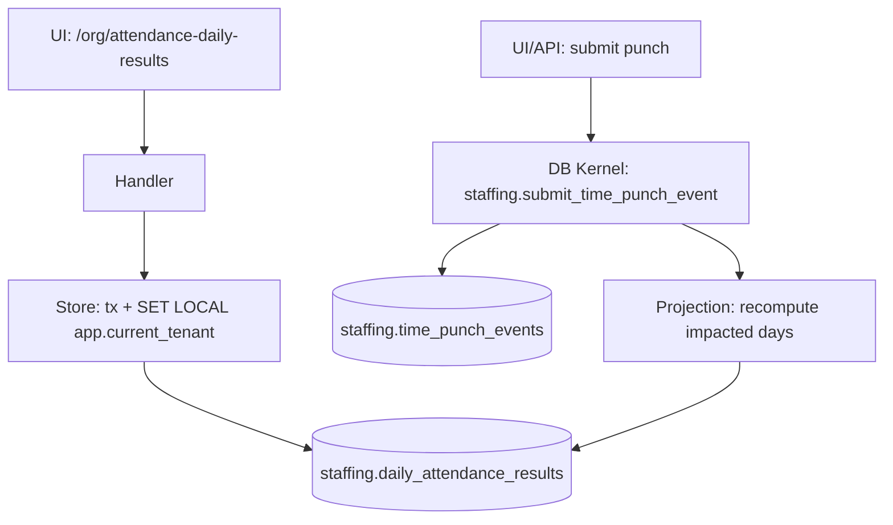

# DEV-PLAN-052：考勤 Slice 4B——日结果计算闭环（标准班次）

**状态**: 草拟中（2026-01-09 05:38 UTC）— 评审决策：Option A（本切片不提供 UI 手工重算入口）

> 目标：按 `docs/dev-plans/001-technical-design-template.md` 补齐到“无需再做设计决策即可开工”的细化程度（Level 4-5）。

## 1. 背景与上下文 (Context)

- **需求来源**：`docs/dev-plans/050-hrms-attendance-blueprint.md`（Slice 4B：日结果读模 + 读模水位线）。
- **上游依赖**：`docs/dev-plans/051-attendance-slice-4a-punch-ledger.md`（打卡事件 SoT：`staffing.time_punch_events` + kernel `staffing.submit_time_punch_event(...)`）。
- **范围定位**：对齐 `docs/dev-plans/009-implementation-roadmap.md` Phase 4 的“业务垂直切片：业务 + UI 同步交付”。
- **模块/落点（选定）**：
  - DB：`staffing` schema（Schema SSOT：`modules/staffing/infrastructure/persistence/schema/*.sql`；迁移：`migrations/staffing/*`）。
  - App：tenant app `/org/*` UI + `/org/api/*` internal API（当前落点：`internal/server/*`，与 positions/assignments/payroll 同构）。
- **业务价值**：把“可重放输入（打卡事件）”同步投射为**按人按日（`date` 粒度）**的权威日结果读模（对齐蓝图 §0.3：读模水位线），使异常可解释、写后读强一致，并为后续 Slice（4C 规则/日历、4D 额度、4E 更正、4F 外部对接）提供稳定输出基座。

## 2. 目标与非目标 (Goals & Non-Goals)

### 2.1 核心目标（Done 的定义）

- [ ] **权威日结果读模**：新增 `staffing.daily_attendance_results`（主键 `tenant_id + person_uuid + work_date`），并记录：
  - `ruleset_version`（规则版本，MVP 固定常量）
  - `input_watermark_*`（输入水位线：本次计算纳入的事件数、最大事件 db id、最大 `punch_time`）
  - `computed_at`（计算时间）
- [ ] **同步投射（写后读强一致）**：在 `staffing.submit_time_punch_event(...)` 同一事务内，重算并 upsert 受影响 `work_date` 的日结果（不引入异步权威写）。
- [ ] **标准班次 v1 最小算法**：固定标准班次参数，完成最小配对（含跨天）与异常标记：
  - 缺勤（本切片定义：在重算窗口内无任何 punches）
  - 漏打卡（缺 IN / 缺 OUT）
  - 迟到/早退（含容差）
- [ ] **UI 可见可解释**：提供 `/org/attendance-daily-results` 列表与 `/org/attendance-daily-results/{person_uuid}/{work_date}` 详情；从读模展示异常原因（flags + 关键字段），并提供跳转到 punches 页的入口。
- [ ] **安全可拒绝**：RLS `ENABLE + FORCE`；`AUTHZ_MODE=enforce` 下未授权 read 必须统一 403 拒绝（对齐 `docs/dev-plans/021-pg-rls-for-org-position-job-catalog.md`、`docs/dev-plans/022-authz-casbin-toolchain.md`）。
- [ ] **可测**：覆盖跨天/漏打卡/多次打卡（连续 IN/连续 OUT）核心用例；并包含 RLS fail-closed 与跨租户隔离负例。

### 2.2 非目标（Out of Scope）

- **Option A（已确认）**：本切片不提供“UI 手工触发范围重算”入口；更正/审计/批量重算等见 `docs/dev-plans/055-attendance-slice-4e-corrections-audit-recalc.md`。
- 不引入可配置 TimeProfile/Shift/HolidayCalendar（见 `docs/dev-plans/053-attendance-slice-4c-time-profile-holiday-calendar.md`）；本切片规则参数固定为常量，并通过 `ruleset_version` 为后续参数化留口。
- 不做加班费率分桶/调休覆盖/法定假日识别（见 `docs/dev-plans/053-attendance-slice-4c-time-profile-holiday-calendar.md`、`docs/dev-plans/054-attendance-slice-4d-time-banking-and-accumulators.md`）。

### 2.3 工具链与门禁（SSOT 引用）

- **触发器清单（本计划命中）**：
  - [X] Go 代码（`go fmt ./... && go vet ./... && make check lint && make test`）
  - [X] DB 迁移 / Schema（Atlas+Goose，`make staffing plan && make staffing lint && make staffing migrate up`）
  - [X] sqlc（`make sqlc-generate`，并确保 `git status --short` 为空）
  - [X] 路由治理（`make check routing`；必要时更新 `config/routing/allowlist.yaml`）
  - [X] Authz（`make authz-pack && make authz-test && make authz-lint`）
  - [ ] E2E（如将本切片纳入 smoke：`make e2e`）

- **SSOT 链接**：
  - 触发器矩阵与红线：`AGENTS.md`
  - CI 门禁：`docs/dev-plans/012-ci-quality-gates.md`
  - RLS：`docs/dev-plans/021-pg-rls-for-org-position-job-catalog.md`
  - 路由：`docs/dev-plans/017-routing-strategy.md`
  - Authz：`docs/dev-plans/022-authz-casbin-toolchain.md`
  - 迁移闭环：`docs/dev-plans/024-atlas-goose-closed-loop-guide.md`
  - 蓝图：`docs/dev-plans/050-hrms-attendance-blueprint.md`

## 3. 架构与关键决策 (Architecture & Decisions)

### 3.1 架构图 (Mermaid)



### 3.2 关键设计决策（ADR 摘要）

- **Valid Time（选定）**：以 `work_date date` 作为业务有效期粒度（对齐 `AGENTS.md` 与 `docs/dev-plans/032-effective-date-day-granularity.md`）。
- **时区语义（选定，MVP）**：
  - `work_date` 归属按 `Asia/Shanghai` 解释（与 Slice 4A 的 punches UI 输入一致）。
  - 后续在 Slice 4C 引入 tenant 时区/TimeProfile 后再替换为主数据。
- **受影响范围（选定）**：一次 punch 写入必重算 2 个日期：`local_date(punch_time)` 与 `local_date(punch_time)-1`，以覆盖跨天 OUT/夜间打卡归属前一工作日的场景。
- **并发一致性（选定）**：对 `(tenant_id, person_uuid, work_date)` 使用 `pg_advisory_xact_lock(int,int)` 做事务级串行化，避免并发写入导致日结果“最后写覆盖”而丢失另一事务的事件。
- **规则版本（选定，MVP）**：`ruleset_version='STANDARD_SHIFT_V1'` 常量；规则参数（开始/结束/容差/窗口）固定在 kernel 计算逻辑中。
- **不提供 UI 手工重算入口（选定，Option A）**：避免形成“第二写入口/权威写”争议；范围重算与更正链路在 `docs/dev-plans/055-attendance-slice-4e-corrections-audit-recalc.md` 统一承接。

## 4. 数据模型与约束 (Data Model & Constraints)

> 红线：新增数据库表/迁移落地前必须获得你手工确认。

### 4.1 Schema 定义（SQL；落地到 `modules/staffing/infrastructure/persistence/schema`）

#### 4.1.1 `staffing.daily_attendance_results`（权威日结果读模）

```sql
CREATE TABLE IF NOT EXISTS staffing.daily_attendance_results (
  tenant_id uuid NOT NULL,
  person_uuid uuid NOT NULL,
  work_date date NOT NULL, -- Valid Time（日粒度）

  -- 规则与状态
  ruleset_version text NOT NULL,
  status text NOT NULL, -- PRESENT/ABSENT/EXCEPTION
  flags text[] NOT NULL DEFAULT '{}'::text[],

  -- 关键结果（UTC 存储）
  first_in_time timestamptz NULL,
  last_out_time timestamptz NULL,
  worked_minutes int NOT NULL DEFAULT 0,
  late_minutes int NOT NULL DEFAULT 0,
  early_leave_minutes int NOT NULL DEFAULT 0,

  -- 输入水位线（用于可重算/一致性验收）
  input_punch_count int NOT NULL DEFAULT 0,
  input_max_punch_event_db_id bigint NULL,
  input_max_punch_time timestamptz NULL,

  computed_at timestamptz NOT NULL DEFAULT now(),
  created_at timestamptz NOT NULL DEFAULT now(),
  updated_at timestamptz NOT NULL DEFAULT now(),

  PRIMARY KEY (tenant_id, person_uuid, work_date),

  CONSTRAINT daily_attendance_results_status_check
    CHECK (status IN ('PRESENT','ABSENT','EXCEPTION')),
  CONSTRAINT daily_attendance_results_minutes_nonneg_check
    CHECK (worked_minutes >= 0 AND late_minutes >= 0 AND early_leave_minutes >= 0),
  CONSTRAINT daily_attendance_results_flags_allowlist_check
    CHECK (flags <@ ARRAY['ABSENT','MISSING_IN','MISSING_OUT','LATE','EARLY_LEAVE']::text[])
);

CREATE INDEX IF NOT EXISTS daily_attendance_results_lookup_idx
  ON staffing.daily_attendance_results (tenant_id, person_uuid, work_date DESC);

ALTER TABLE staffing.daily_attendance_results ENABLE ROW LEVEL SECURITY;
ALTER TABLE staffing.daily_attendance_results FORCE ROW LEVEL SECURITY;
DROP POLICY IF EXISTS tenant_isolation ON staffing.daily_attendance_results;
CREATE POLICY tenant_isolation ON staffing.daily_attendance_results
USING (tenant_id = current_setting('app.current_tenant')::uuid)
WITH CHECK (tenant_id = current_setting('app.current_tenant')::uuid);
```

### 4.2 Kernel：重算与同步投射（SQL；落地到 `modules/staffing/infrastructure/persistence/schema`）

#### 4.2.1 `staffing.recompute_daily_attendance_result(...)`（单日重算）

> 约束：必须在事务内调用，且事务内已注入 `app.current_tenant`；缺失注入应 fail-closed（通过 `staffing.assert_current_tenant`）。

```sql
CREATE OR REPLACE FUNCTION staffing.recompute_daily_attendance_result(
  p_tenant_id uuid,
  p_person_uuid uuid,
  p_work_date date
)
RETURNS void
LANGUAGE plpgsql
AS $$
DECLARE
  v_tz text := 'Asia/Shanghai';
  v_ruleset_version text := 'STANDARD_SHIFT_V1';

  -- 标准班次 v1（固定参数；后续 Slice 4C 参数化）
  v_shift_start_local time := time '09:00';
  v_shift_end_local time := time '18:00';
  v_late_tolerance_min int := 5;
  v_early_tolerance_min int := 5;

  -- 选择 punches 的窗口：用于跨天 OUT 与早到（MVP 固定）
  v_window_before interval := interval '6 hours';
  v_window_after interval := interval '12 hours';

  v_shift_start timestamptz;
  v_shift_end timestamptz;
  v_window_start timestamptz;
  v_window_end timestamptz;

  v_punch_count int := 0;
  v_input_max_id bigint := NULL;
  v_input_max_punch_time timestamptz := NULL;

  v_expect text := 'IN';
  v_open_in_time timestamptz := NULL;

  v_first_in_time timestamptz := NULL;
  v_last_out_time timestamptz := NULL;

  v_worked_minutes int := 0;
  v_late_minutes int := 0;
  v_early_leave_minutes int := 0;

  v_status text := 'ABSENT';
  v_flags text[] := '{}'::text[];

  r record;
  v_delta_min int;
BEGIN
  PERFORM staffing.assert_current_tenant(p_tenant_id);

  IF p_person_uuid IS NULL THEN
    RAISE EXCEPTION USING MESSAGE = 'STAFFING_INVALID_ARGUMENT', DETAIL = 'person_uuid is required';
  END IF;
  IF p_work_date IS NULL THEN
    RAISE EXCEPTION USING MESSAGE = 'STAFFING_INVALID_ARGUMENT', DETAIL = 'work_date is required';
  END IF;

  -- 串行化同一 (tenant,person,work_date) 的重算，避免并发覆盖丢失事件
  PERFORM pg_advisory_xact_lock(
    hashtext(p_tenant_id::text),
    hashtext(p_person_uuid::text || ':' || p_work_date::text)
  );

  v_shift_start := (p_work_date + v_shift_start_local) AT TIME ZONE v_tz;
  v_shift_end := (p_work_date + v_shift_end_local) AT TIME ZONE v_tz;
  v_window_start := v_shift_start - v_window_before;
  v_window_end := v_shift_end + v_window_after;

  FOR r IN
    SELECT id, punch_time, punch_type
    FROM staffing.time_punch_events
    WHERE tenant_id = p_tenant_id
      AND person_uuid = p_person_uuid
      AND punch_time >= v_window_start
      AND punch_time < v_window_end
    ORDER BY punch_time ASC, id ASC
  LOOP
    v_punch_count := v_punch_count + 1;
    v_input_max_id := COALESCE(v_input_max_id, r.id);
    v_input_max_id := GREATEST(v_input_max_id, r.id);
    v_input_max_punch_time := COALESCE(v_input_max_punch_time, r.punch_time);
    v_input_max_punch_time := GREATEST(v_input_max_punch_time, r.punch_time);

    IF r.punch_type = 'IN' THEN
      IF v_expect = 'IN' THEN
        v_open_in_time := r.punch_time;
        v_expect := 'OUT';
        IF v_first_in_time IS NULL THEN
          v_first_in_time := r.punch_time;
        END IF;
      ELSE
        -- 连续 IN：视为上一段缺 OUT，并以最新 IN 作为新的起点
        v_flags := array_append(v_flags, 'MISSING_OUT');
        v_open_in_time := r.punch_time;
        v_expect := 'OUT';
        IF v_first_in_time IS NULL THEN
          v_first_in_time := r.punch_time;
        END IF;
      END IF;
    ELSE
      -- OUT
      IF v_expect = 'OUT' AND v_open_in_time IS NOT NULL THEN
        v_delta_min := floor(extract(epoch FROM (r.punch_time - v_open_in_time)) / 60.0)::int;
        IF v_delta_min > 0 THEN
          v_worked_minutes := v_worked_minutes + v_delta_min;
        END IF;
        v_last_out_time := r.punch_time;
        v_open_in_time := NULL;
        v_expect := 'IN';
      ELSE
        -- 先 OUT：视为缺 IN
        v_flags := array_append(v_flags, 'MISSING_IN');
      END IF;
    END IF;
  END LOOP;

  IF v_punch_count = 0 THEN
    v_status := 'ABSENT';
    v_flags := array_append(v_flags, 'ABSENT');
  ELSE
    IF v_first_in_time IS NULL THEN
      v_flags := array_append(v_flags, 'MISSING_IN');
    END IF;
    IF v_expect = 'OUT' THEN
      v_flags := array_append(v_flags, 'MISSING_OUT');
    END IF;

    -- 迟到：first_in > shift_start + tolerance
    IF v_first_in_time IS NOT NULL THEN
      v_delta_min := floor(extract(epoch FROM (v_first_in_time - v_shift_start)) / 60.0)::int;
      IF v_delta_min > v_late_tolerance_min THEN
        v_late_minutes := v_delta_min - v_late_tolerance_min;
        v_flags := array_append(v_flags, 'LATE');
      END IF;
    END IF;

    -- 早退：last_out < shift_end - tolerance
    IF v_last_out_time IS NOT NULL THEN
      v_delta_min := floor(extract(epoch FROM (v_shift_end - v_last_out_time)) / 60.0)::int;
      IF v_delta_min > v_early_tolerance_min THEN
        v_early_leave_minutes := v_delta_min - v_early_tolerance_min;
        v_flags := array_append(v_flags, 'EARLY_LEAVE');
      END IF;
    END IF;

    -- 状态：任何 flags（除空）都视为 EXCEPTION；否则 PRESENT
    IF array_length(v_flags, 1) IS NULL THEN
      v_status := 'PRESENT';
    ELSE
      -- 去重并排序（保证 flags 稳定输出）
      SELECT COALESCE(array_agg(DISTINCT f ORDER BY f), '{}'::text[]) INTO v_flags
      FROM unnest(v_flags) AS f;

      IF v_flags = ARRAY['ABSENT']::text[] THEN
        v_status := 'ABSENT';
      ELSE
        v_status := 'EXCEPTION';
      END IF;
    END IF;
  END IF;

  INSERT INTO staffing.daily_attendance_results (
    tenant_id,
    person_uuid,
    work_date,
    ruleset_version,
    status,
    flags,
    first_in_time,
    last_out_time,
    worked_minutes,
    late_minutes,
    early_leave_minutes,
    input_punch_count,
    input_max_punch_event_db_id,
    input_max_punch_time,
    computed_at,
    created_at,
    updated_at
  )
  VALUES (
    p_tenant_id,
    p_person_uuid,
    p_work_date,
    v_ruleset_version,
    v_status,
    v_flags,
    v_first_in_time,
    v_last_out_time,
    v_worked_minutes,
    v_late_minutes,
    v_early_leave_minutes,
    v_punch_count,
    v_input_max_id,
    v_input_max_punch_time,
    now(),
    now(),
    now()
  )
  ON CONFLICT (tenant_id, person_uuid, work_date)
  DO UPDATE SET
    ruleset_version = EXCLUDED.ruleset_version,
    status = EXCLUDED.status,
    flags = EXCLUDED.flags,
    first_in_time = EXCLUDED.first_in_time,
    last_out_time = EXCLUDED.last_out_time,
    worked_minutes = EXCLUDED.worked_minutes,
    late_minutes = EXCLUDED.late_minutes,
    early_leave_minutes = EXCLUDED.early_leave_minutes,
    input_punch_count = EXCLUDED.input_punch_count,
    input_max_punch_event_db_id = EXCLUDED.input_max_punch_event_db_id,
    input_max_punch_time = EXCLUDED.input_max_punch_time,
    computed_at = EXCLUDED.computed_at,
    updated_at = EXCLUDED.updated_at;
END;
$$;
```

#### 4.2.2 `staffing.recompute_daily_attendance_results_for_punch(...)`（受影响范围）

```sql
CREATE OR REPLACE FUNCTION staffing.recompute_daily_attendance_results_for_punch(
  p_tenant_id uuid,
  p_person_uuid uuid,
  p_punch_time timestamptz
)
RETURNS void
LANGUAGE plpgsql
AS $$
DECLARE
  v_tz text := 'Asia/Shanghai';
  v_local_date date;
  v_d1 date;
  v_d2 date;
BEGIN
  PERFORM staffing.assert_current_tenant(p_tenant_id);
  IF p_person_uuid IS NULL THEN
    RAISE EXCEPTION USING MESSAGE = 'STAFFING_INVALID_ARGUMENT', DETAIL = 'person_uuid is required';
  END IF;
  IF p_punch_time IS NULL THEN
    RAISE EXCEPTION USING MESSAGE = 'STAFFING_INVALID_ARGUMENT', DETAIL = 'punch_time is required';
  END IF;

  v_local_date := (p_punch_time AT TIME ZONE v_tz)::date;
  v_d1 := v_local_date - 1;
  v_d2 := v_local_date;

  -- 固定顺序避免死锁
  PERFORM staffing.recompute_daily_attendance_result(p_tenant_id, p_person_uuid, v_d1);
  PERFORM staffing.recompute_daily_attendance_result(p_tenant_id, p_person_uuid, v_d2);
END;
$$;
```

#### 4.2.3 修改 `staffing.submit_time_punch_event(...)`：同事务同步投射

> 变更点：INSERT 成功后调用 `staffing.recompute_daily_attendance_results_for_punch(...)`；幂等重放（event 已存在）直接返回 existing id，不触发重算。

```sql
-- 在原函数末尾插入以下逻辑（保持其余 idempotency 校验不变）：
PERFORM staffing.recompute_daily_attendance_results_for_punch(p_tenant_id, p_person_uuid, p_punch_time);
RETURN v_event_db_id;
```

### 4.3 迁移策略（Atlas+Goose；按 `docs/dev-plans/024-atlas-goose-closed-loop-guide.md`）

- **Up（预期）**：
  1. 创建表 `staffing.daily_attendance_results` + 索引 + RLS policy；
  2. 创建函数 `staffing.recompute_daily_attendance_result`、`staffing.recompute_daily_attendance_results_for_punch`；
  3. `CREATE OR REPLACE` 更新 `staffing.submit_time_punch_event`（新增同步投射调用）。
- **Down（预期）**：
  - 回滚函数与表（生产通常不执行破坏性 down；仅用于本地/测试环境）。
- **历史数据回填（非本切片验收项）**：
  - 若本切片上线前已存在 punches，需要回填日结果：用一次性脚本循环调用 `staffing.recompute_daily_attendance_result(...)`（或在 4E 更正切片统一提供批量重算能力）。

## 5. 接口契约 (API Contracts)

### 5.1 UI：`GET /org/attendance-daily-results`（route_class=ui）

- **GET 查询参数**：
  - `as_of`：沿用 shell 顶栏（缺省当天 UTC date）。
  - `person_uuid`：Optional（空则提示选择人员；有值则展示结果列表）。
  - `from_date` / `to_date`：Optional（`YYYY-MM-DD`；按北京时间解释；闭区间；缺省为 `as_of` 单日）。
- **响应（200 HTML）**：
  - 含 Query form（person selector + from/to date）。
  - 列表列：`work_date`、`status`、`flags`、`worked_minutes`、`late_minutes`、`early_leave_minutes`、`computed_at`。
  - 每行提供详情链接：`/org/attendance-daily-results/{person_uuid}/{work_date}?as_of=...`。

### 5.2 UI：`GET /org/attendance-daily-results/{person_uuid}/{work_date}`（route_class=ui）

- **Path 参数**：
  - `person_uuid`：uuid
  - `work_date`：`YYYY-MM-DD`
- **页面内容（最小集合）**：
  - 字段：`status/flags/first_in_time/last_out_time/worked_minutes/late_minutes/early_leave_minutes/ruleset_version/computed_at/input_punch_count/input_max_punch_event_db_id/input_max_punch_time`
  - “查看 punches”链接：跳转 `/org/attendance-punches?as_of={as_of}&person_uuid=...&from_date=work_date&to_date=work_date`

### 5.3 Internal API：`GET /org/api/attendance-daily-results`（route_class=internal_api）

> 用途：E2E/自动化验收与调试；不作为公共 API 承诺。

- **查询参数**：
  - `person_uuid`（Required，uuid）
  - `from_date` / `to_date`（Optional，`YYYY-MM-DD`，闭区间；缺省为当天 UTC date）
  - `limit`（Optional，int，默认 200，最大 1000）
- **响应（200）**：
  ```json
  {
    "tenant": "uuid",
    "person_uuid": "uuid",
    "from_date": "2026-01-01",
    "to_date": "2026-01-07",
    "results": [
      {
        "work_date": "2026-01-01",
        "status": "EXCEPTION",
        "flags": ["LATE","MISSING_OUT"],
        "first_in_time": "2026-01-01T01:05:00Z",
        "last_out_time": null,
        "worked_minutes": 0,
        "late_minutes": 10,
        "early_leave_minutes": 0,
        "ruleset_version": "STANDARD_SHIFT_V1",
        "computed_at": "2026-01-01T02:00:00Z",
        "input_punch_count": 1,
        "input_max_punch_event_db_id": 123,
        "input_max_punch_time": "2026-01-01T01:05:00Z"
      }
    ]
  }
  ```

## 6. 核心逻辑与算法 (Business Logic & Algorithms)

### 6.1 同步投射（提交 punch 时）

1. Go 侧开启事务并注入 `app.current_tenant`（对齐 Slice 4A store：显式 tx + `set_config(..., true)`）。
2. 调用 `staffing.submit_time_punch_event(...)` 写入事件 SoT（append-only）。
3. DB 内部在同一事务中调用 `staffing.recompute_daily_attendance_results_for_punch(...)`：
   - `work_date = local_date(punch_time, Asia/Shanghai)`
   - 重算 `work_date-1` 与 `work_date`
4. 事务提交后，UI/内部 API 读取 `staffing.daily_attendance_results` 即为最新（写后读强一致）。

### 6.2 标准班次 v1 算法（以 §4.2.1 为准）

- 固定参数：
  - `tz='Asia/Shanghai'`
  - `shift_start_local=09:00`、`shift_end_local=18:00`
  - 容差：`late=5min`、`early=5min`
  - punches 选择窗口：`[shift_start-6h, shift_end+12h)`
- 配对：按 `punch_time ASC, id ASC` 扫描，IN→OUT 形成区间；连续 IN 视为缺 OUT 并以最新 IN 作为新起点；先 OUT 视为缺 IN。
- worked_minutes：对每个配对区间累加分钟差（向下取整；负值忽略）。
- flags/status：
  - `punch_count=0` → `status=ABSENT` + `flags=['ABSENT']`
  - 否则：根据缺 IN/OUT、迟到、早退填充 flags；`status=EXCEPTION`（若 flags 非空），否则 `status=PRESENT`

## 7. 安全与鉴权 (Security & Authz)

### 7.1 RLS（强租户隔离）

- `staffing.daily_attendance_results` 启用 `ENABLE + FORCE` + `tenant_isolation` policy（见 §4.1）。
- Go 侧所有查询必须在事务内注入 `app.current_tenant`；缺失注入应 fail-closed（对齐 `docs/dev-plans/021-pg-rls-for-org-position-job-catalog.md`）。

### 7.2 Authz（Casbin）

- **object（新增）**：`staffing.attendance-daily-results`
- **action（本切片）**：仅 `read`（所有 GET 路由）
- **路由映射（必须落在 authz middleware）**：
  - `/org/attendance-daily-results`：GET->read
  - `/org/attendance-daily-results/{person_uuid}/{work_date}`：GET->read
  - `/org/api/attendance-daily-results`：GET->read
- **policy（bootstrap 期）**：为 `role:tenant-admin` 添加 `staffing.attendance-daily-results` 的 `read` 允许项（按 `docs/dev-plans/022-authz-casbin-toolchain.md` 的 pack/lint/test 门禁闭环）。

## 8. 依赖与里程碑 (Dependencies & Milestones)

### 8.1 依赖

- 打卡 SoT 已就绪：`staffing.time_punch_events` + `staffing.submit_time_punch_event`（Slice 4A）。
- Tenancy/AuthN/RLS/Authz 基础设施已就绪：`AGENTS.md` + `docs/dev-plans/019-tenant-and-authn.md`、`docs/dev-plans/021-pg-rls-for-org-position-job-catalog.md`、`docs/dev-plans/022-authz-casbin-toolchain.md`。
- 人员选择依赖 person list：`PersonStore.ListPersons`（现有）。

### 8.2 里程碑（可直接开工的拆解）

1. [x] 路由：新增 `/org/attendance-daily-results`、`/org/attendance-daily-results/{person_uuid}/{work_date}`、`/org/api/attendance-daily-results`，并更新 `config/routing/allowlist.yaml`（`route_class` 为 `ui`/`internal_api`）。（PR #110）
2. [x] Authz：在 `pkg/authz/registry.go` 增加 `ObjectStaffingAttendanceDailyResults`；在 `internal/server/authz_middleware.go` 加入路由映射；更新 `config/access/policies/00-bootstrap.csv` 并跑 authz 门禁。（PR #112）
3. [x] DB：按 §4.1/§4.2 落地表 + kernel（新增表/迁移前需手工确认）；跑 `make staffing plan && make staffing lint && make staffing migrate up` 闭环。（PR #113）
4. [x] sqlc：运行 `make sqlc-generate`（会更新 `internal/sqlc/schema.sql` 等生成物），并确保 `git status --short` 为空。（PR #115）
5. [ ] Go：实现日结果 store（建议复用 `internal/server/attendance.go`：显式事务 + tenant 注入 + 查询读模）；实现 handlers（建议复用 `internal/server/attendance_handlers.go`：UI list/detail + internal API GET）；把入口挂到 `internal/server/handler.go` 的 router 与 nav，并补齐 i18n 文案（en/zh）。
6. [ ] 测试：补齐本计划覆盖（见 §9）。
7. [ ]（可选）E2E：扩展 `e2e/tests/m3-smoke.spec.js` 覆盖“补卡 → 日结果可见/可解释”的最小链路。
8. [ ] 证据：按 `docs/dev-records/` 口径登记关键门禁执行记录（时间戳/命令/结论）。

## 9. 测试与验收标准 (Acceptance Criteria)

### 9.1 验收清单

- [ ] 端到端：手工补卡（IN/OUT）→ 对应 `work_date` 的日结果列表可见；点开详情可解释（flags + 关键字段）。
- [ ] 一致性：写后读强一致（事务提交后刷新页面即为最新）。
- [ ] 可重算：同日再次补打卡后，读模被覆盖更新，且 `computed_at` 更新。
- [ ] 安全：RLS/Authz/路由门禁全绿；`AUTHZ_MODE=enforce` 下未授权请求被 403 拒绝。

### 9.2 建议的测试用例（落点建议）

- `internal/server/authz_middleware_test.go`：覆盖新路由映射（list/detail/internal API）。
- `internal/server/handler_test.go`：覆盖 `/org/attendance-daily-results` GET 200、detail GET 200、internal API GET 200。
- DB 行为（建议用 e2e 或模块级集成测试实现）：
  - 跨天：`work_date=D` 的 OUT 在 `D+1 02:00 +08:00`，仍应计入 `D` 的 last_out（通过“重算 D 与 D-1”覆盖）。
  - 漏打卡：仅 IN / 仅 OUT / 连续 IN / 连续 OUT 的 flags 与 status 符合预期。
  - 迟到/早退：容差 5 分钟边界（=5 不算；>5 才计入 minutes）。
  - fail-closed：不注入 tenant 时读取/写入 `staffing.daily_attendance_results` 应失败（`current_setting('app.current_tenant')` 缺失）。

## 10. 运维与监控 (Ops & Monitoring)

- 不引入额外运维组件（对齐 `AGENTS.md` §3.6）。
- 最小日志字段（建议）：`request_id`、`tenant_id`、`principal_id`、`person_uuid`、`work_date`、`status`、`flags`、`ruleset_version`、`computed_at`。

## 11. 开放问题

- [ ] punches 选择窗口（`6h/12h`）的业务口径与失败模式：窗口外的补打卡是否视为本切片非目标，或需要在 4E 更正切片引入“扩窗 + 批量重算”。
- [ ] worked_minutes 的口径：是否需要夹到 shift 内、是否允许跨午休拆分（本切片先不做；在 4C TimeProfile 参数化后收敛）。
