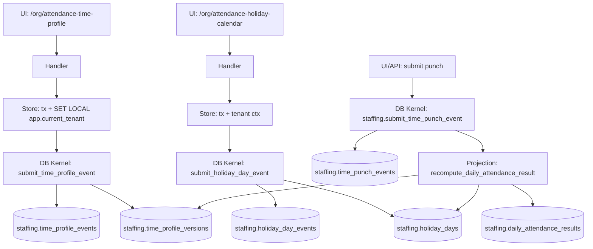

# DEV-PLAN-053：考勤 Slice 4C——主数据与合规闭环（TimeProfile（含班次）/HolidayCalendar（按日覆盖））

**状态**: 草拟中（2026-01-09 08:20 UTC）— 收敛：租户默认 TimeProfile、固定 `Asia/Shanghai`、不做按人绑定与配置 internal API

> 目标：按 `docs/dev-plans/001-technical-design-template.md` 补齐到“无需再做设计决策即可开工”的细化程度（Level 4-5）。

## 1. 背景与上下文 (Context)

- **需求来源**：`docs/dev-plans/050-hrms-attendance-blueprint.md`（Slice 4C：规则/日历主数据化 + 合规可解释）。
- **上游依赖**：
  - `docs/dev-plans/051-attendance-slice-4a-punch-ledger.md`（输入 SoT：`staffing.time_punch_events` + kernel `staffing.submit_time_punch_event(...)`）。
  - `docs/dev-plans/052-attendance-slice-4b-daily-results-standard-shift.md`（日结果读模 + 同事务重算投射）。
- **范围定位**：对齐 `docs/dev-plans/009-implementation-roadmap.md` Phase 4 的“业务垂直切片：业务 + UI 同步交付”。
- **模块/落点（选定）**：
  - DB：`staffing` schema（Schema SSOT：`modules/staffing/infrastructure/persistence/schema/*.sql`；迁移：`migrations/staffing/*`）。
  - App：tenant app `/org/*` UI（本切片仅新增 UI 配置页；不新增配置 internal API），代码落点：`internal/server/*`。
- **业务价值**：
  - 把 `DEV-PLAN-052` 的“固定标准班次常量”收敛为**租户级主数据**（TimeProfile + HolidayCalendar day overrides），使日结果可追溯、可解释、可重算；
  - 引入合规最小集合：调休覆盖、法定假日识别、加班分桶（1.5/2.0/3.0）；
  - 为下游 `docs/dev-plans/054-attendance-slice-4d-time-banking-and-accumulators.md` 与 `docs/dev-plans/055-attendance-slice-4e-corrections-audit-recalc.md` 提供稳定的“规则与日历 SSOT”。

## 2. 目标与非目标 (Goals & Non-Goals)

### 2.1 核心目标（Done 的定义）

- [ ] **主数据可配置（effective-dated，`date` 粒度）**：
  - **租户默认 TimeProfile**：CREATE/UPDATE（按 `effective_date date` 事件驱动）。
  - **HolidayCalendar 覆盖项（按日）**：SET/CLEAR（按 `day_date date` 事件驱动；只存覆盖项）。
- [ ] **One Door**：所有主数据写入必须走 DB Kernel `staffing.submit_*_event(...)`；应用层禁止直写 `*_events`/`*_versions`/读模表。
- [ ] **合规规则（最小集合）**：
  - 调休覆盖：周末可被标记为 `WORKDAY`，工作日可被标记为 `RESTDAY`；
  - 法定假日：`LEGAL_HOLIDAY`；
  - 加班分桶（分钟口径，整数）：`OT_150/OT_200/OT_300` 三个桶。
- [ ] **日结果可解释**：在 `staffing.daily_attendance_results`（`DEV-PLAN-052`）基础上增量扩展字段，使 UI 能解释：
  - `day_type`（WORKDAY/RESTDAY/LEGAL_HOLIDAY）；
  - `scheduled_minutes`（班次跨度分钟）；
  - `overtime_minutes_150/200/300`；
  - `time_profile_last_event_id`、`holiday_day_last_event_id`（结构化追溯锚点）。
  同时将 `ruleset_version` 固定为 `TIME_PROFILE_V1`（语义版本），避免用拼接字符串承载结构化事实。
- [ ] **UI 可见可操作**：
  - `/org/attendance-time-profile`：配置租户默认 TimeProfile（effective-dated）。
  - `/org/attendance-holiday-calendar`：配置 HolidayCalendar 日覆盖项（按月视图 + 单日编辑 + CSV 粘贴导入）。
  - 能通过“设置调休/法定假日 → 补打一对 punches → 观察日结果 OT 分桶变化”的链路完成验收。
- [ ] **安全可拒绝**：RLS `ENABLE + FORCE`；`AUTHZ_MODE=enforce` 下未授权读/写必须统一 403（对齐 `docs/dev-plans/021-pg-rls-for-org-position-job-catalog.md`、`docs/dev-plans/022-authz-casbin-toolchain.md`）。

### 2.2 非目标（Out of Scope）

- 不实现审批流（加班申请/补休选择权/申诉/签核）与复杂工作流。
- 不实现按人/按组织/按岗位绑定 TimeProfile（本切片只有“租户默认 TimeProfile”，避免引入 precedence/回退规则）。
- 不提供配置 internal API（不新增 `/org/api/attendance-time-profile`、`/org/api/attendance-holiday-calendar`）。
- 不实现午休/休息扣除（没有明确的休息窗口与 punches 语义时，自动扣除会不可解释；若需要另立 dev-plan）。
- 不实现“按排班生成应出勤计划/自动缺勤”与全量历史 backfill；本切片的日结果仍由 punches 驱动。
- 不做跨日拆分加班桶（夜班跨天时按 `work_date` 口径归集；若要按自然日拆分需另立 dev-plan）。
- 不引入通用规则引擎/表达式解释器/脚本（若确需必须另立 dev-plan，且通过 Simple > Easy 评审）。

## 2.3 工具链与门禁（SSOT 引用）

- **触发器清单（本计划命中）**：
  - [X] Go 代码（`go fmt ./... && go vet ./... && make check lint && make test`）
  - [X] DB 迁移 / Schema（Atlas+Goose，`make staffing plan && make staffing lint && make staffing migrate up`）
  - [X] sqlc（`make sqlc-generate`；改 schema SSOT 必须确保 sqlc 可解析，且生成后 `git status --short` 为空）
  - [X] 路由治理（`make check routing`；必要时更新 `config/routing/allowlist.yaml`）
  - [X] Authz（`make authz-pack && make authz-test && make authz-lint`）
  - [ ] E2E（如将本切片纳入 smoke：`make e2e`）

- **SSOT 链接**：
  - 触发器矩阵与红线：`AGENTS.md`
  - CI 门禁：`docs/dev-plans/012-ci-quality-gates.md`
  - 有效期口径：`docs/dev-plans/032-effective-date-day-granularity.md`
  - RLS：`docs/dev-plans/021-pg-rls-for-org-position-job-catalog.md`
  - 路由：`docs/dev-plans/017-routing-strategy.md`
  - Authz：`docs/dev-plans/022-authz-casbin-toolchain.md`
  - 迁移闭环：`docs/dev-plans/024-atlas-goose-closed-loop-guide.md`
  - sqlc：`docs/dev-plans/025-sqlc-guidelines.md`
  - 上游切片：`docs/dev-plans/052-attendance-slice-4b-daily-results-standard-shift.md`

## 3. 架构与关键决策 (Architecture & Decisions)

### 3.1 架构图 (Mermaid)



### 3.2 关键设计决策（ADR 摘要）

- **Valid Time（日粒度，选定）**：TimeProfile 的变更以 `effective_date date` 事件驱动，并投射为 `validity daterange`（`[)`）版本；HolidayCalendar 覆盖项以 `day_date date` 存储（对齐 `docs/dev-plans/032-effective-date-day-granularity.md`）。
- **时区语义（选定，MVP 固定）**：
  - 固定使用 IANA 时区标识符 `Asia/Shanghai` 解释 `work_date` 的本地日界与 shift 的本地时间。
  - 原因：IANA tzdb 中不存在 `Asia/Beijing`，Go/PG 跨环境不保证可用；`Asia/Shanghai` 在实践中稳定代表中国标准时间（UTC+8），且仓库现有代码也使用该口径（`internal/server/attendance_handlers.go` 的 `shanghaiLocation()`）。
- **TimeProfile 作用域（选定）**：每租户只有 1 条“默认 TimeProfile 时间线”（gapless、no-overlap）；不做按人/人群绑定，避免 precedence/回退通道。
- **HolidayCalendar 形态（选定）**：只保存“覆盖项”（调休/法定假日/特殊休息日）；未覆盖日期按星期 baseline 推断（weekday=WORKDAY, weekend=RESTDAY）；覆盖项以事件 SoT + 读模（`holiday_day_events` + `holiday_days`）表达，并提供 CLEAR 以移除覆盖项。
- **加班倍率（选定，MVP 固定）**：由 `day_type` 决定倍率：
  - WORKDAY → 1.5（`OT_150`）
  - RESTDAY → 2.0（`OT_200`）
  - LEGAL_HOLIDAY → 3.0（`OT_300`）
  倍率本身不做可配置（避免引入隐式法条变体）；可配置项仅限 TimeProfile 的“阈值/取整”。
- **口径统一（选定）**：日结果与加班桶一律存 **分钟 int**，不存小时小数（避免精度漂移）。
- **OFF 语义（选定）**：引入 `status=OFF` 表示“非工作日且无 punches”；`ABSENT` 仅在 `day_type=WORKDAY` 且无 punches 时成立，避免周末/法定假日被展示为缺勤。
- **追溯锚点（选定）**：把 `time_profile_last_event_id`、`holiday_day_last_event_id` 落在日结果读模里作为结构化追溯点；`ruleset_version` 仅承载语义版本（固定 `TIME_PROFILE_V1`）。
- **写后读强一致（沿用 052）**：本切片不引入异步权威写；规则/日历变更对已存在的日结果不做全量回填，验收通过“新增 punch 触发重算”观察结果变化；批量回填与审计重算由 `DEV-PLAN-055` 承担。

## 4. 数据模型与约束 (Data Model & Constraints)

> 红线：新增数据库表（`CREATE TABLE`）与对应迁移落地前，必须获得你手工确认（`AGENTS.md` §3.2）。

### 4.1 Schema 定义（SQL；落地到 `modules/staffing/infrastructure/persistence/schema/*.sql`）

#### 4.1.0 新增表清单（需手工确认）

- `staffing.time_profile_events`
- `staffing.time_profile_versions`
- `staffing.holiday_day_events`
- `staffing.holiday_days`

**建表批准记录（落迁移前必须完成）**
- [ ] 已批准新增以上 4 张表（批准人：；时间：；证据：PR/评论链接）

#### 4.1.1 `staffing.time_profile_events` / `staffing.time_profile_versions`（租户默认 TimeProfile）

```sql
CREATE TABLE IF NOT EXISTS staffing.time_profile_events (
  id bigserial PRIMARY KEY,
  event_id uuid NOT NULL DEFAULT gen_random_uuid(),
  tenant_id uuid NOT NULL,
  event_type text NOT NULL,
  effective_date date NOT NULL,
  payload jsonb NOT NULL DEFAULT '{}'::jsonb,
  request_id text NOT NULL,
  initiator_id uuid NOT NULL,
  transaction_time timestamptz NOT NULL DEFAULT now(),
  created_at timestamptz NOT NULL DEFAULT now(),
  CONSTRAINT time_profile_events_event_type_check CHECK (event_type IN ('CREATE','UPDATE')),
  CONSTRAINT time_profile_events_payload_is_object_check CHECK (jsonb_typeof(payload) = 'object'),
  CONSTRAINT time_profile_events_event_id_unique UNIQUE (event_id),
  CONSTRAINT time_profile_events_one_per_day_unique UNIQUE (tenant_id, effective_date),
  CONSTRAINT time_profile_events_request_id_unique UNIQUE (tenant_id, request_id)
);

CREATE INDEX IF NOT EXISTS time_profile_events_lookup_idx
  ON staffing.time_profile_events (tenant_id, effective_date, id);

CREATE TABLE IF NOT EXISTS staffing.time_profile_versions (
  id bigserial PRIMARY KEY,
  tenant_id uuid NOT NULL,
  name text NULL,
  lifecycle_status text NOT NULL DEFAULT 'active',

  shift_start_local time NOT NULL,
  shift_end_local time NOT NULL,
  late_tolerance_minutes int NOT NULL DEFAULT 0,
  early_leave_tolerance_minutes int NOT NULL DEFAULT 0,

  overtime_min_minutes int NOT NULL DEFAULT 0,
  overtime_rounding_mode text NOT NULL DEFAULT 'NONE',
  overtime_rounding_unit_minutes int NOT NULL DEFAULT 0,

  validity daterange NOT NULL,
  last_event_id bigint NOT NULL REFERENCES staffing.time_profile_events(id),

  CONSTRAINT time_profile_versions_validity_check CHECK (NOT isempty(validity)),
  CONSTRAINT time_profile_versions_validity_bounds_check CHECK (lower_inc(validity) AND NOT upper_inc(validity)),
  CONSTRAINT time_profile_versions_lifecycle_status_check CHECK (lifecycle_status IN ('active','disabled')),
  CONSTRAINT time_profile_versions_shift_time_order_check CHECK (shift_end_local > shift_start_local),
  CONSTRAINT time_profile_versions_tolerance_minutes_check CHECK (late_tolerance_minutes >= 0 AND early_leave_tolerance_minutes >= 0),
  CONSTRAINT time_profile_versions_overtime_min_check CHECK (overtime_min_minutes >= 0),
  CONSTRAINT time_profile_versions_overtime_rounding_mode_check CHECK (overtime_rounding_mode IN ('NONE','FLOOR','CEIL','NEAREST')),
  CONSTRAINT time_profile_versions_overtime_rounding_unit_check CHECK (overtime_rounding_unit_minutes >= 0),
  CONSTRAINT time_profile_versions_no_overlap
    EXCLUDE USING gist (
      tenant_id gist_uuid_ops WITH =,
      validity WITH &&
    )
);

CREATE INDEX IF NOT EXISTS time_profile_versions_lookup_idx
  ON staffing.time_profile_versions (tenant_id, lower(validity));

ALTER TABLE staffing.time_profile_events ENABLE ROW LEVEL SECURITY;
ALTER TABLE staffing.time_profile_events FORCE ROW LEVEL SECURITY;
DROP POLICY IF EXISTS tenant_isolation ON staffing.time_profile_events;
CREATE POLICY tenant_isolation ON staffing.time_profile_events
USING (tenant_id = current_setting('app.current_tenant')::uuid)
WITH CHECK (tenant_id = current_setting('app.current_tenant')::uuid);

ALTER TABLE staffing.time_profile_versions ENABLE ROW LEVEL SECURITY;
ALTER TABLE staffing.time_profile_versions FORCE ROW LEVEL SECURITY;
DROP POLICY IF EXISTS tenant_isolation ON staffing.time_profile_versions;
CREATE POLICY tenant_isolation ON staffing.time_profile_versions
USING (tenant_id = current_setting('app.current_tenant')::uuid)
WITH CHECK (tenant_id = current_setting('app.current_tenant')::uuid);
```

**payload 合同（TimeProfile）**：
- CREATE 必填：
  - `shift_start_local`（`HH:MM`）
  - `shift_end_local`（`HH:MM`，且必须大于 `shift_start_local`；MVP 不做跨天班次）
- CREATE/UPDATE 可选：
  - `name`（text）
  - `lifecycle_status`（active/disabled）
  - `late_tolerance_minutes`、`early_leave_tolerance_minutes`（int，缺省 0）
  - `overtime_min_minutes`（int，缺省 0）
  - `overtime_rounding_mode`（NONE/FLOOR/CEIL/NEAREST；缺省 NONE）
  - `overtime_rounding_unit_minutes`（int，缺省 0 表示不取整）
- UPDATE：允许任意子集；未出现字段表示“保持不变”。

#### 4.1.2 `staffing.holiday_day_events` / `staffing.holiday_days`（HolidayCalendar：按日覆盖项）

```sql
CREATE TABLE IF NOT EXISTS staffing.holiday_day_events (
  id bigserial PRIMARY KEY,
  event_id uuid NOT NULL DEFAULT gen_random_uuid(),
  tenant_id uuid NOT NULL,
  day_date date NOT NULL,
  event_type text NOT NULL,
  payload jsonb NOT NULL DEFAULT '{}'::jsonb,
  request_id text NOT NULL,
  initiator_id uuid NOT NULL,
  transaction_time timestamptz NOT NULL DEFAULT now(),
  created_at timestamptz NOT NULL DEFAULT now(),
  CONSTRAINT holiday_day_events_event_type_check CHECK (event_type IN ('SET','CLEAR')),
  CONSTRAINT holiday_day_events_payload_is_object_check CHECK (jsonb_typeof(payload) = 'object'),
  CONSTRAINT holiday_day_events_event_id_unique UNIQUE (event_id),
  CONSTRAINT holiday_day_events_request_id_unique UNIQUE (tenant_id, request_id)
);

CREATE INDEX IF NOT EXISTS holiday_day_events_lookup_idx
  ON staffing.holiday_day_events (tenant_id, day_date, id);

CREATE TABLE IF NOT EXISTS staffing.holiday_days (
  tenant_id uuid NOT NULL,
  day_date date NOT NULL,
  day_type text NOT NULL,
  holiday_code text NULL,
  note text NULL,
  last_event_id bigint NOT NULL REFERENCES staffing.holiday_day_events(id),
  created_at timestamptz NOT NULL DEFAULT now(),
  updated_at timestamptz NOT NULL DEFAULT now(),
  PRIMARY KEY (tenant_id, day_date),
  CONSTRAINT holiday_days_day_type_check CHECK (day_type IN ('WORKDAY','RESTDAY','LEGAL_HOLIDAY'))
);

CREATE INDEX IF NOT EXISTS holiday_days_lookup_idx
  ON staffing.holiday_days (tenant_id, day_date DESC);

ALTER TABLE staffing.holiday_day_events ENABLE ROW LEVEL SECURITY;
ALTER TABLE staffing.holiday_day_events FORCE ROW LEVEL SECURITY;
DROP POLICY IF EXISTS tenant_isolation ON staffing.holiday_day_events;
CREATE POLICY tenant_isolation ON staffing.holiday_day_events
USING (tenant_id = current_setting('app.current_tenant')::uuid)
WITH CHECK (tenant_id = current_setting('app.current_tenant')::uuid);

ALTER TABLE staffing.holiday_days ENABLE ROW LEVEL SECURITY;
ALTER TABLE staffing.holiday_days FORCE ROW LEVEL SECURITY;
DROP POLICY IF EXISTS tenant_isolation ON staffing.holiday_days;
CREATE POLICY tenant_isolation ON staffing.holiday_days
USING (tenant_id = current_setting('app.current_tenant')::uuid)
WITH CHECK (tenant_id = current_setting('app.current_tenant')::uuid);
```

**payload 合同（Holiday 覆盖项）**：
- SET 必填：
  - `day_type`（WORKDAY/RESTDAY/LEGAL_HOLIDAY）
- SET 可选：
  - `holiday_code`（仅在 LEGAL_HOLIDAY 时建议填写；不做强校验）
  - `note`
- CLEAR：payload 可为空对象 `{}`；语义为“移除覆盖项，回到 baseline 推断”。

#### 4.1.3 `staffing.daily_attendance_results`（对 `DEV-PLAN-052` 的增量扩展）

> 本节只声明 4C 的增量字段；基表与核心字段定义以 `docs/dev-plans/052-attendance-slice-4b-daily-results-standard-shift.md` 为准。

```sql
ALTER TABLE staffing.daily_attendance_results
  ADD COLUMN IF NOT EXISTS day_type text NULL,
  ADD COLUMN IF NOT EXISTS scheduled_minutes int NOT NULL DEFAULT 0,
  ADD COLUMN IF NOT EXISTS overtime_minutes_150 int NOT NULL DEFAULT 0,
  ADD COLUMN IF NOT EXISTS overtime_minutes_200 int NOT NULL DEFAULT 0,
  ADD COLUMN IF NOT EXISTS overtime_minutes_300 int NOT NULL DEFAULT 0,
  ADD COLUMN IF NOT EXISTS time_profile_last_event_id bigint NULL,
  ADD COLUMN IF NOT EXISTS holiday_day_last_event_id bigint NULL;

ALTER TABLE staffing.daily_attendance_results
  DROP CONSTRAINT IF EXISTS daily_attendance_results_status_check,
  DROP CONSTRAINT IF EXISTS daily_attendance_results_day_type_check,
  DROP CONSTRAINT IF EXISTS daily_attendance_results_overtime_nonneg_check;

ALTER TABLE staffing.daily_attendance_results
  ADD CONSTRAINT daily_attendance_results_status_check
    CHECK (status IN ('PRESENT','ABSENT','EXCEPTION','OFF')),
  ADD CONSTRAINT daily_attendance_results_day_type_check
    CHECK (day_type IS NULL OR day_type IN ('WORKDAY','RESTDAY','LEGAL_HOLIDAY')),
  ADD CONSTRAINT daily_attendance_results_overtime_nonneg_check
    CHECK (scheduled_minutes >= 0 AND overtime_minutes_150 >= 0 AND overtime_minutes_200 >= 0 AND overtime_minutes_300 >= 0);
```

### 4.2 Kernel：写入口与投射（SQL；落地到 `modules/staffing/infrastructure/persistence/schema/*.sql`）

#### 4.2.1 TimeProfile：replay + submit

```sql
CREATE OR REPLACE FUNCTION staffing.replay_time_profile_versions(p_tenant_id uuid)
RETURNS void
LANGUAGE plpgsql
AS $$ ... $$;

CREATE OR REPLACE FUNCTION staffing.submit_time_profile_event(
  p_event_id uuid,
  p_tenant_id uuid,
  p_event_type text,
  p_effective_date date,
  p_payload jsonb,
  p_request_id text,
  p_initiator_id uuid
)
RETURNS bigint
LANGUAGE plpgsql
AS $$ ... $$;
```

实现要点（同构 `staffing.submit_position_event` / `staffing.replay_position_versions`）：
- **fail-closed**：`PERFORM staffing.assert_current_tenant(p_tenant_id)`；
- **并发串行化**：`pg_advisory_xact_lock(hashtextextended('staffing:time-profile:'||p_tenant_id::text,0))`；
- **replay 合同**：
  - events 按 `effective_date ASC, id ASC` 排序；
  - `CREATE` 必须为第一条事件；
  - validity：`[effective_date, next_effective)`，最后一条 `upper_inf(validity)=true`；
  - 必须 gapless（相邻版本 `lower(validity) == upper(prev_validity)`）；
  - 必须 no-overlap（由 EXCLUDE 约束兜底）。

#### 4.2.2 Holiday 覆盖项：submit（事件 SoT + 覆盖项读模）

```sql
CREATE OR REPLACE FUNCTION staffing.submit_holiday_day_event(
  p_event_id uuid,
  p_tenant_id uuid,
  p_day_date date,
  p_event_type text,
  p_payload jsonb,
  p_request_id text,
  p_initiator_id uuid
)
RETURNS bigint
LANGUAGE plpgsql
AS $$ ... $$;
```

投射规则（同事务）：
- assert tenant + 参数校验（event_type 仅 SET/CLEAR；payload 必须 object；request_id 必填）。
- 串行化：`pg_advisory_xact_lock(hashtextextended('staffing:holiday-day:'||p_tenant_id::text||':'||p_day_date::text,0))`。
- INSERT event 成功后：
  - SET：从 payload 提取 `day_type/holiday_code/note`，upsert `staffing.holiday_days`（覆盖项读模）；
  - CLEAR：删除 `staffing.holiday_days` 对应行（回到 baseline 推断）。
- 幂等重放（event_id 已存在）只做一致性校验，不重复投射。

### 4.3 迁移策略（Atlas+Goose；按 `docs/dev-plans/024-atlas-goose-closed-loop-guide.md` 闭环）

- **Up（预期）**：
  - 创建 4.1.0 的新增表、索引、RLS policy；
  - 创建 `staffing.replay_time_profile_versions`、`staffing.submit_time_profile_event`、`staffing.submit_holiday_day_event`；
  - 对 `staffing.daily_attendance_results` 执行 4.1.3 的增量字段与约束更新。
- **Down（预期）**：
  - 删除上述函数与表（生产通常不执行破坏性 down；仅用于本地/测试环境）。

## 5. 接口契约 (API Contracts)

> 路由 class 必须与 allowlist 一致；新增路由需更新 `config/routing/allowlist.yaml` 并通过 `make check routing`。

### 5.1 UI：`GET/POST /org/attendance-time-profile`（route_class=ui）

用途：配置租户默认 TimeProfile（effective-dated）。

- **GET 查询参数**：
  - `as_of`：沿用全局顶栏（非业务必需）；用于展示 “as-of 当前版本”。
- **POST Form Data**（参考 punches 页的 `op` 分流）：
  - `op=save`
  - `effective_date`（Required，`YYYY-MM-DD`）
  - `shift_start_local`（Required，`HH:MM`）
  - `shift_end_local`（Required，`HH:MM`）
  - `late_tolerance_minutes`（Optional，int）
  - `early_leave_tolerance_minutes`（Optional，int）
  - `overtime_min_minutes`（Optional，int）
  - `overtime_rounding_mode`（Optional，NONE/FLOOR/CEIL/NEAREST）
  - `overtime_rounding_unit_minutes`（Optional，int）
  - `name`（Optional）
- **行为约束（实现必须遵守）**：
  - 第一次保存使用 kernel `event_type=CREATE`；后续保存使用 `event_type=UPDATE`。
- **响应**：
  - 成功：303 Redirect 回 GET（保持 `as_of`）；
  - 失败：200 返回带错误信息的整页（与现有 handler 风格一致）。

### 5.2 UI：`GET/POST /org/attendance-holiday-calendar`（route_class=ui）

用途：HolidayCalendar 日覆盖项配置（只存覆盖项）。

- **GET 查询参数**：
  - `as_of`：沿用顶栏（用于默认月份）；
  - `month`：可选（`YYYY-MM`）；缺省为 `as_of` 所在月。
- **POST Form Data**：
  - `op=day_set|day_clear|import_csv`
  - `day_date`（Required，`YYYY-MM-DD`；`day_set/day_clear`）
  - `day_type`（Required，WORKDAY/RESTDAY/LEGAL_HOLIDAY；仅 `day_set`）
  - `holiday_code` / `note`（Optional；仅 `day_set`）
  - `csv`（仅 `import_csv`；每行：`YYYY-MM-DD,DAY_TYPE[,HOLIDAY_CODE][,NOTE]`；上限 256KB）
- **响应**：同 5.1（303 redirect；错误返回整页）。

## 6. 核心逻辑与算法 (Business Logic & Algorithms)

### 6.1 日类型（day_type）判定

输入：`tenant_id` + `work_date date`。

1. 查询覆盖项（只存覆盖项）：
   - `SELECT day_type, last_event_id FROM staffing.holiday_days WHERE tenant_id=$1 AND day_date=$2;`
2. 若存在覆盖项：使用其 `day_type`，并把 `holiday_day_last_event_id` 写入日结果。
3. 若不存在覆盖项：使用 baseline：
   - `isodow(work_date) IN (6,7)` → RESTDAY；否则 WORKDAY；`holiday_day_last_event_id = NULL`。

### 6.2 加班分桶（分钟口径）

输入：
- `worked_minutes`（来自 052 的配对算法）
- `scheduled_minutes`（来自 TimeProfile：`shift_end_local - shift_start_local` 的分钟数）
- `day_type`
- TimeProfile：`overtime_min_minutes`、`overtime_rounding_mode`、`overtime_rounding_unit_minutes`

步骤：
1. raw overtime：
   - WORKDAY：`raw = max(0, worked_minutes - scheduled_minutes)`
   - RESTDAY/LEGAL_HOLIDAY：`raw = worked_minutes`
2. 阈值：`raw < overtime_min_minutes` → 0。
3. 取整（若 `overtime_rounding_unit_minutes == 0` 则跳过）：
   - FLOOR：`floor(raw/unit)*unit`
   - CEIL：`ceil(raw/unit)*unit`
   - NEAREST：`round(raw/unit)*unit`（0.5 向上）
4. 分桶（互斥，按 `day_type`）：
   - WORKDAY → `overtime_minutes_150 = rounded`
   - RESTDAY → `overtime_minutes_200 = rounded`
   - LEGAL_HOLIDAY → `overtime_minutes_300 = rounded`

### 6.3 对 052 的 `staffing.recompute_daily_attendance_result(...)` 修改点

在 052 的函数基础上新增/修改：
- **加载租户默认 TimeProfile（as-of）**：
  - `SELECT ... FROM staffing.time_profile_versions WHERE tenant_id=$1 AND lifecycle_status='active' AND validity @> $2::date LIMIT 1;`
  - 若不存在版本：抛 `STAFFING_TIME_PROFILE_NOT_CONFIGURED_AS_OF`（UI 提示先配置 TimeProfile）。
- **固定时区**：使用 `Asia/Shanghai` 解释 `work_date` 的 shift start/end 与 punches 查询窗口（不从 profile 配置）。
- **day_type 与追溯锚点**：按 6.1 解析 `day_type`，并写入 `holiday_day_last_event_id`（若无覆盖项则 NULL）。
- **新增字段写入**：
  - `scheduled_minutes`、`overtime_minutes_*`；
  - `time_profile_last_event_id = <time_profile_versions.last_event_id>`；
  - `ruleset_version = 'TIME_PROFILE_V1'`。
- **状态口径调整（OFF）**：
  - 若 punches 计数为 0：
    - `day_type=WORKDAY` → `status='ABSENT'`（并保留 `flags` 的 `ABSENT` 表达）；
    - `day_type!=WORKDAY` → `status='OFF'`（flags 为空；避免休息日显示缺勤）。
  - 若 punches > 0：沿用 052 的 `PRESENT/EXCEPTION` 口径（缺 IN/OUT 等异常仍为 EXCEPTION）。

### 6.4 受影响范围（沿用 052）

- 一次 punch 写入仍重算 2 个日期：`local_date(punch_time in Asia/Shanghai)` 与 `local_date(...) - 1`，用于覆盖跨天 OUT 与夜间 punches。

## 7. 安全与鉴权 (Security & Authz)

### 7.1 RLS（fail-closed）

- 新增表均需 `ENABLE + FORCE` + `tenant_isolation` policy（见 §4.1）。
- 应用层所有读写必须在显式事务内先执行：`SELECT set_config('app.current_tenant', $1, true);`（参考 `internal/server/staffing.go`、`internal/server/attendance.go`）。

### 7.2 Authz（Casbin）

- **object（新增）**：
  - `staffing.attendance-time-profile`（TimeProfile 配置页）
  - `staffing.attendance-holiday-calendar`（HolidayCalendar 配置页）
- **action**：沿用 `read/admin`。
- **路由映射**：
  - `/org/attendance-time-profile`：GET → read；POST → admin
  - `/org/attendance-holiday-calendar`：GET → read；POST → admin
- **policy（bootstrap 期）**：为 `role:tenant-admin` 添加以上对象的 read/admin 允许项：
  - 更新 `config/access/policy.csv` 与 `config/access/policies/00-bootstrap.csv`；
  - 运行 `make authz-pack && make authz-test && make authz-lint`。

## 8. 依赖与里程碑 (Dependencies & Milestones)

### 8.1 依赖

- `DEV-PLAN-051`：punch SoT + kernel 写入口。
- `DEV-PLAN-052`：日结果读模 + 重算函数 + punch 写后投射。

### 8.2 里程碑（实施拆分）

1. [ ] Schema SSOT：新增 TimeProfile 与 Holiday 覆盖项表 + 日结果增量字段/约束 + RLS（落迁移前人工确认新增表）。
2. [ ] Kernel：实现 `submit_time_profile_event` + `replay_time_profile_versions`、`submit_holiday_day_event`。
3. [ ] 日结果投射：在 052 的重算函数中引入 TimeProfile + day_type + OT 分桶 + OFF 口径。
4. [ ] UI：新增 `/org/attendance-time-profile`、`/org/attendance-holiday-calendar` 页面与最小表单（含 CSV 粘贴导入）。
5. [ ] Authz/Routing：更新 allowlist、authz registry、middleware mapping、bootstrap policy。
6. [ ] Tests：参数校验 + OT/day_type 核心用例 + RLS/Authz 负例 + 路由门禁。

## 9. 测试与验收标准 (Acceptance Criteria)

### 9.1 验收（端到端场景）

- [ ] **非工作日不缺勤（OFF）**：
  1) 不设置任何覆盖项（baseline：周末为 RESTDAY）；
  2) 选择某个周六不补打 punches；
  3) 日结果显示 `day_type=RESTDAY` 且 `status=OFF`（不应出现 ABSENT）。
- [ ] **调休覆盖（RESTDAY → WORKDAY）**：
  1) 在 HolidayCalendar 把某个周六设置为 WORKDAY；
  2) 为某人补打一对 punches：09:00 IN、19:00 OUT（北京时间语义）；
  3) 日结果显示 `day_type=WORKDAY` 且 `overtime_minutes_150 = 60`（`scheduled_minutes=540`，worked=600）。
- [ ] **法定假日识别（LEGAL_HOLIDAY）**：
  1) 把某天设置为 LEGAL_HOLIDAY；
  2) 为某人补打一对 punches：09:00 IN、18:00 OUT；
  3) 日结果显示 `overtime_minutes_300 = worked_minutes`，且 UI 可追溯到覆盖项事件（`holiday_day_last_event_id` 非空）。

### 9.2 测试建议（最小集合）

- [ ] Go：对新增 handler 的参数校验测试（bad date/time、day_type allowlist、csv 上限、缺字段）。
- [ ] Authz：`internal/server/authz_middleware_test.go` 增加新路由断言；`AUTHZ_MODE=enforce` 下未授权 POST 返回 403。
- [ ] RLS：缺少 tenant 注入时，读取/写入 TimeProfile/Holiday 表必须 fail-closed（参考既有 RLS 测试形态）。
- [ ] DB：关键约束（no-overlap、shift_time_order_check、day_type check）至少 1 个集成用例验证触发（若仓库已有 pg 集成测试框架则复用）。

## 10. 运维与监控 (Ops & Monitoring)

- 不新增 feature flag 与监控开关（对齐 `AGENTS.md` §3.6）。
- 关键错误统一走现有错误返回/页面提示；必要时在 kernel 抛出稳定 `MESSAGE`（如 `STAFFING_INVALID_ARGUMENT`/`STAFFING_TIME_PROFILE_NOT_CONFIGURED_AS_OF`）以便 UI 映射。

## 11. 开放问题

- [ ] HolidayCalendar 的官方节假日数据导入方式：MVP 先支持 CSV 粘贴；若需要内置中国官方假期模板/脚本，另立 dev-plan（避免引入网络依赖与过度运维）。
