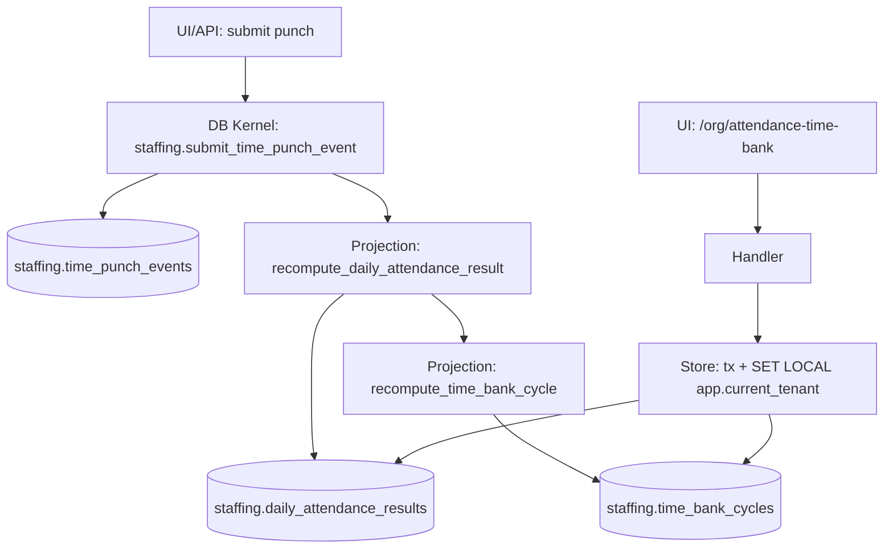

# DEV-PLAN-054：考勤 Slice 4D——额度与银行闭环（调休/综合工时累加器）

**状态**: 草拟中（2026-01-10 00:05 UTC）

> 目标：按 `docs/dev-plans/001-technical-design-template.md` 补齐到“无需再做设计决策即可开工”的细化程度（Level 4-5）。

## 1. 背景与上下文 (Context)

- **需求来源**：`docs/dev-plans/050-hrms-attendance-blueprint.md`（Quota & Banking：调休余额 + 周期累加器）。
- **上游依赖**：
  - `docs/dev-plans/051-attendance-slice-4a-punch-ledger.md`（输入 SoT：`staffing.time_punch_events` + kernel `staffing.submit_time_punch_event(...)`）。
  - `docs/dev-plans/052-attendance-slice-4b-daily-results-standard-shift.md`（日结果读模 + 同事务重算投射）。
  - `docs/dev-plans/053-attendance-slice-4c-time-profile-holiday-calendar.md`（day_type + OT 分桶 + TimeProfile/HolidayCalendar SSOT）。
- **范围定位**：对齐 `docs/dev-plans/009-implementation-roadmap.md` Phase 4 的“业务垂直切片：业务 + UI 同步交付”。
- **模块/落点（选定）**：
  - DB：`staffing` schema（Schema SSOT：`modules/staffing/infrastructure/persistence/schema/*.sql`；迁移：`migrations/staffing/*`）。
  - App：tenant app `/org/*` UI（本切片提供只读 UI；不提供 write API），落点：`internal/server/*`（与 punches/daily results 同构）。
- **业务价值**：
  - 把“调休余额/加班桶累计/周期累加器”显式化为权威读模，支持对账与后续 Payroll 对接（但本切片不输出 payroll wage type/结算）。
  - 保持 **写后读强一致**：余额/累加器作为派生状态，与日结果同事务更新，避免出现第二写入口。

## 2. 目标与非目标 (Goals & Non-Goals)

### 2.1 核心目标（Done 的定义）

- [ ] **权威额度/银行读模（按人按周期）**：新增 `staffing.time_bank_cycles`，以 `tenant_id + person_uuid + cycle_type + cycle_start_date` 作为主键，记录：
  - 周期边界：`cycle_start_date`、`cycle_end_date`（`date` 粒度）。
  - 周期累计：`overtime_minutes_150/200/300`（分钟 int）、`worked_minutes_total`（分钟 int）。
  - 调休：`comp_earned_minutes`、`comp_used_minutes`（分钟 int；本切片只实现 earned，used 预留为 0）。
  - 追溯/水位线：`ruleset_version`（MVP 固定常量）、`input_max_punch_event_db_id`、`input_max_punch_time`、`computed_at`。
- [ ] **同步投射（写后读强一致）**：在 `staffing.recompute_daily_attendance_result(...)` 内部（同一事务）调用 `staffing.recompute_time_bank_cycle(...)`，确保“日结果更新”与“周期累加器更新”同事务提交。
- [ ] **最小规则（MVP 固定，避免引入选择权/审批）**：
  - **加班桶累计**：直接汇总 `staffing.daily_attendance_results` 的 `overtime_minutes_*`（已包含 TimeProfile 阈值与取整）。
  - **调休累积（Comp Earned）**：仅 `RESTDAY` 的 `overtime_minutes_200` 以 **1:1**（分钟）计入 `comp_earned_minutes`；`WORKDAY/LEGAL_HOLIDAY` 不计入调休（后者不得以补休代替）。
  - **综合工时周期累计（预留）**：本切片仅落地 `worked_minutes_total` 与周期维度；不实现“超过阈值才触发加班”的综合工时算法。
- [ ] **UI 可见可追溯**：提供 `/org/attendance-time-bank` 页面：
  - Query：选择 `person_uuid` + `month (YYYY-MM)`；展示该月周期累加器与调休累计。
  - Trace：列出该月内 **有贡献** 的日结果（`overtime_minutes_* > 0` 或 `comp_earned_minutes>0`），并链接到 `/org/attendance-daily-results/{person_uuid}/{work_date}` 详情页。
- [ ] **安全可拒绝**：新表启用 RLS `ENABLE + FORCE`；`AUTHZ_MODE=enforce` 下未授权 read 必须统一 403（对齐 `docs/dev-plans/021-...`、`docs/dev-plans/022-...`）。
- [ ] **可测**：覆盖“同月多日累计正确”“新增 punches 导致日结果变化→周期累加器同步变化”“RLS fail-closed 与跨租户隔离”“Authz 403 负例”。

### 2.2 非目标（Out of Scope）

- 不实现“以休代薪”的选择权/审批流（员工选择 or 审批选择）；如需另立 dev-plan。
- 不实现调休消耗（请假/补休申请）与调休过期规则；`comp_used_minutes` 仅预留。
- 不实现综合工时制阈值、跨桶拆分与超阈值判定（该算法与法规/制度强绑定，需另立 dev-plan）。
- 不提供“规则/日历变更后的全量回填”；周期读模仍通过 punches/更正触发的重算链路更新（批量回填由 `DEV-PLAN-055` 承担）。
- 不对接 Payroll 的 wage type 映射/结算，仅沉淀可复用的时长累计读模。

### 2.3 工具链与门禁（SSOT 引用）

- **触发器清单（本计划命中）**：
  - [X] Go 代码（按 `AGENTS.md` TL;DR 执行）
  - [X] DB 迁移 / Schema（Atlas+Goose；按 `docs/dev-plans/024-atlas-goose-closed-loop-guide.md` 闭环）
  - [X] sqlc（更新 `internal/sqlc/schema.sql`；按 `docs/dev-plans/025-sqlc-guidelines.md`）
  - [X] 路由治理（`docs/dev-plans/017-routing-strategy.md`；`make check routing`）
  - [X] Authz（`docs/dev-plans/022-authz-casbin-toolchain.md`）
  - [ ] E2E（如纳入 smoke：`make e2e`）

- **SSOT 链接**：
  - 触发器矩阵与红线：`AGENTS.md`
  - CI 门禁：`docs/dev-plans/012-ci-quality-gates.md`
  - 有效期口径：`docs/dev-plans/032-effective-date-day-granularity.md`
  - RLS：`docs/dev-plans/021-pg-rls-for-org-position-job-catalog.md`
  - 路由：`docs/dev-plans/017-routing-strategy.md`
  - Authz：`docs/dev-plans/022-authz-casbin-toolchain.md`
  - 迁移闭环：`docs/dev-plans/024-atlas-goose-closed-loop-guide.md`
  - sqlc：`docs/dev-plans/025-sqlc-guidelines.md`
  - 上游切片：`docs/dev-plans/053-attendance-slice-4c-time-profile-holiday-calendar.md`
  - 蓝图：`docs/dev-plans/050-hrms-attendance-blueprint.md`

## 3. 架构与关键决策 (Architecture & Decisions)

### 3.1 架构图 (Mermaid)



### 3.2 关键设计决策（ADR 摘要）

- **读模来源（选定）**：`time_bank_cycles` 只从 `daily_attendance_results` 派生（不重复读 punches，避免“双口径”与漂移）。
- **一致性边界（选定）**：周期读模必须与日结果同事务更新；实现方式为在 `recompute_daily_attendance_result` 末尾调用 `recompute_time_bank_cycle`，避免遗漏调用点。
- **bounded replay（选定）**：当某个 `work_date` 的日结果变化时，仅重算该日期所属的“月周期”（`MONTH`）；不做全量历史重放。
- **并发控制（选定）**：为避免“不同日期并发更新导致周期累计丢失”，对 `tenant + person + cycle` 维度使用 `pg_advisory_xact_lock` 串行化周期重算。
- **度量单位（选定）**：所有累计/余额一律存分钟 `int`；展示层再换算小时，避免浮点误差。

## 4. 数据模型与约束 (Data Model & Constraints)

> 红线：新增数据库表（`CREATE TABLE`）与对应迁移落地前，必须获得你手工确认（`AGENTS.md` §3.2）。

### 4.1 Schema 定义（SQL；落地到 `modules/staffing/infrastructure/persistence/schema/*.sql`）

#### 4.1.0 新增表清单（需手工确认）

- `staffing.time_bank_cycles`

**建表批准记录（落迁移前必须完成）**
- [x] 已批准新增以上 1 张表（批准人：shangmeilin；时间：2026-01-09；证据：本对话确认）。

#### 4.1.1 `staffing.time_bank_cycles`（按人按月的周期累加器）

```sql
CREATE TABLE IF NOT EXISTS staffing.time_bank_cycles (
  tenant_id uuid NOT NULL,
  person_uuid uuid NOT NULL,
  cycle_type text NOT NULL,
  cycle_start_date date NOT NULL,
  cycle_end_date date NOT NULL,

  ruleset_version text NOT NULL,

  worked_minutes_total int NOT NULL DEFAULT 0,
  overtime_minutes_150 int NOT NULL DEFAULT 0,
  overtime_minutes_200 int NOT NULL DEFAULT 0,
  overtime_minutes_300 int NOT NULL DEFAULT 0,

  comp_earned_minutes int NOT NULL DEFAULT 0,
  comp_used_minutes int NOT NULL DEFAULT 0,

  input_max_punch_event_db_id bigint NULL,
  input_max_punch_time timestamptz NULL,

  computed_at timestamptz NOT NULL DEFAULT now(),
  created_at timestamptz NOT NULL DEFAULT now(),
  updated_at timestamptz NOT NULL DEFAULT now(),

  PRIMARY KEY (tenant_id, person_uuid, cycle_type, cycle_start_date),

  CONSTRAINT time_bank_cycles_cycle_type_check
    CHECK (cycle_type IN ('MONTH')),
  CONSTRAINT time_bank_cycles_cycle_bounds_check
    CHECK (cycle_end_date >= cycle_start_date),
  CONSTRAINT time_bank_cycles_minutes_nonneg_check
    CHECK (
      worked_minutes_total >= 0
      AND overtime_minutes_150 >= 0
      AND overtime_minutes_200 >= 0
      AND overtime_minutes_300 >= 0
      AND comp_earned_minutes >= 0
      AND comp_used_minutes >= 0
    )
);

CREATE INDEX IF NOT EXISTS time_bank_cycles_lookup_idx
  ON staffing.time_bank_cycles (tenant_id, person_uuid, cycle_start_date DESC);

ALTER TABLE staffing.time_bank_cycles ENABLE ROW LEVEL SECURITY;
ALTER TABLE staffing.time_bank_cycles FORCE ROW LEVEL SECURITY;
DROP POLICY IF EXISTS tenant_isolation ON staffing.time_bank_cycles;
CREATE POLICY tenant_isolation ON staffing.time_bank_cycles
USING (tenant_id = current_setting('app.current_tenant')::uuid)
WITH CHECK (tenant_id = current_setting('app.current_tenant')::uuid);
```

> 说明：`cycle_type` MVP 只允许 `MONTH`，避免引入综合工时的周期选择与阈值合同；后续如需 `QUARTER/YEAR`，必须通过新 dev-plan 增补约束与验收口径。

### 4.2 Kernel：同步投射（SQL；落地到 `modules/staffing/infrastructure/persistence/schema/*.sql`）

#### 4.2.1 `staffing.recompute_time_bank_cycle(...)`（按 work_date 归属月周期，bounded replay）

```sql
CREATE OR REPLACE FUNCTION staffing.recompute_time_bank_cycle(
  p_tenant_id uuid,
  p_person_uuid uuid,
  p_work_date date
)
RETURNS void
LANGUAGE plpgsql
AS $$
DECLARE
  v_cycle_type text := 'MONTH';
  v_cycle_start date;
  v_cycle_end date;

  v_ruleset_version text := 'TIME_BANK_V1';

  v_worked_total int := 0;
  v_ot_150 int := 0;
  v_ot_200 int := 0;
  v_ot_300 int := 0;
  v_comp_earned int := 0;
  v_comp_used int := 0;

  v_input_max_id bigint := NULL;
  v_input_max_punch_time timestamptz := NULL;
BEGIN
  PERFORM staffing.assert_current_tenant(p_tenant_id);

  IF p_person_uuid IS NULL THEN
    RAISE EXCEPTION USING MESSAGE = 'STAFFING_INVALID_ARGUMENT', DETAIL = 'person_uuid is required';
  END IF;
  IF p_work_date IS NULL THEN
    RAISE EXCEPTION USING MESSAGE = 'STAFFING_INVALID_ARGUMENT', DETAIL = 'work_date is required';
  END IF;

  v_cycle_start := date_trunc('month', p_work_date)::date;
  v_cycle_end := ((date_trunc('month', p_work_date) + interval '1 month')::date - 1);

  PERFORM pg_advisory_xact_lock(
    hashtext(p_tenant_id::text),
    hashtext(p_person_uuid::text || ':' || v_cycle_type || ':' || v_cycle_start::text)
  );

  SELECT
    COALESCE(sum(worked_minutes), 0)::int,
    COALESCE(sum(overtime_minutes_150), 0)::int,
    COALESCE(sum(overtime_minutes_200), 0)::int,
    COALESCE(sum(overtime_minutes_300), 0)::int,
    COALESCE(sum(CASE WHEN day_type = 'RESTDAY' THEN overtime_minutes_200 ELSE 0 END), 0)::int,
    COALESCE(max(input_max_punch_event_db_id), NULL),
    COALESCE(max(input_max_punch_time), NULL)
  INTO
    v_worked_total,
    v_ot_150,
    v_ot_200,
    v_ot_300,
    v_comp_earned,
    v_input_max_id,
    v_input_max_punch_time
  FROM staffing.daily_attendance_results
  WHERE tenant_id = p_tenant_id
    AND person_uuid = p_person_uuid
    AND work_date >= v_cycle_start
    AND work_date <= v_cycle_end;

  INSERT INTO staffing.time_bank_cycles (
    tenant_id,
    person_uuid,
    cycle_type,
    cycle_start_date,
    cycle_end_date,
    ruleset_version,
    worked_minutes_total,
    overtime_minutes_150,
    overtime_minutes_200,
    overtime_minutes_300,
    comp_earned_minutes,
    comp_used_minutes,
    input_max_punch_event_db_id,
    input_max_punch_time,
    computed_at,
    created_at,
    updated_at
  )
  VALUES (
    p_tenant_id,
    p_person_uuid,
    v_cycle_type,
    v_cycle_start,
    v_cycle_end,
    v_ruleset_version,
    v_worked_total,
    v_ot_150,
    v_ot_200,
    v_ot_300,
    v_comp_earned,
    v_comp_used,
    v_input_max_id,
    v_input_max_punch_time,
    now(),
    now(),
    now()
  )
  ON CONFLICT (tenant_id, person_uuid, cycle_type, cycle_start_date)
  DO UPDATE SET
    cycle_end_date = EXCLUDED.cycle_end_date,
    ruleset_version = EXCLUDED.ruleset_version,
    worked_minutes_total = EXCLUDED.worked_minutes_total,
    overtime_minutes_150 = EXCLUDED.overtime_minutes_150,
    overtime_minutes_200 = EXCLUDED.overtime_minutes_200,
    overtime_minutes_300 = EXCLUDED.overtime_minutes_300,
    comp_earned_minutes = EXCLUDED.comp_earned_minutes,
    comp_used_minutes = EXCLUDED.comp_used_minutes,
    input_max_punch_event_db_id = EXCLUDED.input_max_punch_event_db_id,
    input_max_punch_time = EXCLUDED.input_max_punch_time,
    computed_at = EXCLUDED.computed_at,
    updated_at = EXCLUDED.updated_at;
END;
$$;
```

#### 4.2.2 修改 `staffing.recompute_daily_attendance_result(...)`：在 upsert 日结果后联动重算周期

在 `staffing.recompute_daily_attendance_result(...)` 最末尾（完成 `daily_attendance_results` upsert 后）追加：

```sql
PERFORM staffing.recompute_time_bank_cycle(p_tenant_id, p_person_uuid, p_work_date);
```

> 说明：把联动逻辑放在 `recompute_daily_attendance_result` 内，可确保 punches 更正/未来 4E bounded replay 等所有调用点都自动联动，不需要在每个 submit_*_event(...) 旁复制调用。

### 4.3 迁移策略（Atlas+Goose；按 `docs/dev-plans/024-atlas-goose-closed-loop-guide.md` 闭环）

- **Up**：新增 `time_bank_cycles` 表 + RLS；新增 `recompute_time_bank_cycle`；在 `recompute_daily_attendance_result` 中调用联动。
- **Down**：删除函数与表（仅用于本地/测试环境；生产策略按仓库约定）。

## 5. 接口契约 (API Contracts)

> 本切片不新增对外 JSON API；仅新增 tenant UI 页面与可选 internal API（如果需要给前端/测试复用，可在实现时补齐）。

### 5.1 UI：`GET /org/attendance-time-bank`

- **Query Params**：
  - `as_of`（沿用 UI Shell；必填/缺省为当天）
  - `person_uuid`（可选；未提供则提示选择人员）
  - `month`（可选，格式 `YYYY-MM`；缺省为 `as_of[:7]`）
- **响应**：HTML 页面（HTMX 片段渲染与现有页面一致）。
- **错误**：
  - `400`：`month` 非法或 `person_uuid` 非法（页面提示）。
  - `403`：Authz 拒绝（由 middleware 统一返回）。

## 6. 核心逻辑与算法 (Business Logic & Algorithms)

### 6.1 周期边界（月）

- `cycle_start_date = first_day_of_month(work_date)`（`date_trunc('month', work_date)::date`）
- `cycle_end_date = last_day_of_month(work_date)`（`cycle_start_date + 1 month - 1 day`）

### 6.2 周期累加器重算（bounded replay）

输入：`tenant_id, person_uuid, work_date`。

1. 开启事务（由上游 `submit_time_punch_event(...)` 或未来更正事件提供）。
2. 在 `recompute_daily_attendance_result` 完成日结果 upsert 后调用 `recompute_time_bank_cycle(...)`。
3. `recompute_time_bank_cycle`：
   - 计算月周期边界；
   - 获取 `tenant+person+cycle` advisory lock；
   - 从 `daily_attendance_results` 聚合求和与水位线（max）；
   - upsert `time_bank_cycles`。
4. 事务提交后，UI/查询读取 `time_bank_cycles` 即为最新。

### 6.3 调休累积口径（MVP 固定）

- `comp_earned_minutes(month) = SUM(overtime_minutes_200 WHERE day_type='RESTDAY')`
- `comp_used_minutes(month) = 0`（本切片预留，后续请假/审批切片填充）

## 7. 安全与鉴权 (Security & Authz)

### 7.1 RLS（fail-closed）

- `staffing.time_bank_cycles` 启用 `ENABLE + FORCE` + `tenant_isolation` policy（见 §4.1.1）。
- 应用层所有读取必须在显式事务内注入：`SELECT set_config('app.current_tenant', $1, true);`（对齐 `docs/dev-plans/021-...`）。

### 7.2 Authz（Casbin）

- **object（新增）**：`staffing.attendance-time-bank`
- **action**：`read`
- **路由映射**：
  - `/org/attendance-time-bank`：GET → read
- **policy（bootstrap 期）**：为 `role:tenant-admin` 添加 `staffing.attendance-time-bank` 的 `read` 允许项，并按 `docs/dev-plans/022-...` 跑 pack/test/lint 门禁。

## 8. 依赖与里程碑 (Dependencies & Milestones)

### 8.1 依赖

- 日结果读模已就绪：`staffing.daily_attendance_results`（Slice 4B/4C）。
- punches 写入口已就绪：`staffing.submit_time_punch_event`（Slice 4A）。
- Tenancy/AuthN/RLS/Authz 基础设施已就绪（SSOT：`AGENTS.md` + `docs/dev-plans/021-...` + `docs/dev-plans/022-...`）。

### 8.2 里程碑（可直接开工的拆解）

1. [x] 文档确认：确认本切片只支持 `MONTH`，且调休累积口径固定为“RESTDAY OT200 → comp earned（1:1）”。
2. [x] DB：按 §4.1/§4.2 落地 `time_bank_cycles` + kernel 函数 + 联动调用（落迁移前需手工确认新增表）。
3. [x] sqlc：运行 `make sqlc-generate` 并确保 `git status --short` 为空（更新 schema.sql）。
4. [x] Routing/Authz：新增 `/org/attendance-time-bank` 路由 + allowlist + authz registry/middleware + bootstrap policy。
5. [x] Go：实现读 store（tx + tenant 注入）与 handler，挂到 nav（en/zh 文字同构 `internal/server/handler.go` 的 `tr(...)`）。
6. [x] 测试：覆盖聚合口径与联动更新；RLS/Authz 负例；并发锁行为（可用并发提交 2 个不同日期 punches 来验证最终累计不丢失）。
7. [ ] 证据：按 `docs/dev-records/` 口径登记关键门禁执行记录（时间戳/命令/结论）。

## 9. 测试与验收标准 (Acceptance Criteria)

### 9.1 端到端验收场景（最小链路）

- [ ] **RESTDAY OT → 调休累计**：
  1) 在 HolidayCalendar 把某个周六设置为 `RESTDAY`（或默认即 RESTDAY）；
  2) 为某人补打一对 punches：09:00 IN、19:00 OUT；
  3) `/org/attendance-daily-results/{person_uuid}/{work_date}` 显示 `overtime_minutes_200 > 0`；
  4) `/org/attendance-time-bank?person_uuid=...&month=YYYY-MM` 显示该月 `overtime_minutes_200` 与 `comp_earned_minutes` 同步增加。
- [ ] **WORKDAY OT 不计调休**：
  1) WORKDAY 产生 `overtime_minutes_150 > 0`；
  2) time bank 的 `comp_earned_minutes` 不变化，但 `overtime_minutes_150` 累计变化。
- [ ] **一致性**：补卡提交后刷新 time bank 页面即可看到最新累计（写后读强一致）。
- [ ] **可追溯**：time bank 页面能列出有贡献的日结果并可跳转到 detail。
- [ ] **安全**：`AUTHZ_MODE=enforce` 下未授权访问返回 403；RLS 缺 tenant 注入 fail-closed。

### 9.2 建议的测试落点（最小集合）

- `internal/server/authz_middleware_test.go`：覆盖 `/org/attendance-time-bank` 路由映射（GET→read）。
- `internal/server/handler_test.go`：覆盖 `/org/attendance-time-bank` GET 200（授权）、403（未授权）。
- DB 行为（可走集成测试或 e2e）：
  - 同月两天分别补卡并发提交，最终 `time_bank_cycles` 的累计包含两天贡献（防丢失更新）。
  - 通过新增 punches 触发日结果变化，周期累计随之变化（联动有效）。

## 10. 运维与监控 (Ops & Monitoring)

- 不引入 feature flag 与额外监控开关（对齐 `AGENTS.md` §3.6）。
- 最小日志字段（建议）：`tenant_id`、`principal_id`、`person_uuid`、`month/cycle_start_date`、`computed_at`。

## 11. 开放问题

- [ ] 调休累积是否需要支持“有效期/过期日”（例如 N 个月内有效）；若需要将引入 Valid Time/过期规则与消耗规则，需另立 dev-plan。
- [ ] 是否需要为“综合工时制”引入 `QUARTER/YEAR` 周期与阈值合同（与 TimeProfile 或 Assignment 绑定）；需另立 dev-plan 并与法规/制度对齐。
