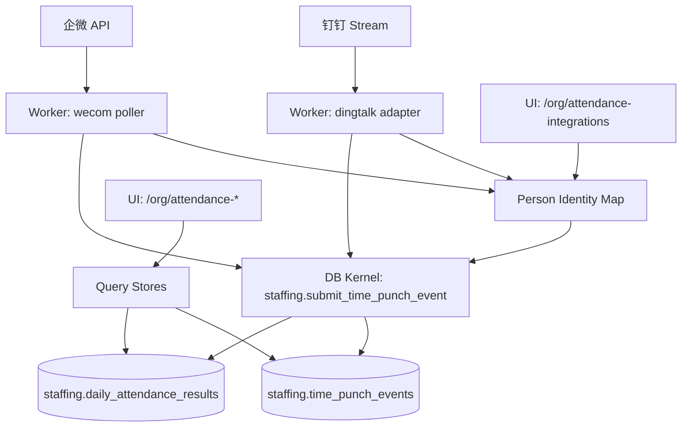

# DEV-PLAN-056：考勤 Slice 4F——生态集成闭环（钉钉 Stream / 企微 Poller）

**状态**: 已完成（2026-01-10；已合并：#170 #171 #172 #173 #174 #175）

> 目标：按 `DEV-PLAN-001` 模板补齐到“无需再做设计决策即可开工”的细化程度（Level 4-5）。

## 1. 背景与上下文 (Context)

- **需求来源**：`docs/dev-plans/050-hrms-attendance-blueprint.md`（Slice 4F）。
- **上游依赖**：
  - `docs/dev-plans/051-attendance-slice-4a-punch-ledger.md`（输入 SoT：`staffing.time_punch_events` + kernel `staffing.submit_time_punch_event(...)`）。
  - `docs/dev-plans/052-attendance-slice-4b-daily-results-standard-shift.md`（日结果读模）。
  - `docs/dev-plans/053-attendance-slice-4c-time-profile-holiday-calendar.md`（规则/日历）。
  - `docs/dev-plans/054-attendance-slice-4d-time-banking-and-accumulators.md`（余额/累加器）。
  - `docs/dev-plans/055-attendance-slice-4e-corrections-audit-recalc.md`（更正/重算）。
- **范围定位**：本切片只解决“外部可信输入摄入（timestamp + 外部身份）”闭环；外部平台的“计算结果”不进入权威口径，所有计算仍由本仓库规则体系完成。
- **目标用户**：租户管理员（Tenant Admin）——能看到外部事件是否进来、哪些外部用户尚未映射、并可将外部身份映射到 `person_uuid`。

## 2. 目标与非目标 (Goals & Non-Goals)

### 2.1 核心目标（Done 的定义）

- [X] **接入能力**：
  - [X] 钉钉：Stream 模式接入，订阅“员工打卡事件”（`eventType=attendance_check_record`）。
  - [X] 企微：Poller 拉取增量打卡（周期可配置，至少支持 30s）。
- [X] **身份映射**：将外部 `userId`（钉钉）/`userid`（企微）映射到 `person_uuid`，并提供 UI 可见可操作的映射管理页面。
- [X] **One Door**：外部事件写入必须调用 DB Kernel `staffing.submit_time_punch_event(...)`；禁止绕过 kernel 直接写表（对齐 `AGENTS.md` “One Door”）。
- [X] **幂等成立**：重复投递/重复拉取不会产生重复 punch；幂等键统一落在 `request_id`（`tenant_id + request_id` unique），并由 kernel fail-fast 校验“同 key 不同内容”。
- [X] **外部字段不作为权威输入**：平台侧“迟到/早退/正常”等结果字段一律不作为计算输入；仅原样保留在 `source_raw_payload/device_info` 供审计/排障。
- [X] **验收闭环**：外部事件进入后，在 `/org/attendance-punches`、`/org/attendance-daily-results` 等页面与手工事件同口径可见。

### 2.2 非目标（Out of Scope）

- 不做“对外回写平台”的回执/对账闭环（如需另立 dev-plan）。
- 不引入消息队列作为权威写路径；限流/重试/回执属于副作用链路，不得写权威读模（对齐 `AGENTS.md` §3.6）。
- 不在本切片实现“多租户多企业配置中心/凭证托管”；MVP 采用 **单进程/单租户** 运行形态（见 §10）。
- 不做“未映射期间”的历史补数：
  - 钉钉 Stream 未映射事件会被 ACK 并丢弃（只记录 `pending/ignored`），后续映射无法找回；如需补数必须另立计划（例如补数 API/导入闭环）。
  - 企微 Poller 仅在 `lookback` 窗口内具备“有限补数”能力，超窗不保证。

## 2.3 工具链与门禁（SSOT 引用）

- **触发器清单（本计划命中）**：
  - [X] Go 代码（`go fmt ./... && go vet ./... && make check lint && make test`）
  - [X] DB 迁移 / Schema（Atlas+Goose，`make staffing plan && make staffing lint && make staffing migrate up`；person 映射表则为 `make person plan/lint/migrate ...`）
  - [X] sqlc（`make sqlc-generate`，然后 `git status --short` 必须为空）
  - [X] 路由治理（`make check routing`；必要时更新 `config/routing/allowlist.yaml`）
  - [X] Authz（`make authz-pack && make authz-test && make authz-lint`）

- **SSOT 链接**：
  - 触发器矩阵与本地必跑：`AGENTS.md`
  - CI 门禁：`docs/dev-plans/012-ci-quality-gates.md`
  - RLS：`docs/dev-plans/021-pg-rls-for-org-position-job-catalog.md`
  - 路由：`docs/dev-plans/017-routing-strategy.md`
  - Authz：`docs/dev-plans/022-authz-casbin-toolchain.md`
  - 迁移闭环：`docs/dev-plans/024-atlas-goose-closed-loop-guide.md`
  - sqlc：`docs/dev-plans/025-sqlc-guidelines.md`

## 3. 架构与关键决策 (Architecture & Decisions)

### 3.1 架构图 (Mermaid)



### 3.2 关键设计决策（ADR 摘要）

- **运行形态（选定）**：新增一个独立进程 `cmd/attendance-integrations`（Worker），与 `cmd/server` 解耦；Worker 仅做“拉取/接收 → 规范化 → 身份映射 → 调用 kernel”。
- **DingTalk 事件源（选定）**：使用钉钉 Stream 事件订阅 `attendance_check_record`（员工打卡事件），Go SDK 选型 `github.com/open-dingtalk/dingtalk-stream-sdk-go`；字段口径来自官方事件文档（见 §6.1）。
- **外部 punch 类型（选定）**：钉钉事件体不提供“上班/下班（IN/OUT）”语义；因此引入 `punch_type='RAW'`（仅用于外部来源），由日结果计算按时间序列解释配对（见 §6.4）。
- **幂等键（选定）**：外部事件幂等统一使用 `request_id`（文本）作为幂等 key；kernel 扩展为“按 request_id 幂等”，避免对外部 `event_id` 做 uuid 映射/去重表（见 §6.3）。
- **身份映射落点（选定）**：映射表落在 `person` schema（与 `person_uuid` 同域），避免在 staffing/attendance 子域自造跨模块回退规则。
- **initiator_id（选定）**：Worker 摄入事件的 `initiator_id = tenant_id`（系统 actor，模式对齐 superadmin bootstrap 写入）；避免幂等比较因 actor 漂移导致误报冲突。
- **租户绑定/corpId 校验（选定）**：Worker 绑定 `TENANT_ID`；钉钉事件必须额外校验 `CorpId == DINGTALK_CORP_ID`（不匹配则丢弃并记录日志），避免跨企业/跨租户误摄入。
- **数据最小化（选定）**：不在映射表 `last_seen_payload` 中保存地址/经纬度/设备号等敏感字段；只保存“最小可排障摘要”（见 §4.1.1）。`time_punch_events.source_raw_payload/device_info` 也只保存白名单字段（见 §4.2.1）。

## 4. 数据模型与约束 (Data Model & Constraints)

> 红线：新增数据库表（`CREATE TABLE`）落地迁移前必须获得你手工确认（`AGENTS.md` §3.2）。本计划包含 1 个新增表：`person.external_identity_links`。

### 4.1 新增：`person.external_identity_links`（外部身份 → person_uuid）

```sql
CREATE TABLE IF NOT EXISTS person.external_identity_links (
  tenant_id uuid NOT NULL,
  provider text NOT NULL, -- 'DINGTALK' | 'WECOM'
  external_user_id text NOT NULL, -- dingtalk.userId / wecom.userid

  -- pending: person_uuid 为空，仅用于提示“待映射”；active: 可用于摄入；disabled: 暂停摄入（保留映射）；ignored: 明确忽略（无映射）
  status text NOT NULL DEFAULT 'pending',
  person_uuid uuid NULL,

  first_seen_at timestamptz NOT NULL DEFAULT now(),
  last_seen_at timestamptz NOT NULL DEFAULT now(),
  seen_count int NOT NULL DEFAULT 1,

  last_seen_payload jsonb NOT NULL DEFAULT '{}'::jsonb,

  created_at timestamptz NOT NULL DEFAULT now(),
  updated_at timestamptz NOT NULL DEFAULT now(),

  PRIMARY KEY (tenant_id, provider, external_user_id),

  CONSTRAINT external_identity_links_provider_check CHECK (provider IN ('DINGTALK','WECOM')),
  CONSTRAINT external_identity_links_external_user_id_nonempty_check CHECK (btrim(external_user_id) <> ''),
  CONSTRAINT external_identity_links_external_user_id_trim_check CHECK (external_user_id = btrim(external_user_id)),
  CONSTRAINT external_identity_links_status_check CHECK (status IN ('pending','active','disabled','ignored')),
  CONSTRAINT external_identity_links_status_person_uuid_check CHECK (
    (status IN ('pending','ignored') AND person_uuid IS NULL)
    OR (status IN ('active','disabled') AND person_uuid IS NOT NULL)
  ),
  CONSTRAINT external_identity_links_last_seen_payload_is_object_check CHECK (jsonb_typeof(last_seen_payload) = 'object')
);

CREATE INDEX IF NOT EXISTS external_identity_links_lookup_idx
  ON person.external_identity_links (tenant_id, provider, status, last_seen_at DESC);

ALTER TABLE person.external_identity_links ENABLE ROW LEVEL SECURITY;
ALTER TABLE person.external_identity_links FORCE ROW LEVEL SECURITY;
DROP POLICY IF EXISTS tenant_isolation ON person.external_identity_links;
CREATE POLICY tenant_isolation ON person.external_identity_links
USING (tenant_id = current_setting('app.current_tenant')::uuid)
WITH CHECK (tenant_id = current_setting('app.current_tenant')::uuid);
```

#### 4.1.1 `last_seen_payload`（最小排障摘要，字段白名单）

> 目的：仅用于“提示用户做映射/忽略/禁用”的排障线索；不得把打卡位置/设备信息当作必需字段存入该表。

- DingTalk（建议 shape）：`{"event_type":"attendance_check_record","event_id":"...","corp_id":"...","user_id":"...","check_time_ms":1570791880000,"biz_id":"...","check_by_user":true}`
- WeCom（建议 shape）：`{"source":"wecom","userid":"...","checkin_time":1570791880,"checkin_type":"上班打卡","exception_type":"..."}`

### 4.2 扩展：`staffing.time_punch_events`（source_provider/punch_type allowlist）

> 本节为 **既有表** 的约束扩展：为外部集成新增来源枚举与 `RAW` punch_type。

- `source_provider`：`MANUAL|IMPORT|DINGTALK|WECOM`
- `punch_type`：`IN|OUT|RAW`（`RAW` 仅用于外部来源；UI 手工/导入仍只允许 IN/OUT）

#### 4.2.1 外部摄入时的 `payload/source_raw_payload/device_info`（字段白名单）

- `payload`：仅保存业务所需元信息（例如 `{"source_provider":"DINGTALK","source_event_type":"attendance_check_record","source_event_id":"...","external_user_id":"..."}`）。
- `source_raw_payload`：仅保存必要的原始字段（不含地址/经纬度/明文设备号）；用于排障与审计，不参与计算。
- `device_info`：默认 `{}`；如未来需要设备信息，必须先在本计划中补充字段白名单与脱敏策略再落地。

### 4.3 Kernel：`staffing.submit_time_punch_event(...)`（按 request_id 幂等 + allowlist 扩展）

- `p_source_provider` allowlist 扩展为 `MANUAL|IMPORT|DINGTALK|WECOM`。
- `p_punch_type` allowlist 扩展为 `IN|OUT|RAW`。
- 幂等键：优先使用 `tenant_id + request_id`（unique）；兼容保留 `event_id` 幂等（见 §6.3）。
- Worker 侧约束：同一来源同一事件的重放必须产生 **完全一致** 的参数（含 `initiator_id=tenant_id`），否则按幂等重用冲突拒绝。

## 5. 接口契约 (API Contracts)

### 5.1 UI：`GET /org/attendance-integrations`

- **Authz**：`staffing.attendance-integrations` + `read`（新增 object，见 §7）。
- **Routing**：`route_class=ui`；需加入 `config/routing/allowlist.yaml`（对齐 `docs/dev-plans/017-routing-strategy.md`）。
- **Response**：HTML 页面，包含：
  - 当前租户集成说明（本切片仅做“身份映射 + 待映射列表”，不做凭证托管）。
  - 待映射列表（`status=pending`）：`provider + external_user_id + last_seen_at + seen_count`。
  - 已映射列表（`status=active|disabled`）：可启用/禁用/解除绑定。
  - 已忽略列表（`status=ignored`）：可取消忽略（恢复为 pending）。

### 5.2 UI：`POST /org/attendance-integrations`

- **Authz**：`staffing.attendance-integrations` + `admin`。
- **Routing**：`route_class=ui`；需加入 `config/routing/allowlist.yaml`（对齐 `docs/dev-plans/017-routing-strategy.md`）。
- **Form**：
  - `op=link`：`provider`, `external_user_id`, `person_uuid` → 将记录置为 `active`。
  - `op=disable`：`provider`, `external_user_id` → 将记录置为 `disabled`。
  - `op=enable`：`provider`, `external_user_id` → 将记录置为 `active`（要求 `person_uuid` 已存在）。
  - `op=ignore`：`provider`, `external_user_id` → 将记录置为 `ignored`（要求当前为 pending）。
  - `op=unignore`：`provider`, `external_user_id` → 将记录置为 `pending`。
  - `op=unlink`：`provider`, `external_user_id` → 将记录置为 `pending` 且清空 `person_uuid`（用于解除绑定，不做 hard delete）。
- **Error**：输入非法/找不到记录 → 422；未授权 → 403。

## 6. 核心逻辑与算法 (Business Logic & Algorithms)

### 6.1 钉钉 Stream：事件订阅与解析（`attendance_check_record`）

**事件类型**：`attendance_check_record`（员工打卡事件）。

**关键字段（按官方文档）**：
- 事件级：`eventId`, `CorpId`, `EventTime`, `BizId`。
- 记录级（`dataList[]`）：`userId`, `checkTime`, `locationMethod`, `locationResult`, `latitude`, `longitude`, `address`, `groupId`, `deviceSN`, `checkByUser`, `bizId`。

**摄入伪代码**：
1. 启动时校验 env：`TENANT_ID` 必填；并基于“启用的 provider”校验：
   - 启用钉钉：必须提供 `DINGTALK_CLIENT_ID`、`DINGTALK_CLIENT_SECRET`、`DINGTALK_CORP_ID`。
   - 启用企微：必须提供 `WECOM_CORP_ID`、`WECOM_CORP_SECRET`。
   - 至少启用一个 provider，否则启动失败。
2. 建立 Stream 连接（AppKey/AppSecret），注册事件 handler（仅当启用钉钉）。
3. 收到事件后：
   - 校验 `CorpId == DINGTALK_CORP_ID`（不匹配：记录 `corp_mismatch` 日志并 ACK 成功，避免无限重试）。
   - 校验 `EventType == "attendance_check_record"`，解析 `dataList`。
4. 对每条 `dataList[i]`：
   - `external_user_id = dataList[i].userId`
   - `punch_time = time.UnixMilli(dataList[i].checkTime).UTC()`
   - `punch_type = "RAW"`
   - `source_provider = "DINGTALK"`
   - `request_id = "dingtalk:attendance_check_record:" + eventId + ":" + dataList[i].bizId`
   - `initiator_id = tenant_id`
5. 先做身份映射（§6.2）：
   - 未映射（pending/新建）或明确忽略（ignored）：仅更新映射表 `last_seen_*` 并 **ACK 成功**（避免无限重试）。
   - 已映射 active：调用 kernel 写入。
   - disabled：更新 `last_seen_*` 并跳过写入（不摄入）。

### 6.2 身份映射：`external_user_id` → `person_uuid`

**查找规则（fail-closed）**：
1. 在事务内 `SET LOCAL app.current_tenant`。
2. 查询 `person.external_identity_links`：`tenant_id + provider + external_user_id`。
3. 分支：
   - `NOT FOUND`：INSERT `status=pending, person_uuid=NULL, seen_count=1, last_seen_payload=...`；返回“未映射”。
   - `status=pending`：UPDATE `last_seen_at/seen_count/last_seen_payload`；返回“未映射”。
   - `status=ignored`：UPDATE `last_seen_at/seen_count/last_seen_payload`；返回“忽略（不摄入）”。
   - `status=disabled`：UPDATE `last_seen_at/seen_count/last_seen_payload`；返回“禁用（不摄入）”。
   - `status=active`：返回 `person_uuid`；进入写入。

### 6.3 幂等：`request_id` 作为外部事件幂等键

**约束现状**：`staffing.time_punch_events` 已有 `UNIQUE (tenant_id, request_id)`。

**Kernel 改造目标**：
- 插入时使用 `ON CONFLICT DO NOTHING`（覆盖 event_id/request_id 两类 unique）。
- 未插入时：优先按 `event_id` 查；若不存在则按 `(tenant_id, request_id)` 查。
- 对于 “request_id 命中但 event_id 不同” 的重放：允许 `event_id` 不同，但要求其它字段（`tenant_id/person_uuid/punch_time/punch_type/source_provider/payload/source_raw_payload/device_info/request_id/initiator_id`）完全一致；否则抛 `STAFFING_IDEMPOTENCY_REUSED`。
- Worker 侧约束：`event_id` 每次可新生成 uuid，但 `request_id` 必须稳定；且 `initiator_id` 固定为 `tenant_id`，否则会把“重放”误判为“幂等重用冲突”。

### 6.4 日结果解释 RAW punch（不改事件 SoT，改解释逻辑）

**目标**：`punch_type='RAW'` 仅表示“时间点”；在计算时按时间序列做 IN/OUT 交替解释。

**SQL 解释规则（在 `staffing.recompute_daily_attendance_result` 内）**：
- 若 `punch_type='IN'`：按既有规则处理。
- 若 `punch_type='OUT'`：按既有规则处理。
- 若 `punch_type='RAW'`：当 `v_expect='IN'` 时按 IN 处理；当 `v_expect='OUT'` 时按 OUT 处理。

### 6.5 企微 Poller：最小可复现的增量拉取

**接口**（官方文档口径）：
- 获取 token：`GET https://qyapi.weixin.qq.com/cgi-bin/gettoken?corpid=...&corpsecret=...`
- 拉取打卡：`POST https://qyapi.weixin.qq.com/cgi-bin/checkin/getcheckindata?access_token=...`

**MVP 拉取策略（选定）**：滑动窗口 + 幂等去重（不持久化 cursor）。
- `interval`：默认 30s。
- `lookback`：默认 10m（可配置）；每次拉取 `[now-lookback, now]`。
- `useridlist`：来自 `person.external_identity_links(status=active, provider='WECOM')`，按 API 上限分批（例如每批 100）。
- Request（示意）：`{"opencheckindatatype":3,"starttime":<epoch_seconds>,"endtime":<epoch_seconds>,"useridlist":[...]}`。
- Response（关注字段）：`userid`, `checkin_time`（epoch seconds）, `checkin_type`, `exception_type`（以及可能的 location/media 等）。
- `punch_type` 映射（选定，明确可实现）：
  - `checkin_type == "上班打卡"` → `IN`
  - `checkin_type == "下班打卡"` → `OUT`
  - 其它/未知 → `RAW`
- 每条 `checkindata[]` 生成 `request_id = "wecom:checkin:" + userid + ":" + checkin_time + ":" + checkin_type`，并 `initiator_id=tenant_id`。

## 7. 安全与鉴权 (Security & Authz)

- **RLS**：Worker 与 UI 均必须在事务内注入 `app.current_tenant`；缺失注入 fail-closed。
- **Authz（新增 object）**：
  - Object: `staffing.attendance-integrations`
  - Action: `read`/`admin`
- **落点要求（避免漂移）**：
  - `pkg/authz/registry.go` 新增 object 常量；`internal/server/authz_middleware.go` 增加 `/org/attendance-integrations` 的 method→(object,action) 映射；`internal/server/authz_middleware_test.go` 增加断言用例。
- **权限边界**：Worker 不走 `/org/api/*`（避免绕过 UI/Authz 口径）；Worker 仅拥有 DB runtime 权限并调用 kernel。

## 8. 依赖与里程碑 (Dependencies & Milestones)

- **依赖**：Slice 4A-4E 已就绪（见 §1）；本切片新增的 `RAW` 解释逻辑会修改 4B 的计算函数，但不改变“事件 SoT append-only”的原则。
- **实施策略（推荐顺序）**：
  - 先打通“本地闭环”（schema + kernel 幂等 + RAW 解释 + UI 映射页 + authz/routing），再接外部 Provider；避免没有映射入口导致“只摄入不可用”。
  - Provider 落地顺序：先 DingTalk（push/低延迟/单事件类型），后 WeCom（poll/窗口补数/速率与去重复杂度更高）。
  - PR 切分建议：PR1（DB+Kernel+RAW）→ PR2（UI+Authz+Routing）→ PR3（Worker+DingTalk）→ PR4（Worker+WeCom）→ PR5（fixture/集成测试/Readiness 记录）。
- **里程碑**：
  1. [X] 手工确认：允许新增表 `person.external_identity_links`（并确认 `last_seen_payload` 的最小字段白名单与“不存位置/设备明文”的策略）。（#170）
  2. [X] DB：`person.external_identity_links` 迁移；`staffing.time_punch_events` allowlist 扩展；kernel 幂等改造；日结果支持 RAW。（#171）
  3. [X] UI+门禁：`/org/attendance-integrations` 映射管理（含 pending/ignored/active/disabled）+ routing allowlist + authz object/action + 测试断言。（#172）
  4. [X] Worker：`cmd/attendance-integrations` + DingTalk adapter（仅 `attendance_check_record`）。（#173）
  5. [X] Worker：WeCom poller（滑动窗口 + 幂等）。（#174）
  6. [X] 测试：fixture + DB 集成测试 + 基本负例（RLS/Authz/幂等冲突）。（#171 #172 #173 #174）
  7. [X] Readiness：在 `docs/dev-records/` 记录门禁执行与结果。（#175）

## 9. 测试与验收标准 (Acceptance Criteria)

- [X] **端到端**：钉钉/企微任一来源的事件进入后，在 `/org/attendance-punches` 可见；对应 `work_date` 的日结果可见且口径一致。
- [X] **可发现性**：`/org/attendance-integrations` 可见且可操作（创建/禁用映射、查看 pending/ignored/active 状态与 `last_seen_at/seen_count`）。
- [X] **幂等**：重复推送/重复拉取不会产生重复 punch；同 request_id 不同内容会触发 `STAFFING_IDEMPOTENCY_REUSED`。
- [X] **未映射行为清晰**：
  - DingTalk：未映射时不写入 `staffing.time_punch_events`；`person.external_identity_links` 出现 `pending/ignored` 且 `seen_count` 增长；映射后仅影响后续事件（不回补）。
  - WeCom：映射后在 `lookback` 窗口内可补入；超窗不保证。
- [X] **RLS/Authz**：未注入 tenant context 时读写 fail-closed；未授权访问 `/org/attendance-integrations` 必须 403。
- [X] **门禁**：本计划命中的 routing/authz/sqlc/迁移/Go 测试门禁全绿。

## 10. 运维与监控 (Ops & Monitoring)

- **运行方式（MVP）**：
  - `cmd/server`：提供 UI（映射管理 + 读模查询）。
  - `cmd/attendance-integrations`：后台 Worker，按 env 指定单租户运行。
- **Worker 必需环境变量（建议）**：
  - 数据库连接：复用 server 侧约定（`DATABASE_URL` 或 `DB_HOST/DB_PORT/DB_USER/DB_PASSWORD/DB_NAME/DB_SSLMODE`）。
  - `TENANT_ID`：Worker 绑定租户（uuid）。
  - `DINGTALK_CLIENT_ID`, `DINGTALK_CLIENT_SECRET`, `DINGTALK_CORP_ID`（可选：启用钉钉时必须全部提供）。
  - `WECOM_CORP_ID`, `WECOM_CORP_SECRET`（可选：启用企微时必须全部提供）。
  - `WECOM_INTERVAL_SECONDS`, `WECOM_LOOKBACK_SECONDS`（可选）。
- **日志**：结构化日志至少包含 `tenant_id`, `provider`, `request_id`, `external_user_id`, `result`（ingested/ignored/unmapped/disabled/error）。
- **回滚**：
  - 代码：回滚 Worker/Server 代码即可停止摄入。
  - 数据：事件 SoT append-only，不做破坏性回滚；如需停止影响，仅停止摄入并通过更正事件/重算修复。
