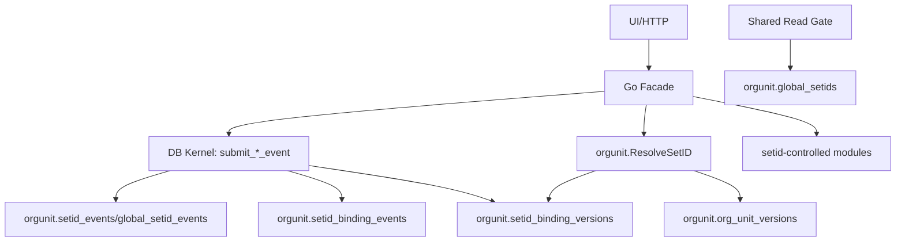

# DEV-PLAN-070：SetID 绑定组织架构重构方案

**状态**: 进行中（2026-01-29 06:42 UTC）

## 1. 背景与上下文 (Context)
- **需求来源**：替代 `DEV-PLAN-028` 的 SetID 方案升级，落地“SetID 绑定组织架构 + 层级继承解析 + 单一共享层”新需求。
- **当前痛点**：`business_unit_id + record_group` 无法表达组织层级继承与双层（SHARE/DEFLT）语义，且与全域一致性与可审计性要求不匹配。
- **业务价值**：统一 SetID 绑定口径；**配置主数据显式 setid、业务数据用 org_unit 解析 setid**，保证 `as_of` 口径可复现与可审计。
- 现有 SetID 方案以 `business_unit_id + record_group` 解析为主（见 `DEV-PLAN-028`），与“SetID 直接绑定组织架构并按层级继承”的新需求不匹配。
- 新增“实例级 SHARE + 租户级 DEFLT”双层 SetID 语义，需要在数据模型与解析入口上明确边界与可审计规则。

## 2. 目标与非目标 (Goals & Non-Goals)
### 2.1 核心目标
- [ ] SetID 绑定组织架构，支持“就近祖先覆盖”的继承解析。
- [ ] SetID 仅允许绑定在业务单元节点（`is_business_unit=true`），根组织强制为业务单元。
- [ ] **配置主数据入口**必须显式 `setid`；**业务数据入口**通过 `org_unit_id` 解析 `setid` 以选择可用配置集。
- [ ] 完成 SetID **全域迁移**：覆盖所有 setid-controlled 业务域与入口，统一切换到“配置主数据显式 setid + 业务数据通过 org_unit 解析 setid 并落库审计”。
- [ ] 移除 `business_unit_id` 与 `record_group` 设计（全域清理，禁止残留引用）。
- [ ] 实例级共享 SetID：`SHARE`（Shared），只读给租户、仅 SaaS 厂商维护。
- [ ] 租户级默认 SetID：`DEFLT`（Default），绑定租户根组织。
- [ ] SetID 格式统一为 `[A-Z0-9]{5}` 并存储为大写。
- [ ] 业务主数据域仅使用租户 SetID，不引入 `SHARE`（共享层仅在白名单入口可读）。
- [ ] 继续满足 One Door、No Tx/No RLS、Valid Time（date）等仓库级不变量。

### 2.2 非目标
- 不引入 PeopleSoft 的 TableSet Security / Tree Controls。
- 不提供 `SHARE` 与租户数据的自动合并规则（仅明确“可读入口/显式范围”）。
- 不引入跨 SetID 的自动合并/同步/回填规则（仅显式绑定与继承解析，无“运行时合并”）。
- 不实现 SetID 克隆/补充入口（本阶段仅支持继承与显式绑定切换）。
- 不将 `SHARE` 作为“全局到处可见”的通用入口；仅在白名单基础主数据/配置入口展示。

### 2.3 工具链与门禁（SSOT 引用）
- **触发器清单（勾选本计划命中的项）**：
  - [ ] Go 代码（`go fmt ./... && go vet ./... && make check lint && make test`）
  - [ ] Authz（`make authz-pack && make authz-test && make authz-lint`）
  - [ ] 路由治理（`make check routing`；必要时更新 `config/routing/allowlist.yaml`）
  - [ ] DB 迁移 / Schema（按模块 `make <module> plan/lint/migrate ...`）
  - [ ] sqlc（`make sqlc-generate`）
  - [ ] 文档（`make check doc`）
  - [ ] E2E（`make e2e`）
  - [ ] `.templ` / Tailwind（`make generate && make css`，并确保生成物提交）
- **新增门禁**：禁止新代码再引用 `business_unit_id` / `record_group`（对齐 `AGENTS.md`）。
- **证据要求**：PR/执行记录必须包含“命中触发器 + 实际验证入口 + 结果”的证据块，并提供生成物 `git status --short` 为空的证明（若涉及生成物）。
- **SSOT 链接**：`AGENTS.md`、`docs/dev-plans/012-ci-quality-gates.md`、`Makefile`、`.github/workflows/quality-gates.yml`。

### 2.4 术语
- **实例级 SetID（SHARE）**：全实例唯一，面向“全国通用主数据/配置”。
- **租户级 SetID（DEFLT）**：每租户默认 SetID，绑定租户根组织。
- **组织绑定**：SetID 与组织节点绑定，子节点默认继承，允许下级覆盖。
- **业务单元（Business Unit）**：组织节点标记 `is_business_unit=true`（有效期内属性，来源于 Org 读模型）。
- **解析时间**：`ResolveSetID` 以 `as_of` 的 **date** 进行解析（Valid Time）；配置主数据入口不使用解析推导，业务数据入口使用解析结果。

## 3. 架构与关键决策 (Architecture & Decisions)
### 3.1 架构图 (Mermaid)


### 3.2 关键设计决策 (ADR 摘要)
- **解析入口**：`ResolveSetID(tenant_id, org_unit_id, as_of_date) -> setid`（fail-closed；用于 SetID 管理/审计与业务数据选择配置集；配置主数据写入口不得使用推导）。
- **根节点绑定**：租户根组织必须绑定 `DEFLT`，强制存在且不可禁用。
- **绑定范围**：SetID 仅允许绑定到 `is_business_unit=true` 的节点；根组织强制为业务单元。
- **共享层**：`SHARE` 仅用于实例级“通用主数据/配置”，不参与组织绑定解析。
- **单一共享 SetID**：本阶段仅允许一个实例级共享 SetID（`SHARE`）。
- **物理隔离**：共享层数据与租户层表不共表，使用独立表/命名空间；租户表 RLS 保持 `tenant_id = app.current_tenant`，不引入 OR。
- **配置主数据入口**：必须显式传入 `setid`；禁止通过 `org_unit_id` 推导；不读取 `SHARE`。
- **业务数据入口**：可通过 `org_unit_id` 解析得到 `setid` 以筛选配置数据，并将解析结果落库用于审计。
- **SetID 格式**：`[A-Z0-9]{5}`，统一存储为大写。
- **版本固定**：`ResolveSetID` 严格以 `as_of_date` 固化组织与绑定版本，不依赖“当前组织树”。
- **绑定存储权威**：仅采用 `setid_binding_events` + `setid_binding_versions`（无并行绑定表）。
- **写入快照**：配置主数据写入口记录显式 `setid`；业务数据写入口记录解析得到的 `setid` 与业务有效期；不记录 `resolved_setid*`，禁止默认 `current_date`。
- **历史读取口径**：业务读取/回放以 `ResolveSetID(..., as_of_date)` 重新解析为准；写入落库的 `setid` 仅用于审计/排障，不参与业务配置选择。
- **全局租户常量**：新增 `orgunit.global_tenant_id()` 作为唯一来源；共享层表 `tenant_id` 固定为该值，并与真实租户 ID 保证不冲突（保留常量/哨兵记录）。
- **集合ID范围**：全模块共用一个 SetID 集合（不按模块拆分）。
- **继承与补充**：子组织默认继承父级 SetID；本阶段不提供克隆/补充入口，不做运行时合并。

### 3.3 规则与不变量
- 仅允许 `SHARE` 与 `DEFLT` 作为保留字；不可重命名、不可禁用。
- `SHARE` 仅存在于共享层表；租户级不可创建或绑定 `SHARE`。
- `DEFLT` 必须存在于每个租户，并绑定租户根组织。
- `DEFLT` / `SHARE` 状态固定为 `active`；DB 约束 + 写入口双重阻断禁用操作。
- **显式 SetID**：配置主数据写入口必须显式传入 `setid`（缺失/非法/`SHARE` 一律 fail-closed）；业务数据写入口使用 `org_unit_id + as_of_date` 解析并落库。
- **业务单元约束**：根组织 `is_business_unit=true`；绑定事件必须验证 `org_unit_versions.is_business_unit=true`（`as_of_date`）。
- **解析前提（ResolveSetID）**：目标组织节点在 `as_of_date` 必须为 `active`；若已禁用则解析失败（fail-closed）。
- **祖先过滤（ResolveSetID）**：继承查找仅考虑在 `as_of_date` 为 `active` 的祖先节点；禁用节点的绑定不参与解析。
- **DB 级硬约束**：共享层表 `tenant_id = orgunit.global_tenant_id()`；租户表 `setid <> 'SHARE'`；`setid_binding_versions` 禁止 `SHARE`。
- **Validity 语义**：`setid_binding_versions.validity` 使用 `[start_date, end_date)`（date range），同一 `tenant_id + org_id` 不得重叠（exclusion 约束）。
- **共享读开关**：共享层读取必须显式开启 `app.allow_share_read=on`（或等价机制），缺省即拒绝。
- **写入口约束**：共享层写入必须走专用 kernel 事件入口，且 `app.current_actor_scope=saas`，缺失/未知直接拒绝。
- **One Door**：SetID/绑定写入必须走 kernel 事件入口（`submit_setid_event` / `submit_setid_binding_event` / `submit_global_setid_event`）；DB 权限仅授予执行权限，禁止直接写表。
- 业务主数据相关表禁止使用 `SHARE`（通过约束或写入口校验硬性阻断）。
- 不提供“父子 setid 运行时合并/覆盖”语义；本阶段仅支持继承或显式绑定切换。

### 3.4 设计概述
1. **数据分层**：
   - 共享层：与租户层物理隔离，使用独立表/命名空间；只读给租户且需显式开启共享读开关。
   - 租户层：各租户维护自己的 SetID（含 `DEFLT`），与组织架构绑定。
2. **组织绑定**：
   - 通过 `setid_binding_versions` 记录绑定版本，按有效期生效（date granularity）。
   - 解析时从当前组织向上查找最近绑定；无绑定即错误（理论上不会发生，因为根节点强制 `DEFLT`）。
3. **入口与交互**：
   - SetID 管理面移除 BU 相关表单，改为“组织树 + 绑定编辑”。
  - 配置主数据入口必须显式 `setid` 并展示；业务数据入口按 `org_unit_id` 解析 SetID 以加载可选配置。
4. **写入口快照**：
  - 业务数据写入口记录解析得到的 `setid` 与业务有效期（仅用于审计/查询，不替代当前规则）。

## 4. 数据模型与约束 (Data Model & Constraints)
### 4.1 Schema 定义 (SQL/Atlas)
```sql
CREATE TABLE orgunit.setids (
  tenant_id uuid NOT NULL,
  setid text NOT NULL,
  name text NOT NULL,
  status text NOT NULL DEFAULT 'active',
  created_at timestamptz NOT NULL DEFAULT now(),
  updated_at timestamptz NOT NULL DEFAULT now(),
  CONSTRAINT setids_pk PRIMARY KEY (tenant_id, setid),
  CONSTRAINT setids_format_check CHECK (setid ~ '^[A-Z0-9]{5}$'),
  CONSTRAINT setids_share_forbidden CHECK (setid <> 'SHARE'),
  CONSTRAINT setids_deflt_active_check CHECK (setid <> 'DEFLT' OR status = 'active')
);

CREATE TABLE orgunit.global_setids (
  tenant_id uuid NOT NULL DEFAULT orgunit.global_tenant_id(),
  setid text NOT NULL DEFAULT 'SHARE',
  name text NOT NULL,
  status text NOT NULL DEFAULT 'active',
  created_at timestamptz NOT NULL DEFAULT now(),
  updated_at timestamptz NOT NULL DEFAULT now(),
  CONSTRAINT global_setids_pk PRIMARY KEY (tenant_id, setid),
  CONSTRAINT global_setids_share_only CHECK (setid = 'SHARE'),
  CONSTRAINT global_setids_tenant_check CHECK (tenant_id = orgunit.global_tenant_id()),
  CONSTRAINT global_setids_status_check CHECK (status = 'active')
);

CREATE TABLE orgunit.setid_binding_events (
  id bigserial PRIMARY KEY,
  event_id uuid NOT NULL,
  tenant_id uuid NOT NULL,
  org_id uuid NOT NULL,
  event_type text NOT NULL,
  effective_date date NOT NULL,
  payload jsonb NOT NULL DEFAULT '{}'::jsonb,
  request_id text NOT NULL,
  initiator_id uuid NOT NULL,
  transaction_time timestamptz NOT NULL DEFAULT now(),
  created_at timestamptz NOT NULL DEFAULT now(),
  CONSTRAINT setid_binding_events_event_id_unique UNIQUE (event_id),
  CONSTRAINT setid_binding_events_payload_is_object_check CHECK (jsonb_typeof(payload) = 'object')
);

CREATE TABLE orgunit.setid_binding_versions (
  id bigserial PRIMARY KEY,
  tenant_id uuid NOT NULL,
  org_id uuid NOT NULL,
  setid text NOT NULL,
  validity daterange NOT NULL,
  last_event_id bigint NOT NULL REFERENCES orgunit.setid_binding_events(id),
  created_at timestamptz NOT NULL DEFAULT now(),
  updated_at timestamptz NOT NULL DEFAULT now(),
  CONSTRAINT setid_binding_setid_fk FOREIGN KEY (tenant_id, setid) REFERENCES orgunit.setids (tenant_id, setid),
  CONSTRAINT setid_binding_no_share CHECK (setid <> 'SHARE'),
  CONSTRAINT setid_binding_validity_check CHECK (lower_inc(validity) AND NOT upper_inc(validity)),
  CONSTRAINT setid_binding_no_overlap EXCLUDE USING gist (
    tenant_id WITH =,
    org_id WITH =,
    validity WITH &&
  )
);
```

#### 4.1.1 租户 SetID 主表（tenant_id 维度）
- `orgunit.setids`：
  - `tenant_id`
  - `setid`、`name`、`status`、`created_at`、`updated_at`
  - 约束：`setid ~ '^[A-Z0-9]{5}$'`；`setid <> 'SHARE'`；`DEFLT` 仅允许在租户 tenant；`setid='DEFLT'` 时 `status='active'`；`UNIQUE (tenant_id, setid)`。
- `orgunit.setid_events`：保持事件溯源（One Door）。

#### 4.1.2 共享 SetID 表（独立）
- `orgunit.global_setids`：
  - `tenant_id`（固定为 `orgunit.global_tenant_id()`）
  - `setid`、`name`、`status`、`created_at`、`updated_at`
  - 约束：`setid = 'SHARE'`；`tenant_id = orgunit.global_tenant_id()`；`status='active'`；`UNIQUE (tenant_id, setid)`。
- `orgunit.global_setid_events`：共享层事件溯源（仅 SaaS 写入）。

#### 4.1.3 组织绑定表（权威）
- `orgunit.setid_binding_events`：记录绑定变更事件。
- `orgunit.setid_binding_versions`：
  - `tenant_id`, `org_id`, `setid`, `validity`, `last_event_id`, `created_at`, `updated_at`（`validity` 为 `[start_date, end_date)` 的 `daterange`）
  - 约束：同一 `tenant_id + org_id` 的有效期不得重叠（exclusion）；`setid <> 'SHARE'`；`setid` 必须为租户级 SetID（禁止 `SHARE`）。

#### 4.1.4 移除/废弃
- 移除 `orgunit.business_units`、`orgunit.set_control_mappings` 及相关事件表与函数。
- 移除 `record_group` 相关字段/函数/枚举。

#### 4.1.5 索引与性能（最小要求）
- `orgunit.org_unit_versions` 的 `node_path` 与 `validity` 需具备索引以支持祖先查询与版本筛选。
- `orgunit.org_unit_versions` 需包含 `is_business_unit` 字段（由 Org 模块提供，见 `DEV-PLAN-026`）。
- `orgunit.setid_binding_versions` 需支持 `tenant_id + org_id + validity` 的组合查询。

### 4.2 迁移策略
- **Up**：新增组织绑定表与解析函数；创建 `orgunit.global_tenant_id()` 哨兵与共享层约束；各业务域改为“配置主数据显式 setid 输入 + 业务数据通过 org_unit 解析 setid 并落库审计”。
- **Down**：生产环境不执行破坏性 Down；回滚走“环境级停写 + 修复后重试”，并保持无 legacy 双链路。
- **切换原则**：全域一次性切换；停写窗口内完成切换；**禁止双写/兼容兜底**（No Legacy）。
- **准备期**：
  - 依赖清单（冻结范围，2026-01-25 03:21 UTC）：
    - 文档（历史/弃用）：`docs/dev-plans/028-setid-management.md`（保留历史口径，含 `business_unit_id` / `record_group`）。
    - 文档（历史说明）：`docs/dev-plans/030-position-transactional-event-sourcing-synchronous-projection.md`（更新说明仍提及旧口径）。
    - 文档（本方案）：`docs/dev-plans/070-setid-orgunit-binding-redesign.md`（目标/风险/验收处保留“清理项”描述）。
    - 代码/DB/迁移/API/路由/测试：当前无 `business_unit_id` / `record_group` 残留引用（全仓检索确认）。
  - 数据校验：存量 `setid` 格式（全大写 + 5 位）、根组织 `is_business_unit=true`、既有绑定有效期与缺失绑定清单。
  - 演练：在预发布环境跑完整门禁与 E2E，验证“配置主数据显式 setid + 业务数据 org_unit 解析 setid”全链路。
- **切换窗口（停写）**：
  - 环境级停写：关闭所有 `submit_*` 写入口（API/HTMX/UI），仅允许只读验证。
  - 执行迁移：更新 schema/函数/迁移，部署新入口与解析链路。
  - Bootstrap：确保 `DEFLT` 存在且根组织绑定 `DEFLT`；共享层 `SHARE` 保持只读。
  - 回归验证：跑关键门禁与 E2E；确认无 `SETID_BINDING_MISSING`/RLS 误拒绝。
  - 复写入：验证通过后解除停写；立即移除旧入口与旧结构。
- 数据层：删除 BU/record_group 相关表与函数；新增组织绑定表与解析函数；创建 `orgunit.global_tenant_id()` 哨兵与共享层约束。
- 现有租户：自动创建 `DEFLT`，并把租户根组织绑定至 `DEFLT`（bootstrap）。
- 现有租户：租户根组织必须标记为 `is_business_unit=true`（如现有数据不满足，需先修复再切换）。
- 现有数据：校验并规范化存量 `setid`（全大写 + 5 位），不合规数据必须在切换前修复或阻断。
- 其他组织绑定不自动推断；需要在上线后由管理员补齐。
- setid-controlled 业务域：
  - 移除 `business_unit_id` / `record_group` 输入与字段。
  - 配置主数据显式传入 `setid`；业务数据按 `org_unit_id` 解析 `setid`，并记录解析结果用于审计。
- 不保留“旧解析入口”或“兼容分支”，避免 legacy 双链路。

## 5. 接口契约 (API Contracts)
### 5.1 JSON API：租户 SetID（Tenant）
- `POST /orgunit/api/setids`
  - Request（JSON）：
    - `setid`（必填，`[A-Z0-9]{5}`）
    - `name`（必填）
    - `request_id`（必填）
  - Response（201）：`{ "setid": "S2601", "status": "active" }`
  - Error Codes：`SETID_INVALID_FORMAT` / `SETID_RESERVED_WORD` / `SETID_ALREADY_EXISTS` / `RLS_TENANT_CONTEXT_MISSING`

### 5.2 JSON API：组织绑定
- `POST /orgunit/api/setid-bindings`
  - Request（JSON）：
    - `org_unit_id`（必填，uuid）
    - `setid`（必填，租户级 SetID）
    - `effective_date`（必填，`YYYY-MM-DD`）
    - `request_id`（必填）
  - Response（201）：`{ "org_unit_id": "...", "setid": "...", "effective_date": "..." }`
  - Error Codes：`ORG_NOT_FOUND_AS_OF` / `ORG_INACTIVE_AS_OF` / `ORG_NOT_BUSINESS_UNIT_AS_OF` / `SETID_NOT_FOUND` / `SETID_DISABLED` / `SETID_SHARE_FORBIDDEN` / `SETID_BINDING_OVERLAP` / `RLS_TENANT_CONTEXT_MISSING`

### 5.3 JSON API：共享层 SetID（SaaS only）
- `POST /orgunit/api/global-setids`
  - Request（JSON）：
    - `name`（必填）
    - `request_id`（必填）
  - Response（201）：`{ "setid": "SHARE", "status": "active" }`
  - Error Codes：`ACTOR_SCOPE_FORBIDDEN` / `RLS_TENANT_CONTEXT_MISSING`
- `GET /orgunit/api/global-setids`
  - 仅共享读取专用入口/白名单可用（服务端必须在事务内设置 `app.current_tenant=orgunit.global_tenant_id()` 与 `app.allow_share_read=on`）。
  - Response（200）：`[{ "setid": "SHARE", "name": "...", "status": "active" }]`
  - Error Codes：`SHARE_READ_FORBIDDEN` / `RLS_TENANT_CONTEXT_MISSING`

### 5.4 JSON API：业务单元标记
- `POST /orgunit/api/org-units/set-business-unit`
  - Request（JSON）：
    - `org_unit_id`（必填，uuid）
    - `effective_date`（必填，`YYYY-MM-DD`）
    - `is_business_unit`（必填，bool）
    - `request_id`（必填）
  - Response（201）：`{ "org_unit_id": "...", "is_business_unit": true }`
  - Error Codes：`ORG_NOT_FOUND_AS_OF` / `ORG_INACTIVE_AS_OF` / `ORG_VALIDITY_OVERLAP` / `RLS_TENANT_CONTEXT_MISSING`

### 5.5 HTMX / UI 交互（概要）
- `/org/setid`：
  - `GET /org/setid?as_of=YYYY-MM-DD`：展示 SetID 列表 + 组织树 + 绑定编辑。
  - `POST /org/setid?as_of=...`：
    - `action=create_setid`：`setid` + `name`
    - `action=bind_setid`：`org_unit_id` + `setid` + `effective_date`
  - 成功后 `303` 跳回 `GET`，失败返回带错误的表单片段。
- `/org/nodes`：
  - `POST /org/nodes?as_of=...` 支持设置业务单元标记（触发 `SET_BUSINESS_UNIT` 事件）。
- setid-controlled 入口：
  - 配置主数据（如 JobCatalog）：`GET/POST` 必须显式携带 `setid` + `as_of`（UI）/`setid` + `effective_date`（API）；页面展示 `setid`，缺失/非法必须 fail-closed。
  - 业务数据（如 Position）：`org_unit_id` 必填，用于解析 `setid` 以加载可选配置；不要求手工选择 `setid`。
  - 示例：`/org/job-catalog?as_of=YYYY-MM-DD&setid=ABCDE`、`/org/positions?as_of=YYYY-MM-DD&org_unit_id=...`。
  - 共享白名单配置（shared-only）：使用独立入口或显式 `share=on`，只读共享表；租户不可写，禁止与租户配置入口混用。

### 5.6 共享白名单配置入口（新增）
- 共享白名单属于配置主数据入口的一种**显式模式**：
  - **租户配置模式**：必须显式 `setid`；只读/写租户表；禁止读取 `SHARE`。
  - **共享配置模式**：显式 `share=on`（或独立 `/org/share/*` 路由）；只读共享表；租户写入一律拒绝。
- 物理隔离与读开关：
  - 共享读取必须在同一事务内 `SET LOCAL app.current_tenant = orgunit.global_tenant_id()` + `SET LOCAL app.allow_share_read=on`。
  - 禁止 SQL OR 合并共享与租户数据，应用层需要合并时以两次请求完成。
- 白名单与权限：
  - 仅白名单 scope 允许共享配置模式。
  - 共享写入仅 SaaS 允许（`app.current_actor_scope=saas`）。
- UI/接口文案必须区分“业务口径（重新解析）”与“审计口径（写入记录）”，避免误解。

## 6. 核心逻辑与算法 (Business Logic & Algorithms)
### 6.1 解析算法（fail-closed）
> 解析入口用于 SetID 管理/审计与业务数据选择配置集；配置主数据写入口不得依赖 `ResolveSetID` 推导 setid。
1. 校验 `tenant_id`、`org_unit_id`、`as_of_date`（`as_of_date` 必填，禁止默认 `current_date`）。
2. 在 `orgunit.org_unit_versions` 取 `org_unit_id` 的 `node_path`（`as_of_date` 有效且 `status='active'`）；若不存在则返回 `SETID_ORG_INACTIVE`（或复用 `ORG_NOT_FOUND_AS_OF`，需统一错误码表）。
3. 基于 `node_path` + `as_of_date` 找到所有 **active 且 is_business_unit=true** 的祖先节点，在 `setid_binding_versions` 中按 `tenant_id` + `as_of_date` 查询绑定，选 **最近祖先**（最大层级）。
4. 若未命中，返回 `SETID_BINDING_MISSING`（理论上不应出现，因为根节点强制绑定 `DEFLT`）。
5. 校验目标 SetID 状态为 active，返回 `setid`。

### 6.2 写入口（One Door）
- `submit_setid_event(...)`：租户 SetID 的新增/启停等；事件表 `setid_events` 为 SoT，投射到 `setids`。
- `submit_setid_binding_event(...)`：绑定/解绑；事件表 `setid_binding_events` 为 SoT，投射到 `setid_binding_versions`（含 validity split 逻辑）；必须验证 `org_unit_versions.is_business_unit=true`（`as_of_date`）。
- `submit_global_setid_event(...)`：共享层写入（仅 SaaS）；事件表 `global_setid_events` 为 SoT，投射到 `global_setids`。
- 上述入口必须在事务内执行 `assert_current_tenant(p_tenant_id)`；共享层入口需校验 `app.current_actor_scope=saas`。
- 配置主数据写入口必须显式传入 `setid`（`[A-Z0-9]{5}`、`active` 且非 `SHARE`）；业务数据写入口可通过 `org_unit_id` 解析 `setid` 并落库用于审计。

### 6.3 绑定投射（validity split）
1. 开启事务并注入 `app.current_tenant`。
2. 校验 `org_unit_id` 在 `effective_date` as-of 下存在且 `is_business_unit=true`。
3. 校验 `setid` 存在且 active，且不为 `SHARE`。
4. 获取当前 `org_id` 的有效期切片（`FOR UPDATE`）。
5. 若存在与 `effective_date` 重叠的切片，按 `[start, effective_date)` 与 `[effective_date, end)` 拆分，并写入新绑定切片。
6. 确保 `validity` 无重叠（exclusion constraint 兜底），提交事务。

## 7. 安全与鉴权 (Security & Authz)
### 7.1 RLS 与租户隔离
- 所有表继续启用 RLS 并依赖 `app.current_tenant`（共享表也要求上下文注入）。
- 所有读写必须在显式事务内注入 `app.current_tenant`；缺失即 fail-closed（对齐 No Tx, No RLS）。
- **共享层读**：仅当 `app.allow_share_read=on` 时允许读取共享表（`tenant_id = orgunit.global_tenant_id()`），默认拒绝。
- **共享层读入口**：仅允许通过专用函数/视图/仓库层入口读取；入口必须在同一事务内 `SET LOCAL app.current_tenant = orgunit.global_tenant_id()` 且启用 `app.allow_share_read=on`，否则一律拒绝。
- **共享层写**：仅允许 SaaS 厂商身份写入（必须走专用写入口并强制校验 `app.current_actor_scope=saas`）；scope 缺失/未知即 fail-closed。
- 租户侧不能写 `SHARE`，也不能把 `SHARE` 绑定到组织节点。

#### 7.1.1 共享层读写入口合同（global_tenant）
- `orgunit.global_tenant_id()` 固定返回 `00000000-0000-0000-0000-000000000000`，作为共享层唯一 tenant；哨兵租户必须存在，且禁止与真实租户冲突。
- 共享层读入口：仅白名单入口/专用仓库层函数可调用；必须在同一事务内 `SET LOCAL app.current_tenant = orgunit.global_tenant_id()` + `SET LOCAL app.allow_share_read = on`；否则 RLS 拒绝。
- 共享层写入口：仅 `submit_global_setid_event`；必须在同一事务内 `SET LOCAL app.current_tenant = orgunit.global_tenant_id()` + `SET LOCAL app.current_actor_scope = 'saas'`；否则 RLS 拒绝。

### 7.2 Casbin 策略（示意）
- Subject：`tenant:{tenant_id}:user:{user_id}` / `saas:{user_id}`
- Object：`org.setid` / `org.setid_binding` / `org.org_unit` / `org.share_read`
- Action：`read` / `admin`
- 共享层只读入口必须绑定 `org.share_read:read` 权限，缺失即 403。

### 7.3 共享层白名单（初版）
- 共享层仅在白名单入口可见，不覆盖业务主数据入口（如 JobCatalog）。
- 国家/省市/地点
- 学校
- 通用数据分类（学历类型、资格证书等）
- 共享层新增范围必须更新本节清单并补齐验收。
  - UI/选择器需标注“共享/只读”，共享项不可编辑。
  - 白名单入口必须显式设置 `SET LOCAL app.current_tenant = orgunit.global_tenant_id()` + `SET LOCAL app.allow_share_read = on`。

## 8. 依赖与里程碑 (Dependencies & Milestones)
### 8.1 依赖
- `docs/dev-plans/026-org-transactional-event-sourcing-synchronous-projection.md`（`org_unit_versions.is_business_unit` 与 `SET_BUSINESS_UNIT` 事件）
- `docs/dev-plans/021-pg-rls-for-org-position-job-catalog.md`（RLS fail-closed）
- `docs/dev-plans/019-tenant-and-authn.md`（租户上下文注入）
- `docs/dev-plans/022-authz-casbin-toolchain.md`（权限点冻结）
- `docs/dev-plans/029-job-catalog-transactional-event-sourcing-synchronous-projection.md` / `docs/dev-plans/030-position-transactional-event-sourcing-synchronous-projection.md`
- `docs/dev-plans/012-ci-quality-gates.md`（门禁执行）

### 8.2 里程碑
1. [X] 更新 `DEV-PLAN-028` 为“被 DEV-PLAN-070 取代”的说明，并同步 `Doc Map`（2026-01-24 04:25 UTC）。
2. [X] 梳理 `business_unit_id` / `record_group` 依赖清单并冻结范围（2026-01-25 03:21 UTC）。
3. [X] 更新相关 dev-plans 与测试用例（TP-060/子计划等），统一“全域迁移”口径，改为“配置主数据显式 setid、业务数据通过 org_unit 解析 setid”，并移除 BU/record_group 约束。（2026-01-25 11:01 UTC）
  - dev-plans：`docs/dev-plans/028-setid-management.md`（标注历史/弃用口径，指向 070）；`docs/dev-plans/029-job-catalog-transactional-event-sourcing-synchronous-projection.md`（配置主数据显式 setid）；`docs/dev-plans/030-position-transactional-event-sourcing-synchronous-projection.md`（Position 由 org_unit 解析 setid + job_profile 必选）；`docs/dev-plans/060-business-e2e-test-suite.md`（数据集/步骤改为“配置显式 setid + 业务解析 setid”）；`docs/dev-plans/062-test-tp060-02-master-data-org-setid-jobcatalog-position.md`（步骤/断言/契约引用改为 org_unit 解析 setid + as_of）。
  - 测试用例：`e2e/tests/tp060-02-master-data.spec.js`（Position 由 org_unit 派生 setid、Job Profile 必选）；`e2e/tests/tp060-03-person-and-assignments.spec.js`（Position 创建不要求 setid，Job Profile 必选）；`e2e/tests/m3-smoke.spec.js`（Position 创建不要求 setid）；`internal/server/jobcatalog_test.go`（显式 setid 入口仍保留）；`internal/server/staffing_test.go`（Position 必选 job_profile + org_unit 解析 setid）；`internal/server/handler_test.go`（Position 入口去 setid）；`internal/server/setid_test.go`（SetID 管理改组织绑定）。
4. [X] 制定迁移窗口与切换策略（停写切换、无双写）（2026-01-25 00:45 UTC）。
5. [X] 明确 `orgunit.global_tenant_id()` 与共享层 RLS/读写入口合同（含共享读取专用入口）（2026-01-25 01:08 UTC）。
6. [X] 将 `DEV-PLAN-026` 的 schema/函数/迁移落到模块实现（含 `is_business_unit` 与 `SET_BUSINESS_UNIT`），并同步 SetID 绑定入口的业务单元校验（2026-01-25 01:15 UTC）。
7. [X] 设计并实现 `setid_binding_events` + `setid_binding_versions`（One Door）（2026-01-25 01:18 UTC）。
8. [X] 切换解析入口与调用链（Go/SQL），配置主数据入口显式 `setid`，业务数据入口改为 `org_unit_id` 解析 `setid`。（2026-01-25 11:01 UTC）
9. [X] 改造 UI/路由/鉴权（去 BU/record_group、加 org 绑定 + 业务单元标记编辑 + 权限点补齐），补齐配置主数据的显式 `setid` 选择与展示，并展示业务数据的解析结果。（2026-01-29 01:22 UTC）
10. [X] 完成迁移脚本与数据 bootstrap（DEFLT + root 绑定），并修复存量 `setid` 规范（5 位/大写）（2026-01-25 02:57 UTC）。
11. [X] 补齐门禁与测试用例（参考 `AGENTS.md` 与 `DEV-PLAN-012`），覆盖“配置主数据显式 setid + 业务数据 org_unit 解析 setid”的新口径。（2026-01-25 11:01 UTC）

### 8.3 后续扩展（不在本阶段）
- SetID 克隆：新增 `source_setid/source_snapshot_at` 字段与克隆入口；提供“基于快照复制”的补充能力（不做运行时合并）。
- 组织树/绑定变更影响评估工具或后台提示：列出潜在受影响子树与业务入口。

## 9. 测试与验收标准 (Acceptance Criteria)
### 9.1 风险与缓解
- **共享层读写边界**：风险评估：高。若入口未显式设置共享读开关或写入口/会话标记缺漏，会导致越权或误拒绝。缓解：共享层独立表 + DB 级硬约束（共享表固定 `global_tenant`、绑定表禁 `SHARE`）+ `app.allow_share_read` 默认拒绝 + 写入口强校验 `app.current_actor_scope`。
- **组织结构变更导致继承结果波动**：风险评估：中。组织调整会改变 `ResolveSetID` 的“最近祖先”结果，影响业务写入时使用的配置集与解析展示。缓解：解析严格以 `as_of_date` 固化版本；写入口落库解析结果用于审计；变更影响评估作为后续增强。
- **业务单元标记错误**：风险评估：中。若业务单元标记缺漏或错误，会导致绑定被拒绝或落在错误节点。缓解：根节点强制业务单元 + 绑定入口校验 + UI 显示业务单元标记。
- **删除 BU/record_group 影响面广**：风险评估：高。牵涉 schema、API、UI、解析入口与数据迁移。缓解：依赖清单 + 迁移窗口（停写切换、无双写）+ 门禁禁止新引用。
- **组织变更影响解析**：组织调整可能影响绑定继承的可视化查询。缓解：绑定有效期与 `as_of_date` 联动。
- **存量 SetID 不合规**：历史数据可能不满足 5 位/全大写规范，切换时会导致解析或约束失败。风险评估：中。缓解：迁移前完成全量校验与修复；约束先 `NOT VALID` 后验证。

### 9.2 测试计划
- 单元测试：解析算法、validity split、错误码映射、共享层读写开关与保留字约束。
- 集成测试：RLS fail-closed、绑定继承链路、as_of 变更对解析的影响。
- E2E：TP-060-02/03 口径更新为“JobCatalog 显式 setid、Position 由 org_unit 解析 setid + Job Profile 必选”后仍可跑通（SetID→JobCatalog→Position→Assignments）。
- 门禁与证据：按 §2.3 触发器执行并在执行记录中提供证据块。

### 9.3 验收标准
- [X] `SHARE` 仅存在于全局 tenant，可被租户读取但不可写。
- [X] 共享层数据表与租户表物理隔离，租户表 RLS 不引入 `global` OR 条件。
- [X] 仅允许单一共享 SetID（`SHARE`），且状态固定为 `active`。
- [X] 每个租户自动拥有 `DEFLT`，根组织强制绑定 `DEFLT`。
- [X] `DEFLT` 状态固定为 `active`，禁用/删除必须被拒绝。
- [ ] `orgunit.global_tenant_id()` 对应哨兵租户存在，且与真实租户 ID 不冲突。
- [ ] 根组织 `is_business_unit=true`。
- [X] `ResolveSetID(tenant_id, org_unit_id, as_of_date)` 可解析并遵守继承规则。
- [X] 目标组织节点在 `as_of_date` 必须为 `active`；禁用节点解析失败（fail-closed）。
- [X] SetID 仅可绑定到业务单元节点（`is_business_unit=true`）。
- [X] `/org/nodes` 可修改业务单元标记并持久化（`SET_BUSINESS_UNIT`），权限不足时必须被拒绝。
- [X] 业务主数据域仅使用租户 SetID：配置主数据必须显式传入 `setid`，业务数据通过 `org_unit_id` 解析 setid，不读取 `SHARE`。
- [ ] 共享层仅在白名单入口可见，UI 文案标注“共享/只读”，共享项不可编辑。
- [ ] 共享白名单配置入口必须显式 `share=on` 或独立路由；禁止与租户配置入口混用。
- [ ] 共享读取必须显式开启共享读开关，且不得用 SQL OR 合并租户/共享数据。
- [X] 移除 `business_unit_id` 与 `record_group` 的实现与存量结构。
- [X] `business_unit_id` / `record_group` 全局无新增引用（依赖清单与门禁验证）。
- [X] SetID 格式更新为 `[A-Z0-9]{5}` 并统一校验。
- [X] 配置主数据写入口必须显式 `setid` 并落库；业务数据写入口必须解析并记录 `setid` 与 `as_of_date` 用于审计，禁止默认 `current_date` 或记录 `resolved_setid*`。
- [ ] 历史读取口径以 `ResolveSetID(..., as_of_date)` 重新解析为准；审计 `setid` 仅用于审计/排障。
- [ ] UI/接口必须标注业务口径与审计口径的差异说明。
- [X] 租户写 `SHARE` 必失败（DB 约束 + RLS + 入口校验）。
- [X] SaaS 写 `SHARE` 必成功（仅通过专用写入口）。
- [X] 租户读取 `SHARE` 仅只读可见。
- [X] 共享读取必须显式设置 `app.current_tenant=orgunit.global_tenant_id()` + `app.allow_share_read=on` 才可访问。
- [X] 未设置或未知 `app.current_actor_scope` 的写请求必失败。
- [ ] SetID/绑定写入必须通过 kernel 入口，禁止直接写表。

## 10. 运维与监控 (Ops & Monitoring)
- Feature Flag：不引入开关切换（对齐 `AGENTS.md` 的“早期阶段不过度运维”）。
- 关键日志：保留 `request_id` / `tenant_id` / `setid`（涉及绑定操作时追加 `org_unit_id`），便于审计与排障。
- 回滚方案：环境级停写 + 修复后重试；禁止 legacy 双链路或回退通道。

## 11. 关联文档
- `docs/dev-plans/028-setid-management.md`
- `docs/dev-plans/009-implementation-roadmap.md`
- `docs/dev-plans/012-ci-quality-gates.md`
- `docs/dev-plans/032-effective-date-day-granularity.md`
- `AGENTS.md`
