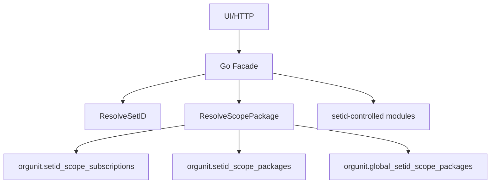

# DEV-PLAN-071：SetID Scope Package 订阅详细设计

**状态**: 草拟中（2026-01-29 06:48 UTC）

## 1. 背景与上下文 (Context)
- **需求来源**：`docs/dev-plans/070-setid-orgunit-binding-redesign.md`
- **当前痛点**：070 方案把 SetID 作为配置主数据的显式入口，但同一 SetID 只能指向一套“全域配置组合”，无法表达“同一 SetID 在不同配置域选择不同方案”，导致 SetID 膨胀与配置重复。
- **业务价值**：通过 `scope_code + scope_package` 实现配置方案的复用与组合，降低重复配置并保持可审计与可回放。

## 2. 目标与非目标 (Goals & Non-Goals)
- **核心目标**：
  - [ ] 保留“租户内全局唯一 SetID”口径与 070 的解析入口。
  - [ ] 引入 `scope_code` 与 `scope_package`，支持 `setid -> scope_code -> package` 订阅关系，并以 `as_of_date` 生效。
  - [ ] 共享包采用物理隔离表，读取必须显式共享读开关，且禁止 OR 读混用。
  - [ ] 新建 SetID 自动写入默认订阅（所有稳定 `scope_code` -> `DEFLT` 包）。
  - [ ] `ResolveScopePackage` 成为唯一权威入口，fail-closed。
  - [ ] 对齐 One Door / No Tx, No RLS / Valid Time（date）不变量。
  - [ ] 通过本计划触发的所有门禁（至少 `make check lint`，其余按 2.1 勾选项执行）。
- **非目标**：
  - 不做跨域运行时合并/覆盖规则。
  - 不引入旧 `setid` 直连配置表的兼容分支。
  - 不改变 070 的“org_unit 解析 SetID”主流程。
  - 不引入新的 Feature Flag（对齐 `AGENTS.md`）。
  - 共享白名单配置数据的具体业务表/入口由各模块另案落实，本计划只定义订阅治理与解析机制。

## 2.1 工具链与门禁（SSOT 引用）
- **触发器清单（勾选本计划命中的项）**：
  - [x] Go 代码（`go fmt ./... && go vet ./... && make check lint && make test`）
  - [x] `.templ` / Tailwind（`make generate && make css`，并确保生成物提交）
  - [ ] 多语言 JSON（`make check tr`）
  - [x] Authz（`make authz-pack && make authz-test && make authz-lint`）
  - [x] 路由治理（`make check routing`）
  - [x] DB 迁移 / Schema（按模块 `Makefile` 入口执行）
  - [ ] sqlc（如引入 sqlc 代码生成，则 `make sqlc-generate`）
  - [ ] Outbox（按 `DEV-PLAN-017` 与 runbook 约定执行与验收）
  - [x] 文档（`make check doc`）
- **SSOT 链接**：
  - `AGENTS.md`
  - `Makefile`
  - `.github/workflows/quality-gates.yml`

## 3. 架构与关键决策 (Architecture & Decisions)
### 3.1 架构图 (Mermaid)


### 3.2 关键设计决策 (ADR 摘要)
- **决策 1：引入 scope_package 层**
  - 选项 A：继续用 SetID 直接区分配置集。缺点：SetID 膨胀、无法组合。
  - 选项 B（选定）：新增 `scope_code + package` 订阅层，实现组合与复用。
- **决策 2：共享包物理隔离**
  - 选项 A：共享/租户共表并 OR 读取。缺点：违反 070 的隔离与 RLS 规则。
  - 选项 B（选定）：共享包独立表 + 显式共享读开关。
- **决策 3：默认订阅**
  - 选项 A：运行时缺订阅自动回退 `DEFLT`。缺点：隐式逻辑不可审计。
  - 选项 B（选定）：SetID 创建时显式写入 `DEFLT` 订阅，缺失订阅 fail-closed。

### 3.3 scope_code 划分与清单
- **划分原则（强制）**：
  - 配置域优先：以“可独立选择的一套配置方案”为边界，不以单表/字段为边界。
  - 强耦合同域：存在硬不变量或强引用关系的配置必须归同一 scope。
  - 生命周期独立才拆分：维护责任、变更频率、审计口径可独立时才允许拆分 scope。
  - 单一归属：每个 scope_code 只能归属一个模块。
  - 唯一映射：任一配置数据只能映射到一个 scope_code。
  - 前缀规则：scope_code 前缀仅表达归属模块，不表达共享/开通状态。
  - 格式规则：`scope_code` 使用 `^[a-z0-9_]{1,64}$`，不允许空格与中划线。
- **共享模式定义**：
  - `tenant-only`：只允许订阅租户包，禁止订阅共享包。
  - `shared-only`：只允许订阅共享包，禁止租户包。
  - `shared-allowed`：允许同时存在租户包与共享包（本期不启用，仅为扩展预留）。
- **scope_code 注册表（SSOT）**：
  - 以 DB 函数 `orgunit.scope_code_registry()` 固化范围清单，供写入口校验与默认订阅生成使用。
  - 任何新增/调整 scope_code 必须同步更新本文件清单与 `scope_code_registry()`。
  - `is_stable=true` 表示 SetID 创建时需要自动订阅的稳定 scope。
- **首批 scope_code 清单**：
  | scope_code | 归属模块 | 共享模式 | 范围说明 |
  | --- | --- | --- | --- |
  | `jobcatalog` | `jobcatalog` | `tenant-only` | 职位目录主数据（Job Family Group/Family/Level/Profile） |
  | `orgunit_geo_admin` | `orgunit` | `shared-only` | 国家/省市等行政区划 |
  | `orgunit_location` | `orgunit` | `shared-only` | 地点与地点类型 |
  | `person_school` | `person` | `shared-only` | 学校 |
  | `person_education_type` | `person` | `shared-only` | 学历类型 |
  | `person_credential_type` | `person` | `shared-only` | 资格证书/证照类型 |
- **配置数据登记清单（当前已知）**：
  | scope_code | 归属模块 | 配置表/入口 | 包字段 | 共享模式 |
  | --- | --- | --- | --- | --- |
  | `jobcatalog` | `jobcatalog` | DB: `jobcatalog.job_family_groups/job_families/job_levels/job_profiles`（含 `*_events/*_versions`、`job_profile_version_job_families`）；UI: `/org/job-catalog` | `package_id` | `tenant-only` |
  | `orgunit_geo_admin` | `orgunit` | 未落地（共享白名单，表/入口待定义） | `package_id` | `shared-only` |
  | `orgunit_location` | `orgunit` | 未落地（共享白名单，表/入口待定义） | `package_id` | `shared-only` |
  | `person_school` | `person` | 未落地（共享白名单，表/入口待定义） | `package_id` | `shared-only` |
  | `person_education_type` | `person` | 未落地（共享白名单，表/入口待定义） | `package_id` | `shared-only` |
  | `person_credential_type` | `person` | 未落地（共享白名单，表/入口待定义） | `package_id` | `shared-only` |
- **避免遗漏的流程约束**：
  - 新增配置数据必须在对应 dev-plan 中声明其 `scope_code` 并更新本清单。
  - 新增配置表若引入 `package_id`，必须补齐清单项与解析入口说明。
  - PR 评审必须检查：是否新增/调整配置数据、是否需要包选择、是否已登记 scope_code。

### 3.4 归属与调用链（明确）
- 治理元数据归 `orgunit`：维护 `setid_scope_packages` / `setid_scope_subscriptions`，提供 `orgunit.resolve_scope_package(...)`。
- 业务模块归属配置数据：写入口先解析 `package_id`，再把 `package_id` 写入业务配置表。
- 跨模块调用：通过 `pkg/**` 封装解析函数，禁止 Go 代码跨模块 import。

## 4. 数据模型与约束 (Data Model & Constraints)
> 具体建表需用户确认（对齐 `AGENTS.md` 新增表确认要求）。

### 4.1 Schema 定义 (SQL)
```sql
CREATE OR REPLACE FUNCTION orgunit.scope_code_registry()
RETURNS TABLE(scope_code text, owner_module text, share_mode text, is_stable boolean) AS $$
  VALUES
    ('jobcatalog', 'jobcatalog', 'tenant-only', true),
    ('orgunit_geo_admin', 'orgunit', 'shared-only', true),
    ('orgunit_location', 'orgunit', 'shared-only', true),
    ('person_school', 'person', 'shared-only', true),
    ('person_education_type', 'person', 'shared-only', true),
    ('person_credential_type', 'person', 'shared-only', true)
$$ LANGUAGE SQL IMMUTABLE;

CREATE OR REPLACE FUNCTION orgunit.scope_code_is_valid(p_scope_code text)
RETURNS boolean AS $$
  SELECT EXISTS (
    SELECT 1 FROM orgunit.scope_code_registry() WHERE scope_code = p_scope_code
  );
$$ LANGUAGE SQL IMMUTABLE;

CREATE OR REPLACE FUNCTION orgunit.scope_code_share_mode(p_scope_code text)
RETURNS text AS $$
  SELECT share_mode FROM orgunit.scope_code_registry() WHERE scope_code = p_scope_code
$$ LANGUAGE SQL IMMUTABLE;

CREATE TABLE orgunit.setid_scope_packages (
  tenant_id uuid NOT NULL,
  scope_code text NOT NULL,
  package_id uuid NOT NULL,
  package_code text NOT NULL,
  name text NOT NULL,
  status text NOT NULL DEFAULT 'active',
  created_at timestamptz NOT NULL DEFAULT now(),
  updated_at timestamptz NOT NULL DEFAULT now(),
  CONSTRAINT setid_scope_packages_pk PRIMARY KEY (tenant_id, package_id),
  CONSTRAINT setid_scope_packages_code_unique UNIQUE (tenant_id, scope_code, package_code),
  CONSTRAINT setid_scope_packages_scope_code_check CHECK (orgunit.scope_code_is_valid(scope_code)),
  CONSTRAINT setid_scope_packages_code_check CHECK (package_code ~ '^[A-Z0-9_]{1,16}$'),
  CONSTRAINT setid_scope_packages_status_check CHECK (status IN ('active', 'disabled')),
  CONSTRAINT setid_scope_packages_deflt_active_check CHECK (package_code <> 'DEFLT' OR status = 'active')
);

CREATE TABLE orgunit.global_setid_scope_packages (
  tenant_id uuid NOT NULL DEFAULT orgunit.global_tenant_id(),
  scope_code text NOT NULL,
  package_id uuid NOT NULL,
  package_code text NOT NULL,
  name text NOT NULL,
  status text NOT NULL DEFAULT 'active',
  created_at timestamptz NOT NULL DEFAULT now(),
  updated_at timestamptz NOT NULL DEFAULT now(),
  CONSTRAINT global_scope_packages_pk PRIMARY KEY (tenant_id, package_id),
  CONSTRAINT global_scope_packages_tenant_check CHECK (tenant_id = orgunit.global_tenant_id()),
  CONSTRAINT global_scope_packages_code_unique UNIQUE (tenant_id, scope_code, package_code),
  CONSTRAINT global_scope_packages_scope_code_check CHECK (orgunit.scope_code_is_valid(scope_code)),
  CONSTRAINT global_scope_packages_code_check CHECK (package_code ~ '^[A-Z0-9_]{1,16}$'),
  CONSTRAINT global_scope_packages_status_check CHECK (status IN ('active', 'disabled')),
  CONSTRAINT global_scope_packages_deflt_active_check CHECK (package_code <> 'DEFLT' OR status = 'active')
);

CREATE TABLE orgunit.setid_scope_package_events (
  id bigserial PRIMARY KEY,
  event_id uuid NOT NULL DEFAULT gen_random_uuid(),
  tenant_id uuid NOT NULL,
  scope_code text NOT NULL,
  package_id uuid NOT NULL,
  event_type text NOT NULL,
  effective_date date NOT NULL,
  payload jsonb NOT NULL DEFAULT '{}'::jsonb,
  request_id text NOT NULL,
  initiator_id uuid NOT NULL,
  transaction_time timestamptz NOT NULL DEFAULT now(),
  created_at timestamptz NOT NULL DEFAULT now(),
  CONSTRAINT setid_scope_package_events_event_id_unique UNIQUE (event_id),
  CONSTRAINT setid_scope_package_events_request_id_unique UNIQUE (tenant_id, request_id),
  CONSTRAINT setid_scope_package_events_event_type_check CHECK (event_type IN ('BOOTSTRAP', 'CREATE', 'RENAME', 'DISABLE')),
  CONSTRAINT setid_scope_package_events_scope_code_check CHECK (orgunit.scope_code_is_valid(scope_code)),
  CONSTRAINT setid_scope_package_events_payload_is_object_check CHECK (jsonb_typeof(payload) = 'object')
);

CREATE TABLE orgunit.global_setid_scope_package_events (
  id bigserial PRIMARY KEY,
  event_id uuid NOT NULL DEFAULT gen_random_uuid(),
  tenant_id uuid NOT NULL DEFAULT orgunit.global_tenant_id(),
  scope_code text NOT NULL,
  package_id uuid NOT NULL,
  event_type text NOT NULL,
  effective_date date NOT NULL,
  payload jsonb NOT NULL DEFAULT '{}'::jsonb,
  request_id text NOT NULL,
  initiator_id uuid NOT NULL,
  transaction_time timestamptz NOT NULL DEFAULT now(),
  created_at timestamptz NOT NULL DEFAULT now(),
  CONSTRAINT global_scope_package_events_event_id_unique UNIQUE (event_id),
  CONSTRAINT global_scope_package_events_request_id_unique UNIQUE (tenant_id, request_id),
  CONSTRAINT global_scope_package_events_event_type_check CHECK (event_type IN ('BOOTSTRAP', 'CREATE', 'RENAME', 'DISABLE')),
  CONSTRAINT global_scope_package_events_tenant_check CHECK (tenant_id = orgunit.global_tenant_id()),
  CONSTRAINT global_scope_package_events_scope_code_check CHECK (orgunit.scope_code_is_valid(scope_code)),
  CONSTRAINT global_scope_package_events_payload_is_object_check CHECK (jsonb_typeof(payload) = 'object')
);

CREATE TABLE orgunit.setid_scope_subscription_events (
  id bigserial PRIMARY KEY,
  event_id uuid NOT NULL DEFAULT gen_random_uuid(),
  tenant_id uuid NOT NULL,
  setid text NOT NULL,
  scope_code text NOT NULL,
  package_id uuid NOT NULL,
  package_owner_tenant_id uuid NOT NULL,
  event_type text NOT NULL,
  effective_date date NOT NULL,
  payload jsonb NOT NULL DEFAULT '{}'::jsonb,
  request_id text NOT NULL,
  initiator_id uuid NOT NULL,
  transaction_time timestamptz NOT NULL DEFAULT now(),
  created_at timestamptz NOT NULL DEFAULT now(),
  CONSTRAINT setid_scope_subscription_events_event_id_unique UNIQUE (event_id),
  CONSTRAINT setid_scope_subscription_events_request_id_unique UNIQUE (tenant_id, request_id),
  CONSTRAINT setid_scope_subscription_events_event_type_check CHECK (event_type IN ('BOOTSTRAP', 'SUBSCRIBE')),
  CONSTRAINT setid_scope_subscription_events_scope_code_check CHECK (orgunit.scope_code_is_valid(scope_code)),
  CONSTRAINT setid_scope_subscription_events_setid_format_check CHECK (setid ~ '^[A-Z0-9]{5}$'),
  CONSTRAINT setid_scope_subscription_events_owner_check CHECK (
    package_owner_tenant_id = tenant_id OR package_owner_tenant_id = orgunit.global_tenant_id()
  ),
  CONSTRAINT setid_scope_subscription_events_payload_is_object_check CHECK (jsonb_typeof(payload) = 'object')
);

CREATE TABLE orgunit.setid_scope_subscriptions (
  id bigserial PRIMARY KEY,
  tenant_id uuid NOT NULL,
  setid text NOT NULL,
  scope_code text NOT NULL,
  package_id uuid NOT NULL,
  package_owner_tenant_id uuid NOT NULL,
  validity daterange NOT NULL,
  last_event_id bigint NOT NULL REFERENCES orgunit.setid_scope_subscription_events(id),
  created_at timestamptz NOT NULL DEFAULT now(),
  updated_at timestamptz NOT NULL DEFAULT now(),
  CONSTRAINT setid_scope_subscriptions_setid_format_check CHECK (setid ~ '^[A-Z0-9]{5}$'),
  CONSTRAINT setid_scope_subscriptions_scope_code_check CHECK (orgunit.scope_code_is_valid(scope_code)),
  CONSTRAINT setid_scope_subscriptions_setid_fk FOREIGN KEY (tenant_id, setid) REFERENCES orgunit.setids (tenant_id, setid),
  CONSTRAINT setid_scope_subscriptions_validity_check CHECK (lower_inc(validity) AND NOT upper_inc(validity)),
  CONSTRAINT setid_scope_subscriptions_owner_check CHECK (
    package_owner_tenant_id = tenant_id OR package_owner_tenant_id = orgunit.global_tenant_id()
  ),
  CONSTRAINT setid_scope_subscriptions_no_overlap EXCLUDE USING gist (
    tenant_id WITH =,
    setid WITH =,
    scope_code WITH =,
    validity WITH &&
  )
);
```

**索引建议**：
- `setid_scope_subscriptions(tenant_id, setid, scope_code, validity)` 用于解析命中。
- `setid_scope_subscriptions(tenant_id, setid, scope_code, lower(validity))` 用于按时间点快速定位。
- `setid_scope_packages(tenant_id, scope_code, package_code)` 与 `global_setid_scope_packages(tenant_id, scope_code, package_code)` 用于包查找。
- `setid_scope_package_events(tenant_id, transaction_time DESC, id DESC)` 与 `global_setid_scope_package_events(tenant_id, transaction_time DESC, id DESC)` 用于审计查询。
- `setid_scope_subscription_events(tenant_id, setid, scope_code, effective_date, id)` 用于订阅历史查询。

### 4.2 迁移策略
- **Up**：
  - 启用 `btree_gist` 扩展（用于排他约束）。
  - 创建 `scope_code_registry()` 与校验函数。
  - 创建包/订阅/事件表与约束。
  - 启用 RLS 策略（租户隔离 + 共享读开关）。
  - 新增 `ResolveScopePackage` 解析函数与写入口。
  - 修改 setid-controlled 模块读写口径：使用 `package_id`。
  - 引导数据：
    - 为每个 `scope_code` 创建 `DEFLT` 包（shared-only 用 global 包，tenant-only 用租户包），请求号建议 `bootstrap:deflt:<scope_code>`。
    - 为存量 SetID 写入默认订阅事件（`event_type=BOOTSTRAP`，`effective_date=current_date`），确保新路径可用且不回溯历史。
- **Down**：
  - 生产不做破坏性 Down；回滚走停写 + 修复后重试。
- **前置确认**：
  - 本计划涉及新增表，落地前需用户手工确认（对齐 `AGENTS.md`）。

### 4.3 RLS 策略（SQL）
```sql
ALTER TABLE orgunit.setid_scope_packages ENABLE ROW LEVEL SECURITY;
ALTER TABLE orgunit.setid_scope_packages FORCE ROW LEVEL SECURITY;
DROP POLICY IF EXISTS tenant_isolation ON orgunit.setid_scope_packages;
CREATE POLICY tenant_isolation ON orgunit.setid_scope_packages
USING (tenant_id = current_setting('app.current_tenant')::uuid)
WITH CHECK (tenant_id = current_setting('app.current_tenant')::uuid);

ALTER TABLE orgunit.setid_scope_package_events ENABLE ROW LEVEL SECURITY;
ALTER TABLE orgunit.setid_scope_package_events FORCE ROW LEVEL SECURITY;
DROP POLICY IF EXISTS tenant_isolation ON orgunit.setid_scope_package_events;
CREATE POLICY tenant_isolation ON orgunit.setid_scope_package_events
USING (tenant_id = current_setting('app.current_tenant')::uuid)
WITH CHECK (tenant_id = current_setting('app.current_tenant')::uuid);

ALTER TABLE orgunit.setid_scope_subscriptions ENABLE ROW LEVEL SECURITY;
ALTER TABLE orgunit.setid_scope_subscriptions FORCE ROW LEVEL SECURITY;
DROP POLICY IF EXISTS tenant_isolation ON orgunit.setid_scope_subscriptions;
CREATE POLICY tenant_isolation ON orgunit.setid_scope_subscriptions
USING (tenant_id = current_setting('app.current_tenant')::uuid)
WITH CHECK (tenant_id = current_setting('app.current_tenant')::uuid);

ALTER TABLE orgunit.setid_scope_subscription_events ENABLE ROW LEVEL SECURITY;
ALTER TABLE orgunit.setid_scope_subscription_events FORCE ROW LEVEL SECURITY;
DROP POLICY IF EXISTS tenant_isolation ON orgunit.setid_scope_subscription_events;
CREATE POLICY tenant_isolation ON orgunit.setid_scope_subscription_events
USING (tenant_id = current_setting('app.current_tenant')::uuid)
WITH CHECK (tenant_id = current_setting('app.current_tenant')::uuid);

ALTER TABLE orgunit.global_setid_scope_packages ENABLE ROW LEVEL SECURITY;
ALTER TABLE orgunit.global_setid_scope_packages FORCE ROW LEVEL SECURITY;
DROP POLICY IF EXISTS share_scope ON orgunit.global_setid_scope_packages;
CREATE POLICY share_scope ON orgunit.global_setid_scope_packages
USING (
  tenant_id = orgunit.global_tenant_id()
  AND current_setting('app.current_tenant')::uuid = orgunit.global_tenant_id()
  AND current_setting('app.allow_share_read', true) = 'on'
)
WITH CHECK (
  tenant_id = orgunit.global_tenant_id()
  AND current_setting('app.current_tenant')::uuid = orgunit.global_tenant_id()
  AND current_setting('app.current_actor_scope', true) = 'saas'
);

ALTER TABLE orgunit.global_setid_scope_package_events ENABLE ROW LEVEL SECURITY;
ALTER TABLE orgunit.global_setid_scope_package_events FORCE ROW LEVEL SECURITY;
DROP POLICY IF EXISTS share_scope ON orgunit.global_setid_scope_package_events;
CREATE POLICY share_scope ON orgunit.global_setid_scope_package_events
USING (
  tenant_id = orgunit.global_tenant_id()
  AND current_setting('app.current_tenant')::uuid = orgunit.global_tenant_id()
  AND current_setting('app.allow_share_read', true) = 'on'
)
WITH CHECK (
  tenant_id = orgunit.global_tenant_id()
  AND current_setting('app.current_tenant')::uuid = orgunit.global_tenant_id()
  AND current_setting('app.current_actor_scope', true) = 'saas'
);
```

## 5. 接口契约 (API Contracts)
### 5.1 JSON API：租户包管理
- `POST /orgunit/api/scope-packages`
  - Request（JSON）：
    - `scope_code`：string，必填，需在 `scope_code_registry()` 中存在。
    - `package_code`：string，可选；空则服务端生成 `PKG_<8位A-Z0-9>`；`DEFLT` 为保留值，禁止通过该 API 创建。
    - `name`：string，必填，长度 1-64。
    - `request_id`：string，必填，非空。
  - Example：
    ```json
    {
      "scope_code": "jobcatalog",
      "package_code": "STD_01",
      "name": "标准方案",
      "request_id": "req:2025-01-29:001"
    }
    ```
  - Response（201 Created）：
    ```json
    {
      "package_id": "uuid",
      "scope_code": "jobcatalog",
      "package_code": "STD_01",
      "status": "active"
    }
    ```
  - 幂等：同一 `tenant_id + request_id` 重复请求返回既有结果，不重复写事件。
  - Error Codes（HTTP）：
    - 422 `SCOPE_CODE_INVALID`
    - 422 `PACKAGE_CODE_INVALID`
    - 409 `PACKAGE_CODE_DUPLICATE`
    - 422 `PACKAGE_CODE_RESERVED`
    - 422 `REQUEST_ID_REQUIRED`
- `POST /orgunit/api/scope-packages/{package_id}/disable`
  - Request（JSON）：`request_id`（必填）
  - Response（200 OK）：`{ "package_id": "uuid", "status": "disabled" }`
  - Error Codes（HTTP）：
    - 404 `PACKAGE_NOT_FOUND`
    - 409 `PACKAGE_DEFLT_FORBIDDEN`
    - 403 `RLS_TENANT_CONTEXT_MISSING`
- `GET /orgunit/api/scope-packages?scope_code=...`
  - Response（200 OK）：`[{ "package_id": "...", "scope_code": "...", "package_code": "...", "status": "active" }]`

### 5.2 JSON API：订阅管理
- `POST /orgunit/api/scope-subscriptions`
  - Request（JSON）：
    - `setid`：string，必填，`^[A-Z0-9]{5}$` 且不得为 `SHARE`。
    - `scope_code`：string，必填，需在注册表中存在。
    - `package_id`：uuid，必填。
    - `package_owner`：string，必填，`tenant` / `global`。
    - `effective_date`：date，必填，`YYYY-MM-DD`。
    - `request_id`：string，必填。
  - Example：
    ```json
    {
      "setid": "ABCDE",
      "scope_code": "jobcatalog",
      "package_id": "uuid",
      "package_owner": "tenant",
      "effective_date": "2025-02-01",
      "request_id": "req:2025-01-29:010"
    }
    ```
  - Response（201 Created）：
    ```json
    {
      "setid": "ABCDE",
      "scope_code": "jobcatalog",
      "package_id": "uuid",
      "package_owner": "tenant",
      "effective_date": "2025-02-01"
    }
    ```
  - 幂等：同一 `tenant_id + request_id` 重复请求返回既有结果，不重复写事件。
  - 解析规则：`package_owner=tenant` 解析为 `package_owner_tenant_id = current_tenant`；`global` 解析为 `orgunit.global_tenant_id()`。
  - Error Codes（HTTP）：
    - 404 `SETID_NOT_FOUND`
    - 422 `SCOPE_CODE_INVALID`
    - 404 `PACKAGE_NOT_FOUND`
    - 422 `PACKAGE_OWNER_INVALID`
    - 422 `PACKAGE_SCOPE_MISMATCH`
    - 409 `SUBSCRIPTION_OVERLAP`
    - 409 `SUBSCRIPTION_DEFLT_MISSING`
- `GET /orgunit/api/scope-subscriptions?setid=...&scope_code=...&as_of=...`
  - `as_of` 为空时默认 `current_date`。
  - Response（200 OK）：
    ```json
    {
      "setid": "ABCDE",
      "scope_code": "jobcatalog",
      "package_id": "uuid",
      "package_owner": "tenant",
      "effective_date": "2025-02-01",
      "end_date": null
    }
    ```

### 5.3 JSON API：共享包管理（SaaS only）
- `POST /orgunit/api/global-scope-packages`
  - Request（JSON）：`scope_code`、`package_code`、`name`、`request_id`
  - 幂等：同一 `tenant_id + request_id` 重复请求返回既有结果，不重复写事件。
  - Error Codes（HTTP）：
    - 403 `ACTOR_SCOPE_FORBIDDEN`
    - 422 `SCOPE_CODE_INVALID`
    - 409 `PACKAGE_CODE_DUPLICATE`
- `GET /orgunit/api/global-scope-packages?scope_code=...`
  - Response（200 OK）：`[{ "package_id": "...", "scope_code": "...", "package_code": "...", "status": "active" }]`

### 5.4 HTMX / UI 交互
- SetID 管理页增加“Scope 订阅表”：
  - `GET /orgunit/setids/{setid}/scope-subscriptions` 返回表格局部 HTML。
  - `POST /orgunit/setids/{setid}/scope-subscriptions`
    - Form Fields：`setid`（hidden）、`scope_code`、`package_id`、`effective_date`、`request_id`
    - Response（200 OK）：返回新增/更新行的 HTML 片段。
    - Headers：`HX-Trigger: {"scopeSubscriptionChanged": {"setid":"ABCDE","scope_code":"jobcatalog"}}`
    - Error（422）：返回带错误信息的表单片段（`HX-Retarget` 指向表单容器）。
- `shared-only` scope：仅展示共享包下拉列表，隐藏“创建/停用包”入口，标记为只读。

## 6. 核心逻辑与算法 (Business Logic & Algorithms)
### 6.1 `ResolveScopePackage`（fail-closed）
**签名**：`ResolveScopePackage(p_tenant_id uuid, p_setid text, p_scope_code text, p_as_of_date date)`
返回：`(package_id uuid, package_owner_tenant_id uuid)`（供调用方决定租户/共享读上下文）。
说明：`p_as_of_date` 为空时默认 `current_date`。
1. 开启事务并注入 `app.current_tenant`（租户上下文）。
2. 查询 `setid_scope_subscriptions`：`tenant_id + setid + scope_code + as_of_date` 命中有效 `validity`；无则返回 `SCOPE_SUBSCRIPTION_MISSING`。
3. 若 `package_owner_tenant_id = tenant_id`：
   - 在 `setid_scope_packages` 查询 `package_id`，要求 `status=active`。
4. 若 `package_owner_tenant_id = orgunit.global_tenant_id()`：
   - 校验该 scope 为 `shared-only` 或 `shared-allowed`。
   - 在同一事务内 `SET LOCAL app.current_tenant = orgunit.global_tenant_id()` + `SET LOCAL app.allow_share_read=on` 后读取 `global_setid_scope_packages`。
5. 返回 `package_id` 与 `package_owner_tenant_id`；调用方如需继续租户查询，须恢复 `app.current_tenant` 为租户。

### 6.2 订阅变更（validity split）
1. 开启事务，注入 `app.current_tenant`。
2. 校验 `setid` 存在且 active。
3. 校验 `scope_code` 合法且包归属符合共享策略。
4. 锁定现有订阅切片（`FOR UPDATE`），按 `[start, effective_date)` 与 `[effective_date, end)` 拆分（`validity` 使用半开区间 `[start, end_exclusive)` 表达日粒度有效期）。
5. 插入新订阅切片并写入事件（One Door），确保 exclusion 约束不重叠。

### 6.3 SetID 创建默认订阅
1. 创建 SetID 成功后，默认订阅的 `effective_date = current_date`。
2. 遍历 `scope_code_registry()` 中 `is_stable = true` 的列表。
3. 对每个 scope，选择其 `DEFLT` 包（shared-only 用 global 包，其余用租户包）。
4. 若 `DEFLT` 包不存在，返回 `SUBSCRIPTION_DEFLT_MISSING` 并终止 SetID 创建。
5. 写入订阅事件，生成 `[effective_date, infinity)` 订阅切片（或 `end_date + 1` 的半开区间表示）。

### 6.4 包创建/停用（One Door）
- 租户包与共享包分别通过 `submit_scope_package_event` / `submit_global_scope_package_event` 写入事件表并投射到包表。
- `DEFLT` 包禁止停用（DB 约束 + 写入口阻断）。

## 7. 安全与鉴权 (Security & Authz)
- **RLS**：所有租户表依赖 `app.current_tenant`；共享表仅允许 `app.current_tenant = global_tenant_id()` 读取。
- **共享读取**：必须显式 `app.allow_share_read=on`，缺省拒绝。
- **共享写入**：仅 SaaS（`app.current_actor_scope=saas`）可写。
- **共享策略**：写入口通过 `scope_code_registry()` 校验 `shared-only/tenant-only` 约束。
- **Casbin**：
  - Object：`org.scope_package` / `org.scope_subscription` / `org.share_read`
  - Action：`read` / `admin`

## 8. 依赖与里程碑 (Dependencies & Milestones)
- **依赖**：
  - `docs/dev-plans/070-setid-orgunit-binding-redesign.md`
  - `docs/dev-plans/021-pg-rls-for-org-position-job-catalog.md`
  - `docs/dev-plans/019-tenant-and-authn.md`
  - `docs/dev-plans/022-authz-casbin-toolchain.md`
- **里程碑**：
  1. [ ] Schema/事件表设计确认与迁移落地。
  2. [ ] Kernel 写入口与 `ResolveScopePackage` 实现。
  3. [ ] 业务模块读写口径切换到 `package_id`。
  4. [ ] UI/管理入口与权限点补齐。
  5. [ ] 测试与门禁证据记录。

## 9. 测试与验收标准 (Acceptance Criteria)
- **单元测试**：
  - [ ] `ResolveScopePackage` 的缺失订阅、包禁用、共享读开关等失败路径。
  - [ ] 订阅有效期切片与排他约束。
  - [ ] `DEFLT` 包不可停用与默认订阅自动写入。
  - [ ] `request_id` 幂等（重复请求不产生多条事件）。
- **集成测试**：
  - [ ] 共享包读取需显式开关且无 OR 混用。
  - [ ] `shared-only` scope 禁止租户包订阅。
- **Readiness**：
  - [ ] 命令与结果记录在 `docs/dev-records/dev-plan-071-execution-log.md`。
- **验收标准**：
  - [ ] 任一 SetID 可在不同 `scope_code` 订阅不同 `scope_package` 并生效。
  - [ ] 缺失订阅时配置读取/写入 fail-closed。
  - [ ] 订阅与包均可审计回放（事件 + validity）。
  - [ ] `package_code` 在同一 `tenant_id + scope_code` 内唯一。
  - [ ] 每个 `scope_code` 存在 `DEFLT` 默认包且新建 SetID 自动订阅。
  - [ ] 共享包订阅仅限共享模式 scope，且读取必须显式共享读开关。
  - [ ] 迁移后无旧 `setid` 直连路径残留。

## 10. 运维与监控 (Ops & Monitoring)
- Feature Flag：不引入开关（对齐 `AGENTS.md`）。
- 关键日志：记录 `request_id`、`tenant_id`、`setid`、`scope_code`、`package_id`、`package_owner_tenant_id`。
- 关键指标：
  - `resolve_scope_package_latency_ms`（P95/P99）
  - `scope_subscription_write_latency_ms`
  - `share_read_denied_total`
- 回滚：
  - 生产不做破坏性 Down；如发布故障，先进入只读/停写模式，修复后重试。
  - 如必须回滚代码，需同时禁用新增写入口/路由，避免旧逻辑产生隐式回退分支。

## 11. 关联文档
- `docs/dev-plans/070-setid-orgunit-binding-redesign.md`
- `docs/dev-plans/028-setid-management.md`
- `docs/dev-plans/012-ci-quality-gates.md`
- `AGENTS.md`
