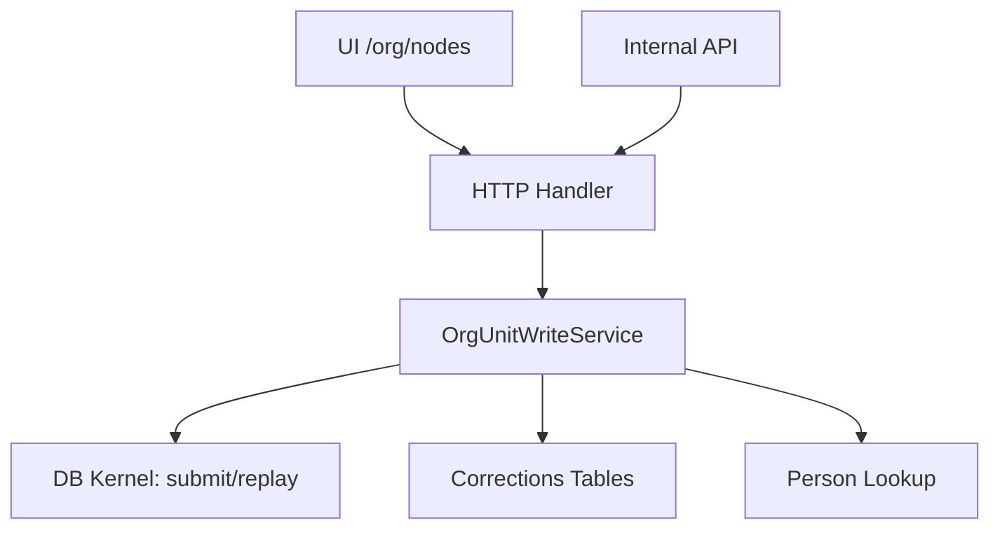

# DEV-PLAN-073：OrgUnit CRUD 实现清单（页面与 API）

**状态**: 进行中（2026-02-04 13:02 UTC）

## 背景
- 需要基于当前代码，列出 OrgUnit CRUD 在页面与 API 的实现情况，作为后续补齐的入口。

## 范围
- 组织单元 CRUD（Create/Read/Update/Disable），包含有效日期 as_of/effective_date 语义。
- 不包含 SetID/Scope Package 等周边能力。

## 清单

### 页面（UI）
1. [X] 列表/读取（当前节点列表）— `/org/nodes` GET
   证据：`internal/server/handler.go:283`、`internal/server/orgunit_nodes.go:659`
2. [X] 创建 — `/org/nodes` POST（action=create）
   证据：`internal/server/orgunit_nodes.go:812`
3. [X] 更新-重命名 — `/org/nodes` POST（action=rename）
   证据：`internal/server/orgunit_nodes.go:762`
4. [X] 更新-移动 — `/org/nodes` POST（action=move）
   证据：`internal/server/orgunit_nodes.go:776`
5. [X] 更新-设置 BU — `/org/nodes` POST（action=set_business_unit）
   证据：`internal/server/orgunit_nodes.go:793`
6. [X] 软删除/停用 — `/org/nodes` POST（action=disable）
   证据：`internal/server/orgunit_nodes.go:786`
7. [X] 快照读取 — `/org/snapshot` GET
   证据：`internal/server/handler.go:289`、`internal/server/orgunit_snapshot.go:164`
8. [X] 快照页创建（仅 name/parent_id）— `/org/snapshot` POST
   证据：`internal/server/orgunit_snapshot.go:173`
9. [X] 子节点读取（组织树懒加载）— `/org/nodes/children` GET
   证据：`internal/server/handler.go:289`、`internal/server/orgunit_nodes.go:1239`
10. [X] 详情读取（组织单元详情片段）— `/org/nodes/details` GET
   证据：`internal/server/handler.go:292`、`internal/server/orgunit_nodes.go:1296`
11. [X] 搜索定位（org_code/name）— `/org/nodes/search` GET
   证据：`internal/server/handler.go:295`、`internal/server/orgunit_nodes.go:1375`
12. [x] 独立详情页 / 组织单元详情视图（UI）
   说明：已有详情片段接口（`/org/nodes/details`），但尚未接入完整 UI（`modules/orgunit/presentation/*` 为空）。

### API（Internal API）
1. [X] 设置 BU — `POST /org/api/org-units/set-business-unit`
   证据：`internal/server/handler.go:379`、`internal/server/orgunit_api.go:23`
2. [X] 创建 OrgUnit（JSON API）
   证据：`internal/server/handler.go:398`、`internal/server/orgunit_api.go:147`
3. [X] 更新（rename/move/disable）API
   证据：`internal/server/handler.go:404`、`internal/server/orgunit_api.go:265`
4. [X] 列表/查询 OrgUnit API
   证据：`internal/server/handler.go:398`、`internal/server/orgunit_api.go:147`

### 存储/事件与读模型
1. [X] 事件表 + 事件类型约束（CREATE/MOVE/RENAME/DISABLE/SET_BUSINESS_UNIT）
   证据：`modules/orgunit/infrastructure/persistence/schema/00002_orgunit_org_schema.sql:31`
2. [X] 事件入口 `submit_org_event` + apply_*_logic
   证据：`modules/orgunit/infrastructure/persistence/schema/00003_orgunit_engine.sql:778`
3. [X] 读模型快照函数 `get_org_snapshot`
   证据：`modules/orgunit/infrastructure/persistence/schema/00004_orgunit_read.sql:1`
4. [X] org_code 规范化与解析
   证据：`pkg/orgunit/resolve.go:20`

## 缺口与后续建议
- 缺口集中在 API 层（Create/Update/List）。
- 模块目录 `modules/orgunit/presentation`/`services`/`domain` 仍为占位文件，尚未按 DDD 迁移。
- `/org/snapshot` 的创建入口缺失 org_code 参数，与 `/org/nodes` 的创建表单不一致。

## 能力评估（历史记录修改/插入）
1. [X] 通过新增事件“插入记录”（向中间/向后）
   说明：`RENAME/MOVE/SET_BUSINESS_UNIT/DISABLE` 等事件以 `effective_date` 分裂版本区间实现插入；同一 org_id 同日仅允许一条事件（唯一约束）。
   证据：`modules/orgunit/infrastructure/persistence/schema/00003_orgunit_engine.sql:382`、`modules/orgunit/infrastructure/persistence/schema/00002_orgunit_org_schema.sql:31`
2. [ ] 直接修改某一条历史记录（原地改值/改生效日）
   说明：当前为事件追加式写入，无 UPDATE 入口；`effective_date` 不可直接修改。
   证据：`modules/orgunit/infrastructure/persistence/schema/00003_orgunit_engine.sql:778`、`modules/orgunit/infrastructure/persistence/schema/00002_orgunit_org_schema.sql:31`

## 新增需求（草案）
### 1) 组织单元属性扩展（对标 Workday / SAP HCM / PeopleSoft 的常见字段）
说明：以下为跨系统常见字段的“候选集合”，用于补齐 OrgUnit 的通用属性；最终以契约文档定稿为准。
本次仅新增“部门负责人（manager_pernr）”，其余字段暂不落地，待契约明确后再评估。

- 标识类：`org_code`、`external_id`、`legacy_id`（若保留需符合 No Legacy 原则，仅作映射不做回退）
- 名称类：`name`、`short_name`、`description`
- 归属/分类：`org_type`（如公司/部门/BU/成本中心/地点）、`org_level`、`status`
- 归属关系：`parent_org_id`、`manager_pernr`（页面录入工号，姓名自动带出）
- 组织维度：`company`/`legal_entity`、`business_unit`、`department`、`cost_center`
- 地理/地点：`location_code`/`location_name`、`timezone`
- 生效口径：`effective_date`（day 颗粒度）与 `status` 的有效区间（validity）

#### 对标表（常见字段映射示意，名称以系统实际配置为准）
| 领域字段（建议） | Workday（常见） | SAP HCM（常见） | PeopleSoft（常见） |
| --- | --- | --- | --- |
| `org_code` / `org_id` | Organization ID / Org Code | `ORGEH`（Org Unit） | `DEPTID` / `DEPT_ID` |
| `name` | Organization Name | `STEXT`（长文本） | `DESCR` |
| `short_name` | Short Name | `SHORT` / `KURZT` | `DESCRSHORT` |
| `description` | Description | `STEXT`/说明文本 | `DESCR`/附注 |
| `status` | Status / Active | `OBJSTAT` / 状态 | `EFF_STATUS` |
| `effective_date` | Effective Date | `BEGDA`/`ENDDA` | `EFFDT` |
| `parent_org_id` | Parent Organization | 上级组织（`O-S` 关系） | 上级部门/树关系 |
| `manager_pernr` | Manager Worker ID / Employee ID | `PERNR` | `EMPLID` / `MGR_ID` |
| `company` / `legal_entity` | Company | `BUKRS` | `COMPANY` |
| `business_unit` | Business Unit | 事业部/BU | `BUSINESS_UNIT` |
| `department` | Department | 组织单元（同 `ORGEH`） | Department（`DEPTID`） |
| `cost_center` | Cost Center | `KOSTL` | `COST_CENTER` |
| `location_code` | Location | `BTRTL`/`WERKS` | `LOCATION` |
| `timezone` | Time Zone | 时区（若配置） | 时区（若配置） |

注：具体字段名与是否启用取决于客户配置/模块组合；以上为常见命名与概念对齐示意。

### 2) “原地修改历史记录（含生效日期）”功能方案
目标：对用户呈现“可直接修正历史记录”的体验，同时保持事件溯源一致性与审计可追溯。

方案 A（推荐，保持唯一约束）：事件不可变 + 更正叠加视图
- 在同一事务内：读取目标事件 → 记录“修改前快照” → 写入更正记录（current + history） → 触发重放投射。
- 快照记录：新增 `orgunit.org_event_corrections_*` 保存修改前的完整事件行（`original_event`），不记录原因字段。
- 生效日变更：API 不新增显式字段；如需调整 `effective_date`，在更正 `patch` 中携带新值。新日期必须落在该事件原区间内（介于前后两个生效日之间；缺失一侧边界时视为单侧无界），且不得与既有事件同日冲突（维持 `(tenant_uuid, org_id, effective_date)` 唯一约束）。**内部更正表需记录目标日与更正后日**，用于冲突校验与重放排序。
- 投射重建：修改生效日期必须触发 `orgunit.replay_org_unit_versions(...)`，保证读模型与版本区间一致。
- 更正范围：允许修改除“不可更正清单”外的业务属性（含新增字段）；状态类（`status`）必须通过显式事件流转，不在更正范围内。本期 UI 暴露负责人/上级/名称，但机制支持全量属性更正。

#### 更正叠加视图的性能策略（确认）
- “当前更正表 + 历史更正表”：`org_event_corrections_current` 仅保留每个 `event_uuid` 最新更正；`org_event_corrections_history` 保存全量更正记录（审计）。
- 叠加视图仅 JOIN `*_current`，避免排序/多行合并；历史表只用于审计查询。
- 读取路径先按 tenant/org_id/as_of 过滤，再 JOIN 更正表，减少 JOIN 行数。
- 索引最小集：`org_event_corrections_current(event_uuid)` 主键；`(tenant_uuid, org_id, target_effective_date)` 用于目标定位；`(tenant_uuid, org_id, corrected_effective_date)` 用于冲突校验与范围查询；`org_event_corrections_history(tenant_uuid, request_id)` 唯一约束用于幂等。
- UI/业务读取优先走读模型（`org_unit_versions`），更正后触发重放以更新读模型。

方案 B（不推荐，破坏审计一致性）：直接 UPDATE 事件表/版本表
- 直接修改 `org_events` 或 `org_unit_versions` 的历史记录与生效日期。
- 风险：破坏事件不可变性、审计链与幂等性，需明确审批与合规约束。

确认结论（来自当前需求）：
- 不允许同一 org_id 同日多条事件（维持 `(tenant_uuid, org_id, effective_date)` 唯一约束）。
- 同日停用：默认拒绝（同日唯一约束冲突），返回 `EVENT_DATE_CONFLICT`（409）。
- “原地修改”需保留修改前快照，不需要记录原因。
- 在现有 `/org/nodes` 表单中改造，不新增独立入口。
- Manager 维护口径：仅录入工号（PERNR），姓名自动带出；UI 不使用 UUID。
- 原地修改范围：以“不可更正清单”为准（含 `status`）；本期 UI 暴露负责人/上级/名称。
- 改生效日：不新增显式字段；允许在更正 `patch` 中修改 `effective_date`，但新日期必须落在该事件原区间内（介于前后生效日之间），超出则拒绝；修改生效日期必须触发重放。
- 状态变更：必须通过显式事件（`ENABLE` / `DISABLE`），不允许通过更正修改 `status`。

### 3) 状态变更事件（ENABLE / DISABLE）
目标：为“恢复有效 / 停用”提供明确事件类型与入口，避免通过更正直接修改 `status`。
- 新增事件类型：`ENABLE`（启用/恢复），与既有 `DISABLE` 并列。
- 入口要求：为 `ENABLE` / `DISABLE` 提供明确写入入口（UI `POST /org/nodes` action=enable|disable；internal API 视需要补充对应入口）。
- 规则一致：同日唯一约束不变；同日停用/启用默认拒绝并提示选择下一可用生效日。
- 追加限制：当某 org 的“最后一条记录”为 `disabled` 时，不允许插入任何非 `ENABLE` 的更大生效日事件（包括 rename/move/set_business_unit 等），必须先写入 `ENABLE`。

### UI 改造要求（/org/nodes）
- 左侧：组织架构树（支持展开/折叠）。
- 右侧：组织详情面板，支持 Tab 切换。
- 详情支持按不同生效日期翻页/切换（参考 PeopleSoft 风格）。

#### UI 交互口径（HR 用户视角）
1) 明确“历史更正模式”：在页面显眼位置提示当前模式，避免用户在错误模式下操作。
2) 生效日定位清晰：用时间轴/列表标识历史/当前/未来，并支持快速跳转到指定生效日。
3) 区分“新增生效日”与“更正历史”：提交前二次确认，避免误把修正当新增。
4) 权限提示直白：无权限时提示“无历史更正权限”，并提供申请入口或说明。
5) 模式切换保护：切换模式或离开页面前提示“未保存更正”，防止丢失。
6) 影响范围可视化：提交前展示“更正将影响的未来记录范围/报表口径”。
7) 状态变更提示：当末状态为停用时，明确提示“需先启用，才能新增其他更大生效日变更”。

#### 数据来源与一致性规则（as_of）
**树数据来源**：
- 以组织单元“版本读模型”为唯一来源，按 as_of 过滤有效区间并仅取 active。
- 树形顺序使用 node_path（或等价路径字段）排序；编码来自 org_code 映射表。
- 事件表仅用于审计显示，不作为树值来源。

**详情数据来源**：
- 详情字段（名称、上级、负责人、BU 等）来自同一读模型，按 org_id + as_of 取值。
- 负责人姓名来自人员模块，按同一 as_of 校验与展示。
- 审计字段（如最后变更时间）可来自事件表，仅作说明，不覆盖读模型字段。

**一致性规则**：
- 同一页面内树与详情必须使用同一 as_of 与同一租户上下文。
- 若该 as_of 下 org_id 无有效版本，详情显示“该生效日无记录/已停用”。
- 禁止混用事件表直接拼装业务字段，避免树与详情不一致。

**as_of 规则**：
- as_of 为必填日粒度日期；为空/非法直接提示错误并阻止查询。
- 切换 as_of 必须同时刷新树与详情。
- 更正提交后默认跳转/刷新到该更正的生效日。

#### 组织树组件选型（UI）
**首选**：Shoelace Tree（Web Component）
- 目标：在不改变 AHA 栈的前提下，获得成熟的树交互与可维护性。
- 交互口径：树为懒加载；展开节点时再加载子节点；节点选中后右侧详情面板刷新。
- 性能口径：几万节点场景下不一次性渲染全树，必须按路径与展开加载。

**集成方式（约束）**：
- 组件资源由 Astro build 产物打包并通过 go:embed 分发（禁止运行时外链依赖）。
- 业务数据仍由服务端渲染与 HTMX 拉取，组件只负责交互与展示。
- as_of 必须透传到树节点展开与详情加载的所有请求中。

**搜索定位（必须）**：
- 提供“编码/名称搜索”入口，返回目标节点路径并逐级展开定位。

### 整合方案（修改记录写入路径）
- 统一写入服务：新增/调整 OrgUnit 写服务（如 `OrgUnitWriteService`），承载“创建/事件更正/禁用/设置 BU”等逻辑。
- UI 统一入口：`/org/nodes` 表单改为调用同一服务层，避免直接分散调用存储层。
- API 统一入口：新增“原地更正”API（internal）与现有 `set-business-unit` 一并收敛到同一服务层。
- 事件与快照：服务层负责“写事件 + 更正快照 + 重放投射”的一致性事务边界。

### 评审结论与处置（编号）
1. 事件不可变性：已明确采用“更正叠加视图”，避免改写原始事件。
2. `manager_pernr` 校验/契约：采纳，需补充按 as_of 校验与失败路径。
3. 字段范围：允许更正除 `org_code` 外的业务属性；本期 UI 暴露负责人/上级/名称。
4. 重放策略：采纳。优先复用现有 `orgunit.replay_org_unit_versions(...)`；如需优化范围，新增“按 org_id/子树重放”也必须复用同一核心逻辑，不另起一套。
5. UI 验收口径：采纳，已补充 HR 视角交互口径与确认规则。
6. 写入整合层级：采纳，落地在模块 services 层并由 UI/API 共用。

## 实施步骤（已合并到里程碑）
本节合并至“依赖与里程碑”，避免重复维护。

## 新增表审批流程（执行前置）
1. [ ] 明确新增表清单与用途（含 `org_event_corrections_current` / `org_event_corrections_history` 或替代名）。
2. [ ] 提交“新增表手工确认”请求（由用户或指定负责人审批）。
3. [ ] 在“新增表确认记录”中写入批准人、时间（UTC）与范围。
4. [ ] 获批后方可进入迁移设计与实现。

## 技术详细设计（对齐 DEV-PLAN-001）

### 1. 背景与上下文
- **需求来源**：本方案与评审结论（见本文件“评审结论与处置”）。
- **当前痛点**：无法原地更正历史记录；UI 入口分散；负责人字段不满足“工号录入+姓名自动带出”的规范。
- **业务价值**：提升组织维护效率与历史修正准确性，减少二次补丁与手工回滚。

### 2. 目标与非目标
**核心目标**：
- [ ] 提供“原地更正历史记录”的能力（含上级、名称、负责人）。
- [ ] 负责人录入使用 `manager_pernr`，姓名自动带出，UI 禁用 UUID。
- [ ] UI 改造为“树 + 详情 + as_of 翻页”的 PeopleSoft 风格。
- [ ] 写入路径统一到模块 services 层，UI/API 共用。
- [ ] 明确触发器与门禁对齐（见 2.1）。

**非目标**：
- 不新增除 `manager_pernr` 之外的组织属性字段（其余字段待契约明确）。
- 不提供对外公共 API（仅 internal API）。
- 不引入 Feature Flag（对齐“早期阶段不引入开关”原则）。

### 2.1 工具链与门禁（SSOT 引用）
**触发器清单**（本计划预期命中）：
- [ ] Go 代码
- [ ] 路由治理
- [ ] DB 迁移 / Schema（orgunit 模块）
- [ ] 文档新增/调整

**SSOT 链接**：
- `AGENTS.md`（触发器矩阵与本地必跑）
- `Makefile`
- `.github/workflows/quality-gates.yml`

### 3. 架构与关键决策
**架构图（简化）**：


**关键决策**：
1) **更正叠加视图**：采用“更正当前表 + 历史表 + 叠加视图”，避免直接改写原始事件。
2) **负责人字段**：使用 `manager_pernr`，不在 UI 暴露 UUID。
3) **写入口唯一**：所有更正与修改均通过服务层统一入口。

### 4. 数据模型与约束
**新增/调整（草案，需新增表手工确认）**：
- `org_event_corrections_current`：每个 `event_uuid` 仅保留最新更正。
- `org_event_corrections_history`：保留全量更正记录用于审计。

**字段草案**：
```
org_event_corrections_current(
  event_uuid uuid PRIMARY KEY,
  tenant_uuid uuid NOT NULL,
  org_id int NOT NULL,
  target_effective_date date NOT NULL,
  corrected_effective_date date NOT NULL,
  original_event jsonb NOT NULL,
  replacement_payload jsonb NOT NULL,
  initiator_uuid uuid NOT NULL,
  request_id text NOT NULL,
  request_hash text NOT NULL,
  corrected_at timestamptz NOT NULL
)

org_event_corrections_history(
  correction_uuid uuid PRIMARY KEY,
  event_uuid uuid NOT NULL,
  tenant_uuid uuid NOT NULL,
  org_id int NOT NULL,
  target_effective_date date NOT NULL,
  corrected_effective_date date NOT NULL,
  original_event jsonb NOT NULL,
  replacement_payload jsonb NOT NULL,
  initiator_uuid uuid NOT NULL,
  request_id text NOT NULL,
  request_hash text NOT NULL,
  corrected_at timestamptz NOT NULL
)
```

**约束**：
- 幂等约束：`org_event_corrections_history` 需加 `UNIQUE (tenant_uuid, request_id)`。
- 目标日唯一：建议仅在 `org_event_corrections_current` 上加 `UNIQUE (tenant_uuid, org_id, target_effective_date)`（history 保留全量更正记录）。
- 事件唯一：`org_event_corrections_current.event_uuid` 作为主键，禁止同一事件多份 current。
- `original_event` / `replacement_payload` 必须为 JSON object。
**生效日说明**：
- `target_effective_date` 为目标事件原生效日（定位值）。
- `corrected_effective_date` 为更正后的生效日（用于索引/范围查询）。
- 修改前的原始事件完整快照保存在 `original_event`（含原 `effective_date`），更正后 payload 存在 `replacement_payload`。

**负责人字段**：
- 现状为 `manager_uuid`（历史字段）；目标新增/迁移为 `manager_pernr`（text / digits 1-8）。
- 校验：`manager_pernr` 符合 `^[0-9]{1,8}$`，并按 as_of 校验 person 存在且可用。

**迁移策略（manager_pernr）**：
- 双写期：写入时同时填充 `manager_uuid` 与 `manager_pernr`（若可得）。
- 回填：历史版本基于 person/person_identity 回填 `manager_pernr`。
- 读取优先级：优先 `manager_pernr`，迁移期允许 fallback 到 `manager_uuid`，并明确淘汰截止日期。

#### 4.1 不可更正清单（硬约束）
- 身份锚点：`org_code` / `org_id` / `tenant_uuid`
- 系统审计字段：`created_at` / `updated_at` / `transaction_time`
- 状态类：`status`（必须通过显式事件流转，例如 ENABLE/DISABLE；不允许在更正里直接改）

#### 4.2 可更正字段元数据（当前口径）
> 说明：本期 UI 至少暴露负责人/上级/名称；其余字段若未落表或未入契约，需先更新元数据再开放。

| 字段 | 类型 | 是否可更正 | 校验/口径 |
| --- | --- | --- | --- |
| `effective_date` | date | 是 | 仅允许调整到原区间内（介于前后生效日之间；缺失一侧边界时视为单侧无界），且不得与其他事件同日冲突 |
| `name` | text | 是 | 非空字符串 |
| `parent_org_code` | text | 是 | as_of 时点必须存在且 active；为空表示无上级 |
| `is_business_unit` | boolean | 是 | 与现有 SET_BUSINESS_UNIT 语义一致 |
| `manager_pernr` | text | 是 | `^[0-9]{1,8}$`，按 as_of 校验 person 存在且 active |

**未来扩展字段（需先落表与更新契约）**：
`short_name` / `description` / `org_type` / `org_level` / `external_id` / `legacy_id` / `company` / `business_unit` / `department` / `cost_center` / `location_code` / `location_name` / `timezone`

#### 4.3 写入服务接口草案（services 层）
> 目的：UI 与 API 共用统一写入口，避免散落到 handler 或直接触达存储层。

```go
// modules/orgunit/services/orgunit_write_service.go
type OrgUnitWriteService interface {
  Create(ctx context.Context, tenantID string, req CreateOrgUnitRequest) (OrgUnitResult, error)
  Rename(ctx context.Context, tenantID string, req RenameOrgUnitRequest) error
  Move(ctx context.Context, tenantID string, req MoveOrgUnitRequest) error
  Disable(ctx context.Context, tenantID string, req DisableOrgUnitRequest) error
  SetBusinessUnit(ctx context.Context, tenantID string, req SetBusinessUnitRequest) error
  Correct(ctx context.Context, tenantID string, req CorrectOrgUnitRequest) (OrgUnitResult, error)
}

// 读服务建议分离（树/详情/搜索）
type OrgUnitReadService interface {
  ListChildren(ctx context.Context, tenantID string, asOf string, parentID string) ([]OrgUnitNode, error)
  GetDetails(ctx context.Context, tenantID string, asOf string, orgID string) (OrgUnitDetails, error)
  SearchPath(ctx context.Context, tenantID string, asOf string, query string) (OrgUnitPathResult, error)
}
```

**约束**：
- 所有方法必须在事务中设置 `app.current_tenant`，fail-closed。
- 写入必须走 DB Kernel（`submit_*_event` + `replay_*`），避免第二写入口。

### 5. 接口契约（草案）
#### 5.1 Internal API：OrgUnit CRUD

**路由**：
- `GET /org/api/org-units`
- `POST /org/api/org-units`
- `POST /org/api/org-units/rename`
- `POST /org/api/org-units/move`
- `POST /org/api/org-units/disable`
- `POST /org/api/org-units/set-business-unit`（已有）

**GET /org/api/org-units**
- Query：
  - `as_of`（可选；默认当天 UTC）
  - `parent_org_code`（可选；有值时返回该节点子列表，无值时返回根节点列表）
- Response（200 OK）：
```json
{
  "as_of": "2026-02-04",
  "org_units": [
    {
      "org_code": "A001",
      "name": "销售一部",
      "is_business_unit": false
    }
  ]
}
```

**POST /org/api/org-units（创建）**
- Request（JSON）：
  - `org_code`（必填）
  - `name`（必填）
  - `effective_date`（可选，YYYY-MM-DD，缺省为当天 UTC）
  - `parent_org_code`（可选）
  - `is_business_unit`（可选，缺省 false）
  - `manager_pernr`（可选；`^[0-9]{1,8}$`）
- Response（201 Created）：
```json
{
  "org_code": "A001",
  "effective_date": "2026-02-04",
  "fields": {
    "name": "销售一部",
    "parent_org_code": "A0001",
    "is_business_unit": false,
    "manager_pernr": "1002001",
    "manager_name": "张三"
  }
}
```

**POST /org/api/org-units/rename（重命名）**
- Request：`org_code`（必填）、`new_name`（必填）、`effective_date`（可选）
- Response：`200 OK`

**POST /org/api/org-units/move（移动）**
- Request：`org_code`（必填）、`new_parent_org_code`（必填）、`effective_date`（可选）
- Response：`200 OK`

**POST /org/api/org-units/disable（停用）**
- Request：`org_code`（必填）、`effective_date`（可选）
- Response：`200 OK`

**错误码（示例）**：
- `400`：参数非法（`org_code`/`effective_date`/`manager_pernr`/`new_parent_org_code` 等）
- `404`：目标组织或上级不存在（`ORG_CODE_NOT_FOUND` / `PARENT_NOT_FOUND_AS_OF`）
- `409`：同日事件冲突（唯一约束冲突）
- `422`：数据库稳定错误码（由 DB Kernel 返回）

**写入约束**：
- 所有写入必须走 `OrgUnitWriteService`（`submit_*_event` + `replay_*`）。

#### 5.2 Internal API：更正历史记录
- `POST /org/api/org-units/corrections`
- Request（JSON）：
  - `org_code`（必填）
  - `effective_date`（必填，YYYY-MM-DD）
  - `patch`（必填，包含待更正的业务属性）
  - `request_id`（必填，幂等请求标识）
- Response：`200 OK`，返回更正后的 `org_code/effective_date/fields`
- Error（示例）：
  - `400`：参数非法（org_code/manager_pernr/effective_date）
  - `404`：目标事件不存在
  - `409`：同日事件冲突

**UI（/org/nodes）**
- 通过统一服务层提交更正；错误返回在右侧详情区展示。

#### 5.3 Internal API 详细契约（更正历史记录）
**路由**：`POST /org/api/org-units/corrections`

**Request 示例**：
```json
{
  "org_code": "A001",
  "effective_date": "2026-01-01",
  "patch": {
    "parent_org_code": "A0001",
    "name": "销售一部",
    "manager_pernr": "1002001"
  },
  "request_id": "corr-20260101-A001"
}
```
若需要改生效日，在 `patch` 中携带新值（不新增显式字段）：
```json
{
  "org_code": "A001",
  "effective_date": "2026-01-01",
  "patch": {
    "effective_date": "2026-01-15",
    "name": "销售一部"
  },
  "request_id": "corr-20260101-A001"
}
```

**字段说明**：
- `org_code`：必填，组织代码（按 `^[A-Z0-9_-]{1,16}$`，且不可包含空白）。
- `effective_date`：必填，目标事件的生效日（原值，用于定位更正目标）。
- `patch`：必填，允许除“不可更正清单”以外的业务属性（未包含字段视为“不变更”）。若包含 `effective_date`，表示改生效日（新值），需满足原区间约束。
- `不可更正清单`：`org_code` / `org_id` / `tenant_uuid` / `status` / 系统审计字段（如 created_at/updated_at/transaction_time）。
- `request_id`：必填，幂等请求标识（重复提交应返回一致结果）。

**幂等说明**：
- `request_hash` 由服务端对 `org_code/effective_date/patch` 的规范化内容计算，用于判重；客户端无需提供。

**Response（200 OK）**：
```json
{
  "org_code": "A001",
  "effective_date": "2026-01-01",
  "fields": {
    "parent_org_code": "A0001",
    "name": "销售一部",
    "manager_pernr": "1002001",
    "manager_name": "张三"
  }
}
```
说明：若发生改生效日，`effective_date` 返回更正后的生效日。

#### 5.4 UI（/org/nodes）表单字段
- 右侧详情 Tab 中提供“更正”表单：按字段元数据渲染当前可更正业务属性（本期至少包含 `effective_date`/`parent_org_code`/`name`/`manager_pernr`）。
  - `effective_date`（日期选择；允许调整，但必须落在原区间内。提交时保留原 `effective_date` 作为定位值；若用户修改，则在 `patch.effective_date` 传入新值）
  - `parent_org_code`（可选）
  - `name`（可选）
  - `manager_pernr`（可选；输入后自动带出 `manager_name` 只读）
- as_of 翻页与更正表单联动：翻页后表单默认填充该生效日的当前值。

#### 5.5 校验规则（统一服务层）
- `org_code`：`^[A-Z0-9_-]{1,16}$`，禁止前后空白。
- `effective_date`：合法日期（YYYY-MM-DD）。
- `patch`：仅允许业务属性字段；明确“不可更正清单”（含 `org_code`）并拒绝更正。
- `patch.effective_date`：若提供且不同于目标事件的 `effective_date`，新日期必须落在原区间内（介于前后生效日之间；缺失一侧边界时视为单侧无界），并确保无同日冲突。
- `parent_org_code`：若提供，必须存在且在 `effective_date` 时点为 active。
- `name`：若提供，必须非空。
- `manager_pernr`：
  - 符合 `^[0-9]{1,8}$`，且遵循 `person` 的 canonical 规则（`"0"` 允许；否则禁止前导 0）。
  - 在 `effective_date` 时点必须存在于 `person.persons` 且 `status=active`。
- 其他业务属性：按字段元数据（类型/必填/枚举/长度）统一校验与错误码映射。
- 同日唯一：若更正导致 `effective_date` 变更，需确保 `(tenant_uuid, org_id, effective_date)` 无冲突事件。
- 同日停用（DISABLE）：`effective_date` 与既有事件同日则拒绝，返回 `EVENT_DATE_CONFLICT`（409）。
- 末状态禁用约束：若该 org 的最后状态为 `disabled`，拒绝除 `ENABLE` 之外的任何更大生效日事件。

#### 5.6 错误码（建议）
- `ORG_CODE_INVALID`（400）
- `EFFECTIVE_DATE_INVALID`（400）
- `EFFECTIVE_DATE_OUT_OF_RANGE`（409）
- `PATCH_FIELD_NOT_ALLOWED`（400）
- `PARENT_NOT_FOUND_AS_OF`（404）
- `ORG_EVENT_NOT_FOUND`（404）
- `MANAGER_PERNR_INVALID`（400）
- `MANAGER_PERNR_NOT_FOUND`（404）
- `MANAGER_PERNR_INACTIVE`（409 或 422）
- `EVENT_DATE_CONFLICT`（409）
- `ORG_ENABLE_REQUIRED`（409，末状态为 disabled，仅允许 ENABLE）
- `REQUEST_DUPLICATE`（409，幂等请求冲突）

#### 5.7 UI：独立详情页
**路由**：`GET /org/nodes/view?org_code=...&as_of=YYYY-MM-DD`

**行为**：
- 使用 `org_code` 解析 `org_id`，复用 `/org/nodes/details` 的数据口径渲染完整页面。
- 页面提供“返回组织树”入口，保持 `as_of` 参数。

**错误处理**：
- `400`：`org_code/as_of` 非法或缺失。
- `404`：`org_code` 不存在或 as_of 下无有效记录。

#### 5.8 组织树组件接口（Shoelace Tree）
**目标**：在 AHA 栈内以 Web Component 实现“树 + 详情”，服务端保持权威数据来源。

**UI 入口**：
- `/org/nodes?as_of=YYYY-MM-DD`：渲染页面壳 + 初始根节点（或顶层节点）。

**子节点懒加载（必须）**：
- `GET /org/nodes/children?parent_id=...&as_of=YYYY-MM-DD`
- Response：HTML fragment，包含 `sl-tree-item` 列表。
  - 每个 `sl-tree-item` 必须包含：
    - `data-org-id`
    - `data-org-code`
    - `data-has-children`（用于设置 `lazy` 属性）
  - 示例（片段）：
    ```html
    <sl-tree-item data-org-id="10000002" data-org-code="A0002" lazy>人力资源部</sl-tree-item>
    ```

**节点详情加载（右侧面板）**：
- `GET /org/nodes/details?org_id=...&as_of=YYYY-MM-DD`
- Response：HTML fragment（详情面板内容）。
- 详情必须与树使用同一 as_of 与租户上下文。
- 详情面板容器建议固定为 `#org-node-details`。

**搜索定位（必须）**：
- `GET /org/nodes/search?query=...&as_of=YYYY-MM-DD`
- Response：JSON（用于定位并展开路径）：
  - `target_org_id`
  - `target_org_code`
  - `target_name`
  - `path_org_ids`（从根到目标的 org_id 列表）
  - `path_org_codes`（可选，用于 UI 展示与校验）
  - `as_of`
- 客户端按 `path_org_ids` 逐级展开并选中目标节点。

**搜索交互流程（建议）**：
1) 用户输入编码/名称 → 请求 `/org/nodes/search`。
2) 收到 `path_org_ids` 后，按路径逐级展开：
   - 若节点未加载子节点，则触发对应节点的懒加载接口。
3) 路径全部展开后，选中 `target_org_id` 并刷新右侧详情。

**事件/交互约束**：
- 展开节点触发 `sl-lazy-load`（或等价事件），由轻量 JS/HTMX 拉取子节点并插入当前节点。
- 选择节点触发详情面板加载；不得在前端缓存业务字段。

**最小事件桥接（草案）**：
```html
<script>
  document.addEventListener('sl-lazy-load', async (event) => {
    const item = event.detail.item;
    const orgId = item.dataset.orgId;
    const asOf = new URLSearchParams(location.search).get('as_of');
    if (!orgId || !asOf) return;

    const url = `/org/nodes/children?parent_id=${encodeURIComponent(orgId)}&as_of=${encodeURIComponent(asOf)}`;
    // 使用 HTMX 拉取子节点片段并插入当前节点
    htmx.ajax('GET', url, { target: item, swap: 'innerHTML' })
      .then(() => { item.lazy = false; })
      .catch(() => { /* 由统一错误出口处理 */ });
  });

  document.addEventListener('sl-selection-change', (event) => {
    const item = event.detail.item;
    const orgId = item?.dataset?.orgId;
    const asOf = new URLSearchParams(location.search).get('as_of');
    if (!orgId || !asOf) return;

    const url = `/org/nodes/details?org_id=${encodeURIComponent(orgId)}&as_of=${encodeURIComponent(asOf)}`;
    htmx.ajax('GET', url, { target: '#org-node-details', swap: 'innerHTML' });
  });
</script>
```

**错误处理**：
- 400：as_of 非法、参数缺失。
- 404：节点或路径不存在。
- 403：无权限。

#### 5.9 路由与权限口径（Authz）
**对象/动作**：`orgunit.orgunits` + `read/admin`

**UI 路由**：
- `GET /org/nodes`：read
- `POST /org/nodes`：admin
- `GET /org/nodes/children`：read
- `GET /org/nodes/details`：read
- `GET /org/nodes/search`：read
- `GET /org/nodes/view`：read

**API 路由（internal）**：
- `GET /org/api/org-units`：read
- `POST /org/api/org-units`：admin
- `POST /org/api/org-units/rename`：admin
- `POST /org/api/org-units/move`：admin
- `POST /org/api/org-units/disable`：admin
- `POST /org/api/org-units/corrections`：admin
- `POST /org/api/org-units/set-business-unit`：admin（既有）

**路由治理**：
- 新增路由必须加入 allowlist，并在 `authzRequirementForRoute` 中落地映射。

### 6. 核心逻辑（更正流程）
1) 开启事务，设置 `app.current_tenant`。
2) 计算 `request_hash`（基于 org_code/effective_date/patch 的规范化内容）；幂等检查：以 `(tenant_uuid, request_id)` 查询更正历史表。
   - 若存在且 `request_hash` 一致：直接返回当前结果（视为重复请求）。
   - 若存在但 `request_hash` 不一致：返回 `REQUEST_DUPLICATE`（409）。
3) 解析 `org_code` → `org_id`；定位目标事件（`org_id + effective_date` 原值）。
4) 校验 `patch` 中各字段（含 `manager_pernr` 的 as_of 校验）。若包含 `patch.effective_date` 且与原值不同：
   - 计算前后相邻生效日（prev/next，来自原始 `org_events` 基准序列，不受更正影响）并验证新日期落在原区间内（介于前后生效日之间；缺失一侧边界时视为单侧无界）。
   - 基于更正叠加视图检查同日冲突（排除当前 event_uuid）。
5) 写入更正历史表；UPSERT 当前更正表（若改生效日，`corrected_effective_date` 存为新值；`target_effective_date` 存原值）。
6) 触发重放（复用 `orgunit.replay_org_unit_versions(...)` 或其范围包装）；改生效日必须重放。
7) 提交事务；返回更正结果。

#### 6.1 DB Kernel 对齐清单（参考 assignments 更正模式）
- 新增更正表（current/history）+ RLS：承载更正后的 payload 与目标日/更正日，并提供幂等与同日唯一约束。
- 更正叠加视图：`org_events_effective`（或等价）以 `COALESCE(c.corrected_effective_date, e.effective_date)` 和 `COALESCE(c.replacement_payload, e.payload)` 作为权威输入。
- 重放入口：`replay_org_unit_versions` 必须改读叠加视图并按更正后的 `effective_date` 排序，否则更正与改生效日不会生效。
- 改生效日校验：基于原始 `org_events` 序列计算 prev/next 边界；新日期需落在 `[target, next)`；冲突检查走叠加视图并排除当前事件。
- 更正写入函数：新增 `submit_org_event_correction(...)`，在同一事务内写更正表并触发重放。
- 参考实现：`internal/server/assignment_db_integration_test.go` 中的更正表与 replay join 逻辑。

#### 6.2 最小可行内核改造路径（参考 assignments）
1) 新增 `org_event_corrections_current/history` 表与 RLS/唯一约束。
2) 增加 `org_events_effective` 叠加视图（事件表 + current 更正表）。
3) 新增 `submit_org_event_correction(...)`：定位目标事件、区间/冲突校验、写更正表、触发 `replay_org_unit_versions`。
4) 修改 `replay_org_unit_versions` 改读叠加视图并按更正后的 `effective_date` 排序。
5) 保持 `submit_org_event` 作为新增事件入口，避免第二写入口。

#### 6.3 执行清单（DB Kernel）
- [x] 新增表：`org_event_corrections_current/history`（含 `target_effective_date`、`corrected_effective_date`、`original_event`、`replacement_payload`、`initiator_uuid`、`request_id`、`request_hash`）。
- [x] 约束与索引：同日唯一、请求幂等、事件唯一；`replacement_payload` 为 object；补齐必要索引（按 tenant/org_id/target_effective_date 与 tenant/request_id）。
- [x] 事件类型扩展：`org_events.event_type` 增加 `ENABLE`，并补齐 `apply_enable_logic(...)` 与写入入口。
- [x] RLS：对更正表启用 `tenant_isolation`（与 `org_events`/`org_unit_versions` 对齐）。
- [x] 叠加视图：`org_events_effective`（`effective_date`/`payload` 使用更正结果，保留原 `event_uuid`/`org_id`/`event_type` 供 replay 使用）。
- [x] 更正写入函数：`submit_org_event_correction(...)`（目标事件存在性、区间校验、同日冲突、幂等处理、写 current+history、触发 replay）。
- [x] 重放入口修改：`replay_org_unit_versions` 从 `org_events_effective` 读入并按“更正后 effective_date + event_id”排序。

#### 6.4 PR 级任务拆分（DB Kernel）
**PR 1｜DB 与内核：更正表 + 叠加视图基础（细化）**
- [x] DDL：新增更正表与索引 + RLS 策略。
- [x] 视图：新增 `org_events_effective`（用于重放与冲突检查）。
- [x] Kernel：新增 `submit_org_event_correction(...)` + 修改 `replay_org_unit_versions` 读叠加视图。
- [x] Kernel：事件类型扩展 `ENABLE`，补齐 `apply_enable_logic(...)` 与写入入口。
- [x] 校验：补齐“区间内改生效日/同日冲突/幂等复用”路径的最小 SQL 校验。
- [x] 修复：补齐 `submit_org_event` 的 `SECURITY DEFINER` / `search_path`（新增迁移 `20260204173000_orgunit_submit_org_event_security_definer.sql`）。

#### 6.5 SQL 伪代码草案（更正函数 / 叠加视图）
> 说明：以下为结构性伪代码，字段名与错误码以最终实现为准。

**叠加视图：org_events_effective**
```sql
CREATE VIEW orgunit.org_events_effective AS
SELECT
  e.id,
  e.event_uuid,
  e.tenant_uuid,
  e.org_id,
  e.event_type,
  COALESCE(c.corrected_effective_date, e.effective_date) AS effective_date,
  COALESCE(c.replacement_payload, e.payload) AS payload,
  e.request_code,
  e.initiator_uuid,
  e.transaction_time,
  e.created_at
FROM orgunit.org_events e
LEFT JOIN orgunit.org_event_corrections_current c
  ON c.event_uuid = e.event_uuid
 AND c.tenant_uuid = e.tenant_uuid
 AND c.org_id = e.org_id;
```

**更正写入：submit_org_event_correction(...)**
```sql
CREATE OR REPLACE FUNCTION orgunit.submit_org_event_correction(
  p_event_uuid uuid,
  p_tenant_uuid uuid,
  p_org_id int,
  p_target_effective_date date,
  p_patch jsonb,
  p_request_id text,
  p_initiator_uuid uuid
) RETURNS bigint AS $$
DECLARE
  v_lock_key text;
  v_target orgunit.org_events%ROWTYPE;
  v_prev_effective date;
  v_next_effective date;
  v_new_effective date;
  v_payload jsonb;
  v_request_hash text;
  v_correction_id bigint;
BEGIN
  PERFORM orgunit.assert_current_tenant(p_tenant_uuid);
  -- 参数校验略

  v_lock_key := format('org:write-lock:%s', p_tenant_uuid);
  PERFORM pg_advisory_xact_lock(hashtextextended(v_lock_key, 0));

  SELECT * INTO v_target
  FROM orgunit.org_events
  WHERE tenant_uuid = p_tenant_uuid
    AND org_id = p_org_id
    AND effective_date = p_target_effective_date
  LIMIT 1;
  IF NOT FOUND THEN
    RAISE EXCEPTION USING MESSAGE = 'ORG_EVENT_NOT_FOUND';
  END IF;

  -- 计算 prev/next（基于原始 org_events 序列）
  SELECT MAX(effective_date) INTO v_prev_effective
  FROM orgunit.org_events
  WHERE tenant_uuid = p_tenant_uuid
    AND org_id = p_org_id
    AND effective_date < p_target_effective_date;

  SELECT MIN(effective_date) INTO v_next_effective
  FROM orgunit.org_events
  WHERE tenant_uuid = p_tenant_uuid
    AND org_id = p_org_id
    AND effective_date > p_target_effective_date;

  -- 生成更正后的 payload：原 payload 与 patch 合并（patch 优先）
  v_payload := v_target.payload || p_patch;

  -- 若 patch.effective_date 存在则作为新日期（否则沿用目标日）
  v_new_effective := COALESCE(NULLIF(v_payload->>'effective_date','')::date, v_target.effective_date);
  v_payload := v_payload - 'effective_date';

  -- 区间校验：new_date 必须落在 [target, next)
  IF v_new_effective < v_target.effective_date THEN
    RAISE EXCEPTION USING MESSAGE = 'ORG_EFFECTIVE_DATE_OUT_OF_RANGE';
  END IF;
  IF v_next_effective IS NOT NULL AND v_new_effective >= v_next_effective THEN
    RAISE EXCEPTION USING MESSAGE = 'ORG_EFFECTIVE_DATE_OUT_OF_RANGE';
  END IF;

  -- 同日冲突检查：基于叠加视图（排除当前 event_uuid）
  IF EXISTS (
    SELECT 1
    FROM orgunit.org_events_effective ee
    WHERE ee.tenant_uuid = p_tenant_uuid
      AND ee.org_id = p_org_id
      AND ee.effective_date = v_new_effective
      AND ee.event_uuid <> p_event_uuid
    LIMIT 1
  ) THEN
    RAISE EXCEPTION USING MESSAGE = 'ORG_EVENT_DATE_CONFLICT';
  END IF;

  -- 幂等：request_hash 由 (org_id, target_effective_date, patch) 规范化生成
  v_request_hash := orgunit.hash_correction(p_org_id, p_target_effective_date, p_patch);

  -- 写 history + upsert current（original_event = to_jsonb(v_target), replacement_payload = v_payload, initiator_uuid = p_initiator_uuid）
  INSERT INTO orgunit.org_event_corrections_history (...)
  VALUES (...);

  INSERT INTO orgunit.org_event_corrections_current (...)
  VALUES (...)
  ON CONFLICT (event_uuid) DO UPDATE SET
    corrected_effective_date = EXCLUDED.corrected_effective_date,
    replacement_payload = EXCLUDED.replacement_payload,
    request_id = EXCLUDED.request_id,
    request_hash = EXCLUDED.request_hash,
    corrected_at = EXCLUDED.corrected_at;

  -- 重放
  PERFORM orgunit.replay_org_unit_versions(p_tenant_uuid);

  RETURN v_correction_id;
END;
$$ LANGUAGE plpgsql;
```

**重放入口：replay_org_unit_versions（片段）**
```sql
FOR v_event IN
  SELECT *
  FROM orgunit.org_events_effective
  WHERE tenant_uuid = p_tenant_uuid
  ORDER BY effective_date, id
LOOP
  -- apply_*_logic 逻辑保持不变
END LOOP;
```

### 7. 安全与鉴权
- 走现有 Authz 中间件；新增路由需对齐 routing allowlist 与授权策略。
- 租户隔离必须 fail-closed（无 tenant ctx 直接拒绝）。

### 8. 依赖与里程碑
**依赖**：
- Person 模块 `pernr` 规范（`DEV-PLAN-027`）。
- Shoelace Tree 资源引入与 Astro build/静态资源分发就绪（AHA 栈内落地）。
- `/org/nodes/children`、`/org/nodes/details`、`/org/nodes/search` 接口契约与路由草案明确。
- 路由 allowlist 与 Authz 策略更新可用。
- 新增更正表审批完成（手工确认）。

**里程碑（顺序）**：
1. [x] 设计确认（更正叠加视图取舍、字段元数据/不可更正清单、UI 交互口径与 as_of 规则、API/路由/权限口径）
2. [x] 新增表手工确认（阻断点）
3. [x] Schema 迁移（含更正表与幂等约束）
4. [x] 服务层实现 + 单测（幂等/更正/重放/租户 fail-closed；manager_pernr as_of 校验待 Person 有效期补齐）
5. [x] 接口实现（children/details/search + corrections）+ 路由 allowlist/Authz 策略
6. [x] Shoelace 资源接入 + UI 对接（树/详情/搜索定位、事件桥接）
7. [x] Readiness 记录（门禁执行证据与关键结果）
8. [x] Internal API：OrgUnit CRUD（create/rename/move/disable/list）+ 路由 allowlist/Authz
9. [x] 独立详情页 / 组织单元详情视图（UI）

#### PR 计划（草案）
**PR 1｜DB 与内核：更正表 + 叠加视图基础**
- [x] 目标：新增更正表、幂等约束与必要索引，为更正与重放提供基础。
- [x] 验证：`make orgunit plan && make orgunit lint && make orgunit migrate up`

**PR 2｜服务层：写入服务 + 更正流程**
- [x] 完成：新增 `OrgUnitWriteService`/`OrgUnitWriteStore` + PG 实现，覆盖 create/rename/move/disable/set_business_unit/correct 与 patch 校验。
- [x] 完成：`manager_pernr` 规范校验（digits 1-8）+ 双写 `manager_uuid`/`manager_pernr`。
- [x] 单测：服务层/持久层覆盖率补齐，满足 100% 覆盖率门禁。
- [x] 验证：`go fmt ./... && go vet ./... && make check lint && make test`
- [ ] 备注：`manager_pernr` 的 as_of 校验依赖 Person 有效期模型，当前仅校验存在/active，待 Person 有效期补齐后完善。

**PR 3｜读服务 + 新路由：children/details/search**
- [x] 完成：实现 `OrgUnitReadService` 与 3 个只读路由，并补齐 Authz 与 allowlist。
- [x] 验证：`make check routing` + Go 门禁

**PR 4｜UI 集成：Shoelace Tree + 事件桥接**
- [x] 完成：接入 Shoelace 资源、树/详情容器与事件桥接。
- [x] 验证：`make generate && make css`（完成后 `git status --short` 为空）

**PR 5｜Readiness 记录**
- [x] 完成：写入 `docs/dev-records/` 的证据与门禁结果。
- [x] 验证：`make check doc`

**PR 6｜Internal API：OrgUnit CRUD**
- [x] 目标：补齐 `/org/api/org-units` 列表与创建接口，新增 `/org/api/org-units/{rename|move|disable}` 操作接口，统一走 OrgUnitWriteService。
- [x] 验证：`go fmt ./... && go vet ./... && make check lint && make test && make check routing`

**PR 7｜UI：独立详情页**
- [x] 目标：新增 OrgUnit 独立详情页（基于 `/org/nodes/details` 复用数据），提供可被 UI 直接访问的详情视图入口。
- [x] 验证：未涉及前端资源（已跑 `make check routing`）

### 9. 测试与验收
- 单测：更正多次、改生效日落在原区间内、改生效日越界、同日冲突、幂等 request_id 冲突、pernr 不存在、RLS 失效路径。
- 集成：改生效日后触发重放且读模型区间一致（旧/新 as_of 结果符合预期）。
- 门禁：按 `AGENTS.md` 触发器执行并记录。

### 10. 运维与监控
- 不新增 Feature Flag；早期阶段不引入监控开关。

## Simple > Easy 评审（DEV-PLAN-003）
**结论**：通过（Plan 阶段具备实施条件）。

**备注**：
- 若新增表范围或可更正字段元数据发生变化，需回到 Plan 更新契约。

## 门禁对齐清单（触发器与验证入口）
**预期命中触发器**：
- Go 代码
- 路由治理
- DB 迁移 / Schema（orgunit 模块）
- 文档新增/调整
- UI 生成物（Astro/样式）

**验证入口（最小集合）**：
- Go：`go fmt ./... && go vet ./... && make check lint && make test`
- 路由：`make check routing`
- DB 迁移：`make orgunit plan && make orgunit lint && make orgunit migrate up`
- 文档：`make check doc`
- UI 生成：`make generate && make css`（完成后 `git status --short` 必须为空）

## 新增表确认记录
- 批准人：用户确认（shangmeilin）
- 时间（UTC）：2026-02-04 07:24:13 UTC
- 范围（表名/用途）：`org_event_corrections_current/history`（OrgUnit 更正 current+history，支持幂等与重放）

## 关联文档
- `docs/dev-plans/026-org-transactional-event-sourcing-synchronous-projection.md`
- `docs/dev-plans/026a-orgunit-id-uuid-code-naming.md`
