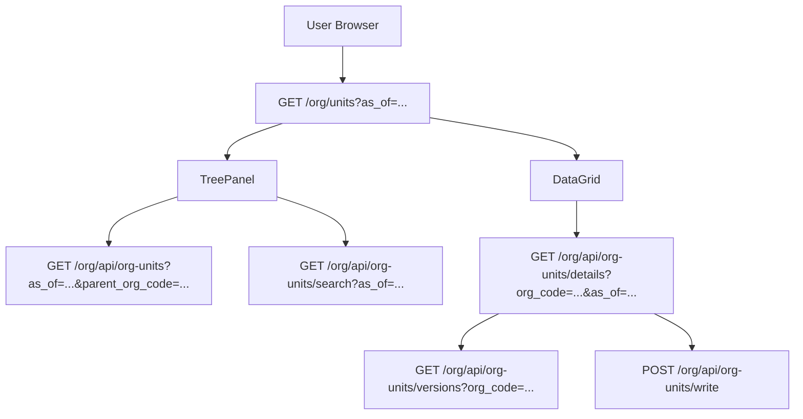

# DEV-PLAN-076：OrgUnit 版本切换选中保持（MUI `as_of` / `effective_date` 口径）

**状态**: 规划中（2026-02-06 12:00 UTC；2026-02-13 补充 MUI 版本列表稳定性问题）

## 1. 背景与上下文 (Context)
- **需求来源**: 组织架构在版本切换时丢焦/跳变问题（本文件“背景与上下文”与验收口径）。
- **当前痛点**:
  - 在 `/org/units?as_of=YYYY-MM-DD` 选中节点后，详情切换若触发整页重载，容易丢失当前选中上下文。
  - `as_of`（树/列表有效日）与 `effective_date`（详情版本日）职责易混，导致前后端参数语义不一致。
  - 在 `/org/units/:org_code?as_of=YYYY-MM-DD` 且 URL 缺 `effective_date` 时，历史实现曾出现“伪版本注入”导致版本列表条目数跳变。
- **业务价值**:
  - 版本切换时保持当前组织上下文，降低误操作风险。
  - 明确树/列表与详情的时间参数职责，降低实现漂移。

## 2. 目标与非目标 (Goals & Non-Goals)
- **核心目标**:
  - [ ] 版本切换（上一条/下一条/下拉）仅刷新详情数据，不触发整页刷新。
  - [ ] `as_of` 只用于组织树与列表查询；`effective_date` 只用于详情版本选择。
  - [ ] 详情切换失败 fail-open：不清空现有详情，不改变当前选中。
  - [ ] 对齐有效期日粒度（`YYYY-MM-DD`）。
  - [ ] 详情页版本列表仅显示真实版本（来自 `versions` 接口），禁止伪版本项。
  - [ ] URL 缺失 `effective_date` 时，默认选中“`<= as_of` 最近一条真实版本”；若不存在则回退到最早版本。
- **非目标 (Out of Scope)**:
  - 不新增 DB 迁移或 schema。
  - 不新增业务模块或导航入口。
  - 不引入新的鉴权策略/运维开关。

## 2.1 工具链与门禁（SSOT 引用）
> 仅声明触发器；脚本细节与门禁口径以 SSOT 为准。

- **触发器清单**:
  - [x] Go 代码（handler/参数校验）
  - [x] `.templ` / MUI Web UI / presentation assets（页面/交互改动）
  - [ ] Authz（沿用现有策略）
  - [ ] 路由治理（不新增路由；仅调整参数语义）
  - [ ] DB 迁移 / Schema（不涉及）
  - [ ] sqlc（不涉及）
  - [ ] Outbox（不涉及）
  - [x] 文档（`make check doc`）

- **SSOT 链接**:
  - 触发器矩阵：`AGENTS.md`
  - CI 门禁：`docs/dev-plans/012-ci-quality-gates.md`
  - 路由策略：`docs/dev-plans/017-routing-strategy.md`
  - 有效期语义：`docs/dev-plans/032-effective-date-day-granularity.md`
  - OrgUnit 现有契约：`docs/dev-plans/073-orgunit-crud-implementation-status.md`

## 3. 架构与关键决策 (Architecture & Decisions)
### 3.1 架构图 (Mermaid)

### 3.2 关键设计决策
- **决策 A（确认）**：保留 `as_of` 作为组织树/列表有效日参数，不再引入第二套树日期参数。
- **决策 B（确认）**：版本切换只刷新详情数据，不使用整页跳转。
- **决策 C（确认）**：`effective_date` 由详情版本选择器驱动，和树/列表 `as_of` 解耦。
- **决策 D（确认）**：失败路径 fail-open：版本切换失败时保持当前详情与选中状态。
- **决策 E（确认，2026-02-13）**：版本列表仅展示真实版本，禁止任何伪版本占位。
- **决策 F（确认，2026-02-13）**：URL 缺 `effective_date` 时按“`<= as_of` 最近优先，否则最早版本”选中。

### 3.3 状态与参数矩阵（树/列表 vs 详情）
| 维度 | 参数 | 来源 | 影响范围 | 备注 |
| --- | --- | --- | --- | --- |
| 树/列表有效日 | `as_of` | URL 查询参数 | 组织树、树搜索、列表 | 必填；缺失/非法按默认值收敛 |
| 详情版本日 | `effective_date` | 版本选择器 / URL（详情页） | 详情区版本加载 | 仅影响详情 |
| 选中节点 | `node` | URL 查询参数（列表页） | 左树选中 + 右列表过滤 | 可选；缺失时回退首个根节点 |

### 3.4 URL 与选中恢复规则
- 列表页：`/org/units?as_of=...&node=...`。
- 详情页：`/org/units/:org_code?as_of=...&effective_date=...`。
- 切换 `as_of` 只刷新树/列表，不强制清空详情页版本选择。

## 4. 数据模型与约束 (Data Model & Constraints)
- 本计划不新增/修改 DB Schema。
- 业务有效期统一 day/date（`YYYY-MM-DD`）。
- 不引入 legacy 兼容参数，不新增第二套时间上下文命名。

### 4.1 关键不变量（必须满足）
- **参数职责单一**：`as_of` 仅用于树/列表；`effective_date` 仅用于详情版本。
- **版本列表真实性**：只展示 `versions` 接口返回的真实版本。
- **选中保持**：详情切换失败不改变当前组织上下文。

## 5. 接口契约 (API Contracts)
> 路由与字段口径以 DEV-PLAN-073 为准；本计划只收敛参数语义与版本加载行为。

### 5.1 页面入口
- **GET `/org/units?as_of=YYYY-MM-DD`**
  - 作为组织树+列表入口。
  - `as_of` 缺失或非法时按默认值回填（URL 可分享）。

### 5.2 树懒加载与搜索
- **GET `/org/api/org-units?as_of=YYYY-MM-DD`**：读取根节点。
- **GET `/org/api/org-units?as_of=YYYY-MM-DD&parent_org_code=...`**：读取子节点。
- **GET `/org/api/org-units/search?query=...&as_of=YYYY-MM-DD`**：返回 `target_org_code` 与 `path_org_codes`。

### 5.3 详情与版本
- **GET `/org/api/org-units/details?org_code=...&as_of=YYYY-MM-DD`**
  - `as_of` 在详情接口中承载“目标版本日”（由 `effective_date` 传入）。
- **GET `/org/api/org-units/versions?org_code=...`**
  - 返回真实版本集合（`effective_date` + `event_type`）。

### 5.4 写入操作（保持现行入口）
- **POST `/org/api/org-units/write`**
  - 版本相关写入使用 `intent`（`add_version`/`insert_version`/`correct`）。
- 其他写入沿用现有 `/org/api/org-units*` 路由，不新增第二写入口。

### 5.5 错误码与响应（最小集合）
- `400 Bad Request`：`as_of`/`effective_date`/`org_code` 非法。
- `404 Not Found`：组织或版本不存在。
- `403 Forbidden`：无权限。

## 6. 核心逻辑与算法 (Business Logic & Algorithms)
### 6.1 页面初始化（列表页）
1. 解析 `as_of`；缺失/非法则按默认值收敛。
2. 拉取根节点并构建树。
3. 根据 `node` 参数（若有）恢复选中；否则回退首个根节点。

### 6.2 详情版本切换（详情页）
1. 读取 `versions[]`。
2. 若 URL 显式携带 `effective_date` 且命中真实版本：使用该版本。
3. 否则默认算法：`max(effective_date <= as_of)`；若不存在则 `min(effective_date)`。
4. 详情查询使用选中的真实版本日。
5. 失败时保留现有详情，仅提示错误。

### 6.3 as_of 切换行为
1. 用户切换 `as_of`。
2. 只刷新树/列表数据。
3. 不在详情逻辑中注入伪版本。

## 7. 安全与鉴权 (Security & Authz)
- 读权限：`GET /org/units`、`GET /org/api/org-units*` 按 read 控制。
- 写权限：`POST /org/api/org-units*` 按 admin 控制。
- 不新增新的 subject/domain/object/action 命名。

## 8. 依赖与里程碑 (Dependencies & Milestones)
- **依赖**:
  - DEV-PLAN-073（OrgUnit 契约）
  - DEV-PLAN-074（详情区 UI）
  - DEV-PLAN-032（有效期语义）
  - DEV-PLAN-017（Routing）
  - DEV-PLAN-004M1（No Legacy）
- **里程碑**:
  1. [ ] 参数语义收敛（`as_of` + `effective_date`）。
  2. [ ] 版本切换改为局部刷新。
  3. [ ] 默认版本算法与伪版本剔除落地。
  4. [ ] 失败路径提示完善。
  5. [ ] 验收与文档记录。

### 8.1 实施切分与影响文件（草案）
- **前端（列表页）**：`apps/web/src/pages/org/OrgUnitsPage.tsx`（树选中与 `as_of` 协同）。
- **前端（详情页）**：`apps/web/src/pages/org/OrgUnitDetailsPage.tsx`（版本列表与默认版本算法）。
- **API 契约**：`apps/web/src/api/orgUnits.ts`（参数命名与调用语义）。
- **文档**：`docs/dev-plans/073-orgunit-crud-implementation-status.md`、本计划。

## 9. 测试与验收标准 (Acceptance Criteria)
- **功能验收**:
  - [ ] 版本切换后保持当前组织上下文，详情显示对应版本。
  - [ ] 列表页 URL 保持 `as_of`/`node` 语义稳定。
  - [ ] 详情页在缺 `effective_date` 时仅显示真实版本且条目数稳定（不出现跳变）。
  - [ ] 默认选中满足“`<= as_of` 最近优先，否则最早版本”。
  - [ ] 详情切换失败时保留现有内容并提示错误。
- **建议测试**:
  - 单测：默认版本算法（含无命中回退最早版本）。
  - E2E：选中组织 → 版本切换 → 验证选中保持与详情更新。
  - E2E：`/org/units/:org_code?as_of=...` 且缺 `effective_date`，验证版本条目数稳定。

### 9.1 验收记录与证据
- 验收结果记录到 `docs/dev-records/` 对应执行日志（含关键截图/步骤）。

## 10. 运维与监控 (Ops & Monitoring)
- 本阶段不引入额外运维/监控与 Feature Flag（对齐项目早期运维原则）。
