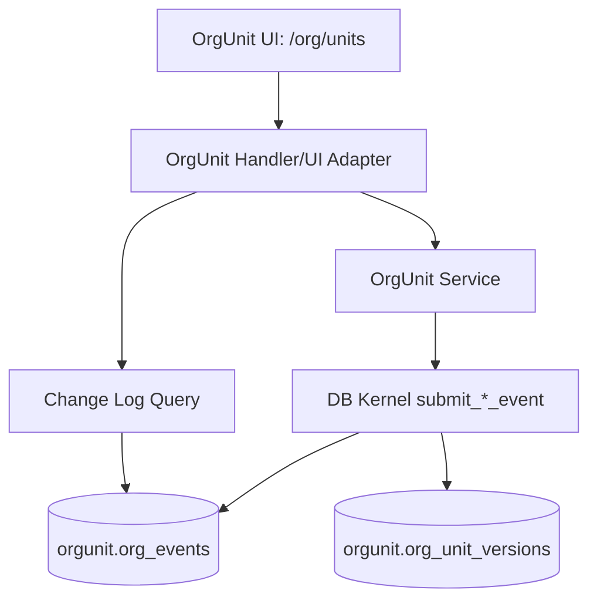

# DEV-PLAN-080：OrgUnit 审计链收敛（方向 1：单一审计链）详细设计

**状态**: 实施中（最近更新：2026-02-09）

## 1. 背景与上下文 (Context)
- **需求来源**: DEV-PLAN-078 后续收敛 + OrgUnit Details「变更日志」页面改造需求（`designs/orgunit/orgunit-details-ui.pen`）。
- **当前痛点**:
  - 审计链历史上存在 `org_events`、`org_events_audit`、`org_event_corrections_*` 并行，语义分散、维护复杂。
  - UI 侧“修改记录”难以完整还原审计事实，排障时需跨表/跨逻辑拼接。
  - CORRECT/RESCIND 的目标关联信息可读性弱，业务理解成本高。
- **业务价值**:
  - 审计事实源收敛到单表，减少双写与一致性风险。
  - 在 OrgUnit Details 中提供“全量可追溯”的变更日志，满足业务审计、技术排障、合规留痕。

## 2. 目标与非目标 (Goals & Non-Goals)
- **核心目标**:
  - [x] 仅保留 `orgunit.org_events` 作为 OrgUnit 唯一审计事实源（append-only）。
  - [ ] 保持 `orgunit.org_unit_versions` 作为业务 SoT，不引入第二写入口（One Door）。
  - [x] 明确 CORRECT/RESCIND 的目标关联语义（`target_event_uuid`）。
  - [x] 完成 OrgUnit Details 页签改造：名称统一为「变更日志」，展示全量审计链。
  - [x] 固定时间展示口径：变更日志按北京时间 `UTC+08:00` 显示 `YYYY-MM-DD hh:mm`。
- **非目标 (Out of Scope)**:
  - 不改变现有业务能力边界与外部业务语义（仅做审计链收敛与可视化增强）。
  - 不引入 replay / 离线重建工具链。
  - 不做历史在线迁移；采用当前阶段重基线策略。
  - 不新增运维开关或监控开关（遵循 AGENTS 3.6）。

## 2.1 工具链与门禁（SSOT 引用）
- **触发器清单（本计划命中项）**:
  - [x] Go 代码（服务/handler/查询拼装）
  - [x] `.templ` / Tailwind（若变更日志 UI 结构改动）
  - [ ] 多语言 JSON（本计划默认不新增词条）
  - [x] Authz（若新增日志读取权限校验）
  - [x] 路由治理（若新增页面局部渲染接口）
  - [x] DB 迁移 / Schema（`org_events` 字段/约束/索引）
  - [x] sqlc（schema 变更后需 regenerate）
- **SSOT 链接**:
  - 触发器矩阵与本地必跑：`AGENTS.md`
  - 命令入口：`Makefile`
  - CI 门禁：`.github/workflows/quality-gates.yml`
  - Atlas/Goose 闭环：`docs/dev-plans/024-atlas-goose-closed-loop-guide.md`
  - sqlc 规范：`docs/dev-plans/025-sqlc-guidelines.md`

## 3. 架构与关键决策 (Architecture & Decisions)

### 3.1 架构图 (Mermaid)


### 3.2 关键设计决策 (ADR 摘要)
- **决策 1：审计单链路**
  - 选项 A：保留多表并通过视图聚合。
  - 选项 B（选定）：`org_events` 单一 append-only 审计链；删除并行纠错审计表。
  - 理由：符合 `No Legacy` 与 `One Door`，降低双写和歧义。
- **决策 2：CORRECT/RESCIND 关联目标表示**
  - 选项 A（选定）：在事件 payload 中强制包含 `target_event_uuid`、`target_effective_date`、`op`。
  - 选项 B：额外拆分 `corrects_event_uuid/rescinds_event_uuid` 字段。
  - 理由：保持现有实现兼容，统一表达“目标事件”，避免字段分叉。
- **决策 3：发起人展示口径**
  - 选项 A（选定）：事件落库时固化 `initiator_name/initiator_employee_id` 快照。
  - 选项 B：仅存 `initiator_uuid`，展示时实时关联人员表。
  - 理由：审计历史不可漂移；避免人员主数据变更导致历史日志失真。
- **决策 4：日志展示口径**
  - 选定：默认展示“当前基线后的完整审计链”，不按类型/人员默认过滤；检索仅用于定位。

## 4. 数据模型与约束 (Data Model & Constraints)

### 4.1 表级变更清单
- **保留**：
  - `orgunit.org_unit_versions`（业务 SoT）
  - `orgunit.org_unit_codes`、`orgunit.org_trees`、`orgunit.org_id_allocators`
- **删除**：
  - `orgunit.org_events_audit`
  - `orgunit.org_event_corrections_current`
  - `orgunit.org_event_corrections_history`
- **修改**：
  - `orgunit.org_events` 增加审计可读字段与约束，作为唯一审计链。

### 4.2 `orgunit.org_events` 目标字段（收敛后）
> 以下为 080 的目标口径；以迁移脚本最终 DDL 为准。

> 说明：当前仓库 `orgunit.org_events` 已存在 `reason/before_snapshot/after_snapshot/tx_time/transaction_time` 等字段（见 `internal/sqlc/schema.sql`），本计划的“修改”以**补齐缺失字段、删除并行表、统一读写口径**为主。

```sql
-- 新增/强化字段（示意）
ALTER TABLE orgunit.org_events
  ADD COLUMN IF NOT EXISTS reason text,
  ADD COLUMN IF NOT EXISTS before_snapshot jsonb,
  ADD COLUMN IF NOT EXISTS after_snapshot jsonb,
  ADD COLUMN IF NOT EXISTS tx_time timestamptz NOT NULL DEFAULT now(),
  ADD COLUMN IF NOT EXISTS initiator_name text,
  ADD COLUMN IF NOT EXISTS initiator_employee_id text;

-- 幂等唯一
ALTER TABLE orgunit.org_events
  ADD CONSTRAINT org_events_request_code_unique UNIQUE (tenant_uuid, request_code);

-- 建议索引
CREATE INDEX IF NOT EXISTS org_events_tenant_tx_time_idx
  ON orgunit.org_events (tenant_uuid, tx_time DESC, id DESC);

-- 若当前已存在同名约束/索引，应使用 IF NOT EXISTS / 迁移脚本中的条件判断保证幂等。
```

### 4.3 事件语义约束
- 事件类型集合：`CREATE`、`MOVE`、`RENAME`、`DISABLE`、`ENABLE`、`SET_BUSINESS_UNIT`、`CORRECT_EVENT`、`CORRECT_STATUS`、`RESCIND_EVENT`、`RESCIND_ORG`。
- 快照约束：
  - `CREATE/ENABLE/MOVE/RENAME/SET_BUSINESS_UNIT`：`after_snapshot` 必填。
  - `DISABLE/CORRECT_*/RESCIND_*`：`before_snapshot` 与 `after_snapshot` 必填。
  - `before_snapshot/after_snapshot` 必须为 JSON object。
- CORRECT/RESCIND 目标引用（必选）：
  - 当 `event_type IN (CORRECT_EVENT,CORRECT_STATUS,RESCIND_EVENT,RESCIND_ORG)` 时，`payload` 必须包含：
    - `target_event_uuid`
    - `target_effective_date`
    - `op`
  - `target_event_uuid` 必须指向同租户已存在事件。
- 发起人快照：
  - 落库固化 `initiator_uuid + initiator_name + initiator_employee_id`。
  - UI fallback：`未知用户(<initiator_uuid>)`。

### 4.4 读模型边界
- 业务“生效记录”可继续使用 `org_events_effective`（折叠后视图）。
- **变更日志**必须直接基于 `org_events`（或等价只读视图，且不能丢失 CORRECT/RESCIND 事实）。

### 4.4.1 审计可读性契约（承接 DEV-PLAN-080D）
1. 审计日志默认保留全量历史事实，不提供“仅生效事件”默认过滤开关。
2. 对已被撤销的历史事件，UI 必须显式标识“已撤销”，禁止让用户自行推断是否仍生效。
3. `RESCIND_EVENT/RESCIND_ORG` 写入必须携带完整快照与关键 payload（`op/reason/target_event_uuid/target_effective_date`），禁止简化 payload 写法。
4. 与 4.4 的边界保持一致：展示层做“状态可读性增强”，不引入第二审计事实源或 legacy 双链路。

### 4.5 迁移策略
1. [ ] 冻结变更窗口。
2. [ ] 执行 schema 迁移：补齐 `org_events` 字段/约束/索引。
3. [ ] 移除 legacy 审计相关表及引用。
4. [ ] 重灌最小 seed，建立新基线（不做历史回填）。
5. [ ] 迁移后执行一致性校验 SQL 与回归用例。

## 5. 接口契约 (API Contracts)

> 说明：本节定义“页面局部渲染”的 UI 契约与最小字段集合，避免实现阶段对字段/排序/分页产生二次设计。

### 5.0 字段字典（面向 UI）
- `event_uuid`：事件唯一标识（uuid）。
- `event_type`：事件类型（见 4.3）。
- `effective_date`：业务生效日（Valid Time，date）。
- `tx_time`：审计时间（Audit/Tx Time，timestamptz）；UI 固定按北京时间 `UTC+08:00` 展示为 `YYYY-MM-DD hh:mm`。
- `request_code`：幂等键（tenant 级唯一）。
- `tenant_uuid`：租户标识（uuid）。
- `org_id`：组织 ID（8 位 int）。
- `initiator_uuid`：发起人 uuid。
- `initiator_name` / `initiator_employee_id`：发起人人名/工号快照（事件写入时固化）。
- `reason`：纠错/撤销原因（可空）。
- `before_snapshot` / `after_snapshot`：变更前/后快照（jsonb object）。
- `target_event_uuid` / `target_effective_date`：仅 CORRECT/RESCIND 事件必显（来自 payload）。

### 5.1 UI：变更日志列表（建议新增或改造现有 partial）
- **Route**: `GET /org/api/org-units/audit?org_code={code}&limit={n}`
- **行为**:
  - 默认 `limit=20`，`tx_time DESC, id DESC` 排序。
  - 返回 JSON events 列表，由前端渲染左栏选中态。
- **Query Params**:
  - `org_code`（required, string）：目标组织编码。
  - `limit`（optional, int）：默认 20，最大 100。
- **排序与分页口径（强制）**:
  - `ORDER BY tx_time DESC, id DESC`。
  - 分页扩展（如需）应通过扩展 API 契约实现，当前最小口径先覆盖 limit 读取。
- **列表项最小字段**:
  - `event_uuid`
  - `tx_time`（展示为 UTC+08:00）
  - `initiator_name`
  - `initiator_employee_id`
  - `event_type`

> 注意：变更日志列表需要包含 CORRECT/RESCIND 事件本身；不得仅查询 `org_events_effective`。

### 5.2 UI：变更日志详情
- **Route**: 无独立详情路由；复用 `GET /org/api/org-units/audit` 的返回结果，在前端按 `event_uuid` 选择详情项
- **行为**:
  - 右栏详情由前端根据选中事件渲染。
  - 摘要区必显：`event_type/effective_date/tx_time/request_code/event_uuid/initiator_uuid/initiator_name/initiator_employee_id/tenant_uuid/org_id/reason`。
  - CORRECT/RESCIND 额外显示：`target_event_uuid/target_effective_date`。
  - 包含三段：摘要 + 变更表格（仅变化项）+ 原始数据（完整 JSON，默认折叠）。

#### 变更日志详情：渲染规则（强制）
- `event_type`：以 badge/标签突出显示。
- `tx_time`：展示 `YYYY-MM-DD hh:mm`（UTC+08:00），同时在“原始数据”区保留原始值（含时区信息）。
- CORRECT/RESCIND：
  - 摘要区必须显示 `target_event_uuid/target_effective_date`。
  - 提供“跳转到目标事件”入口（同页切换右栏即可）。
- 变更表格：
  - 以 `before_snapshot/after_snapshot` 生成 diff。
  - 仅展示变化字段；字段顺序按“高频业务字段优先”（name/status/parent/is_business_unit/manager 等），其余字段按字母序或稳定序。
- 原始数据折叠区：
  - 展示事件行的全部字段（至少包括字段字典中的全部字段）。
  - 展示 `before_snapshot/after_snapshot` 原始 JSON（不裁剪），支持复制。

### 5.3 错误与状态契约
- 无权限：返回无权限态片段（不静默空白）。
- 数据为空：返回空态片段（明确文案）。
- 加载失败：返回错误态片段，允许重试。

#### 错误码/状态映射（页面口径）
- `ORG_EVENT_NOT_FOUND`：提示“事件不存在或已不可见”。
- `RLS_TENANT_*` / `RLS_*`：提示“租户上下文缺失/不匹配”（仅技术排障态可见，普通用户给通用提示）。
- `403`（无权限）：提示“无权限查看变更日志”，并保持其它页签可用。

## 6. 核心逻辑与算法 (Business Logic & Algorithms)

### 6.1 写路径不变式（One Door）
1. 所有写入必须进入 DB Kernel `submit_*_event(...)`。
2. 同事务内写 `org_events` + 更新 `org_unit_versions`。
3. 任一失败回滚（fail-closed）。

### 6.2 CORRECT/RESCIND 处理规则
1. 解析并校验 `target_event_uuid`。
2. 校验目标事件是否可纠错/撤销，且未被更高优先级撤销逻辑阻断。
3. 写入 CORRECT/RESCIND 事件（append-only）。
4. 读模型按 `tx_time DESC, id DESC` 取目标最新覆盖事件。

### 6.3 变更日志查询算法（列表）
1. 输入 `tenant_uuid + org_id + cursor + limit`。
2. 查询 `org_events` 全量事件（含 CORRECT/RESCIND）。
3. 按 `tx_time DESC, id DESC` 返回。
4. 前端展示时间格式化为 `YYYY-MM-DD hh:mm`（UTC+08:00）。

### 6.4 变更表格（前后值）生成规则
1. 从 `before_snapshot/after_snapshot` 计算字段级 diff。
2. 仅展示变化字段；同名字段并排显示“变更前/变更后”。
3. 原始 JSON 不裁剪，放在折叠区供排障。

## 7. 安全与鉴权 (Security & Authz)
- RLS 与租户注入保持现有策略：所有查询必须在事务内设置 `app.current_tenant`。
- 变更日志读取遵循 OrgUnit 既有读取权限；无权限需显式返回无权限态。
- 日志默认全量展示是“同租户、同组织范围内全量”，不允许跨租户可见。

## 8. 依赖与里程碑 (Dependencies & Milestones)
- **依赖**:
  - `DEV-PLAN-078`（写模型与审计链现状基线）
  - `DEV-PLAN-075*`（OrgUnit 业务语义冻结）
  - `DEV-PLAN-032`（Valid Time day 粒度）
- **里程碑**:
  1. [x] Schema/迁移脚本完成（单链路收敛 + 审计字段补齐）。
  2. [x] DB Kernel 校验补齐（target_event_uuid/快照/幂等）。
  3. [x] 变更日志页签 UI 改造完成（左窄右宽、全量展示）。
  4. [x] 自动化回归完成（DB + Handler + UI）。
  5. [ ] readiness 证据补充到 `docs/dev-records/`。

## 9. 测试与验收标准 (Acceptance Criteria)

### 9.1 数据与内核
- [x] `org_events` 成为唯一审计事实源；不存在对 `org_events_audit/org_event_corrections_*` 的读写依赖。
- [ ] 幂等键 `(tenant_uuid, request_code)` 生效，重复请求语义一致返回幂等成功，语义冲突返回 `ORG_REQUEST_ID_CONFLICT`。
- [x] CORRECT/RESCIND 事件 payload 均含 `target_event_uuid`，且目标引用可追溯。

### 9.2 页面与交互（变更日志）
- [x] 页签名称为「变更日志」。
- [x] 左栏标题为「修改时间」，每项展示两行：
  - `YYYY-MM-DD hh:mm`
  - `姓名(工号)`
- [x] 左栏支持“加载更多”直至末尾，不得固定条数硬截断。
- [x] 右栏突出 `event_type`，显示摘要 + 变更表格 + 原始数据折叠区。
- [x] CORRECT/RESCIND 详情可见 `target_event_uuid/target_effective_date` 并支持跳转目标事件。
- [x] 覆盖 read-only / edit / no-permission 三种状态。

### 9.3 工具链与门禁
- [x] 通过本计划命中的门禁（以 `AGENTS.md` 与 CI workflow 为准）。
- [ ] 若涉及 `.templ` / css 生成物，确保生成后工作区无漏提交。

## 10. 运维与监控 (Ops & Monitoring)
- 当前阶段不引入 Feature Flag（遵循仓库“避免过度运维”原则）。
- 保留结构化日志最小字段用于排障：`tenant_uuid`、`org_id`、`event_uuid`、`request_code`、`event_type`。
- 回滚策略采用“环境级保护 + 停写/只读 + 修复后重试”，不引入 legacy 双链路回退。

## 实施步骤（执行清单）
1. [ ] **切换方案评审与窗口确认（先决）**
   - 明确“先兼容代码、后删表”的执行顺序，避免迁移后运行时断链。
   - 确认重基线窗口（停写/只读策略）与责任人。
   - Stopline：评审结论写入本计划与 `docs/dev-records/`，未确认窗口不得执行删表迁移。

2. [ ] **迁移草案与预检（不落库）**
   - 产出 Atlas/Goose 迁移草案：字段补齐、约束索引、legacy 表移除脚本。
   - 执行模块闭环预检：`make orgunit plan && make orgunit lint`。
   - Stopline：plan/lint 通过后方可进入代码与落库阶段。

3. [ ] **代码兼容改造（迁移前完成）**
   - DB Kernel：确保 CORRECT/RESCIND 目标引用与幂等冲突校验完整。
   - 写路径：落库固化 `initiator_name/initiator_employee_id` 快照。
   - 查询路径：变更日志读取基于 `org_events` 全量链路（含 CORRECT/RESCIND）。
   - Stopline：静态检查无 `org_events_audit|org_event_corrections_` 运行时依赖残留。

4. [ ] **执行迁移与重基线（窗口内）**
   - 按窗口执行：`make orgunit migrate up`。
   - 删除并行审计表与其读写路径；重灌最小 seed。
   - Stopline：迁移后结构校验通过（表/约束/索引存在性与缺失性符合预期）。

5. [ ] **变更日志页签实现与联调**
   - 页签名称固定为「变更日志」。
   - 左栏：`修改时间` + `YYYY-MM-DD hh:mm` + `姓名(工号)`；支持加载更多到末尾。
   - 右栏：摘要 + 变更表格 + 原始 JSON 折叠；CORRECT/RESCIND 显示目标事件并可跳转。
   - Stopline：read-only/edit/no-permission 三态画面可稳定复现。

6. [ ] **专项回归（审计语义）**
   - 全量展示校验：确认默认不按事件类型/人员过滤。
   - 时间语义校验：`tx_time` 固定按 `UTC+08:00` 展示。
   - 目标引用校验：CORRECT/RESCIND 均可追溯至 `target_event_uuid`。
   - Stopline：关键断言纳入自动化用例（DB/handler/UI 至少各一组）。

7. [ ] **门禁总验（按 AGENTS 触发器）**
   - Go 质量门禁：`go fmt ./... && go vet ./... && make check lint && make test`。
   - 迁移/sqlc 门禁：`make orgunit plan && make orgunit lint && make orgunit migrate up && make sqlc-generate`。
   - UI 与路由门禁（命中时）：`make generate && make css && make check routing`。
   - 文档门禁：`make check doc`。
   - Stopline：以上命中项通过后才可标记“准备就绪/可合并”。

8. [ ] **Readiness 证据归档与收口**
   - 在 `docs/dev-records/` 记录执行时间、命令、结果、异常与修复。
   - 回填本计划复选框，更新状态与时间戳。
   - Stopline：证据未归档不得关闭本计划。

## 交付物
- `docs/dev-plans/080-orgunit-audit-chain-consolidation.md`（本文件，按 001 模板细化）
- `designs/orgunit/orgunit-details-ui.pen`（变更日志页签设计）
- 相关 schema/代码/测试（实施阶段提交）

## 关联与引用
- 模板：`docs/dev-plans/001-technical-design-template.md`
- 路线图：`docs/dev-plans/009-implementation-roadmap.md`
- 前置背景：`docs/dev-plans/078-orgunit-write-model-alternatives-comparison-and-decision.md`
- 质量门禁与触发器：`AGENTS.md`
