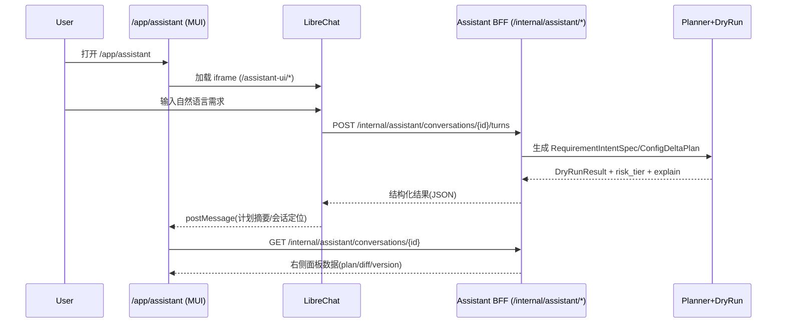
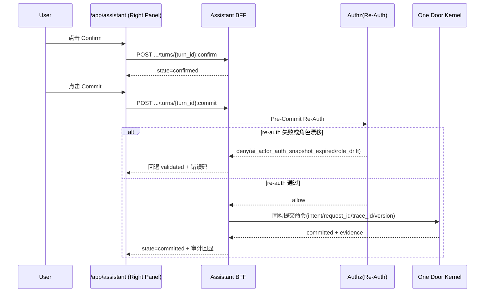

# DEV-PLAN-220：聊天框式 AI 助手升级实施方案（SetID Governance × Req2Config × Conversation Tx）

**状态**: 规划中（2026-03-02 13:45 UTC）

## 0. 阅读导航（排版优化）

1. `1-4`：背景、目标、SSOT 对齐、分阶段范围。  
2. `5`：关键设计冻结（交互边界、API、安全、时序、Temporal、语义主键确认）。  
3. `6`：执行清单 + 架构一致性收敛 + 已冻结决策。  
4. `7-8`：门禁验证与 TDD 测试矩阵（含重点 E2E 详案）。  
5. `9-12`：验收、风险、交付证据、最终决策结论。

## 1. 背景与问题定义

当前仓库已具备 SetID 治理与 explain 的可视化能力（`/app/org/setid/base|registry|explain|ops`），并已完成 200 蓝图的 Req2Config、Skill 契约、会话事务、Temporal 最小编排与评测门禁文档闭环（`DEV-PLAN-200/208/209/210/211/212`）。

本轮决策：引入开源 `LibreChat`（MIT）作为“聊天与计划展示层”，但不承载业务提交裁决。

但用户侧仍缺少“聊天框式 AI 助手”入口，导致以下问题：

1. 用户无法用自然语言发起“需求 -> 计划 -> dry-run -> 确认 -> 提交”的完整链路。  
2. 现有能力分散在治理页与内部接口，缺少统一会话视图与风险提示。  
3. AI 编排约束（risk_tier、re-auth、AI/UI 等价提交）虽已在蓝图冻结，但尚未通过一个对用户可见的聊天工作台承接。

## 2. 目标与非目标

### 2.1 核心目标

1. [ ] 提供可发现、可操作的聊天式入口 `/app/assistant`，支持多轮对话。  
2. [ ] 引入 `LibreChat` 作为聊天前台与计划展示壳（self-host），与现有后端对接。  
3. [ ] 落地三段式链路：`RequirementIntentSpec -> ConfigDeltaPlan -> DryRunResult`（可视化展示）。  
4. [ ] 落地会话事务状态机：`draft -> proposed -> validated -> confirmed -> committed`。  
5. [ ] 确保 AI 提交与 UI 提交同构（同 `intent/request_id/trace_id/version`），无 `ai_*` 专用写链路。  
6. [ ] 落地 actor-delegated authz（提交前 re-auth + 角色漂移阻断）。

### 2.2 非目标

1. [ ] 不引入 AI 独立授权主体或超级账号。  
2. [ ] 不新增 legacy 回退通道/双链路。  
3. [ ] 不在本计划内扩展到 SetID 治理之外的全业务域智能体。
4. [ ] 不让 `LibreChat` 直接执行 `confirm/commit/re-auth/One Door`（仅做聊天与展示层）。

## 3. 对齐关系（SSOT）

- 契约与里程碑：`docs/dev-plans/200-composable-building-block-architecture-blueprint.md`  
- 只读规划与 strict decode：`docs/dev-plans/208-blueprint-req2config-readonly-and-strict-decode.md`  
- 会话事务与委托授权：`docs/dev-plans/210-blueprint-conversation-transaction-and-actor-delegated-authz.md`  
- 编排与门禁：`docs/dev-plans/211-blueprint-temporal-m10d0-minimal-orchestration-foundation.md`、`docs/dev-plans/212-blueprint-eval-gates-and-triggered-temporal-productionization.md`  
- 仓库总约束：`AGENTS.md`（Contract First / No Legacy / One Door / No Tx, No RLS / 用户可见性）

### 3.1 标准对齐（DEV-PLAN-005）

1. [ ] `STD-001`：统一 `request_id/trace_id` 命名。  
2. [ ] `STD-004`：不新增 AI 旁路写入口。  
3. [ ] `STD-011`：错误码与提示稳定、可解释。  
4. [ ] `STD-012`：授权顺序与 403 合同保持一致。

## 4. 范围与阶段划分

### 4.1 P0（聊天 + 只读计划，LibreChat 前台）

1. [ ] 新增导航与路由：`/app/assistant`。  
2. [ ] 自建部署 `LibreChat`（版本冻结 + 配置基线），并通过反向代理接入平台导航。  
3. [ ] 聊天面板支持自然语言输入、会话列表、回放（由 LibreChat 承载）。  
4. [ ] 后端提供会话创建/回合提交/计划与 dry-run 查询（只读，不提交）。  
5. [ ] UI 可视化展示 `plan/diff/explain/risk_tier`（LibreChat 嵌入/扩展卡片）。

### 4.2 P1（受控提交）

1. [ ] 增加 `confirm` 与 `commit` 操作。  
2. [ ] `high` 风险强制人工确认令牌（P1 采用单人确认 + 提交瞬时 re-auth）。  
3. [ ] 提交前强制 re-auth，快照过期/角色漂移 fail-closed。  
4. [ ] `confirm/commit` 仍由现有后端执行，并与现有 One Door 写链路同构集成。

### 4.3 P2（编排增强）

1. [ ] Skill 白名单 + risk_tier 审批矩阵。  
2. [ ] 审批待办双人确认（按合规要求触发，默认不阻塞 P1）。  
3. [ ] planner/skill 固定样本评测纳入 `make preflight`。
4. [ ] 异步任务句柄与恢复（必要时接入 Temporal 工作流层）。

## 5. 关键设计冻结

### 5.1 用户可见性与交互

1. [ ] 导航新增“AI 助手”，满足“可发现、可操作”。  
2. [ ] 单屏包含四块核心卡片：对话、计划、dry-run diff、风险与确认。  
3. [ ] 每轮回合展示 `request_id/trace_id/policy_version/composition_version`。  
4. [ ] 错误提示必须映射稳定错误码，不暴露内部敏感字段。

#### 5.1.1 LibreChat 接入边界（冻结）

1. [ ] `LibreChat` 仅承载“聊天输入、计划展示、交互壳”，不承载业务授权裁决。  
2. [ ] `LibreChat` 不直连业务数据库，不调用业务写入口。  
3. [ ] `confirm/commit/re-auth/One Door` 全部保留在现有后端。  
4. [ ] `LibreChat` 与后端交互仅通过 `internal/assistant/*` 契约接口（BFF/Adapter 模式）。

#### 5.1.2 租户隔离与身份绑定（冻结）

1. [ ] 会话创建时必须绑定 `tenant_id + actor_id`，并在整个 `conversation_id` 生命周期内不可漂移。  
2. [ ] 每次 `turn/confirm/commit/task` 调用都必须校验“请求租户 == 会话租户 == 当前会话身份租户”，不一致立即 fail-closed。  
3. [ ] `tenant_id` 仅以服务端绑定结果为准，不信任前端透传字段作为最终裁决依据。  
4. [ ] 审计日志必须记录 `tenant_id/actor_id/conversation_id/turn_id/request_id`，用于跨租户排障与追责。

### 5.2 API 契约（草案）

1. [ ] `POST /internal/assistant/conversations`（创建会话）  
2. [ ] `POST /internal/assistant/conversations/{conversation_id}/turns`（提交回合并产出计划）  
3. [ ] `GET /internal/assistant/conversations/{conversation_id}`（查询会话与回合）  
4. [ ] `POST /internal/assistant/conversations/{conversation_id}/turns/{turn_id}:confirm`（确认）  
5. [ ] `POST /internal/assistant/conversations/{conversation_id}/turns/{turn_id}:commit`（提交）
6. [ ] `POST /internal/assistant/tasks`（提交异步任务，P2）  
7. [ ] `GET /internal/assistant/tasks/{task_id}`（查询异步任务，P2）  
8. [ ] `POST /internal/assistant/tasks/{task_id}:cancel`（取消异步任务，P2）

说明：以上 assistant 路由（含 tasks）需同步更新 allowlist 与 capability-route-map，且全部纳入 authz 映射门禁。

### 5.3 授权与安全

1. [ ] 授权顺序冻结：`Actor Bind -> MapRouteToObjectAction -> Require -> Pre-Commit Re-Auth -> One Door`。  
2. [ ] AI 仅代操作者执行，不得提权。  
3. [ ] 禁止 AI 直写数据库。  
4. [ ] 同 actor + 同输入下 AI/UI allow/deny、错误码、版本冲突判定一致。
5. [ ] `LibreChat` 服务凭据仅允许访问 assistant 编排接口，禁止越权访问业务写路由。
6. [ ] assistant 全路由统一映射到固定 authz 对象与动作，不允许旁路路由绕开中间件校验。

### 5.4 风险分级与确认

1. [ ] 统一 `risk_tier`：`low/medium/high`。  
2. [ ] `high` 必须人工确认后才可 commit（P1 单人确认，P2 评估双人确认）。  
3. [ ] 若 `policy_version/composition_version/mapping_version` 漂移，状态回退 `validated` 并要求重新确认。  
4. [ ] 同 `conversation_id + turn_id + request_id` 仅允许幂等重试。

### 5.5 错误码与提示

1. [ ] 复用并落地蓝图错误码：`conversation_*`、`ai_plan_*`、`skill_*`。  
2. [ ] 前后端错误提示映射一致，命中 `make check error-message`。

### 5.6 数据模型与迁移约束

1. [ ] 会话/回合/检查点/证据索引等持久化模型按最小闭环设计。  
2. [ ] P1 允许引入最小会话持久化表（如 `conversation/turn/checkpoint`），用于状态机、幂等重试、回放审计。  
3. [ ] 若涉及新增表或 `CREATE TABLE`，必须先获得用户手工确认后再实施（遵循 `AGENTS.md`）。
4. [ ] `LibreChat` 侧数据存储与业务库隔离，禁止共享业务写库凭据。

### 5.7 页面结构草图（`/app/assistant`）

目标：在现有 AppShell 内提供“双面板”工作台；左侧聊天与计划展示（LibreChat），右侧事务控制（本系统 MUI 面板）。

```text
+--------------------------------------------------------------------------------------+
| AppShell (TopBar + LeftNav)                                                         |
|  Breadcrumb: Home / AI Assistant                                                    |
+--------------------------------------------------------------------------------------+
| [Left Panel: LibreChat Embed]            | [Right Panel: Assistant Control Panel]   |
|-------------------------------------------|-------------------------------------------|
| - 会话列表/历史                             | - 当前会话状态: draft/proposed/...         |
| - 聊天输入框                                | - Plan Summary 卡片                        |
| - 模型响应（自然语言 + 计划摘要）            | - DryRun Diff 卡片                         |
| - 建议操作（继续补参/重新生成）               | - Risk Tier 卡片 (low/medium/high)         |
|                                           | - Explain/Version 卡片                    |
|                                           |   request_id / trace_id / policy_version  |
|                                           |   composition_version / mapping_version   |
|                                           | - Action 区域                              |
|                                           |   [Regenerate] [Confirm] [Commit]         |
|                                           | - 审批与校验日志                           |
|                                           |   re-auth result / role drift / errors    |
+--------------------------------------------------------------------------------------+
| Footer Hint: LibreChat 仅负责聊天与展示；提交裁决由后端 One Door 执行                |
+--------------------------------------------------------------------------------------+
```

布局约束（冻结）：

1. [ ] 左侧仅承载聊天与展示，不出现直接业务写按钮。  
2. [ ] `Confirm/Commit` 按钮仅在右侧事务面板出现。  
3. [ ] 右侧必须始终显示当前 `conversation_id + turn_id + request_id + trace_id`。  
4. [ ] 高风险时右侧必须显示确认门槛与阻断原因（不可仅在聊天文本中提示）。

### 5.8 路由 / 代理 / API 交互时序图（冻结）

#### 5.8.1 路由与代理拓扑（逻辑）

```text
Browser
  └─ GET /app/assistant
       └─ Go Server (AppShell + AssistantPage)
            ├─ iframe/src -> /assistant-ui/*  (reverse proxy to LibreChat)
            └─ XHR/fetch -> /internal/assistant/* (本系统后端 API)
```

路由职责：

1. [ ] `/app/assistant`：本系统页面壳与事务控制面板。  
2. [ ] `/assistant-ui/*`：反向代理到 LibreChat（仅聊天展示）。  
3. [ ] `/internal/assistant/*`：会话状态机、dry-run、confirm、commit（裁决链路）。

#### 5.8.2 P0（只读计划）时序



#### 5.8.3 P1（确认与提交）时序



#### 5.8.4 强约束（Fail-Closed）

1. [ ] LibreChat 不得直接调用业务写接口；仅能访问 `/internal/assistant/*`。  
2. [ ] `commit` 必须先 re-auth，再进入 One Door；顺序不可交换。  
3. [ ] 任一版本漂移（policy/composition/mapping）必须返回 `validated` 并要求重确认。  
4. [ ] 所有拒绝必须返回稳定错误码并在右侧面板可见。
5. [ ] `postMessage` 必须做 `origin allowlist + schema 校验 + nonce/channel` 三重校验，未通过一律丢弃。  
6. [ ] iframe 集成需设置最小权限 CSP/sandbox 策略（禁止不必要脚本能力与跨源注入）。

### 5.9 Temporal 编排加速器（P2）实施细化（冻结）

定位：Temporal 仅用于异步编排加速，不承载授权裁决与业务提交裁决。

#### 5.9.1 触发与边界

1. [ ] 仅在 P2 启用，且触发条件沿用 `DEV-PLAN-212`（预发/生产窗口或容量阈值触达）。  
2. [ ] P0/P1 默认走同步链路，不依赖 Temporal。  
3. [ ] 即使启用 Temporal，`confirm/commit/re-auth/One Door` 仍在现有后端链路执行。  
4. [ ] 若 Temporal 不可用，异步任务 fail-closed 并可人工接管，不得绕过提交门禁。

#### 5.9.2 Workflow / Activity 拆分

1. [ ] Workflow 主键冻结：`conversation_id + turn_id + request_id`（幂等与恢复键）。  
2. [ ] Workflow 名称建议：`assistant_async_orchestration_v1`。  
3. [ ] Activity 最小集合：  
   - `activity_generate_plan`（Req2Config 只读计划）  
   - `activity_run_dryrun`（组合模拟 + diff）  
   - `activity_skill_eval`（P2 评测门禁）  
   - `activity_persist_checkpoint`（检查点固化）  
   - `activity_publish_task_status`（任务状态回写）  
4. [ ] 明确禁止 Activity 直接调用业务写入口（仅可访问 `internal/assistant/*` 编排能力）。

#### 5.9.3 运行拓扑与资源隔离

1. [ ] Namespace 至少区分 `dev` / `staging`。  
2. [ ] Task Queue 逻辑分离：`assistant-plan`、`assistant-eval`、`assistant-recovery`。  
3. [ ] Worker 使用最小权限服务账户；不注入业务库写凭据。  
4. [ ] Temporal 存储与业务库隔离，禁止共享业务库账号。

#### 5.9.4 超时 / 重试 / 接管策略

1. [ ] 超时预算（默认建议）：plan 30s、dry-run 45s、eval 60s。  
2. [ ] 重试策略（默认建议）：指数退避，`max_attempts=3`。  
3. [ ] 重试耗尽进入 `dead-letter`，状态标记 `manual_takeover_required`。  
4. [ ] 人工接管后仅允许“重跑同 request_id”或“显式新建 turn”，禁止隐式改写旧结果。

#### 5.9.5 异步 API 契约（供前台轮询）

1. [ ] `POST /internal/assistant/tasks`：提交异步任务，返回 `AsyncTaskReceipt`。  
2. [ ] `GET /internal/assistant/tasks/{task_id}`：查询状态与阶段输出。  
3. [ ] `POST /internal/assistant/tasks/{task_id}:cancel`：取消未完成任务。  
4. [ ] `AsyncTaskReceipt` 最小字段：`task_id/task_type/submitted_at/status/poll_uri`。  
5. [ ] 任务状态最小集合：`queued/running/succeeded/failed/manual_takeover_required/canceled`。

#### 5.9.6 可观测性与门禁

1. [ ] 指标最小集：队列积压、失败率、超时率、重试耗尽率、人工接管率。  
2. [ ] 指标需接入 P2 评测门禁并在 `make preflight` 可见。  
3. [ ] 若阈值不达标，阻断 P2 推进（沿用 `DEV-PLAN-212` 策略）。  
4. [ ] 异常必须产出稳定错误码（如 `orchestration_timeout` / `orchestration_retry_exhausted`）。

### 5.10 AI 语义解析与断言主键确认协议（冻结）

目标：在“用户自然语言输入”与“稳定主键断言”之间建立可审计、可回放、fail-closed 的解析协议，避免仅靠名称断言带来的不稳定性。

#### 5.10.1 双层职责分离（AI + 确定性解析器）

1. [ ] **AI 层（语义理解）**：仅输出结构化意图，不直接决定最终主键。  
2. [ ] **解析器层（确定性）**：基于租户/时点/权限过滤候选并排序，输出候选主键集合。  
3. [ ] **提交层（裁决）**：仅接受“唯一且确认”的主键进入 confirm/commit。

#### 5.10.2 结构化意图与候选模型

1. [ ] `RequirementIntentSpec` 增补引用字段：`parent_ref_text/new_entity_name/effective_date`。  
2. [ ] 候选主键最小模型：`candidate_id/candidate_code/path/as_of/is_active/match_score`。  
3. [ ] 解析输出最小字段：`resolved_candidate_id/ambiguity_count/confidence/resolution_source`。  
4. [ ] `resolution_source ∈ {auto,user_confirmed}`，必须可审计回放。

#### 5.10.3 决策与确认策略（Fail-Closed）

1. [ ] 当 `ambiguity_count=1` 且 `confidence` 达阈值时，允许自动选中并继续。  
2. [ ] 当 `ambiguity_count>1` 或 `confidence` 不足时，必须进入用户确认回合。  
3. [ ] 用户未确认候选主键前，禁止进入 commit。  
4. [ ] 会话中若候选集因上下文变化发生漂移，状态回退 `validated` 并要求重确认。

#### 5.10.4 用户确认交互协议

1. [ ] 确认提示至少展示：`名称 + code + 路径 + as_of`，禁止只显示名称。  
2. [ ] 支持“编号确认”（如选 1/2/3）与“显式输入 code/id”两种确认方式。  
3. [ ] 若用户输入不匹配候选集，返回稳定错误码并保持待确认状态。  
4. [ ] 确认结果写入会话上下文并加签（防止后续回合静默篡改）。

#### 5.10.5 E2E 断言策略升级（兼容名称语义）

1. [ ] 保留名称可读性断言（如“鲜花组织”“运营部”）用于用户语义验收。  
2. [ ] 主断言统一使用主键关系断言：`created_org_id`、`parent_org_id`、`effective_date`。  
3. [ ] 当名称同名冲突时，E2E 必须覆盖“确认候选 -> 提交”路径。  
4. [ ] 若未确认候选主键，E2E 必须验证“阻断提交且无写副作用”。

## 6. 实施步骤与治理收敛

### 6.1 执行模型（按阶段里程碑推进）

1. [ ] 采用 `P0 -> P1 -> P2` 三阶段推进，每阶段均定义：入口条件、核心任务、完成定义（DoD）、阻断条件。  
2. [ ] 每阶段结束必须同时完成“功能验收 + 路由/授权/错误码映射验收 + 测试门禁验收”。  
3. [ ] 未达到阶段 DoD，不进入下一阶段实现。

### 6.2 P0 里程碑（聊天 + 只读计划）

入口条件：

1. [ ] DEV-PLAN-220 评审通过并冻结范围。  
2. [ ] `LibreChat` 接入边界与租户绑定规则冻结（见 `5.1.1/5.1.2`）。

核心任务：

1. [ ] 完成 IA 与页面草图，落地 `/app/assistant` 双面板。  
2. [ ] 完成 `LibreChat` 自建部署、反向代理与最小安全基线。  
3. [ ] 实现 `conversations/turns` 只读规划链路（plan + dry-run + explain）。  
4. [ ] 对接 strict decode + static lint，阻断 schema/边界违约。  
5. [ ] 同步补齐 assistant 路由的 allowlist/capability-route-map/authz 映射。

完成定义（DoD）：

1. [ ] 用户可在 `/app/assistant` 发起自然语言输入并看到右侧计划与 diff。  
2. [ ] `confirm/commit` 尚未开放写入，但状态机字段与追踪字段可见。  
3. [ ] P0 相关契约测试与 UI 测试通过（对应 `8.2/8.3/8.4` 基线用例）。

### 6.3 P1 里程碑（受控提交）

入口条件：

1. [ ] P0 DoD 全部满足。  
2. [ ] 若涉及新增会话持久化表，已获得用户书面确认后再执行迁移。

核心任务：

1. [ ] 落地 `confirm/commit` 与会话状态机持久化。  
2. [ ] 落地 `Pre-Commit Re-Auth` 与角色漂移/快照过期阻断。  
3. [ ] 确保 AI/UI 同构提交进入 One Door，无 `ai_*` 写旁路。  
4. [ ] 落地“语义解析与主键确认协议”（候选解析 + 用户确认 + 固化字段）。

完成定义（DoD）：

1. [ ] 满足“未确认不提交、高风险先确认、漂移即回退 validated”的 fail-closed 行为。  
2. [ ] E2E 关键用例通过：`TC-220-E2E-101/102/103/104`。  
3. [ ] 审计可回放：`tenant_id/actor_id/conversation_id/turn_id/request_id` 完整可追踪。

### 6.4 P2 里程碑（编排增强）

入口条件：

1. [ ] P1 DoD 全部满足。  
2. [ ] 触发条件满足 `DEV-PLAN-212`（触发式推进）。

核心任务：

1. [ ] 落地 tasks API 与 Temporal 工作流编排（仅异步加速，不承载裁决）。  
2. [ ] 落地 timeout/retry/dead-letter/manual takeover 机制。  
3. [ ] 落地 skill/risk_tier 评测门禁并接入 `make preflight`。

完成定义（DoD）：

1. [ ] 异步任务可观测、可恢复、可取消，且失败不绕过 `confirm/commit` 门禁。  
2. [ ] `TC-220-TMP-*` 集成测试通过并满足 P2 指标阈值。

### 6.5 硬闸门（Hold Points）

1. [ ] **Hold-A（迁移闸门）**：出现 `CREATE TABLE` 或新增表迁移时，必须先获用户确认。  
2. [ ] **Hold-B（映射闸门）**：assistant 新路由必须同步提交 allowlist/capability/authz 映射及对应测试。  
3. [ ] **Hold-C（发布闸门）**：`make check routing`、`make check capability-route-map`、`make authz-*`、`make test`、`make e2e`、`make preflight`、`make check doc` 全绿后才可进入下一里程碑。

### 6.6 跨阶段架构一致性收敛（开发问题）

1. [ ] **单入口一致性**：聊天、确认、提交、异步任务统一经 `internal/assistant/*`，禁止并行旁路。  
2. [ ] **单授权链一致性**：assistant 统一走既有 authz middleware，禁止适配层自定义“第二套授权”。  
3. [ ] **单错误码目录一致性**：assistant 新错误码纳入统一错误目录与前端映射，不接受临时文案。  
4. [ ] **单映射事实源一致性**：assistant 路由与 capability 映射以 `route-capability-map.v1.json` 与 Go 注册表同源更新。  
5. [ ] **单租户语义一致性**：assistant 会话、任务、审计字段统一使用 `tenant_id`，不允许别名漂移。  
6. [ ] **单主键断言一致性**：业务实体落地断言以主键关系为准，名称断言仅作可读性辅助。

### 6.7 已冻结决策（承接评审）

1. [X] **会话持久化表策略**：允许在 P1 引入最小表集合；建表前仍需用户书面确认。  
2. [X] **high 风险确认策略**：P1 采用“单人确认 + 强制 re-auth”；P2 视合规需要再接入审批待办双人确认。  
3. [X] **Temporal 触发策略**：P2 沿用 `DEV-PLAN-212` 触发式口径，先收集真实运行指标，再决定是否细化阈值。

## 7. 门禁与验证（引用 SSOT，不复制矩阵）

- 触发器矩阵：`AGENTS.md`  
- 命令入口：`Makefile`  
- CI：`.github/workflows/quality-gates.yml`

本计划预计命中门禁：

1. [ ] `make check routing`  
2. [ ] `make check capability-route-map`  
3. [ ] `make authz-pack && make authz-test && make authz-lint`  
4. [ ] `make check error-message`  
5. [ ] `make test`  
6. [ ] `make e2e`  
7. [ ] `make preflight`  
8. [ ] `make check doc`
9. [ ] `make check no-legacy`

## 8. 测试与覆盖率

### 8.1 TDD 执行规范（冻结）

1. [ ] 每个能力点按 `Red -> Green -> Refactor` 执行；先写失败测试再补实现。  
2. [ ] 先写契约测试（API schema/错误码/状态机转移），再写 handler/service/前端实现。  
3. [ ] 所有 `confirm/commit` 相关改动必须先补“拒绝路径”测试（未确认、越权、漂移、版本冲突）。  
4. [ ] LibreChat 接入改动必须先补“边界测试”（仅可访问 `internal/assistant/*`，禁止业务写旁路）。  
5. [ ] Temporal 相关改动必须先补“恢复与失败”测试（超时、重试耗尽、dead-letter）。  
6. [ ] 覆盖率口径与阈值遵循仓库既有门禁（由 `make test`/CI 覆盖率检查统一裁决）。

### 8.2 后端测试案例（新增）

1. [ ] **TC-220-BE-001 会话创建成功**：`POST /internal/assistant/conversations` 返回 200，含 `conversation_id`。  
2. [ ] **TC-220-BE-002 回合生成计划成功**：`POST .../turns` 返回 `ConfigDeltaPlan + DryRunResult + risk_tier`。  
3. [ ] **TC-220-BE-003 schema 违约拒绝**：缺必填/类型错/额外字段返回 `ai_plan_schema_constrained_decode_failed`。  
4. [ ] **TC-220-BE-004 边界违约拒绝**：计划含 SQL 或未注册 capability 返回 `ai_plan_boundary_violation`。  
5. [ ] **TC-220-BE-005 未确认提交拒绝**：`validated -> commit` 返回 `conversation_confirmation_required`。  
6. [ ] **TC-220-BE-006 终态提交拒绝**：`canceled/expired -> commit` 返回 `conversation_state_invalid`。  
7. [ ] **TC-220-BE-007 提交前 re-auth 失败**：角色漂移或快照过期返回 `ai_actor_auth_snapshot_expired/ai_actor_role_drift_detected`。  
8. [ ] **TC-220-BE-008 版本漂移回退**：`policy/composition/mapping` 变化后状态回退 `validated` 并要求重确认。  
9. [ ] **TC-220-BE-009 幂等重试**：同 `conversation_id + turn_id + request_id` 重试不重复提交。  
10. [ ] **TC-220-BE-010 LibreChat 越权阻断**：使用 LibreChat 服务凭据访问业务写路由返回 403。
11. [ ] **TC-220-BE-011 租户绑定防漂移**：会话创建后切换租户访问同 `conversation_id` 返回 403/tenant mismatch。  
12. [ ] **TC-220-BE-012 Tasks 路由映射完整性**：`/internal/assistant/tasks*` 缺 capability 映射时门禁阻断。
13. [ ] **TC-220-BE-013 候选唯一自动解析**：唯一候选时自动生成 `resolved_candidate_id` 且 `resolution_source=auto`。  
14. [ ] **TC-220-BE-014 候选歧义确认阻断**：多候选未确认前 commit 返回 `conversation_confirmation_required`。  
15. [ ] **TC-220-BE-015 候选确认后会话固化**：确认后的 `resolved_candidate_id` 在同 turn 不得静默变更。

### 8.3 前端与交互测试案例（新增）

1. [ ] **TC-220-FE-001 页面结构渲染**：`/app/assistant` 左侧聊天壳 + 右侧事务面板同时可见。  
2. [ ] **TC-220-FE-002 关键追踪字段展示**：右侧始终显示 `conversation_id/turn_id/request_id/trace_id`。  
3. [ ] **TC-220-FE-003 高风险提示**：`risk_tier=high` 时显示确认门槛并禁用直接提交。  
4. [ ] **TC-220-FE-004 错误码映射**：后端错误码映射到前端明确文案（通过 `make check error-message`）。  
5. [ ] **TC-220-FE-005 状态机按钮可用性**：不同状态下 `Regenerate/Confirm/Commit` 启停逻辑正确。
6. [ ] **TC-220-FE-006 postMessage 安全校验**：非白名单 origin 或非法消息 schema 被丢弃且无状态污染。
7. [ ] **TC-220-FE-007 候选确认面板**：同名候选展示 `名称+code+路径+as_of`，仅名称展示视为失败。

### 8.4 E2E 测试案例（新增）

1. [ ] **TC-220-E2E-001 P0 只读闭环**：聊天输入 -> 计划生成 -> 右侧显示 dry-run diff。  
2. [ ] **TC-220-E2E-002 P1 提交闭环**：Confirm -> Commit -> committed + 审计回显。  
3. [ ] **TC-220-E2E-003 未确认阻断**：不 Confirm 直接 Commit 被阻断。  
4. [ ] **TC-220-E2E-004 高风险确认阻断**：high 风险未确认无法提交。  
5. [ ] **TC-220-E2E-005 角色漂移阻断**：会话中途撤权后 Commit 返回拒绝并回退状态。  
6. [ ] **TC-220-E2E-006 版本漂移重确认**：策略版本变化后需重新确认。  
7. [ ] **TC-220-E2E-007 LibreChat 边界**：从聊天侧无法触发业务写旁路。
8. [ ] **TC-220-E2E-008 同名候选确认流程**：出现多个同名父组织时，必须先确认候选主键后才允许提交。

### 8.5 重点 E2E 用例设计（可直接落地 Playwright）

1. [ ] **TC-220-E2E-101 低风险闭环提交成功（Happy Path）**  
   - 建议测试文件：`e2e/tests/tp220-assistant-low-risk-commit.spec.js`  
   - 前置条件：  
     - 租户管理员登录成功；  
     - `POST /internal/assistant/conversations/{id}/turns` 返回 `risk_tier=low`；  
     - One Door 写链路可用。  
   - 步骤：  
     1) 打开 `/app/assistant`，确认左侧聊天壳与右侧事务面板渲染；  
     2) 输入一条低风险需求并发送；  
     3) 等待右侧出现 `plan + dry-run diff + risk_tier=low`；  
     4) 点击 `Confirm`，验证状态 `validated -> confirmed`；  
     5) 点击 `Commit`，验证执行 `Pre-Commit Re-Auth -> One Door`。  
   - 断言：  
     - 最终状态为 `committed`；  
     - 页面显示 `request_id/trace_id/policy_version/composition_version`；  
     - 无 `conversation_confirmation_required`、无 `forbidden`；  
     - 提交后可见审计回显（evidence/commit metadata）。  

2. [ ] **TC-220-E2E-102 高风险 + 角色漂移阻断（Fail-Closed）**  
   - 建议测试文件：`e2e/tests/tp220-assistant-high-risk-role-drift.spec.js`  
   - 前置条件：  
     - 初始为租户管理员，能生成 `risk_tier=high` 计划；  
     - 测试过程中可切换/撤销当前会话权限（模拟角色漂移）。  
   - 步骤：  
     1) 打开 `/app/assistant`，发送高风险需求；  
     2) 等待右侧显示 `risk_tier=high` 与确认门槛提示；  
     3) 点击 `Confirm`，状态进入 `confirmed`；  
     4) 在提交前执行角色降级（如 tenant-admin -> tenant-viewer）；  
     5) 点击 `Commit`。  
   - 断言：  
     - 提交被拒绝，返回 `ai_actor_role_drift_detected`（或 `ai_actor_auth_snapshot_expired`）；  
     - 状态回退为 `validated`，并提示“需要重新确认”；  
     - One Door 无新增写入（无提交副作用）；  
     - 页面错误提示与错误码映射符合 `make check error-message` 契约。  

3. [ ] **TC-220-E2E-103 对话创建部门：在“鲜花组织”下新建“运营部”（2026-01-01）**  
   - 建议测试文件：`e2e/tests/tp220-assistant-create-department.spec.js`  
   - 用户输入（固定）：
     - `在鲜花组织之下，新建一个名为运营部的部门，成立日期是2026年1月1日。通过AI对话，调用相关能力完成部门的创建任务。`  
   - 前置条件：  
     - 组织树存在父节点“鲜花组织”；  
     - 当前登录用户为 `tenant-admin`，具备组织创建权限；  
     - `org.orgunit_create.field_policy` 相关能力映射已生效。  
   - 步骤：  
     1) 打开 `/app/assistant`，发送上述固定用户输入；  
     2) 等待右侧生成计划，检查 intent 指向“组织创建/挂载到鲜花组织/生效日=2026-01-01”；  
     3) 点击 `Confirm`，状态进入 `confirmed`；  
     4) 点击 `Commit`，完成提交；  
     5) 跳转/查询 `/app/org/units`（`as_of=2026-01-01`）验证创建结果。  
   - 断言：  
     - 会话最终为 `committed`；  
     - 返回并展示 `request_id/trace_id`；  
     - `运营部` 出现在 `鲜花组织` 之下，生效日期为 `2026-01-01`；  
     - 写入通过 One Door，未出现 `ai_*` 专用写入口痕迹；  
     - 若父节点不存在或权限不足，稳定返回明确错误码（如 `org_code_not_found` / `forbidden`）并不产生写入副作用。
     - 若存在多个“鲜花组织”候选，必须出现候选确认步骤；未确认前提交被阻断。

4. [ ] **TC-220-E2E-104 同名父组织候选确认（主键优先断言）**  
   - 建议测试文件：`e2e/tests/tp220-assistant-parent-candidate-confirm.spec.js`  
   - 前置条件：  
     - 存在两个同名父组织“鲜花组织”（不同 `org_code/org_id`）；  
     - 当前用户具备创建权限。  
   - 步骤：  
     1) 在 `/app/assistant` 发送创建“运营部”需求；  
     2) 等待系统返回候选列表（至少 2 条），每条含 `code + 路径 + as_of`；  
     3) 用户选择候选 #2（或显式输入候选 code）；  
     4) 点击 `Confirm` -> `Commit`；  
     5) 查询组织树与详情验证落点。  
   - 断言：  
     - 提交前存在并完成候选确认回合；  
     - `parent_org_id == confirmed_candidate_id`（主断言）；  
     - 名称断言仅作为辅助：新建节点名为“运营部”；  
     - 若跳过确认直接提交，返回 `conversation_confirmation_required` 且无写副作用。

### 8.6 Temporal 集成测试案例（P2 新增）

1. [ ] **TC-220-TMP-001 异步任务收据**：`POST /internal/assistant/tasks` 返回 `AsyncTaskReceipt`。  
2. [ ] **TC-220-TMP-002 轮询状态转移**：`queued -> running -> succeeded` 可追踪。  
3. [ ] **TC-220-TMP-003 超时与重试**：超时后指数退避重试，最终达到 `max_attempts`。  
4. [ ] **TC-220-TMP-004 重试耗尽转 dead-letter**：状态为 `manual_takeover_required`。  
5. [ ] **TC-220-TMP-005 恢复后幂等**：checkpoint 恢复不产生重复提交或隐式新版本。  
6. [ ] **TC-220-TMP-006 Temporal 故障 fail-closed**：编排失败不绕过 `confirm/commit` 门禁。

## 9. 验收标准

1. [ ] 用户可在 `/app/assistant` 完成至少一条端到端“提案 -> dry-run -> 确认 -> 提交”流程。  
2. [ ] 未确认不得提交；高风险未确认强阻断。  
3. [ ] AI 不具备独立写入口，提交仍经 One Door。  
4. [ ] 提交前 re-auth 有效，角色漂移/快照过期稳定拒绝。  
5. [ ] 路由、capability 映射、authz、错误提示门禁全部通过。
6. [ ] 启用 Temporal 后，异步链路不改变提交裁决边界，且失败不绕过门禁。

## 10. 风险与缓解

1. [ ] **范围膨胀**：先交付 P0/P1 最小闭环，P2 触发式推进。  
2. [ ] **授权旁路风险**：强制同构提交与 pre-commit re-auth。  
3. [ ] **用户误解 AI 能力边界**：在 UI 明确“计划/确认/提交”分段状态与风险提示。  
4. [ ] **门禁漂移**：所有新增路由同步 allowlist + route-capability-map + authz 测试。
5. [ ] **外部项目升级风险（LibreChat）**：冻结小版本窗口，升级前执行安全与回归清单。

## 11. 交付物与证据

1. [ ] 计划文档：`docs/dev-plans/220-chat-assistant-upgrade-implementation-plan.md`  
2. [ ] 执行证据：`docs/dev-records/dev-plan-220-execution-log.md`（执行时新增）  
3. [ ] M0 可用证据：`docs/dev-records/dev-plan-220-m0-chat-readonly-evidence.md`（执行时新增）  
4. [ ] M1 可提交证据：`docs/dev-records/dev-plan-220-m1-conversation-commit-evidence.md`（执行时新增）

## 12. 决策结论（本轮已确认）

1. [X] **允许 P1 最小化会话持久化**：用于状态机、幂等、回放；迁移执行前仍遵循“新增表先确认”。  
2. [X] **确认机制采用分阶段策略**：P1 单人确认，P2 按合规触发双人确认。  
3. [X] **Temporal 阈值沿用既有口径**：先按 `DEV-PLAN-212` 执行，待实测数据稳定后再细化。
4. [X] **LibreChat 角色冻结**：仅做聊天与计划展示层；`confirm/commit/re-auth/One Door` 保留在现有后端。
5. [X] **Temporal 实施口径已细化**：仅做异步编排加速（workflow/activity/checkpoint/retry/dead-letter），不承载业务裁决。
6. [X] **架构一致性收敛**：assistant 路由、授权、错误码、映射、租户语义统一纳入既有单链路治理。
7. [X] **主键确认协议落地方向**：AI 负责语义理解，确定性解析器负责候选主键决策；不确定即确认，不确认不提交。
