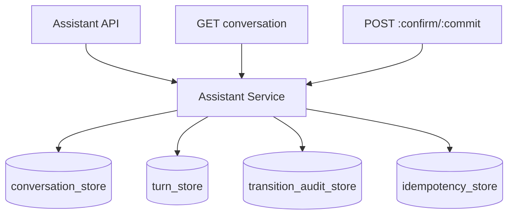

# DEV-PLAN-223：Assistant 会话持久化与审计闭环详细设计

**状态**: 规划中（2026-03-02 07:02 UTC）

## 1. 背景与上下文 (Context)
- **需求来源**:
  - `docs/dev-plans/220-chat-assistant-upgrade-implementation-plan.md`
  - `docs/dev-plans/220a-chat-assistant-gap-assessment-and-closure-plan.md`
  - `docs/dev-plans/221-assistant-p1-blocker-closure-plan.md`
- **当前痛点**:
  1. assistant 会话当前以内存 map 存储，重启后上下文丢失。
  2. `conversation + turn + request_id` 幂等语义缺少持久化约束，重放不可审计。
  3. 缺少稳定租户绑定审计证据，`tenant mismatch` 场景难以统一回放。
- **业务价值**:
  - 将 Assistant 从“运行态暂存”升级为“可恢复、可追踪、可审计”的事务能力，支撑 P1/P2 连续演进。

## 2. 目标与非目标 (Goals & Non-Goals)
### 2.1 核心目标
1. [ ] 落地会话/回合/状态转移/幂等最小持久化模型。
2. [ ] 支持 `tenant_id/actor_id/conversation_id/turn_id/request_id/trace_id` 全链路追踪。
3. [ ] 支持服务重启后的会话恢复、状态恢复与提交幂等验证。
4. [ ] 强化租户绑定防漂移（对齐 `TC-220-BE-011`）。
5. [ ] 形成 220 主计划要求的执行证据文档闭环。

### 2.2 非目标 (Out of Scope)
1. [ ] 不引入 Temporal 任务模型与 `/tasks` API（由 `DEV-PLAN-225` 承接）。
2. [ ] 不扩展 assistant 新业务动作面，仅做持久化与审计收口。
3. [ ] 不在本计划内实现跨租户分析报表。

## 2.1 工具链与门禁（SSOT 引用）
- **触发器清单（本计划命中）**：
  - [X] Go 代码
  - [ ] `.templ` / Tailwind
  - [ ] 多语言 JSON
  - [X] Authz
  - [X] 路由治理
  - [X] DB 迁移 / Schema
  - [X] sqlc（若新增查询契约）
  - [X] 文档门禁
- **SSOT 引用**：
  - `AGENTS.md`
  - `Makefile`
  - `.github/workflows/quality-gates.yml`
  - `docs/dev-plans/024-atlas-goose-closed-loop-guide.md`
  - `docs/dev-plans/025-sqlc-guidelines.md`

## 3. 架构与关键决策 (Architecture & Decisions)
### 3.1 架构图 (Mermaid)


### 3.2 关键设计决策 (ADR 摘要)
- **决策 1：最小四表模型（选定）**
  - 选项 A：单宽表 JSONB。缺点：约束弱、幂等与状态校验困难。
  - 选项 B（选定）：`conversation/turn/state_transition/idempotency` 分表。
- **决策 2：幂等键采用上下文组合（选定）**
  - 选项 A：全局 request_id。缺点：跨会话冲突。
  - 选项 B（选定）：`(tenant_id, conversation_id, turn_id, request_id)`。
- **决策 3：状态转移与审计同事务落盘（选定）**
  - 选项 A：异步审计。缺点：失败时出现证据缺口。
  - 选项 B（选定）：同事务落盘，保证可回放一致性。

## 4. 数据模型与约束 (Data Model & Constraints)
> 真正执行 `CREATE TABLE` 前，必须先获得用户确认。

### 4.1 Schema 定义（草案）
```sql
-- assistant_conversations
conversation_id uuid pk
tenant_id uuid not null
actor_id text not null
state text not null
created_at timestamptz not null
updated_at timestamptz not null

-- assistant_turns
turn_id uuid pk
conversation_id uuid not null
tenant_id uuid not null
request_id text not null
trace_id text
input_text text not null
resolved_candidate_id text
risk_tier text not null
created_at timestamptz not null

-- assistant_state_transitions
id bigserial pk
tenant_id uuid not null
conversation_id uuid not null
turn_id uuid
from_state text not null
to_state text not null
reason_code text
changed_at timestamptz not null
actor_id text not null

-- assistant_idempotency
tenant_id uuid not null
conversation_id uuid not null
turn_id uuid not null
request_id text not null
response_hash text not null
created_at timestamptz not null
primary key (tenant_id, conversation_id, turn_id, request_id)
```

### 4.2 约束与索引要求
1. [ ] `assistant_conversations(tenant_id, conversation_id)` 唯一。
2. [ ] `assistant_turns(tenant_id, conversation_id, created_at)` 索引。
3. [ ] `assistant_state_transitions(tenant_id, conversation_id, changed_at)` 索引。
4. [ ] `assistant_idempotency` 组合主键强制幂等。
5. [ ] 状态转移仅允许白名单路径。

### 4.3 迁移策略
1. [ ] 先完成契约评审与用户确认（涉及新表时强制）。
2. [ ] 执行模块级 `plan/lint/migrate up`，确保 Atlas+Goose 闭环。
3. [ ] 若命中 sqlc，执行 `make sqlc-generate` 并确保生成物无漂移。

## 5. 接口契约 (API Contracts)
> 不新增对外路由，仅增强既有 assistant API 的持久化与审计语义。

### 5.1 既有 API 语义增强
1. [ ] `POST /internal/assistant/conversations`：创建后可持久化查询。
2. [ ] `GET /internal/assistant/conversations/{conversation_id}`：返回持久化 turn + 状态历史。
3. [ ] `POST /internal/assistant/conversations/{conversation_id}/turns`：持久化 `request_id/trace_id`。
4. [ ] `POST .../turns/:confirm`、`POST .../turns/:commit`：状态转移与审计同事务落盘。

### 5.2 错误码与租户绑定契约
1. [ ] 同 `(tenant, conversation, turn, request_id)` 重试返回幂等一致结果。
2. [ ] 违反状态机约束返回 `conversation_state_invalid`。
3. [ ] 租户不匹配返回 `tenant_mismatch`/403（对齐 `TC-220-BE-011`）。
4. [ ] 保持候选固化冲突错误码与 221 一致。

## 6. 核心逻辑与算法 (Business Logic & Algorithms)
### 6.1 会话创建流程（伪代码）
```text
begin tx
insert assistant_conversations
insert assistant_state_transitions(init -> validated)
commit
```

### 6.2 turn 提交与幂等流程（伪代码）
```text
begin tx
if exists idempotency(tenant, conversation, turn, request_id):
  return recorded response
lock conversation row for update
validate tenant + state transition
insert/update turn
insert transition audit
insert idempotency record
commit
```

### 6.3 恢复流程（伪代码）
```text
on GET conversation:
  read conversation + turns + transitions by tenant_id
  rebuild DTO in deterministic order
  return
```

## 7. 安全与鉴权 (Security & Authz)
1. [ ] 所有持久化读写必须显式事务 + 租户注入，fail-closed。
2. [ ] RLS 做圈地、Casbin 做授权，职责不漂移。
3. [ ] 审计字段必须记录 actor_id/request_id/trace_id。
4. [ ] 禁止 legacy 回退（内存兜底/双链路并行写）。

## 8. 依赖与里程碑 (Dependencies & Milestones)
- **依赖**：
  - `DEV-PLAN-221` 状态机/错误码契约冻结。
  - 新增表前用户明确确认。
- **里程碑**：
  1. [ ] M1：数据契约冻结 + 用户确认。
  2. [ ] M2：迁移与 repository/store 实现。
  3. [ ] M3：service 幂等与恢复切换 + 租户绑定校验。
  4. [ ] M4：测试、门禁、证据收口。

## 9. 测试与验收标准 (Acceptance Criteria)
- **单元测试**：
  1. [ ] 状态转移合法/非法分支。
  2. [ ] 幂等命中与冲突场景。
  3. [ ] 候选固化与错误码映射回归。
- **集成测试**：
  1. [ ] 服务重启后会话与 turn 可恢复。
  2. [ ] 并发重试不产生重复提交。
  3. [ ] 租户切换访问同 conversation 被阻断（`TC-220-BE-011`）。
- **验收对齐**：
  1. [ ] 对齐 `TC-220-BE-009/011`。
  2. [ ] `make preflight` 全绿。

## 10. 运维与监控 (Ops & Monitoring)
- 不引入额外运维开关；遵循最小运维原则。
- 最小可观测要求：
  1. [ ] 日志包含 `tenant_id/conversation_id/turn_id/request_id/trace_id`。
  2. [ ] 记录状态拒绝与租户拒绝原因。
  3. [ ] 恢复路径：环境级保护 → 只读/停写 → 修复 → 重试/重放 → 恢复。

## 11. 交付物
1. [ ] assistant 持久化 schema（经确认后）与代码改造。
2. [ ] 持久化/幂等/租户绑定测试与门禁证据。
3. [ ] `DEV-PLAN-223` 执行记录文档。
4. [ ] 220 主计划证据补齐：
   - `docs/dev-records/dev-plan-220-execution-log.md`
   - `docs/dev-records/dev-plan-220-m0-chat-readonly-evidence.md`
   - `docs/dev-records/dev-plan-220-m1-conversation-commit-evidence.md`

## 12. 关联文档
- `docs/dev-plans/001-technical-design-template.md`
- `docs/dev-plans/003-simple-not-easy-review-guide.md`
- `docs/dev-plans/220-chat-assistant-upgrade-implementation-plan.md`
- `docs/dev-plans/220a-chat-assistant-gap-assessment-and-closure-plan.md`
- `docs/dev-plans/221-assistant-p1-blocker-closure-plan.md`
- `docs/dev-plans/222-assistant-frontend-e2e-evidence-closure-plan.md`
- `docs/dev-plans/225-assistant-tasks-temporal-p2-implementation-plan.md`
- `AGENTS.md`
