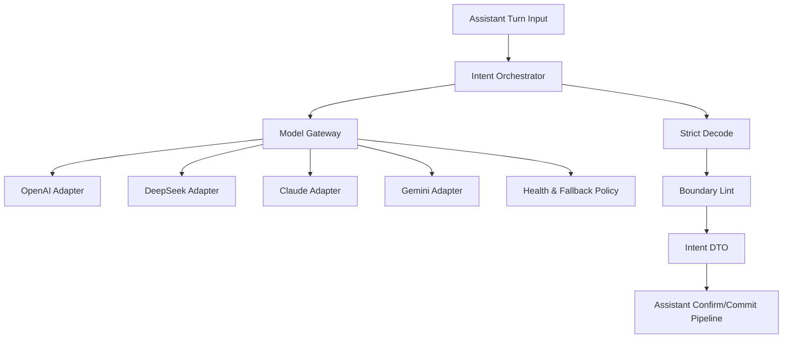

# DEV-PLAN-224：Assistant 多模型适配与 LLM 意图治理详细设计

**状态**: 规划中（2026-03-02 07:02 UTC）

## 1. 背景与上下文 (Context)
- **需求来源**:
  - `docs/dev-plans/220-chat-assistant-upgrade-implementation-plan.md`
  - `docs/dev-plans/220a-chat-assistant-gap-assessment-and-closure-plan.md`
  - `docs/dev-plans/221-assistant-p1-blocker-closure-plan.md`
- **当前痛点**:
  1. 仓库当前仅有 LibreChat 反向代理壳，平台侧尚无多模型治理能力。
  2. 意图识别仍以规则匹配为主，缺少 LLM + strict decode + boundary lint 的确定性链路。
  3. provider 不可用、超时、限流时缺少统一路由策略与错误归一化。
  4. 缺少“聊天壳凭据越权访问业务写路由”的专项验收证据。
- **业务价值**:
  - 建立可治理模型接入层，保证“多模型可插拔、输出可约束、边界可审计”。

## 2. 目标与非目标 (Goals & Non-Goals)
### 2.1 核心目标
1. [ ] 建立平台侧多模型配置治理能力（OpenAI / DeepSeek / Anthropic Claude / Google Gemini）。
2. [ ] 建立统一模型网关（超时、重试、健康检查、受控回退、错误归一化）。
3. [ ] 建立 LLM 意图识别主链路（Prompt -> strict decode -> boundary lint -> Intent DTO）。
4. [ ] 保持 `confirm/commit/re-auth/One Door` 边界不变（模型只负责解析与建议）。
5. [ ] 覆盖越权阻断安全用例（对齐 `TC-220-BE-010`）。

### 2.2 非目标 (Out of Scope)
1. [ ] 不把最终提交裁决权下放给模型。
2. [ ] 不在本计划实现 Temporal 异步编排（由 `DEV-PLAN-225` 承接）。
3. [ ] 不新增数据库表存储明文密钥。

## 2.1 工具链与门禁（SSOT 引用）
- **触发器清单（本计划命中）**：
  - [X] Go 代码
  - [ ] `.templ` / Tailwind
  - [ ] 多语言 JSON
  - [X] Authz
  - [X] 路由治理
  - [ ] DB 迁移 / Schema
  - [ ] sqlc
  - [X] 文档门禁
- **SSOT 引用**：
  - `AGENTS.md`
  - `Makefile`
  - `.github/workflows/quality-gates.yml`
  - `docs/dev-plans/009A-r200-tooling-playbook.md`

## 3. 架构与关键决策 (Architecture & Decisions)
### 3.1 架构图 (Mermaid)


### 3.2 关键设计决策 (ADR 摘要)
- **决策 1：多 provider 统一网关（选定）**
  - 选项 A：业务层直连 provider SDK。缺点：耦合高、错误语义分裂。
  - 选项 B（选定）：`ModelGateway + Adapter` 统一抽象。
- **决策 2：strict decode 必选（选定）**
  - 选项 A：自由文本抽取。缺点：漂移高。
  - 选项 B（选定）：结构化 schema 输出，失败直接返回标准错误码。
- **决策 3：受控回退，不做 silent fallback（选定）**
  - 选项 A：主模型失败静默降级规则解析。缺点：行为不可预测。
  - 选项 B（选定）：仅 provider 间受控 fallback；全部失败 fail-closed。

## 4. 数据模型与约束 (Data Model & Constraints)
> 本计划不新增数据库表；使用配置模型 + 运行时对象。

### 4.1 Provider 配置模型（配置契约）
```yaml
assistant:
  providers:
    - name: openai
      enabled: true
      model: gpt-4o-mini
      endpoint: https://api.openai.com/v1
      timeout_ms: 8000
      retries: 1
      priority: 10
    - name: deepseek
      enabled: true
      model: deepseek-chat
      endpoint: https://api.deepseek.com
      timeout_ms: 8000
      retries: 1
      priority: 20
```

### 4.2 配置约束
1. [ ] `name` 必须在 `{openai, deepseek, claude, gemini}` 白名单内。
2. [ ] `enabled=true` 的 provider 必须提供 `model/endpoint/timeout_ms`。
3. [ ] `priority` 必须唯一。
4. [ ] 密钥仅环境变量注入，配置文件不存密钥。
5. [ ] 配置校验失败时服务启动 fail-closed。

### 4.3 迁移策略
- 无 DB 迁移。
- 新增配置字段允许向后兼容读取，但不引入 legacy 双链路执行。

## 5. 接口契约 (API Contracts)
### 5.1 内部接口（Go）
- `ModelGateway.ResolveIntent(ctx, request) (IntentResult, error)`
- `ProviderAdapter.Invoke(ctx, prompt, schema) (StructuredOutput, error)`
- `IntentBoundaryLint.Validate(intent) error`

### 5.2 错误码契约
1. [ ] `ai_plan_schema_constrained_decode_failed`
2. [ ] `ai_plan_boundary_violation`
3. [ ] `ai_model_provider_unavailable`
4. [ ] `ai_model_timeout`
5. [ ] `ai_model_rate_limited`

### 5.3 与既有 assistant API 关系
- 不新增对外 assistant 业务路由。
- 仅替换意图解析内部实现，不改变 confirm/commit 契约。

## 6. 核心逻辑与算法 (Business Logic & Algorithms)
### 6.1 provider 路由算法（伪代码）
```text
providers = enabled providers ordered by priority
for p in providers:
  result, err = invoke(p)
  if success: return result
  if err is timeout/rate_limit/transient: continue
  if err is permanent_config_error: break
return ai_model_provider_unavailable
```

### 6.2 意图解析主链路（伪代码）
```text
raw = gateway.resolve(prompt, schema)
intent = strictDecode(raw)
if decodeFail: return ai_plan_schema_constrained_decode_failed
if boundaryLintFail(intent): return ai_plan_boundary_violation
return intentDTO
```

### 6.3 诊断降级策略
- 仅允许“诊断日志级”规则解析用于排障，不得成为静默提交路径。

## 7. 安全与鉴权 (Security & Authz)
1. [ ] 密钥仅环境注入，日志掩码处理，禁止明文输出。
2. [ ] provider endpoint 白名单校验，禁止任意 URL 注入。
3. [ ] assistant capability 与路由映射不漂移。
4. [ ] 模型输出必须经 boundary lint，禁止越界能力进入提交链路。
5. [ ] 验证 LibreChat 服务凭据越权阻断（`TC-220-BE-010`）。

## 8. 依赖与里程碑 (Dependencies & Milestones)
- **依赖**：
  - `DEV-PLAN-221` 错误码与状态机契约冻结。
  - `DEV-PLAN-222` 已冻结 LibreChat 版本窗口与升级回归清单。
  - `DEV-PLAN-223` 持久化审计字段可记录 provider 元数据（如已落地）。
- **里程碑**：
  1. [ ] M1：provider 配置契约 + 网关接口冻结。
  2. [ ] M2：四类 provider adapter 接入 + 健康检查。
  3. [ ] M3：LLM 主链路切换（strict decode + boundary lint）。
  4. [ ] M4：安全验证（含 BE-010）+ 门禁证据收口。

## 9. 测试与验收标准 (Acceptance Criteria)
- **单元测试**：
  1. [ ] 配置加载校验（缺字段/非法 provider/priority 冲突）。
  2. [ ] adapter 错误归一化（timeout/rate_limit/unavailable）。
  3. [ ] strict decode 与 boundary lint 分支覆盖。
- **集成测试**：
  1. [ ] 多 provider 路由与受控回退一致性。
  2. [ ] 同输入同配置下输出 Intent DTO 结构稳定。
- **验收对齐**：
  1. [ ] 对齐 `TC-220-BE-003/004/010`。
  2. [ ] 新增“多模型切换一致性”“provider 故障回退”证据。
  3. [ ] `make preflight` 全绿。

## 10. 运维与监控 (Ops & Monitoring)
- 不引入复杂运维开关；遵循早期最小运维原则。
- 最小可观测要求：
  1. [ ] 记录 `provider/model/latency_ms/error_code/request_id/trace_id`。
  2. [ ] 统计 provider 成功率/超时率用于路由调优。
  3. [ ] 故障处置遵循 No-Legacy 恢复路径。

## 11. 交付物
1. [ ] 多模型治理配置与 `ModelGateway` 代码。
2. [ ] LLM 意图识别主链路（strict decode + boundary lint）。
3. [ ] 安全用例（含 BE-010）与门禁证据。
4. [ ] `DEV-PLAN-224` 执行记录文档（新增到 `docs/dev-records/`）。

## 12. 关联文档
- `docs/dev-plans/001-technical-design-template.md`
- `docs/dev-plans/003-simple-not-easy-review-guide.md`
- `docs/dev-plans/220-chat-assistant-upgrade-implementation-plan.md`
- `docs/dev-plans/220a-chat-assistant-gap-assessment-and-closure-plan.md`
- `docs/dev-plans/221-assistant-p1-blocker-closure-plan.md`
- `docs/dev-plans/222-assistant-frontend-e2e-evidence-closure-plan.md`
- `docs/dev-plans/223-assistant-conversation-persistence-and-audit-closure-plan.md`
- `docs/dev-plans/225-assistant-tasks-temporal-p2-implementation-plan.md`
- `AGENTS.md`
