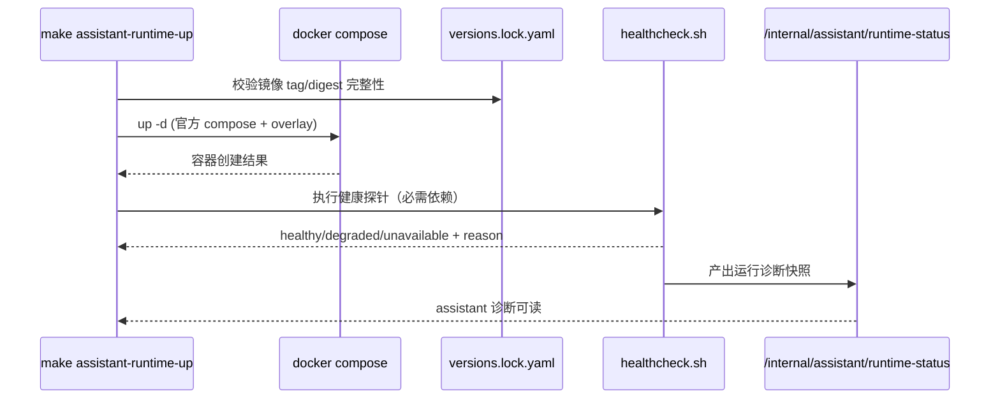

# DEV-PLAN-232：LibreChat 官方运行基线落地详细设计

**状态**: 已实施（2026-03-03，详见 `docs/archive/dev-records/dev-plan-232-execution-log.md`）

## 1. 背景与上下文 (Context)
- **需求来源**:
  - `docs/dev-plans/230-librechat-project-level-integration-plan.md`（PR-230-01）
  - `docs/dev-plans/231-librechat-prerequisites-contract-and-gates-plan.md`
- **当前痛点**:
  1. LibreChat 运行依赖（`api/mongodb/meilisearch/rag_api/vectordb`）虽已确定范围，但仓库内没有“可复现、可追溯”的固定编排基线。
  2. 上游 `docker-compose.yml` 与本地/CI 参数可能漂移，导致“同一提交在不同环境表现不一致”。
  3. `/app/assistant` 目前仅能暴露通用错误，缺少“上游版本 + 依赖健康 + 错误码”的可诊断信息。
  4. 版本固定策略（tag + digest + 引入时间 + 回滚点）未文档化，升级/回滚难以审计。
- **业务价值**:
  - 建立“仓库内即可冷启动”的官方运行基线，确保后续 233~237 子计划在同一运行事实上推进。

## 2. 目标与非目标 (Goals & Non-Goals)
### 2.1 核心目标
1. [ ] 基于 LibreChat 官方 Compose 建立仓库内运行基线（官方优先 + 最小 overlay）。
2. [ ] 固化五类依赖生命周期（是否必需、数据目录、升级责任人、清理边界）。
3. [ ] 固化版本元数据（镜像 tag/digest、引入时间、回滚版本、上游来源）。
4. [ ] 建立健康检查与诊断输出，`/app/assistant` 可展示不可用原因与版本标识。
5. [ ] 本地与 CI 均可完成“冷启动 -> 健康探测 -> assistant 壳层可访问”的最小闭环。

### 2.2 非目标 (Out of Scope)
1. [ ] 不执行模型配置单主源切换（由 `DEV-PLAN-233` 承接）。
2. [ ] 不执行身份/会话边界改造（由 `DEV-PLAN-235` 承接）。
3. [ ] 不执行旧入口 `model-providers:apply` 的退役动作（由 `DEV-PLAN-236` 承接）。
4. [ ] 不在本计划引入 Agents 自动执行业务写动作。

## 2.3 工具链与门禁（SSOT 引用）
- **触发器清单（本计划命中）**：
  - [X] Go 代码（诊断接口、错误码映射、测试）
  - [ ] `.templ` / Tailwind
  - [ ] 多语言 JSON
  - [ ] Authz
  - [X] 路由治理（新增/调整 internal diagnostics 路由时）
  - [ ] DB 迁移 / Schema
  - [ ] sqlc
  - [X] E2E
  - [X] 文档门禁
- **本地必跑（命中项）**：
  1. [ ] `go fmt ./... && go vet ./... && make check lint && make test`
  2. [ ] `make check routing`
  3. [ ] `make check assistant-config-single-source`
  4. [ ] `make e2e`
  5. [ ] `make check doc`
- **SSOT 链接**：
  - `AGENTS.md`
  - `Makefile`
  - `.github/workflows/quality-gates.yml`
  - `docs/dev-plans/012-ci-quality-gates.md`

## 3. 架构与关键决策 (Architecture & Decisions)
### 3.1 运行拓扑（官方基线 + 本仓边界）
```mermaid
graph TD
    A[/app/assistant/] --> B[/assistant-ui/* proxy]
    B --> C[LibreChat API container]

    C --> D[(MongoDB)]
    C --> E[(Meilisearch)]
    C --> F[RAG API]
    C --> G[(VectorDB)]

    H[deploy/librechat/versions.lock.yaml] --> I[healthcheck]
    I --> J[/internal/assistant/runtime-status]
    J --> A
```

### 3.2 冷启动时序（本地/CI一致）


### 3.3 ADR 摘要
- **ADR-232-01：官方 compose 作为唯一基线**（选定）
  - 选项 A：仓库完全自建 compose；缺点：偏离上游、升级成本高。
  - 选项 B（选定）：官方 compose + 最小 overlay，仅处理边界适配。
- **ADR-232-02：镜像必须 tag + digest 双固定**（选定）
  - 选项 A：仅 tag；缺点：上游重打 tag 时不可复现。
  - 选项 B（选定）：`tag + digest` 固定，禁止 `latest`。
- **ADR-232-03：缺关键配置 fail-fast**（选定）
  - 选项 A：缺配置自动降级；缺点：故障被掩盖、行为不可预测。
  - 选项 B（选定）：启动前校验，缺失即阻断并给出明确错误码。

## 4. 运行资产模型与约束 (Runtime Artifacts & Constraints)
### 4.1 目录与文件契约（目标态）
`deploy/librechat/` 至少包含：
1. [ ] `docker-compose.upstream.yaml`（官方基线快照，保持最小改动）
2. [ ] `docker-compose.overlay.yaml`（本仓边界适配）
3. [ ] `.env.example`（运行变量模板）
4. [ ] `versions.lock.yaml`（版本与生命周期元数据）
5. [ ] `healthcheck.sh`（健康探针脚本，支持机器可读输出）
6. [ ] `README.md`（启动/停止/清理/故障排查说明）

### 4.2 `versions.lock.yaml` 契约（冻结）
```yaml
upstream:
  repo: "danny-avila/LibreChat"
  ref: "main"
  source_compose_url: "https://raw.githubusercontent.com/danny-avila/LibreChat/main/docker-compose.yml"
  source_yaml_url: "https://raw.githubusercontent.com/danny-avila/LibreChat/main/librechat.example.yaml"
  imported_at: "2026-03-03T16:55:00Z"
  rollback_ref: "<last-known-good-ref>"

services:
  - name: api
    required: true
    image: "ghcr.io/danny-avila/librechat"
    tag: "<tag>"
    digest: "sha256:<64hex>"
    data_dir: ".local/librechat/api"
    owner: "assistant-platform"
  - name: mongodb
    required: true
    image: "mongo"
    tag: "<tag>"
    digest: "sha256:<64hex>"
    data_dir: ".local/librechat/mongodb"
    owner: "assistant-platform"
```
约束：
1. [ ] 所有运行服务必须声明 `required/tag/digest/data_dir/owner`。
2. [ ] `required: true` 服务未就绪时，基线状态必须为 `unavailable`（不得默默降级）。
3. [ ] `data_dir` 必须位于仓库本地目录（禁止写入系统级不受控路径）。

### 4.3 `.env.example` 契约（最小必填）
必须显式标注必填变量（示例）：
- `LIBRECHAT_UPSTREAM`（默认仓库内服务地址）
- `LIBRECHAT_PORT`
- `MONGO_URI`
- `MEILI_HOST` / `MEILI_MASTER_KEY`
- `RAG_API_URL`（若启用）
- `VECTOR_DB_PROVIDER`（若启用）
约束：
1. [ ] 缺必填变量时启动脚本直接失败并输出 `assistant_runtime_config_missing`。
2. [ ] 变量格式非法时输出 `assistant_runtime_config_invalid`。
3. [ ] 模板仅示例 key，不得包含真实密钥。

### 4.4 健康检查输出契约（JSON）
```json
{
  "status": "healthy",
  "checked_at": "2026-03-03T16:55:00Z",
  "upstream": {
    "repo": "danny-avila/LibreChat",
    "ref": "main"
  },
  "services": [
    {
      "name": "api",
      "required": true,
      "healthy": "healthy",
      "reason": "",
      "image": "ghcr.io/danny-avila/librechat",
      "tag": "vX.Y.Z",
      "digest": "sha256:..."
    }
  ]
}
```
约束：
1. [ ] `status` 仅允许 `healthy|degraded|unavailable`。
2. [ ] `services[].healthy` 与后端 `healthy/health_reason` 口径保持一致。
3. [ ] 失败输出必须带稳定错误码，禁止模糊文案直出。

## 5. 接口契约 (API / CLI Contracts)
### 5.1 本地编排命令契约（Make 入口）
建议新增或收敛统一入口：
1. [ ] `make assistant-runtime-up`：校验 lock/env -> compose up -> 健康检查。
2. [ ] `make assistant-runtime-down`：停止并移除本计划容器。
3. [ ] `make assistant-runtime-status`：输出健康 JSON 与版本信息。
4. [ ] `make assistant-runtime-clean`：仅清理 `deploy/librechat/` 约定数据目录。

退出码约束：
- `0`：成功
- `1`：业务失败（配置缺失、健康探针失败）
- `2`：执行失败（命令/依赖异常）

### 5.2 诊断 API 契约（供 `/app/assistant` 展示）
`GET /internal/assistant/runtime-status`
- **200 OK**：返回 4.4 的健康 JSON。
- **503 Service Unavailable**：
  - `assistant_runtime_config_missing`
  - `assistant_runtime_config_invalid`
  - `assistant_runtime_dependency_unavailable`
- **响应约束**：
  - 必须包含 `status + services + upstream`。
  - 不返回真实 secret 值，仅返回变量名或缺失项名称。

### 5.3 `/app/assistant` 诊断展示契约
1. [ ] 当 runtime `status != healthy` 时，页面展示：错误码、影响服务、上游 ref/tag/digest。
2. [ ] 诊断信息仅读展示，不提供“绕过边界继续写入”按钮。
3. [ ] 错误提示走既有错误码映射机制，不新增自由文本分支。

## 6. 核心逻辑与算法 (Business Logic & Algorithms)
### 6.1 启动前校验算法
```text
read versions.lock.yaml
assert all required services have tag+digest
read .env
assert required keys present and valid
if any check fails -> fail-closed with stable error code
```

### 6.2 冷启动与健康判定算法
```text
compose_up()
for service in required_services:
  probe service with timeout/retry policy
  collect healthy + reason + image meta
if any required unhealthy:
  status = unavailable
else if any optional unhealthy:
  status = degraded
else:
  status = healthy
persist runtime snapshot for diagnostics
```

### 6.3 版本漂移校验算法
```text
actual_images = docker inspect digests
locked_images = versions.lock.yaml digests
if actual != locked:
  emit assistant_runtime_version_drift_detected
  exit 1
```

### 6.4 清理边界算法
```text
allowed_dirs = [".local/librechat/api", ".local/librechat/mongodb", ".local/librechat/meili", ".local/librechat/rag", ".local/librechat/vectordb"]
for dir in requested_cleanup:
  if dir not in allowed_dirs:
    reject
perform cleanup only inside allowed_dirs
```

## 7. 安全与鉴权 (Security & Authz)
1. [ ] `/assistant-ui/*` 与 `/app/assistant` 继续遵循本仓会话与租户边界（本计划不放宽认证）。
2. [ ] 健康诊断接口归类为 internal API，保持现有认证/授权链路。
3. [ ] 运行日志中禁止打印密钥值；仅允许 `key_ref` 与变量名。
4. [ ] 不引入 feature flag、legacy 双链路或外部兜底 URL。

## 8. 依赖与里程碑 (Dependencies & Milestones)
- **依赖**:
  - `DEV-PLAN-230`（总体边界与 PR 切片）
  - `DEV-PLAN-231`（单主源门禁前置）
- **里程碑**:
  1. [ ] M1：`deploy/librechat/` 运行资产落地（compose/env/lock/healthcheck）。
  2. [ ] M2：诊断 API + `/app/assistant` 不可用展示接线完成。
  3. [ ] M3：本地与 CI 冷启动闭环（含失败样例）证据固化。
  4. [ ] M4：首个可回滚版本元数据留档到 `docs/dev-records/`。

## 9. 测试与验收标准 (Acceptance Criteria)
### 9.1 必测场景
1. [ ] **冷启动正向**：空环境下按文档可拉起所有 required 服务并通过健康检查。
2. [ ] **配置缺失负测**：删除必填 env，返回 `assistant_runtime_config_missing`。
3. [ ] **配置非法负测**：注入非法 endpoint/uri，返回 `assistant_runtime_config_invalid`。
4. [ ] **依赖故障负测**：停掉 mongodb 或 api，诊断状态变为 `unavailable`。
5. [ ] **版本漂移负测**：手工改 digest，漂移校验阻断。
6. [ ] **UI 可见性**：`/app/assistant` 可展示错误码+版本信息，而非空白/通用报错。

### 9.2 验收命令
1. [ ] `go fmt ./... && go vet ./... && make check lint && make test`
2. [ ] `make check routing`
3. [ ] `make check assistant-config-single-source`
4. [ ] `make e2e`
5. [ ] `make check doc`

### 9.3 完成定义（DoD）
1. [ ] 仓库内运行基线可独立启动，不依赖临时外部编排文件。
2. [ ] `api/mongodb/meilisearch/rag_api/vectordb` 生命周期信息可审计、可追溯。
3. [ ] 诊断链路可稳定返回错误码与版本标识，且与页面展示一致。
4. [ ] 本地与 CI 产出一致的启动与健康结论。

## 10. 运维与监控 (Ops & Monitoring)
1. [ ] 故障处置顺序固定：停写/保护 -> 修复配置或依赖 -> 重启探针 -> 恢复。
2. [ ] 回滚策略固定：仅允许回滚 `versions.lock.yaml` 标注的上一稳定版本，不恢复 legacy 链路。
3. [ ] 运行日志最少包含：`service`、`status`、`reason`、`tag`、`digest`、`checked_at`。
4. [ ] 不引入额外复杂监控栈，维持早期阶段“最小可观测”原则。

## 11. Readiness 记录要求
1. [ ] 在 `docs/dev-records/` 新建 `dev-plan-232-execution-log.md`。
2. [ ] 记录至少包含：环境信息、执行命令、健康 JSON、失败样例、回滚演练结论。
3. [ ] 至少提供一次本地与一次 CI 的冷启动证据（日志或截图）。

## 12. SSOT 引用
- `AGENTS.md`
- `Makefile`
- `.github/workflows/quality-gates.yml`
- `docs/dev-plans/012-ci-quality-gates.md`
- `docs/dev-plans/230-librechat-project-level-integration-plan.md`
- `docs/dev-plans/231-librechat-prerequisites-contract-and-gates-plan.md`
- `docs/dev-plans/233-librechat-single-source-config-convergence-plan.md`
- `https://raw.githubusercontent.com/danny-avila/LibreChat/main/docker-compose.yml`
- `https://raw.githubusercontent.com/danny-avila/LibreChat/main/librechat.example.yaml`
