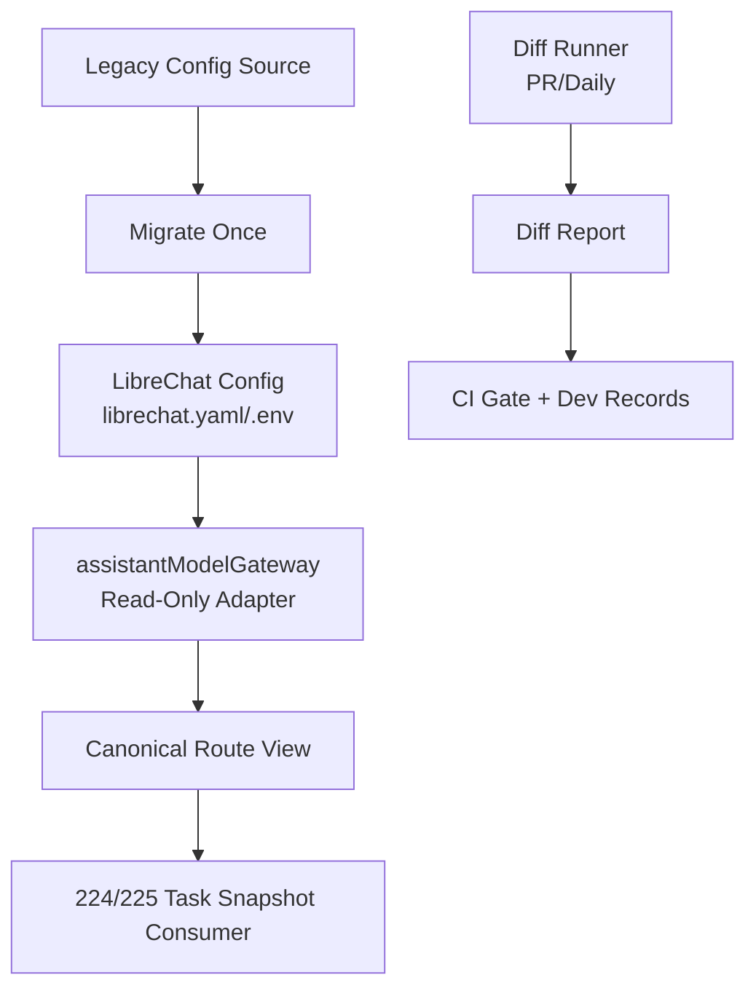
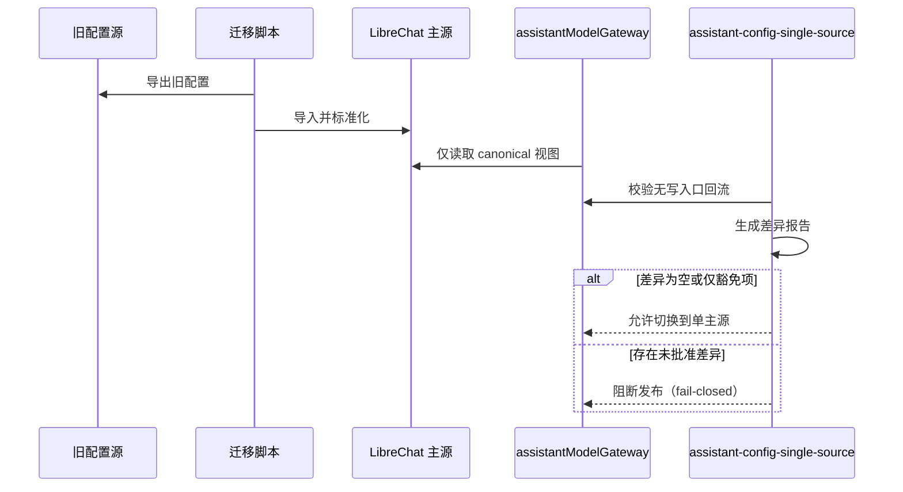

# DEV-PLAN-233：LibreChat 模型配置单主源收口详细设计

**状态**: 草拟中（2026-03-03 12:10 UTC）

## 1. 背景与上下文 (Context)
- **需求来源**:
  - `docs/dev-plans/230-librechat-project-level-integration-plan.md`（PR-230-02）
  - `docs/dev-plans/224-assistant-multi-model-and-llm-intent-governance-plan.md`
  - `docs/dev-plans/225-assistant-tasks-temporal-p2-implementation-plan.md`
  - `docs/dev-plans/231-librechat-prerequisites-contract-and-gates-plan.md`
- **当前痛点**:
  1. 模型/Provider 配置仍存在“LibreChat 主源 + 本仓历史写入口”双主源并存风险。
  2. `assistantModelGateway` 同时承担读适配与历史写路径，职责混杂，容易引入契约漂移。
  3. 缺少“旧源 -> LibreChat”可审计迁移闭环（导入、比对、切换、残留清理）。
  4. 224/225 的确定性产物（`intent_hash/plan_hash/contract_snapshot`）仍需防止被配置层回写污染。
- **业务价值**:
  - 将模型配置收敛为单主源后，可确保任务重放确定性、路由决策可审计，并为 `DEV-PLAN-236` 退役旧入口提供无歧义前置条件。

## 2. 目标与非目标 (Goals & Non-Goals)
### 2.1 核心目标
1. [ ] 模型/Provider 配置主写源收敛为 LibreChat（本仓不再保留第二写入口）。
2. [ ] `assistantModelGateway` 收口为只读适配、规范化与边界校验层。
3. [ ] 建立一次性迁移 + 持续比对机制，支持“观察期 -> 切换 -> 封板”平滑推进。
4. [ ] 确保配置变化不会直接改写 224/225 的确定性快照产物。
5. [ ] 形成可执行验收：差异报告可追溯、门禁可阻断、E2E 可回归。

### 2.2 非目标 (Out of Scope)
1. [ ] 不执行 `model-providers:apply` 最终下线（由 `DEV-PLAN-236` 承接）。
2. [ ] 不处理 MCP/Actions/Allowlist 复用落地（由 `DEV-PLAN-234` 承接）。
3. [ ] 不改造 `/assistant-ui/*` 身份与会话边界（由 `DEV-PLAN-235` 承接）。
4. [ ] 不替换 224/225 既有业务契约版本语义。

## 2.3 工具链与门禁（SSOT 引用）
- **触发器清单（本计划命中）**：
  - [X] Go 代码（gateway/迁移/比对逻辑）
  - [ ] `.templ` / Tailwind
  - [ ] 多语言 JSON
  - [ ] Authz
  - [X] 路由治理（若调整模型配置相关 internal 路由）
  - [ ] DB 迁移 / Schema（233 不新增表）
  - [ ] sqlc
  - [X] E2E
  - [X] 文档门禁
- **本地必跑（命中项）**：
  1. [ ] `go fmt ./... && go vet ./... && make check lint && make test`
  2. [ ] `make check assistant-config-single-source`
  3. [ ] `make check routing`（命中路由变更时）
  4. [ ] `make e2e`
  5. [ ] `make check doc`
- **SSOT 链接**：
  - `AGENTS.md`
  - `Makefile`
  - `.github/workflows/quality-gates.yml`
  - `docs/dev-plans/012-ci-quality-gates.md`

## 3. 架构与关键决策 (Architecture & Decisions)
### 3.1 目标架构（单主源）


### 3.2 切换时序（观察期到收口）


### 3.3 ADR 摘要
- **ADR-233-01：主写源唯一化**（选定）
  - 选项 A：长期双写；缺点：一致性与审计复杂度高。
  - 选项 B（选定）：LibreChat 唯一写源，本仓只读适配。
- **ADR-233-02：迁移按“先影子比对后切换”执行**（选定）
  - 选项 A：直接切换；缺点：回归风险不可见。
  - 选项 B（选定）：观察期输出差异报告，达标后切换。
- **ADR-233-03：确定性产物只在任务快照层生成**（选定）
  - 选项 A：配置层直接改写 hash；缺点：破坏重放确定性。
  - 选项 B（选定）：配置层只提供路由输入，hash 在任务链路固化并校验。

## 4. 数据模型与约束 (Data Model & Constraints)
### 4.1 Canonical Route View（只读）
`assistantModelGateway` 输出的标准视图（示意）：
```json
{
  "schema_version": "v1",
  "routing": {
    "strategy": "priority_failover",
    "fallback_enabled": false
  },
  "providers": [
    {
      "provider": "openai",
      "model": "gpt-5-codex",
      "enabled": true,
      "endpoint": "https://api.openai.com/v1",
      "timeout_ms": 8000,
      "retries": 1,
      "priority": 10,
      "key_ref": "OPENAI_API_KEY"
    }
  ]
}
```
约束：
1. [ ] 仅保留路由决策必需字段，禁止输出密钥明文。
2. [ ] `schema_version` 必填，升级需向后兼容或显式迁移。
3. [ ] 对象键 canonical 排序，数组顺序按优先级稳定。

### 4.2 比对报告契约（旧源 vs 新源）
输出文件建议：`docs/dev-records/dev-plan-233-config-diff-<date>.json`
```json
{
  "generated_at": "2026-03-03T12:10:00Z",
  "scope": "tenant:<id>|global",
  "old_hash": "sha256:...",
  "new_hash": "sha256:...",
  "status": "match|mismatch|waived",
  "diff_items": []
}
```
约束：
1. [ ] `status=mismatch` 且非豁免时，门禁必须失败。
2. [ ] 豁免项必须有 `reason/owner/expires_at`。
3. [ ] 报告只记录配置引用与字段差异，不记录 secret 值。

### 4.3 迁移清单约束（一次性导入）
1. [ ] 每条记录必须具备稳定业务键（provider + model + tenant_scope）。
2. [ ] 迁移应幂等：重复执行不会产生重复条目或语义漂移。
3. [ ] 迁移脚本只允许“旧源 -> LibreChat”单向写入，不支持反向同步。
4. [ ] 导入后立即生成 canonical hash，作为切换前基线证据。

### 4.4 与 224/225 的确定性边界
1. [ ] 禁止在配置层写入 `intent_hash/plan_hash/context_hash/contract_snapshot`。
2. [ ] 任务执行仅消费创建时固化的 snapshot/hash，不消费运行时可变配置。
3. [ ] 若执行前 snapshot/hash 校验失败，必须 fail-closed 并返回稳定错误码。

## 5. 接口契约 (API / CLI Contracts)
### 5.1 Gateway 内部接口（目标态）
- `LoadCanonicalRoute(ctx, tenantID) (CanonicalRouteView, error)`
- `ValidateCanonicalRoute(view) error`
- `CompareRoute(oldView, newView) (DiffReport, error)`

约束：
1. [ ] 不提供任何“写配置”方法。
2. [ ] `Validate` 仅做结构与边界校验，不生成业务 hash。
3. [ ] 错误码使用稳定机器码，禁止泛化失败文案。

### 5.2 迁移与比对命令契约（建议 Make 入口）
1. [ ] `make assistant-config-migrate`：一次性导入旧配置到 LibreChat。
2. [ ] `make assistant-config-diff`：输出 canonical 差异报告。
3. [ ] `make check assistant-config-single-source`：阻断第二写入口与契约回写。

退出码约束：
- `0`：成功
- `1`：业务失败（差异未清零/违反规则）
- `2`：执行失败（依赖/参数异常）

### 5.3 旧接口过渡语义（233 阶段）
1. [ ] 仅允许作为迁移兼容入口（若仍存在）。
2. [ ] 必须返回 `Deprecation` 相关头/日志并写入执行记录。
3. [ ] 不得成为长期可写路径；最终下线由 236 执行。

## 6. 核心逻辑与算法 (Business Logic & Algorithms)
### 6.1 Canonical 化算法
```text
source = read_librechat_config()
projected = keep_route_fields_only(source)
normalized = normalize_types_and_defaults(projected)
canonical = canonical_json(normalized)
hash = sha256(canonical)
return canonical, "sha256:" + hash
```

### 6.2 一次性迁移算法
```text
old_items = export_from_legacy_source()
for item in old_items:
  k = stable_business_key(item)
  transformed = map_to_librechat_schema(item)
  upsert_to_librechat(k, transformed)
run assistant-config-diff
if mismatch_exists_without_waiver:
  fail-closed
```

### 6.3 持续比对算法（PR / Daily）
```text
old_view = load_old_canonical_view()
new_view = load_librechat_canonical_view()
report = compare(old_view, new_view)
write report to dev-records
if report.status == mismatch and not waived:
  exit 1
exit 0
```

### 6.4 任务确定性守护
```text
on task create:
  route_snapshot, route_hash = LoadCanonicalRoute()
  persist route_snapshot + route_hash with contract_snapshot
on workflow execute:
  verify persisted route_hash and contract_snapshot
  if mismatch -> fail-closed
```

## 7. 安全与鉴权 (Security & Authz)
1. [ ] 配置处理链路只记录 `key_ref`，不回显密钥值。
2. [ ] 迁移脚本执行账户遵循最小权限原则，仅限目标配置域。
3. [ ] 差异报告默认走内部记录路径，不暴露给匿名访问。
4. [ ] 不新增 legacy 双链路、功能开关绕过或“临时兜底写入口”。

## 8. 依赖与里程碑 (Dependencies & Milestones)
- **依赖**:
  - `DEV-PLAN-230`（整体切片与 stopline）
  - `DEV-PLAN-231`（single-source gate 前置）
  - `DEV-PLAN-224/225`（确定性契约）
- **里程碑**:
  1. [ ] M1：Gateway 去写化（只读适配 + 校验）。
  2. [ ] M2：迁移脚本落地并完成一次全量导入演练。
  3. [ ] M3：PR/Daily 差异报告上线，达到“空差异或批准豁免”。
  4. [ ] M4：主写源切换完成并提交 readiness 证据。
  5. [ ] M5：向 `DEV-PLAN-236` 交接旧入口退役清单。

## 9. 测试与验收标准 (Acceptance Criteria)
### 9.1 必测场景
1. [ ] **正向**：仅通过 LibreChat 配置变更即可驱动路由决策更新。
2. [ ] **反向-第二写入口**：新增/恢复本仓写入口时被 gate 阻断。
3. [ ] **反向-契约回写**：配置层试图改写 `intent_hash/plan_hash` 时阻断。
4. [ ] **迁移幂等**：重复执行迁移脚本结果不变。
5. [ ] **差异阻断**：未批准 mismatch 导致 CI 失败。
6. [ ] **任务确定性**：同一任务在重试/重放时使用固定 snapshot。

### 9.2 验收命令
1. [ ] `go fmt ./... && go vet ./... && make check lint && make test`
2. [ ] `make check assistant-config-single-source`
3. [ ] `make check routing`（命中路由变更时）
4. [ ] `make e2e`
5. [ ] `make check doc`

### 9.3 完成定义（DoD）
1. [ ] 本仓不存在可写模型配置入口（除 LibreChat 主源外）。
2. [ ] 迁移前后 canonical 差异报告为空或仅剩有效豁免项。
3. [ ] 224/225 任务链路确定性校验在回归中稳定通过。
4. [ ] 交付记录可支持 236 直接执行退役动作。

## 10. 运维与监控 (Ops & Monitoring)
1. [ ] 迁移窗口采用三阶段：
   - [ ] 阶段 A（观察期，截止 2026-03-20）：双读比对，不做最终删口。
   - [ ] 阶段 B（切换期，截止 2026-04-10）：主写源固定为 LibreChat，旧口仅保留受控迁移语义。
   - [ ] 阶段 C（封板前，截止 2026-04-24）：输出零差异证明并交接 236 做物理下线。
2. [ ] 关键日志字段至少包含：`tenant_id`、`provider`、`model`、`route_hash`、`diff_status`、`request_id`。
3. [ ] 故障处置顺序固定：阻断发布 -> 修复配置/映射 -> 重跑比对 -> 恢复。
4. [ ] 回滚策略仅允许“配置版本回滚”，禁止恢复双主源架构。

## 11. Readiness 记录要求
1. [ ] 在 `docs/dev-records/` 新建 `dev-plan-233-execution-log.md`。
2. [ ] 至少记录一次全量迁移演练（命令、结果、差异报告 hash）。
3. [ ] 至少记录一次反向阻断样例（第二写入口或契约回写）。
4. [ ] 记录中需包含阶段 A/B/C 的实际完成时间与责任人。

## 12. SSOT 引用
- `AGENTS.md`
- `Makefile`
- `.github/workflows/quality-gates.yml`
- `docs/dev-plans/012-ci-quality-gates.md`
- `docs/dev-plans/224-assistant-multi-model-and-llm-intent-governance-plan.md`
- `docs/dev-plans/225-assistant-tasks-temporal-p2-implementation-plan.md`
- `docs/dev-plans/230-librechat-project-level-integration-plan.md`
- `docs/dev-plans/231-librechat-prerequisites-contract-and-gates-plan.md`
- `docs/dev-plans/236-librechat-legacy-endpoint-retirement-and-single-source-closure-plan.md`
