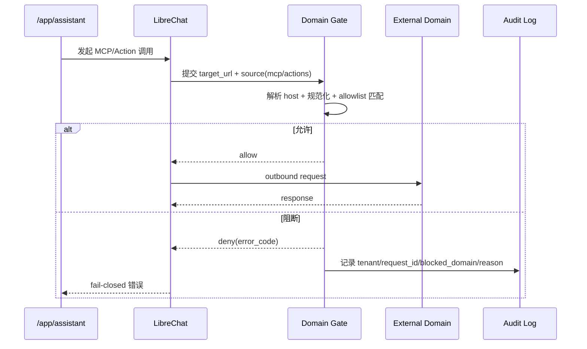

# DEV-PLAN-234：LibreChat 开源能力复用（MCP/Actions/Domain Allowlist）详细设计

**状态**: 已完成（2026-03-03 16:10 UTC，实施与验证见 `docs/archive/dev-records/dev-plan-234-execution-log.md`）

## 1. 背景与上下文 (Context)
- **需求来源**:
  - `docs/dev-plans/230-librechat-project-level-integration-plan.md`（PR-230-03）
  - `docs/dev-plans/232-librechat-official-runtime-baseline-plan.md`
  - `docs/dev-plans/233-librechat-single-source-config-convergence-plan.md`
- **当前痛点**:
  1. 当前仓库对 LibreChat 的复用主要停留在 `/assistant-ui/*` 反向代理，尚未把 MCP/Actions/Domain Allowlist 落成可执行切片与门禁。
  2. `mcpSettings.allowedDomains` 与 `actions.allowedDomains` 缺少本仓侧一致性校验，存在“上游放宽、本仓未感知”的漂移风险。
  3. 对外域名访问缺少统一 fail-closed 判定与审计字段标准（tenant/request_id/blocked_domain/reason），SSRF 与越权回源风险不可审计。
  4. Agents 自动执行业务写动作虽在总方案中定义“暂不复用”，但缺少配置冻结点与回归用例，后续回流风险高。
- **业务价值**:
  - 在不引入第二套配置中心的前提下，把 LibreChat 成熟能力转化为“可复用、可阻断、可审计”的仓库级契约，支撑后续 235/236/237 的边界硬化与升级回归。

## 2. 目标与非目标 (Goals & Non-Goals)
### 2.1 核心目标
1. [ ] 复用 LibreChat MCP Servers 能力，形成“配置主源在 LibreChat、本仓只读校验+边界阻断”的落地链路。
2. [ ] 复用 Actions 与 `actions.allowedDomains`，并与 MCP 域名策略统一到同一治理口径。
3. [ ] 建立 Domain Allowlist 双层防线：上游配置限制 + 本仓 fail-closed 校验（任一不满足即阻断）。
4. [ ] 固化审计契约：域名阻断事件必须包含 `tenant_id`、`request_id`、`trace_id`、`blocked_domain`、`source`、`reason`。
5. [ ] 明确并冻结 Agents 暂不复用边界：本阶段禁止自动执行业务写动作，不提供旁路提交通道。

### 2.2 非目标 (Out of Scope)
1. [ ] 不引入 LibreChat Agents 自动提交本仓业务写接口（One Door 边界不变）。
2. [ ] 不自建第二套 MCP/Actions 配置中心或数据库镜像表。
3. [ ] 不替换 `internal/assistant/*` 既有 224/225 确定性契约与任务状态机。
4. [ ] 不在本计划实现 `/assistant-ui/*` 会话边界修复（由 `DEV-PLAN-235` 承接）。

## 2.3 工具链与门禁（SSOT 引用）
- **触发器清单（本计划命中）**：
  - [X] Go 代码（能力校验器/审计输出/测试）
  - [ ] `.templ` / Tailwind
  - [ ] 多语言 JSON
  - [ ] Authz（能力边界不变，仅复用现有映射）
  - [X] 路由治理（若新增 internal 诊断接口）
  - [ ] DB 迁移 / Schema（本计划不新增表）
  - [ ] sqlc
  - [X] E2E（含 SSRF/越权负测）
  - [X] 文档门禁
- **本地必跑（命中项）**：
  1. [ ] `go fmt ./... && go vet ./... && make check lint && make test`
  2. [ ] `make check assistant-config-single-source`
  3. [ ] `make check assistant-domain-allowlist`（本计划新增）
  4. [ ] `make check routing`（命中路由变更时）
  5. [ ] `make e2e`
  6. [ ] `make check doc`
- **SSOT 链接**：
  - `AGENTS.md`
  - `Makefile`
  - `.github/workflows/quality-gates.yml`
  - `docs/dev-plans/012-ci-quality-gates.md`

## 3. 架构与关键决策 (Architecture & Decisions)
### 3.1 能力复用与阻断拓扑
```mermaid
graph TD
    A[/app/assistant/] --> B[/assistant-ui/* proxy]
    B --> C[LibreChat Runtime]

    C --> D[MCP Servers]
    C --> E[Actions]

    D --> F[Domain Resolver]
    E --> F

    F --> G{Allowed?\nUpstream + Repo Policy}
    G -->|Yes| H[Outbound Request]
    G -->|No| I[Fail-Closed + Audit Log]

    J[config/assistant/domain-allowlist.yaml] --> F
    K[LibreChat config\nmcpSettings/actions.allowedDomains] --> F
```

### 3.2 时序图（一次外域请求）


### 3.3 ADR 摘要
- **ADR-234-01：域名策略以 LibreChat 为主源，本仓做强校验**（选定）
  - 选项 A：仅依赖上游 `allowedDomains`；缺点：本仓无门禁、无审计标准。
  - 选项 B（选定）：上游主源 + 本仓 fail-closed 校验，形成双层防线。
- **ADR-234-02：MCP 与 Actions 共享同一域名判定器**（选定）
  - 选项 A：分别实现；缺点：规则漂移、维护成本高。
  - 选项 B（选定）：统一 `DomainGate`，按 `source` 区分审计字段。
- **ADR-234-03：Agents 写动作默认禁用并纳入回归**（选定）
  - 选项 A：先放开再补边界；缺点：易破坏 One Door。
  - 选项 B（选定）：本阶段配置冻结为禁用，后续复评需独立计划与门禁。

## 4. 数据模型与约束 (Data Model & Constraints)
### 4.1 域名策略配置契约（仓库侧）
建议新增：`config/assistant/domain-allowlist.yaml`
```yaml
version: 1
default: deny
sources:
  mcp:
    allowed_domains:
      - "api.openai.com"
      - "*.openai.com"
  actions:
    allowed_domains:
      - "api.openai.com"
      - "*.openai.com"
blocked_domains:
  - "localhost"
  - "127.0.0.1"
  - "169.254.169.254"
```
约束：
1. [ ] `default` 仅允许 `deny`（禁止 allow-by-default）。
2. [ ] `allowed_domains` 必须为 FQDN 或通配后缀（`*.example.com`），禁止协议/路径。
3. [ ] `blocked_domains` 优先级高于 allowlist，命中即阻断。
4. [ ] 不允许空配置绕过：文件缺失或解析失败时必须 fail-closed。

### 4.2 审计事件契约（日志）
阻断事件统一输出 JSON（结构化日志，不新增表）：
```json
{
  "event": "assistant_domain_blocked",
  "tenant_id": "tenant_demo",
  "request_id": "assistant_req_xxx",
  "trace_id": "assistant_trace_xxx",
  "source": "mcp",
  "blocked_domain": "169.254.169.254",
  "reason": "domain_not_allowlisted",
  "policy_version": "v1",
  "occurred_at": "2026-03-03T14:30:00Z"
}
```
约束：
1. [ ] `tenant_id/request_id/blocked_domain/source/reason` 必填。
2. [ ] 不记录 URL query、token、Authorization 等敏感信息。
3. [ ] `source` 仅允许 `mcp|actions|agents`。

### 4.3 LibreChat 配置映射契约（只读）
1. [ ] `mcpSettings.allowedDomains` 与 `actions.allowedDomains` 作为主输入。
2. [ ] 本仓校验器将上游域名集合与 `config/assistant/domain-allowlist.yaml` 做交集，空交集即阻断。
3. [ ] 禁止从本仓反写上游配置（保持 `DEV-PLAN-233` 单主源原则）。

## 5. 接口契约 (API / CLI Contracts)
### 5.1 新增门禁命令契约
- `make check assistant-domain-allowlist`
  - 脚本：`scripts/ci/check-assistant-domain-allowlist.sh`（新增）
  - 规则：
    - R1：配置必须 `default: deny`
    - R2：禁止本地/私网/metadata 域名出现在 allowlist
    - R3：`Makefile + CI + DEV-PLAN-012/230/234` 接线一致
  - 输出：
    - 成功：`[assistant-domain-allowlist] OK`
    - 失败：`[assistant-domain-allowlist] FAIL <RULE_ID> <file>: <reason>`

### 5.2 运行时状态接口扩展（建议）
`GET /internal/assistant/runtime-status` 新增能力字段：
```json
{
  "capabilities": {
    "mcp_enabled": true,
    "actions_enabled": true,
    "agents_write_enabled": false,
    "domain_policy_version": "v1"
  }
}
```
约束：
1. [ ] 不暴露完整 allowlist，仅暴露版本与开关状态。
2. [ ] 若配置缺失/非法，返回稳定错误码并标记 `unavailable`。

### 5.3 错误码契约（新增）
- `assistant_oss_domain_not_allowed`
- `assistant_oss_domain_policy_missing`
- `assistant_oss_domain_policy_invalid`
- `assistant_oss_agents_write_disabled`

要求：
1. [ ] 错误码进入 `config/errors/catalog.yaml` 并提供 `en/zh` 明确提示。
2. [ ] 前端不直出泛化文案（遵循 `make check error-message`）。

## 6. 核心逻辑与算法 (Business Logic & Algorithms)
### 6.1 域名归一化与判定算法
```text
input: source, target_url
host = parse_host(target_url)
if host invalid -> deny(assistant_oss_domain_policy_invalid)
if host in blocked_domains -> deny(assistant_oss_domain_not_allowed)
upstream_set = load_upstream_allowed_domains(source)
repo_set = load_repo_allowed_domains(source)
effective_set = intersection(upstream_set, repo_set)
if effective_set empty -> deny(assistant_oss_domain_policy_missing)
if host matches effective_set -> allow
else deny(assistant_oss_domain_not_allowed)
```

### 6.2 阻断审计算法
```text
on deny:
  event = {
    event: assistant_domain_blocked,
    tenant_id, request_id, trace_id,
    source, blocked_domain, reason, policy_version, occurred_at
  }
  write structured log
  return fail-closed error code
```

### 6.3 Agents 边界守护算法
```text
if source == agents and action_is_business_write:
  deny(assistant_oss_agents_write_disabled)
  audit(source=agents, reason=agents_write_disabled)
```

## 7. 安全与鉴权 (Security & Authz)
1. [ ] 复用现有 AuthN/AuthZ/Tenant 注入链路，不引入 LibreChat 自管身份旁路。
2. [ ] 域名判定在真正发起 outbound 前执行，默认阻断本地地址、私网地址、metadata 地址。
3. [ ] 所有阻断事件写结构化审计日志，保证可追溯与最小暴露。
4. [ ] 保持 One Door：MCP/Actions/Agents 均不得直接触发业务写路由。

## 8. 依赖与里程碑 (Dependencies & Milestones)
- **依赖**:
  - `DEV-PLAN-230`（总体切片与边界）
  - `DEV-PLAN-232`（运行基线）
  - `DEV-PLAN-233`（单主源配置）
  - `DEV-PLAN-235`（会话/租户边界硬化）
- **里程碑**:
  1. [ ] M1：冻结域名策略契约（配置结构、错误码、审计字段）。
  2. [ ] M2：实现 `assistant-domain-allowlist` 门禁并接入 `Makefile/CI/preflight`。
  3. [ ] M3：接入 MCP/Actions 运行时判定器与 fail-closed 路径。
  4. [ ] M4：补齐 e2e 正反场景（含 SSRF/越权负测）并产出 Readiness 证据。

## 9. 测试与验收标准 (Acceptance Criteria)
### 9.1 必测场景
1. [ ] **MCP 正向**：allowlist 内域名请求可成功。
2. [ ] **Actions 正向**：allowlist 内域名请求可成功。
3. [ ] **负向-域名越界**：非 allowlist 域名被阻断并返回稳定错误码。
4. [ ] **负向-SSRF**：`localhost`、`127.0.0.1`、`169.254.169.254` 请求被阻断。
5. [ ] **负向-Agents 写动作**：自动执行业务写请求被拒绝。
6. [ ] **审计完整性**：阻断日志包含必填字段且不泄漏敏感信息。

### 9.2 验收命令
1. [ ] `go fmt ./... && go vet ./... && make check lint && make test`
2. [ ] `make check assistant-config-single-source`
3. [ ] `make check assistant-domain-allowlist`
4. [ ] `make check routing`（命中路由时）
5. [ ] `make e2e`
6. [ ] `make check doc`

### 9.3 完成定义（DoD）
1. [ ] MCP/Actions 域名访问具备 fail-closed 行为，且可稳定复现。
2. [ ] 非白名单访问全部被阻断并可在日志中追溯到 tenant/request_id。
3. [ ] Agents 自动写动作在配置与回归中均保持禁用。
4. [ ] 门禁已接入本地与 CI 同一入口，能阻断策略漂移。

## 10. 运维与监控 (Ops & Monitoring)
1. [ ] 关键日志字段最少包含：`source`、`blocked_domain`、`reason`、`tenant_id`、`request_id`、`trace_id`。
2. [ ] 故障处置顺序固定：阻断发布 -> 修复 allowlist/配置 -> 重跑门禁 -> 恢复。
3. [ ] 回滚策略仅允许“配置版本回滚 + 重新验证”，禁止打开 legacy 双链路。
4. [ ] 本阶段保持最小可观测，不引入额外外部监控栈。

## 11. Readiness 记录要求
1. [ ] 在 `docs/dev-records/` 新建 `dev-plan-234-execution-log.md`。
2. [ ] 至少记录 1 次正向样例与 2 次负向阻断样例（域名越界 + SSRF）。
3. [ ] 记录中需包含门禁执行结果、e2e 结果、错误码与审计日志片段。
4. [ ] 当 234 全部验收项勾选后，再更新状态为 `准备就绪` 或 `已完成`。

## 12. SSOT 引用
- `AGENTS.md`
- `Makefile`
- `.github/workflows/quality-gates.yml`
- `config/errors/catalog.yaml`
- `config/routing/allowlist.yaml`
- `deploy/librechat/.env.example`
- `docs/dev-plans/012-ci-quality-gates.md`
- `docs/dev-plans/230-librechat-project-level-integration-plan.md`
- `docs/dev-plans/232-librechat-official-runtime-baseline-plan.md`
- `docs/dev-plans/233-librechat-single-source-config-convergence-plan.md`
- `docs/dev-plans/235-librechat-auth-session-and-tenant-boundary-hardening-plan.md`
- `https://raw.githubusercontent.com/danny-avila/LibreChat/main/librechat.example.yaml`
