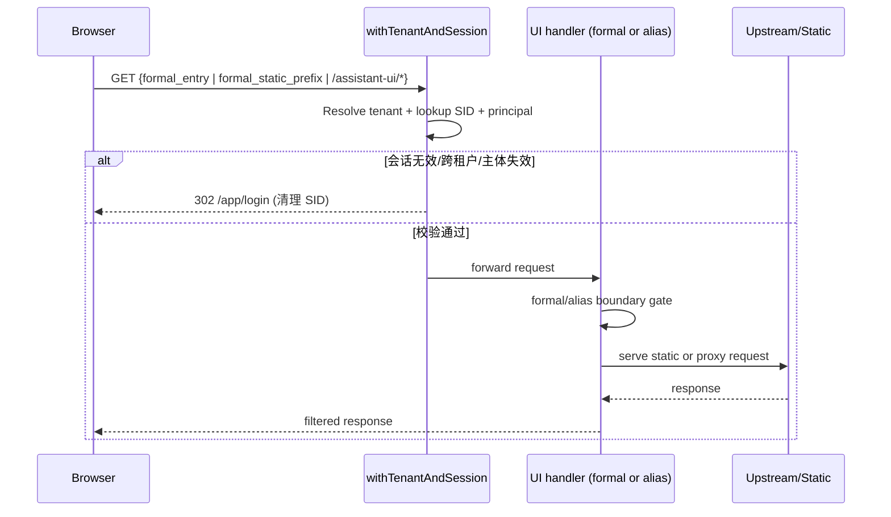

# DEV-PLAN-235：LibreChat 身份/会话/租户边界硬化详细设计

**状态**: 已完成（2026-03-07 CST；正式入口 `/app/assistant/librechat`、受保护静态子树与历史别名边界已落地；证据见 `docs/archive/dev-records/dev-plan-235-execution-log.md`）

## 1. 背景与上下文 (Context)
- **需求来源**:
  - `docs/dev-plans/230-librechat-project-level-integration-plan.md`（PR-230-04）
  - `docs/dev-plans/019-tenant-and-authn.md`
  - `docs/dev-plans/017-routing-strategy.md`
  - `docs/dev-plans/234-librechat-open-source-capabilities-reuse-plan.md`
- **当前痛点**:
  1. 现有 `withTenantAndSession` 若把 `/assets/**` 全量视为公开静态资源，会导致正式静态资源前缀 `/assets/librechat-web/**` 旁路会话边界。
  2. `assistant-ui` 反向代理默认透传请求头，缺少“最小透传 + 敏感头剥离”契约。
  3. 代理路径/方法边界未冻结，存在越界访问、跨租户会话复用与身份混淆风险。
  4. 缺少同时覆盖“正式入口 + 正式静态资源前缀 + 历史别名入口”的端到端负测（未登录、跨租户、旁路写）作为 CI 阻断证据。
- **业务价值**:
  - 将 LibreChat UI 的所有暴露入口（正式入口、正式入口静态资源前缀、历史别名入口）纳入与 `/app/**` 同级的会话与租户边界，确保正式入口与正式静态资源在**不依赖 `/assistant-ui/*` 代理**的前提下成立。

## 2. 目标与非目标 (Goals & Non-Goals)
### 2.1 核心目标
1. [ ] LibreChat UI 的正式入口、正式入口静态资源前缀与历史别名入口都必须强制会话校验，禁止绕过。
2. [ ] 固化 UI 会话行为矩阵（未登录、会话失效、租户不匹配）并保持 fail-closed。
3. [ ] 收敛代理/BFF 边界：方法白名单、路径规范化、请求/响应头最小透传。
4. [ ] 采用 cutover-first 口径：新正式入口边界补齐后，旧入口不得继续承担正式职责；`GET/HEAD /assistant-ui/*` 统一收敛为 `302 -> /app/assistant/librechat`，不为历史路径保留正式交互职责。
5. [ ] 明确并保持 AuthN/AuthZ/Tenant 注入归属在本仓，不引入 LibreChat 自管身份旁路。
6. [ ] 补齐单测 + E2E 负测，并接入现有门禁链路；负测覆盖不得仅限 `/assistant-ui/*`，必须覆盖正式入口与正式静态资源前缀。

### 2.2 非目标 (Out of Scope)
1. [ ] 不引入新的身份系统、SSO 流程或 LibreChat 本地用户体系。
2. [ ] 不变更 One Door 提交边界，不允许 assistant-ui 直接触发业务写路由。
3. [ ] 不新增数据库表、迁移或 sqlc 变更。
4. [ ] 不通过 feature flag/legacy 双链路做灰度绕过。

### 2.3 阶段口径（与 281/283 对齐）
1. [ ] 本计划当前处于 `281` 进行中或完成后、`283` 执行前的对齐窗口：允许先冻结契约与测试清单，再在正式入口切换前完成实现闭环。
2. [ ] `235` 的完成判定以“满足 `280` 的入口边界 stopline”为准，而不是以“`/assistant-ui/*` 历史链路可用”为准。
3. [ ] 若 `281` 在实施分支未封板，本计划仍按“新主链路优先”执行，不得新增旧桥职责或旧入口正式职责。

## 2.4 工具链与门禁（SSOT 引用）
- **触发器清单（本计划命中）**：
  - [X] Go 代码（中间件/代理/测试）
  - [ ] `.templ` / Tailwind
  - [ ] 多语言 JSON
  - [ ] Authz 策略包（策略本身不变）
  - [X] 路由治理（allowlist 与分类一致性）
  - [ ] DB 迁移 / Schema
  - [ ] sqlc
  - [X] E2E
  - [X] 文档门禁
- **本地必跑（命中项）**：
  1. [ ] `go fmt ./... && go vet ./... && make check lint && make test`
  2. [ ] `make check routing`
  3. [ ] `make check capability-route-map`（命中映射调整时）
  4. [ ] `make check error-message`（命中错误码/提示调整时）
  5. [ ] `make e2e`
  6. [ ] `make check doc`
- **SSOT 链接**：
  - `AGENTS.md`
  - `Makefile`
  - `.github/workflows/quality-gates.yml`
  - `docs/dev-plans/012-ci-quality-gates.md`

## 3. 架构与关键决策 (Architecture & Decisions)
### 3.1 目标拓扑
```mermaid
graph TD
    A[/app/assistant/librechat 正式入口] --> C[withTenantAndSession]
    B[/assets/librechat-web/** 正式静态资源前缀] --> C
    H[/assistant-ui/* 历史别名入口] --> C
    C --> D{session + tenant + principal valid?}
    D -->|No| E[302 /app/login + clear cookie]
    D -->|Yes| F{entry type}
    F -->|formal entry| G[vendored UI index handler]
    F -->|formal static| H2[protected static file handler]
    F -->|historical alias| J[assistant_ui_proxy redirect]
    J --> A

    L[/internal/assistant/*] --> I[withAuthz + capability-route-map]
```

### 3.2 请求时序（正式入口/历史别名统一口径）


### 3.3 ADR 摘要
- **ADR-235-01：正式入口 + 正式静态前缀 + 历史别名入口统一纳入受保护 UI 边界**（选定）
  - 选项 A：保留“仅 `/app/**` 校验”；缺点：正式入口静态资源或历史别名可能绕过会话。
  - 选项 B（选定）：受保护 UI 路径集合必须同时覆盖 `/app/assistant/librechat`、`/assets/librechat-web/**`、`/assistant-ui/*`。
- **ADR-235-02：代理方法白名单 fail-closed**（选定）
  - 选项 A：透传任意方法；缺点：扩大攻击面。
  - 选项 B（选定）：仅允许 `GET/HEAD`，其余返回 `405`。
- **ADR-235-03：代理头部“最小透传 + 敏感剥离”**（选定）
  - 选项 A：透传全部头；缺点：SID/Authorization 泄露与双身份风险。
  - 选项 B（选定）：白名单透传，并剥离 `Cookie/Authorization/Set-Cookie` 等敏感头。

## 4. 数据模型与约束 (Data Model & Constraints)
> 本计划不新增数据库 schema；冻结运行时边界契约。

### 4.1 受保护 UI 路径契约
> 自 `DEV-PLAN-280` 起，本计划不再把 `/assistant-ui/*` 视为唯一正式 UI 路径；凡承载 LibreChat Web UI 的正式入口、正式静态资源前缀、短期灰度别名入口，都属于受保护 UI 路径集合。
```yaml
protected_ui_prefixes:
  formal_entry_prefixes:
    - /app/assistant/librechat
  formal_static_prefixes:
    - /assets/librechat-web
  historical_alias_prefixes:
    - /assistant-ui
```
约束：
1. [ ] 受保护前缀必须经过完整 `tenant -> session -> principal` 校验，且该约束适用于 vendored UI 正式入口、正式静态资源前缀、历史 `/assistant-ui/*` 别名。
2. [ ] 历史 UI 路径（如 `/login`）仍保持“无别名跳转、由路由层返回 404”的既有行为。
3. [X] `formal_static_prefixes` 已冻结为字面量路径并接入服务端路由、单测与 routing allowlist；`283` 只负责正式入口切换与旧入口降级语义，不再承担本条冻结工作。

### 4.2 assistant-ui 代理请求边界契约
> `assistant_ui_proxy` 仅保留历史别名收口职责，不承担正式入口主链路职责。
```yaml
assistant_ui_proxy:
  methods: [GET, HEAD]
  path_prefix: /assistant-ui
  request_header_allowlist:
    - Accept
    - Accept-Language
    - Cache-Control
    - Content-Type
    - User-Agent
    - Referer
    - Origin
  request_header_strip:
    - Cookie
    - Authorization
```
约束：
1. [ ] 非白名单方法拒绝（405）。
2. [ ] 历史别名 `GET/HEAD /assistant-ui/*` 统一返回 `302 -> /app/assistant/librechat`；正式入口与正式静态资源路径不得依赖该别名代理才能可用。
3. [ ] 不再把 `/assistant-ui/*` 视为正式主链路、正式验收入口或正式静态资源承载面。

### 4.3 审计日志字段约束（结构化日志）
`assistant_ui_proxy_denied` / `assistant_ui_auth_denied` 事件最少字段：
- `tenant_id`
- `request_id`
- `trace_id`
- `path`
- `method`
- `reason`

## 5. 接口契约 (API / HTTP Contracts)
### 5.1 LibreChat UI 会话行为矩阵（正式入口 + 静态前缀 + 历史别名）
| 场景 | 输入 | 期望结果 |
| --- | --- | --- |
| 未登录 | 访问 `formal_entry_prefixes` / `formal_static_prefixes` / `/assistant-ui/*` 且无 SID | `302 -> /app/login` |
| SID 无效 | SID 查无记录 | 清理 SID + `302 -> /app/login` |
| 跨租户 SID | `sess.tenant_id != tenant.id` | 清理 SID + `302 -> /app/login` |
| 主体失效 | principal 缺失/非 active | 清理 SID + `302 -> /app/login` |
| 已登录同租户（正式入口） | SID 有效且主体 active | 允许进入正式入口/正式静态资源 handler |
| 已登录同租户（历史别名） | SID 有效且主体 active | `302 -> /app/assistant/librechat` |

### 5.2 LibreChat UI 入口边界契约
1. [ ] 正式入口及正式静态资源前缀必须具备与 `/app/**` 等强度的会话与租户边界，且该约束不依赖历史别名代理。
2. [ ] 对历史 `/assistant-ui/*` 别名，仅允许 `GET/HEAD` 的重定向收口；一旦新正式入口切换完成，旧入口不得继续承担正式业务职责。
3. [ ] `GET/HEAD /assistant-ui/*` 统一返回 `302 -> /app/assistant/librechat`。
4. [ ] 方法不允许返回 `405`，错误码 `assistant_ui_method_not_allowed`。
5. [ ] 路径越界返回 `400`，错误码 `assistant_ui_path_invalid`。
6. [ ] 不为历史入口保留长期放宽策略、白名单例外或兼容型旁路。

### 5.3 错误码与提示契约
新增或复用错误码需进入统一错误目录并通过门禁：
- `assistant_ui_method_not_allowed`
- `assistant_ui_path_invalid`

要求：
1. [ ] `en/zh` 提示明确，不使用泛化失败文案。
2. [ ] 与 `make check error-message` 口径一致。

## 6. 核心逻辑与算法 (Business Logic & Algorithms)
### 6.1 受保护 UI 判定算法
```text
rc = classifier.Classify(path)
if path in {health, healthz}: bypass
if path under formal_static_prefixes: require session/principal
else if path in shared_assets_not_used_by_formal_entry: bypass
resolve tenant
if rc == ui and path under protected_ui_prefixes:
  require session/principal
else if rc == ui and path not protected:
  passthrough (保持旧路径 404 语义)
```

### 6.2 LibreChat UI 入口会话校验算法
```text
if no sid: redirect /app/login
sess = sessions.Lookup(sid)
if lookup failed or tenant mismatch: clear sid + redirect
principal = principals.GetByID(sess.principal_id)
if principal missing or inactive: clear sid + redirect
if path belongs to formal_entry_prefixes: allow formal UI index handler
if path belongs to formal_static_prefixes: allow protected static file handler
if path belongs to historical_alias_prefixes: redirect to formal entry
```

### 6.3 历史别名代理边界算法（assistant-ui）
```text
if method not in {GET, HEAD}: deny(405)
if path not prefixed by /assistant-ui: deny(400)
redirect(302, /app/assistant/librechat)
```

### 6.4 失败策略
- 任一边界校验失败均 fail-closed，不提供 warning-only 或临时旁路开关。

## 7. 安全与鉴权 (Security & Authz)
1. [ ] 用户身份与会话仍由本仓 Kratos Session 驱动；正式入口与正式静态资源不依赖 `/assistant-ui/*` 代理成立。
2. [ ] 租户与主体校验在进入 proxy/BFF 之前执行，避免未鉴权流量触达上游。
3. [ ] 保持 `RLS/Casbin/One Door` 既有边界：LibreChat UI 任一入口都不得成为写旁路。
4. [ ] 敏感头与 cookie 不透传，避免跨系统会话污染与凭据泄露。
5. [ ] 迁移切换后，历史入口若保留，只能承担调试/排障职责；不得继续承担正式用户交互与正式验收职责。

## 8. 依赖与里程碑 (Dependencies & Milestones)
- **依赖**:
  - `DEV-PLAN-230`（总体切片）
  - `DEV-PLAN-232`（运行基线）
  - `DEV-PLAN-233`（单主源配置）
  - `DEV-PLAN-234`（域名策略与 OSS 能力复用）
  - `DEV-PLAN-280`（入口切换 stopline 与 cutover-first 原则）
  - `DEV-PLAN-281`（新主链路冻结实施；本计划与其并行推进）
  - `DEV-PLAN-283`（正式入口切换；本计划必须在其执行前补齐边界）
- **里程碑**:
  1. [ ] M1：冻结会话行为矩阵与边界契约（正式入口、正式静态资源前缀、历史别名）。
2. [X] M2：完成 `withTenantAndSession`、正式入口 `/app/assistant/librechat`、正式静态资源 `/assets/librechat-web/**` 与 `assistant_ui_proxy` cutover 代码改造，并冻结 `formal_static_prefixes` 字面量路径。
  3. [ ] M3：补齐单测（中间件/代理）与 E2E 负测（未登录、跨租户、旁路写），覆盖正式入口与历史别名两类路径。
  4. [ ] M4：完成门禁验证并产出 `dev-records` 证据；作为 `283` 执行前 stopline。

## 9. 测试与验收标准 (Acceptance Criteria)
### 9.1 必测场景
1. [ ] **未登录访问（正式入口）**：`GET /app/assistant/librechat` 返回 `302 /app/login`。
2. [ ] **未登录访问（历史别名）**：`GET /assistant-ui` 返回 `302 /app/login`。
3. [ ] **未登录访问（正式静态资源前缀）**：访问 `/assets/librechat-web/**` 时必须 fail-closed（不得通过公开 `/assets/**` 旁路返回 `200`）。
4. [ ] **跨租户 cookie 复用**：tenant A 的 SID 访问 tenant B 域名时被拒绝并清理 cookie。
5. [ ] **主体失效**：禁用用户访问 LibreChat UI 各入口被拒绝。
6. [ ] **历史别名收口**：已登录访问 `GET /assistant-ui/*` 返回 `302 -> /app/assistant/librechat`。
7. [ ] **方法越界**：`POST /assistant-ui/*` 返回 `405`。
8. [ ] **旁路写防护**：UI 任一路径无法触达本仓 `/internal/assistant/*` 写路由。

### 9.2 验收命令
1. [ ] `go fmt ./... && go vet ./... && make check lint && make test`
2. [ ] `make check routing`
3. [ ] `make check capability-route-map`（命中映射时）
4. [ ] `make check error-message`（命中错误码时）
5. [ ] `make e2e`
6. [ ] `make check doc`

### 9.3 完成定义（DoD）
1. [ ] LibreChat UI 的正式入口、正式静态资源前缀与历史别名入口都与 `/app/**` 在会话与租户边界上一致。
2. [ ] 在 `283` 开始前，`formal_static_prefixes` 已冻结为字面量路径并进入门禁与测试。
3. [ ] 正式入口切换完成后，不再存在两个同时承担正式职责的 UI 入口。
4. [ ] 历史别名入口若保留，仅承担重定向收口/调试职责，不再承担正式验收职责。
5. [ ] `GET/HEAD /assistant-ui/*` 的 cutover 收口可被测试稳定验证，且不恢复任何正式主链路职责。
6. [ ] 三类负测（未登录/跨租户/旁路写）在 CI 中可重复通过，且覆盖正式入口、正式静态资源与历史别名。
7. [ ] 无 legacy 旁路、临时开关或为照顾旧入口保留的长期兼容例外。

## 10. 运维与监控 (Ops & Monitoring)
1. [ ] 本阶段不引入新运维开关或外部监控栈，遵循早期最小运维原则。
2. [ ] 当 LibreChat UI 入口出现边界告警时，处置顺序固定：阻断发布 -> 修复边界 -> 重跑门禁 -> 恢复；不得以“先临时放行旧入口”替代修复。
3. [ ] 日志需可追踪到 `tenant_id/request_id/trace_id`，用于审计与故障复盘。
4. [ ] 回滚只允许前向修复或版本回滚，禁止恢复 legacy 双链路。

## 11. Readiness 记录要求
1. [X] 执行记录位于 `docs/archive/dev-records/dev-plan-235-execution-log.md`。
2. [ ] 记录至少 1 次正向样例与 3 次负向样例（未登录、跨租户、方法越界/旁路写）；负向样例必须包含正式入口与历史别名两类路径。
3. [ ] 每条证据需包含：时间、命令、结果、关键日志/响应片段。
4. [X] 首轮 `/assistant-ui` 硬化证据与本轮“正式入口 + 受保护静态子树”证据已合并记录；`235` 本身状态可标记为已完成，`283/285` 仍负责切换与封板。

## 12. SSOT 引用
- `AGENTS.md`
- `Makefile`
- `.github/workflows/quality-gates.yml`
- `config/routing/allowlist.yaml`
- `internal/server/handler.go`
- `internal/server/assistant_ui_proxy.go`
- `internal/server/tenancy_middleware_test.go`
- `internal/server/assistant_ui_proxy_test.go`
- `docs/dev-plans/012-ci-quality-gates.md`
- `docs/dev-plans/017-routing-strategy.md`
- `docs/dev-plans/019-tenant-and-authn.md`
- `docs/dev-plans/230-librechat-project-level-integration-plan.md`
- `docs/dev-plans/280-librechat-web-ui-vendoring-and-runtime-layered-reuse-plan.md`
- `docs/dev-plans/281-librechat-web-ui-source-vendoring-and-mainline-freeze-plan.md`
- `docs/dev-plans/283-librechat-formal-entry-cutover-plan.md`
- `docs/dev-plans/236-librechat-legacy-endpoint-retirement-and-single-source-closure-plan.md`
