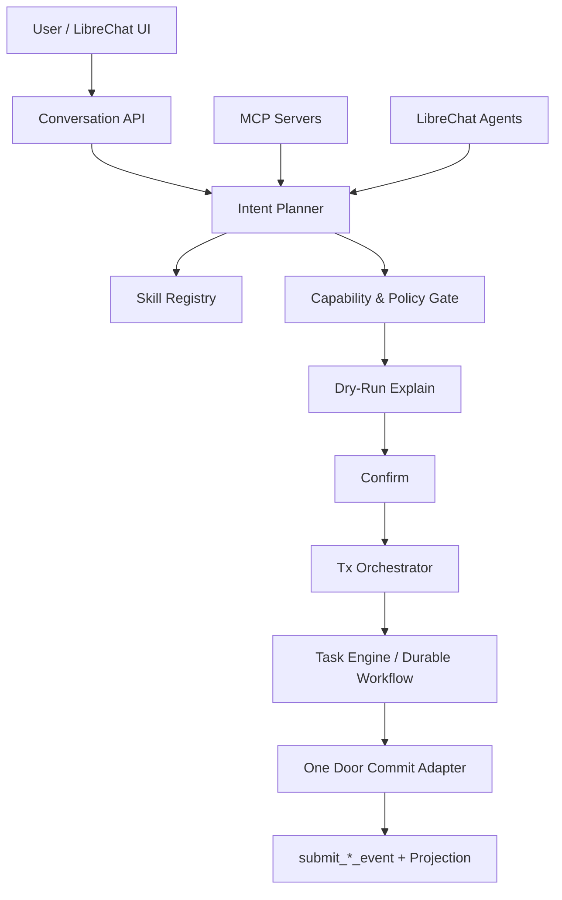

# DEV-PLAN-240：Assistant 组织架构事务编排现代化方案（去写死 + Skill/MCP/LibreChat 对齐）

**状态**: 草拟中（2026-03-04 11:46 UTC）

## 1. 背景与问题定义
- **需求来源**：针对当前 Assistant 在组织架构操作中的“代码写死”实现，提出批判性评估，并给出更先进、可扩展、可审计的事务操作模式。
- **现网现象（近期复盘）**：
  1. [ ] 提交链路曾出现字段策略冲突（系统维护字段被误传），暴露“计划层与执行层耦合”问题。
  2. [ ] 交互中出现请求超时，暴露“同步串行链路+缺少耐久编排”的韧性短板。
  3. [ ] 组织架构场景当前主要集中在单意图路径，新增场景需要改代码并回归全链路，发布成本高。
- **业务目标**：在不破坏 One Door、No Tx No RLS、No Legacy 的前提下，把 Assistant 从“硬编码流程”升级为“声明式事务编排”。

## 2. 现状批判（针对 assistant.go 语义，落到当前实现文件）
> 注：仓内对应实现主要分布在 `internal/server/assistant_api.go`、`internal/server/assistant_persistence.go`、`internal/server/assistant_intent_pipeline.go`。

### 2.1 结构性问题（批判结论）
1. [ ] **意图与能力键写死，扩展成本高**：`create_orgunit` 与 `org.orgunit_create.field_policy` 在代码中直接常量化，新增意图需改核心流程代码（`internal/server/assistant_api.go:34`、`internal/server/assistant_api.go:1120`、`internal/server/assistant_intent_pipeline.go:59`）。
2. [ ] **提交逻辑硬编码到单一路径**：`commit` 直接拼装 `WriteOrgUnitRequest` 并调用 `writeSvc.Write`，缺少可替换执行器层（`internal/server/assistant_api.go:1009`、`internal/server/assistant_persistence.go:614`）。
3. [ ] **计划编译器未插件化**：`assistantCompileIntentToPlans` 仍以 if/switch 方式写死 skill 与 delta 生成，难以实现多领域复用（`internal/server/assistant_intent_pipeline.go:47`）。
4. [ ] **内存实现与 PG 实现双处维护**：`commitTurn` 与 `applyCommitTurn` 逻辑重复，策略变更存在双改与漂移风险（`internal/server/assistant_api.go:908`、`internal/server/assistant_persistence.go:543`）。
5. [ ] **同步直提交流程抗抖动不足**：执行阶段仍偏同步串行，遇到模型/网络抖动时缺少标准化“耐久重试+人工接管”路径。
6. [ ] **外部能力接入边界未形成统一事务抽象**：Skill、MCP、LibreChat 能力已具备基础接入，但与会话事务状态机尚未统一成一个“可声明、可编排、可回放”的模型。

### 2.2 根因归纳
1. [ ] 以“先跑通单场景”为主的实现策略，未提前抽象 Intent->Plan->Action->Tx 的稳定边界。
2. [ ] 配置、技能、事务编排分层不彻底，导致变更时跨层修改。
3. [ ] 事务耐久化与异步编排能力虽已有基础（见 DEV-PLAN-225），但尚未完全承接组织操作主链路。

## 3. 行业先进模式调研（Skill / MCP / LibreChat / Durable Workflow）

### 3.1 Skill-First（声明式技能编排）
1. [ ] 将“可执行动作”收敛为 Skill Manifest（输入/输出 schema、风险等级、允许工具、前置检查）。
2. [ ] 由 Planner 只产出声明式执行计划，不直接写业务请求对象。
3. [ ] 提交前执行 Skill Gate（strict decode、policy check、idempotency check、dry-run explain）。
4. [ ] 优势：动作扩展主要走“注册+契约”，而非“改核心分支代码”。

### 3.2 MCP（Model Context Protocol）模式
1. [ ] MCP 官方架构强调 Host-Client-Server 解耦，工具/资源/提示可按能力动态注册。
2. [ ] Tool 调用可采用 Human-in-the-loop 审批，适配高风险组织变更操作。
3. [ ] Resource 由应用侧控制读取（非模型任意写入），适合“只读上下文 + 受控提交”。
4. [ ] 新增的 MCP Tasks 能力可用于长耗时任务和异步状态追踪，契合事务编排。

### 3.3 LibreChat 组合模式
1. [ ] LibreChat 已支持 Agents 与 MCP Servers，可在 `librechat.yaml` 中声明 `mcpServers`、`mcpSettings`、`allowedDomains`、`agents`。
2. [ ] 该模式适合“对话壳层 + 工具生态复用 + 安全域名治理”，但业务写入仍应回归本仓 One Door。
3. [ ] 建议采用“LibreChat 负责交互与工具编排，本仓负责交易裁决与提交”的双层职责分离。

### 3.4 Durable Workflow（Temporal/Saga/Outbox）
1. [ ] Durable Execution 模式强调“事件历史 + 可恢复重试 +确定性回放”，适合高价值事务。
2. [ ] 结合 Saga/补偿语义可为多步组织操作提供失败回滚策略。
3. [ ] Outbox/Inbox 去重可避免“请求已受理但编排未启动”导致的僵尸状态。
4. [ ] 结论：组织架构高风险动作宜采用“同步确认 + 异步耐久执行”的混合模式。

### 3.5 调研结论（本仓适配）
1. [ ] **短期最优**：Skill Registry + Tx 编排器 + One Door Commit Adapter。
2. [ ] **中期增强**：MCP Tool 只读增强 + 人工确认网关 + Task 异步执行。
3. [ ] **长期方向**：统一 Conversation/Task/Workflow 事务模型，逐步消除硬编码动作分支。

## 4. 目标与非目标

### 4.1 核心目标
1. [ ] 去除组织架构操作在核心流程中的硬编码分支，收敛到声明式动作注册。
2. [ ] 建立 Assistant 事务编排层（Plan/Confirm/Commit/Task）并支持可恢复执行。
3. [ ] 对齐 Skill/MCP/LibreChat 能力模型，形成统一的扩展与安全治理口径。
4. [ ] 保持 AI/UI 同构提交与审计一致性，禁止产生第二写入口。

### 4.2 非目标
1. [ ] 本计划不引入 legacy 回退链路。
2. [ ] 本计划不绕过 `submit_*_event(...)` 直接写业务事实表。
3. [ ] 本计划不把授权裁决迁移到外部编排引擎。

## 5. 目标架构（240 方案）

### 5.1 关键分层
1. [ ] **Planner 层**：只产出声明式 ActionPlan（不直接拼写业务请求结构）。
2. [ ] **Registry 层**：Skill/Capability/MCP 工具白名单及版本快照主源。
3. [ ] **Orchestrator 层**：统一状态机、幂等键、重试与补偿策略。
4. [ ] **Commit Adapter 层**：唯一对接 One Door 的执行器。

## 6. 契约与数据模型改造（草案）

### 6.1 新增/收敛契约
1. [ ] `AssistantActionSpec`：动作定义（capability_key、skill_id、risk_tier、required_checks）。
2. [ ] `AssistantExecutionPlan`：计划快照（intent_hash、plan_hash、skill_manifest_digest、version tuple）。
3. [ ] `AssistantTxEnvelope`：事务封套（tenant_id、conversation_id、turn_id、request_id、trace_id、idempotency_key）。
4. [ ] `AssistantCompensationSpec`：失败补偿策略（none/manual/auto-saga）。

### 6.2 事务不变量
1. [ ] One Door：最终写入仅经业务模块既有写门。
2. [ ] No Tx No RLS：所有 DB 访问保持显式事务 + 租户注入。
3. [ ] No Legacy：禁止 read/write 双链路并存。
4. [ ] Determinism：提交前必须校验快照版本与哈希一致性。

## 7. 分阶段实施路线（M1-M6）
1. [ ] **M1（契约冻结）**：冻结 ActionSpec/ExecutionPlan/TxEnvelope 草案与错误码。
2. [ ] **M2（去写死第一步）**：把 `create_orgunit` 逻辑从核心 `if/switch` 下沉到注册表驱动执行器。
3. [ ] **M3（编排统一）**：统一内存与 PG 路径的事务状态迁移逻辑，消除重复实现。
4. [ ] **M4（MCP/LibreChat 对齐）**：将 MCP Tool 调用接入同一风控与审批门，完善 allowedDomains 与审计字段。
5. [ ] **M5（耐久执行）**：提交链路默认走任务编排（可同步快速返回 receipt + 异步执行）。
6. [ ] **M6（全链路验收）**：完成 AI/UI 同构回归、失败重试与人工接管演练，封板文档与门禁。

## 8. 门禁与验证（SSOT 引用）
- 触发器与本地必跑矩阵：`AGENTS.md`
- 命令入口：`Makefile`
- CI 门禁：`.github/workflows/quality-gates.yml`

### 8.1 预计命中门禁
1. [ ] `go fmt ./... && go vet ./... && make check lint && make test`
2. [ ] `make check routing`
3. [ ] `make check capability-route-map`
4. [ ] `make check capability-key`
5. [ ] `make check no-legacy`
6. [ ] `make check assistant-config-single-source`
7. [ ] `make check error-message`
8. [ ] `make e2e`
9. [ ] `make check doc`

## 9. 验收标准（DoD）
1. [ ] 新增组织操作场景时，无需修改核心 `assistant_*` 提交流程分支，仅通过注册契约扩展。
2. [ ] 对同一输入，AI/UI 路径在授权判定、错误码、审计字段上保持一致。
3. [ ] 任务执行支持断点恢复与可审计重试，不出现“已受理但不可追踪”状态。
4. [ ] MCP/LibreChat 接入不突破 One Door 与租户边界。
5. [ ] 关键失败路径（超时/版本漂移/审批拒绝/外部工具失败）均有稳定错误码与人工接管入口。

## 10. 风险与缓解
1. [ ] **风险：抽象过度导致落地变慢**；缓解：先从 orgunit create 单场景切片落地，再复制到其他动作。
2. [ ] **风险：外部工具引入安全面扩大**；缓解：MCP/Actions 全部走 allowlist + 审计 + fail-closed。
3. [ ] **风险：异步化后用户感知变差**；缓解：统一 receipt + 任务进度查询 + 超时告警提示。
4. [ ] **风险：迁移期行为漂移**；缓解：双轨验证但非双写（影子评估 + 单链路提交）。

## 11. 交付物与证据
1. [ ] 主计划文档：`docs/dev-plans/240-assistant-org-transaction-orchestration-modernization-plan.md`。
2. [ ] 执行证据：`docs/dev-records/dev-plan-240-execution-log.md`（后续实施阶段创建）。
3. [ ] 关键对比报告：硬编码路径 vs 注册驱动路径（性能、失败率、变更成本）。
4. [ ] E2E 证据：组织架构创建/更正/移动等至少 3 类动作的计划-确认-提交-任务闭环。

## 12. 行业调研参考（Primary Sources）
1. [ ] MCP 架构与能力模型：`https://modelcontextprotocol.io/docs/concepts/architecture`
2. [ ] MCP Tools（人机审批与工具调用边界）：`https://modelcontextprotocol.io/docs/concepts/tools`
3. [ ] MCP Resources（应用控制上下文读取）：`https://modelcontextprotocol.io/docs/concepts/resources`
4. [ ] LibreChat MCP Servers 配置：`https://www.librechat.ai/docs/configuration/librechat_yaml/object_structure/mcp_servers`
5. [ ] LibreChat MCP Settings（allowedDomains 等）：`https://www.librechat.ai/docs/configuration/librechat_yaml/object_structure/mcp_settings`
6. [ ] LibreChat Agents 能力：`https://www.librechat.ai/docs/configuration/librechat_yaml/object_structure/agents`
7. [ ] Temporal Durable Execution/Workflow 基础：`https://docs.temporal.io/workflow-execution`、`https://docs.temporal.io/workflow-definition`
8. [ ] Saga 模式（Microsoft Architecture）：`https://learn.microsoft.com/azure/architecture/patterns/saga`

## 13. 与既有计划关系（避免重复建设）
1. [ ] 承接 `DEV-PLAN-224/224C/225` 的意图治理、技能计划、任务编排基础。
2. [ ] 复用 `DEV-PLAN-234/235/239` 的 LibreChat、MCP、运行边界收敛成果。
3. [ ] 本计划聚焦“去写死 + 统一事务编排抽象”，不重复定义既有单主源与边界规则。
