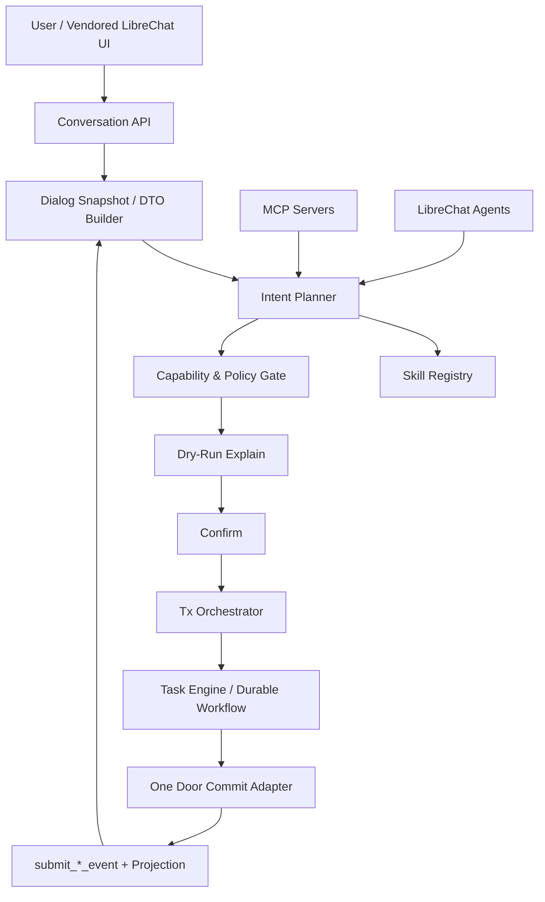
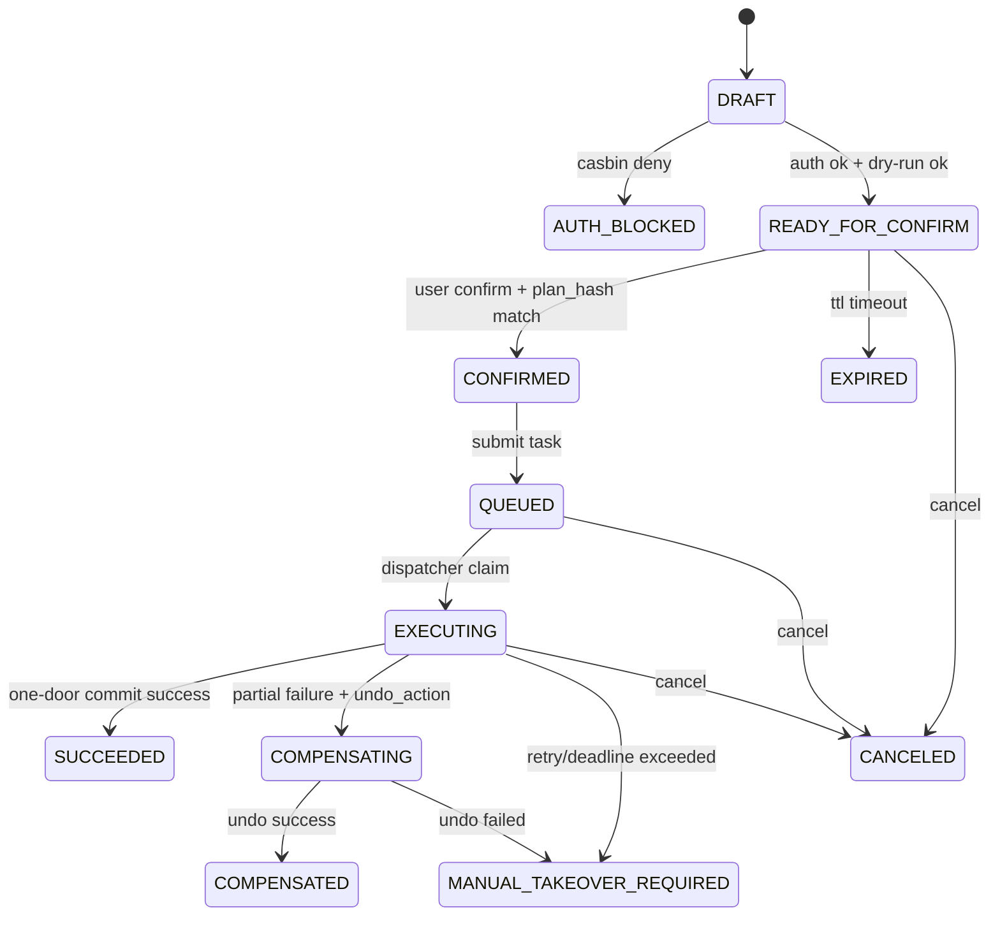

# DEV-PLAN-240：Assistant 组织架构事务编排现代化方案（按 DEV-PLAN-280 新方向修订）

**状态**: 进行中（已完成 `M0/M1/M2/M3`；`M4~M7` 由 `DEV-PLAN-240C~240F` 承接推进；2026-03-08 CST）

## 1. 背景与问题定义
- **需求来源**：针对当前 Assistant 在组织架构操作中的“代码写死”实现，提出批判性评估，并给出更先进、可扩展、可审计的事务操作模式。
- **现网现象（近期复盘）**：
  1. [ ] 提交链路曾出现字段策略冲突（系统维护字段被误传），暴露“计划层与执行层耦合”问题。
  2. [ ] 交互中出现请求超时，暴露“同步串行链路+缺少耐久编排”的韧性短板。
  3. [ ] 组织架构场景当前主要集中在单意图路径，新增场景需要改代码并回归全链路，发布成本高。
- **业务目标**：在不破坏 One Door、No Tx No RLS、No Legacy 的前提下，把 Assistant 从“硬编码流程”升级为“声明式事务编排”。

### 1.1 本次修订目标（承接 DEV-PLAN-280）
1. [X] 冻结边界：`240` 仅负责后端事务编排现代化（ActionSpec/Plan/Confirm/Commit/Task/OCC/审计），不再承担 UI 承载与发送渲染控制点定义。
2. [X] 承接前提：前端承载与源码控制点以 `280/283/284` 为准；`240` 只消费并约束 `223/260` 冻结的业务事实源与 DTO 语义。
3. [X] 强化不变量：业务真相固定为后端 `conversation_id/turn_id/request_id/trace_id + phase + 审计状态转移`；前端不得重算业务阶段与提交约束。
4. [X] 补齐 stopline：若仍依赖页面 helper/DOM 注入推进业务状态或触发提交，`240` 不得宣称达成。

## 2. 现状批判（针对 assistant 主链路语义，落到当前实现文件）
> 注：仓内对应实现主要分布在 `internal/server/assistant_api.go`、`internal/server/assistant_persistence.go`、`internal/server/assistant_intent_pipeline.go`。

### 2.1 结构性问题（批判结论）
1. [ ] **意图与能力键写死，扩展成本高**：`create_orgunit` 与 `org.orgunit_create.field_policy` 在代码中直接常量化，新增意图需改核心流程代码（`internal/server/assistant_api.go:34`、`internal/server/assistant_api.go:1120`、`internal/server/assistant_intent_pipeline.go:59`）。
2. [ ] **提交逻辑硬编码到单一路径**：`commit` 直接拼装 `WriteOrgUnitRequest` 并调用 `writeSvc.Write`，缺少可替换执行器层（`internal/server/assistant_api.go:1009`、`internal/server/assistant_persistence.go:614`）。
3. [ ] **计划编译器未插件化**：`assistantCompileIntentToPlans` 仍以 if/switch 方式写死 skill 与 delta 生成，难以实现多领域复用（`internal/server/assistant_intent_pipeline.go:47`）。
4. [ ] **内存实现与 PG 实现双处维护**：`commitTurn` 与 `applyCommitTurn` 逻辑重复，策略变更存在双改与漂移风险（`internal/server/assistant_api.go:908`、`internal/server/assistant_persistence.go:543`）。
5. [ ] **同步直提交流程抗抖动不足**：执行阶段仍偏同步串行，遇到模型/网络抖动时缺少标准化“耐久重试+人工接管”路径。
6. [ ] **外部能力接入边界未形成统一事务抽象**：Skill、MCP、LibreChat 能力已具备基础接入，但与会话事务状态机尚未统一成一个“可声明、可编排、可回放”的模型。

### 2.2 根因归纳
1. [ ] 以“先跑通单场景”为主的实现策略，未提前抽象 Intent->Plan->Action->Tx 的稳定边界。
2. [ ] 配置、技能、事务编排分层不彻底，导致变更时跨层修改。
3. [ ] 事务耐久化与异步编排能力虽已有基础（见 DEV-PLAN-225），但尚未完全承接组织操作主链路。

## 3. 行业先进模式调研（Skill / MCP / LibreChat / Durable Workflow）

### 3.1 Skill-First（声明式技能编排）
1. [ ] 将“可执行动作”收敛为 Skill Manifest（输入/输出 schema、风险等级、允许工具、前置检查）。
2. [ ] 由 Planner 只产出声明式执行计划，不直接写业务请求对象。
3. [ ] 提交前执行 Skill Gate（strict decode、policy check、idempotency check、dry-run explain）。
4. [ ] 优势：动作扩展主要走“注册+契约”，而非“改核心分支代码”。

### 3.2 MCP（Model Context Protocol）模式
1. [ ] MCP 官方架构强调 Host-Client-Server 解耦，工具/资源/提示可按能力动态注册。
2. [ ] Tool 调用可采用 Human-in-the-loop 审批，适配高风险组织变更操作。
3. [ ] Resource 由应用侧控制读取（非模型任意写入），适合“只读上下文 + 受控提交”。
4. [ ] 新增的 MCP Tasks 能力可用于长耗时任务和异步状态追踪，契合事务编排。

### 3.3 LibreChat 组合模式
1. [ ] LibreChat 已支持 Agents 与 MCP Servers，可在 `librechat.yaml` 中声明 `mcpServers`、`mcpSettings`、`allowedDomains`、`agents`。
2. [ ] 按 `280` 新方向，运行态维持“上游 runtime 复用 + 本仓 Web UI 源码纳管”：上游继续负责 runtime，本仓接管 send/store/render 控制点。
3. [ ] `240` 只定义“交易裁决与提交”主链，不重定义 UI 承载细节；UI 侧仅允许消费后端 DTO，不得在 helper/adapter 内重算事务语义。
4. [ ] 业务写入仍必须回归本仓 One Door；LibreChat/MCP 不得形成第二写入口。

### 3.4 Durable Workflow（Temporal/Saga/Outbox）
1. [ ] Durable Execution 模式强调“事件历史 + 可恢复重试 +确定性回放”，适合高价值事务。
2. [ ] 结合 Saga/补偿语义可为多步组织操作提供失败回滚策略。
3. [ ] Outbox/Inbox 去重可避免“请求已受理但编排未启动”导致的僵尸状态。
4. [ ] 结论：组织架构高风险动作宜采用“同步确认 + 异步耐久执行”的混合模式。

### 3.5 调研结论（本仓适配）
1. [ ] **短期最优**：Skill Registry + Tx 编排器 + One Door Commit Adapter。
2. [ ] **中期增强**：MCP Tool 只读增强 + 人工确认网关 + Task 异步执行。
3. [ ] **长期方向**：统一 Conversation/Task/Workflow 事务模型，逐步消除硬编码动作分支。

### 3.6 蓝图采纳结论（2026-03-04）
1. [X] 采纳 `AssistantActionSpec` 作为 DEV-PLAN-240 的核心契约载体，承接“去写死 + 声明式编排”目标。
2. [X] 采用“条件采纳”：不直接引入多写入口（如 DB 动态回写注册），初期仅允许代码内注册表或只读配置源。
3. [X] 权鉴语义对齐本仓现行模型：subject/domain/object/action（Casbin），禁止仅以 `UserID` 直判替代既有授权口径。
4. [X] `CommitPath` 采用受控 Adapter 注册（typed key + allowlist），禁止字符串直路由导致第二写入口风险。
5. [X] MCP 外部能力默认只读接入；涉及业务写入的能力必须显式映射 capability_key 并通过确认/审计门。

### 3.7 与 DEV-PLAN-280 的对齐结论（2026-03-08）
1. [X] 前端承载面收口、源码级发送/渲染接管由 `280/283/284` 承接；`240` 不重复定义 UI 方案。
2. [X] `240` 的 Confirm/Commit/Task 状态推进必须以后端持久化事实源为准，不依赖前端本地状态推断。
3. [X] `240` 的输出契约必须兼容 `260` 冻结 DTO 字段：`phase/missing_fields/candidates/pending_draft_summary/selected_candidate_id/commit_reply/error_code`。
4. [X] `240` 不得把“前端补丁能跑通”当作达成依据；必须满足后端事务不变量与可审计可恢复要求。

## 4. 目标与非目标

### 4.1 核心目标
1. [ ] 去除组织架构操作在核心流程中的硬编码分支，收敛到声明式动作注册。
2. [ ] 建立 Assistant 事务编排层（Plan/Confirm/Commit/Task）并支持可恢复执行。
3. [ ] 对齐 Skill/MCP/LibreChat 能力模型，形成统一的扩展与安全治理口径（runtime 复用、后端裁决、前端降权）。
4. [ ] 保持 AI/UI 同构提交与审计一致性，禁止产生第二写入口。
5. [ ] 明确与 `280/284` 的职责边界：后端只输出冻结 DTO 与状态机事实，不把业务推进逻辑回灌到前端 helper。
6. [ ] 对齐 `223/260`：确保 `phase + 事务元数据` 可持久化、可恢复、可回放。

### 4.2 非目标
1. [ ] 本计划不引入 legacy 回退链路。
2. [ ] 本计划不绕过 `submit_*_event(...)` 直接写业务事实表。
3. [ ] 本计划不把授权裁决迁移到外部编排引擎。
4. [ ] 本计划不定义 vendored UI 的 send/store/render patch 细节（由 `284` 承接）。
5. [ ] 本计划不以 DOM 注入、页面桥接或 iframe 行为作为正式验收口径。

## 5. 目标架构（240 方案）



### 5.1 关键分层
1. [ ] **Planner 层**：只产出声明式 ActionPlan（不直接拼写业务请求结构）。
2. [ ] **Registry 层**：Skill/Capability/MCP 工具白名单及版本快照主源。
3. [ ] **Orchestrator 层**：统一状态机、幂等键、重试与补偿策略。
4. [ ] **Commit Adapter 层**：唯一对接 One Door 的执行器。
5. [ ] **Snapshot/DTO 层**：从持久化事实源重建 `phase/missing_fields/candidates/pending_draft_summary/selected_candidate_id/commit_reply/error_code`，供 `260/284` 消费。

## 6. 契约与数据模型改造（草案）

### 6.1 新增/收敛契约
1. [X] `AssistantActionSpec`：动作定义（`id/version/category/tags/input_schema/capability_key/security.auth_object/security.auth_action/security.risk_tier/security.required_checks/handler.commit_adapter_key/handler.dry_run_key/handler.undo_action/handler.timeout_sec`）。
2. [X] `AssistantExecutionPlan`：计划快照（`intent_hash/context_hash/plan_hash/skill_manifest_digest/model_route_snapshot/version tuple`）。
3. [X] `AssistantTxEnvelope`：事务封套（`tenant_id/conversation_id/turn_id/request_id/trace_id/idempotency_key`）。
4. [X] `AssistantCompensationSpec`：失败补偿策略（`none/manual/auto-saga` + `max_retry/backoff/manual_takeover_threshold`）。

### 6.2 ActionSpec 约束（冻结）
1. [X] **No Spec, No Commit**：未注册 action 一律不得进入 commit。
2. [X] **No Capability, No Plan**：`AssistantActionSpec.capability_key` 必须命中 capability 注册与映射门禁。
3. [X] **No Auth Pass, No DryRun**：左移鉴权失败时直接阻断，不调用业务 DryRun。
4. [X] **No Adapter, No Write**：`commit_adapter_key` 未注册时 fail-closed，禁止降级到直写实现。
5. [X] **No PlanHash Match, No Confirm**：Confirm 必须提交并校验 `plan_hash`，防止“旧确认提交新计划”。
6. [X] **No VersionTuple Match, No Commit**：Commit Adapter 在调用写门前必须校验 `version tuple`（OCC），防止 TOCTOU。
7. [X] **No Snapshot, No UI Truth**：任意用户可见事务状态必须能由后端快照重建，不允许仅存在前端内存。
8. [X] **No DTO Contract, No Render Claim**：若 `phase/missing_fields/candidates/pending_draft_summary/selected_candidate_id/commit_reply/error_code` 任一字段语义不稳定，则不得宣称与 `260/284` 对齐。

### 6.3 事务不变量
1. [X] One Door：最终写入仅经业务模块既有写门。
2. [X] No Tx No RLS：所有 DB 访问保持显式事务 + 租户注入。
3. [X] No Legacy：禁止 read/write 双链路并存。
4. [X] Determinism：提交前必须校验快照版本与哈希一致性。
5. [X] Backend Truth：业务真相以后端 `conversation/turn/request/trace + phase + 状态转移审计` 为准。
6. [X] Frontend De-power：前端只能消费 DTO，不得自行推进事务阶段或提交约束。

### 6.4 ActionPlan 状态机（v0.1）


### 6.5 状态映射到现有实现（过渡期）
1. [ ] `READY_FOR_CONFIRM/CONFIRMED` 对齐现有 `validated/confirmed` 语义。
2. [ ] `QUEUED/EXECUTING/SUCCEEDED/MANUAL_TAKEOVER_REQUIRED/CANCELED` 对齐现有 Task 状态机。
3. [ ] `COMPENSATING/COMPENSATED` 先在编排层落状态与审计，再逐步接入真实补偿动作。
4. [ ] `EXPIRED` 对齐现有会话回合 `expired` 语义；先实现“惰性过期判定”，再评估后台清理任务。

### 6.6 核心契约结构定义（Go Struct 草案，M1 冻结目标）
```go
package assistantcontracts

import "encoding/json"

type AssistantActionSecurity struct {
	AuthObject     string   `json:"auth_object"`
	AuthAction     string   `json:"auth_action"`
	RiskTier       string   `json:"risk_tier"`        // low | medium | high
	RequiredChecks []string `json:"required_checks"`  // strict_decode / boundary_lint / ...
}

type AssistantActionHandler struct {
	DryRunKey        string `json:"dry_run_key"`
	CommitAdapterKey string `json:"commit_adapter_key"`
	UndoAction       string `json:"undo_action,omitempty"`
	TimeoutSec       int    `json:"timeout_sec"`
}

type AssistantActionUI struct {
	ConfirmTemplate string `json:"confirm_template,omitempty"`
	SuccessRoute    string `json:"success_route,omitempty"`
}

// AssistantActionSpec 是动作声明的主契约（Registry 单位）
type AssistantActionSpec struct {
	ID            string          `json:"id"`
	Version       string          `json:"version"`
	Category      string          `json:"category"`
	Tags          []string        `json:"tags,omitempty"`
	CapabilityKey string          `json:"capability_key"`
	InputSchema   json.RawMessage `json:"input_schema"` // JSON Schema 原文
	Security      AssistantActionSecurity `json:"security"`
	Handler       AssistantActionHandler  `json:"handler"`
	UI            AssistantActionUI       `json:"ui,omitempty"`
}

type AssistantExecutionPlan struct {
	PlanID                   string          `json:"plan_id"`
	ActionID                 string          `json:"action_id"`
	ActionVersion            string          `json:"action_version"`
	IntentHash               string          `json:"intent_hash"`
	ContextHash              string          `json:"context_hash"`
	PlanHash                 string          `json:"plan_hash"`
	SkillManifestDigest      string          `json:"skill_manifest_digest"`
	ModelRouteSnapshot       json.RawMessage `json:"model_route_snapshot,omitempty"`
	ModelRouteSnapshotHash   string          `json:"model_route_snapshot_hash,omitempty"`
	IntentSchemaVersion      string          `json:"intent_schema_version"`
	CompilerContractVersion  string          `json:"compiler_contract_version"`
	CapabilityMapVersion     string          `json:"capability_map_version"`
	VersionTuple             json.RawMessage `json:"version_tuple,omitempty"` // 写前 OCC 前置条件（如父组织状态/目标记录版本）
	ConfirmTTLSeconds        int             `json:"confirm_ttl_seconds"`
	ExpiresAt                string          `json:"expires_at,omitempty"` // RFC3339 UTC
}

type AssistantTxEnvelope struct {
	TenantID       string `json:"tenant_id"`
	ConversationID string `json:"conversation_id"`
	TurnID         string `json:"turn_id"`
	RequestID      string `json:"request_id"`
	TraceID        string `json:"trace_id"`
	IdempotencyKey string `json:"idempotency_key"`
	PlanHash       string `json:"plan_hash"`
}

type AssistantCompensationSpec struct {
	Mode                  string `json:"mode"` // none | manual | auto-saga
	MaxRetry              int    `json:"max_retry"`
	Backoff               string `json:"backoff"`
	ManualTakeoverTrigger string `json:"manual_takeover_trigger"`
}

type AssistantActionPlanState string

const (
	ActionPlanDraft                AssistantActionPlanState = "DRAFT"
	ActionPlanAuthBlocked          AssistantActionPlanState = "AUTH_BLOCKED"
	ActionPlanReadyForConfirm      AssistantActionPlanState = "READY_FOR_CONFIRM"
	ActionPlanConfirmed            AssistantActionPlanState = "CONFIRMED"
	ActionPlanExpired              AssistantActionPlanState = "EXPIRED"
	ActionPlanQueued               AssistantActionPlanState = "QUEUED"
	ActionPlanExecuting            AssistantActionPlanState = "EXECUTING"
	ActionPlanSucceeded            AssistantActionPlanState = "SUCCEEDED"
	ActionPlanCompensating         AssistantActionPlanState = "COMPENSATING"
	ActionPlanCompensated          AssistantActionPlanState = "COMPENSATED"
	ActionPlanManualTakeoverNeeded AssistantActionPlanState = "MANUAL_TAKEOVER_REQUIRED"
	ActionPlanCanceled             AssistantActionPlanState = "CANCELED"
)
```

### 6.7 与 223/260/280/284 的接口边界（冻结）
1. [X] `223` 是持久化事实源 SSOT：`240` 只在其口径上扩展编排状态，不新增平行事实源。
2. [X] `260` 是业务语义/FSM/DTO SSOT：`240` 不重定义对话业务阶段，只实现可验证的后端状态推进。
3. [X] `280/283` 是 UI 承载与入口切换 SSOT：`240` 不回退到旧桥接链路或双入口口径。
4. [X] `284` 是 send/store/render 接管 SSOT：`240` 只提供稳定 API/DTO，不在前端实现层塞入业务判定兜底。
5. [X] 任一接口变更若影响以上边界，必须先更新相应主计划，再调整本计划与代码实现。

## 7. 分阶段实施路线（M0-M7）
1. [X] **M0（对齐前置）**：与 `223/260/280/284` 冻结接口边界，确认 DTO 字段与 phase 语义不再漂移。
2. [X] **M1（契约冻结）**：冻结 `AssistantActionSpec/ExecutionPlan/TxEnvelope/CompensationSpec`、状态机、错误码与 Confirm `plan_hash` 契约，并冻结 `confirm_ttl_seconds/expires_at/version_tuple` 字段口径。
3. [X] **M2（去写死第一步）**：把 `create_orgunit` 从核心 `if/switch` 下沉到 `ActionRegistry + CommitAdapter`，保持行为等价；强制 Commit 前执行 `version_tuple` OCC 校验。
4. [X] **M3（编排统一）**：统一内存与 PG 路径状态迁移；把 confirm/commit/task 三段收敛为同一状态机实现。
5. [ ] **M4（权鉴与风控左移）**：落地 `ActionInterceptor`，将 `auth_object/auth_action/risk_tier/required_checks` 固化到执行前 gate。
6. [ ] **M5（耐久执行 + 补偿）**：提交链路默认走任务编排（receipt + 异步执行）；高风险组织操作在初期默认“人工接管优先”，`partial failure` 先落 `MANUAL_TAKEOVER_REQUIRED`，`auto-saga` 按白名单渐进启用。
7. [ ] **M6（MCP/LibreChat 对齐）**：将 MCP 调用接入统一风控/审批门，完成“默认只读 + 显式写能力注册 + 审计门”。
8. [ ] **M7（280 方向封板）**：在 `283/284` 主链路下完成 AI/UI 同构回归，确保无前端重算、无旧桥接职责回流。

### 7.1 M0-M1 执行记录（2026-03-07 CST）
1. [X] 边界冻结完成：`223` 作为持久化事实源、`260` 作为业务 FSM/DTO 语义主计划、`280/283` 作为承载与入口主计划、`284` 作为 send/store/render 接管主计划。
2. [X] DTO 口径冻结完成：`phase/missing_fields/candidates/pending_draft_summary/selected_candidate_id/commit_reply/error_code` 作为跨计划唯一消费字段集合。
3. [X] 事务契约冻结完成：`AssistantActionSpec/AssistantExecutionPlan/AssistantTxEnvelope/AssistantCompensationSpec` 与 `plan_hash + confirm_ttl_seconds/expires_at + version_tuple` 已冻结为 M1 基线。
4. [X] Stopline 冻结完成：前端仅消费 DTO，禁止在 helper/adapter 内重算阶段、候选裁决或提交约束。
5. [X] 进入条件确认：`M2` 仅在保持上述冻结口径不变的前提下启动，实现层不得回流 UI 兜底业务判定。

### 7.2 子计划拆分（M2-M7）
1. [X] `DEV-PLAN-240A`（承接 `M2`）：ActionRegistry + CommitAdapter + OCC 落地。
2. [X] `DEV-PLAN-240B`（承接 `M3`）：状态机统一与内存/PG 路径收敛。
3. [X] `DEV-PLAN-240C`（承接 `M4`）：ActionInterceptor 与风险门左移。
4. [X] `DEV-PLAN-240D`（承接 `M5`）：耐久执行与人工接管优先。
5. [X] `DEV-PLAN-240E`（承接 `M6`）：MCP 写能力准入与治理。
6. [X] `DEV-PLAN-240F`（承接 `M7`）：与 `280/284/260` 对齐封板回归。

## 8. 门禁与验证（SSOT 引用）
- 触发器与本地必跑矩阵：`AGENTS.md`
- 命令入口：`Makefile`
- CI 门禁：`.github/workflows/quality-gates.yml`

### 8.1 预计命中门禁
1. [ ] `go fmt ./... && go vet ./... && make check lint && make test`
2. [ ] `make check routing`
3. [ ] `make check capability-route-map`
4. [ ] `make check capability-key`
5. [ ] `make check no-legacy`
6. [ ] `make check assistant-config-single-source`
7. [ ] `make check error-message`
8. [ ] `make e2e`
9. [ ] `make check doc`

## 9. 验收标准（DoD）
1. [ ] 新增组织操作场景时，无需修改核心 `assistant_*` 提交流程分支，仅通过注册契约扩展。
2. [ ] 对同一输入，AI/UI 路径在授权判定、错误码、审计字段上保持一致。
3. [ ] Confirm 请求必须携带 `plan_hash` 且后端一致性校验通过，避免确认-提交错配。
4. [ ] `READY_FOR_CONFIRM` 超过 TTL 后必须进入 `EXPIRED`（至少惰性判定生效），禁止超时确认。
5. [ ] Commit Adapter 在写门前必须完成 `version_tuple` OCC 校验；校验失败返回稳定错误码并阻断提交。
6. [ ] 高风险动作 `partial failure` 默认进入 `MANUAL_TAKEOVER_REQUIRED`，并生成可追踪人工接管信息。
7. [ ] 任务执行支持断点恢复与可审计重试，不出现“已受理但不可追踪”状态。
8. [ ] MCP/LibreChat 接入不突破 One Door 与租户边界，外部写能力必须显式注册并受审批门控制。
9. [ ] 关键失败路径（超时/版本漂移/审批拒绝/外部工具失败/补偿失败）均有稳定错误码与人工接管入口。
10. [ ] `260` DTO 字段语义保持单主源：后端可稳定输出 `phase/missing_fields/candidates/pending_draft_summary/selected_candidate_id/commit_reply/error_code`，且能从持久化事实源重建。
11. [ ] 在 `283/284` 正式链路下，前端不再承担事务阶段推进、候选裁决与提交约束；若出现前端重算则本计划验收失败。

## 10. 风险与缓解
1. [ ] **风险：抽象过度导致落地变慢**；缓解：先从 orgunit create 单场景切片落地，再复制到其他动作。
2. [ ] **风险：外部工具引入安全面扩大**；缓解：MCP/Actions 全部走 allowlist + 审计 + fail-closed。
3. [ ] **风险：异步化后用户感知变差**；缓解：统一 receipt + 任务进度查询 + 超时告警提示。
4. [ ] **风险：迁移期行为漂移**；缓解：双轨验证但非双写（影子评估 + 单链路提交）。
5. [ ] **风险：`240` 与 `280/284` 边界回流**；缓解：以“后端事实源 + 前端降权”作为 stopline，任何 UI 兜底业务判定都阻断合并。

## 11. 交付物与证据
1. [ ] 主计划文档：`docs/dev-plans/240-assistant-org-transaction-orchestration-modernization-plan.md`。
2. [ ] 执行证据：`docs/dev-records/dev-plan-240-execution-log.md`（后续实施阶段创建）。
3. [ ] 关键对比报告：硬编码路径 vs 注册驱动路径（性能、失败率、变更成本）。
4. [ ] E2E 证据：组织架构创建/更正/移动等至少 3 类动作的计划-确认-提交-任务闭环。

## 12. 行业调研参考（Primary Sources）
1. [ ] MCP 架构与能力模型：`https://modelcontextprotocol.io/docs/concepts/architecture`
2. [ ] MCP Tools（人机审批与工具调用边界）：`https://modelcontextprotocol.io/docs/concepts/tools`
3. [ ] MCP Resources（应用控制上下文读取）：`https://modelcontextprotocol.io/docs/concepts/resources`
4. [ ] LibreChat MCP Servers 配置：`https://www.librechat.ai/docs/configuration/librechat_yaml/object_structure/mcp_servers`
5. [ ] LibreChat MCP Settings（allowedDomains 等）：`https://www.librechat.ai/docs/configuration/librechat_yaml/object_structure/mcp_settings`
6. [ ] LibreChat Agents 能力：`https://www.librechat.ai/docs/configuration/librechat_yaml/object_structure/agents`
7. [ ] Temporal Durable Execution/Workflow 基础：`https://docs.temporal.io/workflow-execution`、`https://docs.temporal.io/workflow-definition`
8. [ ] Saga 模式（Microsoft Architecture）：`https://learn.microsoft.com/azure/architecture/patterns/saga`

## 13. 与既有计划关系（避免重复建设）
1. [ ] 承接 `DEV-PLAN-224/224C/225` 的意图治理、技能计划、任务编排基础。
2. [ ] 复用 `DEV-PLAN-234/235/239` 的 LibreChat、MCP、运行边界收敛成果。
3. [ ] 对齐 `DEV-PLAN-223/260`：事实源持久化与业务 FSM/DTO 语义由两者主导，`240` 负责事务编排实现。
4. [ ] 对齐 `DEV-PLAN-280/283/284`：UI 承载、入口切换与源码级发送渲染接管由其主导，`240` 不重复定义前端承载策略。
5. [ ] 对齐 `DEV-PLAN-271`：跨计划阶段编排与封板顺序按统一主链路执行。
6. [ ] `DEV-PLAN-240A~240F` 承接 `M2~M7` 的原子实施，不再在主计划中堆叠实现细节。
7. [ ] 本计划聚焦“去写死 + 统一事务编排抽象”，不重复定义既有单主源与边界规则。

## 14. 当前实现 vs 目标态对照表（专门）

> 快照日期：2026-03-08（基于当前主干代码与本计划修订稿）

| 优先级 | 改造主题 | 当前实现（现状） | 240 目标态 | 主要落点（代码/契约） |
| --- | --- | --- | --- | --- |
| P0 | 去写死：ActionSpec/Registry | `create_orgunit`、`capability_key`、`required_checks` 在核心流程常量/分支中写死 | 使用 `AssistantActionSpec` + `ActionRegistry` 注册驱动；`No Spec, No Commit` | `internal/server/assistant_api.go:34`、`internal/server/assistant_api.go:1120`、`internal/server/assistant_intent_pipeline.go:51`、`internal/server/assistant_intent_pipeline.go:59`；本计划 §6.1/§6.2 |
| P0 | Confirm 契约（plan_hash + TTL） | confirm 入参仅 `candidate_id`；未要求 `plan_hash`；未见 `READY_FOR_CONFIRM` 的 TTL 过期判定 | Confirm 必须提交并校验 `plan_hash`；超时转 `EXPIRED`，禁止超时确认 | `internal/server/assistant_api.go:202`、`internal/server/assistant_api.go:447`、`internal/server/assistant_api.go:840`；本计划 §6.2/§6.4/§9 |
| P0 | Commit Adapter + OCC | commit 直接构造 `WriteOrgUnitRequest` 调 `writeSvc.Write`；未显式 `version_tuple` OCC | 通过 `commit_adapter_key` 进入受控 Adapter；写前强制 `version_tuple` OCC（TOCTOU 防护） | `internal/server/assistant_api.go:1009`、`internal/server/assistant_persistence.go:614`；本计划 §6.2/§7(M2)/§9 |
| P0 | 内存/PG 路径统一 | `commitTurn` 与 `applyCommitTurn` 逻辑双处维护，容易漂移 | confirm/commit/task 收敛为统一状态机实现 | `internal/server/assistant_api.go:908`、`internal/server/assistant_persistence.go:543`；本计划 §7(M3) |
| P1 | 提交链路耐久化（默认异步） | `/turns/{turn_action}:commit` 仍是同步直提；Task 通道存在但非默认写入主链 | 默认 `receipt + async task`，支持恢复重试与可追踪 | `internal/server/assistant_api.go:486`、`internal/server/assistant_tasks_api.go:12`、`internal/server/assistant_task_store.go:289`；本计划 §7(M5) |
| P1 | Task 执行语义补齐 | 当前 workflow 主要做快照一致性校验后标记成功，未承接完整业务提交/补偿 | 对齐 `QUEUED/EXECUTING/SUCCEEDED/COMPENSATING/COMPENSATED/MANUAL_TAKEOVER_REQUIRED` | `internal/server/assistant_task_store.go:548`、`internal/server/assistant_task_store.go:611`；本计划 §6.4/§6.5 |
| P1 | 权鉴与风控左移 | `required_checks` 主要在计划编译阶段硬编码，缺少统一拦截器承载 | 通过 `ActionInterceptor` 固化 `auth_object/auth_action/risk_tier/required_checks` gate | `internal/server/assistant_intent_pipeline.go:56`、`internal/server/assistant_intent_pipeline.go:65`；本计划 §6.1/§6.2/§7(M4) |
| P1 | DTO 快照重建与前端降权边界 | 业务阶段信息部分停留在运行时流程中，跨端语义依赖实现细节 | 后端稳定输出并可重建 `phase/missing_fields/candidates/pending_draft_summary/selected_candidate_id/commit_reply/error_code`，前端不重算 | `internal/server/assistant_api.go`、`internal/server/assistant_persistence.go`；本计划 §5.1/§6.2/§6.7/§9 |
| P2 | MCP/LibreChat 对齐（受控写入） | 已有域名 allowlist 与 runtime capability 检测，但未与 ActionSpec/Adapter 全量闭环 | MCP 默认只读；写能力必须显式 capability 映射 + 审批/审计门 | `internal/server/assistant_domain_policy.go:15`、`internal/server/assistant_domain_policy.go:168`；本计划 §3.6/§7(M6) |

### 14.1 与 M0-M7 的对应关系（执行顺序）
1. [X] **M0**：先冻结 `223/260/280/284` 边界与 DTO 字段口径（对照表“DTO 快照重建与前端降权边界”行）。
2. [X] **M1**：冻结 ActionSpec/ExecutionPlan/TxEnvelope 与 Confirm `plan_hash` + TTL 字段口径（对照表前两行）。
3. [ ] **M2**：落地 ActionRegistry + CommitAdapter，并引入 `version_tuple` OCC（对照表第 1/3 行）。
4. [ ] **M3**：消除内存/PG 双实现漂移，统一状态迁移（对照表第 4 行）。
5. [ ] **M4**：接入 ActionInterceptor，权鉴与风控左移（对照表第 7 行）。
6. [ ] **M5**：提交改为耐久任务主链，补齐人工接管优先策略（对照表第 5/6 行）。
7. [ ] **M6**：完成 MCP/LibreChat 的受控写入闭环（对照表最后一行）。
8. [ ] **M7**：在 `283/284` 新主链路上完成封板回归（对照表全部项）。
