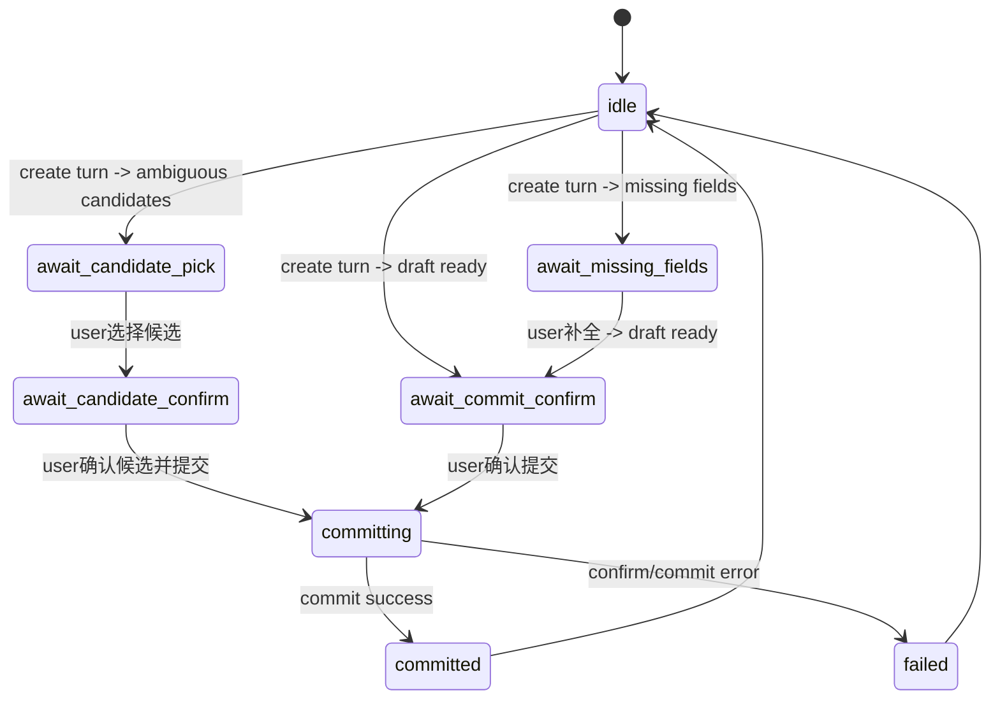

# DEV-PLAN-260：LibreChat 对话闭环自动执行重构方案（真实多轮补全/确认）

**状态**: 已完成（2026-03-06 04:39 CST）

> 实施与验收证据见：`docs/dev-records/dev-plan-260-execution-log.md`。

## 1. 背景与上下文（Context）
- **需求来源**: 当前明确目标为“100% 达成 Case 1~4 的对话闭环验收，不保留兼容快路径，不做无感迁移”。
- **现状痛点（来自已落地实现）**:
  1. [ ] 业务反馈主通道仍是 `assistant.flow.notice` 浮层（`internal/server/assistant_ui_proxy.go`、`apps/web/src/pages/assistant/LibreChatPage.tsx`）。
  2. [ ] 完整信息场景会自动推进 `create -> confirm -> commit`，缺少“先草案、后确认”回合（`apps/web/src/pages/assistant/LibreChatPage.tsx`、`apps/web/src/pages/assistant/AssistantPage.tsx`）。
  3. [ ] 多候选场景可“选候选后直接提交”，缺少“候选选择后二次确认”回合。
- **业务价值**:
  - 让用户在 LibreChat 对话内获得可审计、可中断、可确认的执行流程，消除“未显式确认即提交”的高风险体验。

## 2. 目标与非目标（Goals & Non-Goals）

### 2.1 核心目标（100% 达成，不缩水）
1. [ ] 在 `http://localhost:8080/app/assistant/librechat` 实现“对话优先”自动执行：补全、候选、确认、结果全部进入聊天消息流。
2. [ ] Case 2（完整信息）必须变更为：
   - 首轮仅 `create` 生成草案；
   - AI 输出“准备提交摘要 + 请确认”；
   - 用户确认后才执行 `confirm + commit`；
   - AI 输出提交成功回执。
3. [ ] Case 3（信息不全）必须变更为：
   - 先提示缺字段并进入等待补全；
   - 补全后重新生成草案并等待确认；
   - 确认后再提交。
4. [ ] Case 4（多候选）必须变更为：
   - 先输出编号候选列表并等待选择；
   - 用户选择后进入“候选二次确认”；
   - 二次确认后执行 `confirm + commit`。
5. [ ] 保持 One Door：写入仅走既有 `/internal/assistant/*`，不新增写入口。
6. [ ] `AssistantPage` 与 `LibreChatPage` 复用同一 FSM helper，禁止双份编排逻辑继续漂移。

### 2.2 非目标（Out of Scope）
1. [ ] 不新增数据库 schema/迁移/sqlc 改动。
2. [ ] 不引入 legacy 双链路、回退分支、兼容快路径。
3. [ ] 不改 LibreChat 上游仓库源码，仅在本仓代理注入脚本 + 前端编排收口。

### 2.3 工具链与门禁（SSOT 引用）
- **命中触发器**:
  - [ ] Go 代码（代理脚本注入与测试）
  - [ ] Web 代码（页面编排/FSM/helper/组件测试）
  - [ ] E2E（对话闭环 Case 2~4）
  - [ ] 文档（计划与执行记录）
- **执行入口（引用 SSOT，不复制脚本实现）**:
  - `AGENTS.md`
  - `docs/dev-plans/012-ci-quality-gates.md`
  - `Makefile`

## 3. 架构与关键决策（Architecture & Decisions）

### 3.1 架构图（Mermaid）
```mermaid
graph TD
    U[User in LibreChat] --> I[assistant-ui iframe]
    I -->|assistant.prompt.sync| P[AssistantPage/LibreChatPage Orchestrator]
    P -->|create/confirm/commit| A[/internal/assistant/*]
    A --> K[DB Kernel submit_*_event]
    P -->|assistant.flow.dialog| I
    I --> R[Dialog Stream Renderer in bridge.js]
```

### 3.2 ADR 摘要
- **ADR-260-01（选定）**: `assistant.flow.dialog` 成为业务闭环唯一消息协议；`assistant.flow.notice` 仅用于技术性提示（连接/调试）。
- **ADR-260-02（选定）**: 提交动作必须受 FSM 状态前置约束，确认词只在 `await_candidate_confirm|await_commit_confirm` 生效。
- **ADR-260-03（选定）**: 抽离共享 FSM helper，两个页面只保留 UI 壳差异，禁止编排复制。

## 4. 数据模型与约束（Data Model & Constraints）
> 无 DB 变更；本节定义前端运行态契约（TypeScript SSOT）。

### 4.1 前端运行态模型（新增）
```ts
interface DialogFlowState {
  phase:
    | 'idle'
    | 'await_missing_fields'
    | 'await_candidate_pick'
    | 'await_candidate_confirm'
    | 'await_commit_confirm'
    | 'committing'
    | 'committed'
    | 'failed'
  conversation_id: string
  turn_id: string
  pending_draft_summary: string
  missing_fields: string[]
  candidates: AssistantCandidateOption[]
  selected_candidate_id: string
}
```

### 4.2 运行不变量（必须满足）
1. [ ] `phase!=await_*_confirm` 时，确认词不得触发提交。
2. [ ] `pending_draft_summary` 为空时不得进入 `await_commit_confirm`。
3. [ ] `selected_candidate_id` 为空时不得进入 `await_candidate_confirm`。
4. [ ] 任意 `confirm/commit` 失败后必须转入 `failed` 并给出对话错误回执，禁止静默吞错。

## 5. 接口契约（API Contracts）

### 5.1 iframe -> 父页（保持）
1. [ ] `assistant.bridge.ready`
2. [ ] `assistant.prompt.sync`

### 5.2 父页 -> iframe（新增业务主协议）
1. [ ] `assistant.flow.dialog`
- **Payload 契约**:
```json
{
  "message_id": "dlg_20260305_001",
  "kind": "info|warning|success|error",
  "stage": "draft|missing_fields|candidate_list|candidate_confirm|commit_result|commit_failed",
  "text": "string",
  "meta": {
    "effective_date": "2026-01-01",
    "candidate_id": "SSC-2"
  }
}
```
2. [ ] `assistant.flow.notice` 降级为非业务提示；业务闭环禁止依赖该消息。

### 5.3 内部 Assistant API 调用序列（冻结）
- Case 2：`POST /conversations/:id/turns` ->（等待确认）-> `:confirm` -> `:commit`
- Case 3：`turns(首轮缺字段)` -> `turns(补全后草案)` -> `:confirm` -> `:commit`
- Case 4：`turns(候选列表)` ->（用户选候选）->（等待二次确认）-> `:confirm(candidate_id)` -> `:commit`

### 5.4 错误码映射（对话回执）
1. [ ] `missing_*` / `invalid_effective_date_format` -> 缺字段引导。
2. [ ] `candidate_confirmation_required` -> 候选确认引导。
3. [ ] `conversation_state_invalid|conversation_confirmation_required` -> 刷新会话 + 回执“状态已变化，请按当前提示继续”。
4. [ ] 其他错误 -> 明确失败原因（禁止泛化“提交失败”单句直出）。

## 6. 核心逻辑与算法（Business Logic & Algorithms）

### 6.1 状态机（FSM）


### 6.2 Case 2 算法（完整信息）
1. [ ] 首轮仅调用 `createAssistantTurn`。
2. [ ] 生成草案摘要（组织名、父组织、生效日、候选信息）。
3. [ ] 发送 `assistant.flow.dialog(stage=draft)` 并进入 `await_commit_confirm`。
4. [ ] 仅当下一轮命中确认词时，执行 `confirm + commit`。
5. [ ] 提交后发送 `stage=commit_result`。

### 6.3 Case 3 算法（缺字段补全）
1. [ ] 首轮 `validation_errors` 命中缺字段时，发送 `stage=missing_fields` 并进入 `await_missing_fields`。
2. [ ] 下一轮输入与现有意图草案合并（沿用 `extractIntentDraftFromText + mergeIntentDraft`）。
3. [ ] 补全成功后转 `await_commit_confirm`，等待确认再提交。

### 6.4 Case 4 算法（多候选）
1. [ ] 首轮命中多候选时，发送固定格式候选列表（编号+名称+编码+路径），进入 `await_candidate_pick`。
2. [ ] 用户回复“选第N个/编码”后，仅记录 `selected_candidate_id` 并发送 `stage=candidate_confirm`。
3. [ ] 用户再次确认后，执行 `confirm(candidate_id)+commit`。

### 6.5 确认词识别约束
1. [ ] 只允许精确短语：`确认执行|确认提交|立即执行|同意执行|yes|ok`（可扩展但必须加测试）。
2. [ ] 任意“普通叙述句包含执行/提交字样”不得触发提交。

### 6.6 对话渲染算法（bridge.js）
1. [ ] 新增 `assistant.flow.dialog` 监听与渲染函数，消息插入聊天流容器而非右下角浮层。
2. [ ] 通过 `MutationObserver` 等待聊天容器就绪；未就绪时排队，不丢消息。
3. [ ] 渲染失败时 fail-closed：父页禁止继续 `confirm/commit`，并输出技术错误回执。

## 7. 安全与鉴权（Security & Authz）
1. [ ] 继续执行 `origin + channel + nonce` 三元校验（`assistantMessageBridge.ts`）。
2. [ ] 继续执行 `/assistant-ui/**` 路径与 header/cookie 边界策略（`assistant_ui_proxy.go`）。
3. [ ] 保持租户隔离：会话创建、回合推进、提交均沿用既有租户上下文，不新增旁路。
4. [ ] 禁止新增任何直接写 OrgUnit 的前端/代理通道。

## 8. 实施拆分（可直接开发）

### 8.1 M1：契约冻结与共享 FSM helper
1. [ ] 新增 `apps/web/src/pages/assistant/assistantDialogFlow.ts`（状态、事件、reducer、格式化）。
2. [ ] 新增 `apps/web/src/pages/assistant/assistantDialogFlow.test.ts`（状态迁移全覆盖）。
3. [ ] `assistantAutoRun.ts` 仅保留文本抽取/候选解析/确认词基础能力。

### 8.2 M2：Bridge 对话消息渲染
1. [ ] 改造 `internal/server/assistant_ui_proxy.go` 注入脚本：支持 `assistant.flow.dialog` 渲染聊天消息。
2. [ ] `internal/server/assistant_ui_proxy_test.go` 新增断言：脚本包含 `assistant.flow.dialog` 与聊天流渲染逻辑关键标记。

### 8.3 M3：页面编排收口
1. [ ] 改造 `apps/web/src/pages/assistant/LibreChatPage.tsx`：切换到 FSM 驱动，移除“生成后自动提交”。
2. [ ] 改造 `apps/web/src/pages/assistant/AssistantPage.tsx`：与 `LibreChatPage` 共用同一 helper。
3. [ ] 禁止业务成功/失败只走页面 Alert；业务回执必须发 `assistant.flow.dialog`。

### 8.4 M4：测试与证据闭环
1. [ ] 更新 `apps/web/src/pages/assistant/LibreChatPage.test.tsx` 覆盖 Case 2~4 新回合语义。
2. [ ] 更新 `apps/web/src/pages/assistant/AssistantPage.test.tsx` 断言双页行为一致。
3. [ ] 更新 `apps/web/src/pages/assistant/assistantAutoRun.test.ts`（确认词与候选解析边界）。
4. [ ] 新增/改造 `e2e/tests/tp260-librechat-dialog-closure.spec.js`（Case 1~4 真实对话闭环）。
5. [ ] 新增执行记录：`docs/dev-records/dev-plan-260-execution-log.md`。

## 9. 测试与验收标准（Acceptance Criteria）

### 9.1 冻结用例（必须 100% 通过）
> 统一入口：`http://localhost:8080/app/assistant/librechat`

1. [ ] **Case 1 通道连通**：出现连接文案，页面可输入可发送。
2. [ ] **Case 2 完整信息**：首轮仅出草案；第二轮确认后才提交；回执含 `effective_date=2026-01-01`。
3. [ ] **Case 3 缺字段补全**：首轮缺字段提示；补全后草案确认；第三轮确认提交成功。
4. [ ] **Case 4 多候选**：首轮候选列表；第二轮选择；第三轮二次确认并提交成功。

### 9.2 负向回归（必须）
1. [ ] 未进入确认状态时，`确认执行` 不得触发提交。
2. [ ] 普通句子（如“继续执行排查”）不得触发提交。
3. [ ] 候选未选中时不得提交。
4. [ ] 任一业务闭环若仅通过浮层可见，判定失败。

### 9.3 覆盖率与门禁
1. [ ] 覆盖率口径沿用仓库 SSOT 门禁，不新增豁免。
2. [ ] 本计划相关测试全量通过后方可更新状态。

## 10. 运维与故障处置（Greenfield）
1. [ ] 不引入 feature flag/双链路。
2. [ ] 发生异常时遵循 fail-closed：停止自动推进，要求用户按最新对话提示继续。
3. [ ] 以前向修复为主，不允许回退到旧交互闭环。

## 11. 停止线（Stopline）
1. [ ] 任一业务闭环仍依赖 `assistant.flow.notice` 或页面 Alert 才能完成 -> 禁止合并。
2. [ ] 任一 Case 存在“未确认即提交” -> 禁止合并。
3. [ ] `AssistantPage` 与 `LibreChatPage` 行为不一致 -> 禁止合并。
4. [ ] Case 1~4 任一未通过 -> 禁止将状态改为“已完成”。

## 12. 交付物（Deliverables）
1. [ ] 本文档：`docs/dev-plans/260-librechat-conversation-first-auto-execution-plan.md`（按 001 细化后的实施契约）。
2. [ ] 代码改造：
   - `internal/server/assistant_ui_proxy.go`
   - `apps/web/src/pages/assistant/assistantDialogFlow.ts`（新增）
   - `apps/web/src/pages/assistant/AssistantPage.tsx`
   - `apps/web/src/pages/assistant/LibreChatPage.tsx`
   - `apps/web/src/pages/assistant/assistantAutoRun.ts`
3. [ ] 测试改造：
   - `internal/server/assistant_ui_proxy_test.go`
   - `apps/web/src/pages/assistant/assistantDialogFlow.test.ts`（新增）
   - `apps/web/src/pages/assistant/AssistantPage.test.tsx`
   - `apps/web/src/pages/assistant/LibreChatPage.test.tsx`
   - `e2e/tests/tp260-librechat-dialog-closure.spec.js`（新增）
4. [ ] 执行证据：`docs/dev-records/dev-plan-260-execution-log.md`。
