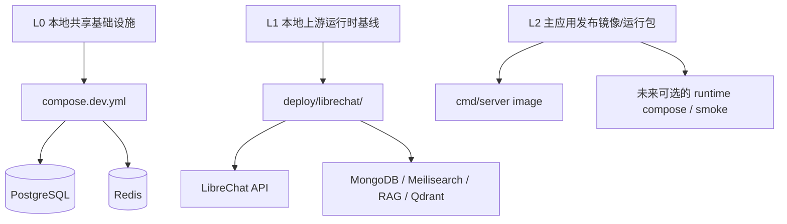

# DEV-PLAN-270：项目容器部署分层检讨与收敛方案

**状态**: 规划中（2026-03-06 19:43 CST）

## 1. 背景与上下文 (Context)
- **需求来源**:
  - 用户对“本项目的容器部署方式进行检讨”的明确要求。
  - 当前仓库已形成两套容器相关资产，但语义边界与目标态仍未冻结：
    1. 根目录 `compose.dev.yml`：本地共享基础设施（PostgreSQL / Redis）。
    2. `deploy/librechat/`：LibreChat 上游运行基线（api / mongodb / meilisearch / rag_api / vectordb）。
- **当前痛点**:
  1. 当前方案本质上是“半容器化”：主应用与 SuperAdmin 仍以宿主机 `go run` 运行，而非容器运行；仓库内也没有面向主应用的正式镜像/发布编排基线。
  2. “开发基础设施”“上游运行时基线”“正式部署/发布形态”三层概念尚未分离，容易把本地运行基线误读为正式部署方案。
  3. LibreChat 运行基线虽然已有 `versions.lock.yaml` 与健康检查，但版本冻结、健康判定、外部 upstream 接受策略、env 边界、卷权限清理等仍存在失真或宽松语义。
  4. 容器资产尚未形成清晰的“谁属于本地开发、谁属于上游运行、谁属于未来发布镜像”的目录契约与门禁契约。
- **业务价值**:
  - 先把“现有容器资产究竟是什么”说清楚，再决定“未来需要什么”，避免把 Greenfield 初期的本地运行便利性误升级为长期运维负担。
  - 为后续主应用镜像化、CI 构建可复现、运行态诊断真实化提供单一事实源，而不提前引入 Kubernetes / Helm / 复杂运维平台。

## 2. 目标与非目标 (Goals & Non-Goals)

### 2.1 核心目标
1. [ ] 冻结项目容器部署的三层语义：**本地共享基础设施**、**本地上游运行时基线**、**未来发布镜像/运行包**。
2. [ ] 明确现有资产的职责边界，收敛“容器部署”这一说法，避免把 `compose.dev.yml` 与 `deploy/librechat/` 误称为正式部署方案。
3. [ ] 为现有 LibreChat runtime 收敛五个问题：版本固定真实性、健康检查真实性、env 入口边界、卷/权限策略、清理与恢复边界。
4. [ ] 定义主应用（至少 `cmd/server`）未来镜像化的最小契约，使仓库从“只有本地 compose”演进到“具备可构建的发布包”，但不强迫日常开发立即全面容器化。
5. [ ] 将后续实现所需的目录、门禁、验收与证据记录口径一次性冻结，避免后续在多个计划中重复发散。

### 2.2 非目标 (Out of Scope)
1. [ ] 本计划不引入 Kubernetes、Helm、ArgoCD、Ingress Controller 等正式集群运维栈。
2. [ ] 本计划不要求把当前日常开发入口 `make dev-server` / `go run ./cmd/server` 立即替换为容器内开发。
3. [ ] 本计划不新增外部缓存、中间件、密钥管理平台或监控平台；继续遵守仓库“避免过度运维”的原则。
4. [ ] 本计划不改变多 worktree 共享本地基础设施的原则，不为每个 worktree 各起一套 PostgreSQL / Redis。
5. [ ] 本计划不直接实施生产发布；只定义面向后续实施的容器化收敛路径与契约。

## 2.3 工具链与门禁（SSOT 引用）
> 本计划不复制命令矩阵；工具链与门禁以 SSOT 为准。

- **触发器清单（本计划预期命中）**:
  - [X] 文档门禁
  - [ ] Go 代码（后续若实现 runtime status / gate / image build helper）
  - [ ] Routing（后续若调整 `/internal/assistant/runtime-status` 契约）
  - [ ] E2E（后续若新增容器化 smoke / UI 运行态验收）
- **SSOT 链接**:
  - `AGENTS.md`
  - `Makefile`
  - `.github/workflows/quality-gates.yml`
  - `docs/dev-plans/012-ci-quality-gates.md`
  - `docs/dev-plans/014-parallel-worktrees-local-dev-guide.md`
  - `docs/dev-plans/232-librechat-official-runtime-baseline-plan.md`
  - `docs/dev-plans/239d-ubuntu-local-development-environment-bootstrap-plan.md`

## 3. 现状评估结论 (As-Is Assessment)

### 3.1 已存在的容器资产
1. [ ] **共享开发基础设施**：根目录 `compose.dev.yml` 当前仅管理 PostgreSQL / Redis，服务应用本身不在该 compose 内运行。
2. [ ] **Assistant 上游运行基线**：`deploy/librechat/` 当前管理 LibreChat 及其依赖，属于“本仓内可复现运行的上游基线”，不是主应用的发布包。
3. [ ] **主应用发布镜像**：当前缺失。仓库没有主应用 `Dockerfile`、镜像构建门禁、发布编排文件或镜像发布工作流。

### 3.2 本次检讨确认的问题
1. [ ] **分层命名不清**：当前“容器部署方式”容易同时指代 dev infra、LibreChat runtime 与未来发布形态，导致讨论口径漂移。
2. [ ] **版本冻结失真**：部分镜像仍按 tag 引用，`versions.lock.yaml` 中部分 digest 仍是占位值，尚未形成“compose 真值 + lock 审计”的闭环。
3. [ ] **健康状态过宽**：当外部 upstream 可达但本地 compose 容器不可见时，当前逻辑仍可能输出 `healthy`，不利于识别“本地运行基线已失真”。
4. [ ] **env 边界不清**：主应用以根目录 `.env` 体系运行，LibreChat runtime 以 `deploy/librechat/.env` 运行，但脚本仍保留模板回退与隐式读取路径，容易造成入口歧义。
5. [ ] **卷与权限策略不稳**：LibreChat 依赖 bind mount 到仓库内 `.local/` 路径，发生 root-owned 文件时仍需额外 helper 容器清理，表明权限策略尚未根因收敛。
6. [ ] **正式发布能力缺失**：当前没有主应用镜像化契约，因此无法把“本地可跑”自然推进到“可构建、可分发、可回滚”的发布态。

## 4. 目标态分层模型 (Target Deployment Layers)

### 4.1 三层模型（冻结）

### 4.2 三层职责说明
1. [ ] **L0：本地共享基础设施**
   - 仅服务开发、测试、迁移与多 worktree 共享。
   - 明确不承载主应用容器、不承载 LibreChat 上游运行时。
2. [ ] **L1：本地上游运行时基线**
   - 仅承载本仓需要复用的 LibreChat 上游运行事实。
   - 目标是“本地可复现 + 可诊断 + 可恢复”，不是正式部署平台。
3. [ ] **L2：主应用发布镜像/运行包**
   - 仅定义未来主应用镜像化与 smoke 运行基线。
   - 第一阶段只覆盖 `cmd/server`，不把 `cmd/superadmin` 强行纳入首批镜像范围。

## 5. 关键设计决策 (ADR 摘要)

### 5.1 ADR-270-01：采用三层分治，而不是“一份 compose 解决所有容器问题”
- **选项 A**：将 dev infra、LibreChat runtime、主应用发布全部塞进单一 compose。
  - 缺点：职责混杂；多 worktree 共享 infra 会与上游运行基线/发布态纠缠；极易演变为“本地方便但语义混乱”的超级脚本。
- **选项 B（选定）**：分为 L0 / L1 / L2 三层，各自冻结边界与入口。
  - 优点：与当前现实一致，且便于逐层完善，不要求一次性全面容器化。

### 5.2 ADR-270-02：当前阶段明确不引入 Kubernetes / Helm
- **选项 A**：立即补齐 K8s / Helm，直接设计正式部署形态。
  - 缺点：与仓库“早期阶段避免过度运维”的原则冲突，且会放大当前主应用尚未镜像化的前置缺口。
- **选项 B（选定）**：先把本地运行基线与未来镜像契约收敛，再视发布阶段需求单独立计划。

### 5.3 ADR-270-03：健康检查必须忠实表达“本地基线状态”，外部 upstream 仅作显式模式
- **选项 A**：只要 3080 可达就算健康。
  - 缺点：会掩盖本地 compose 容器缺失、挂载漂移、版本不一致等问题。
- **选项 B（选定）**：状态输出必须区分“本地 compose 正常”与“外部托管 upstream 可达”；不得把后者直接伪装成前者。

### 5.4 ADR-270-04：版本锁定以“运行资产真值”为准，lock 文件只承担审计与门禁职责
- **选项 A**：lock 文件记录想要的版本，compose 继续写 tag。
  - 缺点：审计值与实际运行值分离，无法证明可复现。
- **选项 B（选定）**：compose / Dockerfile / build 输入必须直接使用真实版本；`versions.lock.yaml` 只做镜像元数据映射、回滚与审计，并由脚本校验一致性。

### 5.5 ADR-270-05：主应用镜像化从 `cmd/server` 开始，保留宿主机开发入口
- **选项 A**：要求所有日常开发都迁移到容器内。
  - 缺点：反馈慢、调试复杂、与当前 Greenfield 节奏不匹配。
- **选项 B（选定）**：保留宿主机 `go run` 作为开发入口，同时补齐 `cmd/server` 的发布镜像与 smoke 契约。

## 6. 实施范围与交付物 (Deliverables)

### 6.1 交付物冻结
1. [ ] 一份完整的分层容器化契约文档（本计划）。
2. [ ] `compose.dev.yml` 的边界与版本收敛方案（Redis 版本固定、健康检查、职责说明）。
3. [ ] `deploy/librechat/` 的运行真值收敛方案（真实 digest、状态契约、env 入口、卷权限策略）。
4. [ ] 主应用首个镜像化交付面定义（`cmd/server` 的 Docker build 契约、最小 smoke 运行方式、目录与 README 约定）。
5. [ ] 对应门禁与证据记录入口（文档、脚本、CI、dev-record）。

### 6.2 本计划后续实施建议拆分
1. [ ] **270A**：L0 本地共享基础设施收敛。
2. [ ] **270B**：L1 LibreChat runtime 真值与诊断收敛。
3. [ ] **270C**：L2 主应用镜像化最小发布包。
4. [ ] **270D**：容器门禁与证据闭环。

## 7. 实施步骤 (Milestones)

### 7.1 M1：术语、目录与边界冻结
1. [ ] 在相关文档中统一三层命名：L0 本地共享基础设施、L1 本地上游运行时基线、L2 主应用发布镜像/运行包。
2. [ ] 明确 `compose.dev.yml` 仅负责 PostgreSQL / Redis，不得在无新计划前提下向其中塞入主应用服务或 LibreChat 依赖。
3. [ ] 明确 `deploy/librechat/` 仅负责 LibreChat 上游运行基线，不再被表述为“项目正式容器部署”。
4. [ ] 冻结主应用首批镜像化范围为 `cmd/server`，`cmd/superadmin` 暂不纳入首批交付。

### 7.2 M2：L0 共享基础设施收敛
1. [ ] 固定 `compose.dev.yml` 中 Redis 版本，禁止 `latest`。
2. [ ] 为 Redis 增加最小健康检查，补齐与 PostgreSQL 一致的 readiness 语义。
3. [ ] 将“共享 infra 不等于正式部署”的说明补入对应文档，避免多 worktree 使用者误判。
4. [ ] 若需新增容器服务，必须先说明其属于 L0 / L1 / L2 的哪一层，再进入实施。

### 7.3 M3：L1 LibreChat runtime 真值收敛
1. [ ] 把运行资产中的镜像引用收敛为真实版本真值；禁止 lock 文件占位 digest 长期存在。
2. [ ] 调整 runtime-status 契约，显式区分：
   - 本地 compose 正常管理；
   - 外部 upstream 可达但非本地管理；
   - 不可用 / 漂移 / 挂载异常。
3. [ ] 明确 `deploy/librechat/.env` 是唯一运行态 env 入口；`.env.example` 仅作为模板，不再作为隐式运行回退。
4. [ ] 对卷权限策略做逐服务评估：优先采用显式 UID/GID 或可验证的可写策略；helper 容器清理仅允许作为过渡恢复手段，不作为长期完成定义。
5. [ ] 为“外部 upstream 模式”增加显式开关与文档说明，默认不再把其当成本地基线健康通过。

### 7.4 M4：L2 主应用最小镜像化契约
1. [ ] 定义 `cmd/server` 的 Docker build 输入、运行用户、端口、健康检查与必要环境变量契约。
2. [ ] 冻结首批镜像的用途为“构建可复现 + smoke 可运行”，而不是立即替代本地 `go run` 开发体验。
3. [ ] 定义主应用容器 smoke 入口（可为单独 compose 或简单 `docker run` 契约），确保 `/health` 可验证。
4. [ ] 明确 `cmd/superadmin` 是否单独立后续计划，不与 `cmd/server` 首批镜像化混做。

### 7.5 M5：门禁与证据闭环
1. [ ] 增加“禁止 `latest` / lock 与运行资产不一致”的自动检查。
2. [ ] 将容器相关实施证据写入 `docs/dev-records/`，包括实际版本、启动验证、状态输出、恢复流程与 smoke 结果。
3. [ ] 对 docs、脚本、CI 入口的术语进行一次收敛，避免出现“本地基线”“运行时”“发布包”混用。

## 8. 验收标准 (Acceptance Criteria)
1. [ ] 仓库内关于容器的叙述不再混淆：任何资产都能明确归属 L0 / L1 / L2。
2. [ ] `compose.dev.yml` 中不再存在 `latest`，且 PostgreSQL / Redis 都具备最小健康检查与职责说明。
3. [ ] LibreChat runtime 的镜像版本能被真实审计：运行资产与 lock 元数据一致，不再依赖占位 digest。
4. [ ] `assistant-runtime-status` 不再把“外部 upstream 可达”伪装为“本地 compose 健康”；二者必须可机读区分。
5. [ ] LibreChat runtime 的 env 入口与数据目录入口均为单一事实源，不再存在模板隐式回退导致的运行歧义。
6. [ ] 主应用至少形成 `cmd/server` 的最小镜像化契约，可用于后续独立实施与 smoke。
7. [ ] 本计划涉及的新增/更新文档已纳入 `AGENTS.md` 文档地图，且 `make check doc` 通过。

## 9. 测试与覆盖率 (Coverage & Validation)
- **覆盖率口径**:
  - 本计划当前为文档契约计划，创建阶段仅命中文档门禁，不以代码覆盖率作为完成判定。
  - 后续若实施 M2 / M3 / M4 并修改 Go / shell / CI 脚本，则按仓库现行 SSOT 执行对应门禁与测试。
- **统计范围**:
  - 文档阶段：`docs/dev-plans/`、`AGENTS.md`。
  - 实施阶段：以实际改动范围命中的 Go、脚本、路由与 E2E 为准，不在本计划复制整套矩阵。
- **目标阈值**:
  - 文档阶段：`make check doc` 通过。
  - 实施阶段：遵循 `AGENTS.md` 与 `docs/dev-plans/012-ci-quality-gates.md`，不以降低门禁替代设计收敛。
- **证据记录**:
  - 本计划实施时，在 `docs/dev-records/` 新增对应执行日志，记录时间、命令、结果与运行模式（L0 / L1 / L2）。

## 10. 风险与处置 (Risks & Mitigations)
1. [ ] **过度设计风险**：若直接跳到 K8s / Helm，会与当前阶段不匹配。处置：严格限制在三层收敛与最小镜像化契约内。
2. [ ] **上游漂移风险**：LibreChat upstream 升级可能改变镜像、env 或依赖。处置：以运行资产真值 + lock 审计 + 回归证据收口。
3. [ ] **共享 infra 误操作风险**：多 worktree 可能把 L0 误当独占资源。处置：继续遵守 `DEV-PLAN-014` 的共享 infra 原则，并在文档中明确 `dev-reset` 风险。
4. [ ] **权限/卷残留风险**：bind mount 残留 root-owned 文件会放大恢复成本。处置：优先根因收敛，helper 清理仅作过渡方案并要求文档化。
5. [ ] **术语回流风险**：后续新计划可能重新混用“容器部署”“运行基线”“发布包”。处置：以本计划冻结术语，并在文档评审中阻断漂移。

## 11. 依赖与后续计划 (Dependencies)
1. [ ] 本计划承接：`DEV-PLAN-014`、`DEV-PLAN-232`、`DEV-PLAN-238`、`DEV-PLAN-239`、`DEV-PLAN-239D`。
2. [ ] 若启动 L2 主应用镜像化，应新增/落地本计划拆分出的 270C 子计划，并补充对应执行记录。
3. [ ] 若未来确实进入正式发布/集群部署阶段，应在本计划完成后另起新计划，不得直接在 270 内追加 K8s/Helm 细节导致范围膨胀。
