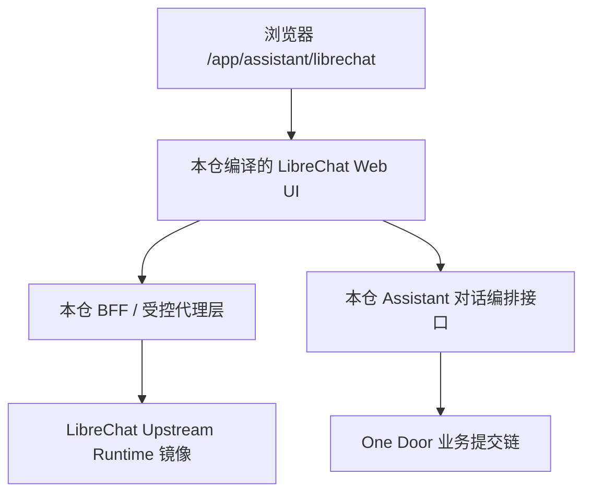

# DEV-PLAN-280：LibreChat Web UI 源码纳管与 Runtime 分层复用实施方案

**状态**: 规划中（2026-03-07 23:55 CST）

## 1. 背景与重开原因
- `DEV-PLAN-230` 将 LibreChat 集成冻结为“官方运行基线复用 + 本仓边界适配”，这一决策对运行态落地是正确起点；但随着 `DEV-PLAN-260` 将目标提升为“真实业务对话闭环”，现有模式的能力边界已出现结构性错位。
- 当前项目主要复用了 **LibreChat 官方已编译 runtime**：`deploy/librechat/` 负责上游镜像与 compose 基线；`/assistant-ui/*` 通过反向代理接入上游页面；`/app/assistant/librechat` 再通过 iframe + bridge 与本仓业务链路拼接。
- 这种“黑盒 runtime + 外层桥接编排”的方式，在以下方面已成为 `260` 的主要阻力：
  1. [ ] 发送链路依赖 DOM 拦截与 `postMessage`，不是消息管线内生控制。
  2. [ ] 业务回执依赖注入容器/外挂流，难以严格等同于官方 assistant 气泡体系。
  3. [ ] 业务 FSM 主要停留在本仓前端 helper，未真正进入官方 UI 的消息生命周期。
  4. [ ] 一旦上游 DOM、按钮、表单、消息列表结构变化，`260/266` 很容易回归退化。
- 因此本计划提出新的分层路线：
  - **保留上游 runtime 镜像复用**；
  - **仅将 LibreChat Web UI 源码 vendoring/patch 到本仓编译**，拿到发送、消息渲染、会话 UI 的源码级控制；
  - **后端 runtime、MCP、Actions、Allowlist、模型配置等继续尽量复用上游能力**。

## 2. 目标与非目标

### 2.1 核心目标
1. [ ] 保持 `DEV-PLAN-232/234/235/237` 的上游 runtime 复用原则：LibreChat API、MongoDB、Meilisearch、RAG API、VectorDB 仍以上游镜像/compose 为运行事实源。
2. [ ] 将 LibreChat **Web UI 源码**纳入本仓，并由本仓统一构建、打包、发布与回归验证。
3. [ ] 将当前依赖 DOM 拦截/注入的发送与回写逻辑，替换为 **源码级发送管线接管 + 源码级消息渲染接入**。
4. [ ] 让 `260` 所需的缺字段补全、多候选确认、提交确认、成功/失败回执，都落到 **官方消息列表/官方 assistant 气泡体系** 内，而非外挂容器。
5. [ ] 将 `/app/assistant/librechat` 收敛为单一真实入口，不再依赖 iframe 套壳作为正式交互承载面。
6. [ ] 保持 One Door：任何业务写入仍只允许经本仓 `/internal/assistant/*` 与业务提交链路完成，绝不把可写业务能力下放到上游 runtime。
7. [ ] 明确业务事实源：业务真相以本仓 `conversation_id/turn_id/request_id/trace_id` 与其状态流转为准；官方消息树只是唯一用户可见渲染面，不得反客为主成为业务事实源。
8. [ ] 明确前端降权：vendored UI 只消费后端返回的 `phase/missing_fields/candidates/pending_draft_summary/selected_candidate_id/commit_reply/error_code` DTO，不得在页面 helper / adapter 内重算业务 FSM、候选裁决或提交约束。

### 2.2 非目标
1. [ ] **不** vendoring LibreChat 后端 Node 服务，不在本计划中接管上游 API/runtime 实现。
2. [ ] **不** 自建第二套 MCP/Actions/模型配置中心；继续遵循 `DEV-PLAN-233/234` 的“上游主源 + 本仓校验”原则。
3. [ ] **不** 在本计划中改写 `260` 的业务语义本身；`280` 只解决“承载面与控制点层级错位”，不替代 `260` 主计划。
4. [ ] **不** 引入 legacy 双链路；本项目仍处于早期阶段，本计划默认采用直接切换（cutover-first），不为旧桥接链路保留长期灰度、兼容窗口或双入口存活期。
5. [ ] **不** 为照顾历史实现而保留 iframe、bridge、HTML 注入、外挂消息流、旧工作台交互等高维护负担。

## 2.1 工具链与门禁（SSOT 引用）
- **本计划命中触发器**：
  - [X] 文档变更（`make check doc`）
  - [ ] Go 代码（网关/静态资源服务/代理收口）
  - [ ] MUI / Web UI / presentation assets
  - [ ] E2E（官方 UI 真实回归）
  - [ ] Routing（入口切换、旧路由退役）
  - [ ] Assistant 配置单主源 / No Legacy / 错误提示门禁
- **SSOT 入口**：`AGENTS.md`、`Makefile`、`.github/workflows/quality-gates.yml`、`docs/dev-plans/012-ci-quality-gates.md`

## 3. 问题陈述：为什么 230 路线不足以支撑 260

### 3.1 当前模式的本质
```mermaid
graph TD
    A[浏览器 /app/assistant/librechat] --> B[本仓页面 iframe]
    B --> C[/assistant-ui/* 反向代理]
    C --> D[LibreChat Upstream Runtime]
    A --> E[本仓 helper / bridge / FSM]
    E --> F[/internal/assistant/*]
    E --> B
```

当前结构的问题不在于“能否跑起来”，而在于：
1. [ ] **消息发送控制点过晚**：要到 DOM 事件层才能拦截“官方发送”。
2. [ ] **消息落点非官方内生**：即使视觉上在聊天区附近，也可能仍是注入式容器。
3. [ ] **业务状态与 UI 状态割裂**：`conversation_id/turn_id/request_id` 与官方前端消息实体不是同一套 store。
4. [ ] **回归成本高**：上游 UI 结构漂移时，本仓要先修 DOM 兼容，再谈业务闭环。

### 3.2 对 `260` 的直接影响
1. [ ] 无法从架构层保证“同轮唯一 assistant 回复”；更多依赖 E2E 证明“暂时没坏”。
2. [ ] 无法从源码级保证“官方原始发送未发出”；更多依赖桥接统计与外围证据。
3. [ ] `Case 2~4` 的业务 FSM 更像“外挂 orchestrator 驱动的结果贴回”，而不是官方聊天消息生命周期的一部分。
4. [ ] `266` 的“气泡内回写”难以硬化为长期稳定契约，容易在上游升级时回退为外挂流。

## 4. 新分层原则（280 目标态）

### 4.1 总体分层


### 4.2 分层冻结
| 层 | 所有权 | 复用策略 | 说明 |
| --- | --- | --- | --- |
| LibreChat runtime（api/mongo/meili/rag/vectordb） | Upstream + 本仓部署封装 | 继续复用 | 仍由 `deploy/librechat/` 管理 |
| LibreChat Web UI 源码 | 本仓纳管 | 新增纳管 | 进入本仓构建链，允许 patch |
| 发送动作与消息渲染 | 本仓 patch | 源码级接管 | 禁止继续依赖 DOM 劫持 |
| 业务 FSM 与确认语义 | 本仓 | 与 `260` 对齐 | 进入正式 message pipeline，而非外挂 helper |
| 业务事实源（conversation/turn/request/trace） | 本仓持久化与审计层 | `223 + 260` | 持久化会话/回合/状态转移审计 | 官方消息树只负责渲染，不得成为业务真相 |
| MCP / Actions / Allowlist / 模型配置 | Upstream 主源 + 本仓校验 | 继续复用 | 不建设第二配置中心 |

## 5. 关键设计决策（ADR 摘要）

### ADR-280-01：保留上游 runtime 镜像复用（选定）
- 选项 A：runtime 与 Web UI 全部 vendoring。缺点：fork 面过大，升级成本过高。
- 选项 B（选定）：runtime 继续复用官方镜像；只在 Web UI 层拿回源码控制权。

### ADR-280-02：只纳管 LibreChat Web UI，而非整个上游仓库（选定）
- 选项 A：完整 vendoring LibreChat monorepo。缺点：Node backend、worker、infra 一并进入本仓，责任面失控。
- 选项 B（选定）：只纳管 Web UI 必需源码/构建资产，并保留对上游 runtime 的 API 兼容。

### ADR-280-03：`/app/assistant/librechat` 直接承载官方 UI，不再以 iframe 作为正式入口（选定）
- 选项 A：继续 iframe，仅把桥逻辑改成更深 patch。缺点：消息流仍跨窗口，状态仍然分裂。
- 选项 B（选定）：直接以本仓编译的官方 UI 页面作为正式承载面；若需保留 `/assistant-ui/*`，仅允许作为历史别名/调试入口；具体对外行为由 `DEV-PLAN-283` 冻结。

### ADR-280-04：发送与回执必须进入源码级消息管线（选定）
- 选项 A：继续 DOM 事件 `preventDefault` + `postMessage`。缺点：脆弱、不可维护。
- 选项 B（选定）：在 vendored UI 的发送 action / store / renderer 内接入本仓业务语义，确保消息实体是第一类对象。

### ADR-280-05：业务回执必须渲染为“官方 assistant message”，禁止外挂容器（选定）
- 选项 A：继续向 DOM 追加 bridge stream。缺点：违反 `260/266` 的长期目标。
- 选项 B（选定）：本仓生成的草案、缺字段、多候选、成功/失败回执都进入官方消息列表的数据模型与组件树。

### ADR-280-06：patch 必须显式化与可升级（选定）
- 选项 A：直接在 vendored 源码里散改。缺点：升级不可审计。
- 选项 B（选定）：保留上游来源信息、patch 清单、版本锁与回归清单，形成“可重复升级”的 patch stack。

### ADR-280-07：业务事实源以后端会话/回合为准（选定）
- 选项 A：以官方前端消息树为事实源。缺点：会把 UI 状态与业务状态混同，无法保证 `223/260` 的事务与审计语义。
- 选项 B（选定）：以本仓 `conversation/turn/request/trace` 为唯一业务真相；官方消息树只承担唯一用户可见渲染职责。

### ADR-280-08：前端降权，只消费 DTO（选定）
- 选项 A：继续让页面 helper / adapter 承担候选判断、确认词语义与提交前置校验。缺点：会把旧的“DOM hack”升级成“源码 patch hack”。
- 选项 B（选定）：业务 FSM、候选裁决、确认约束以后端为 SSOT；vendored UI 只消费后端返回的 `phase/missing_fields/candidates/pending_draft_summary/selected_candidate_id/commit_reply/error_code` DTO 并负责渲染。

## 6. 仓库布局与资产模型（目标态）

### 6.1 目录建议
1. [ ] `third_party/librechat-web/`：上游 Web UI 源码快照（只纳管必要部分）。
2. [ ] `third_party/librechat-web/UPSTREAM.yaml`：记录来源仓库、commit/tag、导入时间、回滚基线。
3. [ ] `third_party/librechat-web/patches/`：本仓 patch 清单，按主题拆分（send-pipeline / message-render / auth-shell / assistant-adapter）。
4. [ ] `scripts/librechat-web/`：同步、校验、构建、升级辅助脚本。
5. [ ] `internal/server/assets/librechat-web/`：构建产物归档路径（已由 `DEV-PLAN-281` 冻结）。

### 6.2 资产约束
1. [ ] vendored UI 必须有单一来源元数据，不得出现“手抄文件 + 无来源”的隐式纳管。
2. [ ] patch 必须可枚举、可审计、可在升级时逐个回放与冲突处理。
3. [ ] 本仓不直接编辑上游构建产物；所有变更都应回到 vendored 源码或 patch 层。

## 7. 核心技术方案

### 7.0 业务事实源与前端职责冻结
1. [ ] 业务真相固定为本仓持久化的 `conversation_id/turn_id/request_id/trace_id + phase + 审计状态转移`；官方消息树不是业务真相，只是唯一用户可见渲染面。
2. [ ] vendored UI 只能消费后端 DTO（如 `phase/missing_fields/candidates/pending_draft_summary/selected_candidate_id/commit_reply/error_code`），不得在前端 helper 中重新计算候选解析、确认判定、提交约束或状态推进规则。
3. [ ] 若前端需要临时 adapter，只能做展示层归一、事件分发与协议适配，不得承载业务判定。
4. [ ] `223/260` 是业务事实源与业务 FSM 的 SSOT；`280` 负责承载面与控制点收口，不得与其冲突。

### 7.1 UI 承载面收口
1. [ ] `/app/assistant/librechat` 改为直接加载本仓构建的 vendored LibreChat Web UI。
2. [ ] `/assistant-ui/*` 若保留，只能作为历史别名或调试入口，不再作为 iframe 套壳的正式承载面；正式静态资源前缀由 `DEV-PLAN-283` 冻结，且不得依赖 `/assistant-ui/*` 代理。
3. [ ] 迁移完成后，`apps/web/src/pages/assistant/LibreChatPage.tsx` 不再承担业务桥接 orchestrator 角色，只保留必要入口外壳或直接退役。

### 7.2 发送链路接管
1. [ ] 在 vendored UI 的发送 action / composer 提交路径中加入本仓 adapter：
   - 识别用户输入；
   - 将业务相关输入转发至本仓 `Assistant` 对话接口；
   - 禁止官方原始发送与本仓业务发送并行发出。
2. [ ] “是否进入本仓业务链路”必须在源码级决策，不再依赖按钮文本、表单 DOM 或跨窗口事件拦截。
3. [ ] 若该轮属于普通聊天而非业务闭环请求，可按明确规则转发至上游原生模型聊天；但该规则必须受 `260/263/264/265` 与单链路策略约束。

### 7.3 消息渲染接管
1. [ ] 缺字段提示、多候选列表、候选确认、提交确认、成功/失败回执，都必须构造为官方消息列表中的 assistant message 实体。
2. [ ] 这些消息实体所承载的业务语义必须来自后端 DTO 与持久化状态，不得由前端根据文本或局部上下文自行推断。
2. [ ] 官方 UI 组件应直接消费这些消息实体，不得再通过 `document.createElement(...)` 方式注入额外流。
3. [ ] 每条业务回执都必须带上 `conversation_id/turn_id/request_id/trace_id` 的可追溯元数据，并能与唯一 assistant message 一一对应。

### 7.4 BFF / 代理边界
1. [ ] 本仓保留受控代理/BFF，用于：会话衔接、cookie/headers 归一、运行态健康探测、上游 API 转发边界。
2. [ ] 但 BFF 不再承担“通过 HTML 注入 bridge.js 篡改消息流”的职责。
3. [ ] 任何为 `260` 服务的业务编排都必须进入正式 API/消息模型，不得继续藏在 HTML rewrite/注入脚本中。

### 7.5 与 `260` 的关系
1. [ ] `280` 是 `260` 的承载面改造前置计划，不替代 `260` 主计划。
2. [ ] `280` 完成后，`260` 的 Case 2~4 才真正具备“源码级可落地空间”：
   - 缺字段补全；
   - 多候选选择；
   - 提交确认；
   - 成功/失败回执。
3. [ ] 若 `280` 未完成，即使短期 E2E 通过，也不视为 `260` 已获得稳定、可升级的实现底座。

### 7.6 迁移原则：Cutover First，而不是兼容优先
1. [ ] 本项目仍处于早期阶段，用户面与部署面尚未形成需要长期兼容的历史包袱；因此 `280` 默认采用**直接切换**，而不是“新旧并存 + 慢慢迁移”。
2. [ ] 任何仅服务于旧桥接方案的复杂度，都应优先删除而非搬迁，包括：`iframe`、`bridge.js`、HTML 注入、`data-assistant-dialog-stream`、`assistantDialogFlow`、`assistantAutoRun`、旧 `/app/assistant` 工作台中的外置业务交互职责。
3. [ ] 若某旧能力在新承载面下无明确保留价值，应直接删除，不做等价搬运。
4. [ ] 若某验证仅证明“旧桥还能继续工作”，而不能证明“新承载面已稳定”，则该验证不再具有发布价值。
5. [ ] 迁移设计优先级固定为：**删除旧负担 > 建立新主链路 > 补齐最小必要适配 > 回归验证**。
6. [ ] 除非存在用户明确批准的外部依赖或不可中断场景，否则不保留别名入口、兼容层、双写或双渲染窗口。

## 8. 迁移策略与停止线

### 8.1 总体策略：直接切换，不做温和迁移
1. [ ] `280` 采用 **big-cutover / cutover-first** 策略：新 UI 主链路一旦具备最小可运行闭环，即直接替换旧正式入口，不保留长期双入口。
2. [ ] 迁移目标不是“把旧桥接方案平移到源码纳管 UI 上”，而是“借迁移机会直接删除旧方案造成的偶然复杂度”。
3. [ ] 旧方案相关资产按“默认删除”处理，而不是“默认保留等待后续清理”。
4. [ ] 所有只服务于旧链路的测试、页面元素、配置入口、路由别名、注入脚本、覆盖率补丁都必须纳入删除清单。

### 8.2 一次性切换步骤（推荐）
1. [ ] **S1：纳管 + 构建闭环**
   - 引入 vendored Web UI 源码、来源元数据、patch 清单与构建脚本。
   - 在本地/CI 稳定构建官方 UI 产物，并由本仓直接服务。
2. [ ] **S2：先删旧桥，再接新主链路**
   - 删除/下线 `iframe`、`bridge.js`、HTML 注入、`data-assistant-dialog-stream`、跨窗口 `postMessage` 发送与回执职责。
   - 删除 `assistantDialogFlow`、`assistantAutoRun` 及等价的页面级业务编排职责；若暂不能物理删除，至少必须先降为“不可达、不可见、不可承担正式职责”，并在同一计划内继续删净。
   - 旧 `/app/assistant` 若只剩历史工作台职责，应同步收缩为日志/审计/运行态页，或直接退役为非正式入口。
3. [ ] **S3：新主链路接管**
   - 在 vendored UI 的 action/store/render 层接入本仓业务链路。
   - 正式入口直接切到新的 LibreChat Web UI 承载面，不保留旧正式入口并行存活。
4. [ ] **S4：回归闭环**
   - 在新承载面上重跑 `260/266/263/264/265` 真实回归集。
   - 并行确认 `235` 的入口会话边界与 `237` 的 source/runtime compatibility 回归已经补齐。

### 8.3 删除清单（默认必须命中）
1. [ ] `iframe` 正式承载路径。
2. [ ] `bridge.js` 注入链路。
3. [ ] HTML rewrite / DOM 注入式消息回执。
4. [ ] `data-assistant-dialog-stream` 或等价外挂消息流。
5. [ ] `assistantDialogFlow`、`assistantAutoRun` 或等价页面级业务编排职责。
6. [ ] 旧 `/assistant-ui/*` 正式入口地位；如保留，最多只允许作为历史别名/调试/排障入口，且其具体收口语义以 `DEV-PLAN-283` 为准，不得承担正式验收职责。
7. [ ] 只服务于旧桥接方案的测试、截图、E2E 断言与说明文案。

### 8.4 停止线（Fail-Closed）
1. [ ] 若 vendored UI 无法稳定构建，不允许回退到“临时继续堆 bridge.js 逻辑”作为正式解法。
2. [ ] 若新入口上线时旧入口仍承担正式用户可见业务职责，则 `280` 视为未完成。
3. [ ] 若消息仍通过外挂容器显示，则 `280` 不得宣称通过。
4. [ ] 若同轮仍存在双发送或双回复，则 `260/266` 均视为未满足前置条件。
5. [ ] 若迁移后引入第二业务写入口或绕开 One Door，立即阻断。
6. [ ] 若页面 helper / adapter 仍承担业务 phase 推进、候选裁决或提交约束，则 `280` 不得宣称“前端降权”完成。
7. [ ] 若 `assistantDialogFlow`、`assistantAutoRun` 或等价逻辑仍承担正式用户可见业务职责，则 `280` 不得进入封板。
8. [ ] 若为了平滑迁移而保留超过一个正式用户入口、双渲染、双回执、双测试口径，则视为违反本计划“简单而非容易”原则。

### 8.5 依赖口径（按切换节点，而非拖长迁移）
1. [ ] `235` 不是阻止开始纳管的前置条件，但它必须在**正式切换入口前**补齐新入口会话/租户边界。
2. [ ] `223/260` 不是阻止 UI 构建的前置条件，但它们必须在**正式切换业务交互前**冻结业务事实源与 FSM DTO 契约。
3. [ ] `237` 不是阻止前期开发的前置条件，但它必须在**宣称切换完成前**补齐 vendored UI source + patch stack + runtime compatibility 回归。
4. [ ] 依赖的作用是为正式切换提供 stopline，不得被滥用为“因此先保留旧链路”的理由。

## 9. 风险与应对
1. [ ] **风险：前端源码纳管后升级成本上升**。
   - 处置：限制纳管范围为 Web UI；维护来源元数据 + patch stack + 回归基线。
2. [ ] **风险：上游 Web UI 架构变化导致 patch 失效**。
   - 处置：将 patch 聚焦在发送/store/render 三个明确控制点，避免散改全局。
3. [ ] **风险：本仓与上游 runtime API 版本漂移**。
   - 处置：在 `237` 升级闭环中新增 UI source/runtime compatibility 回归项。
4. [ ] **风险：团队因为求稳而再次引入双入口/兼容层**。
   - 处置：以 `no-legacy` 与本计划 stopline 为硬门槛；除调试用途外，不允许旧入口继续承担正式职责。

## 10. 测试与验收标准

### 10.1 覆盖率与统计范围
- 覆盖率口径与仓库级门禁以 `AGENTS.md`、`Makefile`、CI workflow 为 SSOT。
- 本计划重点不在扩大排除项，而在把“难以测试的 DOM hack 逻辑”替换成“可单测的源码级 action/store/render adapter”。
- 若未来新增 vendored UI patch 代码，必须优先通过更小职责拆分与可测试 adapter 提升可测性，不得以扩大排除范围替代设计修正。

### 10.2 验收标准（硬门槛）
1. [ ] `/app/assistant/librechat` 不再依赖 iframe 作为正式聊天承载面。
2. [ ] 不再依赖运行时注入 `bridge.js` 才能阻断原始发送或显示业务回执。
3. [ ] 不再存在 `data-assistant-dialog-stream` 或等价外挂消息流承担用户可见业务回执职责。
4. [ ] 不再存在两个同时有效的正式用户入口、两套正式静态资源前缀、两套正式消息落点或两套正式 E2E 通过口径。
5. [ ] `260` Case 1~4 中，所有业务回执都由官方消息列表组件树渲染，且每轮仅有唯一 assistant 回复实体。
6. [ ] 前端只消费后端 `phase/missing_fields/candidates/pending_draft_summary/selected_candidate_id/commit_reply/error_code` DTO；业务事实源仍以本仓 `conversation/turn/request/trace` 与审计状态转移为准。
7. [ ] 发送、缺字段、多候选、确认、提交成功/失败的关键路径，都能通过源码级单测/组件测 + 真实 E2E 双重验证。
8. [ ] 旧桥接链路相关代码、测试与文案已删除或明确退役，不再形成持续维护负担。
9. [ ] 上游 runtime 镜像基线仍可独立启动、健康检查、升级与回滚，不因 UI 源码纳管而退化。

## 11. 子计划拆分（自本次修订起）
1. [X] `DEV-PLAN-281`：LibreChat Web UI 源码纳管与新主链路冻结实施计划（已完成，见执行日志）。
2. [X] `DEV-PLAN-282`：LibreChat 旧桥接链路删除实施计划（已完成，旧桥正式职责与残留实现已收口）。
3. [X] `DEV-PLAN-283`：LibreChat 正式入口直接切换实施计划（已完成，见该计划内收口证据）。
4. [ ] `DEV-PLAN-284`：LibreChat 发送与渲染主链路源码级接管实施计划。
5. [ ] `DEV-PLAN-285`：LibreChat 切换回归闭环与封板实施计划。

### 11.1 执行顺序与并行策略
1. [X] **必须先做**：`281`（先冻结新主链路与来源元数据，否则后续删除与切换没有稳定目标）。
2. [X] **可部分并行**：`282` 与 `235` 可在 `281` 完成后并行推进；前者清旧桥职责，后者补新入口边界。
3. [X] **必须晚于 `282/235`**：`283`（正式入口切换）只能在“旧桥正式职责已去除 + 新入口边界已补齐”后执行。
4. [ ] **必须晚于 `223/260/283`**：`284` 需要业务事实源与 FSM DTO 已冻结，且正式入口已完成切换。
5. [ ] **最后封板**：`285` 只能在 `281~284`、`235`、`237` 对应 stopline 全部满足后执行。
6. [ ] **禁止并行**：`283` 与“继续维护旧桥接正式职责”不得并行存在；一旦进入 `283`，旧入口只能是调试/审计角色或直接删除。
7. [ ] **推荐节奏**：`281 -> (282 || 235) -> 283 -> 284 -> 285`。

## 12. 交付物
1. [ ] `DEV-PLAN-280` 主计划文档。
2. [ ] vendored Web UI 来源元数据与 patch 清单。
3. [ ] 构建/同步/升级脚本与回归清单。
4. [ ] 与 `260/266/237` 对齐的测试证据与执行日志。

## 13. 关联文档
- `docs/dev-plans/230-librechat-project-level-integration-plan.md`
- `docs/dev-plans/232-librechat-official-runtime-baseline-plan.md`
- `docs/dev-plans/234-librechat-open-source-capabilities-reuse-plan.md`
- `docs/dev-plans/235-librechat-auth-session-and-tenant-boundary-hardening-plan.md`
- `docs/dev-plans/237-librechat-upgrade-and-regression-closure-plan.md`
- `docs/dev-plans/260-librechat-conversation-first-auto-execution-plan.md`
- `docs/dev-plans/266-librechat-official-ui-single-dialog-channel-and-in-bubble-gpt52-plan.md`
- `docs/dev-plans/270-project-container-deployment-review-and-layered-convergence-plan.md`
- `docs/dev-plans/281-librechat-web-ui-source-vendoring-and-mainline-freeze-plan.md`
- `docs/archive/dev-records/dev-plan-281-execution-log.md`
- `docs/dev-plans/282-librechat-old-bridge-deletion-plan.md`
- `docs/dev-plans/283-librechat-formal-entry-cutover-plan.md`
- `docs/dev-plans/284-librechat-source-level-send-and-render-takeover-plan.md`
- `docs/dev-plans/285-librechat-cutover-regression-and-closure-plan.md`
- `AGENTS.md`
