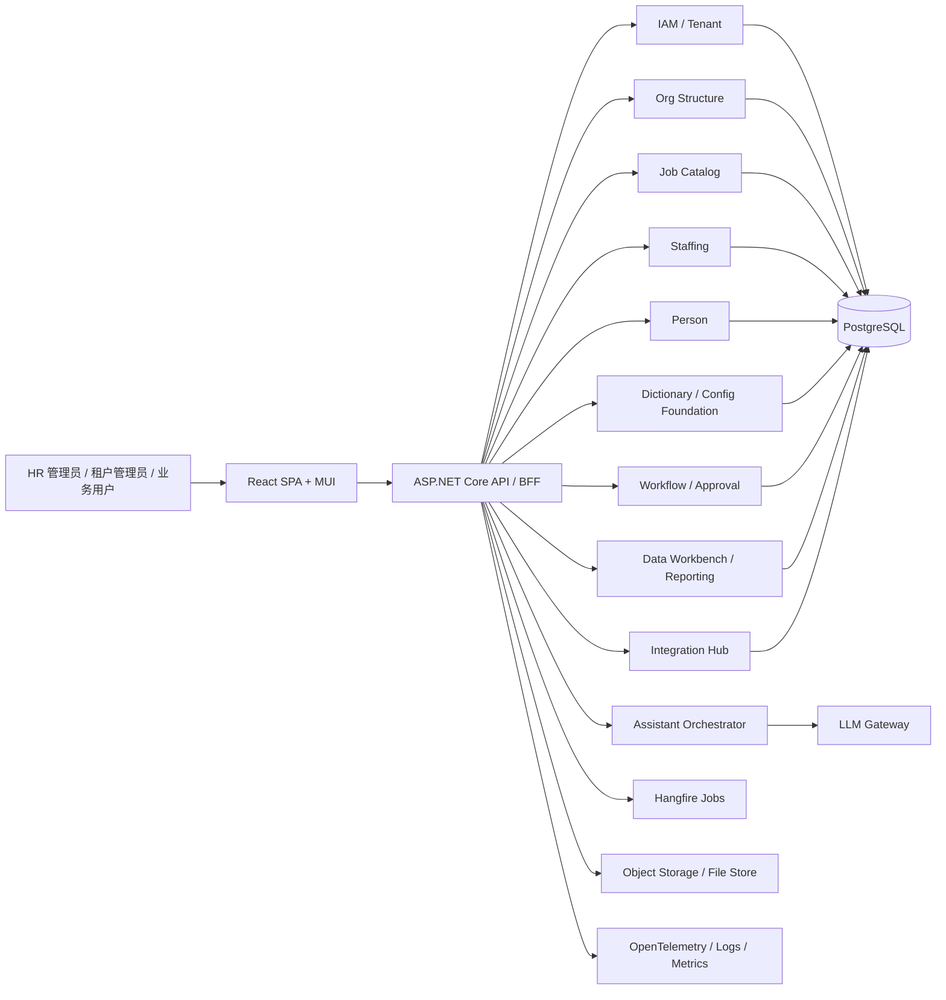

# DEV-PLAN-300：功能导向的 Greenfield HR 平台重做蓝图（C#/.NET + React）

**状态**: 已批准；已按 `310-390` 完成一级子计划映射并按实施顺序重排编号（2026-03-17）

## 1. 背景与定位

本文回答一个独立问题：

> 如果完全从零开始，不继承当前仓库的 Go、DB Kernel、RLS、sqlc、Atlas+Goose、Casbin、既有门禁与历史包袱，仅根据本项目想实现的功能本身来重新设计，一套更合适的产品级技术方案应当是什么？

本文件的立场是：

- 这是一个 **企业级 HR 平台**，核心复杂度在于组织、人、岗位、任职、生效日期、审批、权限、审计、导入导出、后台管理 UI 与 AI 助手协同。
- 它不是以极致吞吐、超低延迟、超小运行时体积为第一目标的基础设施产品。
- 因此，语言与框架选择应优先服务于 **复杂业务建模、后台管理体验、企业集成、长期可维护性**，而不是服务于“最小可执行二进制”。

随着子计划已经实际拆分，本文件当前承担三项职责：

- 作为 Greenfield HR 平台的父蓝图，冻结主栈、总体边界和核心不变量。
- 作为子计划索引，明确 `310-390` 的能力归属与依赖顺序。
- 作为上层约束，防止各子计划在模块边界、实施顺序和能力 ownership 上再次漂移。
- 平台键治理默认承接 [DEV-PLAN-348C](/home/lee/Projects/Bugs-And-Blossoms/docs/dev-plans/348c-workday-reference-key-governance-candidate-plan.md) 冻结的 `business_object_key + org_context + capability_key + time anchor + one security model`，不得回流 `setid/package_uuid` 或等价容器键。

## 2. 目标与非目标

### 2.1 核心目标

- [ ] 形成一套从零重做时的推荐主栈与整体架构。
- [ ] 覆盖本项目核心功能：租户/认证、组织架构、职位分类、职位与任职、人员、字典/配置、审批与审计、导入导出、查询工作台/运营分析、AI 助手、后台控制台。
- [ ] 给出比“纯 CRUD 系统”更贴近 HR 业务本质的数据与模块划分方案。
- [ ] 明确哪些能力应该优先简单实现，哪些能力应延后，避免 Greenfield 过度设计。
- [ ] 给出可落地的分阶段交付顺序，便于后续拆成实施计划。

### 2.2 非目标

- [ ] 本文不是当前仓库的迁移计划，不讨论 Go → C# 的分阶段迁移路径。
- [ ] 本文不继承当前仓库关于 DB Kernel、One Door、RLS fail-closed、sqlc、Atlas+Goose、Casbin、LibreChat 入口等既有决定。
- [ ] 本文不包含薪酬、社保、考勤、排班等超出当前项目核心范围的扩展模块。
- [ ] 本文不定义精确到字段级别的最终数据库 schema；如进入实施，需再拆分为子计划。

## 3. 结论先行

### 3.1 推荐主栈

**建议从零重做时采用：**

- 后端：`C# / ASP.NET Core`
- 前端：`React + TypeScript + MUI`
- 数据库：`PostgreSQL`
- 数据访问：`EF Core + Dapper/SQL` 混合
- 身份认证：Phase 0/1 先完成本地会话闭环，并预留标准 `OIDC/OAuth2` 扩展位
- 后台任务：`Hangfire`
- 观测：`OpenTelemetry`
- 部署平台：`Linux 容器平台（OCI image）`
- AI 助手：作为独立业务能力接入，使用单独的编排层与严格动作边界

### 3.2 一句话判断

如果只看功能本身，这个项目更像“复杂业务企业平台”，而不是“偏基础设施的后端服务”。  
对这种问题，**C#/.NET 比 Go 更适合作为主后端栈**。

## 4. 推荐方案总览

### 4.1 架构总图



### 4.2 推荐形态

**首选：运行在 Linux 容器平台上的模块化单体（Modular Monolith）**

理由：

- 这些模块之间存在天然强耦合：组织、职位、任职、人员、审批、权限、审计彼此共享上下文。
- 业务复杂度本来就高，若一开始拆微服务，会把“业务复杂度”再乘上“分布式复杂度”。
- 企业后台系统的主要价值通常来自一致性、可维护性和可变更性，而不是服务数量。
- 对 `ASP.NET Core + PostgreSQL + Hangfire + Object Storage` 这类组合，Linux 容器化更容易形成一致的构建、部署、回滚与环境收敛链路。

**明确不建议一开始就做：**

- 微服务
- 事件溯源作为默认主模型
- 全功能工作流引擎大一统接管全部业务
- 过早引入 ES/Kafka/Redis Cluster 等重型基础设施
- Windows-first 部署基线
- 把 Kubernetes 作为第一天的默认前提

## 5. 关键设计决策（ADR 摘要）

### 5.1 选 C#/.NET，而不是 Go（选定）

#### 原因

- 业务是“企业后台 + 复杂规则 + 大量管理页面 + 长生命周期维护”。
- `ASP.NET Core` 在 DI、中间件、配置、验证、后台任务、日志、集成测试、企业认证集成上的整体体验更适合这类产品。
- C# 对复杂领域对象、DTO、验证规则、权限策略、异步编排、后台作业的表达更自然。
- 如果后续 AI 助手继续增强，C# 在企业 AI SDK、编排生态上的选择面更大。
- 相比 Go，C# 通常会带来更高的运行时体积与内存占用，但对 HR 平台这类复杂后台系统而言，这个代价通常小于开发周期拉长和长期维护成本失控的代价。

#### 结论

- **后端主栈选 C#/.NET。**
- Go 可作为性能敏感的边缘服务或基础设施工具语言，但不适合作为这个产品的默认主栈。
- 接受“运行时更重一些”的取舍，以换取更短的实施周期、更强的业务表达力和更稳定的长期可维护性。

### 5.2 选 React + MUI，而不是 Blazor（选定）

#### 原因

- 本项目是典型管理台，React 生态在组件、表格、表单、权限壳、数据获取、测试和人才市场上更成熟。
- MUI 对 Data Grid、Tree、Date Picker、复杂表单有天然优势。
- 前后端职责更清晰，未来若需要开放 BFF/API 给其他入口，也更灵活。

#### 结论

- **前端保持 React SPA。**
- 不建议采用 Blazor 作为主前端方案。

### 5.3 选“关系型主模型 + 生效日期 + 审计日志”，而不是默认事件溯源（选定）

#### 原因

- HR 系统的本质是：**有效期、版本、审批、审计**，不一定非要上事件溯源。
- 多数核心需求都可以通过：
  - 当前实体表
  - 生效日期版本表
  - 统一审计日志
  - 业务动作回执
  
  来稳定实现。
- 事件溯源会显著增加查询、调试、补偿、回放、开发认知负担。

#### 结论

- **默认使用常规关系模型。**
- 对需要保留历史的对象使用 effective-dated version tables。
- 对关键变更保留 append-only audit log。
- 不把事件溯源作为系统总原则。

### 5.4 选 EF Core + Dapper/SQL 混合，而不是“纯 ORM”或“纯手写 SQL”（选定）

#### 原因

- 纯 EF Core 很适合标准写入流程、聚合保存、常规事务、对象生命周期管理。
- HR 系统又天然包含大量复杂查询：树、批量搜索、时间切片、报表、导出、候选匹配。
- 这些场景用 Dapper 或手写 SQL 更清晰、更可控。

#### 结论

- **写模型以 EF Core 为主。**
- **复杂读模型、报表、导出、检索以 Dapper/SQL 为主。**
- 不建议“纯 EF Core 统治一切”。
- 生效日期时间切片、层级树检索、复杂报表等路径，不应强行依赖单一 ORM 的隐式能力。

### 5.5 选“应用层租户隔离 + 权限策略”，而不是一开始就把全部隔离压到数据库（选定）

#### 原因

- 从零交付产品时，最先需要的是功能正确、开发效率高、边界清楚。
- 应用层 tenant scope、统一 repository/query filter、严格 API 策略，已经足够支撑大多数 SaaS HR 平台第一阶段。
- 数据库级 RLS 是高级强化手段，不应成为第一天的交付阻塞点。

#### 结论

- Phase 1 采用 **应用层强租户隔离**。
- 若后续合规、安全、运维成熟度提出更高要求，再评估引入数据库级 RLS。
- 应用层租户隔离必须是 fail-closed 的，`tenant_id` 视为不可变边界字段。
- 跨租户 ID 访问必须被平台层显式拒绝，不能只寄希望于查询过滤器“自然生效”。

### 5.6 选“AI 助手作为受控业务能力”，而不是“模型直连写业务”（选定）

#### 原因

- AI 助手适合做理解、检索、建议、草稿、解释，不适合作为事务写入主权威。
- 人事系统涉及组织与任职，错误写入代价高，必须保留确定性边界。

#### 结论

- Assistant 只能：
  - 做语义理解
  - 发起只读检索
  - 生成草稿/建议
  - 触发受控的业务 action request
- Assistant 不能：
  - 直接写数据库
  - 直接跳过确认
  - 直接绕过审批与权限

### 5.7 选 Linux 容器平台部署，而不是 Windows-first 或 Kubernetes-first（选定）

#### 原因

- `ASP.NET Core`、`PostgreSQL`、`Hangfire`、对象存储与 `OpenTelemetry` 的组合，在 Linux 容器平台上更容易形成统一运行基线。
- 以 `OCI image` 作为标准发布物，更容易把本地、CI、预发与生产环境收敛到同一条交付链路。
- Linux 容器平台同时覆盖“单机/VM + container runtime”和“托管容器服务”两类落地方式，前期简单，后期可扩展。
- 这一定义的是默认部署基座，不等于第一天就引入 Kubernetes、Service Mesh、GitOps 或复杂集群运维。

#### 结论

- **默认部署平台选 Linux 容器平台。**
- Phase 0/1 以 `OCI image` 作为标准发布物。
- 第一阶段可运行在单机 Linux VM、托管容器服务或轻量容器编排环境上；Kubernetes 不是第一阶段阻塞项。
- Windows Server / Windows 容器不是默认部署口径。

### 5.8 选“统一访问模型 + OrgContext”，而不是容器键治理（选定）

#### 原因

- HR 平台里的配置差异、流程差异、字段可维护性差异，本质上更接近“业务对象 + 组织上下文 + 时间锚点 + 统一安全模型”的差异，而不是“再切一层包/数据集容器”。
- 如果 UI、API、Workflow、Reporting、Assistant 各自维护第二套上下文命中逻辑，Explain 会被拆裂，用户与开发者都要理解隐藏容器键，Greenfield 的简化目标会被反向侵蚀。
- 从零设计时应主动减少偶然复杂度，因此不应把 `setid/package_uuid` 或任何等价容器键继续当作平台级治理语法。

#### 结论

- 平台级统一口径默认承接 [DEV-PLAN-348C](/home/lee/Projects/Bugs-And-Blossoms/docs/dev-plans/348c-workday-reference-key-governance-candidate-plan.md)：`business_object_key + org_context + capability_key + time anchor + one security model`。
- `setid / package_uuid` 不再作为平台或业务域治理键、容器键、隐藏 alias 或降级落点。
- `340 / 350 / 360 / 370 / 380 / 390` 必须共享同一访问模型与 Explain 合同，而不是为不同入口发明第二套命中语法。

## 6. 功能模块划分（从产品视角）

说明：本节聚焦“产品功能归属”；`310 / 320 / 330 / 350` 分别承接工程交付、共享数据约定、安全治理、前端产品系统，属于横切前置计划，不直接等同于单一业务功能模块。

### 6.1 平台与基座（对应 `340`）

#### 1. IAM / Tenant

- 多租户
- 登录与会话
- 用户、角色、权限
- 本地登录闭环与可撤销 session
- OIDC / SSO 扩展位
- Superadmin 控制台

#### 2. Dictionary / Configuration

- 通用字典
- 下拉选项
- 平台级配置与租户级设置
- 可租户级覆盖的系统设置
- 动态策略、版本激活与 Explain 预览
- `OrgContext` 装配与解释链
- 按 `OrgContext + time anchor + one security model` 命中的配置/策略/只读结果

#### 3. Audit / Task / Notification

- 平台审计底座
- 系统任务
- 通知（邮件、站内、Webhook）
- 后台作业与失败重试

### 6.2 核心 HR 模块

#### 4. Org Structure

- 组织单元树
- 生效日期版本
- 上下级调整
- 组织详情、状态、历史

#### 5. Job Catalog

- Job Family / Job Level / Job Profile
- 岗位分类主数据
- 分类结构与标签

#### 6. Staffing

- Position
- Assignment / Job Data
- 职位编制、任职关系、状态变更

#### 7. Person

- 人员主档
- 基础身份信息
- 与任职记录联动

以上四个核心业务域由 `360` 承接，形成 HR 主数据与事务主链。

### 6.3 治理与协同能力（对应 `370`）

#### 8. Workflow / Approval

- 提交、审批、驳回、撤回
- 关键主数据和任职变更审批
- 待办与审批历史

#### 9. Audit Enhanced

- 关键动作 before/after snapshot
- 审批轨迹
- 集成执行回执
- 可查询的操作回执

#### 10. Integration Hub

- HR 外部系统对接
- 批量同步任务
- Webhook / SFTP / API connectors

### 6.4 数据工作台与运营分析（对应 `380`）

#### 11. Import / Export / Query Workspace

- Excel/CSV 导入
- 模板下载
- 批量导出
- 跨模块查询、筛选、汇总
- 数据质量反馈面板

#### 12. Reporting / Operational Analytics

- 组织视图
- 人员与任职报表
- 常用筛选、导出、汇总
- 运营分析与健康度面板

#### 13. Documents / File Workbench

- 导入文件、导出文件、模板文件统一归档
- 对象存储接入与文件元数据
- 业务模块消费文件引用，不自建第二套文件管理

### 6.5 Chat Assistant（对应 `390`）

#### 14. Assistant

- 对话理解
- 候选澄清与只读检索
- 生成建议与确认摘要
- 通过 Action Gateway 发起受控动作请求

## 7. 推荐领域边界

### 7.1 建议的后端模块结构

```text
src/
  Platform/
    IAM/
    Tenancy/
    Configuration/
    Audit/
    Notifications/
    Jobs/
    Shell/
  HR/
    OrgStructure/
    JobCatalog/
    Staffing/
    Person/
  Coordination/
    Workflow/
    AuditEnhanced/
    Integrations/
  DataWorkbench/
    Imports/
    Exports/
    QueryWorkspace/
    OperationalAnalytics/
    Files/
  Assistant/
    Chat/
    Retrieval/
    ActionGateway/
    Governance/
```

对应关系：

- 横切前置中的工程、测试、CI/CD 与观测基线对应 [DEV-PLAN-310](/home/lee/Projects/Bugs-And-Blossoms/docs/dev-plans/310-engineering-quality-testing-and-delivery-plan.md)
- 横切前置中的共享数据建模约定对应 [DEV-PLAN-320](/home/lee/Projects/Bugs-And-Blossoms/docs/dev-plans/320-shared-data-architecture-and-modeling-conventions-plan.md)
- 横切前置中的安全、合规与数据治理边界对应 [DEV-PLAN-330](/home/lee/Projects/Bugs-And-Blossoms/docs/dev-plans/330-security-compliance-and-data-governance-plan.md)
- 横切前置中的前端产品壳与交互系统对应 [DEV-PLAN-350](/home/lee/Projects/Bugs-And-Blossoms/docs/dev-plans/350-frontend-product-shell-and-interaction-system-plan.md)
- `Platform/*` 对应 [DEV-PLAN-340](/home/lee/Projects/Bugs-And-Blossoms/docs/dev-plans/340-platform-and-iam-foundation-plan.md)
- `HR/*` 对应 [DEV-PLAN-360](/home/lee/Projects/Bugs-And-Blossoms/docs/dev-plans/360-core-hr-domains-plan.md)
- `Coordination/*` 对应 [DEV-PLAN-370](/home/lee/Projects/Bugs-And-Blossoms/docs/dev-plans/370-workflow-audit-and-integration-plan.md)
- `DataWorkbench/*` 对应 [DEV-PLAN-380](/home/lee/Projects/Bugs-And-Blossoms/docs/dev-plans/380-data-workbench-and-operational-analytics-plan.md)
- `Assistant/*` 对应 [DEV-PLAN-390](/home/lee/Projects/Bugs-And-Blossoms/docs/dev-plans/390-chat-assistant-capability-plan.md)

### 7.2 每个模块内部建议分层

```text
<Module>/
  Domain/
  Application/
  Infrastructure/
  Web/
```

说明：

- `Domain`：业务规则、实体、值对象、领域服务
- `Application`：用例编排、事务边界、命令/查询处理
- `Infrastructure`：EF Core、Dapper、外部系统、对象存储、消息与任务
- `Web`：API、DTO、验证、控制器/Endpoint

## 8. 数据建模策略

### 8.1 生效日期作为第一类能力

该产品天然适合使用 **day-granularity effective dating**：

- `effective_date`
- `end_date`
- `status`
- `is_current`

对 effective-dated 对象的读取，必须显式区分：

- `current`
- `as-of`
- `history`

不能把时间语义隐藏在默认查询过滤器或“当前记录”假设里。

适用对象：

- 组织单元
- 职位分类
- 职位
- 任职
- 字典值
- 关键配置

### 8.2 推荐的持久化模式

#### 模式 A：当前实体 + 历史版本

适用于：

- 组织
- 职位分类
- 职位
- 任职

做法：

- 一张主表存稳定标识与少量当前状态
- 一张 versions/history 表存按 effective date 切片的数据

#### 模式 B：主档 + 附属快照

适用于：

- Person
- 配置项
- 审批记录

做法：

- 主档存当前事实
- 审批或操作时保留 before/after snapshot

#### 模式 C：统一审计表

建议提供统一 `audit_log`：

- actor
- tenant
- module
- action
- target_type
- target_id
- before_snapshot
- after_snapshot
- request_id
- timestamp

### 8.3 不建议的默认做法

- 不建议所有模块都采用事件溯源
- 不建议所有表都依赖软删除
- 不建议把审计日志和业务主表混写成一套抽象
- 不建议为了“灵活”把大量核心字段塞进 JSONB

## 9. 多租户、权限与认证

### 9.1 多租户

建议默认采用：

- 单库多租户
- 全业务表带 `tenant_id`
- 应用层统一 tenant context 注入
- 查询层统一 tenant filter
- `tenant_id` 在创建后不应被业务写路径随意改写
- 跨租户访问应在应用层入口显式拒绝，而不是依赖下游查询“刚好查不到”

对于高隔离客户，可保留后续扩展路线：

- 单租户部署
- 单独数据库

### 9.2 认证

建议采用分阶段口径：

- Phase 0/1：先完成本地用户名密码登录与服务器端可撤销 session 闭环。
- Phase 2+：在不改变主认证模型的前提下，补充标准 OIDC/OAuth2 身份提供方接入。
- 目标兼容对象包括：Entra ID / Okta / Auth0 / Keycloak。

也就是说，OIDC 是正式扩展方向，但不是第一阶段的交付阻塞点。

### 9.3 授权

建议采用：

- `role + permission` 模型
- ASP.NET Core policy-based authorization
- 数据库存储权限矩阵

而不是一开始就引入非常重的外部授权 DSL。

### 9.4 审批与权限关系

必须明确：

- “有权限发起” 不等于 “有权限审批”
- “有权限编辑” 不等于 “能修改历史生效记录”
- “Assistant 能建议” 不等于 “Assistant 能提交”

## 10. 后端技术选型建议

### 10.1 Web 与应用宿主

- `ASP.NET Core`
- `Minimal APIs` 或 `Controllers` 均可
- 对复杂后台系统，建议：
  - 面向内部业务 API 使用 Controllers 或清晰的 Endpoint 分组
  - 避免纯“everything minimal API”导致边界松散

### 10.2 数据访问

- `EF Core`：事务写入、聚合保存、常规查询
- `Dapper`：复杂列表、报表、搜索、导出
- `Npgsql`：PostgreSQL 驱动

### 10.3 验证与命令处理

- `FluentValidation`
- 可选 `MediatR`，但不要为了 CQRS 形式主义而到处套 Handler

建议：

- 用“命令/查询对象”组织复杂应用逻辑
- 但不要把每个 GET/POST 都机械切成十几层

### 10.4 后台任务

- `Hangfire`

适用场景：

- 导入导出
- 审批后续动作
- 通知发送
- 外部同步
- Assistant 长任务回执

### 10.5 文档与契约

- OpenAPI / Swagger
- API DTO 与前端类型可自动生成或半自动对齐
- 普通业务 API 的合同冻结、兼容性分级与质量门禁由 `310 -> 314` 承接；Assistant 专项 API / surface gate 仍由 `390 / 395` 承接

### 10.6 文件与导出

- 对象存储：S3 兼容
- Excel：`ClosedXML`
- PDF：按需要引入成熟库，不要过早内建复杂报表引擎

### 10.7 部署与运行基线

- 标准发布物：`OCI image`
- 默认运行基座：`Linux 容器平台`
- 第一阶段部署目标：单机 Linux VM + container runtime 或托管容器服务
- 不要求第一阶段就引入 Kubernetes、Service Mesh 或复杂集群运维

## 11. 前端技术选型建议

### 11.1 主栈

- `React + TypeScript`
- `MUI`
- `React Query`
- `React Hook Form`
- `Zod`

### 11.2 页面模式

建议统一以下管理台模式：

- 列表页
- 详情页
- 历史版本页
- 审批页
- 导入导出页
- 审计页

### 11.3 UI 交互原则

- 组织、职位、任职、人员页面统一采用“列表 + 详情 + 时间线/版本”
- 生效日期必须是界面上的一级概念，不要藏在高级选项里
- 审批与确认应显式分离
- Assistant 的结果必须回落到明确的业务 UI 或确认面板

## 12. Assistant 设计边界

### 12.1 Assistant 应该做什么

- 理解用户意图
- 检索候选组织、人员、职位、任职
- 做候选澄清与 disambiguation
- 生成“建议动作”
- 生成“确认摘要”
- 返回“操作回执”与失败解释
- 解释为什么不能执行

### 12.2 Assistant 不应该做什么

- 不直接改业务表
- 不跳过审批
- 不绕过权限
- 不伪造标识符和业务主键
- 不自己维护第二套业务状态机

### 12.3 推荐落地方式

- Assistant 单独有一层 orchestration service，并作为独立子计划 `390` 承接。
- 单轮对话里，外部大模型负责主语义理解；本地系统只负责提供事实、权限和可执行动作边界。
- 通过只读接口访问 `360` 的 HR 业务对象。
- 对可写操作，只能通过注册式 `Action Gateway` 生成 `action request`。
- 最终由业务应用层执行 `dry-run / validate / confirm / approve / commit`。
- 对长事务、审批和异步执行，Assistant 只观察 `action request`、审批状态与操作回执，不直接猜测业务表是否已经变化。
- 审计、评测、回执与运行治理必须是正式能力，不能只留后台日志。

### 12.4 为什么这很重要

这个系统的数据不是聊天玩具数据，而是组织与人事数据。  
AI 提升的是“交互效率”和“理解能力”，不是“替代业务边界”。

## 13. 推荐实施顺序

### Phase 0：工程、数据与治理基线（`310 / 320 / 330`）

- [ ] 工程结构、本地开发、CI/CD、Linux 容器平台部署基线、测试分层与最小观测基线
- [ ] effective date / history / audit / EF Core / Dapper 共享建模约定
- [ ] 敏感数据分级、导出治理、租户隔离与密钥治理边界

说明：

- `310 / 320 / 330` 是横切前置计划，不建议等主功能完成后再回补。

### Phase 1：平台与前端基座（`340 / 350`）

- [ ] IAM / Tenant
- [ ] 角色与权限
- [ ] 字典与基础配置
- [ ] 审计与通知基座
- [ ] React 壳、导航、表单规范、列表规范
- [ ] 权限感知 UI 与统一页面模式

说明：

- `340` 与 `350` 同属 Phase 1，可并行冻结规范，但 `350` 的壳层运行态接线默认依赖 `340` 输出的 tenancy/auth/session 上下文。

### Phase 2：核心 HR 主链（`360`）

- [ ] Org Structure
- [ ] Person
- [ ] Job Catalog
- [ ] Position
- [ ] Assignment / Job Data
- [ ] 有效期记录展示与编辑
- [ ] 审计日志可追溯

### Phase 3：治理协同与数据工作台（`370 / 380`）

- [ ] Workflow / Approval
- [ ] Audit Enhanced
- [ ] Integration Hub
- [ ] Import / Export / Query Workspace
- [ ] 常用报表与运营分析
- [ ] 文件工作台与对象存储接入

说明：

- `370` 与 `380` 可以按资源情况并行推进，但都默认依赖 `340 / 350 / 360`。

### Phase 4：Assistant 受控交互（`390`）

- [ ] 对话式只读检索
- [ ] 建议式写入草稿
- [ ] Action Gateway
- [ ] 受控确认与执行
- [ ] 运行治理与评测

说明：

- 只读型 Assistant 可在 `360` 稳定后提前预研。
- 涉及可写动作、审批衔接与正式治理的 Assistant 能力，默认依赖 `370` 就绪。

### Phase 5：强化与产品化

- [ ] SSO 扩展
- [ ] 高级权限
- [ ] 多租户运营能力
- [ ] 性能与观测强化

## 14. 为什么这个方案比“Go + 强 DB 内核”更适合从零开始

### 14.1 更贴近产品团队的真实重心

从零重做时，团队首先要解决的是：

- 业务规则是否清晰
- 页面能否快速交付
- 后台任务是否稳定
- 审批、权限、审计是否好维护
- 企业客户接入是否顺手

这些点上，C#/.NET 的整体工程体验更贴近问题本身。

### 14.2 更容易把复杂度留在正确的位置

推荐方案下：

- 业务复杂度留在领域与应用层
- SQL 复杂度留在真正复杂的查询场景
- 历史与审计通过标准关系模型表达
- AI 能力留在编排层

而不是把大量核心复杂度一开始就推入数据库内核。

### 14.3 更利于企业级长期演进

这类系统通常会长期演化出：

- 更复杂的审批
- 更多报表
- 更多权限矩阵
- 更多外部集成
- 更多后台工具
- 更多运营能力

主栈若采用 C#/.NET，长期扩展通常比 Go 更从容。

## 15. 风险与取舍

### 15.1 采用 C# 的主要风险

- 运行时与部署体积通常大于 Go
- 团队若不熟悉 .NET，会有学习成本
- EF Core 若被滥用，会造成查询不可控与性能问题

### 15.2 对应缓解

- 架构上坚持模块化单体，避免分布式爆炸
- 数据访问坚持 EF Core + Dapper 混合
- 对复杂查询与导出场景明确保留 SQL 权限
- 不把 AI 助手直接接到写模型
- 对有效期区间完整性、层级检索与长事务状态，提前冻结数据库约束与状态回执边界，不把复杂度留给临场补丁
- 通过多阶段构建、基础镜像收敛与标准容器 smoke，控制运行体积与环境漂移

## 16. 验收标准

- [ ] 架构层面已明确：后端采用 C#/.NET，前端采用 React + MUI。
- [ ] 已明确：系统默认运行于 Linux 容器平台，并以 `OCI image` 作为标准发布物；Windows-first / Kubernetes-first 均不是第一阶段默认要求。
- [ ] 已明确：系统以模块化单体交付，而不是微服务优先。
- [ ] 已明确：采用关系型主模型 + effective-dated history + audit log，而非默认事件溯源。
- [ ] 已明确：数据访问采用 EF Core + Dapper/SQL 混合，而非纯 ORM。
- [ ] 已明确：应用层租户隔离必须 fail-closed，跨租户访问不得仅依赖隐式查询过滤器。
- [ ] 已明确：Assistant 只能作为受控编排层，不得成为业务写入主边界。
- [ ] 已明确：Assistant 通过 `action request` / 回执跟踪长事务状态，而不是猜测业务主表变化。
- [ ] 已明确子计划映射：`310` 工程质量、`320` 共享数据、`330` 安全治理、`340` 平台基座、`350` 前端产品系统、`360` 核心 HR、`370` 治理协同、`380` 数据工作台、`390` Assistant。
- [ ] 已明确边界：`370` 不承接报表/数据工作台与 Chat Assistant；`380` 不承接主业务写模型；`390` 不拥有业务主写模型。
- [ ] 已形成实施顺序：`310 / 320 / 330` → `340 / 350` → `360` → `370 / 380` → `390` → 强化与产品化。

## 17. 已完成的子计划拆分与依赖

`300` 已完成以下一级子计划拆分；后续更细的设计继续以下述子计划各自的“后续拆分建议”为准：

1. [ ] [DEV-PLAN-310：工程质量、测试与交付子计划](/home/lee/Projects/Bugs-And-Blossoms/docs/dev-plans/310-engineering-quality-testing-and-delivery-plan.md)：负责工程结构、本地开发、测试分层、CI/CD、Linux 容器平台部署与最小观测基线。
2. [ ] [DEV-PLAN-320：共享数据架构与建模约定子计划](/home/lee/Projects/Bugs-And-Blossoms/docs/dev-plans/320-shared-data-architecture-and-modeling-conventions-plan.md)：负责 effective date、主表/版本表、时间语义、数据库约束模板与 EF Core / Dapper 共享约定。
3. [ ] [DEV-PLAN-330：安全、合规与数据治理子计划](/home/lee/Projects/Bugs-And-Blossoms/docs/dev-plans/330-security-compliance-and-data-governance-plan.md)：负责敏感数据分级、导出治理、租户隔离、tenant-scoped SQL 治理、密钥与 Assistant 安全治理边界。
4. [ ] [DEV-PLAN-340：平台与 IAM 基座子计划](/home/lee/Projects/Bugs-And-Blossoms/docs/dev-plans/340-platform-and-iam-foundation-plan.md)：负责 tenancy、authn、authz、shell、平台审计/通知/任务基座，以及 `Platform.Configuration / Policy` 的平台化能力承载，并冻结统一访问模型、`OrgContext` 装配与同源 Explain 入口（其业务蓝图由 [DEV-PLAN-345](/home/lee/Projects/Bugs-And-Blossoms/docs/dev-plans/345-platform-configuration-and-policy-business-rules-blueprint.md) 细化）。
5. [ ] [DEV-PLAN-350：前端产品壳与交互系统子计划](/home/lee/Projects/Bugs-And-Blossoms/docs/dev-plans/350-frontend-product-shell-and-interaction-system-plan.md)：负责信息架构、导航、页面模式、表单规范与权限感知 UI，并把 `as_of / effective_date / org_context / read_only` 收口为稳定产品语言。
6. [ ] [DEV-PLAN-360：核心 HR 业务域子计划](/home/lee/Projects/Bugs-And-Blossoms/docs/dev-plans/360-core-hr-domains-plan.md)：负责 Org、JobCatalog、Staffing、Person、层级检索能力与 effective-dated 主业务模型，并把跨域差异收敛为“领域对象主键 + OrgContext + 时间锚点”。
7. [ ] [DEV-PLAN-370：工作流、审计增强与集成子计划](/home/lee/Projects/Bugs-And-Blossoms/docs/dev-plans/370-workflow-audit-and-integration-plan.md)：负责 Workflow / Approval、状态回执、Audit Enhanced、Integration Hub，并保证审批摘要、回执与集成上下文沿用统一访问模型。
8. [ ] [DEV-PLAN-380：数据工作台与运营分析子计划](/home/lee/Projects/Bugs-And-Blossoms/docs/dev-plans/380-data-workbench-and-operational-analytics-plan.md)：负责导入导出、Query Workspace、报表与运营分析、文件工作台，并把查询/导出/报表上下文统一为 `OrgContext + Time`。
9. [ ] [DEV-PLAN-390：Chat Assistant 能力子计划](/home/lee/Projects/Bugs-And-Blossoms/docs/dev-plans/390-chat-assistant-capability-plan.md)：负责会话、检索、Action Gateway、`action request` 状态票据、评测与运行治理，并确保澄清、确认摘要与状态查询消费同源 `OrgContext + one security model`。

依赖顺序冻结为：

- `310` 是所有子计划的工程与交付前置。
- `320` 为 `340 / 360 / 370 / 380 / 390` 提供共享数据约定前置。
- `330` 为 `340 / 370 / 380 / 390` 提供安全与治理边界前置。
- `340` 与 `350` 是 `360 / 370 / 380 / 390` 的产品平台前置。
- `360` 是 `370 / 380 / 390` 的业务对象前置。
- `370` 与 `380` 是 `390` 的治理与工作台前置，其中 `390` 的可写闭环默认依赖 `370`。
- `340 / 350 / 360 / 370 / 380 / 390` 必须共享 `348C` 冻结的 `business_object_key + org_context + capability_key + time anchor + one security model`，不得在 UI / API / Integration / Assistant 内重建 `setid/package_uuid` 或等价容器键。

### 17.1 依赖一致性表（与 `400` 同步）

| 子计划 | 角色定位 | 默认前置 | 不可越界 |
| --- | --- | --- | --- |
| `310` | 工程质量、测试与交付基线 | 无 | 不定义业务规则与权限真值 |
| `320` | 共享数据、时间语义与持久化约定 | `310` | 不替代业务域详细设计 |
| `330` | 安全、合规与治理边界 | `310` | 不替代授权矩阵与业务流程 |
| `340` | 平台与 IAM 基座 | `310/320/330` | 不承接核心 HR 主写模型 |
| `350` | 前端壳、页面与交互系统 | `310/320/330`（运行态接线依赖 `340`） | 不替代权限真值与业务规则 |
| `360` | Org/Person/JobCatalog/Staffing 主链 | `320/340/350` | 不承接工作流、工作台与 Assistant 主责 |
| `370` | Workflow/Audit Enhanced/Integration | `330/340/350/360` | 不承接报表工作台与 Chat Assistant |
| `380` | 导入导出/查询工作台/运营分析 | `330/340/350/360` | 不承接核心主写模型 |
| `390` | Chat Assistant 受控编排层 | `330/340/350/360/370/380` | 不拥有业务主写模型 |
