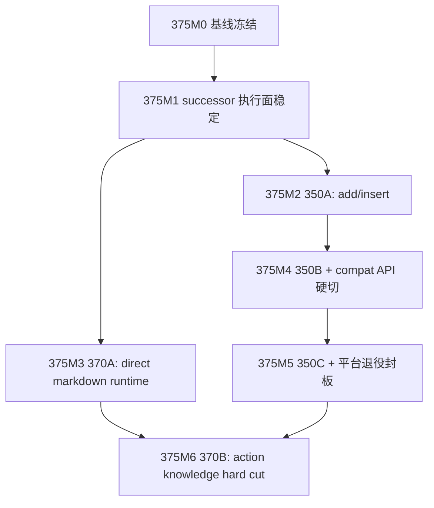

# DEV-PLAN-375：Assistant 主线实施路线图（350-370）

**状态**: 进行中（2026-04-13 15:13 CST；`375M1/375M2/375M3/375M4` 已完成并封账，`350C` 已完成并冻结八动作 contract，`370B` 已完成 action knowledge hard cut，`375M5` 仍剩平台退役封板项）

> 目标：为 `DEV-PLAN-350/360/360A/361/370` 提供单一编排入口，冻结当前状态、SSOT 边界、串并行顺序、批次拆分与出口条件。  
> 本文只做路线图编排，不改写各主题文档的契约裁决权；实现细节与子系统合同仍以对应 dev-plan 为单一事实源。

## 0.1 进度速记

1. [X] 新增 `DEV-PLAN-375` 并登记到 `AGENTS.md` 文档地图，作为 Assistant 主线的编排入口。
2. [X] 冻结现状快照：`361` 已封板，`350` 已完成 `create_orgunit / create_org` 样板，`360 / 360A / 370` 仍在进行中。
3. [X] 冻结后续批次拆分：
   - `350A`：`add_version / insert_version`
   - `350B`：`correct / rename / move`
   - `350C`：`disable / enable`
   - `370A`：Direct Markdown Runtime 基座、Markdown 单主源、`assistant_knowledge/*.json` 切断
   - `370B`：动作知识散点 hard cut 与 contract / knowledge 强分离
4. [X] `375M1`：successor 执行面稳定（承接 `360 Phase 0/1` + `360A Phase 0/1`）。
5. [X] `375M2`：`350A` 完成，收口 `add_version / insert_version`。
6. [X] `375M3`：`370A` 完成，收口 direct Markdown runtime foundation。
7. [X] `375M4`：compat session API 的 `410 Gone` 硬切、cleanup PR 与 runtime fail-closed/error-code 收口均已完成并封账。
8. [ ] `375M5`：`350C` 已完成；平台退役封板仍在进行中。
9. [ ] `375M6`：`370B` 已完成；待 `375M5` 收口后进入总体验收与封板准备。

## 0.2 当前下一步

1. [ ] 第一优先级：继续推进 `375M5` 剩余的平台退役封板项（`360 / 360A Phase 3/4`）。
2. [X] `DEV-PLAN-370B` 已完成，动作知识散点 hard cut 与 contract / knowledge 强分离已落地。
3. [ ] `375M5` 收口后，进入总体验收与封板准备。

## 1. 背景与定位

1. [X] `DEV-PLAN-350` 已明确 Assistant 的 `business_action` 必须收敛到统一策略主链，避免第二策略解释器。
2. [X] `DEV-PLAN-360/360A` 已明确 LibreChat 只能保留 UI 壳，successor 主链必须回到本仓 `/internal/assistant/*` 与 authoritative backend。
3. [X] `DEV-PLAN-361` 已完成唯一 PDP 的 OPA/Rego-backed evaluator 切换；其职责已封板，不再作为未来路线图泳道。
4. [X] `DEV-PLAN-370` 已改为“Markdown 单主源 + direct runtime load + 切断 `assistant_knowledge/*.json`”的现行口径。
5. [X] `docs/archive/dev-plans/240E/241/244/245` 等历史计划仅保留背景价值，不再参与 `375` 的现行裁决与批次设计。
6. [X] 因此，`375` 的正式定位是：Assistant 主线的“编排母法”，负责回答“先做什么、哪些并行、每个阶段如何验收”，而不是重写 `350/360/360A/361/370` 的内部合同。

## 2. 当前状态快照（M0 基线）

| 主题 | 当前状态 | 当前定位 | 备注 |
| --- | --- | --- | --- |
| `350` | 已完成 | `business_action` 正式 contract / Tool API / Gate 消费母法 | `create_orgunit / create_org`、`350A add_version / insert_version`、`350B correct / rename / move`、`350C disable / enable` 已全部完成并冻结 |
| `360` | 进行中（Phase 0/1 已完成） | LibreChat 剥离与 LangGraph/LangChain 分层接管母法 | `360A` 承接执行面 SSOT；Phase 2+ 待实施 |
| `360A` | 进行中（Phase 0/1 已完成） | successor DTO / `runtime-status` / compat API 生死表 / 删除批次 SSOT | `ui-bootstrap/session`、formal smoke、UI 降权已完成；Phase 2 的 compat session API cutover 已完成，cleanup PR / runtime fail-closed 待实施 |
| `361` | 已封板基线 | 唯一 PDP / OPA evaluator 已完成 | 仅保留缺陷修复语义 |
| `370` | 进行中 | Markdown 单主源、direct runtime、JSON cutoff 母法 | `370A` 为 runtime foundation，`370B` 为动作知识散点 hard cut |

## 3. SSOT 边界矩阵

| 主题 | 裁决范围 | `375` 对其要求 | 禁止事项 |
| --- | --- | --- | --- |
| `350` | `ActionSchema`、`Readonly Tool Registry`、tool schema、`PolicyContext`、`PrecheckProjection`、Gate 消费边界 | 拆成 `350A/B/C` 批次推进，但保持 `350` 为 contract 母法 | `370` 反向定义动作 contract |
| `360` | 架构分层、stopline、UI 壳/Runtime/authoritative backend 角色边界 | 与 `360A` 保持“母法/执行面”关系 | 在 `360` 里重复 successor DTO 与 compat API 合同 |
| `360A` | `/internal/assistant/ui-bootstrap`、`/internal/assistant/session*`、`runtime-status`、compat API 生死表与删除批次 | 作为 `375M1/M4/M5` 的执行面前置 | 临场发明 bootstrap/session/失败语义 |
| `361` | 唯一 PDP 的 OPA/Rego-backed evaluator 与 parity 基线 | 只作为前置完成项写入路线图 | 再把 `PrecheckProjection` 或 consumer convergence 混回 `361` |
| `370` | Markdown 单主源、reply/wiki/intent/action 编排、direct runtime、JSON cutoff | 拆成 `370A/B`，并受 `350` contract 闸口约束 | 把 `actions/*.md` 升格为动作 API / Tool API 主源；恢复 JSON 快照或 overlay/pass-through |

## 4. 路线图原则

1. [X] `API-first`：所有实时业务事实、策略裁决、提交准入结果都必须先由正式 API / Tool API 暴露，再由 runtime 消费。
2. [X] `Simple > Easy`：优先冻结边界、失败语义、出口条件与批次顺序，不在实现阶段临场决定。
3. [X] `No Legacy`：不以长期 compat API、双运行时、双工具目录或双知识主源作为默认迁移策略。
4. [X] `No Overlay`：不以 overlay、pass-through、partial ownership、mixed-source runtime 作为知识迁移方案。
5. [X] `No Snapshot`：不以 `assistant_knowledge/*.json` 或其他导出快照作为长期中间层。
6. [X] `One Door / Fail-Closed`：任何缺 projection、缺 digest、缺 version、缺 successor runtime contract 的场景都必须显式拒绝，不得回退旧平台。
7. [X] `单一权威表达`：`business_action` contract 只由 `350` 扩张，Markdown knowledge 主源只由 `370` 扩张，successor 执行面只由 `360A` 扩张。

## 5. 里程碑与关键路径

> 全局关键路径冻结为：`375M0 -> 375M1 -> (375M2 || 375M3) -> 375M4 -> 375M5 -> 375M6`

### 375M0：基线冻结

1. [X] 发布 `375` 并登记 `AGENTS.md`。
2. [X] 冻结现状快照与 SSOT 边界矩阵。
3. [X] 冻结批次拆分：`350A/B/C`、`370A/B`。
4. [X] 明确 `assistantActionSpec` 与现有 `assistant_action_registry.go` 在 `350A/B/C` 完成前仍是 `business_action` 执行面 SSOT。

### 375M1：Successor 执行面稳定

1. [X] 承接 `360 Phase 0/1` 与 `360A Phase 0/1`。
2. [X] 冻结并落地 `/internal/assistant/ui-bootstrap`、`/internal/assistant/session*`、`AssistantRuntimeStatusResponse` 的 successor 合同与运行态语义。
3. [X] 正式入口只保留聊天 UI 壳，不再暴露 Agents / MCP / Memory / Search / Code Interpreter。
4. [X] 将此里程碑定义为后续 `370A` 与所有正式 cutover 的前置门槛。
5. [X] 执行证据已沉淀到 `docs/dev-records/dev-plan-375-m1-successor-entry-stabilization-log.md`。

### 375M2：业务动作收口批次一

1. [X] 启动 `350A`，仅覆盖 `add_version / insert_version`。
2. [X] 为两动作补齐与 create 对齐的 `PolicyContext`、`PrecheckProjection`、digest/version 快照与 `assistantActionSpec` 契约字段。
3. [X] 统一 dry-run / confirm / commit / task submit / 写前解释到同一 projection contract。
4. [X] 只读工具仍沿用既有 `orgunit_*` 四工具名，未新增写工具。

### 375M3：Direct Markdown Runtime 基座

1. [X] 启动 `370A`，覆盖 Markdown 单主源、`assistant_knowledge_md`、direct runtime loader、`assistant_knowledge/*.json` 切断与反回流门禁。
2. [X] 明确 `370A` 不做 query-only partial cutover，也不保留 action/query ownership 分裂。
3. [X] 明确 `370A` 不承接 `business_action` contract，不改 `assistantActionSpec`、Tool registry、`PolicyContextContractVersion`、`PrecheckProjectionContractVersion`。
4. [X] 明确 `370A` 同步冻结 semantic prompt 与 active Markdown 索引的一致性。

### 375M4：业务动作收口批次二 + compat API 硬切

1. [X] 启动 `350B`，覆盖 `correct / rename / move`。
2. [X] 同步承接 `360A Phase 2` 的 compat session API 硬切：`/app/assistant/librechat/api/*` 与 `/assets/librechat-web/api/*` 下旧会话端点统一返回 `410 Gone`。
3. [X] 继续完成 `360 Phase 2 / 360A Phase 2` 的 runtime 主链 fail-closed/error-code 收口与 compat cleanup PR。
4. [X] 本里程碑完成后，正式运行链只保留 `/internal/assistant/*` 所需的最小 successor 面。
5. [X] `350B` 实施证据已沉淀到 `docs/dev-records/dev-plan-350b-execution-log.md`。
6. [X] `360A` 本轮 compat session API cutover 证据已沉淀到 `docs/dev-records/dev-plan-360a-execution-log.md`，并已随实现提交 `bb5a8568` 固化。

### 375M5：业务动作收口批次三 + 平台退役封板

1. [X] `350C` 已完成，`disable / enable` 已进入统一 `PolicyContext -> PDP -> PrecheckProjection -> dry-run / confirm / commit / task submit` 主链。
2. [ ] 同步承接 `360 Phase 3/4` 与 `360A Phase 3/4`，完成依赖去平台化、`retired_by_design` 语义、`/assistant-ui/*` 退场与 `220-293` 系列归档收口。
3. [ ] 本里程碑完成后，`350` 的八动作 contract 全部冻结，`360/360A` 达到封板条件。

### 375M6：动作知识 Hard Cut 与总体验收

1. [X] 启动 `370B`，且必须以 `350A/B/C` 全部完成与 `370A` 完成为前置。
2. [X] 完成 `business_action` 剩余知识散点清理，并保持 direct Markdown runtime 为唯一知识消费面。
3. [X] 完成 `assistant_action_registry.go` 的 contract / knowledge 拆离，并清理 `assistant_api.go`、`assistant_reply_nlg.go` 中的业务知识型文本。
4. [ ] 里程碑出口：`350 / 360 / 360A / 370` 全部状态可更新为完成或仅剩独立缺陷修复，`375` 进入封板准备。

## 6. 并行泳道与子计划

1. [X] `350A`：`add_version / insert_version`，作为 `375M2` 的实施 SSOT。
2. [X] `350B`：`correct / rename / move`，作为 `375M4` 的实施 SSOT。
3. [X] `350C`：`disable / enable`，作为 `375M5` 的实施 SSOT。
4. [X] `360A`：继续作为 `360` 的执行面 SSOT，覆盖 successor DTO、compat API、生死表、删除批次与运行态语义。
5. [X] `370A`：Markdown 单主源、direct runtime、JSON cutoff、反回流门禁，作为 `375M3` 的实施 SSOT。
6. [X] `370B`：动作知识散点 hard cut、contract / knowledge 强分离，作为 `375M6` 的实施 SSOT。
7. [X] 并行约束：
   - `375M2` 与 `375M3` 可并行；
   - `375M4` 必须等待 `375M2` 完成；
   - `375M5` 必须等待 `375M4`；
   - `375M6` 必须等待 `375M5` 与 `370A`。

## 7. 出口条件与证据要求

### 7.1 文档层出口条件

1. [X] `AGENTS.md` 已登记 `375` 与相关子计划入口。
2. [X] `375` 中每个 `375M*` 都映射到唯一子计划或现行计划与明确出口条件。
3. [X] `375` 不复制 `350/360/360A/361/370` 的内部契约，只编排顺序、依赖与证据。

### 7.2 实施层证据要求

1. [X] `350A`：已执行并记录  
   `go test ./pkg/fieldpolicy ./internal/server/... ./modules/orgunit/infrastructure/persistence/... ./modules/orgunit/services/...`  
   `go fmt ./...`  
   `go vet ./...`  
   `make check lint`  
   `make check doc`  
   `make test`（coverage `98.00% >= 98.00%`）
2. [X] `350B`：已执行并记录  
   `go test ./modules/orgunit/services/...`  
   `go test ./internal/server/...`  
   `go vet ./...`  
   `make check lint`  
   `make test`（coverage `98.00% >= 98.00%`）  
   `make check doc`
3. [X] `350C`：已执行并记录  
   `go test ./modules/orgunit/services/...`  
   `go test ./internal/server/...`  
   `go vet ./...`  
   `make check lint`  
   `make test`（coverage `98.00% >= 98.00%`）  
   `make check doc`
4. [X] `360/360A`：compat session API `410 Gone` 断言、cleanup PR、正式入口 runtime fail-closed/error-code 收口均已完成；`/assistant-ui/*` 的 `302 -> 410 -> 删除` 断言仍待后续批次继续。
5. [X] `370A`：补 Markdown loader/front matter/runtime-load/no-json-runtime/反回流门禁测试，并证明 `assistant_knowledge/*.json` 已被切断。
6. [X] `370A`：补 semantic prompt route/action parity 回归。
7. [X] `370B`：已补动作知识散点清理、contract / knowledge 强分离、fail-closed 回归；执行记录见 `docs/dev-records/dev-plan-370b-execution-log.md`。
7. [X] `350A/350B` 实际执行记录已进入对应子计划与 `docs/dev-records/`，`375` 只维护路线图级进度与引用。

## 8. 依赖草图（Mermaid）

## 9. 关联事实源

1. `AGENTS.md`
2. `docs/dev-plans/350-assistant-tooling-alignment-with-unified-policy-model-plan.md`
3. `docs/dev-plans/350a-assistant-orgunit-phase5-p1-add-insert-version-convergence-plan.md`
4. `docs/dev-plans/350b-assistant-orgunit-phase5-p2-correct-rename-move-convergence-plan.md`
5. `docs/dev-plans/350c-assistant-orgunit-phase5-p3-disable-enable-convergence-plan.md`
6. `docs/dev-plans/360-librechat-depower-and-langgraph-langchain-layered-takeover-plan.md`
7. `docs/dev-plans/360a-librechat-feature-disablement-and-runtime-cutover-plan.md`
8. `docs/dev-plans/361-opa-pdp-adoption-boundary-and-migration-plan.md`
9. `docs/dev-plans/370-assistant-api-first-and-markdown-knowledge-runtime-plan.md`
10. `docs/dev-plans/370a-assistant-markdown-knowledge-runtime-phase1-query-and-compiler-plan.md`
11. `docs/dev-plans/370b-assistant-business-action-knowledge-runtime-consumption-plan.md`
12. `docs/dev-records/dev-plan-375-m1-successor-entry-stabilization-log.md`
13. `docs/dev-records/dev-plan-350a-execution-log.md`
14. `docs/dev-records/dev-plan-350b-execution-log.md`
15. `docs/dev-records/dev-plan-350c-execution-log.md`
16. `docs/dev-records/dev-plan-360a-execution-log.md`
17. `docs/dev-records/dev-plan-370b-execution-log.md`
