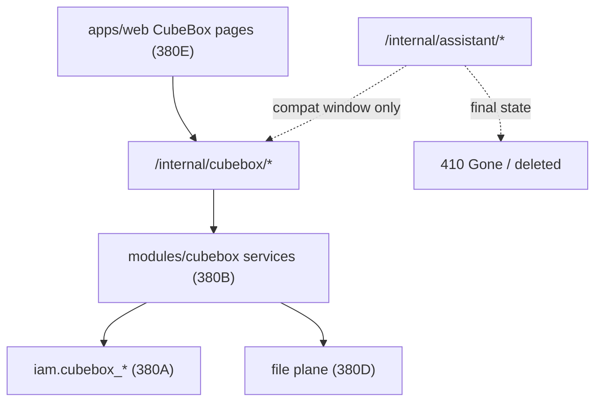

# DEV-PLAN-380C：CubeBox API/DTO 收口与 `/internal/assistant/*` 退役

**状态**: 草拟中（2026-04-15；`380B` 已完成并满足本文启动前提，但 `380D/files`、formal entry successor、旧 API 退役矩阵与门禁证据仍未收口，尚未进入旧 API 正式退役批次）

> 本文从 `DEV-PLAN-380` 拆分而来，作为 `CubeBox` API/DTO 收口、命名空间冻结、错误语义统一与旧 `/internal/assistant/*` 正式退役的实施 SSOT。  
> `DEV-PLAN-380A` 持有 PostgreSQL 数据面 contract；`DEV-PLAN-380B` 持有后端正式实现面切换；`DEV-PLAN-380D/380E/380F/380G` 分别继续持有文件面、前端面、旧资产退役与最终回归封板。本文只裁决“外部 API 面与 DTO 面什么叫完成、如何切换、何时允许删除旧命名空间”。

## 1. 背景与上下文 (Context)

- **需求来源**:
  - `docs/dev-plans/380-cubebox-first-party-ownership-and-librechat-retirement-plan.md`
  - `docs/dev-plans/380a-cubebox-postgresql-data-plane-and-migration-contract.md`
  - `docs/dev-plans/380b-cubebox-backend-formal-implementation-cutover-plan.md`
  - `docs/dev-plans/380d-cubebox-file-plane-formalization-plan.md`
  - `docs/dev-plans/380e-cubebox-apps-web-frontend-convergence-plan.md`
- **当前痛点**:
  - `/internal/cubebox/*` 与 `/internal/assistant/*` 仍并存；虽然 `380B` 已把后端主链切到 formal implementation，但旧命名空间尚未进入清晰、可测试、可审计的退役状态机。
  - 现有 API/DTO 仍混杂 `assistant` 历史命名、`poll_uri` 改写、旧错误码和旧 runtime-status 语义，外部契约没有真正冻结为 `CubeBox` 一方口径。
  - 若在 `380B` 未完成前提前删除 `/internal/assistant/*`，只是把“后端仍未独立”的问题转移成线上 API 风险，不符合 Greenfield “先切主链、再删桥接”的原则。
  - 若继续长期保留双命名空间，则会形成新的 legacy 双链路，直接违背 `004M1` 的单链路原则。
- **评审确认的外部契约缺口（当前工作区）**:
  - successor 路由已存在，但 `cubebox` 仍未形成完整、稳定、唯一正式 DTO 面。
  - 旧 `/internal/assistant/*` 尚未被冻结为“只读过渡 / 410 Gone / 删除完成”的明确阶段之一。
  - 路由 allowlist、capability-route-map、authz、error-message 与 API 命名空间切换尚未形成统一批次说明。
  - `files`、`models`、`runtime-status` 的对外字段口径仍可能受 `assistant` 历史结构牵引，尚未完全转为 `CubeBox` 契约语言。
- **路线图分析（380 主线依赖）**:
  - `380A` 先冻结底层数据面与表/仓储 contract，保证 API 收口不会建立在漂移数据面上。
  - `380B` 已完成并提供后端正式实现面前提，因此本文不再等待“后端是否独立”这个问题，而是直接收口外部 API/DTO/退役契约。
  - `380D` 必须先冻结文件面正式 contract，本文才能把 `/internal/cubebox/files` 的 DTO/删除语义宣布为稳定完成态。
  - `380C` 完成后，`380E` 才能完全基于稳定 API/DTO 做前端收口；`380F` 才能退役 vendored/runtime/deploy 旧资产；`380G` 才能做最终封板。
- **业务价值**:
  - 让 `CubeBox` 对外真正成为一方产品面，而不是“品牌已换、路径已换、契约仍留在 assistant 历史命名”。
  - 将 API 名称、字段语义、错误码、退役策略一次性冻结，避免后续前端、E2E、文档、运维说明继续围绕双命名空间漂移。

## 2. 目标与非目标 (Goals & Non-Goals)

### 2.1 核心目标

1. [ ] 冻结 `/internal/cubebox/*` 为唯一正式 API 命名空间，并给出每条 successor 路由的完成定义。
2. [ ] 冻结 `Conversation / Turn / Task / RuntimeStatus / File / FileLink / Model` 等外部 DTO 的命名、字段、枚举、错误码与失败语义，不再让 `assistant` 历史结构体和字段名长期外溢。
3. [ ] 明确 `/internal/assistant/*` 的阶段化退役策略：哪些接口进入只读/兼容窗口，哪些接口直接 `410 Gone`，哪些接口在最终批次物理删除。
4. [ ] 同步收口 routing allowlist、capability-route-map、authz requirement、error-message 与相关测试矩阵，避免“路径改了，但门禁和错误语义没跟上”。
5. [ ] 为 `380E/380F/380G` 提供稳定前提：前端、资产退役与最终回归只依赖 `CubeBox` 正式 API/DTO，而不再依赖旧命名空间或桥接解释。

### 2.2 非目标 (Out of Scope)

1. 不在本文设计或修改 `iam.cubebox_*` PostgreSQL schema、迁移算法、回填规则与 sqlc contract；这些由 `380A` 持有。
2. 不在本文实现 `modules/cubebox` 的内部业务编排、repository、runtime adapter 与组合根；这些由 `380B` 持有。
3. 不在本文定义文件元数据 schema、存储适配器实现细节与文件删除物理策略；这些由 `380D` 持有。
4. 不在本文设计 `apps/web` 的 IA、聊天页布局或交互细节；这些由 `380E` 持有。
5. 不在本文扩张产品范围，不新增 Prompt Marketplace、Memory、Search、Agents、MCP 广场等超出 `380` 冻结范围的历史能力。

### 2.3 工具链与门禁（SSOT 引用）

- **执行入口（SSOT）**:
  - 触发器矩阵与仓库红线：`AGENTS.md`
  - 文档格式：`docs/dev-plans/000-docs-format.md`
  - 路由治理：`docs/dev-plans/017-routing-strategy.md`
  - Authz 工具链：`docs/dev-plans/022-authz-casbin-toolchain.md`
  - capability-route-map：`docs/dev-plans/156-capability-key-m3-m9-route-capability-mapping-and-gates.md`
  - 错误语义门禁：`docs/dev-plans/140-error-message-clarity-and-gates.md`
  - E2E/回归基线：`docs/dev-plans/060-business-e2e-test-suite.md`、`docs/dev-plans/064a-test-tp060-05-assistant-conversation-intent-and-tasks.md`
- **本计划命中的门禁边界**:
  - `routing`：保护 successor 路由 allowlist、route class、responder 契约不漂移。
  - `capability-route-map`：保护新旧 API 切换时 capability 映射完整、唯一、无重复注册。
  - `authz-pack && authz-test && authz-lint`：保护新命名空间 authorization requirement 与策略资产一致。
  - `error-message`：保护退役期与完成态错误码/提示稳定，不出现泛化失败文案。
  - `no-legacy`：保护 `/internal/assistant/*` 不以长期桥接或双正式链路形式继续存在。
- **记录口径**:
  - 本文只冻结“应命中哪些门禁、各门禁要保护什么边界”。
  - 实际执行命令、环境、日志、截图、接口矩阵与最终结论统一回写 readiness/dev-record，不在本文复制流水账。

## 3. 架构与关键决策 (Architecture & Decisions)

### 3.1 API 收口目标图 (Mermaid)

### 3.2 关键设计决策 (ADR 摘要)

- **决策 1：先完成 `380B`，再宣布 API 面唯一正式化**
  - **选项 A**: 直接先删 `/internal/assistant/*`。缺点：会把后端未独立的问题强行压到运行时与前端兼容层。
  - **选项 B (选定)**: 只有当 `380B` stopline 清零后，`380C` 才能进入正式退役批次。优点：主链清晰，避免“删旧 API 但新 API 仍靠旧实现支撑”。

- **决策 2：DTO 收口优先于前端与旧资产退役**
  - **选项 A**: 让前端先自适配双 DTO。缺点：会把命名漂移扩散到 `apps/web`、测试与 i18n。
  - **选项 B (选定)**: 由本文先冻结 API/DTO，再由 `380E/380F` 消费。优点：一处收口，全链路跟随。

- **决策 3：旧 `/internal/assistant/*` 不允许长期“透明代理到 cubebox”**
  - **选项 A**: 把旧路由永久 302/307 或透明转发到新路由。缺点：形成新的 legacy 入口，违反单链路原则。
  - **选项 B (选定)**: 只允许短窗口、显式、可审计的兼容态；最终必须 `410 Gone` 或删除。优点：边界清楚，可由门禁和测试断言。

- **决策 4：外部 DTO 使用 `CubeBox` 领域语言，不沿用 `assistant` 历史命名**
  - **允许**:
    - 在内部 mapper 或 cutover 过渡层短期消费 `assistant` 历史结构。
    - 为已有客户端保留极短过渡字段，但必须有删除批次与断言。
  - **禁止**:
    - 新正式响应继续输出 `assistant_*` 历史字段名作为主字段。
    - 新 API 继续依赖响应字符串改写、路径改写、或隐式 alias 才能被客户端消费。

- **决策 5：退役状态必须是显式状态机，而不是“看起来差不多就删”**
  - **冻结的阶段**:
    - `Stage C0`: `380B` 已完成，本文进入契约冻结与矩阵盘点；旧 API 不得删，也不得再新增正式能力。
    - `Stage C1`: DTO/错误码/API matrix/formal entry successor 收口完成，旧 API 进入明确兼容窗口。
    - `Stage C2`: `apps/web` 与测试全面切到 `/internal/cubebox/*`，旧 API 对外返回稳定退役语义。
    - `Stage C3`: 旧 API 删除完成，仅保留 `CubeBox` 正式命名空间。

## 4. 当前实现盘点与目标落点 (Current State vs Target Landing)

### 4.1 当前 API 面盘点

1. **已存在的 successor 资产**:
   - `/internal/cubebox/*` 路由已存在，前端与后端均可开始围绕该命名空间收口。
   - `380A` 已冻结底层 `cubebox_*` 数据面 contract，`380B` 已冻结后端正式实现面的完成定义与 stopline。
2. **当前缺口**:
   - `cubebox` API 并非完全独立实现，导致对外 DTO 面仍缺“稳定完成态”的基础。
   - 旧 `/internal/assistant/*` 未被定义为“仍正式支持”还是“已进入退役窗口”，当前语义模糊。
   - error-message、routing、capability、authz 未形成与 API 切换同批次的明确 checklist。
   - `files`、`models`、`runtime-status` 的外部字段口径仍待与 `380D/380B` 一起冻结。
3. **高风险漂移点**:
   - `poll_uri`、task detail、runtime-status 等字段易继续带入 `assistant` 路径或旧 literal。
   - 旧客户端若仍命中 `/internal/assistant/*`，缺少稳定退役文案与状态码矩阵。
   - 同一能力若在新旧命名空间都保持“正式可写”，会直接形成双写/双入口风险。

### 4.2 完成度结论（Groundwork vs Formal API Closure）

1. **已完成的 groundwork**:
   - successor 命名空间已经建立。
   - 与数据面、后端面、文件面、前端面的相邻计划已经拆分，可以承载更细的 API 收口工作。
2. **尚未完成的正式 API 收口**:
   - `380B` 已完成，`/internal/cubebox/*` 的后端独立性前提已经满足；当前未完成点转为“外部契约未冻结、旧 API 未退役完成”。
   - DTO、错误码、formal entry successor、退役阶段、兼容窗口与门禁矩阵都还未冻结为实施级别文档。
   - `/internal/assistant/*` 仍不得删除，也不能无限期保留为“另一套正式入口”。

### 4.3 完成定义、不变量与失败语义

1. **完成定义（必须同时满足）**:
   - `/internal/cubebox/*` 成为唯一正式 API 命名空间，且其外部 DTO/错误语义已冻结。
   - `/internal/assistant/*` 已进入并完成明确退役流程，不再对外承载正式业务主链。
   - routing / capability-route-map / authz / error-message / server tests / E2E 已同步切换并通过。
   - `apps/web` 与其他仓内消费者不再依赖 `/internal/assistant/*` 作为正式入口。
2. **核心不变量**:
   - 不允许长期双正式命名空间并存。
   - 不允许旧命名空间通过透明代理、永久 alias、隐式桥接长期存活。
   - 不允许 `assistant` 历史字段名继续作为 `CubeBox` 正式 DTO 主字段。
   - 文件/模型/runtime-status 等相邻面若尚未冻结内部实现，也必须先冻结外部 DTO 责任边界与临时限制。
3. **失败语义**:
   - `380B` 任一关键 stopline 未清零，则本文不得进入旧 API 正式退役批次。
   - 若前端、测试或运维链路仍依赖 `/internal/assistant/*`，则只能维持兼容窗口，不能宣布本文完成。
   - 任一路由/能力映射/error-message 未同步更新，都视为本文未完成，而不是“实现已做、门禁后补”。

### 4.4 目标职责边界与承载点

1. **本文持有**:
   - 对外 HTTP path、method、response shape、error code、compat window、retirement status 的冻结。
   - 新旧命名空间并行期的允许范围、禁止事项与结束条件。
   - 路由/能力/authz/error-message/API matrix/E2E 的对齐口径。
2. **本文不持有**:
   - 底层数据回填、DB schema、sqlc、repository 设计细节（`380A/380B/380D`）。
   - 前端页面 IA 与视觉实现（`380E`）。
   - vendored/runtime/deploy 资产最终删除动作（`380F`）。

## 5. API/DTO 契约矩阵 (API & DTO Contracts)

### 5.1 正式 API 命名空间冻结

1. [ ] 正式命名空间冻结为 `/internal/cubebox/*`。
2. [ ] 本文完成后，任何新增正式接口只能落在 `/internal/cubebox/*`，不得再向 `/internal/assistant/*` 增量加能力。
3. [ ] `/internal/assistant/*` 若仍短期存在，只能用于显式兼容窗口，不得作为正式文档主入口。

### 5.2 路由能力矩阵（按资源面）

> 冻结说明：本文以“目标完成态路由”作为 SSOT。  
> 当前工作区中仍存在 `{turn_action}` / `{task_id}` POST action / `DELETE /files/{file_id}` 等过渡实现；这些只允许作为 `C0/C1` 期间临时桥接，不得被当成 `380C` 完成态 contract。

1. [ ] conversations
   - `POST /internal/cubebox/conversations`
   - `GET /internal/cubebox/conversations`
   - `GET /internal/cubebox/conversations/{conversation_id}`
   - `DELETE /internal/cubebox/conversations/{conversation_id}`
2. [ ] turns
   - `POST /internal/cubebox/conversations/{conversation_id}/turns`
   - `POST /internal/cubebox/conversations/{conversation_id}/turns/{turn_id}:confirm`
   - `POST /internal/cubebox/conversations/{conversation_id}/turns/{turn_id}:commit`
   - `POST /internal/cubebox/conversations/{conversation_id}/turns/{turn_id}:reply`
3. [ ] tasks
   - `POST /internal/cubebox/tasks`
   - `GET /internal/cubebox/tasks/{task_id}`
   - `POST /internal/cubebox/tasks/{task_id}:cancel`
4. [ ] files
   - `GET /internal/cubebox/files`
   - `POST /internal/cubebox/files`
   - `DELETE /internal/cubebox/files/{file_id}`
5. [ ] models / runtime
   - `GET /internal/cubebox/models`
   - `GET /internal/cubebox/runtime-status`

6. [ ] formal entry
   - `GET /internal/cubebox/ui-bootstrap`
   - `GET /internal/cubebox/session`
   - `POST /internal/cubebox/session/refresh`
   - `POST /internal/cubebox/session/logout`

### 5.2A 过渡实现与完成态映射

1. [ ] turn action 路由
   - 过渡实现可暂存为 `POST /internal/cubebox/conversations/{conversation_id}/turns/{turn_action}`。
   - 完成态必须收口为显式 action path：`{turn_id}:confirm` / `{turn_id}:commit` / `{turn_id}:reply`。
   - `routing`、`capability-route-map`、server tests 与 E2E 必须在同一批次从泛化 `{turn_action}` 切到显式 action path。
2. [ ] task action 路由
   - 过渡实现可暂存为 `POST /internal/cubebox/tasks/{task_id}`。
   - 完成态必须收口为 `POST /internal/cubebox/tasks/{task_id}:cancel`。
   - capability-route-map 中不得继续使用 `/internal/cubebox/tasks/{task_action}` 这类与真实 path 不一致的占位定义。
3. [ ] file delete 路由
   - 完成态冻结为 `DELETE /internal/cubebox/files/{file_id}`。
   - 不允许将 `DELETE /internal/cubebox/files` 作为正式 contract 写入文档、测试或 capability registry。
4. [ ] 兼容原则
   - 任何过渡 action path 只允许在 `C0/C1` 存在，并必须在 readiness 中登记“现状 path / 目标 path / 删除批次”。
   - 不允许为了解耦前后端节奏而长期保留双 action path。

### 5.2B formal entry 完成态矩阵

1. [ ] `GET /internal/cubebox/ui-bootstrap`
   - 承接 `apps/web` 启动所需的最小 bootstrap 信息
   - 完成态下替代 `GET /internal/assistant/ui-bootstrap`
2. [ ] `GET /internal/cubebox/session`
   - 承接 `apps/web` 启动与恢复所需的会话态读取
   - 完成态下替代 `GET /internal/assistant/session`
3. [ ] `POST /internal/cubebox/session/refresh`
   - 承接前端刷新会话逻辑
   - 完成态下替代 `POST /internal/assistant/session/refresh`
4. [ ] `POST /internal/cubebox/session/logout`
   - 承接前端退出登录逻辑
   - 完成态下替代 `POST /internal/assistant/session/logout`
5. [ ] 边界
   - 上述 successor path 由本文作为 API SSOT 冻结；`380E` 只消费，不再二次定义或改名
   - `model-providers*` 不进入 `CubeBox` 正式 API，不提供 successor path

### 5.3 DTO 命名冻结规则

1. [ ] 对外 DTO 命名使用 `cubebox` 领域语言，不使用 `assistant` 作为主命名。
2. [ ] `conversation / turn / task / runtime_status / file / file_link / model` 的字段命名与枚举值必须以 `CubeBox` 文档口径为准，不再把 `assistant` 历史内部字段直接透出。
3. [ ] 若兼容窗口需要保留旧字段：
   - 必须记录“保留原因、开始时间、删除批次、替代字段”。
   - 必须由测试断言兼容窗口结束后删除。

### 5.3A DTO 字段冻结表（完成态最小上界）

1. [ ] `Conversation`
   - 最小字段：`conversation_id`、`state`、`current_phase`、`created_at`、`updated_at`
   - 列表页可额外返回：`last_turn_preview`、`last_turn_at`
   - 禁止透出：`assistant_*` 命名字段、内部 PG 主键、内部仓储游标结构体
2. [ ] `Turn`
   - 最小字段：`turn_id`、`conversation_id`、`user_input`、`state`、`phase`、`created_at`、`updated_at`
   - 可返回：`clarification`、`missing_fields`、`candidate_options`、`commit_reply`
   - 禁止透出：内部 route-decision 调试结构、authoritative gate 原始内部对象、未裁剪的 runtime 私有字段
3. [ ] `Task`
   - 最小字段：`task_id`、`conversation_id`、`turn_id`、`status`、`submitted_at`、`started_at`、`finished_at`、`poll_uri`
   - `task_type` 在 `380C` 完成态冻结为兼容例外：
     - 对外继续暴露当前正式运行 literal `assistant_async_plan`
     - 该 literal 仅是与 `380A`/现网数据面保持一致的过渡兼容值，不构成 `CubeBox` 命名规则示范
     - 理由：避免在 `380C` 同批次引入第二轮 task literal 迁移，导致 API 收口与数据迁移耦合
   - 若未来要收口为 `cubebox_*` literal，必须新开后续子计划并提供迁移/兼容窗口、删除批次与回归断言；不得在本文实施期隐式切换
4. [ ] `RuntimeStatus`
   - 最小字段：`backend`、`knowledge`、`model_gateway`、`file_plane`
   - 每个子项只允许暴露：`status`、`checked_at`、`message`
   - 禁止透出：`assistantSvc` 内部字段名、内部 error 对象全文、runtime adapter 私有配置
5. [ ] `File`
   - 最小字段：`file_id`、`filename`、`content_type`、`size_bytes`、`scan_status`、`created_at`
   - 与 conversation/turn 关联信息在完成态冻结为 `links[]`
   - `links[]` 元素仅允许：`link_role`、`conversation_id`、`turn_id`
   - 不再把单值 `conversation_id` 作为长期正式字段；若过渡期仍保留，必须登记删除批次
6. [ ] `Model`
   - 最小字段：`model_id`、`display_name`、`provider`、`availability_status`
   - 禁止把 provider 验证、密钥校验、模型治理后台字段直接透出到 `GET /internal/cubebox/models`

### 5.4 错误码与退役错误语义

1. [ ] 新正式 API 的错误码必须纳入 `error-message` 门禁，提供明确 en/zh 文案与 HTTP 映射。
2. [ ] 旧 `/internal/assistant/*` 进入退役阶段后，必须返回稳定错误语义，不允许模糊 404/500 混用。
3. [ ] 本文冻结以下退役期原则：
   - 仍在兼容窗口内的旧接口：返回与迁移说明一致的明确响应。
   - 已退役接口：优先 `410 Gone`，并附稳定错误码与迁移指引。
   - 已物理删除接口：只允许出现在最终阶段，且前提是仓内所有消费者和测试均已切走。

### 5.4A 最小错误码冻结表

1. [ ] conversations
   - `cubebox_conversation_create_failed` -> `500`
   - `cubebox_conversation_not_found` -> `404`
   - `cubebox_conversation_delete_blocked` -> `409`
2. [ ] turns
   - `cubebox_turn_not_found` -> `404`
   - `cubebox_turn_action_invalid` -> `409`
   - `cubebox_turn_confirm_required` -> `409`
3. [ ] tasks
   - `cubebox_task_not_found` -> `404`
   - `cubebox_task_cancel_invalid_state` -> `409`
   - `cubebox_task_snapshot_incompatible` -> `409`
4. [ ] files
   - `cubebox_file_not_found` -> `404`
   - `cubebox_file_delete_blocked` -> `409`
   - `cubebox_file_upload_invalid` -> `400`
5. [ ] retirement
   - `assistant_api_deprecated` -> 兼容窗口中的明确迁移提示
   - `assistant_api_gone` -> `410`
6. [ ] 原则
   - `403` / `401` 仍由统一 authz/authn 语义承接，不在本文另起第二套错误码
   - 同一失败语义不允许在新旧命名空间上分别漂移出两套不同 literal

### 5.4B 退役期错误响应 envelope 冻结

1. [ ] Internal API 的 JSON 错误响应继续统一使用 `internal/routing/responder.go` 的 `routing.ErrorEnvelope`，不新增第二套 envelope：
   - `code`
   - `message`
   - `trace_id`
   - `meta.path`
   - `meta.method`
2. [ ] 兼容窗口中的旧 `/internal/assistant/*` 若返回 JSON 错误，必须沿用同一 `ErrorEnvelope` 结构，只允许更换稳定错误码与 message，不允许私自扩展第二套 retirement body。
3. [ ] `assistant_api_deprecated` 与 `assistant_api_gone` 至少必须满足：
   - `code` 为稳定错误码
   - `message` 为明确迁移提示，不得回退到泛化 `*_failed`
   - `meta.path` / `meta.method` 可支撑日志、测试与排障定位
4. [ ] HTML/UI route 的呈现仍遵循统一 responder 规则；本文只冻结 Internal API JSON envelope，不复制第二套 UI HTML 契约。

### 5.5 `poll_uri`、runtime-status 与路径生成规则

1. [ ] `poll_uri` 必须直接生成 `/internal/cubebox/tasks/{task_id}`，禁止依赖响应后字符串改写。
2. [ ] runtime-status 对外只暴露 `CubeBox` 产品需要的稳定字段，不泄露 `assistantSvc` 内部实现细节。
3. [ ] 任何链接字段、redirect 字段、action URI 字段都必须直接产出 `cubebox` 正式路径，不能由客户端或 middleware 猜测改写。

### 5.6 文件与模型 DTO 的相邻边界

1. [ ] 文件面字段与删除/引用规则，以 `380D` 为实现/数据契约 SSOT；本文只冻结其对外 API 命名与退役节奏。
2. [ ] 模型面只承接 `CubeBox` 运行所需的正式只读展示，不扩大为通用模型治理平台。
3. [ ] 若文件或模型字段在 `380D/380B` 尚未最终定型，本文仍需先定义“允许返回哪些字段、禁止暴露哪些内部字段”的上界。

### 5.7 旧 `/internal/assistant/*` 全量退役矩阵

1. [ ] conversations / turns / tasks / models / runtime-status
   - 由 `380C` 直接持有兼容窗口、`410 Gone` 与删除批次
2. [ ] `GET /internal/assistant/model-providers`
   - 不进入 `CubeBox` 正式 API
   - 进入 `C2` 后直接 `410 Gone`
3. [ ] `POST /internal/assistant/model-providers:validate`
   - 不进入 `CubeBox` 正式 API
   - 进入 `C2` 后直接 `410 Gone`
4. [ ] `GET /internal/assistant/ui-bootstrap`
   - successor 为 `GET /internal/cubebox/ui-bootstrap`
   - 作为 assistant formal entry 残留接口单独登记
   - 必须在 `380E` 前端切走后进入 `410 Gone`
5. [ ] `GET /internal/assistant/session`
   - successor 为 `GET /internal/cubebox/session`
   - 必须在 `380E` 切走后进入 `410 Gone`
6. [ ] `POST /internal/assistant/session/refresh`
   - successor 为 `POST /internal/cubebox/session/refresh`
   - 与 session 同批退役，不允许无限期因为前端 convenience 留存
7. [ ] `POST /internal/assistant/session/logout`
   - successor 为 `POST /internal/cubebox/session/logout`
   - 与 session 同批退役，不允许无限期因为前端 convenience 留存
8. [ ] 完成条件
   - 上述所有 `/internal/assistant/*` 路由都必须在 readiness 中标明其所属类别：
     - `successor in cubebox`
     - `gone without successor`
     - `temporary keep until 380E`
   - 不允许存在“既不在文档里、也没删除”的悬空 assistant 路由

## 6. 核心切换算法与实施批次 (Cutover & Retirement Plan)

### 6.1 Phase C0：契约冻结与前提校验

1. [ ] 冻结 successor API matrix、DTO 命名、错误码范围、退役状态机。
2. [ ] 明确 `380B` 是主 API 面的启动 stopline，`380D` 是文件 API 面的启动 stopline；任一未完成前不得把对应资源面宣布为正式完成态，也不得进入旧 API 正式退役。
3. [ ] 盘点仓内消费者：
   - `apps/web`
   - server tests / integration tests
   - e2e specs
   - 文档、示例、脚本、调试入口
4. [ ] 冻结 `/internal/assistant/*` 当前剩余责任与预期删除批次。

**当前状态**:
- [ ] 本文尚未形成与 `380A/380B` 对齐的细颗粒 contract。
- [ ] `380B` 已完成并满足启动前提；`380D/files`、formal entry successor 与退役矩阵仍未收口，因此 C1/C2/C3 不能被提前视为已完成。

### 6.2 Phase C1：`/internal/cubebox/*` DTO 与错误语义收口

1. [ ] 将 conversations/turns/tasks/files/models/runtime-status 的响应字段整理成正式 DTO 矩阵。
2. [ ] 收敛所有路径生成字段、action 字段、`poll_uri`、status 枚举与错误码 literal。
3. [ ] 清理对外响应中残留的 `assistant`/`LibreChat` 历史命名。
4. [ ] 为每个新增或调整错误码补充 `error-message` 映射与测试。

**进入条件**:
- [ ] `380B` 已完成或至少达到“API 所依赖的 backend stopline 全部清零”的启动标准。
- [ ] 对 `files` 资源面，`380D` 已冻结文件删除/引用/links contract；否则 files DTO 只能保持临时上界，不得宣布最终完成。

**当前状态**:
- [ ] 当前工作区仍缺完整 DTO matrix 与错误码/枚举冻结表。

### 6.3 Phase C2：旧 `/internal/assistant/*` 进入显式兼容窗口

1. [ ] 明确仍需短期保留的旧接口清单，以及保留原因。
2. [ ] 对保留接口给出固定兼容策略：
   - 只读兼容
   - 显式退役告警
   - 稳定迁移错误码/提示
3. [ ] 禁止任何旧接口继续承载新的正式写路径或新增能力。
4. [ ] 路由 allowlist、capability-route-map、authz requirement 与文档说明同步标注“兼容窗口中”。
5. [ ] `ui-bootstrap/session/session-refresh/session-logout` 等 assistant formal entry 残留接口必须一并进入兼容窗口管理，不允许游离在退役矩阵之外。

**当前状态**:
- [ ] 旧接口尚未被分类为“继续兼容”还是“直接退役”，仍处于语义模糊状态。

### 6.4 Phase C3：仓内消费者全面切走 `/internal/assistant/*`

1. [ ] `apps/web` 全量切到 `/internal/cubebox/*`。
2. [ ] server/integration tests 不再以 `/internal/assistant/*` 为正式断言入口。
3. [ ] E2E、脚本、文档、示例、README、dev-record 模板全部改为 `cubebox` 正式 API。
4. [ ] 确认不存在隐藏消费者继续依赖旧命名空间。

**当前状态**:
- [ ] `380E` 仍在草拟中，前端尚未以本文为基础全面切到正式 API 面。

### 6.5 Phase C4：旧 API 退役落地（`410 Gone` / 删除）

1. [ ] 对兼容窗口结束的旧接口，返回稳定 `410 Gone` + 迁移错误码/提示。
2. [ ] 当所有仓内消费者、测试、文档与部署面都已切走后，物理删除旧 `/internal/assistant/*` 路由与其配套代码。
3. [ ] 删除后再次回归：
   - routing
   - capability-route-map
   - authz
   - error-message
   - test / e2e / preflight

**当前状态**:
- [ ] 尚不具备进入本批次的前提。

### 6.6 Phase C5：进入 `380F/380G`

1. [ ] 以旧 API 退役完成作为 `380F` 资产退役的输入前提。
2. [ ] 以 API/DTO 完成态作为 `380G` 最终回归与封板验收的输入前提。

**当前状态**:
- [ ] `380F/380G` 仍依赖本文完成，不可提前封板。

## 7. 与相邻子计划的边界 (Plan Boundaries)

### 7.1 与 `380A` 的边界

`380A` 持有：

1. `iam.cubebox_*` 表、约束、迁移、回填与 sqlc contract。
2. 数据面如何支撑 `/internal/cubebox/*`，以及历史数据怎样迁移。

`380C` 只消费这些 contract，并冻结外部 API/DTO 命名与状态语义。

### 7.2 与 `380B` 的边界

`380B` 已完成后：

1. `380C` 不再持有“后端是否独立”的裁决，而只负责消费 `380B` readiness 证据。
2. `380C` 可以进入契约冻结、兼容窗口与退役批次设计，但不得改写 `380B` 已冻结的后端实现边界。

`380C` 持有：

1. 对外 API 面完成定义。
2. 旧 `/internal/assistant/*` 的兼容窗口、`410 Gone` 与删除批次。

### 7.3 与 `380D` 的边界

`380D` 持有：

1. 文件元数据/引用关系/存储适配器/删除保护的实现 contract。
2. `links[]`、删除阻断、对象删除策略的底层事实源。

`380C` 持有：

1. `/internal/cubebox/files` 对外 path、response shape、错误码与退役节奏。
2. 只在 `380D` contract 已冻结后，宣布 files DTO 完成态；否则只允许定义字段上界与禁出字段。

### 7.4 与 `380E` 的边界

`380E` 持有：

1. `apps/web` 页面、导航、状态流、测试与 IA 收口。

`380C` 持有：

1. `380E` 要消费的稳定 API/DTO/错误语义。

### 7.5 与 `380F/380G` 的边界

1. `380F` 只在本文完成后，才能删除与旧 API/runtime/deploy 相关的历史资产。
2. `380G` 以本文冻结的 API matrix、退役完成态与门禁结果作为最终封板依据之一。

## 8. 依赖与里程碑 (Dependencies & Milestones)

### 8.1 依赖关系（380 主线分析）

1. [ ] `380B -> 380C`：后端正式实现面不独立，则 API/DTO 不能真正唯一化。
2. [ ] `380D -> 380C(files)`：文件面 contract 未冻结，则 files DTO/删除语义不能宣布完成。
3. [ ] `380C -> 380E`：前端只有在 API/DTO 收口后，才能结束双命名空间消费。
4. [ ] `380C -> 380F`：旧 API 未退役，旧 runtime/deploy/vendored 资产不能安全删除。
5. [ ] `380C -> 380G`：最终封板必须证明只剩 `CubeBox` 正式命名空间。

### 8.2 里程碑

1. [ ] M0：本文颗粒冻结，与 `380A/380B` 对齐完成。
2. [ ] M1：路由完成态矩阵、DTO 字段冻结表、最小错误码表冻结。
3. [ ] M2：routing / capability / authz / error-message 对齐完成。
4. [ ] M3：旧 `/internal/assistant/*` 全量接口进入显式兼容窗口管理。
5. [ ] M4：仓内消费者与测试全面切到 `/internal/cubebox/*`。
6. [ ] M5：旧 API 返回稳定退役语义，并完成代码删除。
7. [ ] M6：向 `380F/380G` 输出 readiness 证据。

## 9. 测试与验收标准 (Acceptance Criteria)

### 9.1 API matrix 测试

1. [ ] `/internal/cubebox/*` 全量资源面均有成功/失败/鉴权/租户隔离断言。
2. [ ] 旧 `/internal/assistant/*` 的兼容窗口与退役返回有稳定断言。
3. [ ] DTO 字段、错误码、`poll_uri`、links/path 字段有明确 snapshot 或结构断言。
4. [ ] 兼容窗口与 `410 Gone` 场景的 JSON 错误响应必须断言 `routing.ErrorEnvelope` 最小字段：`code/message/trace_id/meta.path/meta.method`。
5. [ ] 路由完成态与 capability-route-map 的 path literal 一致，不再存在 `{task_action}` 这类与真实 path 不一致的注册项。

### 9.2 集成与 E2E 测试

1. [ ] server/integration tests 覆盖新命名空间主链。
2. [ ] `apps/web` 与 E2E 用例不再依赖旧命名空间作为主入口。
3. [ ] 当旧 API 退役后，有专门断言验证旧调用返回预期退役状态，而不是回落为 404/500。
4. [ ] `assistant formal entry` 残留接口的 successor / gone 行为也有专门断言，不允许只测 conversations/tasks 主链。

### 9.3 命中门禁与验收口径

1. [ ] `make check routing`
2. [ ] `make check capability-route-map`
3. [ ] `make authz-pack && make authz-test && make authz-lint`
4. [ ] `make check error-message`
5. [ ] `make check no-legacy`
6. [ ] 命中 Go/server/API 实现变更时，对应 `go fmt ./... && go vet ./... && make check lint && make test`
7. [ ] 命中前端消费面时，对应 `380E` 的前端检查与页面回归一并通过。

### 9.4 Readiness 证据

1. [ ] 新建并回写 `docs/dev-records/DEV-PLAN-380C-READINESS.md`
2. [ ] 附 API matrix、旧 API 兼容/退役矩阵、门禁结果与关键截图/日志摘要。
3. [ ] 明确记录：
   - `380B` 完成证据引用
   - `380D` 文件面 contract/完成证据引用（若本批次命中文件 API）
   - 前端切换证据引用（`380E`）
   - 旧资产删除前提引用（`380F`）

## 10. 运维与监控 (Ops & Monitoring)

### 10.1 运行保护（Greenfield）

1. [ ] 退役窗口内不允许同时开放“双正式可写”入口。
2. [ ] 任一租户/API path/capability 映射不一致时，必须 fail-closed，而不是静默回退到旧 API。
3. [ ] 旧 API 的退役提示必须可审计、可复现，不允许依赖人工口头约定。

### 10.2 关键日志

1. [ ] 记录旧 API 命中次数、接口名、租户、principal、状态码与退役阶段。
2. [ ] 记录 `cubebox` 正式 API 的关键失败码与路径，支撑切换期排障。
3. [ ] 若存在兼容窗口，应能区分“旧 API 仍被谁调用”与“新 API 主链是否稳定”。
4. [ ] 需要额外区分 assistant formal entry 残留接口命中，避免它们伪装成“主业务 API 仍有旧调用”。

### 10.3 Stopline

出现以下任一情况，禁止宣布 `380C` 完成，且不得进入 `380F/380G` 的正式退役/封板批次：

1. [ ] `380B` 关键 stopline 未清零，`/internal/cubebox/*` 仍不是独立正式后端实现。
2. [ ] `files` 资源面在 `380D` contract 未冻结前，被提前宣布为正式 DTO/删除完成态。
3. [ ] `/internal/assistant/*` 仍被仓内正式消费者依赖，但未进入显式兼容窗口管理。
4. [ ] assistant formal entry 残留接口（`ui-bootstrap/session/*`、`model-providers*`）未被纳入退役矩阵。
5. [ ] 仍存在双正式可写 API，或旧 API 通过透明代理/永久 alias 长期存活。
6. [ ] routing / capability-route-map / authz / error-message 任一未同步通过。
7. [ ] 旧 API 退役行为没有稳定测试断言，或退役后仅表现为模糊 404/500。
8. [ ] `apps/web`、E2E、文档、脚本仍以 `/internal/assistant/*` 作为正式主入口。
9. [ ] 路由完成态 path 与 capability-route-map/path literal 不一致，仍依赖 `{turn_action}` / `{task_action}` 之类泛化占位继续漂移。

> 当前工作区评审结论：`380B` 已完成，stopline 1 不再是当前阻塞项；但 stopline 2/3/4/6/8/9 至少仍未关闭，因此本文状态仍只能保持“草拟中/未完成”，不能把 successor 路由存在视作 API 面已经正式收口。
