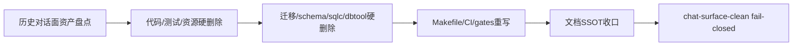

# DEV-PLAN-436：CubeBox 历史对话面彻底删除与仓面清场方案

**状态**: 规划中（2026-04-20 11:06 CST）

## 0. 适用范围与评审分级

- **评审分级**：`T3`
- **范围一句话**：以 `DEV-PLAN-430` 为唯一新主线，在新 CubeBox（丘宝）实现开始前，物理删除仓内所有历史 `assistant` / LibreChat / 旧对话运行面及其 compat window / retired semantics / 对应测试 / 生成物 / 静态资产 / DB 对象 / CI 门禁 / 文档活体引用；`cubebox` 一词仅允许作为 `430-436` 新主线规划命名存在，不再允许承载旧运行时实现或退役兼容语义。
- **关联模块/目录**：`AGENTS.md`、`docs/dev-plans`、`docs/dev-records`、`internal/server`、`modules/cubebox`、`apps/web`、`config/**`、`migrations/**`、`scripts/**`、`third_party/**`、`deploy/**`、`e2e/**`
- **关联计划/标准**：`AGENTS.md`、`docs/dev-plans/000-docs-format.md`、`docs/dev-plans/012-ci-quality-gates.md`、`docs/dev-plans/301-go-test-layering-and-best-practices-remediation-plan.md`、`docs/dev-plans/430-cubebox-ide-conversation-assistant-rebuild-architecture-plan.md`、`docs/dev-plans/431-codex-ui-protocol-and-shell-reuse-plan.md`、`docs/dev-plans/432-codex-session-persistence-reuse-plan.md`、`docs/dev-plans/433-bifrost-centric-ai-gateway-reuse-and-reconstruction-plan.md`、`docs/dev-plans/434-codex-context-management-and-compaction-reuse-plan.md`、`docs/dev-plans/435-bifrost-centric-model-config-ui-and-admin-governance-plan.md`
- **用户入口/触点**：无直接用户功能交付；本计划交付的是“清空旧面对话面残留，给 `430-435` 新实现提供零历史耦合基线”。

### 0.1 Simple > Easy 三问

1. **边界**：`436` 只做“删除历史面并清空依赖”，不复用旧实现、不保留退役语义；`cubebox` 新主线命名仅限 `430-436` 及其后续新实现，不把当前仓内旧 `assistant/librechat/cubebox runtime` 资产当成脚手架。
2. **不变量**：仓内活体实现、活体测试、活体门禁、活体运行时、活体文档不得继续存在任何历史 `assistant` / LibreChat / 旧 `cubebox` 运行面；若仍需保留历史证据，只允许停留在 `docs/archive/**` 或外部提交历史，不允许继续以代码、脚本、迁移、静态资源、测试、技能说明或活体计划形式存在。
3. **可解释**：reviewer 必须能在 5 分钟内说明“哪些目录会被硬删、哪些引用会被断开、为什么这不会再形成兼容窗”，并能明确 `430-435` 之后的新实现不会踩在旧栈之上。

### 0.2 现状研究摘要

- **现状实现**：
  - `internal/server` 仍存在大量 `assistant_*`、`assistant_knowledge_*`、`assistant_knowledge_md/**` 与旧 `cubebox*` 运行时代码。
  - `modules/cubebox/**`、`apps/web/src/pages/cubebox/**`、`apps/web/src/api/cubebox*.ts`、`cmd/dbtool/cubebox_*`、`migrations/iam/*assistant*`、`migrations/iam/*cubebox*`、`modules/iam/infrastructure/persistence/schema/*assistant*|*cubebox*` 仍是活体代码与数据面残留。
  - `third_party/librechat-web/**`、`internal/server/assets/librechat-web/**`、`deploy/librechat/**`、`scripts/librechat/**`、`scripts/librechat-web/**` 仍在仓内。
  - `Makefile`、`.github/workflows/quality-gates.yml`、`scripts/ci/**` 仍保留多条 `assistant-*` 专项门禁。
- **现状约束**：
  - `430` 第 0.2 节已明确旧栈只允许作为历史证据，不再构成现行 PoR、子计划依赖或完成定义。
  - `430` 第 0.1 节已冻结“不复用旧 assistant、旧 CubeBox 或 LibreChat 的任何代码、路由、表、错误码、测试或第三方资产”。
  - 当前仓内仍有大量活体历史资产，与 `430` 的 clean baseline 目标冲突。
- **最容易出错的位置**：
  - 文档已切主线，但代码/迁移/门禁未清空，导致“名义重做、实际复用旧栈”。
  - 只删 handler 不删 migration/schema/sqlc/e2e/静态资源，形成半死不活的第二主链。
  - 保留 `410 Gone`、redirect alias、compat tests、retired error codes，会继续把旧面当成活体 contract。
  - 若继续用“全仓禁 `cubebox` 词汇”或“默认放行全部 `cubebox` 命中”这两种粗暴口径，都会把 `430-436` 新主线文档与旧运行时残留混在一起，导致门禁不可执行或继续漏网。
- **本次不沿用的“容易做法”**：
  - 不保留任何 compat window。
  - 不保留任何 retired semantics 作为“说明性空壳”。
  - 不做重命名迁移，不把 `assistant_*` 改名成 `legacy_*`。
  - 不保留旧测试“证明已删除”。
  - 不保留旧 migration/schema/sqlc 作为未来参考模板。

## 1. 背景与上下文

- `DEV-PLAN-430` 已把 CubeBox 重做定义为全新一方模块，并明确拒绝复用旧 `assistant`、旧 `CubeBox` 与 LibreChat 资产。
- 当前仓库仍保留大批历史实现、退役语义、兼容窗口、脚本、门禁和测试，这会让 `430-435` 变成“在旧地基上继续补丁”，而不是彻底重做。
- 因此在 `430-435` 的新实现切片继续推进前，必须先执行一次“硬删除清场”，把所有历史对话面从活体仓面彻底移除。

## 2. 目标与非目标

### 2.1 核心目标

- [ ] 物理删除仓内全部历史 `assistant` / LibreChat / 旧 `cubebox` 运行面活体代码、测试、脚本、静态资源、第三方资产与生成物。
- [ ] 物理删除与历史对话面直接绑定的 DB schema、migration、sqlc、dbtool、config、routing、error catalog、CI gate、E2E 资产。
- [ ] 将活体文档和门禁改写为“只承认 `430-435` 新方案”，不再保留旧面对话面专项 gate 或兼容说明。
- [ ] 建立新的 `chat-surface-clean` stopline：凡出现历史关键词或历史路径，一律阻断。

### 2.2 非目标

- 不在本计划内直接实现新的 `430-435` 代码。
- 不在本计划内保留任何历史 API、错误码、路由别名、退役页或说明页。
- 不在本计划内讨论“是否还要迁移旧数据到新系统”；若未来需要历史数据迁移，应由新 CubeBox 数据面计划从零重新定义，而不是依赖旧对象继续存在。
- 不为了“保留证据”继续保留旧测试、旧静态页、旧第三方源码、旧 dbtool 或旧 schema。

### 2.3 用户可见性交付

- **用户可见入口**：无。
- **最小可操作闭环**：开发者执行本计划后，仓内不存在任何可运行、可编译、可测试、可部署的历史对话面入口；后续只能从 `430-435` 新链路开始重新实现。
- **当前如何验收不是僵尸功能**：以删除结果、门禁结果和引用扫描结果作为验收对象，而不是以用户页面验收。

## 2.4 工具链与门禁（SSOT 引用）

- **命中触发器（勾选）**：
  - [X] Go 代码
  - [X] `apps/web/**` / presentation assets / 生成物
  - [X] i18n（仅 `en/zh`）
  - [X] DB Schema / Migration / Backfill / Correction
  - [X] sqlc
  - [X] Routing / allowlist / responder / capability-route-map
  - [X] AuthN / Tenancy / RLS
  - [X] Authz（Casbin）
  - [X] E2E
  - [X] 文档 / readiness / 证据记录
  - [X] 其他专项门禁：`chat-surface-clean`、历史 `assistant-*` 门禁拆除与 CI 接线重构

- **本次引用的 SSOT**：
  - `AGENTS.md`
  - `docs/dev-plans/000-docs-format.md`
  - `docs/dev-plans/012-ci-quality-gates.md`
  - `docs/dev-plans/301-go-test-layering-and-best-practices-remediation-plan.md`
  - `docs/dev-plans/430-cubebox-ide-conversation-assistant-rebuild-architecture-plan.md`
  - `Makefile`
  - `.github/workflows/quality-gates.yml`

## 2.5 测试设计与分层

| 层级 | 本计划承接内容 | 代表对象/文件 | 说明 |
| --- | --- | --- | --- |
| `pkg/**` | 无 | 无 | 本计划不通过新增纯函数测试兜底删除动作 |
| `modules/*/services` | 删除旧模块后，仅保留编译通过验证 | `modules/cubebox/**` 删除后不再存在 | 不保留旧模块测试 |
| `internal/server` | 删除旧 handler / compat / retired 入口、知识运行时与 embed 目录后，验证剩余服务编译与路由门禁一致 | `internal/server/**` | 不保留历史 `assistant_*` / `assistant_knowledge_*` / 旧 `cubebox_*` 测试 |
| `apps/web/src/**` | 删除旧页面/API client 后，仅验证剩余前端编译/测试通过 | `apps/web/**` | 不保留旧 `cubebox` 页面测试 |
| `E2E` | 删除历史 assistant/librechat/旧 cubebox 旧链路 spec 与 helper | `e2e/tests/tp220* tp283* tp284* tp288* tp290*`、`e2e/tests/helpers/assistant-*` 等 | 不以负向退役断言继续保留历史 E2E |

- **黑盒 / 白盒策略**：
  - 本计划不新增“删除证明型”白盒测试。
  - 以扫描脚本、编译、路由/门禁通过、无引用结果作为主要验收。

- **前端测试原则**：
  - 删除旧页面及其测试，不引入新的占位测试。

## 3. 架构与关键决策

### 3.1 5 分钟主流程

- **主流程叙事**：先冻结删除边界，再批量删除代码、测试、静态资产、第三方源码、DB 对象、脚本与门禁，最后用新的反回流扫描与编译结果证明仓内已无旧面对话面活体资产。
- **失败路径叙事**：若删除后仍有旧关键词或旧对象引用，直接视为 stopline 未清零，不允许进入 `430-435` 实现。
- **恢复叙事**：恢复只能依赖 Git 历史，不允许在活体仓内保留“以防万一”的 compat 或 retired 空壳。

### 3.2 模块归属与职责边界

- **owner module**：本计划不保留旧 owner；删除完成后，新的对话模块 owner 仅能由 `430-435` 重新定义。
- **交付面**：仓库治理、代码删除、门禁删除、文档收口。
- **跨模块交互方式**：不做跨模块复用；历史模块全部移除。
- **组合根落点**：删除 `modules/cubebox/module.go`、`links.go` 及旧 `internal/server/cubebox_links.go`，后续新组合根由 `430-435` 重新建立。

### 3.3 ADR 摘要

- **决策 1**：硬删除，不做兼容保留
  - **备选 A**：保留 `410 Gone`/compat window
  - **备选 B**：只隐藏入口，代码继续留仓
  - **选定理由**：`430` 已明确“不复用旧代码/路由/表/测试/第三方资产”；保留任何 compat/retired 资产都会持续制造第二主链。

- **决策 2**：删除旧 DB 对象，而不是继续保留 migration/schema/sqlc 当历史模板
  - **备选 A**：保留 schema/migration，仅停用运行时
  - **备选 B**：保留 dbtool/backfill 供以后查阅
  - **选定理由**：新 CubeBox 数据面必须由 `432/433/434/435` 重新定义；旧对象继续存在会把历史数据契约误当成新实现前提。

- **决策 3**：删除旧专项门禁，而不是继续围绕 `assistant-*` 做治理
  - **备选 A**：保留旧 assistant gate，再补几个排除项
  - **备选 B**：把旧 gate 改名但逻辑不变
  - **选定理由**：历史 gate 的存在本身就说明活体实现仍以旧面对话面为中心；`436` 之后只允许保留面向“历史栈不得回流”的统一门禁。

### 3.4 Simple > Easy 自评

- **这次保持简单的关键点**：不保留过渡层、不保留 alias、不保留 retired error、不给旧实现续命。
- **明确拒绝的“容易做法”**：
  - [X] legacy alias / 双链路 / fallback
  - [X] 第二写入口 / controller 直写表
  - [X] 页面内自造第二套 object/action/capability 拼装
  - [X] 为过测临时加死分支或兼容层
  - [X] 复制一份旧页面/旧 DTO/旧 store 继续改

## 4. 删除对象清单

### 4.1 代码与测试

1. `internal/server/assistant_*`
2. `internal/server/assistant_knowledge_*`
3. `internal/server/assistant_knowledge_md/**`
4. `internal/server/cubebox_*`
5. `internal/server/librechat_*`
6. `modules/cubebox/**`
7. `apps/web/src/pages/cubebox/**`
8. `apps/web/src/api/cubebox*.ts`
9. `cmd/dbtool/cubebox_*`
10. `e2e/tests/*assistant*`
11. `e2e/tests/*librechat*`
12. `e2e/tests/*cubebox*`
13. `e2e/tests/helpers/assistant-*`

### 4.2 静态资产与第三方源码

1. `third_party/librechat-web/**`
2. `internal/server/assets/librechat-web/**`
3. `deploy/librechat/**`
4. `scripts/librechat/**`
5. `scripts/librechat-web/**`
6. `docs/dev-records/assets/dev-plan-240f/**`
7. `docs/dev-records/assets/dev-plan-246b/**`
8. `docs/dev-records/assets/dev-plan-266/**`
9. `docs/dev-records/assets/dev-plan-285/**`
10. `docs/dev-records/assets/dev-plan-288b/**`
11. `docs/dev-records/assets/dev-plan-290b/**`

### 4.3 配置、门禁与错误语义

1. `config/assistant/**`
2. 所有 `assistant_*`、`cubebox_*`、`librechat_*` 历史错误码、allowlist、capability route map 命中项
3. `Makefile` 中所有 `assistant-*` 目标与 preflight 接线
4. `.github/workflows/quality-gates.yml` 中所有 `assistant-*` 专项步骤
5. `scripts/ci/check-assistant-*.sh`
6. `tools/codex/skills/bugs-and-blossoms-dev-login/SKILL.md` 中关于旧 assistant/librechat/retired 边界的活体说明；若该 skill 仍需保留，必须改写为不再引用历史对话面

### 4.4 数据面

1. `modules/iam/infrastructure/persistence/schema/*assistant*`
2. `modules/iam/infrastructure/persistence/schema/*cubebox*`
3. `migrations/iam/*assistant*`
4. `migrations/iam/*cubebox*`
5. `modules/cubebox/infrastructure/sqlc/**`
6. `internal/sqlc/schema.sql` 中由上述 schema 拼接出的旧对话对象段落
7. 与历史对话面直接绑定的 `atlas.sum`、sqlc 生成物与验证脚本接线

### 4.5 文档与记录

1. 活体 `docs/dev-plans/**` 中所有仍把旧 `assistant/librechat/旧 cubebox runtime` 作为现行实现前提、现行门禁、现行目录或现行对象引用的内容，必须改写或删去；`430-436` 作为新主线规划文档可继续保留 `CubeBox/cubebox` 命名。
2. 至少显式处理以下活体文档对象：`docs/dev-plans/064a-test-tp060-05-assistant-conversation-intent-and-tasks.md`、`docs/dev-records/DEV-PLAN-380C-READINESS.md`，以及其他仍以现行口径描述旧对话面的 `dev-plans` / `dev-records`。
3. `docs/dev-records/**` 中若仍以“现行 readiness”身份引用历史面实现，必须转移到 `docs/archive/dev-records/**`；其配套证据资产目录也必须同步迁移或删除，不允许只迁移 Markdown 正文。
4. `AGENTS.md` 中关于旧 assistant 专项 gate、旧 cubebox 历史实现、旧 runtime 主链的现行入口必须清除，改为 `430/436` 口径。

## 5. Stopline

以下任一条未满足，`436` 不得视为完成：

1. 仓内活体实现路径下仍存在历史 `assistant` / `assistant_knowledge` / LibreChat / 旧 `cubebox runtime` 文件、目录或 embed 资源。
2. 仍存在任何 `410 Gone`、redirect alias、compat window、retired code、retired test、negative retirement E2E。
3. `Makefile`、CI workflow、`scripts/ci` 仍保留 `assistant-*` 专项门禁。
4. schema/migration/sqlc/dbtool 仍存在旧面对话面对象。
5. 活体文档、活体技能说明、活体 readiness 记录仍把旧面对话面当作当前实现、当前门禁或当前路径。
6. 新的 `chat-surface-clean` 仍以“全仓禁 `cubebox` 词汇”或“无差别放过全部 `cubebox` 命中”的粗暴策略运行，不能精确阻断历史路径/对象回流。

## 6. 实施步骤

### Phase A：冻结删除边界

1. [ ] 在 `AGENTS.md`、`DEV-PLAN-430`、`DEV-PLAN-431~435` 中统一声明：旧 `assistant` / LibreChat / 旧 `cubebox runtime` 活体资产全部删除，后续不得引用；`cubebox` 新主线命名仅保留给 `430-435` 及其后续新实现。
2. [ ] 建立 `436` readiness 记录，先完成命中扫描与删除批次清单。

### Phase B：硬删代码与测试

1. [ ] 删除 `internal/server` 中全部历史 `assistant_*` / `assistant_knowledge_*` / `assistant_knowledge_md/**` / `cubebox_*` / `librechat_*` 文件。
2. [ ] 删除 `modules/cubebox/**`。
3. [ ] 删除 `apps/web/src/pages/cubebox/**` 与 `apps/web/src/api/cubebox*.ts`。
4. [ ] 删除全部历史 assistant/librechat/旧 cubebox 单测、集测、E2E 与 `e2e/tests/helpers/assistant-*` helper。

### Phase C：硬删静态资产、第三方和脚本

1. [ ] 删除 `third_party/librechat-web/**`。
2. [ ] 删除 `internal/server/assets/librechat-web/**`。
3. [ ] 删除 `deploy/librechat/**`、`scripts/librechat/**`、`scripts/librechat-web/**`。

### Phase D：硬删数据面与配置面

1. [ ] 删除历史 schema/migration/sqlc/dbtool/config，包括 `internal/sqlc/schema.sql` 中已拼接的旧对话对象段落。
2. [ ] 删除历史错误码、routing allowlist、capability route map 命中项。
3. [ ] 刷新 `atlas.sum`、sqlc、相关生成链路，确保旧对象已不存在。

### Phase E：硬删门禁并建立新反回流门禁

1. [ ] 删除所有 `assistant-*` 专项 gate 的脚本、Makefile 目标与 CI 步骤。
2. [ ] 将 `chat-surface-clean` 改造成唯一反回流门禁：
   - 默认阻断历史 `assistant`、`librechat`、`assistant-ui`、旧 retired/compat/runtime 语义及对应路径/对象。
   - 不以 `cubebox` 字符串本身作为清零条件；`430-436` 与后续新主线实现允许使用 `CubeBox/cubebox` 命名。
   - 仅对白名单中的 `docs/archive/**`、提交历史与明确归档后的历史记录目录放行。
3. [ ] `preflight` 与 CI 只保留统一的反回流门禁，不再分散到旧专项 gate。

### Phase F：文档收口

1. [ ] 更新 `AGENTS.md`，删除旧专项 gate 入口与旧对话面说明。
2. [ ] 更新 `DEV-PLAN-012`，移除 `assistant-*` 质量门禁现行描述。
3. [ ] 更新 `430-435`，把“旧栈已清空”作为前置事实，而非“允许旧 cubebox path”的门禁口径。
4. [ ] 更新或删除 `docs/dev-plans/064a-test-tp060-05-assistant-conversation-intent-and-tasks.md`、`docs/dev-records/DEV-PLAN-380C-READINESS.md`、`tools/codex/skills/bugs-and-blossoms-dev-login/SKILL.md` 等活体说明对象。
5. [ ] 将仍需保留的历史说明统一放入 `docs/archive/**`。

## 7. 验收标准

1. 活体仓面中不存在以下目录或文件族：
   - `internal/server/assistant_*`
   - `internal/server/assistant_knowledge_*`
   - `internal/server/assistant_knowledge_md/**`
   - `internal/server/cubebox_*`
   - `internal/server/librechat_*`
   - `modules/cubebox/**`
   - `apps/web/src/pages/cubebox/**`
   - `apps/web/src/api/cubebox*.ts`
   - `third_party/librechat-web/**`
   - `internal/server/assets/librechat-web/**`
   - `deploy/librechat/**`
   - `scripts/librechat/**`
   - `scripts/librechat-web/**`
   - `e2e/tests/helpers/assistant-*`
   - `docs/dev-records/assets/dev-plan-240f/**`
   - `docs/dev-records/assets/dev-plan-246b/**`
   - `docs/dev-records/assets/dev-plan-266/**`
   - `docs/dev-records/assets/dev-plan-285/**`
   - `docs/dev-records/assets/dev-plan-288b/**`
   - `docs/dev-records/assets/dev-plan-290b/**`
2. 活体仓面中不存在以下专项门禁：
   - `assistant-config-single-source`
   - `assistant-domain-allowlist`
   - `assistant-knowledge-single-source`
   - `assistant-knowledge-runtime-load`
   - `assistant-knowledge-no-json-runtime`
   - `assistant-no-legacy-overlay`
   - `assistant-no-knowledge-literals`
   - `assistant-knowledge-no-archive-ref`
   - `assistant-knowledge-contract-separation`
   - `assistant-no-knowledge-db`
3. 以下扫描不再返回活体旧栈命中，且不会把 `430-436` 新主线规划文档误判为失败：
   - `rg -n "assistant|LibreChat|librechat|/app/assistant|/internal/assistant|assistant-ui|compat window|redirect alias|410 Gone" internal apps modules config migrations scripts deploy third_party e2e tools docs/dev-records docs/dev-plans --glob '!docs/archive/**' --glob '!docs/dev-plans/430-*.md' --glob '!docs/dev-plans/431*.md' --glob '!docs/dev-plans/432*.md' --glob '!docs/dev-plans/433*.md' --glob '!docs/dev-plans/434*.md' --glob '!docs/dev-plans/435*.md' --glob '!docs/dev-plans/436-*.md'`
   - 若需要检查 `cubebox`，只能针对“旧运行时代码目录是否仍存在”执行路径扫描，不得把 `430-436` 文档中的 `CubeBox/cubebox` 新主线命名当成失败条件。
4. `make check chat-surface-clean` 成为唯一历史栈反回流 stopline，并在本地与 CI 均通过。
5. 相关编译、测试、路由门禁在删除后仍可通过，且不依赖历史对话面资产。

## 8. 风险与应对

1. **风险**：删除 migration/schema/sqlc 后，当前仓库可能暂时失去任何对话相关对象。
   - **应对**：这是本计划的预期结果；新数据面由 `430-435` 重新定义。
2. **风险**：删除旧 tests 后，覆盖率下降或现有 CI 假设失效。
   - **应对**：同步重写覆盖率口径与门禁，不用历史测试为新架构兜底。
3. **风险**：文档与脚本残留导致后续开发误用旧术语。
   - **应对**：以 `chat-surface-clean` fail-closed 阻断。

## 9. readiness 要求

本计划完成前必须补齐独立 `docs/dev-records/DEV-PLAN-436-READINESS.md`，至少记录：

1. 删除前扫描命中统计。
2. 每一批删除对象与对应提交。
3. `Makefile` / CI / gate 重写记录。
4. 删除后扫描结果。
5. 最终编译/测试/门禁结果。
