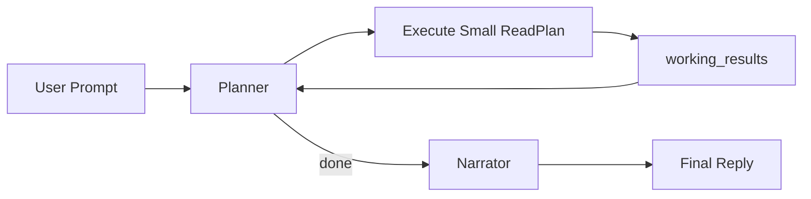

# DEV-PLAN-471：CubeBox 同一 Turn 内模型驱动的迭代式只读规划方案

**状态**: 规划中（2026-04-26 09:32 CST）

## 0. 适用范围与评审分级

- **评审分级**：`T2`
- **范围一句话**：在不新增 `orgunit` 专用只读 API、不引入业务 DSL、也不在共享 query flow 中硬编码业务分支的前提下，把当前“一次 planner -> 一次 execute -> narrator”收敛为“同一用户 turn 内可进行多次 planner-executor-planner 小循环，最后再 narrator”的通用编排主链。
- **关联模块/目录**：`internal/server/cubebox_query_flow.go`、`modules/cubebox/read_plan.go`、`modules/cubebox/read_executor.go`、`modules/cubebox/query_entity.go`、`modules/orgunit/presentation/cubebox`、`docs/dev-records/DEV-PLAN-468-READINESS.md`
- **关联计划/标准**：`AGENTS.md`、`DEV-PLAN-003`、`DEV-PLAN-012`、`DEV-PLAN-430`、`DEV-PLAN-460`、`DEV-PLAN-461`、`DEV-PLAN-463`、`DEV-PLAN-468`、`DEV-PLAN-468C`、`DEV-PLAN-470`
- **用户入口/触点**：`/internal/cubebox/turns:stream`、CubeBox 页面同一会话内的查询型 turn

### 0.1 Simple > Easy 三问

1. **边界**：模型负责“理解当前结果是否足以继续查、下一步该调用哪个已登记只读 API”；本地代码负责“在同一 turn 内按预算反复调用 planner 与 executor，并把已执行结果以结构化事实回灌给模型”；`orgunit` executor 继续只负责单次读，不承接业务编排。
2. **不变量**：不新增第二套查询 endpoint；不新增 capability-specific 编排分支；不新增业务 DSL；不绕过执行注册表、租户、权限与参数校验；最终用户可见回答仍只在所有小循环结束后由 narrator 输出。
3. **可解释**：reviewer 必须能在 5 分钟内说明三件事：为什么 `468C` 的单次前序引用不足以支撑“先查、再看结果、再决定继续查”的问题；为什么本计划不需要新增 `orgunit` API；为什么“多次小计划循环”比“扩张单次大 ReadPlan”更简单。

### 0.2 现状研究摘要

- **现状实现**：
  - 当前 `cubeboxQueryFlow.TryHandle(...)` 只做一次 `ProduceReadPlan(...)`、一次 `ExecutionRegistry.ExecutePlan(...)`，随后直接 `NarrateQueryResult(...)`。
  - planner 已可消费 `knowledge packs + query_dialogue_context`，并已具备 `468C` 的前序 step 结果字段引用能力。
  - executor 已支持线性 `ReadPlan`、前序结果字段引用、参数白名单与 fail-closed 执行。
- **现状约束**：
  - `ReadPlan` 仍是单次产物；planner 当前看不到“本 turn 已执行的小步骤结果”。
  - query context / recent candidates 对列表结果的保留是有损的，`orgunit.list` 的 `has_children` 未沉淀到可复用事实窗口。
  - `page_context` 已裁决为当前范围外，不能作为本计划的补参或再规划输入来源。
- **最容易出错的位置**：
  - 把“多次小计划循环”误做成新 DSL 或 capability-specific 解释器
  - 把当前 turn 的工作结果误写成会话长期事实，污染后续 turns
  - narrator 提前介入，导致模型在中途输出半成品用户可见回答
  - 未加预算导致 planner/executor 循环失控
- **本次不沿用的“容易做法”**：
  - 在共享 query flow 中写死“有下级的下级组织”专门分支
  - 给 `orgunit` 新增专用孙级/递归查询 API
  - 为多次执行引入业务 DSL、循环表达式或 JSONPath

## 1. 背景与上下文（Context）

- **需求来源**：针对“把那些有下级的下级组织的下级组织列出来”这类查询，用户明确要求通过模型理解与自动编排已有能力解决，而不是新增业务 API 或 DSL。
- **当前痛点**：
  - `468C` 只解决“单次 ReadPlan 内，后一步引用前一步结果字段”的线性接力。
  - 像“先查一批直接下级，再根据结果中的 `has_children` 决定下一步要不要继续查哪些组织”的问题，本质上需要“执行一步 -> 观察结果 -> 再规划一步”。
  - 当前系统在同一 turn 内没有这种模型再入能力。
- **业务价值**：
  - 让 CubeBox 在不扩张业务 API 表面的前提下，利用模型编排已有只读能力完成更复杂的查询分解。
  - 提升查询能力上限，同时保持 `orgunit` 等业务模块边界稳定。
- **仓库级约束**：
  - 继续复用现有只读执行注册表与知识包
  - 不引入第二套查询事实源
  - 不放松执行白名单、参数校验、租户与授权边界

### 1.1 原始失败案例（Case）

- **原始多轮输入**：
  1. `查一下 100000 在 2026-04-25 的组织详情`
  2. `查它的下级组织中有下级组织的下级组织`
- **当时系统表现**：
  - 第一轮可成功返回组织 `100000` 在 `2026-04-25` 的详情
  - 第二轮返回：`查询参数无效，请检查后重试。`
- **用户真实意图**：
  - 第二句中的“它”指向上一轮已查到的组织 `100000`
  - 系统应先查出该组织在 `2026-04-25` 的直接下级组织
  - 再从直接下级中识别哪些组织仍有下级（例如 `has_children=true`）
  - 再分别查出这些组织的各自下级组织
  - 最后把这些“有下级的直接下级组织”的下级组织汇总为最终回答
- **该案例暴露的问题本质**：
  - 问题不在 `orgunit` 缺少 `details / list / search / audit` 之外的新只读接口
  - 问题也不应通过 capability-specific 硬编码分支或 DSL 解决
  - 真正缺口是 query flow 缺少“先执行一步、观察结果、再决定下一步”的同一 turn 内迭代式编排能力
- **对应的更清晰单句表达**：
  - `把那些有下级的下级组织的下级组织列出来`

## 2. 目标与非目标（Goals & Non-Goals）

### 2.1 核心目标

- [ ] 将当前 query flow 从“单次 planner-executor”升级为“同一用户 turn 内的有限次 planner-executor-planner 循环”。
- [ ] 每次小循环都只允许模型输出现有合法 `ReadPlan`；不得引入新的计划语言、脚本语言或业务 DSL。
- [ ] 将当前 turn 的已执行结果以稳定结构化块 `working_results` 回灌给 planner，使模型能基于最新结果决定是否继续查询。
- [ ] 保持 narrator 只在所有小循环完成后执行一次，避免中间阶段产出半成品用户可见回答。
- [ ] 通过预算、迭代上限与 fail-closed stopline 保证该循环不会失控。

### 2.2 非目标（Out of Scope）

- 不新增 `orgunit` / 其他业务模块的专用只读 API、递归 API、孙级 API。
- 不引入通用 DSL、JSONPath、表达式求值器、脚本执行器或 capability-specific mini language。
- 不恢复或扩张 `page_context` 作为本计划的编排输入。
- 不在 query flow 中写业务专用 `if prompt contains ...` 分支。
- 不在本计划内处理跨 turn 长期记忆、会话压缩摘要、remote compact 或模型摘要恢复。

### 2.3 用户可见性交付

- **用户可见入口**：CubeBox 查询型对话；仍由 `/internal/cubebox/turns:stream` 承接。
- **最小可操作闭环**：用户在单条问题中提出“需要先查一层结果、再根据结果决定是否继续查”的查询时，系统可在同一 turn 内自动完成多次只读编排，并直接给出最终答案。
- **本期最小验收样例**：
  - `查一下 100000 在 2026-04-25 的组织详情`
  - `把那些有下级的下级组织的下级组织列出来`

## 2.4 工具链与门禁（SSOT 引用）

- **命中触发器（勾选）**：
  - [X] Go 代码
  - [ ] `apps/web/**` / presentation assets / 生成物
  - [ ] i18n（仅 `en/zh`）
  - [ ] DB Schema / Migration / Backfill / Correction
  - [ ] sqlc
  - [ ] Routing / allowlist / responder / 相关路由注册/映射
  - [ ] AuthN / Tenancy / RLS
  - [ ] Authz（Casbin）
  - [ ] E2E
  - [X] 文档 / readiness / 证据记录
  - [X] 其他专项门禁：`error-message`

- **本次引用的 SSOT**：
  - `AGENTS.md`
  - `docs/dev-plans/000-docs-format.md`
  - `docs/dev-plans/003-simple-not-easy-review-guide.md`
  - `docs/dev-plans/012-ci-quality-gates.md`
  - `docs/dev-plans/430-cubebox-ide-conversation-assistant-rebuild-architecture-plan.md`
  - `docs/dev-plans/460-cubebox-digital-assistant-positioning-and-execution-contract.md`
  - `docs/dev-plans/461-cubebox-query-scenarios-minimal-contract.md`
  - `docs/dev-plans/468-cubebox-session-continuity-and-model-autonomy-improvement-plan.md`
  - `docs/dev-plans/468c-cubebox-query-context-fact-window-plan.md`
  - `docs/dev-plans/470-cubebox-page-context-scope-removal-and-cleanup-plan.md`
  - `Makefile`

## 2.5 测试设计与分层

| 层级 | 本计划承接内容 | 代表对象/文件 | 说明 |
| --- | --- | --- | --- |
| `modules/cubebox` | 小循环状态推进、working_results 注入、迭代预算、结果回灌 | `modules/cubebox/*_test.go` | 优先纯逻辑与编排层黑盒测试 |
| `internal/server` | `cubebox_query_flow` 的 turn 内循环、错误映射、SSE 事件顺序 | `internal/server/cubebox_query_flow_test.go`、`internal/server/cubebox_api_test.go` | 只测 query flow 组合层 |
| `E2E` | 浏览器真实对话复验 | `docs/dev-records/DEV-PLAN-471-READINESS.md` | 先以 readiness 证据承接，必要时后补自动化 |

- **黑盒 / 白盒策略**：
  - `working_results` 构造、迭代预算、停止条件等优先黑盒测试
  - 白盒测试仅用于断言事件顺序或内部回灌结构无法通过黑盒稳定观察时使用

## 3. 架构与关键决策（Architecture & Decisions）

### 3.1 5 分钟主流程

- **主流程叙事**：
  - query flow 接收用户 prompt 后，先像现在一样构造 `knowledge packs + query_dialogue_context`。
  - planner 输出一个普通小 `ReadPlan`。
  - executor 执行该小 `ReadPlan`，得到结构化结果。
  - query flow 将“本 turn 已执行的小步骤结果”整理成 `working_results`，再次调用 planner。
  - planner 可以决定：
    - 继续输出下一个普通小 `ReadPlan`
    - 或停止继续查询，进入 narrator
    - 或给出澄清
  - 所有小循环结束后，统一把累计结果交给 narrator 输出最终中文回答。
- **失败路径叙事**：
  - 任意小计划若不合法，立即 fail-closed。
  - 任意 step 执行失败，沿用现有候选澄清 / invalid_request / not_found 等终端错误映射。
  - 若超过预算、循环次数上限或 planner 一直不收敛，输出统一 stopline。
- **恢复叙事**：
  - 不落长期工作状态；失败后不污染后续 turn。
  - 用户可在下一条消息中继续追问，继续依赖 canonical events 与 `query_dialogue_context`。

### 3.2 模块归属与职责边界

- **owner module**：共享 query orchestration owner 为 `internal/server/cubebox_query_flow.go`；`modules/cubebox` 继续承担读计划结构、执行注册表与结果引用；`modules/orgunit/presentation/cubebox` 只承接知识包样例和提示规则。
- **交付面**：`internal/server` + `modules/cubebox` + `docs/dev-plans` / `docs/dev-records`
- **跨模块交互方式**：继续通过已登记 `api_key -> executor` 执行，不新增跨模块 Go import 扩散
- **组合根落点**：query orchestration 仍在 `internal/server`；不得把循环编排逻辑散落到各业务 executor

### 3.3 ADR 摘要

- **决策 1**：采用“同一 turn 内多次小计划循环”，而不是扩张单次大 `ReadPlan`
  - **备选 A**：新增业务递归/孙级 API
  - **备选 B**：给模型新增 DSL / fanout 计划语言
  - **选定理由**：复用已有业务能力，保持业务模块边界不变；模型继续负责编排，代码只做调度，不额外发明语义层

- **决策 2**：`working_results` 作为当前 turn 内的临时工作事实，而不是并入长期 `query_dialogue_context`
  - **备选 A**：把本 turn 中间结果直接写成长期 canonical event 再回放给 planner
  - **备选 B**：让 narrator 中途输出阶段性结果再由模型继续读
  - **选定理由**：当前 turn 的工作状态不应污染长期会话事实；中途输出用户可见半成品会破坏 query flow 单终态叙述

- **决策 3**：继续复用 `468C` 的前序字段引用能力，但不要求模型在一张大计划里预写完整链路
  - **备选 A**：要求模型一次生成完整多步大计划
  - **选定理由**：像“先看结果再决定下一步”这类问题天然适合分阶段规划；把未知后续强塞进单次计划只会诱导 planner 幻觉或非法参数

### 3.4 Simple > Easy 自评

- **这次保持简单的关键点**：
  - 不扩张业务 API
  - 不引入计划 DSL
  - 不把业务编排塞进 executor
  - 不把当前 turn 的工作结果写成长期事实
- **明确拒绝的“容易做法”**：
  - [X] legacy alias / 双链路 / fallback
  - [X] 第二写入口 / controller 直写表
  - [X] 页面内自造第二套 object/action/capability 拼装
  - [X] capability-specific 编排分支
  - [X] 继续扩 `ReadPlan` 为业务 DSL

## 4. 数据模型、状态模型与约束（Data / State Model & Constraints）

### 4.1 状态模型

- **长期会话事实**：继续由 canonical events -> `query_dialogue_context` 承接
- **当前 turn 工作事实**：新增 `working_results` 概念，仅在本次 `TryHandle(...)` 生命周期内存在，不入长期事件流
- **最终用户可见结果**：仅 narrator 最终输出

### 4.2 working_results 最小契约

- 只包含当前 turn 已执行的小计划结果摘要
- 只作为 planner 再规划输入，不作为 narrator 之外的用户可见 JSON
- 必须稳定、可裁剪、无执行痕迹泄露
- 建议字段：
  - `completed_steps`
  - `latest_results`
  - `aggregated_facts`
  - `remaining_goal_hint`（如确有必要，只允许 query flow 生成极轻量提示，不允许业务专用 prose）

### 4.3 预算与停止条件

- 每个用户 turn 允许的 planner-executor 小循环次数必须有限，例如 `max_planning_rounds`
- 每次小循环仍需满足：
  - `ReadPlan` 合法
  - executor 白名单合法
  - 参数白名单与类型校验合法
- 若命中上限仍未收敛：
  - fail-closed
  - 输出统一 stopline，不进入 narrator

## 5. 实施步骤（Implementation Steps）

1. [ ] 冻结 `working_results` 在 planner 输入中的最小结构与 owner 边界，明确它不是长期会话事实，也不是用户可见 JSON。
2. [ ] 重构 `cubeboxQueryFlow.TryHandle(...)`：
   - 从单次 `ProduceReadPlan -> ExecutePlan -> Narrate`
   - 收敛为有限次 `ProduceReadPlan -> ExecutePlan -> accumulate working_results`
   - 最后一次统一 `NarrateQueryResult`
3. [ ] 为 planner prompt 增加“当前 turn 已执行结果”输入块，明确模型可以根据该块继续决定是否需要下一次小计划。
4. [ ] 明确小循环的终止协议：
   - planner 返回澄清态
   - planner 返回 `NO_QUERY`
   - planner 返回合法小计划并执行
   - planner 在看到 `working_results` 后明确“信息已足够，可结束查询”
5. [ ] 扩展 query result -> planner working facts 的整理逻辑，保留继续编排所需关键事实；至少覆盖 `orgunit.list` 的 `has_children`。
6. [ ] 更新 `modules/orgunit/presentation/cubebox/examples.md` 与必要知识包说明，新增“先查直接下级，再根据结果继续查那些仍有下级的组织”的样例。
7. [ ] 增加自动化测试：
   - 单轮可完成问题仍保持单次规划，不无故进入二次规划
   - 需要“先执行再决定”的问题可在同一 turn 内进入第二次小计划
   - 超过预算时 fail-closed
   - 中间结果不泄露为用户可见执行痕迹
8. [ ] 真实页面复验并登记 `docs/dev-records/DEV-PLAN-471-READINESS.md`

## 6. 验收口径（Acceptance）

1. [ ] 用户问题需要“先看执行结果，再决定下一步”时，系统可在同一 turn 内自动完成至少两轮小计划。
2. [ ] 不新增 `orgunit` 专用读 API，`orgunit` executor 注册表保持 `details / list / search / audit` 不变。
3. [ ] 不引入 DSL、JSONPath、脚本表达式或 capability-specific 编排分支。
4. [ ] narrator 只在所有小循环结束后调用一次。
5. [ ] 当前 turn 的 `working_results` 不写入长期 canonical event，不污染后续 turn 的 `query_dialogue_context`。
6. [ ] 对“把那些有下级的下级组织的下级组织列出来”这类问题，模型可以通过已有能力自动分解并给出最终答案。

## 7. 风险与对策（Risks）

| 风险 | 说明 | 对策 |
| --- | --- | --- |
| planner 循环失控 | 模型持续要求更多查询但不收敛 | 增加回合预算与 stopline |
| 中间结果污染长期事实 | 当前 turn 工作态误写入会话事件 | `working_results` 仅内存存在，不进入 canonical events |
| narrator 过早输出 | 中途回答导致后续不能继续查 | narrator 只保留为最终阶段 |
| 结果回灌过宽 | 把过多原始 payload 喂回 planner，增加噪声与泄露面 | 仅保留继续编排所需关键事实窗口 |
| 再次滑向业务 DSL | 为了多轮编排引入复杂计划语言 | 明确本计划只允许普通小 `ReadPlan` 循环，不扩 schema 为 DSL |

## 8. Readiness 与证据

- [ ] 新建 readiness：`docs/dev-records/DEV-PLAN-471-READINESS.md`
- [ ] 记录自动化测试命令、时间戳与结果
- [ ] 记录浏览器真实复验链路、截图与网络请求
