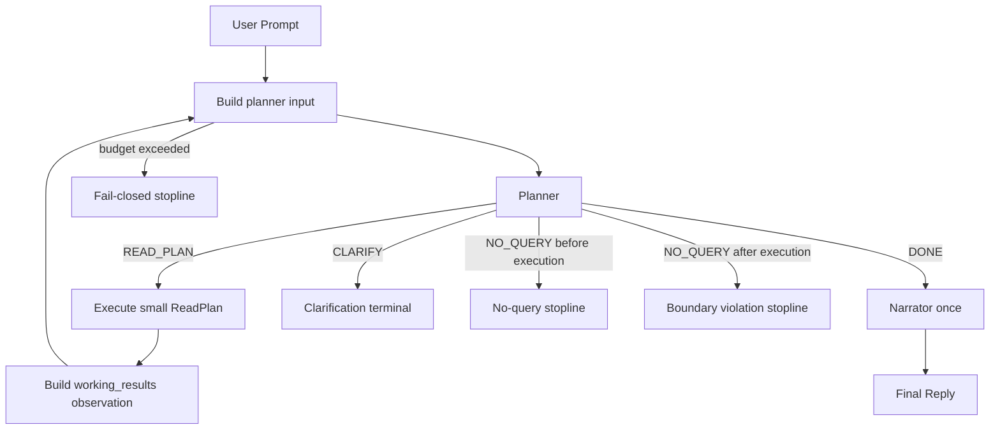

# DEV-PLAN-471：CubeBox 借鉴 Codex Agent Loop 的同一 Turn 内迭代式只读编排方案

**状态**: 规划中（2026-04-26 10:52 CST）

## 0. 适用范围与评审分级

- **评审分级**：`T2`
- **范围一句话**：借鉴 Codex 的“模型 -> 工具执行 -> observation 回灌 -> 模型继续规划 -> 最终回答”agent loop，把 CubeBox 当前“一次 planner -> 一次 execute -> narrator”收敛为“同一用户 turn 内有限次只读 planner/executor 小循环，最后统一 narrator”的查询编排主链。
- **关联模块/目录**：`internal/server/cubebox_query_flow.go`、`modules/cubebox/read_plan.go`、`modules/cubebox/read_executor.go`、`modules/cubebox/query_entity.go`、`modules/orgunit/presentation/cubebox`、`third_party/openai-codex`、`docs/dev-records/DEV-PLAN-471-READINESS.md`
- **关联计划/标准**：`AGENTS.md`、`DEV-PLAN-003`、`DEV-PLAN-012`、`DEV-PLAN-430`、`DEV-PLAN-460`、`DEV-PLAN-461`、`DEV-PLAN-463`、`DEV-PLAN-468`、`DEV-PLAN-468C`、`DEV-PLAN-470`
- **用户入口/触点**：`/internal/cubebox/turns:stream`、CubeBox 页面同一会话内的查询型 turn

### 0.1 Simple > Easy 三问

1. **边界**：模型负责理解当前目标、观察只读结果、决定下一次已登记只读 API 调用或声明查询完成；本地代码负责循环调度、工具目录供给、只读执行、observation 构造、预算/去重/权限/参数校验和最终 narrator 调用。
2. **不变量**：不新增第二套查询 endpoint；不新增 `orgunit` 专用读 API；不引入业务 DSL、JSONPath、脚本求值器、DAG/workflow engine 或 capability-specific 编排分支；不绕过执行注册表、租户、权限与参数校验；最终用户可见回答只由 narrator 在循环结束后输出一次。
3. **可解释**：reviewer 必须能在 5 分钟内说明：Codex agent loop 的哪部分被借鉴；为什么 `working_results` 等价于只读工具 observation 而不是长期记忆；为什么需要明确 `DONE` 终止态；为什么多次小 `ReadPlan` 比扩张单次大计划更简单。

### 0.2 Codex 对标结论

- **借鉴对象**：`openai/codex` 的核心 agent loop。其模式不是一次性生成完整计划，而是在同一个 turn 内反复执行：
  1. 构造模型输入
  2. 模型输出工具调用或最终消息
  3. 本地执行工具调用
  4. 将工具结果作为 observation 写回下一次模型输入
  5. 直到模型不再请求工具并给出最终输出
- **本计划只借鉴的部分**：
  - loop 是一等运行时，由代码负责预算、状态推进和工具结果回灌
  - 工具目录由本地注册表约束，模型只能选择已登记能力
  - 工具 observation 进入下一次模型调用，驱动模型“看结果再规划”
  - 最终用户可见输出与中间工具 observation 分离
- **本计划不借鉴的部分**：
  - 不建设开放式 agent/tool 平台
  - 不允许模型访问 shell、文件系统、数据库或任意 HTTP 工具
  - 不引入并发 subagent、DAG 调度、workflow engine、通用函数调用市场
  - 不把模型输出当作授权来源或执行事实源
- **本地参考源码落点**：`third_party/openai-codex`。该目录仅作为源码学习参考，不得成为运行时依赖，不纳入 Go import、不参与 CubeBox 构建链路。
- **本地对标阅读路径**：
  - `third_party/openai-codex/codex-rs/core/src/session/turn.rs`：`run_turn(...)` 持有同一 turn 内的模型调用循环，并依据 `needs_follow_up` 决定是否继续 sampling。
  - `third_party/openai-codex/codex-rs/core/src/stream_events_utils.rs`：`handle_output_item_done(...)` 将模型输出解析为工具调用、执行工具，并把工具结果标记为需要后续模型调用。
  - `third_party/openai-codex/codex-rs/core/src/tools/router.rs`：`ToolRouter` 从本地配置构造可用工具集合，并把模型输出路由到受控工具处理器。
  - `third_party/openai-codex/codex-rs/core/src/context_manager/history.rs` 与 `context_manager/normalize.rs`：维护历史项、token 估算、工具调用输出配对与孤儿输出清理。
  - `third_party/openai-codex/codex-rs/core/src/compact.rs` 与 `compact_remote.rs`：在上下文预算压力下执行本地/远端 compaction，并替换 active history。

### 0.3 现状研究摘要

- 当前 `cubeboxQueryFlow.TryHandle(...)` 只做一次 `ProduceReadPlan(...)`、一次 `ExecutionRegistry.ExecutePlan(...)`，随后直接 `NarrateQueryResult(...)`。
- planner 已可消费 `knowledge packs + query_dialogue_context`，并已具备 `468C` 的前序 step 结果字段引用能力。
- executor 已支持线性 `ReadPlan`、前序结果字段引用、参数白名单与 fail-closed 执行。
- `ReadPlan` 仍是单次产物；planner 当前看不到本 turn 已执行的小步骤结果。
- query context / recent candidates 面向跨 turn 连续性，不应承接本 turn 内临时工作态。
- `orgunit.list` 已返回 `org_units[].has_children`；当前缺口不是业务 API，而是同一 turn 内的 observation 回灌与再规划。

### 0.4 最容易出错的位置

- 把 Codex 借鉴误做成开放式工具平台
- 用 `NO_QUERY` 同时表达“不支持查询域”和“已有结果足够”，导致状态混淆
- 把 `working_results` 写入长期 canonical events，污染后续 turn
- 把当前 turn 的 observation 设计成业务 DSL、JSONPath 或 capability-specific 解释器
- 未加预算、去重和重复查询检测，导致 planner/executor 循环失控
- narrator 中途介入并输出半成品用户可见回答

## 1. 背景与问题

### 1.1 需求来源

针对“把那些有下级的下级组织的下级组织列出来”这类查询，用户明确要求通过模型理解与自动编排已有能力解决，而不是新增业务 API、DSL 或本地业务分支。

### 1.2 原始失败案例

- **原始多轮输入**：
  1. `查一下 100000 在 2026-04-25 的组织详情`
  2. `查它的下级组织中有下级组织的下级组织`
- **当时系统表现**：
  - 第一轮可成功返回组织 `100000` 在 `2026-04-25` 的详情
  - 第二轮返回：`查询参数无效，请检查后重试。`
- **用户真实意图**：
  - 第二句中的“它”指向上一轮已查到的组织 `100000`
  - 系统应先查出该组织在 `2026-04-25` 的直接下级组织
  - 再从直接下级中识别哪些组织仍有下级，例如 `has_children=true`
  - 再分别查出这些组织的各自下级组织
  - 最后把这些“有下级的直接下级组织”的下级组织汇总为最终回答
- **本质缺口**：
  - `468C` 的线性前序引用适合“先 search 唯一命中，再 details/list”的已知链路
  - 本案例要求“执行一步 -> 观察结果 -> 根据结果决定下一步”
  - 因此需要同一 turn 内的模型再入循环，而不是单次大 `ReadPlan`

## 2. 目标与非目标

### 2.1 核心目标

- [ ] 将当前 query flow 从“单次 planner-executor”升级为“同一用户 turn 内有限次 planner-executor-planner loop”。
- [ ] 每次小循环只允许模型输出合法小 `ReadPlan` 或冻结的循环控制态；不得引入新业务计划语言。
- [ ] 将当前 turn 的已执行结果整理成稳定结构化 `working_results`，作为下一次 planner 输入中的 tool observation。
- [ ] 增加明确的 planner 终止协议：`READ_PLAN`、`CLARIFY`、`DONE`、`NO_QUERY`。
- [ ] 保持 narrator 只在 `DONE` 或单轮执行后确认足够时调用一次，避免中间阶段产出半成品用户可见回答。
- [ ] 通过 `max_planning_rounds`、`max_executed_steps`、`max_working_result_items`、重复查询检测与 fail-closed stopline 保证循环不会失控。
- [ ] 对 P0 案例支持串行 fanout：当多个直接下级 `has_children=true` 时，允许 planner 在预算内分批或逐个继续查其下级。

### 2.2 非目标

- 不新增 `orgunit` / 其他业务模块的专用只读 API、递归 API、孙级 API。
- 不引入通用 DSL、JSONPath、表达式求值器、脚本执行器、DAG planner、workflow engine 或 capability-specific mini language。
- 不恢复或扩张 `page_context` 作为本计划的编排输入。
- 不在 query flow 中写业务专用 `if prompt contains ...` 分支。
- 不在本计划内处理跨 turn 长期记忆、会话压缩摘要、remote compact 或模型摘要恢复。
- 不引入并发工具执行；P0 只做串行循环。

### 2.3 用户可见性交付

- **用户可见入口**：CubeBox 查询型对话；仍由 `/internal/cubebox/turns:stream` 承接。
- **最小可操作闭环**：用户在单条问题中提出“需要先查一层结果、再根据结果决定是否继续查”的查询时，系统可在同一 turn 内自动完成多次只读编排，并直接给出最终答案。
- **本期最小验收样例**：
  - 先问：`查一下 100000 在 2026-04-25 的组织详情`
  - 再问：`把那些有下级的下级组织的下级组织列出来`

## 3. 工具链与门禁

- **命中触发器**：
  - [X] Go 代码
  - [ ] `apps/web/**` / presentation assets / 生成物
  - [ ] i18n（仅 `en/zh`）
  - [ ] DB Schema / Migration / Backfill / Correction
  - [ ] sqlc
  - [ ] Routing / allowlist / responder / 相关路由注册/映射
  - [ ] AuthN / Tenancy / RLS
  - [ ] Authz（Casbin）
  - [ ] E2E
  - [X] 文档 / readiness / 证据记录
  - [X] 其他专项门禁：`error-message`、`root-surface`

- **本次引用的 SSOT**：
  - `AGENTS.md`
  - `docs/dev-plans/000-docs-format.md`
  - `docs/dev-plans/003-simple-not-easy-review-guide.md`
  - `docs/dev-plans/012-ci-quality-gates.md`
  - `docs/dev-plans/430-cubebox-ide-conversation-assistant-rebuild-architecture-plan.md`
  - `docs/dev-plans/460-cubebox-digital-assistant-positioning-and-execution-contract.md`
  - `docs/dev-plans/461-cubebox-query-scenarios-minimal-contract.md`
  - `docs/dev-plans/468-cubebox-session-continuity-and-model-autonomy-improvement-plan.md`
  - `docs/dev-plans/468c-cubebox-query-context-fact-window-plan.md`
  - `docs/dev-plans/470-cubebox-page-context-scope-removal-and-cleanup-plan.md`
  - `third_party/openai-codex`
  - `Makefile`

## 4. 架构方案

### 4.1 Codex Loop 到 CubeBox Query Loop 的映射

| Codex agent loop 概念 | CubeBox 471 对应物 | 说明 |
| --- | --- | --- |
| Model reasoning | query planner | 只负责选择已登记只读 API 或声明完成/澄清/不支持 |
| Tool schema/catalog | `ExecutionRegistry` 生成的 `read_api_catalog` + knowledge packs | 注册表是执行事实源，知识包解释业务语义 |
| Tool call | 小 `ReadPlan` | 每轮仍是现有合法线性 ReadPlan |
| Tool execution | `ExecutionRegistry.ExecutePlan(...)` | 保持租户、权限、参数白名单和 executor 校验 |
| Tool observation | `working_results` | 当前 turn 内临时结构化事实，不入长期事件 |
| Final assistant message | narrator 输出 | 只在 loop 完成后输出一次 |

### 4.2 主流程



### 4.3 Planner 控制态

当前 `ReadPlan` schema 不应被扩成业务 DSL，但 loop 需要一个薄控制 envelope。P0 冻结以下 planner outcome：

1. `READ_PLAN`
   - 表示本轮需要执行一个合法小 `ReadPlan`
   - 兼容现状：模型直接输出 `ReadPlan JSON` 时等价于 `READ_PLAN`
2. `CLARIFY`
   - 表示缺少必要参数或候选不可静默选择
   - 兼容现状：带 `missing_params + clarifying_question` 且无 `steps` 的 `ReadPlan`
3. `DONE`
   - 表示 planner 已看到足够 `working_results`，可以进入 narrator
   - 推荐模型输出严格字面量 `DONE`
   - 只允许在至少执行过一次只读计划后出现
4. `NO_QUERY`
   - 只表示用户请求不属于当前知识包支持的查询域
   - 仅允许在尚未执行任何查询时作为普通 no-query stopline
   - 若已执行过查询后又返回 `NO_QUERY`，视为 planner 边界错误，fail-closed；不能把 `NO_QUERY` 当完成态

### 4.4 Planner 输入结构

每次 planner 调用都包含：

1. 静态 planner system prompt
2. knowledge packs
3. 由 `ExecutionRegistry` 派生的 `read_api_catalog`
4. `query_dialogue_context`
5. 当前用户原始 prompt
6. 当前 turn 内 `working_results`

`read_api_catalog` 是代码从注册表生成的最小执行事实：

```json
{
  "read_api_catalog": [
    {
      "api_key": "orgunit.list",
      "required_params": ["as_of"],
      "optional_params": ["include_disabled", "parent_org_code", "keyword", "status", "page", "size"]
    }
  ]
}
```

知识包仍负责解释字段语义、默认策略、案例与安全边界；注册表目录负责告诉模型“当前真实可执行工具是什么”。

### 4.5 `working_results` 最小契约

`working_results` 是当前 turn 内的 tool observation，只存在于 `TryHandle(...)` 生命周期内。

```json
{
  "working_results": {
    "round_index": 2,
    "original_user_goal": "把那些有下级的下级组织的下级组织列出来",
    "completed_plans": [
      {
        "round": 1,
        "intent": "orgunit.list",
        "steps": [
          {
            "step_id": "step-1",
            "api_key": "orgunit.list",
            "params_fingerprint": "orgunit.list|as_of=2026-04-25|parent_org_code=100000",
            "summary": {
              "as_of": "2026-04-25",
              "org_unit_count": 3
            }
          }
        ]
      }
    ],
    "latest_observation": {
      "api_key": "orgunit.list",
      "as_of": "2026-04-25",
      "org_units": [
        {
          "org_code": "110000",
          "name": "示例组织",
          "status": "active",
          "has_children": true
        }
      ]
    },
    "aggregated_facts": {
      "orgunit_list_items_with_children": [
        {
          "org_code": "110000",
          "name": "示例组织",
          "as_of": "2026-04-25",
          "parent_org_code": "100000"
        }
      ],
      "queried_parent_org_codes": ["100000"],
      "remaining_parent_org_codes": ["110000"]
    }
  }
}
```

约束：

- 不包含密钥、provider 配置、内部 session token 或未授权数据。
- 不原样塞入无限 raw payload；必须按预算裁剪。
- 不作为长期 canonical event，不进入 `query_dialogue_context`。
- 不作为 narrator 之外的用户可见 JSON。
- `remaining_goal_hint` 如确有必要，只能是 query flow 生成的通用短提示，不得包含业务专用 prose 或隐藏分支语义。

### 4.6 预算与去重

P0 默认预算建议：

- `max_planning_rounds = 4`
- `max_executed_steps = 8`
- `max_working_result_items = 50`
- `max_repeated_plan_fingerprint = 1`

每次执行前生成稳定 `plan_fingerprint` / `step_fingerprint`，至少包含：

- `api_key`
- 归一化参数 key/value
- `as_of`
- 主要目标参数，例如 `org_code` / `parent_org_code` / `query`

若 planner 再次请求已执行过的同一 fingerprint：

- 第一次重复：作为 observation 告知 planner 已执行过，不重复执行，要求其选择下一步或 `DONE`
- 再次重复：fail-closed，输出统一 stopline

### 4.7 Fanout 策略

P0 不引入 fanout DSL，不并发执行。

- planner 可在下一轮选择一个或一小批 `remaining_parent_org_codes` 继续生成普通 `orgunit.list` 小计划。
- query flow 负责记录已查 parent 与待查 parent，防止重复。
- 若待查 parent 超出预算，narrator 应基于已查结果说明本次已覆盖范围；是否允许 partial answer 必须在实现前冻结：
  - 推荐 P0：预算耗尽且仍未 `DONE` 时 fail-closed，不进入 narrator
  - 后续 P1 可考虑带明确范围说明的 partial answer，但必须有单独方案

## 5. 模块归属与职责边界

- **`internal/server/cubebox_query_flow.go`**
  - 持有 loop orchestration
  - 构造 planner 输入
  - 解析 planner outcome
  - 调用 executor
  - 累积 `working_results`
  - 执行预算、去重、错误映射和 SSE 事件顺序
  - 最终只调用 narrator 一次
- **`modules/cubebox`**
  - 保持 `ReadPlan` schema、校验、执行注册表、参数引用解析与执行结果类型
  - 增加通用 `working_results` / observation 构造所需的纯函数或 DTO 时，应保持业务无关
- **`modules/orgunit/presentation/cubebox`**
  - 更新知识包案例，告诉模型如何根据 `working_results` 中的 `has_children` 继续规划
  - 不声明新 API，不写回答模板，不引入业务 DSL
- **`third_party/openai-codex`**
  - 仅作为源码参考，不参与构建和运行

## 6. 失败路径与 Stopline

| 场景 | 处理 |
| --- | --- |
| planner 输出非法 JSON / 非法 outcome | fail-closed，映射为计划边界错误 |
| `ReadPlan` schema 或参数非法 | fail-closed，沿用现有计划边界错误 |
| 未注册 `api_key` | fail-closed，沿用执行注册表漂移错误 |
| executor 返回候选不可静默选择 | 进入澄清终态，写候选 metadata events |
| executor 执行失败 | 沿用现有错误映射 |
| planner 在已执行后返回 `NO_QUERY` | fail-closed，不当作完成 |
| planner 返回 `DONE` 但无任何执行结果 | fail-closed |
| 超过预算或重复查询不收敛 | fail-closed，输出统一 stopline |
| narrator 输出泄露内部字段 | 沿用现有 narrator contract violation |

## 7. 测试设计与分层

| 层级 | 本计划承接内容 | 代表对象/文件 | 说明 |
| --- | --- | --- | --- |
| `modules/cubebox` | `working_results` DTO、fingerprint、预算、去重纯函数 | `modules/cubebox/*_test.go` | 优先黑盒测试 |
| `internal/server` | query loop、planner outcome、SSE 顺序、错误映射、narrator 单次调用 | `internal/server/cubebox_query_flow_test.go`、`internal/server/cubebox_api_test.go` | 组合层测试 |
| 知识包 | `working_results` 驱动再规划案例 | `modules/orgunit/presentation/cubebox/examples.md` | 配合 planner prompt 测试夹具 |
| E2E | 浏览器真实对话复验 | `docs/dev-records/DEV-PLAN-471-READINESS.md` | readiness 记录为 P0 证据 |

重点测试：

- 单轮可完成问题仍只执行一次 planner/executor/narrator。
- 需要“先执行再决定”的问题可在同一 turn 内进入第二次 planner。
- planner 看到 `working_results` 后返回 `DONE`，narrator 只调用一次。
- planner 在已执行后返回 `NO_QUERY` 必须 fail-closed。
- planner 重复请求相同 fingerprint 时不会重复执行。
- 超过 `max_planning_rounds` 时 fail-closed。
- 中间 `working_results` 不写入长期 canonical event。
- 用户可见输出不泄露 `api_key`、`step-*`、`payload`、`results`、`params` 等内部执行痕迹。

## 8. 实施步骤

按最小实现切片推进；每个切片都应保持“可独立评审、可单独回归、失败时可停在当前切片不继续放大范围”。

1. [ ] `PR-471-01`：冻结 planner outcome 与 `read_api_catalog`
   - 目标：先把“planner 到 query loop 的控制协议”收紧，再进入循环改造；避免一边改 loop 一边继续放宽 planner 输出语义。
   - 代码落点：
     - `internal/server/cubebox_query_flow.go`
     - `modules/cubebox/read_plan.go`
     - 如有必要，新增 `modules/cubebox/planner_outcome.go`
   - 具体动作：
     - 兼容现有裸 `ReadPlan JSON` 作为 `READ_PLAN`
     - 保留现有 `NO_QUERY`
     - 新增严格字面量 `DONE`
     - 澄清态继续沿用现有 `missing_params + clarifying_question`
     - 从 `ExecutionRegistry` 派生稳定排序的 `read_api_catalog` prompt block，并明确“注册表是执行事实源，知识包只解释语义”
   - 本片完成判定：
     - planner outcome 解析矩阵冻结
     - 非法 outcome 统一映射为计划边界错误
     - `read_api_catalog` 的输出稳定、可测试、与注册表一致

2. [ ] `PR-471-02`：新增 `working_results` / fingerprint / budget 纯函数
   - 目标：先把循环状态抽成业务无关纯函数，再让 `TryHandle(...)` 消费这些状态；避免把预算、聚合、去重逻辑写散在 server 组合层。
   - 代码落点：
     - 建议新增 `modules/cubebox/query_working_results.go`
     - 建议新增 `modules/cubebox/query_loop_budget.go`
     - 如无必要，不改 `modules/orgunit/**` 业务 executor
   - 具体动作：
     - 定义 `working_results` DTO：`completed_plans`、`latest_observation`、`aggregated_facts`
     - 生成 `plan_fingerprint` / `step_fingerprint`
     - 维护 `round_index`、`executed_steps`、`remaining_parent_org_codes` 等预算/聚合信息
     - 对 observation 做条数与字段裁剪，禁止无限回灌 raw payload
     - 明确 `working_results` 仅存在于当前 `TryHandle(...)` 生命周期内，不写入 canonical events
   - 本片完成判定：
     - 可独立测试追加 observation、重复 fingerprint 检测、预算耗尽、裁剪结果
     - `has_children` 场景所需的最小聚合事实可由纯函数得到

3. [ ] `PR-471-03`：把 `cubeboxQueryFlow.TryHandle(...)` 从单次链改成有限次 loop
   - 目标：把现有 `ProduceReadPlan -> ExecutePlan -> Narrate` 改成有限次 `ProduceReadPlan -> outcome -> ExecutePlan -> append working_results`，但仍只保留一个 narrator 终点。
   - 代码落点：
     - `internal/server/cubebox_query_flow.go`
     - `internal/server/cubebox_query_flow_test.go`
   - 具体动作：
     - 在 `TryHandle(...)` 内引入 `max_planning_rounds`、`max_executed_steps`、`max_repeated_plan_fingerprint` 限制
     - 每轮都重建 planner 输入：`knowledge packs + read_api_catalog + query_dialogue_context + current user prompt + working_results`
     - `READ_PLAN`：执行小 `ReadPlan`，追加 observation，进入下一轮
     - `CLARIFY`：直接终止为澄清，不进入 narrator
     - `DONE`：仅在至少执行过一次只读计划后允许进入 narrator
     - `NO_QUERY`：未执行前可作为普通 no-query stopline；已执行后返回 `NO_QUERY` 必须 fail-closed
     - executor 返回候选不可静默选择时，继续沿用现有澄清终态与 candidate metadata event
   - 本片完成判定：
     - 单轮问题仍只调用一次 planner/executor/narrator
     - 需要“先执行再决定”的问题可在同一 turn 内进入第二轮 planner
     - narrator 只在最终完成时调用一次

4. [ ] `PR-471-04`：扩展 planner prompt 与 orgunit 知识包案例
   - 目标：让模型知道“什么时候继续查、什么时候 `DONE`、什么时候绝不能再查重复 fingerprint”；不要把这些规则偷偷塞进 server if-else。
   - 代码落点：
     - `internal/server/cubebox_query_flow.go`
     - `modules/orgunit/presentation/cubebox/examples.md`
     - 如需补说明，可同步 `modules/orgunit/presentation/cubebox/apis.md`
   - 具体动作：
     - 在 planner system prompt 中增加 `working_results` 说明
     - 明确 `DONE` 的语义是“当前 observation 已足够进入 narrator”
     - 明确 `NO_QUERY` 只表示“超出查询域”，不能表示“已经查够”
     - 明确禁止重复请求已执行 fingerprint
     - 在 orgunit 样例中加入“先查直接下级，再基于 `has_children=true` 继续查其下级”的最小案例
   - 本片完成判定：
     - planner 提示词与知识包案例对齐
     - 不新增 API、不引入 DSL、不写业务专用分支 prompt

5. [ ] `PR-471-05`：补齐自动化测试，先锁死回归面再做真实复验
   - 目标：优先用最小直接测试锁死循环协议与 stopline，再进入页面复验；避免把问题推到浏览器层才暴露。
   - 代码落点：
     - `modules/cubebox/*_test.go`
     - `internal/server/cubebox_query_flow_test.go`
     - 如需组合层覆盖，可补 `internal/server/cubebox_api_test.go`
   - 重点覆盖：
     - planner outcome 解析：裸 `ReadPlan` / `DONE` / `NO_QUERY` / 非法文本
     - `working_results` 构造、聚合、裁剪、fingerprint
     - loop 正常完成：至少两轮 planner 后 `DONE`
     - loop 澄清终止：候选不可静默选择时直接终止，不进入 narrator
     - repeat / budget fail-closed：重复请求同 fingerprint 或超预算时不重复执行
     - narrator 单次调用：中途不得输出用户可见半成品回答
     - 长期事件隔离：中间 `working_results` 不写入 canonical events
   - 本片完成判定：
     - `modules/cubebox` 纯函数测试与 `internal/server` 组合层测试都能独立说明 471 的主约束

6. [ ] `PR-471-06`：真实页面复验、readiness 证据与第三方源码留痕
   - 目标：在自动化回归通过后，用真实页面验证“同一 turn 内二次规划”确实发生，并把对标源码版本固定到证据里。
   - 代码/文档落点：
     - `docs/dev-records/DEV-PLAN-471-READINESS.md`
   - 具体动作：
     - 记录自动化测试命令、时间戳、结果
     - 记录浏览器真实复验：输入、页面表现、网络请求、截图
     - 记录 `third_party/openai-codex` 参考源码版本：
       - `git -C third_party/openai-codex rev-parse HEAD`
       - `git -C third_party/openai-codex status --short`
   - 本片完成判定：
     - readiness 能证明 P0 样例已在真实页面闭环通过
     - 第三方参考源码 HEAD 已冻结，后续偏差分析有可追溯基线

## 9. 验收口径

1. [ ] 用户问题需要“先看执行结果，再决定下一步”时，系统可在同一 turn 内自动完成至少两轮小计划。
2. [ ] 对“把那些有下级的下级组织的下级组织列出来”这类问题，模型可以通过已有 `orgunit.list` 能力自动分解并给出最终答案。
3. [ ] 不新增 `orgunit` 专用读 API，`orgunit` executor 注册表保持 `details / list / search / audit` 不变。
4. [ ] 不引入 DSL、JSONPath、脚本表达式、DAG/workflow engine 或 capability-specific 编排分支。
5. [ ] planner 终止态明确：`DONE` 才能在已执行查询后进入 narrator；`NO_QUERY` 不得作为完成态。
6. [ ] narrator 只在所有小循环结束后调用一次。
7. [ ] 当前 turn 的 `working_results` 不写入长期 canonical event，不污染后续 turn 的 `query_dialogue_context`。
8. [ ] 超预算、重复查询不收敛、非法 planner outcome 均 fail-closed。
9. [ ] 用户可见回答不泄露内部执行痕迹。
10. [ ] `third_party/openai-codex` 已完整克隆并记录 HEAD，用于后续本地对标学习。

## 10. 风险与对策

| 风险 | 说明 | 对策 |
| --- | --- | --- |
| Codex 借鉴过度 | 误建开放式 agent/tool 平台 | 只借鉴 loop，不开放任意工具 |
| planner 循环失控 | 模型持续要求更多查询但不收敛 | 回合预算、step 预算、重复 fingerprint stopline |
| `NO_QUERY` 语义混淆 | 查询已足够时误用 `NO_QUERY` | 冻结 `DONE`，已执行后 `NO_QUERY` 视为边界错误 |
| 中间结果污染长期事实 | 当前 turn 工作态误写入会话事件 | `working_results` 仅内存存在，不进入 canonical events |
| narrator 过早输出 | 中途回答导致后续不能继续查 | narrator 只保留为最终阶段 |
| 结果回灌过宽 | 把过多 raw payload 喂回 planner | observation 裁剪、条数限制、字段预算 |
| 再次滑向业务 DSL | 为多轮编排引入复杂计划语言 | 只允许普通小 `ReadPlan` + 薄 outcome |
| fanout 超预算 | 多个 parent 都需继续查询 | P0 串行有限 fanout，预算耗尽 fail-closed |

## 11. Readiness 与证据

- [ ] 新建 readiness：`docs/dev-records/DEV-PLAN-471-READINESS.md`
- [ ] 记录 `third_party/openai-codex` clone HEAD、命令、时间戳与结果
- [ ] 记录自动化测试命令、时间戳与结果
- [ ] 记录浏览器真实复验链路、截图与网络请求
