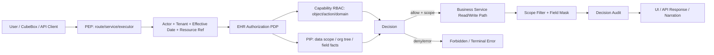

# DEV-PLAN-480：EHR 授权体系总体方案

**状态**: 规划中（2026-04-28 12:06 CST）

## 0. 适用范围与评审分级

- **评审分级**：`T2`
- **范围一句话**：把 EHR 授权从当前 route/object/action 级 Casbin 门禁，升级为覆盖 API 能力、组织数据范围、对象实例、字段、AI 代用户执行、审计解释与 UI 可见性的全域授权体系蓝图；`DEV-PLAN-468` 留下的 CubeBox executor per-api 授权补强作为本方案的首批落地切片之一。
- **关联模块/目录**：`pkg/authz/**`、`config/access/**`、`scripts/authz/**`、`internal/server/authz_middleware.go`、`modules/*/services`、`modules/*/infrastructure`、`modules/cubebox/read_executor.go`、`internal/server/cubebox_*`、`apps/web/src/**`
- **关联计划/标准**：`AGENTS.md`、`DEV-PLAN-000`、`DEV-PLAN-001`、`DEV-PLAN-011`、`DEV-PLAN-012`、`DEV-PLAN-015`、`DEV-PLAN-017`、`DEV-PLAN-019`、`DEV-PLAN-020`、`DEV-PLAN-022`、`DEV-PLAN-032`、`DEV-PLAN-300`、`DEV-PLAN-304`、`DEV-PLAN-460`、`DEV-PLAN-468`、`DEV-PLAN-481`、`DEV-PLAN-482`、`DEV-PLAN-483`、`DEV-PLAN-484`
- **用户入口/触点**：授权管理配置页、服务端权限摘要 API、`CubeBox` 右侧抽屉、所有受保护 HTTP API 与内部 executor

### 0.1 Simple > Easy 三问

1. **边界**：AuthN/session 只证明是谁；RLS 只做租户圈地；EHR 授权 PDP 负责“谁能对什么对象做什么事”；数据范围 resolver 负责“同租户内能看哪些实例”；字段策略负责“哪些字段可见、可写、需脱敏”；UI 只消费裁决结果做可见性和可用性提示，不承担强制授权。
2. **不变量**：所有服务端入口 fail-closed；registry 白名单、前端 permissionKey、模型输出、知识包、导航可见性、RLS 都不等于授权；同一个业务读写路径必须同时服务 UI、API 与 CubeBox，避免两套可见性规则。
3. **可解释**：主流程可在 5 分钟内复述为：请求解析 principal/tenant/context，PEP 组装动作与资源，PDP 先判能力，再用数据范围裁剪或拒绝实例，再按字段策略过滤/脱敏，最后记录可审计 decision；UI 从同一裁决摘要渲染入口、按钮和不可访问状态。

### 0.2 现状研究摘要

- `DEV-PLAN-022` 已冻结 Casbin 工具链、role-based subject、tenant domain、object/action registry 与 `AUTHZ_MODE` 三态；当前 `pkg/authz.Authorizer.Authorize(subject, domain, object, action)` 能支撑 API 能力授权。
- 当前 `pkg/authz` 仍是角色粒度 RBAC + tenant domain；它不表达组织树数据范围、对象实例或字段级裁决。
- 当前 `internal/server/authz_middleware.go` 以 route 映射 object/action；`/internal/cubebox/turns:stream` 只校验 `cubebox.conversations:use`，不校验 plan 内每个 executor 代表的业务 API。
- 当前 `RegisteredExecutor` 没有授权元数据，`ExecutionRegistry.ExecutePlan(...)` 执行 step 前不调用 authorizer；这就是 `DEV-PLAN-468` P2-2 留下的直接缺口。
- 当前 `ExecuteRequest` 有 `TenantID`、`PrincipalID`、`ConversationID`，缺少 `PrincipalRoleSlug`；现有 Casbin subject 从 role slug 推导，不能把 `PrincipalID` 误当 subject。
- 当前前端 `RequirePermission` / `permissionKey` 只基于本地 `VITE_PERMISSIONS` 做导航和页面提示，默认空权限时甚至是 `*`；它不是安全边界，且按 `DEV-PLAN-483` 必须硬删除旧 key、旧字段和构建期权限 fallback，前端只能消费 canonical `object:action` capability。
- “用户 A 能看整个飞虫与鲜花，用户 B 只能查看鲜花公司”属于同租户内组织数据范围授权，不是 route authz、RLS 或 CubeBox prompt 能解决的问题。

## 1. 背景与上下文

EHR 系统的授权不能只停留在“页面能不能进”或“API 能不能调用”。真实业务里，同一个 HR 角色在不同组织范围、不同人群、不同字段可见性下权限不同：

- 集团 HR 可以查看整个“飞虫与鲜花”集团。
- 鲜花公司 HR 只能查看“鲜花公司”及其下级组织。
- 部门经理可以查看本部门员工的部分信息，但不能看薪酬、证件等敏感字段。
- CubeBox 或其他 AI 工具只能代当前用户执行其本人已经被授权的查询，不能因为模型知道 executor 名称就扩大权限。

当前仓库已有最小 Casbin 授权工具链，但它只覆盖能力授权的基础层。480 的目标是冻结一个完整、分层、可演进的 EHR 授权体系，让后续各业务模块和 CubeBox executor 接入时有统一 owner、统一失败语义和统一 UI 表达。

## 2. 目标与非目标

### 2.1 核心目标

1. [ ] 冻结 EHR 授权体系分层：身份与上下文、能力/API 授权、数据范围、对象实例、字段级授权、AI 代用户执行、审计解释、UI 裁决消费。
2. [ ] 评估并明确当前 `pkg/authz` 的改造边界：Casbin 不替换；核心四元组可保留；需要增加统一 Request/Decision 门面、PIP 数据范围 resolver 与服务端裁决摘要。
3. [ ] 明确组织数据范围授权方案，覆盖“用户 A 能看整个飞虫与鲜花，用户 B 只能查看鲜花公司”这类同租户内可见范围差异。
4. [ ] 明确 registry 白名单、前端 permissionKey、知识包、模型输出、RLS、导航可见性都不等于授权。
5. [ ] 把 `DEV-PLAN-468` P2-2 作为首批切片：给 `RegisteredExecutor` 增加授权元数据，`ExecutionRegistry.ExecutePlan(...)` 每 step 前 fail-closed authorizer 校验，并补齐允许/拒绝/缺元数据测试。
6. [ ] 增加 UI 设计方案：授权管理配置、权限摘要、CubeBox 授权反馈与审计解释；普通用户未授权入口应隐藏，不新增普通用户错误页设计。
7. [ ] 定义实施切片、测试分层和验收门禁，避免一次性大爆炸实现。

### 2.2 非目标

1. 不在本方案文档变更中新增 DB 表、迁移或在线权限配置 UI；任何 schema 变更必须另起实施计划并获得用户手工确认。
2. 不替换 Casbin，不引入 OPA、CEL 或第二套 policy engine。
3. 不把数据范围塞进 Casbin object 字符串，例如 `orgunit.orgunits:FLOWER`；组织范围应由独立 PIP/resolver 与业务读路径强制。
4. 不把前端隐藏按钮当作安全控制；所有安全判断必须在服务端 PEP/PDP 处 fail-closed。
5. 不为未来所有 EHR 模块一次性实现完整策略后台；480 先冻结蓝图和首批切片，后续按子计划分批落地。
6. 不恢复 legacy、SetID、scope/package 或旧 org_level/scope_type/scope_key 语义。

### 2.3 用户可见性交付

- **用户可见入口**：
  - 授权管理员：角色管理（基础信息 + 功能权限，详见 `DEV-PLAN-481`）、用户授权/角色分配（主体 + 角色 + 组织范围绑定）、保存生效后的审计解释，以及通过 `CubeBox` 查询“哪些用户有什么权限 / 能看什么范围”。
  - 普通用户：`CubeBox` 查询与现有业务 API/页面消费服务端授权裁决；480 不新增新的组织业务页面。
- **最小可操作闭环**：
  - 授权管理员可在授权管理中查看/配置“用户 B 被授予 `flower-hr`，数据范围为鲜花公司及下级”的授权关系。
  - CubeBox 调用业务 executor 时按当前用户权限执行；查询集团根或其他公司时被裁剪或拒绝。
  - 无 `orgunit.orgunits:read` 能力的用户直接访问相关 API 返回统一拒绝；UI 入口是否隐藏由既有业务页面消费服务端摘要决定，不作为 480 新增页面交付。
  - 授权管理员在 CubeBox 中查询“用户 B 有什么权限”时，可得到角色功能权限与数据范围摘要；普通业务用户查询他人授权摘要时被统一拒绝。
- **后端先行验收**：
  - 首批 CubeBox executor per-api 授权可以先不新增 UI 控件，但必须通过服务端测试证明授权拒绝不会 fallback 到普通聊天或无授权执行。

## 2.4 工具链与门禁

- **命中触发器**：
  - [ ] Go 代码
  - [ ] `apps/web/**` / presentation assets / 生成物
  - [ ] i18n（仅 `en/zh`）
  - [ ] DB Schema / Migration / Backfill / Correction（后续数据范围 SoT 落地时命中）
  - [ ] sqlc（后续数据范围 SoT 落地时命中）
  - [ ] Routing / allowlist / responder / 相关路由注册/映射
  - [ ] AuthN / Tenancy / RLS
  - [ ] Authz（Casbin）
  - [ ] E2E
  - [ ] 文档 / readiness / 证据记录

- **011 工具链评估结论**：
  - `DEV-PLAN-011` 可支撑 480：Go、Casbin、Go test、lint、authz pack/test/lint、前端 MUI/React/Vite 工具链均在仓库基线内。
  - 不需要新增 policy engine 或外部基础设施。
  - 后续若落地数据范围 SoT，会命中 DB/schema/sqlc 门禁，但这不是工具链缺口。
- 当前 authz lint 强度仍偏基础，后续需要按 `DEV-PLAN-484` 把“object/action registry、route 映射、executor requirement、policy 源文件、权限目录覆盖证据”的漂移检查纳入专项切片；旧权限键回流仍按 `DEV-PLAN-483` 阻断。

### 2.4.1 当前授权模块是否需要改造

结论：当前授权模块不需要推倒重写，但需要从“Casbin 四元组薄封装”演进为“EHR 授权裁决门面 + PIP 数据输入 + 可审计 Decision”的平台能力。

保留项：

1. 保留 Casbin 作为能力/API 授权引擎。
2. 保留 `subject/domain/object/action` 的基础语义：`subject=role:{slug}`、`domain=tenant_id/global`、`object=module.resource`、`action=稳定动作`。
3. 保留 `config/access/policies/**` 作为当前 policy SSOT 与 `make authz-pack && make authz-test && make authz-lint` 工具链。
4. 保留 RLS 只做租户圈地的职责边界。

必须补强项：

1. 增加统一 `Authorize(ctx, Request) (Decision, error)` 门面，Request 包含 actor、tenant、object/action、resource ref、operation context、effective_date、request_id。
2. 增加 PIP 接入点：数据范围、组织树上下级、字段敏感级别等上下文事实由 PIP/resolver 提供，PDP 不直接查散落的业务表。
3. 增加 Decision 结构：`Allowed`、`Enforced`、`ReasonCode`、`AppliedScopes`、`MaskedFields`、`PolicyRev`、`DecisionID`、`AuditFacts`。
4. 增加数据范围裁剪接口，用于 list/search 默认裁剪，用于 details/audit/write 目标校验。
5. 增加服务端给 UI 的权限摘要 API，替代构建期 `VITE_PERMISSIONS` 作为真实用户会话的 UI 可见性输入。
6. 增强 authz lint/test，按 `DEV-PLAN-484` 阻止 route requirement、policy object/action、executor requirement 与 registry 漂移；按 `DEV-PLAN-483` 阻止前端旧 permission key 回流。

不应做的改造：

1. 不把 Casbin subject 改成 principal 级 policy；principal 继续用于审计和数据范围事实关联。
2. 不在 Casbin policy 中维护每个组织节点或每个员工实例。
3. 不把 UI permission key 作为后端 policy 的主事实源；旧 UI permission key 按 `DEV-PLAN-483` 硬删除。
4. 不让业务模块绕过统一门面直接调用 Casbin enforcer。

## 2.5 测试设计与分层

| 层级 | 本方案承接内容 | 代表对象/文件 | 说明 |
| --- | --- | --- | --- |
| `pkg/authz` | Request/Decision、subject/domain normalize、mode、object/action registry、数据范围接口纯契约 | `pkg/authz/*_test.go` | 黑盒表驱动，覆盖 allow/deny/shadow/disabled/error |
| `modules/*/services` | 能力授权后的业务规则、数据范围裁剪、对象实例校验、字段过滤/脱敏 | 各模块服务测试 | 不把业务可见性散落在 controller |
| `internal/server` | route 到 requirement 映射、统一 403、session role/tenant 注入、UI 权限摘要 API、CubeBox adapter | `internal/server/*_test.go` | 只测适配和组合，不复制业务规则 |
| `modules/cubebox` | `RegisteredExecutor` 授权元数据、per-step authorizer、缺元数据 fail-closed | `modules/cubebox/read_executor_test.go` | 首批切片必须覆盖允许/拒绝/缺元数据/中途拒绝 |
| `apps/web/src/**` | 权限摘要消费、导航过滤、按钮禁用、字段隐藏/脱敏、拒绝页、数据范围提示 | Vitest / Testing Library | UI 不测试安全，只测试裁决消费和交互状态 |
| `E2E` | A/B 用户数据范围、CubeBox 一致性、无入口状态 | `e2e/**` | 覆盖最小业务闭环 |

## 3. 架构与关键决策

### 3.1 5 分钟主流程



- **主流程叙事**：入口 PEP 解析当前 actor、tenant、role、effective date 与目标资源；PDP 先判断 object/action 能力，再读取 PIP 上下文计算数据范围、对象实例和字段裁决；允许时把 scope filter 和 field mask 下发给业务服务；拒绝时统一返回 forbidden 或 CubeBox terminal error。
- **失败路径叙事**：缺 tenant、缺 principal、缺 role、缺 requirement、缺 PIP 事实、Casbin error、数据范围不可判定、字段策略冲突都 fail-closed；list/search 不因越界参数扩大范围；details/write 目标越界直接拒绝或按契约隐藏为 not found。
- **恢复叙事**：管理员补齐角色、数据范围绑定或字段策略后，用户重新发起请求；系统不启用 legacy fallback 或无授权旁路。

### 3.2 模块归属与职责边界

- **`pkg/authz`**：授权 Request/Decision、object/action registry、Casbin adapter、PDP/PIP 接口、错误与 reason code。
- **`internal/server`**：HTTP PEP、session/tenant/role 注入、route requirement、统一 forbidden responder、UI 权限摘要 API、CubeBox authz adapter。
- **业务模块 `modules/*`**：在 service/read path 统一消费 scope filter 与 field mask；模块拥有自己的资源语义和字段敏感级别定义。
- **`modules/cubebox`**：executor registry 负责 per-step 授权强制点；不直接 import `pkg/authz`，通过接口接收 server adapter。
- **`apps/web`**：只消费服务端会话权限摘要与 API 错误，负责可见性、禁用态、脱敏态、拒绝页和配置页面交互。

能力候选项与角色 UI 下拉/矩阵的全量来源由 `DEV-PLAN-482` 承接；不得从 policy CSV 或前端 `permissionKey` 反推可选全集。

### 3.3 授权体系分层

| 层 | 解决的问题 | 例子 | 强制位置 |
| --- | --- | --- | --- |
| AuthN / Actor | 当前是谁、来自哪个 session | principal、role_slug、tenant_id | session middleware |
| Tenant / RLS | 是否被限制在当前租户 | A 租户不能读 B 租户 | DB tx + RLS |
| Capability / API | 是否能做某类事 | `orgunit.orgunits:read` | HTTP/service/executor PEP + Casbin |
| Data Scope | 同租户内能看哪些范围 | A 看集团，B 只看鲜花公司 | PIP + 业务读路径 |
| Object Instance | 能否访问具体对象 | 能否打开某个 org/person/job | service guard |
| Field | 字段是否可见/可写/脱敏 | 薪酬、证件号、联系方式 | projection/filter |
| AI / Executor | 工具能否代用户执行 | CubeBox `orgunit.audit` | executor registry PEP |
| Audit / Explain | 为什么允许/拒绝 | decision_id、reason_code | audit log / admin UI |

Capability/API 层的标识关系：

```text
API Route Requirement = method + route -> authz_object + authz_action
Capability Key        = authz_object + ":" + authz_action
```

因此 `orgunit.orgunits:read` 是功能权限标识，不是 API 地址；它可以覆盖 `GET /org/api/org-units`、`GET /org/api/org-units/details`、`GET /org/api/org-units/audit` 等多个读取接口。UI 权限目录主列应展示“功能权限标识”，API method/path 只能作为独立“覆盖接口”详情展示。

补充说明：

- “查询哪些用户有什么权限”属于授权域自己的只读查询面，而不是普通业务数据查询。
- 这类查询必须继续走统一 PEP/PDP，只对具备授权管理读取能力的管理员或专门授权角色开放。
- 查询结果返回“授权摘要”，包括角色能力、数据范围、字段裁决与策略版本；无权限用户不能借由 CubeBox 枚举他人权限。

### 3.4 组织数据范围授权

“用户 A 能看整个飞虫与鲜花，用户 B 只能查看鲜花公司”应建模为数据范围，而不是 route 权限。

推荐语义：

| 用户 | 能力授权 | 数据范围 | 结果 |
| --- | --- | --- | --- |
| A | `orgunit.orgunits:read` | 根为“飞虫与鲜花” | list/search/details/audit 可覆盖全集团 |
| B | `orgunit.orgunits:read` | 根为“鲜花公司” | list/search 只返回鲜花公司子树；访问集团根或其他公司被拒绝 |
| C | 无 `orgunit.orgunits:read` | 即使配置范围也无效 | 无入口，API 403，CubeBox terminal error |

服务端契约：

1. `list/search`：默认裁剪到当前用户可见范围；`all_org_units=true` 只能表示“我有权看到的全部组织”。
2. `details/audit`：目标组织不在范围内时 fail-closed；是否返回 `403` 还是 `404` 必须按资源存在性泄露风险在子计划中冻结。
3. `write`：目标组织、父组织、新 manager 所在组织等关联对象都必须做实例范围校验。
4. `CubeBox`：不得自行判断组织范围；executor 调用同一条受保护读路径。
5. `UI`：组织树根节点从服务端返回的可见根开始，不在前端展示不可见父级后再隐藏子级。

数据范围事实源后续需要独立实施计划冻结，候选模型包括：

- principal/role 与一个或多个 org root 绑定。
- 基于岗位/任职/管理链推导可见范围。
- 基于 HR 服务团队服务范围推导。

在未完成 SoT 前，不得用 prompt、前端过滤或 Casbin object 字符串临时代替。

### 3.5 字段级授权与脱敏

EHR 字段必须分层：

| 字段类别 | 示例 | 默认策略 |
| --- | --- | --- |
| 公共组织字段 | 组织代码、名称、状态 | 随资源 read 可见 |
| 受限人员字段 | 联系方式、证件、生日 | 需要字段策略允许 |
| 高敏字段 | 薪酬、银行、健康、纪律 | 默认不可见，必要时脱敏 |
| 审计字段 | 操作人、操作时间、变更原因 | 仅审计/管理员可见 |

字段安全配置文件与运行时字段裁决输出不应只是一组布尔值，应能表达：

- `visible`
- `editable`
- `required`
- `masked`
- `masking_mode`
- `reason_code`

UI 只根据服务端返回的字段裁决渲染：隐藏列、禁用输入、显示脱敏值或显示无权限占位。API 响应必须已经过滤或脱敏，不能把敏感原值下发给前端再隐藏。

### 3.6 CubeBox / AI 代用户执行授权

CubeBox 的规则必须更严格，因为模型会生成执行计划：

1. `cubebox.conversations:use` 只表示用户可以使用对话入口，不表示可以调用业务 executor。
2. `RegisteredExecutor` 必须携带授权元数据，指向它代理的业务 object/action，例如 `orgunit.orgunits:read`。
3. `ExecutionRegistry.ExecutePlan(...)` 每个 step 执行前必须调用 authorizer；缺 authorizer、缺元数据、authorizer error、deny 都 fail-closed。
4. registry 白名单、knowledge pack `apis.md`、模型输出、candidate window、history summary 都不能声明或扩大权限。
5. 多 step plan 中任一步拒绝时，整个执行链返回 terminal error，不 fallback 到普通聊天链路。
6. executor 的数据范围仍由被调用的业务读路径保证，per-api gate 不替代组织范围裁剪。
7. `CubeBox` 应支持授权域只读查询，例如“用户 B 有什么权限”“谁能查看鲜花公司”“用户 B 的组织范围是什么”，但这类查询只能对具备授权管理读取能力的用户开放。
8. “查询他人授权摘要”与“查询业务对象数据”是两类不同 executor：前者读取授权域摘要，后者读取业务域数据；两者都必须有独立 object/action requirement。

首批实施要求：

```go
type ExecutorAuthorizationRequirement struct {
    Object string
    Action string
}

type RegisteredExecutor struct {
    ExecutorKey   string
    Authorization ExecutorAuthorizationRequirement
    Executor      ReadExecutor
}
```

`ExecuteAuthorizationRequest` 至少包含 `TenantID`、`PrincipalID`、`PrincipalRoleSlug`、`ConversationID`、`PlanIntent`、`StepID`、`ExecutorKey`、`Object`、`Action`。

补充的查询类型：

- `authz.subject_permissions`：查询某个用户或角色当前具备哪些 capability。
- `authz.subject_scope`：查询某个用户或角色当前绑定的数据范围摘要。
- `authz.subject_field_policy`：查询某个用户或角色在某资源上的字段裁决摘要。

这些查询类型只返回摘要视图，不返回底层 policy 文件原文。

### 3.8 ADR 摘要

- **决策 1：保留 Casbin，补 EHR PDP 门面**
  - **备选 A**：替换成 OPA/CEL。拒绝，当前需求不是表达式引擎不足，而是分层和裁决上下文缺失。
  - **备选 B**：继续只用 route middleware。拒绝，无法覆盖数据范围、字段和 executor。
  - **选定理由**：复用现有工具链，增加必要边界，不引入第二授权系统。

- **决策 2：数据范围不进入 Casbin object**
  - **备选 A**：`orgunit.orgunits.flower_company:read`。拒绝，策略爆炸且难以跟组织树生效日期、重组、回放对齐。
  - **选定理由**：能力授权和数据范围分层，读路径统一裁剪，UI 与 CubeBox 一致。

- **决策 3：UI 消费服务端裁决摘要**
  - **备选 A**：继续用 `VITE_PERMISSIONS`。拒绝，它是构建期/本地配置，不代表当前用户真实权限。
  - **选定理由**：让导航、按钮、字段、拒绝页都与服务端 PEP/PDP 同源。

## 4. 数据模型、状态模型与约束

### 4.1 权限上下文模型

授权 Request 的逻辑字段：

| 字段 | 含义 |
| --- | --- |
| `tenant_id` | 租户域，RLS 与 Casbin domain 的输入 |
| `principal_id` | 审计主体，不直接作为 Casbin subject |
| `role_slug` | 当前 session 有效角色 |
| `object` / `action` | 稳定授权维度；对外 capability key 统一序列化为 `object:action`，例如 `orgunit.orgunits:read` |
| `resource_type` / `resource_id` | 具体对象实例，可为空 |
| `effective_date` | 业务有效日期，date 粒度 |
| `purpose` | 访问目的，如 normal、admin_audit |
| `request_id` | 审计链路 |

Decision 的逻辑字段：

| 字段 | 含义 |
| --- | --- |
| `allowed` | 是否允许 |
| `enforced` | 当前 mode 是否强制 |
| `reason_code` | 稳定拒绝/允许原因 |
| `applied_scope` | 实际使用的数据范围摘要 |
| `field_decisions` | 字段 visible/editable/masked 等 |
| `policy_rev` | policy 版本 |
| `decision_id` | 审计定位 ID |

### 4.2 时间语义

- 业务有效日期使用 `date`：组织归属、任职、管理链、HR 服务范围、字段策略的业务生效均按日粒度判断。
- 审计/操作时间使用 `timestamptz`：decision 产生时间、请求时间、策略保存时间。
- UI 必须把 `effective_date` 明确显示为业务视图日期；不能和操作时间混用。

### 4.3 RLS / 显式事务契约

- tenant-scoped 数据访问继续遵守 No Tx, No RLS。
- RLS 负责跨租户硬隔离，应用授权负责同租户内能力、范围和字段。
- 数据范围不能通过前端 query 参数或普通 `WHERE tenant_id = ...` 替代。

### 4.4 后续可能命中的 DB SoT

本方案不直接建表。后续子计划若需要持久化授权事实，必须独立冻结：

- 角色/权限策略是否仍以文件 policy 为主，是否需要管理 UI 保存入口。
- 数据范围绑定表：principal/role/team 到 org root、法律实体、地理范围等。
- 字段敏感级别与字段策略表。
- 授权 decision audit 表或事件流。

## 5. UI 设计方案

### 5.1 UI 原则

1. UI 负责清晰表达“可做什么、为什么不能做、当前看到的是哪个范围”，不负责安全强制。
2. 导航、页面入口、按钮、表格列、表单字段、批量操作、CubeBox 能力提示都必须来自服务端权限摘要或业务 API 返回的字段裁决。
3. 不可见与禁用要区分：
   - 用户完全无能力：隐藏导航入口；480 不设计独立普通用户错误页。
   - 用户有读无写：既有业务页面按裁决隐藏或禁用写按钮。
   - 用户有范围限制：既有业务页面只显示受限数据，不显示越权父节点。
   - 字段敏感：API 先过滤或脱敏，UI 只消费结果。
4. API 返回 403/404 时由调用方按既有错误处理展示；480 不新增面向普通用户的错误页。CubeBox 授权拒绝仍为 terminal error。

### 5.2 会话权限摘要

前端应在登录后获取服务端权限摘要，替换当前 `VITE_PERMISSIONS` 作为真实用户权限输入。

建议摘要结构：

```json
{
  "principal_id": "p-001",
  "tenant_id": "t-001",
  "role_slug": "tenant-viewer",
  "policy_rev": "20260428...",
  "capabilities": ["orgunit.orgunits:read", "cubebox.conversations:use"],
  "data_scopes": [
    {
      "resource": "orgunit.orgunits",
      "label": "鲜花公司",
      "root_org_code": "FLOWER",
      "mode": "subtree"
    }
  ],
  "field_policies": {
    "orgunit.orgunits": {
      "manager_pernr": { "visible": true, "editable": false, "masked": false }
    }
  }
}
```

这个摘要只用于 UI 体验优化。真实 API 仍必须逐次授权。

### 5.3 现有业务页面消费原则

480 不新增新的组织业务页面。现有业务页面若接入 480 授权裁决，只需要遵守以下消费原则：

1. 主导航、搜索入口、页面守卫、按钮状态和字段显示从服务端权限摘要或业务 API 裁决中读取。
2. 业务列表/详情必须使用服务端已裁剪结果；前端不计算越权过滤。
3. `read`、`export`、`audit`、`write` 是不同能力；导出、审计、写入不能复用 read。
4. 目标不可访问时由服务端 fail-closed；是否返回 `403` 或 `404` 由资源泄露策略在子计划中冻结，480 不新增前端普通用户错误页。
5. API 响应必须已经过滤或脱敏敏感字段，前端不能收到原值后再隐藏。

这些原则是现有业务页面的集成约束，不构成 480 新增业务页面需求。

### 5.5 授权管理 UI

授权管理 UI 必须区分两个首期工作流：

1. **角色管理 / 角色定义**：定义一个角色的基础信息与功能权限；不配置组织范围，不配置字段脱敏/隐藏，详见 `DEV-PLAN-481`。
2. **用户授权 / 角色分配**：把角色授予 principal/team/position，按资源/能力 registry 推导的数据维度绑定具体组织范围。

本方案 480 只冻结体系蓝图、运行时裁决、数据范围强制和 UI 裁决消费。角色如何定义、授权分配如何绑定范围，以 `DEV-PLAN-481` 为 SSOT。字段级授权仍属于 480 运行时蓝图，但不进入本轮极简用户授权界面。

修正后的信息架构：

1. 不新增独立的管理员画像类页面；统一使用“授权摘要”“角色管理”“用户授权”“角色分配”“权限核查”等业务可理解名称；页面命名不得把角色定义与角色分配混成一个入口。
2. `授权管理 > 角色管理` 不选择具体用户或具体组织根，只定义角色基础信息和功能权限；保存即生效，不再提供第二个生效按钮。
3. `授权管理 > 用户授权` 顶部选择主体，主区拆成“角色”和“组织范围”两个页签；不得在用户授权页配置字段策略、有效期、冲突检测或策略预览。
4. 对带范围语义的资源/能力，用户授权时数据范围是必填项；若主体被授予 `orgunit.orgunits:read` 但没有组织范围，授权记录不可保存，而不是默认全租户。
5. “角色”页签是可加行表格：每行选择一个授权角色，并通过只读“角色说明”列说明该角色可查看或操作什么。
6. “组织范围”页签是可加行表格：每行选择一个组织，并提供“包含下级组织”勾选列；新增行初始为已选中，界面不额外显示说明文字。
7. 授权管理里的组织选择器是配置主体数据范围的控件，应复用服务端组织读路径和范围语义；它不是新的业务组织页面。
8. 授权保存缺少必填角色或组织范围时，在对应表格行内提示；保存后立即生效并写审计。

管理 UI 操作必须本身受 `iam.authz` 或专用 object/action 保护，并写审计。首期可以先做只读“授权摘要/权限核查”，不急于做在线写入。

### 5.6 CubeBox UI

- CubeBox 面板不展示用户无权调用的工具或能力提示。
- 用户查询越权范围时，回复应表达“当前账号无权查看该范围”，不泄露内部 object/action。
- 当数据被范围裁剪时，可在回答里简短说明“结果基于你当前可见范围”，避免用户误以为全租户数据已经搜索完。
- 授权拒绝是 terminal error，不提供“继续普通聊天”的 fallback 按钮。
- 对授权管理员，CubeBox 还应支持授权摘要查询，例如：
  - “用户 B 当前有什么权限？”
  - “谁能查看鲜花公司？”
- 这类回答应输出摘要化、可审计的授权视图：角色、capabilities、数据范围、policy_rev；无权用户查询他人权限时返回统一拒绝。

### 5.7 视觉与交互基线

- 继续使用现有 React + MUI 风格和丘比蓝 `#09a7a3`。
- 权限相关状态使用 MUI `Alert`、`Chip`、`Tooltip`、`Dialog`、`DataGrid` toolbar，不新增浮夸装饰。
- 按钮用清晰动作名和既有 MUI icons；危险授权管理动作需要确认弹窗。
- 移动端优先保证范围提示、筛选器、表格列和 CubeBox 授权反馈不重叠。

## 6. 实施切片

### 6.1 P0：授权语义冻结与门禁补强

1. [ ] 按 `DEV-PLAN-482/483/484` 整理 object/action registry，删除前端旧 permission key、policy-only key，并确认 route authz、policy、executor requirement 与权限目录覆盖证据的映射关系。
2. [ ] 按 `DEV-PLAN-484` 增加 authz 覆盖 lint/test，阻止未登记 object/action、未打包 policy、API/executor 覆盖缺失和前后端权限键漂移；前端旧权限键回流按 `DEV-PLAN-483` 承接。
3. [ ] 补 `docs/dev-records/DEV-PLAN-480-READINESS.md` 记录工具链、门禁和当前差距。

### 6.2 P1：CubeBox executor per-api 授权

1. [ ] 给 `RegisteredExecutor` 增加 `Authorization` 元数据。
2. [ ] 给 `ExecutionRegistry` 注入 `ExecutionAuthorizer`。
3. [ ] `ExecutePlan(...)` 每 step 执行前 fail-closed 校验。
4. [ ] `internal/server` adapter 将 `PrincipalRoleSlug`、`TenantID`、object/action 映射到 `pkg/authz`。
5. [ ] 补允许、拒绝、缺元数据、authorizer error、多 step 中途拒绝测试。

### 6.3 P2：服务端权限摘要与 UI 消费

1. [ ] 新增会话权限摘要 API。
2. [ ] 前端 `AppPreferencesProvider` 改为读取服务端摘要；按 `DEV-PLAN-483` 删除 `VITE_PERMISSIONS` 和默认 `*` fallback。
3. [ ] 导航、搜索、页面守卫、按钮状态统一消费摘要。
4. [ ] 补 UI 测试：无入口、有读无写、权限摘要消费、CubeBox 授权反馈；不新增普通用户错误页测试。

### 6.4 P3：组织数据范围授权

1. [ ] 新建子计划冻结数据范围 SoT，获得用户对 DB schema 的明确确认。
2. [ ] 在 orgunit 读路径统一注入 scope filter。
3. [ ] 覆盖 A/B 用户：A 全集团，B 仅鲜花公司。
4. [ ] CubeBox executor 和普通 orgunit API 复用同一读路径。

### 6.5 P4：字段级授权

1. [ ] 字段敏感级别、字段安全配置文件和脱敏输出落地。
2. [ ] 字段级授权落地时必须与 `DEV-PLAN-481` 对齐：字段脱敏/隐藏不进入极简用户授权界面；若后续需要管理入口，应另起独立字段安全计划。

## 7. 风险与缓解

| 风险 | 表现 | 缓解 |
| --- | --- | --- |
| 把 RLS 当授权 | 同租户内所有人都能看所有数据 | RLS 只圈租户；数据范围在服务端读路径强制 |
| 把 UI 当授权 | 隐藏按钮但 API 可直调 | 所有 API/service/executor 都有 PEP |
| 策略键漂移 | policy、route、UI、executor 名称不一致 | registry + lint + 测试统一 |
| 数据范围过度设计 | 首期还没跑通就建复杂 ABAC DSL | 先 orgunit subtree，后续再加管理链/服务范围 |
| 敏感字段泄露 | API 下发原值，前端隐藏 | 服务端 projection/filter 先处理 |
| AI 扩权 | 模型生成合法 executor 调用绕过授权 | per-step authorizer + 业务读路径 scope |
| 403 泄露资源存在性 | 用户猜测组织/人员是否存在 | 子计划冻结 403/404 策略 |

## 8. 验收标准

1. [ ] 480 文档作为 EHR 授权体系 SSOT 被 AGENTS Doc Map 收录。
2. [ ] 当前授权模块改造边界明确：保留 Casbin，补 Request/Decision/PIP/权限摘要，不替换引擎。
3. [ ] A/B 组织数据范围示例有明确服务端行为：list/search 裁剪，details/audit fail-closed。
4. [ ] CubeBox executor per-api 授权切片具备可实施步骤和测试要求。
5. [ ] UI 设计覆盖授权管理、权限摘要、范围提示和 CubeBox；不包含新增组织业务页面或普通用户错误页。
6. [ ] 实施切片按 P0-P4 分批，未把 DB schema 或在线策略管理混入首批文档变更。
7. [ ] 文档门禁 `make check doc` 通过。

## 9. Readiness 证据

实现 PR 需要新建或更新 `docs/dev-records/DEV-PLAN-480-READINESS.md`，至少记录：

- `make check doc`
- 命中 Go/Authz/UI/DB 时按 `AGENTS.md` 触发器运行对应门禁
- `make authz-pack && make authz-test && make authz-lint`
- 首批 CubeBox executor per-api 授权测试结果
- A/B 数据范围服务端集成测试或 CubeBox executor 一致性验证结果
