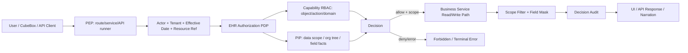

# DEV-PLAN-480：EHR 授权体系总体方案

**状态**: 规划中（2026-05-01 10:31 CST）

## 0. 适用范围与评审分级

- **评审分级**：`T2`
- **范围一句话**：把 EHR 授权从当前 route/object/action 级 Casbin 门禁，升级为覆盖 API 能力、组织数据范围、对象实例、字段和 AI 代用户执行的运行时授权体系蓝图；CubeBox 业务工具链当前统一走 `DEV-PLAN-490` 的 API-first 路线，不再规划 executor UI 展示。
- **关联模块/目录**：`pkg/authz/**`、`config/access/**`、`scripts/authz/**`、`internal/server/authz_middleware.go`、`modules/*/services`、`modules/*/infrastructure`、`modules/cubebox/**`、`internal/server/cubebox_*`、`apps/web/src/**`
- **关联计划/标准**：`AGENTS.md`、`DEV-PLAN-000`、`DEV-PLAN-001`、`DEV-PLAN-011`、`DEV-PLAN-012`、`DEV-PLAN-015`、`DEV-PLAN-017`、`DEV-PLAN-019`、`DEV-PLAN-020`、`DEV-PLAN-022`、`DEV-PLAN-032`、`DEV-PLAN-300`、`DEV-PLAN-304`、`DEV-PLAN-460`、`DEV-PLAN-468`、`DEV-PLAN-481`、`DEV-PLAN-482`、`DEV-PLAN-482A`、`DEV-PLAN-483`、`DEV-PLAN-484`、`DEV-PLAN-487`、`DEV-PLAN-488`、`DEV-PLAN-489`
- **用户入口/触点**：授权管理配置页、功能授权项、API 授权目录、后置授权项诊断、所有受保护 HTTP API 与 CubeBox API-first 工具调用链

### 0.1 Simple > Easy 三问

1. **边界**：AuthN/session 只证明是谁；RLS 只做租户圈地；EHR 授权 PDP 负责“谁能对什么对象做什么事”；数据范围 resolver 负责“同租户内能看哪些实例”；字段策略负责“哪些字段可见、可写、需脱敏”；首期 UI 只覆盖授权管理面，其中用户授权页的组织范围不是占位，而是首批授权管理闭环的一部分；授权项诊断是后置只读治理视图，不进入角色配置主路径，也不作为功能授权项/API 授权目录首批闭环前置。
2. **不变量**：所有服务端入口 fail-closed；registry 白名单、历史前端 `permissionKey`、模型输出、知识包、导航可见性、RLS 都不等于授权；同一个业务读写路径必须同时服务 UI、API 与 CubeBox，避免两套可见性规则。
3. **可解释**：主流程可在 5 分钟内复述为：请求解析 principal/tenant/context，PEP 组装动作与资源，PDP 先判能力，再用数据范围裁剪或拒绝实例，再按字段策略过滤/脱敏，最后记录可审计 decision；授权管理 UI 首批展示当前已冻结的角色、用户授权、功能授权项和 API 授权目录，授权项诊断作为后置治理视图。

### 0.2 现状研究摘要

- `DEV-PLAN-022` 已冻结 Casbin 工具链、role-based subject、tenant domain、object/action registry 与 `AUTHZ_MODE` 三态；当前 `pkg/authz.Authorizer.Authorize(subject, domain, object, action)` 能支撑 API 能力授权。
- 当前 `pkg/authz` 仍是角色粒度 RBAC + tenant domain；它不表达组织树数据范围、对象实例或字段级裁决。
- 当前 `internal/server/authz_middleware.go` 以 route 映射 object/action；CubeBox 业务工具链后续按 `DEV-PLAN-490` 从 484 单一覆盖事实聚合源与 485 API 授权目录投影筛选可调用 HTTP API。
- `DEV-PLAN-486` 的 executor 路线只保留为活体警示；当前方案不再以 executor registry 作为业务工具契约。
- 当前 `ExecuteRequest` 有 `TenantID`、`PrincipalID`、`ConversationID`，缺少 `PrincipalRoleSlug`；现有 Casbin subject 从 role slug 推导，不能把 `PrincipalID` 误当 subject。
- 历史前端 `RequirePermission` / `permissionKey` 只基于本地 `VITE_PERMISSIONS` 做导航和页面提示，默认空权限时甚至是 `*`；它不是安全边界，且按 `DEV-PLAN-483` 必须硬删除旧 key、旧字段和构建期权限 fallback。现行前端只能通过 `requiredCapabilityKey` 消费 canonical `object:action` authz capability key，当前用户集合字段只能是 `authz_capability_keys`。
- “用户 A 能看整个飞虫与鲜花，用户 B 只能查看鲜花公司”属于同租户内组织数据范围授权，不是 route authz、RLS 或 CubeBox prompt 能解决的问题。

## 1. 背景与上下文

EHR 系统的授权不能只停留在“页面能不能进”或“API 能不能调用”。真实业务里，同一个 HR 角色在不同组织范围、不同人群、不同字段可见性下权限不同：

- 集团 HR 可以查看整个“飞虫与鲜花”集团。
- 鲜花公司 HR 只能查看“鲜花公司”及其下级组织。
- 部门经理可以查看本部门员工的部分信息，但不能看薪酬、证件等敏感字段。
- CubeBox 或其他 AI 工具只能代当前用户执行其本人已经被授权的查询，不能因为模型知道内部工具名称就扩大权限。

当前仓库已有最小 Casbin 授权工具链，但它只覆盖能力授权的基础层。480 的目标是冻结一个完整、分层、可演进的 EHR 授权体系，让后续各业务模块和 CubeBox API-first 工具链接入时有统一 owner、统一失败语义和统一 UI 表达。

## 2. 目标与非目标

### 2.1 核心目标

1. [ ] 冻结 EHR 授权体系分层：身份与上下文、能力/API 授权、数据范围、对象实例、字段级授权、AI 代用户执行。
2. [ ] 评估并明确当前 `pkg/authz` 的改造边界：Casbin 不替换；核心四元组可保留；需要增加统一 Request/Decision 门面、PIP 数据范围 resolver 与服务端裁决摘要。
3. [ ] 明确组织数据范围授权方案，覆盖“用户 A 能看整个飞虫与鲜花，用户 B 只能查看鲜花公司”这类同租户内可见范围差异。
4. [ ] 明确 registry 白名单、历史前端 `permissionKey`、知识包、模型输出、RLS、导航可见性都不等于授权。
5. [ ] 将 CubeBox 业务工具授权收敛到 `DEV-PLAN-490`：基于 484 单一覆盖事实聚合源、485 API 授权目录投影、当前用户权限和业务 HTTP API 执行，不走 executor UI 或第二业务工具面。
6. [ ] 增加 UI 设计方案：首批只覆盖角色管理、用户授权、功能授权项、API 授权目录；授权项诊断按 `DEV-PLAN-488` 后置，不新增普通用户错误页、权限摘要页、CubeBox 授权反馈页或字段脱敏运行态页面。
7. [ ] 定义实施切片、测试分层和验收门禁，避免一次性大爆炸实现。

### 2.2 非目标

1. 不在本方案文档变更中新增 DB 表、迁移或在线权限配置 UI；任何 schema 变更必须另起实施计划并获得用户手工确认。
2. 不替换 Casbin，不引入 OPA、CEL 或第二套 policy engine。
3. 不把数据范围塞进 Casbin object 字符串，例如 `orgunit.orgunits:FLOWER`；组织范围应由独立 PIP/resolver 与业务读路径强制。
4. 不把前端隐藏按钮当作安全控制；所有安全判断必须在服务端 PEP/PDP 处 fail-closed。
5. 不为未来所有 EHR 模块一次性实现完整策略后台；480 先冻结蓝图和首批切片，后续按子计划分批落地。
6. 不恢复 legacy、SetID、scope/package 或旧 org_level/scope_type/scope_key 语义。

### 2.3 用户可见性交付

- **用户可见入口**：
  - 授权管理员：角色管理（基础信息 + 功能权限，UI 边界详见 `DEV-PLAN-481`，保存 API 与持久化详见 `DEV-PLAN-487`）、用户授权/角色分配（主体 + 角色 + 组织范围绑定，详见 `DEV-PLAN-489`）、功能授权项、API 授权目录；授权项诊断按 `DEV-PLAN-488` 后置提供。
  - 普通用户：`CubeBox` 查询与现有业务 API/页面消费服务端授权裁决；480 不新增新的组织业务页面。
- **最小可操作闭环**：
  - 授权管理员可在用户授权页配置“用户 B 被授予 `flower-hr`，组织数据范围为鲜花公司及下级”的授权关系；该组织范围配置必须能保存、校验并进入运行时裁决，不得只是 UI 占位。
  - CubeBox 调用业务 HTTP API 时按当前用户权限执行；查询集团根或其他公司时由同一业务读路径裁剪或拒绝。
  - 无 `orgunit.orgunits:read` 能力的用户直接访问相关 API 返回统一拒绝；480 不新增普通用户侧 UI 说明页面。
- **后端先行验收**：
  - 首批 CubeBox API-first 工具链可以先不新增 UI 控件，但必须通过服务端测试证明授权拒绝不会 fallback 到普通聊天或无授权执行。

### 2.3.1 “可配置数据范围”的定义

本方案中的“授权管理 UI 可配置数据范围”特指：管理员在用户授权/角色分配页面中，为某个主体被授予的角色配置其可行使权限的组织范围。例如用户 B 拿到 `flower-hr` 角色，但范围只限“鲜花公司及下级组织”。它不是角色定义的一部分，也不是前端过滤条件、prompt 提示或未来占位。

首批纳入用户授权闭环时，必须同时满足：

1. 有明确的数据范围 SoT：至少能表达 `principal/role -> org root + include_descendants`，若需要新增 DB schema，必须按仓库规则先获得用户手工确认。
2. 有保存校验：当所选角色包含 `scope_dimension=organization` 的 capability 时，组织范围必填；缺失时不得默认全租户，也不得保存为隐式全量。
3. 有服务端强制：`list/search` 按授权组织范围裁剪；`details/audit/write` 目标越界时 fail-closed，具体 `403/404` 泄露策略由数据范围子计划冻结。
4. 有同路径复用：普通业务页面、HTTP API 与 CubeBox API-first 工具链必须复用同一服务端读写路径和数据范围裁决。
5. 有 A/B 验收：A 用户可看全集团，B 用户只看鲜花公司及下级，且直接 API 与 CubeBox 调用行为一致。

## 2.4 工具链与门禁

- **命中触发器**：
  - [ ] Go 代码
  - [ ] `apps/web/**` / presentation assets / 生成物
  - [ ] i18n（仅 `en/zh`）
  - [ ] DB Schema / Migration / Backfill / Correction（后续数据范围 SoT 落地时命中）
  - [ ] sqlc（后续数据范围 SoT 落地时命中）
  - [ ] Routing / allowlist / responder / 相关路由注册/映射
  - [ ] AuthN / Tenancy / RLS
  - [ ] Authz（Casbin）
  - [ ] E2E
  - [ ] 文档 / readiness / 证据记录

- **011 工具链评估结论**：
  - `DEV-PLAN-011` 可支撑 480：Go、Casbin、Go test、lint、authz pack/test/lint、前端 MUI/React/Vite 工具链均在仓库基线内。
  - 不需要新增 policy engine 或外部基础设施。
  - 后续若落地数据范围 SoT，会命中 DB/schema/sqlc 门禁，但这不是工具链缺口。
- 当前 authz lint 强度仍偏基础，后续需要按 `DEV-PLAN-484` 把“object/action registry、route 映射、CubeBox API tool overlay、policy 源文件、功能授权项覆盖证据”的漂移检查纳入专项切片；旧权限键回流仍按 `DEV-PLAN-483` 阻断。

### 2.4.1 当前授权模块是否需要改造

结论：当前授权模块不需要推倒重写，但需要从“Casbin 四元组薄封装”演进为“EHR 授权裁决门面 + PIP 数据输入 + 可审计 Decision”的平台能力。

保留项：

1. 保留 Casbin 作为能力/API 授权引擎。
2. 保留 `subject/domain/object/action` 的基础语义：`subject=role:{slug}`、`domain=tenant_id/global`、`object=module.resource`、`action=稳定动作`。
3. 保留 `config/access/policies/**` 作为当前 policy SSOT 与 `make authz-pack && make authz-test && make authz-lint` 工具链。
4. 保留 RLS 只做租户圈地的职责边界。

必须补强项：

1. 增加统一 `Authorize(ctx, Request) (Decision, error)` 门面，Request 包含 actor、tenant、object/action、resource ref、operation context、effective_date、request_id。
2. 增加 PIP 接入点：数据范围、组织树上下级、字段敏感级别等上下文事实由 PIP/resolver 提供，PDP 不直接查散落的业务表。
3. 增加 Decision 结构：`Allowed`、`Enforced`、`ReasonCode`、`AppliedScopes`、`MaskedFields`、`PolicyRev`、`DecisionID`、`AuditFacts`。
4. 增加数据范围裁剪接口，用于 list/search 默认裁剪，用于 details/audit/write 目标校验。
5. 增强 authz lint/test，按 `DEV-PLAN-484` 阻止 route requirement、policy object/action、CubeBox API tool overlay 与 registry 漂移；按 `DEV-PLAN-483` 阻止前端旧 permission key 回流。

不应做的改造：

1. 不把 Casbin subject 改成 principal 级 policy；principal 继续用于审计和数据范围事实关联。
2. 不在 Casbin policy 中维护每个组织节点或每个员工实例。
3. 不把 UI permission key 作为后端 policy 的主事实源；旧 UI permission key 按 `DEV-PLAN-483` 硬删除。
4. 不让业务模块绕过统一门面直接调用 Casbin enforcer。

## 2.5 测试设计与分层

| 层级 | 本方案承接内容 | 代表对象/文件 | 说明 |
| --- | --- | --- | --- |
| `pkg/authz` | Request/Decision、subject/domain normalize、mode、object/action registry、数据范围接口纯契约 | `pkg/authz/*_test.go` | 黑盒表驱动，覆盖 allow/deny/shadow/disabled/error |
| `modules/*/services` | 能力授权后的业务规则、数据范围裁剪、对象实例校验、字段过滤/脱敏 | 各模块服务测试 | 不把业务可见性散落在 controller |
| `internal/server` | route 到 requirement 映射、统一 403、session role/tenant 注入、CubeBox API-first adapter | `internal/server/*_test.go` | 只测适配和组合，不复制业务规则 |
| `modules/cubebox` | API tool overlay、API call plan 校验、当前用户 API 调用继承授权 | `modules/cubebox/*_test.go` | 首批切片按 `DEV-PLAN-490` 覆盖未知 path、权限拒绝与参数校验 |
| `apps/web/src/**` | 角色管理、用户授权、功能授权项、API 授权目录 | Vitest / Testing Library | UI 只测试已画管理页面，不新增权限摘要、范围提示、字段脱敏或 CubeBox 授权反馈页面 |
| `E2E` | A/B 用户数据范围、CubeBox API-first 一致性 | `e2e/**` | 覆盖最小业务闭环 |

## 3. 架构与关键决策

### 3.1 5 分钟主流程



- **主流程叙事**：入口 PEP 解析当前 actor、tenant、role、effective date 与目标资源；PDP 先判断 object/action 能力，再读取 PIP 上下文计算数据范围、对象实例和字段裁决；允许时把 scope filter 和 field mask 下发给业务服务；拒绝时统一返回 forbidden 或 CubeBox terminal error。
- **失败路径叙事**：缺 tenant、缺 principal、缺 role、缺 requirement、缺 PIP 事实、Casbin error、数据范围不可判定、字段策略冲突都 fail-closed；list/search 不因越界参数扩大范围；details/write 目标越界直接拒绝或按契约隐藏为 not found。
- **恢复叙事**：管理员补齐角色、数据范围绑定或字段策略后，用户重新发起请求；系统不启用 legacy fallback 或无授权旁路。

### 3.2 模块归属与职责边界

- **`pkg/authz`**：授权 Request/Decision、object/action registry、Casbin adapter、PDP/PIP 接口、错误与 reason code。
- **`internal/server`**：HTTP PEP、session/tenant/role 注入、route requirement、统一 forbidden responder、CubeBox API-first adapter。
- **业务模块 `modules/*`**：在 service/read path 统一消费 scope filter 与 field mask；模块拥有自己的资源语义和字段敏感级别定义。
- **`modules/cubebox`**：按 `DEV-PLAN-490` 使用 API tool overlay 与 API call plan，不维护平行业务 executor payload 事实源。
- **`apps/web`**：负责 `designs/480.pen` 已冻结的管理页面交互；不在本方案扩展普通业务页提示、字段脱敏运行态或 CubeBox 授权反馈 UI。

authz capability 候选项与角色 UI 下拉/矩阵的全量来源由 `DEV-PLAN-482` 承接；不得从 policy CSV 或历史前端 `permissionKey` 反推可选全集。

### 3.3 授权体系分层

| 层 | 解决的问题 | 例子 | 强制位置 |
| --- | --- | --- | --- |
| AuthN / Actor | 当前是谁、来自哪个 session | principal、role_slug、tenant_id | session middleware |
| Tenant / RLS | 是否被限制在当前租户 | A 租户不能读 B 租户 | DB tx + RLS |
| Capability / API | 是否能做某类事 | `orgunit.orgunits:read` | HTTP/service/API runner PEP + Casbin |
| Data Scope | 同租户内能看哪些范围 | A 看集团，B 只看鲜花公司 | PIP + 业务读路径 |
| Object Instance | 能否访问具体对象 | 能否打开某个 org/person/job | service guard |
| Field | 字段是否可见/可写/脱敏 | 薪酬、证件号、联系方式 | projection/filter |
| AI / API Tool | 工具能否代用户调用既有 API | CubeBox 调用 `GET /org/api/org-units` | API tool overlay + 既有 HTTP API PEP |
| Audit / Explain | 为什么允许/拒绝 | decision_id、reason_code | audit log / admin UI |

Capability/API 层的标识关系：

```text
API Route Requirement = method + route -> authz_object + authz_action
Authz Capability Key  = authz_object + ":" + authz_action
```

因此 `orgunit.orgunits:read` 是授权项标识（authz capability key），不是 API 地址；它可以覆盖 `GET /org/api/org-units`、`GET /org/api/org-units/details`、`GET /org/api/org-units/audit` 等多个读取接口。UI 功能授权项主页面与点击授权项标识后打开的“关联 API”弹窗由 `DEV-PLAN-482A` 承接，主表只展示 authz capability 语义，API method/path 只能在弹窗中展示；全量 HTTP API 正向查看面由 `DEV-PLAN-485` 的 `API 授权目录` 承接；两者都只能消费 `DEV-PLAN-484` 的单一覆盖事实聚合源。不可分配、停用、无覆盖或内部 surface 的 authz capability 诊断由 `DEV-PLAN-488` 的后置 `授权项诊断` 承接，不进入普通功能授权项默认列表。

术语收敛：

1. 480 系列中的 capability 若用于授权管理，统一指 `authz capability key = object:action`，用户可见中文统一称为“授权项标识”。
2. 新增 API、角色保存 payload、前端守卫和 API 授权目录只允许使用 `authz_capability_key` / `authz_capability_keys` / `requiredCapabilityKey` 这类显式字段名；不得新增裸 `capability_key` / `capability_keys` 字段作为授权项标识。
3. 历史 Strategy Registry / SetID / 字段策略文档中的 `capability_key` 表达业务策略上下文或流程能力锚点，不等同于 480 系列的授权项标识；实现和文档不得把二者混用。
4. 字段策略、动态规则、SetID 配置若仍需业务 capability 语义，必须在对应计划中明确称为“业务策略 capability key”或更具体名称。

补充说明：

- 角色、授权关系和功能授权项属于授权管理面；本轮不新增独立权限摘要/权限核查页面。
- 若后续需要授权域只读查询，必须另起计划冻结查询对象、返回摘要和权限边界。

### 3.4 组织数据范围授权

“用户 A 能看整个飞虫与鲜花，用户 B 只能查看鲜花公司”应建模为数据范围，而不是 route 权限。

推荐语义：

| 用户 | 能力授权 | 数据范围 | 结果 |
| --- | --- | --- | --- |
| A | `orgunit.orgunits:read` | 根为“飞虫与鲜花” | list/search/details/audit 可覆盖全集团 |
| B | `orgunit.orgunits:read` | 根为“鲜花公司” | list/search 只返回鲜花公司子树；访问集团根或其他公司被拒绝 |
| C | 无 `orgunit.orgunits:read` | 即使配置范围也无效 | 无入口，API 403，CubeBox terminal error |

服务端契约：

1. `list/search`：默认裁剪到当前用户可见范围；`all_org_units=true` 只能表示“我有权看到的全部组织”。
2. `details/audit`：目标组织不在范围内时 fail-closed；是否返回 `403` 还是 `404` 必须按资源存在性泄露风险在子计划中冻结。
3. `write`：目标组织、父组织、新 manager 所在组织等关联对象都必须做实例范围校验。
4. `CubeBox`：不得自行判断组织范围；API-first 工具调用同一条受保护读路径。
5. `UI`：组织树根节点从服务端返回的可见根开始，不在前端展示不可见父级后再隐藏子级。

数据范围事实源必须在首批用户授权闭环落地前由独立实施计划冻结，候选模型包括：

- principal/role 与一个或多个 org root 绑定。
- 基于岗位/任职/管理链推导可见范围。
- 基于 HR 服务团队服务范围推导。

在未完成 SoT 前，不得把用户授权页的组织范围配置作为可交付保存功能发布，也不得用 prompt、前端过滤或 Casbin object 字符串临时代替。若 UI 先行合入，只能作为不可保存的设计验证态，并必须在同一计划中明确阻断生产入口。

### 3.5 字段级授权与脱敏

EHR 字段必须分层：

| 字段类别 | 示例 | 默认策略 |
| --- | --- | --- |
| 公共组织字段 | 组织代码、名称、状态 | 随资源 read 可见 |
| 受限人员字段 | 联系方式、证件、生日 | 需要字段策略允许 |
| 高敏字段 | 薪酬、银行、健康、纪律 | 默认不可见，必要时脱敏 |
| 审计字段 | 操作人、操作时间、变更原因 | 仅审计/管理员可见 |

字段安全配置文件与运行时字段裁决输出不应只是一组布尔值，应能表达：

- `visible`
- `editable`
- `required`
- `masked`
- `masking_mode`
- `reason_code`

如后续业务界面接入字段裁决，只能根据服务端返回结果渲染：隐藏列、禁用输入、显示脱敏值或显示无权限占位。该运行态 UI 不属于 480 当前设计交付；API 响应必须已经过滤或脱敏，不能把敏感原值下发给前端再隐藏。

### 3.6 CubeBox / AI 代用户执行授权

CubeBox 的规则必须更严格，因为模型会生成执行计划。当前路线按 `DEV-PLAN-490` 走 API-first：

1. `cubebox.conversations:use` 只表示用户可以使用对话入口，不表示可以调用业务 API。
2. 可调用工具必须来自 484 单一覆盖事实聚合源经 485 API 授权目录 facade 投影后的 API 条目 + 490 tool overlay；模型不得自由拼 path。
3. 每次 API 调用都以当前用户、当前租户、当前 session 执行，继续经过既有 route/service authz、RLS、数据范围和字段裁剪。
4. registry 白名单、knowledge pack、模型输出、candidate window、history summary 都不能声明或扩大权限。
5. 多 step plan 中任一步拒绝时，整个执行链返回 terminal error，不 fallback 到普通聊天链路。
6. 480 不新增 CubeBox 授权反馈 UI 或授权摘要查询 UI；对话面交互按 CubeBox 既有页面契约和 `DEV-PLAN-490` 收敛。

### 3.8 ADR 摘要

- **决策 1：保留 Casbin，补 EHR PDP 门面**
  - **备选 A**：替换成 OPA/CEL。拒绝，当前需求不是表达式引擎不足，而是分层和裁决上下文缺失。
  - **备选 B**：继续只用 route middleware。拒绝，无法覆盖数据范围、字段和 CubeBox API-first 工具调用。
  - **选定理由**：复用现有工具链，增加必要边界，不引入第二授权系统。

- **决策 2：数据范围不进入 Casbin object**
  - **备选 A**：`orgunit.orgunits.flower_company:read`。拒绝，策略爆炸且难以跟组织树生效日期、重组、回放对齐。
  - **选定理由**：能力授权和数据范围分层，读路径统一裁剪，UI 与 CubeBox 一致。

- **决策 3：管理 UI 只覆盖已冻结页面**
  - **备选 A**：在 480 中继续规划权限摘要、范围提示、字段脱敏和 CubeBox 授权反馈页面。拒绝，这些页面未进入当前设计稿，继续保留会造成文档漂移。
  - **选定理由**：首期只保留角色管理、用户授权、功能授权项和 API 授权目录四类管理面。

- **决策 4：授权项标识与历史业务 capability 术语硬区分**
  - **备选 A**：继续在所有场景裸用 `capability_key`。拒绝，会把 authz `object:action` 与历史 SetID/字段策略业务策略 capability key 混成同一概念。
  - **选定理由**：480 系列只冻结授权项标识；历史业务策略 capability key 不得作为角色候选、API route requirement 或前端守卫 key。

- **决策 5：角色能力运行时只允许一个普通 tenant SoT**
  - **备选 A**：角色定义 DB 与 policy CSV 同时参与普通 tenant role 放行。拒绝，这是双链路授权，会导致管理员保存角色后与运行时结果不一致。
  - **选定理由**：`DEV-PLAN-487` 完成 cutover 后，普通 tenant role 的能力集合只从 DB role authz capability SoT 读取；policy CSV 仅保留 bootstrap/static/system surface。

- **决策 6：覆盖事实只能有一个枚举源**
  - **备选 A**：482A、485、488 各自解析 route/registry/policy。拒绝，会把“功能授权项”“API 授权目录”“授权项诊断”做成三套覆盖判断。
  - **选定理由**：`DEV-PLAN-484` 拥有 route/tool overlay/registry/policy 的唯一服务端覆盖事实枚举与 lint；482 options、482A 关联 API、485 API 授权目录、490 CubeBox tool builder 和 488 授权项诊断只能消费同一聚合函数或同一枚举结果。
  - **实施顺序**：先完成 484 覆盖事实枚举与 lint，再让 482 options、482A 弹窗、485 目录和 490 tool builder 接入同源聚合；488 诊断页后置，不作为首批闭环前置。

## 4. 数据模型、状态模型与约束

### 4.1 权限上下文模型

授权 Request 的逻辑字段：

| 字段 | 含义 |
| --- | --- |
| `tenant_id` | 租户域，RLS 与 Casbin domain 的输入 |
| `principal_id` | 审计主体，不直接作为 Casbin subject |
| `role_slug` | 当前 session 有效角色 |
| `object` / `action` | 稳定授权维度；对外 authz capability key 统一序列化为 `object:action`，例如 `orgunit.orgunits:read` |
| `resource_type` / `resource_id` | 具体对象实例，可为空 |
| `effective_date` | 业务有效日期，date 粒度 |
| `purpose` | 访问目的，如 normal、admin_audit |
| `request_id` | 审计链路 |

Decision 的逻辑字段：

| 字段 | 含义 |
| --- | --- |
| `allowed` | 是否允许 |
| `enforced` | 当前 mode 是否强制 |
| `reason_code` | 稳定拒绝/允许原因 |
| `applied_scope` | 实际使用的数据范围摘要 |
| `field_decisions` | 字段 visible/editable/masked 等 |
| `policy_rev` | policy 版本 |
| `decision_id` | 审计定位 ID |

### 4.2 时间语义

- 业务有效日期使用 `date`：组织归属、任职、管理链、HR 服务范围、字段策略的业务生效均按日粒度判断。
- 审计/操作时间使用 `timestamptz`：decision 产生时间、请求时间、策略保存时间。
- 480 首期授权管理 UI 不新增 `effective_date` 控件。后续数据范围、字段策略或业务运行态页面若引入业务视图日期，必须明确标注为业务有效日期，不能和操作时间混用。

### 4.3 RLS / 显式事务契约

- tenant-scoped 数据访问继续遵守 No Tx, No RLS。
- RLS 负责跨租户硬隔离，应用授权负责同租户内能力、范围和字段。
- 数据范围不能通过前端 query 参数或普通 `WHERE tenant_id = ...` 替代。

### 4.4 后续可能命中的 DB SoT

本方案不直接建表。后续子计划若需要持久化授权事实，必须独立冻结：

- 角色定义 DB SoT、角色 authz capability 集合与普通 tenant role 运行时 cutover 由 `DEV-PLAN-487` 独立冻结；480 不允许 DB 与 policy CSV 双链路 OR 放行。
- 用户授权、principal 角色分配与组织范围绑定由 `DEV-PLAN-489` 独立冻结；489 不重复定义角色定义主表或角色 authz capability 主表。
- 字段敏感级别与字段策略表。
- 授权 decision audit 表或事件流。

## 5. UI 设计方案

### 5.1 UI 原则

1. 480 的 UI 范围首批只覆盖已冻结的授权管理主路径；新增授权项诊断时必须按 `DEV-PLAN-488` 后置实施，并保持只读治理视图边界。
2. UI 不承担安全强制；所有安全判断必须在服务端 PEP/PDP 和业务读写路径 fail-closed。
3. 普通业务页的范围提示、字段脱敏运行态、CubeBox 授权反馈和权限摘要页不属于本方案 UI 交付。

### 5.2 现有业务页面边界

480 不新增新的组织业务页面。现有业务页面若接入 480 授权裁决，只需要遵守以下消费原则：

1. 业务列表/详情必须使用服务端已裁剪结果；前端不计算越权过滤。
2. `read`、`export`、`audit`、`write` 是不同能力；导出、审计、写入不能复用 read。
3. 目标不可访问时由服务端 fail-closed；是否返回 `403` 或 `404` 由资源泄露策略在子计划中冻结，480 不新增前端普通用户错误页。
4. API 响应必须已经过滤或脱敏敏感字段，前端不能收到原值后再隐藏。

这些原则是现有业务页面的集成约束，不构成 480 新增业务页面需求。

### 5.3 授权管理 UI

授权管理 UI 必须区分两个首期工作流：

1. **角色管理 / 角色定义**：定义一个角色的基础信息与功能权限；不配置组织范围，不配置字段脱敏/隐藏。UI/交互边界详见 `DEV-PLAN-481`，在线保存 API、持久化模型、服务端校验与运行时生效详见 `DEV-PLAN-487`。
2. **用户授权 / 角色分配**：把角色授予 principal/team/position，按资源/能力 registry 推导的数据维度绑定具体组织范围。组织范围配置是用户授权首批闭环的一部分，不得退化为静态展示或未来占位。

本方案 480 冻结体系蓝图、运行时裁决、数据范围强制和管理 UI 边界。角色如何定义、授权分配如何绑定范围，以 `DEV-PLAN-481` 为 UI/交互 SSOT；角色定义的在线保存 API、DB SoT、校验与普通 tenant role 运行时能力授权来源由 `DEV-PLAN-487` 承接；数据范围 SoT、保存模型和服务端强制由 `DEV-PLAN-489` 的首批用户授权实施链路承接；授权项诊断视图由 `DEV-PLAN-488` 后置承接，且不得改变 482 普通候选项口径。字段级授权仍属于 480 运行时蓝图，但不进入本轮极简用户授权界面或运行态 UI。

修正后的信息架构：

1. 不新增独立的管理员画像、授权摘要或权限核查页面；页面命名不得把角色定义与角色分配混成一个入口。
2. `授权管理 > 角色管理` 不选择具体用户或具体组织根，只定义角色基础信息和功能权限；可编辑状态统一提供“取消 / 保存”，保存即生效，不再提供第二个生效按钮；首期不提供“复制角色 / 克隆角色 / 从已有角色新建”入口。
3. `授权管理 > 用户授权` 顶部选择主体并提供“取消 / 保存”，主区拆成“角色”和“组织范围”两个页签；不得在用户授权页配置字段策略、有效期、冲突检测或策略预览。
4. 对带范围语义的资源/能力，用户授权时数据范围是必填项；若主体被授予 `orgunit.orgunits:read` 但没有组织范围，授权记录不可保存，而不是默认全租户。
5. “角色”页签是可加行表格：每行选择一个授权角色，并通过只读“角色说明”列说明该角色可查看或操作什么。
6. “组织范围”页签是可加行表格：每行选择一个组织，并提供“包含下级组织”勾选列；新增行初始为已选中，界面不额外显示说明文字。
7. 授权管理里的组织选择器是配置主体数据范围的控件，应复用服务端组织读路径和范围语义；它不是新的业务组织页面。
8. 用户授权页冻结当前设计稿中的选择器、角色表格、组织范围表格和统一“取消 / 保存”操作；组织范围保存、必填校验和运行时生效必须进入首批用户授权实施闭环。保存后审计解释不进入本轮 UI 范围。
9. `授权管理 > 授权项诊断` 是后置只读治理视图，用于查看不可分配、停用、无覆盖或内部 surface 的 authz capability 及排除原因；它不得作为角色定义候选源，也不得提供 registry 编辑或 policy 修复入口。

管理 UI 操作必须本身受 `iam.authz` 或专用 object/action 保护；角色定义在线写入由 `DEV-PLAN-487` 承接，用户授权在线写入由 `DEV-PLAN-489` 承接，审计展示若后续需要，必须另起计划。

角色复制暂不实现。若后续确有批量建模需求，必须另起计划冻结复制语义、唯一 `role_slug` 生成规则、能力集合审计差异和不可复制字段清单；不得在 480/481 首期 UI、API 或 fixture 中预留复制按钮、复制 endpoint 或 clone payload。

### 5.4 CubeBox UI

480 不新增 CubeBox 授权反馈、授权摘要查询或专用拒绝态 UI。CubeBox 是否可调用某个业务 HTTP API、拒绝后是否 terminal error，以及 observation 投影均由 `DEV-PLAN-490` 的运行时契约承接。

### 5.5 视觉与交互基线

- 继续使用现有 React + MUI 风格和丘比蓝 `#09a7a3`。
- 权限相关状态使用 MUI `Alert`、`Chip`、`Tooltip`、`Dialog`、`DataGrid` toolbar，不新增浮夸装饰。
- 按钮用清晰动作名和既有 MUI icons；危险授权管理动作需要确认弹窗。
- 移动端优先保证筛选器和表格列不重叠。

## 6. 实施切片

### 6.1 P0：授权语义冻结与门禁补强

1. [ ] 按 `DEV-PLAN-482/483/484` 整理 object/action registry，删除前端旧 permission key、policy-only key，并确认 route authz、policy、CubeBox API tool overlay 与功能授权项覆盖证据的映射关系。
2. [ ] 按 `DEV-PLAN-484` 增加 authz 覆盖 lint/test，阻止未登记 object/action、未打包 policy、API 覆盖缺失和前后端权限键漂移；前端旧权限键回流按 `DEV-PLAN-483` 承接。
3. [ ] 补 `iam.authz:read/admin` 或更明确授权项的 registry seed、route requirement 与 policy 归属，作为 482 capabilities 和 485 API catalog endpoint 的保护对象。
4. [ ] 补 `docs/dev-records/DEV-PLAN-480-READINESS.md` 记录工具链、门禁和当前差距。

### 6.2 P1：CubeBox API-first 工具授权

1. [ ] 按 `DEV-PLAN-490` 从 484 单一覆盖事实聚合源与 485 API 授权目录投影派生 CubeBox 可调用 HTTP API。
2. [ ] API runner 以当前用户上下文调用既有业务 HTTP API 或等价 in-process route adapter。
3. [ ] 未登记 method/path、无权限、参数非法时 fail-closed。
4. [ ] 补未知 path、权限拒绝、参数校验和多 step 中途拒绝测试。

### 6.3 P2：管理 UI 与数据范围配置闭环

1. [ ] 角色管理、用户授权、功能授权项和 API 授权目录与对应 dev-plan 边界保持一致；授权项诊断按 488 后置，不阻塞首批闭环。
2. [ ] 按 `DEV-PLAN-483` 删除旧 `permissionKey` / `VITE_PERMISSIONS` 权限语言回流。
3. [ ] 用户授权页的组织范围配置必须能保存并校验：`scope_dimension=organization` 的角色授权缺少组织范围时不得保存为全租户。
4. [ ] 数据范围 SoT 由 `DEV-PLAN-489` 承接；如需新增 DB schema，必须先获得用户手工确认；实现 PR 不得绕过 schema 确认用前端本地状态或 prompt 代替。
5. [ ] 不新增权限摘要页、范围提示、字段脱敏运行态或 CubeBox 授权反馈 UI。

### 6.4 P3：组织数据范围运行时强制

1. [ ] 在 orgunit 读路径统一注入 scope filter。
2. [ ] 覆盖 A/B 用户：A 全集团，B 仅鲜花公司。
3. [ ] CubeBox API-first 工具链和普通 orgunit API 复用同一读路径。
4. [ ] details/audit/write 越界 fail-closed，`403/404` 策略在 `DEV-PLAN-489` 中冻结。

### 6.5 P4：字段级授权

1. [ ] 字段敏感级别、字段安全配置文件和脱敏输出落地。
2. [ ] 字段级授权落地时必须与 `DEV-PLAN-481` 对齐：字段脱敏/隐藏不进入极简用户授权界面；若后续需要管理入口，应另起独立字段安全计划。

## 7. 风险与缓解

| 风险 | 表现 | 缓解 |
| --- | --- | --- |
| 把 RLS 当授权 | 同租户内所有人都能看所有数据 | RLS 只圈租户；数据范围在服务端读路径强制 |
| 把 UI 当授权 | 隐藏按钮但 API 可直调 | 所有 API/service/CubeBox API runner 都有 PEP |
| 策略键漂移 | policy、route、UI、tool overlay 名称不一致 | registry + lint + 测试统一 |
| 数据范围过度设计 | 首期还没跑通就建复杂 ABAC DSL | 先 orgunit subtree，后续再加管理链/服务范围 |
| capability 术语混淆 | authz `object:action` 与历史字段策略/SetID 业务策略 capability key 互相引用 | 480 系列统一称 authz capability key / 授权项标识；业务策略 capability key 只在对应业务计划中显式使用 |
| 角色授权双链路 | DB role authz capability 与 policy CSV 任一命中即放行 | 487 cutover 后普通 tenant role 只读 DB SoT；CSV 仅保留 bootstrap/static/system surface |
| 覆盖事实多套实现 | 功能授权项、API 授权目录、诊断页各自解析 route/registry/policy | 484 提供唯一覆盖事实枚举与 lint，482/482A/485/488/490 只消费同源聚合；488 后置 |
| 敏感字段泄露 | API 下发原值，前端隐藏 | 服务端 projection/filter 先处理 |
| AI 扩权 | 模型生成合法 API 调用绕过授权 | 490 API runner + 既有 route/service authz + 业务读路径 scope |
| 403 泄露资源存在性 | 用户猜测组织/人员是否存在 | 子计划冻结 403/404 策略 |

## 8. 验收标准

1. [ ] 480 文档作为 EHR 授权体系 SSOT 被 AGENTS Doc Map 收录。
2. [ ] 当前授权模块改造边界明确：保留 Casbin，补 Request/Decision/PIP，不替换引擎。
3. [ ] A/B 组织数据范围示例有明确服务端行为：用户授权页可配置范围，list/search 裁剪，details/audit fail-closed。
4. [ ] CubeBox API-first 工具授权切片具备可实施步骤和测试要求。
5. [ ] UI 设计只覆盖角色管理、用户授权、功能授权项和 API 授权目录；不包含权限摘要页、范围提示、字段脱敏运行态、CubeBox 授权反馈或普通用户错误页。
6. [ ] 实施切片按 P0-P4 分批，未把 DB schema 或在线策略管理混入首批文档变更。
7. [ ] 文档门禁 `make check doc` 通过。

## 9. Readiness 证据

实现 PR 需要新建或更新 `docs/dev-records/DEV-PLAN-480-READINESS.md`，至少记录：

- `make check doc`
- 命中 Go/Authz/UI/DB 时按 `AGENTS.md` 触发器运行对应门禁
- `make authz-pack && make authz-test && make authz-lint`
- 首批 CubeBox API-first 工具授权测试结果
- 用户授权组织范围保存/校验测试、A/B 数据范围服务端集成测试或 CubeBox API-first 一致性验证结果
