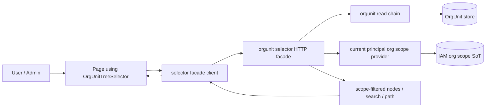

# DEV-PLAN-491：通用可复用 OrgUnit 树选择器与范围感知候选契约方案

**状态**: 实施中（2026-05-04 CST）— Phase A 已完成、Phase B 最小单选骨架已完成、Phase C 用户授权页首个接入与受限管理员 E2E 闭环已落地；Phase D 其他组织选择入口复用推广仍待后续。OrgUnit Read Core、selector-ready DTO、scope-aware visible roots 与 safe path 架构缺口已转由 `DEV-PLAN-492` 承接；本计划保留前端 selector/facade 与选择入口接入 owner，并明确不接管组织管理页浏览/编辑主 UI。当前已新增 selector facade 与 `OrgUnitTreeSelector` / picker / field 最小组件族；`授权管理 > 用户授权 > 组织范围` 已切换为 `OrgUnitTreeField`，保存 payload 仍沿用 489，保存阶段已增加当前操作者组织范围 fail-closed 校验。

## 0. 适用范围与评审分级

- **评审分级**：`T2`
- **范围一句话**：冻结一个仓库级可复用的 OrgUnit 树选择器契约，统一前端 selector/facade、懒展开、搜索、回显和页面接入方式；后端 OrgUnit read core、selector-ready DTO、scope-aware visible roots 与 safe path 由 `DEV-PLAN-492` 作为上游 owner 承接。
- **关联模块/目录**：`apps/web/src/components/**`、`apps/web/src/pages/**`、`apps/web/src/api/**`、`internal/server/**`、`modules/orgunit/**`、`modules/iam/**`
- **关联计划/标准**：`AGENTS.md`、`DEV-PLAN-000`、`DEV-PLAN-001`、`DEV-PLAN-002`、`DEV-PLAN-012`、`DEV-PLAN-017`、`DEV-PLAN-019`、`DEV-PLAN-022`、`DEV-PLAN-032`、`DEV-PLAN-073`、`DEV-PLAN-130`、`DEV-PLAN-180`、`DEV-PLAN-475`、`DEV-PLAN-476`、`DEV-PLAN-480`、`DEV-PLAN-481`、`DEV-PLAN-489`、`DEV-PLAN-489A`、`DEV-PLAN-492`
- **用户入口/触点**：`授权管理 > 用户授权 > 组织范围`、组织相关表单中的上级组织选择、范围限制类表单、后续任何需要“选择一个组织节点或组织子树”的 UI

### 0.1 Simple > Easy 三问

1. **边界**：树选择器 owner 是前端通用组件与配套 facade；`DEV-PLAN-492` 拥有 OrgUnit 节点读取、树展开、搜索、路径解析和 selector-ready DTO 的后端 read core；IAM/Authz owner 是“当前用户可见组织范围”的服务端事实与裁剪；需要“选择组织”的页面只消费 selector 契约，不再各自拼候选组织逻辑。组织管理页的浏览/编辑主 UI 仍由组织页 owner 承接，只复用 492 read core 与可抽取展示组件。
2. **不变量**：同一租户内，任何“组织候选列表/树/搜索结果”只允许来自 492 收敛后的同一条服务端读链路，并按当前调用者组织范围 fail-closed 裁剪。管理员若需要给他人配置组织范围，也只能在“自己当前可见范围”内选择，不能通过前端组件绕过运行时裁剪。
3. **可解释**：页面传入“选择模式 + 初始值 + 是否允许多选/选父级/选叶子”的最小配置；组件通过统一 API facade 拉取根节点、懒加载子节点、搜索命中与路径补全；服务端统一按当前 principal 组织范围裁剪；页面最终只收到可见且可选的组织节点。

### 0.2 现状研究摘要

- 当前仓库已有通用展示组件 [TreePanel](/home/lee/Projects/Bugs-And-Blossoms/apps/web/src/components/TreePanel.tsx:1)，组织架构页也已有“根节点 + 懒加载子节点 + 搜索定位”的现成链路 [OrgUnitsPage](/home/lee/Projects/Bugs-And-Blossoms/apps/web/src/pages/org/OrgUnitsPage.tsx:124) 与 [orgUnits API client](/home/lee/Projects/Bugs-And-Blossoms/apps/web/src/api/orgUnits.ts:20)。这些是 selector 可复用素材，不表示 491 要把组织管理页整体替换成 selector。
- 491 实施前，`用户授权 > 组织范围` 没有复用树链路，而是直接调用 `listOrgUnits({ asOf, includeDisabled:false })` 作为下拉候选，导致页面只拿到默认一级组织列表；该入口已在 Phase C 移除，当前用户授权页消费 `OrgUnitTreeField`。
- `GET /org/api/org-units` 的当前语义是：无 `parent_org_code` 且无 `keyword`、无 `all_org_units=true` 时，只返回当前租户一级组织；该语义在 [orgunit_api.go](/home/lee/Projects/Bugs-And-Blossoms/internal/server/orgunit_api.go:1168) 和 [orgunit_field_metadata_store.go](/home/lee/Projects/Bugs-And-Blossoms/internal/server/orgunit_field_metadata_store.go:770) 已固化。
- 当前 Web API 侧的 `AllOrgUnits` 运行时结构已随 490 评审修复接入 query parser；`all_org_units=true` 现只表示当前调用者可见范围内全部组织。491 后续仍不采用“用户授权页临时全量下拉”作为交付方案，selector/facade 仍需按本计划统一收敛。
- `DEV-PLAN-492` 已成为 OrgUnit 基础模块 read core、`org_node_key` DTO 暴露、scope-aware visible roots、安全展开路径和 handler 瘦身的上游 owner；491 不在页面或 selector 内补这些后端架构缺口。
- 2026-05-04 前端首切已完成：新增 [orgUnitSelector facade](/home/lee/Projects/Bugs-And-Blossoms/apps/web/src/api/orgUnitSelector.ts:1) 与 [OrgUnitTreeSelector 组件族](/home/lee/Projects/Bugs-And-Blossoms/apps/web/src/components/OrgUnitTreeSelector.tsx:1)，并扩展 [TreePanel](/home/lee/Projects/Bugs-And-Blossoms/apps/web/src/components/TreePanel.tsx:1) 支持可选受控展开，用于搜索定位后展开到命中节点。
- 2026-05-04 Phase C 首切已完成：`用户授权 > 组织范围` 不再直接调用 `listOrgUnits()` 一级候选，已改为在组织范围行使用 [OrgUnitTreeField](/home/lee/Projects/Bugs-And-Blossoms/apps/web/src/pages/authz/AuthzRolePages.tsx:617)，picker 选中后写入 `org_code`、`org_node_key` 与 `name`；保存 payload 仍沿用 489。
- 2026-05-04 PR-491C-test/E2E 已补齐受限管理员路径：受限管理员只能在 selector 中看到并选择自己范围内组织；直接保存范围外 `org_code` 或不存在组织码均按 `403 authz_scope_forbidden` fail-closed，不暴露组织码存在性。
- `DEV-PLAN-481` 已明确“组织范围页签”应是“组织下拉或组织树选择结果” [481](/home/lee/Projects/Bugs-And-Blossoms/docs/dev-plans/481-ehr-role-design-and-configuration-plan.md:195)；`DEV-PLAN-489` 已冻结“运行时组织范围必须由服务端 scope provider 强制” [489](/home/lee/Projects/Bugs-And-Blossoms/docs/dev-plans/489-user-authorization-org-scope-sot-and-runtime-enforcement-plan.md:15)。因此本次问题不是单页 UI bug，而是缺少仓库级 selector 契约。
- 本次不沿用的“容易做法”：
  - 在用户授权页临时加一个 `all_org_units=true` 下拉分支。
  - 每个页面各自实现“组织下拉 + 搜索 + 路径补齐”。
  - 前端自行缓存全租户组织树，再本地裁剪当前用户范围。
  - 在 selector 内塞入权限例外、管理员旁路或第二套 authz 判断。

## 1. 背景与上下文

仓库已经进入“组织范围是活体授权事实”的阶段。只要某个页面允许用户选择组织节点，这个页面实际上就在生产“范围事实”或“组织引用”。如果每个页面都各自拼一份组织候选逻辑，就会同时引入四类漂移：

1. 有的页面只看一级组织，有的页面能搜全量，有的页面能懒展开。
2. 有的页面按当前用户组织范围裁剪，有的页面偷偷返回全租户组织。
3. 有的页面用下拉，有的页面用树，但节点 ID、label、搜索命中与初始值回显口径不同。
4. 页面实现者容易把“选择组织”和“运行时授权”混成两套逻辑，导致 UI 与服务端裁剪不一致。

当前用户授权页暴露出来的“只能选到根组织”只是第一个可见症状。本计划的目标不是单点补洞，而是把“组织选择”冻结成一个可复用能力：

- 前端只维护一个 selector 组件族和一个 API facade。
- 服务端只维护一个候选读取契约和一种 scope-aware 裁剪语义。
- 所有页面在“选组织”这个问题上不再发明自己的局部规则。

## 2. 目标与非目标

### 2.1 核心目标

1. [ ] 冻结仓库级 `OrgUnitTreeSelector` 概念模型：节点结构、选中值、搜索结果、路径回显、懒加载和多选语义一致。（2026-05-04：单选节点、搜索定位、懒加载与回显模型已落地；多选语义仍未实施，继续保持非首期范围。）
2. [X] 消费并验证 492 冻结的服务端 selector 候选契约：根节点、子节点、搜索、按 code/id 回显、路径解析都走同一 OrgUnit 读链路，并按当前 principal 组织范围裁剪。（2026-05-04：491 facade/组件已消费 roots/children/search；用户授权页已接 `OrgUnitTreeField`；不新增后端 route、不做前端权限裁剪；PR-491C-test/E2E 已覆盖受限管理员 selector 与直接 API 保存双路径。）
3. [X] 冻结范围感知不变量：普通用户只能选择当前组织范围内节点；管理员配置其他用户授权时也不能通过 selector 越权选择自己范围外的节点；任何页面都不得自行构造“超范围候选”。（2026-05-04：受限管理员 E2E 覆盖范围内子节点可选、范围外兄弟节点不可见；服务端保存阶段按当前操作者 scope fail-closed。）
4. [ ] 冻结前端复用边界：用户授权页已复用 selector；上级组织选择、后续范围绑定页面仍需继续替换为 selector facade，不再直接拿 `listOrgUnits()` 的一级列表塞进下拉。
5. [ ] 冻结分阶段实施路线：先交付可复用契约和用户授权页切换，再逐步替换其他散落“选择组织”入口，避免一轮内大规模 UI 重写。

### 2.2 非目标

1. 不在本计划内重做整套组织管理页 UI；现有 `/org/units` 页面继续保留其列表 + 树浏览/编辑职责。491 只抽取选择交互需要的组件/facade，组织管理页的数据读取收敛由 492 承接。
2. 不在本计划内引入无限层级整树一次性加载；默认仍以“根节点 + 懒加载 + 搜索定位”为主。
3. 不在本计划内新增“按角色分别配置组织范围”；selector 只解决“如何选择组织节点”，不改变 489 的范围绑定模型。
4. 不在本计划内引入前端本地权限模型或离线树缓存；权限与范围裁剪继续只以服务端当前 principal 事实为准。
5. 不为“超大组织树一次性全量浏览”提前引入 Redis、搜索引擎或额外缓存基础设施；若后续有性能瓶颈，再单独起计划。
6. 不恢复 legacy scope/package、SetID、`org_level/scope_type/scope_key` 或第二套组织范围语义。

### 2.3 用户可见性交付

- **用户可见入口**：
  - `授权管理 > 用户授权 > 组织范围` 从“一级组织下拉”升级为“通用组织树选择器”。
  - 后续命中组织选择场景的页面可以复用同一组件，而不是重新造一个局部下拉。
- **最小可操作闭环**：
  1. 管理员打开用户授权页。
  2. 在组织范围页签中打开树选择器。
  3. 看到自己可见范围内的根节点与子节点，支持展开、搜索、选择与回显。
  4. 选择某个非根节点并保存。
  5. 普通 orgunit API / CubeBox orgunit 查询仍按 489 运行时范围强制，不出现 UI 可选但运行时不可达的“僵尸选择”。

## 2.4 工具链与门禁

- **命中触发器（截至 2026-05-04 实施进展）**：
  - [X] Go 代码
  - [X] `apps/web/**` / presentation assets / 生成物
  - [X] i18n（仅 `en/zh`）
  - [ ] Routing / responder / allowlist
  - [ ] AuthN / Tenancy / RLS
  - [X] Authz
  - [X] E2E
  - [X] 文档 / readiness / 证据记录

实际执行命令以 `AGENTS.md`、`Makefile` 与 CI 为准。本计划只冻结契约，不复制命令矩阵。

## 2.5 测试设计与分层

| 层级 | 本计划承接内容 | 代表对象/文件 | 说明 |
| --- | --- | --- | --- |
| `pkg/**` | 节点 canonicalize、selector value normalize、路径/label 纯函数 | `apps/web/src/**` 内纯函数或 `pkg/**` 纯工具 | 优先黑盒表驱动 |
| `modules/orgunit/services` | selector 候选查询所需的树/搜索/path 读取规则 | `modules/orgunit/services/*_test.go` | 由 492 承接，491 只消费 |
| `internal/server` | 现有 orgunit HTTP 读取面的 query 解析、错误映射、scope 注入与 selector DTO 映射 | `internal/server/*_test.go` | 覆盖 root/children/search/path/越界；不新增 selector 专用 route |
| `apps/web/src/components` | 选择器状态机、懒加载、搜索结果回显、单选/多选 UI 行为 | Vitest / Testing Library | 优先测状态，再测页面集成 |
| `apps/web/src/pages` | 用户授权页与其他接入页对 selector 的消费 | 页面级测试 | 不重复测 selector 内部逻辑 |
| `E2E` | 普通用户范围内可选、范围外不可见、管理员授权页选择非根节点并保存 | `e2e/**` | 证明 UI 候选与运行时裁剪一致 |

## 3. 架构与关键决策

### 3.1 5 分钟主流程



主流程：

1. 页面渲染 selector，并传入最小配置，例如单选/多选、是否允许清空、初始值。
2. selector facade 先加载“当前 principal 可见范围内的根节点”。
3. 用户展开节点时，请求子节点。
4. 用户搜索时，请求搜索结果；服务端返回命中节点及必要路径信息，前端据此展开并聚焦。
5. 用户确认选择后，页面拿到标准化 value，并继续走当前页面自己的保存 API。

失败路径：

1. 当前用户没有对应 orgunit read 能力：selector 直接失败并返回统一授权拒绝。
2. 当前用户有能力但无任何可见组织：selector 返回空树，不隐式回退全租户。
3. 用户搜索或回显的目标节点超出当前范围：服务端 fail-closed，前端不显示越界节点。

恢复语义：

1. 网络错误只影响当前 selector 会话，不写入部分选择结果。
2. 页面重新打开 selector 后，仍从服务端当前 scope 事实重新加载，不复用过期本地树。

### 3.2 模块归属与职责边界

- **`modules/orgunit` owner**：
  - 组织节点、树结构、子节点查询、搜索、路径解析。
  - selector 所需 node DTO 的基础事实。
  - 具体 read core、visible roots、`org_node_key` 暴露与 safe path 由 `DEV-PLAN-492` 承接。
- **`modules/iam` / authz owner**：
  - 当前 principal 的组织范围事实。
  - scope-aware 裁剪输入，不拥有树节点本身。
- **`internal/server` owner**：
  - 现有 orgunit HTTP 读取面适配。
  - query 参数、错误映射、当前 principal 组织范围注入；首期不新增 selector 专用 route。
- **`apps/web/src/components` owner**：
  - 通用 `OrgUnitTreeSelector` / `OrgUnitTreePickerDialog` / `OrgUnitTreeField` 组件族。
  - 组件内部状态机、懒加载、搜索与回显交互。
- **各页面 owner**：
  - 需要选择组织节点时，只消费 selector 标准 value，不自行查询组织候选。
  - 组织管理页浏览/编辑主流程不属于 selector 场景，但其读取事实应随 492 收敛到同一 read core。

### 3.3 统一策略：候选组织只有一条主链

本计划选定：

- **唯一候选读取事实源**：492 收敛后的 OrgUnit ReadService。
- **唯一范围裁剪事实源**：489 当前 principal org scope provider。
- **唯一后端 HTTP 读取面（首期）**：复用现有 `/org/api/org-units` 与 `/org/api/org-units/search`，不新增 selector 专用后端 route。
- **唯一前端组件入口**：`OrgUnitTreeSelector` + 前端薄 facade，不再让页面直接拼 `listOrgUnits()` + `Autocomplete`。

明确拒绝：

- 页面自带 `all_org_units`、`parent_org_code`、`keyword` 参数拼装。
- 页面先读全租户树，再在前端按 session/role 过滤。
- 为某个页面单独造一个 `UserAuthzOrgScopePicker`，导致与其他页面分叉。
- 首期为了 selector 新增第二套后端 route、第二套权限判断或第二套组织候选 DTO。

### 3.4 ADR 摘要

- **决策 1：冻结一个仓库级 selector 契约，而不是在用户授权页局部补洞**
  - **备选 A**：只在用户授权页把一级下拉改成全量下拉。
  - **备选 B**：只给用户授权页加一个树弹窗，不抽公共层。
  - **选定理由**：当前问题已经证明“组织候选逻辑”不是单页细节，而是权限与树读取边界问题。继续局部修补只会制造第二个、第三个 selector。

- **决策 2：服务端按当前 principal 组织范围裁剪 selector 候选**
  - **备选 A**：管理员配置别人授权时可看全租户树，保存时再校验。
  - **备选 B**：前端直接消费被授权用户的目标范围。
  - **选定理由**：本仓现行能力模型是“当前调用者决定当前可见范围”。selector 是当前调用者的浏览/选择界面，不是 impersonation 工具；被授权用户的未来范围仍由保存 API 生成。

- **决策 3：保留根节点 + 懒加载 + 搜索定位，不做整树一次性展开**
  - **备选 A**：一次性返回当前范围内整棵树。
  - **备选 B**：只做纯搜索，不支持树浏览。
  - **选定理由**：懒加载与搜索是当前仓库已有能力，复杂度最低，也最接近现有 org 页面心智。

- **决策 4：首期复用现有 orgunit HTTP API，不新增 selector 后端 facade**
  - **备选 A**：新增 `/org/api/org-unit-selector/*`。
  - **备选 B**：让每个页面继续直接调用 `/org/api/org-units*` 并自行解释参数。
  - **选定理由**：现有后端已经具备根节点、子节点、搜索定位与 489 scope 裁剪链路。首期新增后端 route 会制造第二个候选读取面；页面直接调用则会继续复制参数语义。因此只允许在 `apps/web/src/api/**` 增加 selector 前端薄 facade，封装现有 HTTP API，并由组件消费该 facade。

## 4. 统一契约

### 4.1 选择器节点模型

前端与 selector facade 统一使用最小节点模型：

```ts
interface OrgUnitSelectorNode {
  org_code: string
  org_node_key: string
  name: string
  status: 'active' | 'disabled'
  has_children: boolean
  path_org_codes?: string[]
}
```

约束：

1. `org_code` 是前端稳定 item id。
2. `org_node_key` 仅作为服务端范围/path 校验辅助，不直接展示给用户。
3. `path_org_codes` 只在搜索命中/回显需要时返回，不要求每次根列表都带路径。
4. `path_org_codes` 的语义是“selector 可安全展开路径”，不是数据库物理完整祖先路径：
   - 路径只能包含当前 principal 可见范围内、前端可展开的节点。
   - 若当前 principal 的可见根位于物理树中段，路径必须从该可见根开始。
   - 不得为了回显而泄露范围外祖先节点。
   - 无法构造安全展开路径时，搜索/回显必须 fail-closed。

### 4.2 selector facade API

本计划首期冻结为“前端薄 facade + 现有后端 API”，不新增 selector 专用后端 route：

1. **根节点列表**
   - HTTP：`GET /org/api/org-units?as_of=...`
   - 语义：返回当前 principal 可见范围内、适合作为树入口的一组节点。
   - 默认不是“全租户全部组织平铺列表”。
2. **子节点列表**
   - HTTP：`GET /org/api/org-units?as_of=...&parent_org_code=...`
   - 输入：`parent_org_code`
   - 语义：返回该父节点的直接子节点，且只包含当前 principal 可见部分。
3. **搜索 / 回显定位**
   - 搜索 HTTP：`GET /org/api/org-units/search?query=...&as_of=...`
   - 回显 HTTP：首期优先复用搜索或当前 assignment 响应中的 `org_code/org_name`；如后续需要批量 `org_code[]` 回显，必须先更新本计划与路由 owner 文档。
   - 语义：返回命中节点及 `path_org_codes` 安全展开路径，供前端展开树并回显。
4. **前端薄 facade**
   - 建议落点：`apps/web/src/api/orgUnitSelector.ts`。
   - 只允许包装上述现有 HTTP API，输出 `OrgUnitSelectorNode` / selector value。
   - 不得在 facade 内加入本地权限裁剪、全树缓存、目标 principal impersonation 或页面特例分支。

### 4.3 范围感知规则

1. selector 候选永远按**当前调用者**的组织范围裁剪。
2. `all_org_units=true` 若继续存在，其语义只能是“当前调用者可见范围内的全部组织”，不得突破当前 principal scope。
3. 当前调用者范围外节点：
   - 根列表不可见。
   - 搜索不可命中。
   - 直接用 `org_code` 回显时 fail-closed。
4. 搜索命中与回显路径必须遵循安全展开路径语义：
   - 示例：物理路径为 `ROOT -> BLOSSOM -> EAST -> SH`，当前 principal 范围为 `BLOSSOM(include_descendants=true)`，搜索 `SH` 只能返回 `["BLOSSOM","EAST","SH"]`，不能返回 `["ROOT","BLOSSOM","EAST","SH"]`。
   - 若当前 principal 范围为 `EAST(include_descendants=true)`，搜索 `SH` 只能返回 `["EAST","SH"]`。
   - 若当前 principal 范围为 `SH(include_descendants=false)`，搜索 `SH` 只能返回 `["SH"]`。
   - 若当前 principal 范围在其他分支，搜索 `SH` 不命中或返回授权拒绝，不返回半截物理路径。
5. 用户授权页里，管理员只能把某用户绑定到自己当前可见的组织范围内；超范围配置必须在服务端保存阶段再次失败兜底。

### 4.4 前端组件族

本计划建议拆成三层，而不是一个超大组件：

1. `OrgUnitTreeSelector`
   - 纯树浏览 + 搜索 + 选择内核。
   - 不关心表单或弹窗。
2. `OrgUnitTreePickerDialog`
   - 把 selector 放进标准弹窗。
   - 适合“点击选择组织”类交互。
3. `OrgUnitTreeField`
   - 适配表单字段/表格单元格。
   - 负责把当前值展示成 label，并在点击后打开 picker。

### 4.5 用户授权页接入原则

用户授权页不再直接把 `listOrgUnits()` 结果塞给 `Autocomplete`。改为：

1. 组织范围行展示当前已选组织 label。
2. 点击编辑时打开 `OrgUnitTreePickerDialog`。
3. picker 返回标准化 `org_code + org_node_key + name`。
4. 页面继续按 489 保存 payload。

## 5. 分阶段实施

### 5.1 Phase A：契约冻结与 492 后端前置对齐

1. [X] 冻结首期不新增后端 selector route；selector 读操作复用 492 收敛后的 orgunit HTTP 读取面。
2. [X] 在 `apps/web/src/api/**` 增加 selector 前端薄 facade，统一封装 root/children/search/value normalize。（2026-05-04：新增 `apps/web/src/api/orgUnitSelector.ts`，仅包装现有 roots/children/search HTTP API，不新增后端 route 或前端权限裁剪。）
3. [X] 补齐 `all_org_units` 与“默认一级组织”在 Web HTTP API 里的现行 owner 和禁止漂移语义；`all_org_units=true` 已接入 parser 且不得突破当前 principal scope。
4. [X] 对齐 492 冻结的节点 DTO、回显 DTO、搜索返回 DTO，尤其是 `org_node_key` 与 `path_org_codes` 安全展开路径；491 不在前端补造这些字段或路径。（2026-05-04：roots/children 节点必须携带 `org_node_key` 才进入 selector node；search 仅作为定位结果消费，不伪造 `org_node_key`。）

### 5.2 Phase B：前端通用组件

1. [X] 从现有 `TreePanel` 与 org 页面抽取 `OrgUnitTreeSelector`。（2026-05-04：新增 `apps/web/src/components/OrgUnitTreeSelector.tsx`，复用 `TreePanel`，首期只做单选。）
2. [X] 补齐搜索、懒加载、选中回显、空态、错误态。（2026-05-04：最小骨架已覆盖 roots 初始化、children 懒加载、search path 展开、选中回显、空态与错误 Alert；更复杂交互留后续接入验证。）
3. [X] 可复用现有 org 页面中的 `TreePanel`/展示能力建设 selector，但不把组织管理页浏览/编辑主流程强行改造成 selector。（2026-05-04：`TreePanel` 增加可选受控展开 props，现有组织管理页可继续按原非受控模式使用。）

### 5.3 Phase C：用户授权页首个接入

1. [X] 用户授权页组织范围从一级下拉切到 selector。（2026-05-04：组织列改为只读 `OrgUnitTreeField`，移除页面内 `listOrgUnits()` 查询和 `OrgUnitAPIItem` 依赖。）
2. [X] 支持选择非根节点。（2026-05-04：页面测试 mock selector field 选择 `FLOWERS-CHILD` 并验证 489 payload 写入 `org_node_key/org_code/org_name`。）
3. [X] 普通用户/受限管理员只能看到自己范围内节点。（候选裁剪由 492 ReadService 提供；2026-05-04：新增受限授权管理员 E2E，覆盖用户授权页 selector 选择范围内非根子节点、范围外兄弟节点搜索不可见，以及直接保存范围外 `org_code` 服务端 fail-closed。）

### 5.4 Phase D：仓内其他页面复用推广

1. [ ] 梳理所有“选组织”入口，不把组织管理页的浏览/编辑树纳入 selector 强制替换范围。
2. [ ] 按优先级替换为统一 selector。
3. [ ] 删除页面内散落的局部候选组织拼装逻辑。

## 6. 风险与止损

| 风险 | 表现 | 止损 |
| --- | --- | --- |
| selector 变成第二套 org 浏览器 | 组件内堆列表、详情、审计能力 | 只保留“选节点”所需最小能力 |
| 选择入口继续绕过 facade | 新页面再次直接调 `listOrgUnits()` 做下拉 | 在文档与 code review 中冻结“组织选择候选只能走 selector facade” |
| selector 误接管组织管理页 | 为了复用把 `/org/units` 浏览/编辑能力塞进 picker | 组织管理页只共享 492 read core 和可抽取展示组件，主页面交互不归 491 |
| 当前 principal 与目标 principal 语义混淆 | 管理员以为能给别人配置自己看不到的节点 | 文档明确 selector 只看当前 principal，可在保存阶段再次 fail-closed |
| UI 可选但运行时不可达 | 保存成功后 API 仍越界失败 | selector 与 489 scope provider 必须复用同一服务端范围裁剪事实 |
| 过度设计 | 一开始就做拖拽、多树同步、虚拟滚动、离线缓存 | 首期只做单树、懒加载、搜索、单节点选择/可选多选扩展位 |

## 7. 验收标准

1. [X] 新建/编辑用户授权组织范围时，可以选择非根节点。（2026-05-04：页面级测试覆盖 selector field 选中非根节点并保存。）
2. [X] 当前用户没有范围访问权的组织不会出现在 selector 根列表、子列表或搜索结果中。（2026-05-04：`dev491` E2E 覆盖受限管理员 selector 搜索范围外兄弟节点不可见；根/子列表裁剪沿用 492 read core 与当前 principal scope。）
3. [X] selector 选中的节点能稳定回显，不依赖页面手写 label 拼装。（2026-05-04：组件测试已覆盖根节点、子节点和搜索定位后的完整节点回调；页面接入测试已覆盖 assignment 响应缺 `org_name` 时用 `org_code` 稳定回显。）
4. [X] 至少用户授权页接入统一 selector；不再直接使用一级组织下拉。（2026-05-04：`AuthzRolePages.tsx` 已移除授权页组织范围 `listOrgUnits()` 查询。）
5. [ ] 普通 orgunit API、用户授权页 selector、后续接入页面在“当前 principal 可见组织”口径上一致。
6. [X] 受限管理员给其他用户配置组织范围时，selector 不显示当前管理员范围外的组织；直接输入/回显范围外 `org_code` 必须 fail-closed。（2026-05-04：`dev491` E2E 覆盖 selector 与直接 API 保存双路径；保存 API 增加当前操作者 scope 校验；评审修复后未知组织码也统一返回 `authz_scope_forbidden`，避免存在性探针。）
7. [ ] 搜索命中当前范围内的深层子节点时，`path_org_codes` 只包含当前 principal 可见且前端可展开的路径，不包含范围外祖先。
8. [ ] 当前 principal 范围在其他分支时，搜索目标分支节点不命中或返回授权拒绝，不能返回半截路径或物理完整路径。

## 8. 文档联动

1. [ ] `DEV-PLAN-481` 引用本计划，明确“组织下拉或组织树选择结果”的现行 owner 已由 491 收口。
2. [X] `DEV-PLAN-489` 引用本计划，明确用户授权页候选组织读取面的 UI owner 在 491，IAM scope SoT/provider 仍由 489 承接。
3. [X] `DEV-PLAN-492` 引用本计划，明确 OrgUnit read core、selector-ready DTO、scope-aware visible roots 与 safe path 是 491 的上游依赖。
4. [X] 首期 selector 不新增后端 route；若后续确需形成新 route/read contract，必须先更新本计划与 `DEV-PLAN-492`，并补充 `DEV-PLAN-017` / 相关 API owner 文档引用。（2026-05-04：本轮只新增前端 facade，HTTP 仍复用 `/org/api/org-units` 与 `/org/api/org-units/search`。）

## 9. 当前结论记录

- 2026-05-03 CST：调查确认 `用户授权 > 组织范围` 当前只能选到根组织，不是 489 运行时 scope 裁剪错误，而是页面直接复用了 `GET /org/api/org-units` 的默认一级组织列表语义。
- 2026-05-03 CST：调查确认仓库已具备 `TreePanel`、根节点 + 懒加载子节点 + 搜索定位基础链路，但缺少仓库级“可复用 selector 契约”与“范围感知候选”统一 owner。
- 2026-05-03 CST：随 490 评审修复补齐后端前置缺口：普通 Web API parser 已接入 `all_org_units=true`，且语义冻结为当前调用者可见范围内全部组织；`orgunit.search` 已改为 scope-aware candidates 决策，多候选返回澄清，scope 过滤后唯一候选直接返回该可见候选。当日 491 的前端 selector facade、组件族和用户授权页切换仍未实施，不能宣称用户可见 selector 闭环完成；该历史状态已被 2026-05-04 Phase A/B/C 记录更新。
- 2026-05-03 CST：新增 `DEV-PLAN-492` 作为 OrgUnit 基础模块 read core 与架构统一 owner；491 不再承接后端 read core 重构，只消费 492 输出的 selector-ready 契约并完成前端落地。
- 2026-05-04 CST：按评审补齐边界：491 只治理“选择组织”的前端 selector/facade，不接管组织管理页浏览/编辑主 UI；组织管理页读取规则统一由 492 read core 收敛。
- 2026-05-04 CST：Phase A/B 前端首切落地：新增 `orgUnitSelector` facade、`OrgUnitTreeSelector` / `OrgUnitTreePickerDialog` / `OrgUnitTreeField` 最小单选骨架与 Vitest 覆盖；`TreePanel` 增加可选受控展开以支持搜索定位后的路径展开。验证已覆盖 `pnpm --dir apps/web test`、`pnpm --dir apps/web build`、`pnpm --dir apps/web typecheck`、`pnpm --dir apps/web lint`、`make generate`、`make css`、`make check tr`、`make check doc`；`make check root-surface` 因根目录既有 `.playwright-mcp` 本地产物失败，非本轮新增代码导致。该记录仅描述 Phase A/B 当时状态，后续 Phase C 已完成用户授权页首个接入。
- 2026-05-04 CST：Phase C 用户授权页首个接入落地：`AuthzRolePages.tsx` 组织范围行切到 `OrgUnitTreeField`，移除页面内 `listOrgUnits()` 查询和 `OrgUnitAPIItem` 依赖；`addScopeRow` 改为新增空行，不再自动取第一个根组织；选择器选中后写入 `orgCode/orgNodeKey/orgName`，`buildScopePayload()` 继续沿用 489 payload。页面测试改为 mock selector field，并验证选择非根节点后保存 `org_node_key/org_code/org_name`；评审修复已补 assignment 响应缺 `org_name` 时用 `org_code` 回显，避免既有授权行显示为空。其他组织选择入口替换、组织管理页读取规则下沉仍待后续。
- 2026-05-04 CST：PR-491C-test/E2E 已补齐受限授权管理员闭环：新增 `e2e/tests/dev491-authz-org-selector-scope.spec.js`，创建 root / flowers / flowers child / bugs 组织树，限制当前管理员到 flowers 范围，验证用户授权页 selector 可选 flowers child、不可显示范围外 root/bugs，并验证直接 `PUT /iam/api/authz/user-assignments/{principal}` 保存 bugs 被服务端 `authz_scope_forbidden` 拦截。为支撑该验收，`handlePrincipalAuthzAssignmentPutAPI` 已增加当前操作者组织范围校验；该改动不改变 489 payload，只补保存阶段 fail-closed。
- 2026-05-04 CST：PR-491C-test 评审修复已收敛保存 API 安全边界：`handlePrincipalAuthzAssignmentPutAPI` 的 scope runtime 改为必传，避免内部调用绕过；保存阶段请求未知 `org_code/org_node_key` 时统一返回 `403 authz_scope_forbidden`，不再用 `404 org_code_not_found` 暴露组织码存在性。验证：`go test ./internal/server`。
