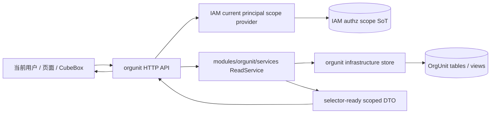

# DEV-PLAN-492：OrgUnit 基础模块架构收敛与 Selector-Ready Read Core 重构方案

**状态**: 已关闭（2026-05-05 CST）— 492 首期关闭口径已达成：ReadService 已承接 roots、children、search、普通 list/grid、ext list/grid、details/write scope check、versions/audit scope check 与 authz assignment 保存可见性校验；保存组织范围时未知或范围外 `org_node_key` 均通过 ReadService `Resolve` fail-closed 为 `authz_scope_forbidden`。`internal/server/orgunit_api.go` 中直接业务判断 helper 已删除，list/filter/sort/path hydration 等过渡 helper 已搬入 `orgunit_read_service_adapter.go` 并标注为 `orgUnitReadStoreAdapter` bridge；该 bridge 仅作为 ReadService store adapter 基础设施适配，不是 handler 业务读规则第二实现。`set-business-unit` 旧 store fallback 已删除，只保留 `OrgUnitWriteService` 主链路。491 Phase A/B/C/D 已消费该 contract；组织管理页浏览/编辑主树不归 491 强制替换，但其 `/org/api/org-units` 读取继续走 492 ReadService 后端链路。

## 0. 适用范围与评审分级

- **评审分级**：`T2`
- **范围一句话**：把 OrgUnit 作为基础模块重新收敛为一条统一的读核心、范围裁剪与 selector-ready DTO 契约，消除页面、handler、store 和前端组件中的多重组织读取实现，使 `DEV-PLAN-491` 及后续组织选择/范围配置类计划可以稳定复用。
- **关联模块/目录**：`modules/orgunit/**`、`modules/iam/**`、`internal/server/**`、`apps/web/src/api/**`、`apps/web/src/components/**`、`apps/web/src/pages/**`
- **关联计划/标准**：`AGENTS.md`、`DEV-PLAN-000`、`DEV-PLAN-001`、`DEV-PLAN-012`、`DEV-PLAN-015`、`DEV-PLAN-017`、`DEV-PLAN-019`、`DEV-PLAN-022`、`DEV-PLAN-032`、`DEV-PLAN-180`、`DEV-PLAN-451`、`DEV-PLAN-489`、`DEV-PLAN-489A`、`DEV-PLAN-490`、`DEV-PLAN-491`
- **用户入口/触点**：`组织架构` 页面、创建/编辑组织的上级组织选择、`授权管理 > 用户授权 > 组织范围`、CubeBox API-first orgunit 查询、后续任何需要选择或读取组织节点的页面/API

### 0.1 Simple > Easy 三问

1. **边界**：492 拥有 OrgUnit 基础模块的 read core、selector-ready DTO、scope-aware visible roots、安全展开路径与 handler 瘦身；489 拥有 IAM 组织范围 SoT 和 scope provider；491 拥有前端 selector/facade/页面接入；页面不得再各自实现组织候选读取规则。
2. **不变量**：同一租户内，组织节点读取、树展开、搜索、回显和候选选择只能走一条 OrgUnit ReadService 主链；当前 principal 的组织范围由服务端注入并 fail-closed；`internal/server` 只做协议解析、tenant/authz/session 注入和错误映射，不承载业务读规则。
3. **可解释**：调用者带着当前 session 发起 orgunit roots/children/search/回显读取；server 从 489 scope provider 取当前 principal 可见范围，交给 `modules/orgunit/services` ReadService；ReadService 返回统一 `OrgUnitReadNode`/selector-ready DTO；页面和 CubeBox 只消费结果，不自行补权限或拼物理树。

### 0.2 现状研究摘要

- `用户授权 > 组织范围` 已在 491 Phase C 从直接调用 `listOrgUnits({ asOf, includeDisabled:false })` 的一级下拉切到 [OrgUnitTreeField](/home/lee/Projects/Bugs-And-Blossoms/apps/web/src/pages/authz/AuthzRolePages.tsx:617)；创建组织与组织详情编辑上级组织也已在 491 Phase D 切到同一 selector。候选读取由 491 facade 消费 492 ReadService contract，保存 payload 仍沿用 489。
- 已完成的后端收敛：orgunit list response 的 `OrgNodeKey` 已从隐藏字段改为 `org_node_key` response 字段，并新增 `has_visible_children`；491 已新增 [orgUnitSelector facade](/home/lee/Projects/Bugs-And-Blossoms/apps/web/src/api/orgUnitSelector.ts:1) 消费这些 selector-ready 字段。原 [OrgUnitAPIItem](/home/lee/Projects/Bugs-And-Blossoms/apps/web/src/api/orgUnits.ts:3) 仍服务组织管理页既有 API client；与此同时 `orgUnits.ts` 也已补齐 `org_node_key`、`has_visible_children` 与详情回显所需的 `parent_org_node_key`。普通 list/grid 与 ext 字段 list/grid HTTP 分支均已接入 `OrgUnitReadService.List`。
- 已完成的 roots/children/search/list 收敛：`GET /org/api/org-units` 默认 roots、children、普通 list/grid 与 ext 字段 list/grid 查询已通过 `modules/orgunit/services.ReadService` 返回当前 principal scope-aware 结果；`GET /org/api/org-units/search` 已通过同一 ReadService 返回 safe `path_org_codes`。list/grid 已通过 adapter page 原语将当前 scope 可见性、filter/sort、count 与 limit/offset 合并到 store pager 主链；ext list/grid parent 范围外会 fail-closed，adapter 会在 page rows 转换前补齐 scope path。
- 组织页已有可复用素材：通用 [TreePanel](/home/lee/Projects/Bugs-And-Blossoms/apps/web/src/components/TreePanel.tsx:1)、组织页面树状态、懒加载与搜索定位链路；491 已把选择场景沉淀为 [OrgUnitTreeSelector 组件族](/home/lee/Projects/Bugs-And-Blossoms/apps/web/src/components/OrgUnitTreeSelector.tsx:1)。组织管理页创建/详情上级组织这些选择入口已消费 selector；浏览/编辑主树可以保留现有 UI，其 `listOrgUnits()` 读取仍是组织管理页主树浏览/编辑入口，不属于 491 强制替换范围，但后端已继续走 492 ReadService 链路。
- 489 已实现当前 principal 组织范围 provider，例如 [OrgScopesForPrincipal](/home/lee/Projects/Bugs-And-Blossoms/internal/server/authz_runtime_store.go:330)；492 已把 authz assignment 保存阶段的当前操作者组织可见性校验改为通过 ReadService `Resolve`，未知或范围外目标统一返回 `authz_scope_forbidden`，避免 authz handler 自行构造 path/scope 判断。
- 490/491 的局部修复补齐了部分 parser 与 search 行为，但它们不能替代基础模块重构。492 的职责是把这些局部行为收口成可维护的架构边界，避免“某个页面能用，另一个页面重新造”的后续漂移。

## 1. 背景与上下文

OrgUnit 已经不是一个只给组织管理页使用的普通页面模块。它同时承担：

1. HR 基础主数据的组织节点事实。
2. IAM 组织范围授权的空间维度。
3. CubeBox API-first 查询的可见数据边界。
4. 前端组织选择器、上级组织选择、组织范围配置等交互的候选来源。

因此，组织架构模块若继续由页面、handler、store 和局部 API client 分别解释“根节点、子节点、搜索、路径、范围裁剪”，就会直接阻塞 491 以及后续范围配置类计划：

1. selector 无法稳定拿到 `org_node_key`。
2. visible roots 与物理 roots 混淆。
3. 搜索路径可能泄露当前范围外祖先，或无法正确展开。
4. 用户授权页、组织管理页、创建组织表单和 CubeBox 查询各走一套组织读取心智。
5. `internal/server` 持续承载业务规则，DDD 分层难以继续收敛。

本计划不是新增一个 selector 专用后端 route，也不是在用户授权页补一个下拉参数；它是把 OrgUnit 基础模块本身整理成可复用、可测试、可被 491 消费的 read core。首期 HTTP 读取面仍复用现有 `/org/api/org-units` 与 `/org/api/org-units/search`；`Resolve` 是 ReadService 内部回显/按 code 定位能力，除非另行更新 `DEV-PLAN-017`、authz requirement、capability registry 与 API catalog owner 文档，否则不得新增独立 resolve route。

## 2. 目标与非目标

### 2.1 核心目标

1. [X] 新增或重组 `modules/orgunit/services` 中的模块级 `ReadService`，统一承接 list、visible roots、children、search、内部 resolve-by-code、path 解析与 selector-ready DTO 构造。（2026-05-05：roots/children/search/list/details/write/versions/audit 与 authz assignment 保存可见性校验均已通过 ReadService `List` 或 `Resolve`；空 scope 特例语义已从 handler helper 下沉到 ReadService。）
2. [X] 冻结 `OrgUnitReadNode` / selector-ready DTO：必须包含 `org_code`、`org_node_key`、`name`、`status`、`has_visible_children` 或等价字段，以及按场景返回的 `path_org_codes`。（2026-05-04：后端 DTO 与 HTTP list 字段已落地；491 facade 已补 `OrgUnitSelectorNode` 并消费 roots/children/search。）
3. [X] 把 roots 语义从“物理根组织过滤”收敛为“当前 principal scope-aware visible roots”：当前用户可见范围从树中段开始时，该范围入口就是 selector root，不向上泄露物理祖先。
4. [X] 冻结 search/内部 resolve 的 `path_org_codes` 为 safe expandable path：只包含当前 principal 可见且前端可展开的节点；无法安全构造时 fail-closed。（2026-05-04：search HTTP 已验证 safe path 从 visible root 开始。）
5. [X] 让 `internal/server` 从 orgunit 业务读规则中退出，只负责 HTTP query/body 解析、tenant/session/authz/scope 注入、事务边界和错误映射。（2026-05-05：handler/authz 中直接 path/scope 业务判断已退场；`orgunit_api.go` 不再承载 list/filter/sort/path hydration adapter bridge，details/versions/audit 目标定位统一通过 ReadService `Resolve`；剩余 bridge 位于 `orgunit_read_service_adapter.go`，仅作为基础设施适配，不作为 handler 判断入口。）
6. [X] 删除或统一仓内多重组织读取实现，尤其是页面直接 `listOrgUnits()` 拼候选、组织管理页自有业务读取规则、handler 自建规则、PG list/fallback list 分叉和 legacy 写分支；组织管理页可以保留浏览/编辑状态机，但数据读取必须复用 492 ReadService。（2026-05-05：用户授权页候选拼装已删除；`OrgUnitsPage` 主树 `listOrgUnits()` 属于组织管理页浏览/编辑读取，不强制改 selector，后端继续走 492 ReadService；`set-business-unit` 旧 store fallback 已删除，只保留 `OrgUnitWriteService` 主链路。）
7. [X] 为 491 提供稳定后端前置：前端 selector/facade 不需要在页面侧补 `org_node_key`、权限裁剪、根节点语义或路径安全逻辑。（2026-05-05：491 facade/组件已消费 492 DTO；直接提交未知或范围外组织由服务端 fail-closed。）

### 2.2 非目标

1. 不在本计划直接实现 491 的前端 `OrgUnitTreeSelector`、picker dialog 或用户授权页 UI 切换；这些由 491 承接。（2026-05-04：491 已完成 facade、最小组件骨架与用户授权页首个接入。）
2. 不新增 OrgUnit 数据库主表或重做迁移；若后续实现发现必须新建表，必须另行更新计划并再次获得用户手工确认。
3. 不引入 Redis、搜索引擎、外部缓存库或离线整树缓存；首期继续以 PostgreSQL + Go + request-scope/短 TTL 可控复用为边界。
4. 不恢复 SetID、legacy、scope/package、`org_level/scope_type/scope_key` 或旧策略模块语义。
5. 不把 IAM 组织范围 SoT 搬入 OrgUnit；OrgUnit 只消费 489 提供的当前 principal scope，不拥有授权绑定事实。
6. 不把 selector 做成通用“组织浏览器/审计器/拖拽编辑器”；492 只提供基础读核心，491 只提供选择交互。组织管理页继续拥有浏览、列表、详情与编辑交互，后续只替换其散落读取规则和可复用展示组件，不强制消费 selector 作为主页面壳层。

### 2.3 用户可见性交付

- **直接用户可见变化**：492 本身主要是基础模块重构；用户可见闭环通过 491 体现为组织树选择器可选非根节点、可搜索、可按当前范围裁剪。
- **后端先行验收**：即使前端 selector 尚未切换，orgunit list/children/search HTTP contract 与 ReadService 内部 resolve 测试也必须证明 visible roots、`org_node_key`、safe path 和 scope 裁剪已经统一。
- **避免僵尸功能**：492 交付后必须被 491 的 selector facade 实际消费；不得长期停留在“新服务已存在但页面仍用旧下拉”的状态。

### 2.4 关键假设、排除解释与未决问题

#### 2.4.1 关键假设

1. 当前 OrgUnit 读核心可以在不新增 OrgUnit 主表、不新增 selector 专用 HTTP route 的前提下完成首期收敛。（2026-05-04：491 facade 复用现有 `/org/api/org-units` 与 `/org/api/org-units/search`，未新增 selector route。）
2. `DEV-PLAN-489` 已提供当前 principal 的组织范围 SoT/provider；492 只消费该事实，不重新定义 IAM 范围绑定模型。
3. 首期可复用现有 `/org/api/org-units` 与 `/org/api/org-units/search` 对外 HTTP 面；外部 route 形态保持稳定，内部读语义收敛到 ReadService。
4. `org_code` 继续作为用户可读业务编码；`org_node_key` 作为服务端稳定节点身份，必须进入 selector-ready response，用于保存、回显、path 与 scope 校验。
5. `all_org_units=true` 若继续保留，只能表示“当前调用者可见范围内全部组织”；`total` 与分页也以 scope 裁剪后的结果为准。

#### 2.4.2 被排除解释

1. 不把 `all_org_units=true` 解释为绕过当前 principal scope 的全租户读取。
2. 不把 selector 做成“前端先拿全租户树，再本地裁剪”的权限模型。
3. 不把管理员配置他人组织范围解释为 impersonation；selector 候选仍按当前调用者可见范围裁剪。
4. 不把 `Resolve` 暴露为独立 HTTP route；首期仅作为 ReadService 内部回显/定位能力。
5. 不把组织管理页浏览/编辑主 UI 改造成 selector；它只需要复用同一 read core。

#### 2.4.3 未决问题

1. 若实现发现现有 schema 无法支持索引友好的 scoped query，应先补充调查与计划更新，不得直接新增表或迁移。
2. 若 491 后续确实需要批量回显多个 `org_code/org_node_key`，必须先更新本计划、491、`DEV-PLAN-017`、authz requirement、capability registry 与 API catalog owner 文档，再考虑新增 route。
3. 若 `has_children` 与 `has_visible_children` 需要同时服务组织管理页与 selector，应优先拆字段而不是复用同名字段承载两种语义。

## 2.5 工具链与门禁

- **命中触发器（首期关闭口径）**：
  - [X] Go 代码
  - [X] Authz / scope provider 消费
  - [X] 文档 / readiness / 证据记录
  - [X] `ddd-layering-p0/p2`、`no-legacy`、`granularity`

未命中首期触发器、不计入关闭剩余项：

- `apps/web/**` / presentation assets / 生成物：492 首期为后端 read core 收口；前端 selector 消费由 491 承接并已完成。
- i18n：492 首期未新增用户可见错误文案。
- Routing / responder / allowlist：492 首期复用既有 `/org/api/org-units` 与 `/org/api/org-units/search`，未新增 route。
- AuthN / Tenancy / RLS：492 首期消费既有 session/tenant/RLS 边界，未调整其契约。
- E2E：用户可见联合 E2E owner 由 491 承接；本轮 492 文档关闭不新增 E2E 场景。

实际命令入口以 `AGENTS.md`、`Makefile` 与 CI 为准。本计划只冻结架构契约，不复制命令矩阵。

## 2.6 测试设计与分层

| 层级 | 本计划承接内容 | 代表对象/文件 | 说明 |
| --- | --- | --- | --- |
| `modules/orgunit/domain` | org code/node key、路径、可见根判断等纯规则 | `modules/orgunit/domain/*_test.go` | 优先黑盒表驱动 |
| `modules/orgunit/services` | ReadService 的 visible roots、children、search、内部 resolve、safe path | `modules/orgunit/services/*_test.go` | 492 的核心测试面 |
| `modules/orgunit/infrastructure` | scoped query、事务/tenant/RLS、无 fallback 分叉的 store 实现 | `modules/orgunit/infrastructure/**` | 命中 DB 时补集成测试 |
| `internal/server` | query 解析、scope 注入、错误映射、HTTP contract | `internal/server/*_test.go` | 不重复测业务树规则 |
| `apps/web/src/api` | selector facade 对 492 DTO 的类型消费 | Vitest / 类型检查 | 2026-05-04：491 已新增 facade 与定向测试 |
| `E2E` | 用户授权 selector 与运行时 orgunit 查询一致 | `e2e/**` | 491/492 联合验收 |

并行测试仅用于无共享 DB、无全局状态的纯函数；涉及 session、租户、PG、RLS 或环境变量的测试不得随意 `t.Parallel()`。

## 3. 架构与关键决策

### 3.1 5 分钟主流程



主流程：

1. 调用者请求 orgunit roots/children/search；selector 回显需要按 code 定位时，由现有读取面或 491 已冻结的搜索/assignment 回显路径进入 ReadService 内部 `Resolve`，首期不新增独立 HTTP route。
2. `internal/server` 完成 session、tenant、authz requirement、query 解析，并向 489 scope provider 获取当前 principal 组织范围。
3. `internal/server` 将标准化 read request 和 scope filter 传给 `modules/orgunit/services.ReadService`。
4. ReadService 调用 orgunit store，统一计算 visible roots、可见子节点、搜索候选、`org_node_key` 与 safe expandable path。
5. handler 只把 DTO 映射成 HTTP response，错误统一走现有 responder。

失败路径：

1. 无 orgunit read capability：返回授权拒绝。
2. 当前 principal 无组织范围且该能力需要 organization scope：fail-closed，不回退全租户。
3. parent/search/内部 resolve 目标超出当前可见范围：不返回半截物理路径，不返回范围外祖先。
4. 查询结果存在多重候选且无法唯一确定安全路径：返回明确错误或多候选澄清，不能随机选第一个。

### 3.2 模块归属与职责边界

- **`modules/orgunit/domain` owner**：
  - 组织节点身份、路径、状态、可见根判断所需的纯规则。
- **`modules/orgunit/services` owner**：
  - OrgUnit ReadService。
  - list/roots/children/search/内部 resolve/path 的业务读语义。
  - selector-ready DTO 的模块级来源。
- **`modules/orgunit/infrastructure` owner**：
  - PostgreSQL 查询、事务、租户注入、RLS、索引友好的 scoped query。
  - 不保留第二套 fallback list 语义。
- **`modules/iam` / 489 owner**：
  - 当前 principal 的组织范围 SoT、scope provider、scope 合并规则。
  - 不拥有组织树读取规则。
- **`internal/server` owner**：
  - HTTP 协议适配、authz requirement、tenant/session/current principal 注入、错误映射。
  - 不再拥有 orgunit 根节点、路径、搜索候选或可见子树业务规则。
- **491 owner**：
  - 前端 selector facade、组件族与页面接入。
  - 不在组件内实现权限裁剪或物理树修补。

### 3.3 ReadService 契约草案

后续实现可按现有代码风格调整命名，但职责必须保持单主源：

```go
type ReadService interface {
    VisibleRoots(ctx context.Context, req OrgUnitReadRequest) ([]OrgUnitReadNode, error)
    Children(ctx context.Context, req OrgUnitChildrenRequest) ([]OrgUnitReadNode, error)
    Search(ctx context.Context, req OrgUnitSearchRequest) ([]OrgUnitReadNode, error)
    Resolve(ctx context.Context, req OrgUnitResolveRequest) ([]OrgUnitReadNode, error)
}
```

约束：

1. 所有 request 必须显式携带 tenant、as-of day、current principal scope filter、include disabled 策略和调用场景。
2. ReadService 是业务读规则入口；store 只执行查询，不决定“selector root 是谁”。
3. `all_org_units=true` 若继续存在，只能表示“当前调用者可见范围内全部组织”，不得绕过 scope filter。
4. `has_children` 对 selector 场景必须表达“是否存在可见子节点”；如仍需物理子节点信息，必须使用不同字段名，避免 UI 展开后空结果。
5. `Resolve` 首期是服务内契约，用于 selector 回显、按 code/id 标准化和 safe path 构造；HTTP 层必须先复用现有 `/org/api/org-units`、`/org/api/org-units/search` 或 489 assignment 响应中的回显数据。若后续需要批量 resolve route，必须先更新本计划、491、`DEV-PLAN-017`、authz requirement、capability registry 与 API catalog owner 文档。

### 3.4 ReadService 字段级契约

命名可以随实现微调，但字段语义必须保持一致，且不得把业务判断留在 handler：

```go
type OrgUnitReadScopeFilter struct {
    PrincipalID string
    Scopes []OrgUnitScope
}

type OrgUnitScope struct {
    OrgNodeKey string
    IncludeDescendants bool
}

type OrgUnitReadRequest struct {
    TenantID string
    AsOf string
    ScopeFilter OrgUnitReadScopeFilter
    IncludeDisabled bool
    Page int
    PageSize int
    SortField string
    SortOrder string
    ExtFilterFieldKey string
    ExtFilterValue string
    Caller string
}

type OrgUnitChildrenRequest struct {
    TenantID string
    AsOf string
    ScopeFilter OrgUnitReadScopeFilter
    ParentOrgCode string
    ParentOrgNodeKey string
    IncludeDisabled bool
    Caller string
}

type OrgUnitSearchRequest struct {
    TenantID string
    AsOf string
    ScopeFilter OrgUnitReadScopeFilter
    Query string
    IncludeDisabled bool
    Limit int
    Caller string
}

type OrgUnitResolveRequest struct {
    TenantID string
    AsOf string
    ScopeFilter OrgUnitReadScopeFilter
    OrgCodes []string
    OrgNodeKeys []string
    IncludeDisabled bool
    Caller string
}
```

字段约束：

1. `TenantID`、`AsOf`、`ScopeFilter` 为必填；缺失 scope 时按当前 authz capability 语义 fail-closed，不默认全租户。唯一兼容口径是租户组织树尚未初始化时由 ReadService 返回空列表/空 roots；一旦存在组织数据，空 scope 必须返回 `ErrOrgUnitReadScopeRequired` 并由 handler 映射为授权拒绝。
2. `Caller` 只用于区分 selector、组织管理页、CubeBox 等读取场景的允许字段和错误映射，不允许成为权限旁路。
3. `ParentOrgCode` 与 `ParentOrgNodeKey` 若同时提供，必须解析到同一节点；冲突时返回明确错误。
4. `Page` / `PageSize` 的分页对象是 scope 裁剪后的结果集；不允许先按物理树分页再裁剪。
5. `SortField`、`ExtFilterFieldKey` 等 query 参数只表达列表展示语义，不参与权限扩大。
6. `Resolve` 返回值只服务回显与 safe path 构造；首期不新增 HTTP endpoint。

ReadService store 依赖可以按本仓现有 port 风格拆分，但至少应把以下能力作为 store 侧原语，而不是把 SQL 拼装散回 handler：

1. 按 `org_node_key/org_code/as_of` 解析节点。
2. 按 scope-aware 条件列出 visible roots。
3. 按父节点列出可见直接子节点。
4. 按 query 搜索候选并返回节点身份与物理路径事实。
5. 按 node key 批量解析 org code/name。

### 3.5 统一 DTO 契约

模块级 DTO 至少包含：

```json
{
  "org_code": "SH",
  "org_node_key": "orgnode_...",
  "name": "上海分部",
  "status": "active",
  "has_visible_children": false,
  "path_org_codes": ["BLOSSOM", "EAST", "SH"]
}
```

约束：

1. `org_code` 是页面、API client 和保存 payload 的可读业务编码。
2. `org_node_key` 是服务端稳定节点身份，必须进入 selector-ready response，不再 `json:"-"` 隐藏。
3. `path_org_codes` 只在 search/内部 resolve/回显需要时返回；语义是 safe expandable path，不是数据库物理完整祖先路径。
4. disabled 节点默认不作为可选候选；若管理页面确需包含 disabled，必须通过显式 request 选项，并仍受当前 scope 裁剪。
5. 列表响应的 `total` 必须表示 scope 裁剪后的总数；如果返回分页信息，`page/size/total` 必须与可见结果一致。

### 3.6 Visible Roots 算法口径

visible roots 不是物理 root，也不是全租户 root。

1. 若当前 principal 可见范围是全租户，visible roots 可以等同当前租户物理 roots。
2. 若当前 principal 范围为 `BLOSSOM(include_descendants=true)`，visible roots 从 `BLOSSOM` 开始，不返回其物理祖先。
3. 若当前 principal 范围包含多个不相交节点，visible roots 是这些可见子树中的最小入口集合。
4. 若某节点的父节点不可见，则该节点可以成为 visible root。
5. 搜索命中深层节点时，`path_org_codes` 从对应 visible root 开始，不能补齐范围外祖先。

算法约束：

1. 先规范化当前 principal 的 scope 集合，删除空 `org_node_key`，对不存在或跨租户节点 fail-closed。
2. 对 `include_descendants=true` 的 scope，若其祖先 scope 已覆盖该节点，则删除被覆盖的子 scope，避免重复 roots。
3. 对 `include_descendants=false` 的 scope，该节点自身可见；若它被某个祖先 descendant scope 覆盖，也不重复返回。
4. visible roots 是规范化 scope 集合中“没有可见父节点”的最小入口集合；它可能是物理根、物理树中段节点或叶子节点。
5. `has_visible_children` 必须基于当前 scope 与 `include_disabled` 后的可见直接子节点计算，不得复用物理 `has_children`。
6. safe path 从对应 visible root 开始，到目标节点结束；如果无法构造完整可展开路径，search/resolve 必须 fail-closed。
7. 对多个不相交 visible roots，search 命中哪个可见子树，就返回该 visible root 开始的路径；不得返回另一棵子树或物理全路径。

示例：

| 当前 scope | 物理路径 | visible roots | 搜索 `SH` 的 safe path |
| --- | --- | --- | --- |
| `ROOT(include_descendants=true)` | `ROOT > BLOSSOM > EAST > SH` | `ROOT` | `ROOT > BLOSSOM > EAST > SH` |
| `BLOSSOM(include_descendants=true)` | `ROOT > BLOSSOM > EAST > SH` | `BLOSSOM` | `BLOSSOM > EAST > SH` |
| `EAST(include_descendants=true)` | `ROOT > BLOSSOM > EAST > SH` | `EAST` | `EAST > SH` |
| `SH(include_descendants=false)` | `ROOT > BLOSSOM > EAST > SH` | `SH` | `SH` |
| `FLOWERS(include_descendants=true)` | `ROOT > BLOSSOM > EAST > SH` | `FLOWERS` | 不命中或授权拒绝 |

### 3.7 分页、排序与 total 语义

1. 所有 list/grid 响应的 `total` 必须按当前 principal scope、`as_of`、`include_disabled`、filter 条件裁剪后计算。
2. 分页必须作用于裁剪后的结果集；不得先查物理页再在 Go handler 中过滤，因为这会产生空页、错页和 total 漂移。
3. 首期允许为了降低风险保留 Go 内存过滤作为临时实现细节，但对外语义必须等价于 scoped query；若无法证明等价，必须停在计划更新。
4. `all_org_units=true` 与普通 roots/children/list 使用同一 scope 过滤事实；差异只在列表形态，不在权限范围。
5. 若 scoped pagination 的 SQL 复杂度明显超出当前范围，应先交付 roots/children/search/resolve 的正确性，再单独起计划处理高级 grid 查询，不得把未验证的复杂 SQL 混入首期。

### 3.8 多重实现统一清单

| 当前实现/症状 | 统一方向 | Owner |
| --- | --- | --- |
| 用户授权页直接 `listOrgUnits()` 一级下拉 | 已由 491 Phase C 切换为 `OrgUnitTreeField`；数据来自 492 ReadService | 491/492 |
| 组织管理页自有业务读取规则、搜索定位与懒加载取数 | 492 提供同一 read core；491 只抽取可复用选择组件，不接管组织浏览/编辑主页面 | 491/492 |
| 创建/编辑组织时上级组织编码手填或局部下拉 | 已由 491 Phase D 切到 selector | 491 |
| `internal/server` 自建 root/search/path 业务规则 | 下沉到 `modules/orgunit/services.ReadService` | 492 |
| 物理 root SQL 与 visible root 语义混用 | ReadService 统一计算 scope-aware visible roots | 492 |
| PG list 与 fallback list 分叉 | infrastructure 只保留一条 scoped query 主链 | 492 |
| store/handler 中 legacy 或兼容写分支 | 按 no-legacy 原则删除或前移为明确不变量 | 492 |
| 前端 DTO 缺 `org_node_key` | 492 后端 response 暴露，491 facade 类型消费已落地；`orgUnits.ts` 也已补齐 selector 回显所需字段，组织管理页旧浏览/编辑主树读取规则仍待后续收敛 | 492/491 |

### 3.9 退场清单

后续实现 PR 必须在说明中逐项标记以下对象的处理状态：已迁移 / 保留但降级为协议适配 / 后续 PR 处理。

1. `internal/server/orgunit_api.go` 中 roots、children、list、search、resolve/path、scope filter 的业务判断。
2. `internal/server/orgunit_nodes.go` 与 store 中只为 handler 兼容而存在的 fallback list/search 分支。
3. `apps/web/src/pages/authz/AuthzRolePages.tsx` 中基于 `listOrgUnits()` 的组织范围下拉候选。（2026-05-04：491 Phase C 已移除，改为 `OrgUnitTreeField`；assignment 缺 `org_name` 时用 `org_code` 回显。）
4. `apps/web/src/pages/org/OrgUnitsPage.tsx` 中组织管理页局部树读取、搜索定位与 path 展开规则。
5. `apps/web/src/api/orgUnits.ts` 中缺少 `org_node_key`、`has_visible_children` 与 selector-safe path 的 DTO 类型；491 已新增独立 `orgUnitSelector.ts` 消费 selector DTO，旧 `orgUnits.ts` 后续随组织管理页读取收敛再处理。
6. CubeBox orgunit 查询路径中任何绕过 orgunit HTTP/API 等价 read core 的直接读取。

保留规则：

1. `internal/server` 可以保留 HTTP query/body 解析、tenant/session/authz 注入、request 到 service request 的映射、responder 错误映射。
2. 组织管理页可以保留浏览、列表、详情、编辑状态机；它不能继续拥有组织读取事实。
3. 前端 selector facade 可以封装现有 HTTP API；它不能承载权限裁剪、物理树修补或管理员旁路。

### 3.10 2026-05-05 残留 helper 处置状态

1. `filterOrgUnitListItemsByReadScope`、`orgUnitReadScopeAllowsListItem`、`hydrateOrgUnitListItemScopePaths`、`orgUnitScopePathOrgNodeKeys`：保留并标注为 `orgUnitReadStoreAdapter` bridge，只为 list DTO 转换和 page row path hydration 服务；handler/authz 可见性判断不得直接调用。
2. `filterOrgUnitListItemsByCurrentScope`、`filterOrgUnitListItemsByPrincipalScope`、`ensurePrincipalOrgScopeAllows`、`ensurePrincipalOrgCodeScopeAllows`、`ensurePrincipalOrgNodeScopeAllows`、`ensureCurrentPrincipalOrgScopeAllowsResult`：已删除；对应 versions/audit/write/details/authz assignment 校验改用 ReadService `Resolve`。
3. `orgUnitScopeRequiredEmptyList`：已删除；“租户尚未初始化组织树时空 scope 返回空列表”的兼容口径由 ReadService `List` / `VisibleRoots` 承接，组织树已初始化后的空 scope 继续 fail-closed。

## 4. 分阶段实施

### 4.1 P0：契约冻结与文档联动

1. [X] 新增本计划，明确 492 是 OrgUnit 基础模块 read core 与架构统一 owner。
2. [X] 更新 491，使其退回 selector/facade/页面接入 owner，不继续承接后端读核心重构。
3. [X] 更新 489，明确 IAM scope SoT/provider 与 OrgUnit read core 的边界。
4. [X] 更新 `AGENTS.md` Doc Map。

### 4.2 P1：ReadService 骨架与行为搬迁

1. [X] 盘点当前 `internal/server/orgunit*`、`modules/orgunit/**`、`apps/web/src/api/orgUnits.ts` 中的 list/children/search/内部 resolve/path 规则。（2026-05-04：已分批迁移 roots、children、search、普通 list/grid、ext 字段 list/grid、details scope check 与 write scope check；剩余局部 helper 后续处理。）
2. [X] 在 `modules/orgunit/services` 建立 ReadService 与 request/response 类型。
3. [X] 将 visible roots、children、search、内部 resolve/path 的业务判断从 handler 搬入 ReadService。（2026-05-05：visible roots、children、search、普通 list/grid、ext list/grid、details/write、versions/audit 与 authz assignment 保存校验均已复用 ReadService；内部 resolve 仍为服务内契约，不新增 HTTP route。）
4. [X] 建立 store 侧 scoped query/resolve 原语，handler 不再直接拼物理 root、path 或 scope 过滤规则。（2026-05-05：业务判断已下沉到 ReadService；`orgunit_api.go` 不再直接拼父级 resolve、root/search/path 或 scope 过滤规则；剩余 path/scope helper 位于 `orgunit_read_service_adapter.go`，仅作为 ReadService store adapter bridge。）
5. [X] 保持 HTTP 外部行为可控，避免同一 PR 混入前端 selector 大改。

### 4.3 P2：Selector-Ready DTO 与 scope-aware roots

1. [X] response 暴露 `org_node_key`，前端类型补齐 `org_node_key`。（2026-05-04：后端 response 已暴露；491 已新增 selector facade 类型消费。组织管理页旧 API 类型仍待后续替换。）
2. [X] 默认 roots 改为当前 principal scope-aware visible roots。
3. [X] `has_children` 收敛为 selector 场景可用的可见子节点判断，或拆分为明确字段。（2026-05-04：已新增 `has_visible_children` 并在 roots/children 响应中返回；ReadService list 测试已覆盖物理子节点存在但不在当前 scope 时不得标记为可见子节点。）
4. [X] `all_org_units=true` 与默认 list 都不得突破当前 principal scope。（2026-05-04：HTTP contract 已补 `all_org_units=true` + pagination scoped total 测试。）
5. [X] list/grid 的 `total` 与 pagination 以 scope 裁剪后的结果为准。（2026-05-04：普通 list/grid 与 ext 字段 list/grid 已通过 ReadService `List` 进入 adapter page 原语；scope 裁剪、filter/sort、count 与 limit/offset 已下推到 store pager，ext parent 范围外 fail-closed，adapter 会补齐 page row path。）

### 4.4 P3：Search / Resolve / Safe Path

1. [X] search 统一由 ReadService 处理候选过滤、多候选澄清和 safe path 构造。
2. [X] 服务内 resolve-by-code 支持 selector 回显，并对范围外目标 fail-closed；首期 HTTP 不新增独立 resolve route。
3. [X] `path_org_codes` 不返回当前 principal 范围外祖先。
4. [X] 对“物理路径可达但安全路径不可构造”的场景返回明确错误。

### 4.5 P4：Handler 瘦身与 DDD 分层收敛

1. [X] `internal/server` 只保留协议适配、scope 注入、错误映射与 route wiring。（2026-05-05：`orgunit_api.go` 已删除旧 list/filter/sort/path helper 与 `set-business-unit` store fallback；handler 读取入口通过 ReadService `List`、`VisibleRoots`、`Children`、`Search`、`Resolve` 承接业务判断。）
2. [X] 删除 handler 中重复的 orgunit root/search/path 判断。（2026-05-05：重复 root/children/search/path 与 scope 过滤 helper 已从 `orgunit_api.go` 移出；保留内容仅为 `orgUnitReadStoreAdapter` bridge，且不作为 handler/authz 判断入口。）
3. [X] 按 `3.9 退场清单` 标注已迁移、保留适配和后续处理项。（2026-05-05：见 `3.10`。）
4. [X] 通过 `make check ddd-layering-p0` 与 `make check ddd-layering-p2` 阻断规则回流。

### 4.6 P5：491 消费与散落入口替换

1. [X] 491 selector facade 消费 492 DTO。（2026-05-04：`apps/web/src/api/orgUnitSelector.ts` 已消费 roots/children/search 的 `org_code`、`org_node_key`、`name`、`status`、`has_visible_children`、`path_org_codes`。）
2. [X] 用户授权页组织范围切换为 selector。（2026-05-04：491 Phase C 已切换为 `OrgUnitTreeField`，页面内 `listOrgUnits()` 一级候选已移除。）
3. [X] 组织管理页逐步替换局部业务读取规则；创建/详情编辑上级组织等“选择入口”已替换为 selector，普通 list/grid 与 ext 字段 list/grid 读取已接入 ReadService `List`，details/write/versions/audit scope checks 已复用 ReadService `Resolve`；组织管理页浏览/编辑主树 UI 不归 491 强制替换，但读取链路继续由 492 承接。
4. [X] 删除不再使用的下拉候选拼装和局部树实现。（2026-05-05：用户授权页与上级组织选择入口的局部候选拼装已退场；组织管理页主树状态机按 491/492 边界保留，后端读取继续走 492 ReadService。）

### 4.7 P6：测试、门禁与证据

1. [X] 补 ReadService 单元测试：visible roots、children、search、内部 resolve、safe path、disabled、空范围。（2026-05-04：已覆盖 visible roots、children、search safe path、resolve 范围外 fail-closed、ext parent 范围外 fail-closed；本轮补齐空 scope fail-closed、disabled scope 按 `include_disabled` 可见性裁剪、list `has_visible_children` 只按 scoped candidates 判断。）
2. [X] 补 handler contract 测试：query 解析、错误映射、越权、范围外回显。（2026-05-05：已补 roots/list 空 scope 未初始化返回空、组织树初始化后空 scope fail-closed、versions/audit 范围外 fail-closed、assignment 保存范围外/未知 `org_node_key` fail-closed；独立 resolve HTTP route 仍按 stopline 不新增。）
3. [X] 补更广 491/492 联合 E2E：受限管理员只能选择自己可见范围内的非根节点并保存。（2026-05-04：`dev491` E2E 已覆盖用户授权页、组织创建页与组织详情页编辑父组织的 selector 可见范围；范围外搜索不可见，用户授权直接保存、创建范围外 parent、详情更正范围外 parent 均由服务端 `authz_scope_forbidden` fail-closed。）
4. [X] 执行命中的 `AGENTS.md` 门禁，并把结果写入实现 PR 或 `docs/dev-records/DEV-PLAN-492-READINESS.md`。

## 5. 停止线

1. 若实现需要新增 OrgUnit 主表、IAM scope 表、迁移或 sqlc query，必须先更新计划并获得用户手工确认。
2. 若实现需要新增 `/org/api/org-unit-selector/*`、批量 resolve route 或其他受保护 API，必须先更新本计划、491、`DEV-PLAN-017`、authz requirement、capability registry 与 API catalog owner 文档。
3. 若无法证明 `path_org_codes` 从 visible root 开始且不泄露范围外祖先，停止实现并补测试/设计。
4. 若发现必须在前端 selector/facade 中做权限裁剪、全树本地缓存或管理员旁路，停止实现并回到 489/491/492 边界评审。
5. 若 scoped pagination 只能靠“物理分页后过滤”实现且对外 total/page 不一致，停止实现并拆分计划；不得把不稳定分页作为首期验收。
6. 若需要引入 Redis、搜索引擎、外部缓存库或异步索引任务，停止实现并按缓存外部依赖准入另起计划。
7. 若出现 SetID、legacy、scope/package、`org_level/scope_type/scope_key` 或第二套组织范围语义回流，停止实现并先修正方案。
8. 若实现过程中发现组织管理页必须被 491 selector 接管才能完成 492，停止实现；492 只拥有 read core，不拥有组织管理页主 UI 重做。

## 6. 验收标准

1. [X] orgunit roots API 在受限 principal 下返回 visible roots，而不是物理 roots。
2. [X] orgunit list/children/search HTTP response 与 ReadService 内部 resolve 结果可提供 selector 所需 `org_node_key`。（2026-05-04：roots/list/children/search HTTP 已提供；491 facade 已完成前端消费。）
3. [X] 搜索当前范围内深层节点时，`path_org_codes` 从 visible root 开始，不泄露范围外祖先。
4. [X] 搜索或回显范围外节点 fail-closed，不返回半截路径、物理完整路径或空权限旁路。
5. [X] `internal/server` 中不再保留可见根、路径、安全候选等业务读规则的第二实现。（2026-05-05：`orgunit_api.go` 已删除重复 helper；`orgunit_read_service_adapter.go` 中仅保留 ReadService store adapter bridge，作为基础设施适配，不作为业务读规则第二入口。）
6. [X] 用户授权页和后续组织选择入口通过 491 facade 消费同一 OrgUnit read core；组织管理页的浏览/编辑读取也复用 492 ReadService，但不强制以 selector 作为主页面实现。（2026-05-05：用户授权页、创建组织上级组织、详情编辑上级组织均走 491 selector；组织管理页主树 `listOrgUnits()` 仍是浏览/编辑读取入口，后端走 492 ReadService。）
7. [X] `all_org_units=true` 只表示当前调用者可见范围内全部组织。
8. [X] list/grid 的 `total` 与分页结果基于 scope 裁剪后的结果集，不出现空页、错页或 total 漂移。（2026-05-04：HTTP contract 已锁定；普通 list/grid 与 ext 字段 list/grid 已接入 ReadService `List`；ext parent scope 与 adapter path 补齐已补回归测试；SQL 级 scoped pagination 已完成。）
9. [X] `has_visible_children` 或等价字段表达可见子节点，不误用物理子节点状态。（2026-05-04：roots/children 已返回 `has_visible_children`；本轮补 `OrgUnitReadService.List` scoped candidates 测试，覆盖物理 child 不等于可见 child。）
10. [X] 实现 PR 按 `3.9 退场清单` 标注散落实现的迁移结果。（2026-05-05：见 `3.10`；CubeBox 查询仍按 489/490 API-first 路径口径持续验收。）
11. [X] 无 SetID、legacy、scope/package、`org_level/scope_type/scope_key` 语义回流。

## 7. 文档联动

1. [X] `DEV-PLAN-491` 引用本计划，明确 492 是 OrgUnit read core、DTO、visible roots 与 safe path 的上游 owner。
2. [X] `DEV-PLAN-489` 引用本计划，明确 489 只拥有 IAM scope SoT/provider，不拥有 orgunit selector-ready read core。
3. 后续实现若新增/调整 route，必须同步 `DEV-PLAN-017`、authz requirement、capability registry 与 API catalog owner 文档；该条件性 stopline 不属于 492 首期关闭剩余项。
4. 后续实现若新增迁移、表或 sqlc query，必须按 `AGENTS.md` 触发数据库与 sqlc 门禁，并在实施前获得用户手工确认；该条件性 stopline 不属于 492 首期关闭剩余项。

## 8. 当前结论记录

- 2026-05-03 CST：确认 491 暴露的问题不是单一前端 picker 缺失，而是 OrgUnit 基础模块在 read core、visible roots、selector DTO、safe path 和多重实现收敛上的上游缺口。
- 2026-05-03 CST：冻结 492 为 OrgUnit 基础模块重构 owner；491 作为首个 selector 消费计划；489 保持 IAM scope SoT/provider owner。
- 2026-05-04 CST：按评审补齐两项边界：`Resolve` 首期为 ReadService 内部回显/定位能力，不新增独立 HTTP route；组织管理页复用 492 read core，但其浏览/编辑树不强制改造成 491 selector。
- 2026-05-04 CST：按 `DEV-PLAN-003` 进一步补齐假设/排除解释、ReadService 字段级契约、visible roots 算法、pagination/total 语义、退场清单与停止线，避免后续实现继续靠 handler/store/page 局部补洞。
- 2026-05-04 CST：PR-1/PR-2 后端先行切片已落地并验证：新增 `modules/orgunit/services.OrgUnitReadService` 骨架、fake-store 单元测试、`internal/server` adapter；默认 roots HTTP 已改为 scope-aware visible roots；list response 已暴露 `org_node_key` 与 `has_visible_children`。本轮未切换前端 selector，未完成 children/list/grid/search HTTP 全量迁移，也未收敛 scoped pagination/total。
- 2026-05-04 CST：PR-3 后端 contract 切片已落地并验证：默认 children/search HTTP 已接入 `OrgUnitReadService`；children 返回 `org_node_key` 与 `has_visible_children`；search 返回从 visible root 开始的 safe `path_org_codes`；`all_org_units=true` + pagination 的 HTTP total/page 已按 scope 裁剪结果计算。后续切片已完成 SQL 级 scoped pagination；组织管理页局部读取规则继续下沉，491 Phase A/B/C/D 已分批消费该 contract。
- 2026-05-04 CST：491 Phase A/B 前端首切已消费 492 contract：新增 selector facade 与 `OrgUnitTreeSelector` / picker / field 最小单选骨架，验证 roots/children/search facade URL 与组件懒加载、搜索路径展开、完整节点选择回调。该记录仅描述 Phase A/B 当时状态，后续 Phase C 已完成用户授权页首个接入。
- 2026-05-04 CST：491 Phase C 用户授权页首个接入已消费 492 contract：`AuthzRolePages.tsx` 组织范围行切到 `OrgUnitTreeField`，移除页面内 `listOrgUnits()` 一级候选，支持 selector 选中非根节点后按 489 payload 保存 `org_node_key/org_code/org_name`；评审修复已覆盖 assignment 缺 `org_name` 时用 `org_code` 回显。该记录描述 Phase C 当时状态；后续 Phase D 已完成创建/详情上级组织选择入口替换，普通 list/grid 与 ext 字段 list/grid 读取也已继续下沉到 ReadService。更广联合 E2E 已覆盖主要 selector 入口，SQL 级 scoped pagination 已完成。
- 2026-05-04 CST：491 Phase D 复用推广已完成：`OrgUnitsPage` 创建组织上级组织与 `OrgUnitDetailsPage` 编辑上级组织入口均切到 `OrgUnitTreeField`，详情 API 补 `parent_org_node_key` 供 selector 稳定回显；safe path 深层/跨分支验证已补。组织管理页浏览/编辑主树读取仍按 492 继续下沉，不并入 selector 强制替换范围。
- 2026-05-04 CST：普通 list/grid 读取下沉切片已落地：`OrgUnitReadService` 新增 `List`，统一在服务层处理 visible tree 收集、scope 裁剪、keyword/status/business-unit 过滤、排序与分页；`handleOrgUnitsAPI` 的非 ext list/grid 分支已改为消费 ReadService；`internal/server` adapter 已提供批量 tree 原语，避免普通 list/grid 使用递归 children 形成 N+1。该记录描述当时状态；后续 ext 字段 list/grid 查询已继续下沉。验证：`go test ./modules/orgunit/services ./internal/server -run 'TestOrgUnitReadServiceList|TestOrgUnitReadServiceSearch|TestOrgUnitReadServiceChildren|TestHandleOrgUnitsAPI_ListPaginationTotalUsesScopedResult|TestHandleOrgUnitsAPI_List|TestListOrgUnitListPage'`。
- 2026-05-04 CST：ext 字段 list/grid 查询下沉切片已落地：`OrgUnitListRequest` 新增 `ExtFilterFieldKey` / `ExtFilterValue` / `ExtSortFieldKey`，`handleOrgUnitsAPI` 不再为 ext 分支直接调用旧 store path 或在 handler 内二次 scope 裁剪/分页；`internal/server` adapter 新增 ReadService list page port，字段元数据查询与物理列校验仍由 store adapter 背后的基础设施查询承接。SQL scoped pagination 已在后续切片完成：scoped principal 下 list/grid 不再先拉候选全集后服务层分页。验证：`go test ./modules/orgunit/services`、`go test ./internal/server -run 'TestHandleOrgUnitsAPI_(Ext|BusinessUnit|AllOrgUnits)|TestOrgUnitReadService|TestListOrgUnitListPage|TestSortOrgUnitListItems|TestFilterOrgUnitListItems'`。
- 2026-05-04 CST：ext 字段 list/grid 查询评审修复已落地：ReadService ext list 在进入 page store 前校验 parent scope，范围外 parent fail-closed；adapter 在 page rows 转为 ReadService node 前补齐 `PathOrgNodeKeys`，避免 include-descendants scope 因底层 pager 缺 path 被误裁。验证：`go test ./modules/orgunit/services -run 'TestOrgUnitReadServiceListExtQuery'`、`go test ./internal/server -run 'TestOrgUnitReadStoreAdapterListPageHydratesScopePath|TestHandleOrgUnitsAPI_Ext|TestHandleOrgUnitsAPI_ListPaginationTotalUsesScopedResult'`。
- 2026-05-04 CST：details 读取 scope check 已继续下沉：`handleOrgUnitsDetailsAPI` 通过 `OrgUnitReadService.Resolve` 校验目标组织是否在当前 principal 可见范围内；范围外 details 请求 fail-closed 为 `403 authz_scope_forbidden`，空 resolve 结果不会进入 details 读取或触发 panic。验证：`go test ./modules/orgunit/services ./internal/server -run 'TestOrgUnitReadServiceResolve|TestHandleOrgUnitsDetailsAPI'`。
- 2026-05-04 CST：write scope check 已继续下沉：`ensureCurrentPrincipalOrgCodeScopeAllows` 通过 `OrgUnitReadService.Resolve` 判断目标组织或父组织是否在当前 principal 可见范围内，并显式使用写请求 `effective_date` 做 scope check，避免历史/测试日期被当前日期误裁。验证：`go test ./internal/server -run 'TestHandleOrgUnitsWriteAPI_CreateOrgSkipsNewOrgScopeCheckButChecksParent|TestHandleOrgUnitsAPI|TestHandleOrgUnitsBusinessUnitAPI|TestHandleOrgUnitsDetailsAPI'`。
- 2026-05-04 CST：ReadService 边界测试与 491/492 联合 E2E 已补一轮：`modules/orgunit/services` 覆盖空 scope fail-closed、disabled scope 按 `include_disabled` 裁剪、list `has_visible_children` 只按 scoped candidates 判断；`dev491` E2E 扩展到组织创建页与详情页父组织 selector，验证受限管理员只能搜索/选择可见组织，范围外直接提交被服务端 `authz_scope_forbidden` 拦截。过程中修正统一 write API 的 create scope 顺序：`create_org` 不要求尚未存在的新组织码已在当前 scope 内，但仍校验非空 parent 必须在当前 principal 可见范围内。验证：`go test ./modules/orgunit/services ./internal/server -run 'TestOrgUnitReadService|TestHandleOrgUnitsAPI|TestHandleOrgUnitsWrite|TestHandleOrgUnitsCorrections|TestHandleOrgUnitsDetailsAPI|TestHandlePrincipalAuthzAssignmentPutAPI'`、`npm --prefix apps/web test -- --run src/components/OrgUnitTreeSelector.test.tsx src/pages/org/OrgUnitsPage.test.tsx src/pages/org/OrgUnitDetailsPage.test.tsx`、`node --check e2e/tests/dev491-authz-org-selector-scope.spec.js`、`pnpm --dir e2e exec playwright test tests/dev491-authz-org-selector-scope.spec.js`、`git diff --check`。
- 2026-05-05 CST：P1/P2/P3 收口继续落地：authz assignment 保存校验改为通过 492 ReadService `Resolve` 判断当前操作者可见性，范围外或未知 `org_node_key` 均 fail-closed 为 `authz_scope_forbidden`；versions/audit scope check 也改用当前 principal + ReadService `Resolve`；`orgunit_api.go` 中旧 handler 业务 helper 已删除，仍保留 helper 标注为 adapter bridge；`orgUnitScopeRequiredEmptyList` 删除，空 scope 未初始化兼容下沉到 ReadService。验证通过：`go fmt ./... && go test ./modules/orgunit/services ./internal/server`、`make check ddd-layering-p0 && make check ddd-layering-p2`、`make check doc`、`git diff --check`。`pnpm --dir e2e exec playwright test tests/dev491-authz-org-selector-scope.spec.js` 本轮因本地 Kratos admin `127.0.0.1:4434` 未启动而 `ECONNREFUSED`，未形成业务断言结果。
- 2026-05-05 CST：P4/P5 handler 瘦身与 legacy 清理继续落地：`orgunit_api.go` 不再直接承载 list/filter/sort/path hydration adapter bridge，相关 helper 已移动到 `orgunit_read_service_adapter.go` 并继续标注为 adapter-only；`GET /org/api/org-units` 的 parent 解析不再由 handler 预先 resolve，统一交给 ReadService；details/versions/audit 的目标定位统一通过 ReadService `Resolve`；`set-business-unit` 旧 store fallback 已删除，仅保留 `OrgUnitWriteService` 主链路。验证通过：`go test ./modules/orgunit/services ./internal/server`、`make check ddd-layering-p0 && make check ddd-layering-p2 && make check no-legacy`。
- 2026-05-05 CST：492 首期关闭。核心目标、P0-P6、验收标准与现行文档联动均已完成；未命中的前端/i18n/routing/AuthN/Tenancy/RLS/E2E 触发器为本期未新增或由 491 承接的条件项，不作为关闭阻塞。后续新增 route、迁移、表或 sqlc query 时，必须重新打开对应 owner 计划并按停止线补齐文档、授权目录与用户手工确认。
